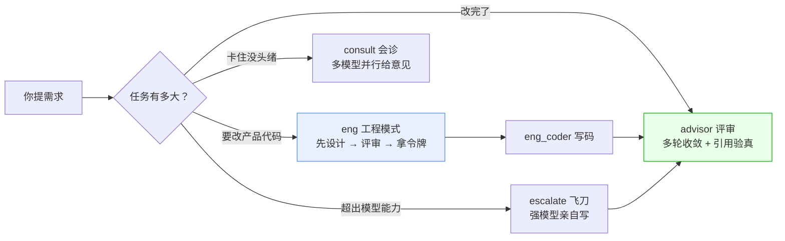
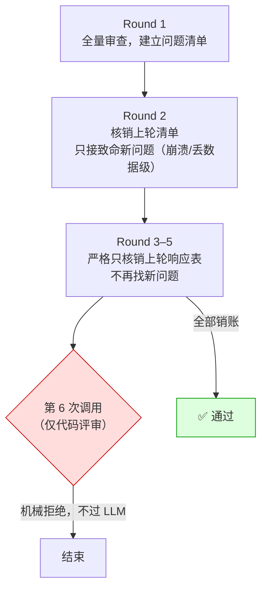
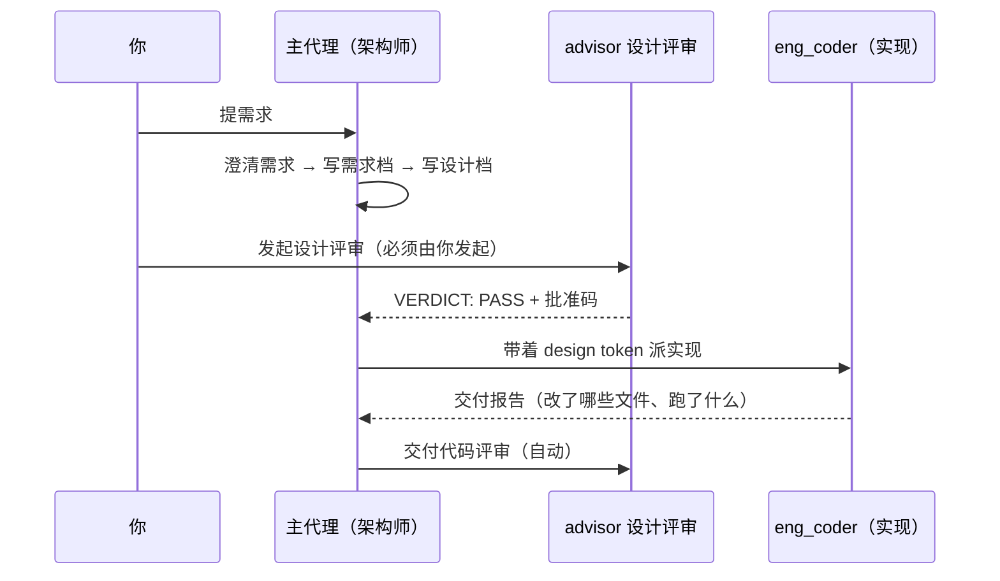
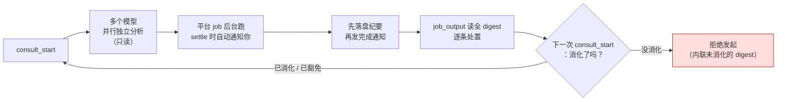
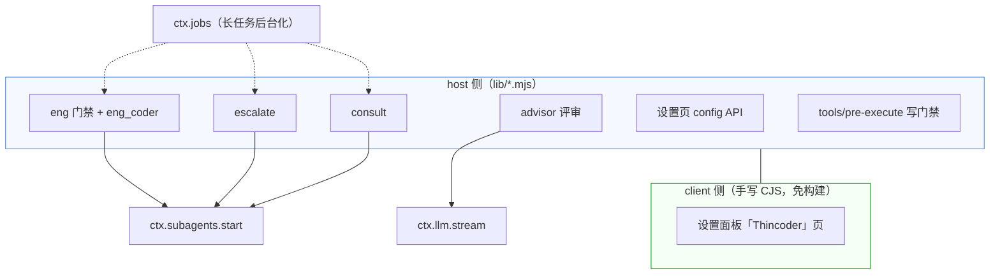

# dsh-thincoder-suite

[](./LICENSE)
[](https://github.com/topics/dsh-plugin)

**把「AI 写代码时的四条自我纪律」装进 [DSH（DeepSeek Harness）](https://deepseek.com)**——一个插件，四个工具，**不改 DSH 本体一行代码**。它是给 **DSH 本身**写的（本机那种「桌面壳」只是 DSH 的一种包装方式，插件不依赖壳）。

> 移植自开源项目 [thincoder](https://gitee.com/shanghai-xinbo/thincoder)（上游 MIT 协议），向上游贡献者致谢。

---

## 一句话：它替你挡掉哪四种翻车

| 你遇到过 | 这个插件怎么治 | 工具 |
|---|---|---|
| **AI 说「没问题了」，其实没审完**——评审循环停不下来，或者停下来时你也不知道它到底看没看你的改动 | **会终止、可对账**的评审：轮次有上限、每轮必须回一张「逐条对账表」，连引用行号都去磁盘上验真 | `advisor` |
| **代码写完了才发现方向错了** | **先设计、后写码**：没拿到「评审通过令牌」之前，写产品代码会被当场拦下 | `eng` / `eng_coder` |
| **模型能力不够，越改越烂** | **把活交给更强的模型亲自写**，写完给你一份术后报告，你验收 | `escalate` |
| **卡在同一个问题上反复失败** | **多个模型并行独立会诊**，各出各的结论，你逐条裁决 | `consult_start` |

**为什么这四个不是「又一套流程」**：它们的共同点是**每一条结论都要能被机械核对**——对账表、令牌、纪要、跑过的测试，都在磁盘上留痕。**不是靠信任模型，是靠留下可核对的痕迹。**



---

## 四个机制各自怎么跑

### ① advisor：把「无限找茬」变成「有界对账」

普通的 AI 复查看似在进步，实际有四个陷阱：**没有终止条件**（每轮都能报新问题）· **锚定效应**（复审会顺着上轮结论重复深化）· **证据不可验证**（报的行号可能是错的、旧的、编的）· **运动员兼裁判**（同一个模型审自己刚写的东西）。

本插件的做法：



四条配套的机械约束：

- **响应表协议**：被评审的一方每轮必须回 `| # | Action | Detail |`，Action 只有四个值（`Fixed` / `Dispatched` / `Not an issue` / `Deferred`），逐条对账。**`Dispatched` 只是「认领」不是「解决」**——派出去还没回来的 🔴，和没修的 🔴 同样算没过。
- **引用验真**：报告里每个 `文件:行号` 都去磁盘上比对，伪造引用直接标出来。
- **每轮全新上下文**：上一轮的输出以原文注入新会话——防止「顺着自己上轮的话往下说」。
- **轮次上限只对 code 评审生效**（Cap 只对 code 评审生效）：代码评审有 5 轮硬上限；**设计评审豁免上限**（设计文档天生要反复改，改文档→重评审正是本机制的本意），改由「**连续三次跑不出可用结论 ⇒ 拒绝再发起**」兜底，且**不可自解除**（改配置、改文件、重跑都不复位，唯一出口是新会话）。**两半必须成对**：只豁免 = 撤掉唯一的界；只护栏 = 设计评审仍被上限误杀。

### ② eng：没拿到令牌，写不了产品代码



- `eng` 工具开关工程模式；**进模式后，模型只能写文档**——`write` / `edit` 想动产品代码会被 `tools/pre-execute` 当场拦下（`docs/**` 与根级 `.md` 豁免，那是架构师的产出物）。
- **设计评审必须由你发起**，模型不能自己审自己、自己给自己发令牌。
- 令牌（design token）**跨重启有效**（存 `$DSH_HOME/.thincoder/design-tokens.json`），默认 7 天；**设计文档没变就自动续期**，文档改了才要重评。
- `eng_coder` 支持**结构化阶段任务书**（`stages`）：大任务拆成几段，每段有目标、可动文件、验收标准、自检命令；**报告必须以阶段状态表开头**——这样报告被截断也不会丢分类账。

### ③ escalate：把活交给更强的模型亲自写

判断任务超出当前模型能力时（复杂多文件重构、疑难 bug、精妙算法），把任务连**写权限**一起交给 `consultModels` 池里的更强模型。它自己改代码，返回术后报告（改了什么 / 为什么 / 怎么验证），**你负责验收**（读变更文件、跑测试）。

护栏：子代理里不能再飞刀（防递归甩锅）；工程模式下直接拒绝（工程模式的实现只能走 `eng_coder`）。

### ④ consult：卡住了就并行会诊



- **不需要轮询**：会诊在后台跑，完成时你会在会话里被通知（忙就插到下一步，空闲就自动开一个回合）。
- **纪要默认落盘**：`docs/consult-minutes/` 下的纪要**先写盘、再发通知**——通知丢了纪要也在。
- **消化门禁**：没消化的会诊会**拦住你发起下次会诊**（拒绝并把未消化的内容摊出来）。
- **早停不丢东西**：中途 `consult_stop` 也会产一份「墓碑纪要」，已收到的回复照常送达。

---

## 底座：让长任务跑得完、失败看得见

四个机制共用一层基础设施（**全部插件自建，DSH 平台零修改**）：

| 能力 | 人话 |
|---|---|
| **长任务后台化** | 超过预算自动转后台 job，**不再撞平台的 10 分钟墙钟**；完成时通知你 |
| **失败可归因** | 空响应分成四类、流的收尾状态和用量都记下来；**从不静默截断**——该告警的地方一定出声 |
| **自愈与封顶** | codex 连败两次自动回落一轮；回落再连败两次硬停并给出双路由诊断；任何循环都有界 |
| **并发与状态安全** | 每个会话同一机制单飞；后台结果晚到不会复活已重置的状态；全局 codex 并发有闸 |
| **推理强度智能回落** | 按目标模型**真实支持的档位**回落到最近档，绝不因为配了个不支持的档就秒死；**`off` 是「关闭开关」不是「力度档」**，所以回落**永远不落到 `off`**（只有模型除 `off` 外没有任何力度档时才退化使用，并单独告警）；显式要求 `off` 而模型关不掉时，**省略该参数、交还提供方默认**，并告诉你 |
| **安全模型** | 授权靠**记录全等匹配 + 设计文档集指纹 + 流程纪律**（令牌 `uuid:过期时间` 两段式，不引入签名密钥链） |

### ★ 最容易被配错的一件事：长任务默认走后台——前提是装了 jobs 插件

`eng_coder` 和 `escalate` 的 **dsh 子代理路径默认后台**执行（批 21 起省略 `background` 即后台：返回 job 句柄，完成时通知、`job_output` 读全文报告）；传 `background: false` 才强制同步。codex 后端则一直按预算自动后台（缺省预算本就超过阈值）。

| 调用方式 | 谁在等 | 生效的截止 | 结果 |
|---|---|---|---|
| 不传 `background`（默认）/ 显式 `true` | 父代理立刻拿到 job 句柄 | `dshBackgroundTimeoutMs`（默认 30 分钟） | **不占父代理墙钟**，完成时通知、`job_output` 读全文（stage 门横幅也在 job 输出里） |
| 传 `background: false` | 父代理阻塞 | `codexCli.budgetCapMs`（默认 540s，**刻意低于平台 600s**） | 当场拿结果；插件在平台之前温柔超时、能拿到诊断；**但任务活不过 10 分钟** |
| 后台**回落**（jobs 插件未装 / 派发失败） | 父代理阻塞（回落同步） | 同上 `budgetCapMs` | **告警随工具返回可见** + 回落同步（仍受 540s/600s 约束） |

> **⚠ 前提**：后台依赖 `dsh-jobs-local` + `dsh-tool-jobs` 两个插件。**没装时不会报错，而是告警（随工具返回可见）并回落同步**（那时仍会撞 600s）——批 21 起默认就是后台，这两个插件从「跑长任务才需要」变成「建议常装」。
> **⇒ 想跑过 10 分钟，正解是装齐 jobs 插件（省略 `background` 即后台），不是去调大 `budgetCapMs`**（后台路径根本不读这个键）。

---

## 安装

要求：**DSH（DeepSeek Harness）本体**——**不需要桌面壳**（本机那种包装壳只是 DSH 的一种运行方式）。具体：cordis `^4.0.0-rc.7` + web profile 标准服务（tools / llm / subagents / systemPrompt / webServer——webServer 缺失时仅设置页 API 降级，host 工具不受影响）。

> **⚠ 想让长任务能跑过 10 分钟，请先确认这两个插件在**：**`dsh-jobs-local` + `dsh-tool-jobs`**（后台任务靠它们）。**没装也能跑**，但长任务会**告警并回落同步执行**（批 21 起默认后台，回落时仍会撞平台的 600 秒墙钟）——**详见下方「最容易被配错的一件事」**。

```bash
git clone https://github.com/shenhuanageshei/dsh-thincoder-suite.git
```

在你的 web profile 目录（`~/.dsh/profiles/web`）：

```bash
pnpm add link:<克隆路径>/dsh-thincoder-suite
```

然后编辑 profile 的 `package.json`，把包名加进 `dsh.profile.bundles`：

```json
{
  "dsh": {
    "profile": {
      "bundles": [
        "@dsh-external/dsh-thincoder-suite"
      ]
    }
  }
}
```

重启 DSH。启动日志出现

```
[thincoder-suite] active: advisor/eng/eng_coder ...
```

即装配成功。

### 本机开发：让 DSH 直接读你的 git 工作副本

**如果这个插件是你自己在改的**，请务必用 `link:`（上面那条命令就是），**不要用 `file:`**：

| 写法 | pnpm 干了什么 | 改源码后 |
|---|---|---|
| `link:<绝对路径>` | 在 `node_modules` 里建一个**指向源码目录的链接** | **立刻可见**（重启后生效） |
| `file:<绝对路径>` | 把文件**硬链接复制**进 `node_modules/.pnpm/…` | **不会生效**——你改的是另一份 inode |

`file:` 那个坑很隐蔽：文件在磁盘上是同一份内容、哈希都一样，只有 `nlink` 与 `inode` 能看出是**两份**。
另外，**新增文件不会被复制过去**——`import` 一个新模块会直接失败。判断当前是哪种：

```bash
node -e "const fs=require('fs');const p='<profile>/node_modules/@dsh-external/dsh-thincoder-suite';console.log(fs.realpathSync(p))"
```

解析到**你的克隆目录** = `link:`（活）；解析到 `…/.pnpm/@dsh-external+dsh-thincoder_…` = `file:`（快照）。
已经是快照、又想切活：把 `package.json` 里那一行改成 `link:<克隆路径>`，再
`pnpm add @dsh-external/dsh-thincoder-suite@link:<克隆路径> --lockfile-only`，
然后把 `node_modules/@dsh-external/dsh-thincoder-suite` 换成指向克隆目录的链接（Windows 上 junction 即可），重启。
切换前先备份 `package.json` 与 `pnpm-lock.yaml`。

---

## 配置（两层）

全局配置分两层：

| 层 | 位置 | 怎么改 | 什么时候生效 |
|---|---|---|---|
| **base** | `cordis.patch.yml` 的 `config`（启动快照） | 手编该文件 / profile 部署副本 | **重启 DSH** |
| **user 层** | `$DSH_HOME/.thincoder/config.json` | **DSH 设置面板 →「Thincoder」页**（也可手编 JSON） | **保存即生效** |

生效值 = user 层（字段级覆盖 base）⊕ base；user 层缺失或损坏则回落 base。user 层可配字段白名单：
`advisor.round1/convergence` 组（provider/model/effort/timeoutMs/runner）、`advisor.includeProjectGuide`、`advisor.maxOutputTokens`、
`advisor.contextTokens`、`advisor.standardsDoc`、`advisor.documentMapDoc`、`advisor.criteriaDoc`、`consultModels`（整体替换）、
`engCoderMaxTokens`、`engCoderEffort`、`codexCli`、`dshBackgroundTimeoutMs`、`consultTimeoutMs`、`engTokenTtlMs`——其余字段（`engineering` 等）
只在 base 配。文件示例：

```json
{ "version": 1, "config": { "advisor": { "round1": { "provider": "…", "model": "…" } } } }
```

> 部署侧 bundle 安装时 `cordis.patch.yml` 会作为默认 patch 应用——本仓库文件是 base 示例（**单一事实源**）；`link:` 安装直接编辑克隆目录即可。

### 设置面板「Thincoder」页

设置 →「Thincoder」：

- **全局默认**：评审两组卡片（首轮 / 收敛轮：provider、model、effort、超时）· 评审是否注入项目记忆 · 会诊/飞刀共用模型池 · eng_coder 的输出预算与推理档。**保存**写 user 层；**恢复默认**清 user 层回落到 base。
- **当前会话视图**：显示生效摘要与覆盖来源，可「应用到当前会话」（优先级高于全局）或「恢复会话默认」。

host API 前缀 `/thincoder-suite/api`（GET/PUT/DELETE `/config`、GET/DELETE `/session`、POST `/apply-session`）。**全部端点先过宿主信任栅栏**（`connection.requestRejection`：跨站 / 非受信 Host ⇒ 403，无浏览器会话 cookie ⇒ 401；栅栏不可核验 ⇒ 503 fail-closed，绝不静默放行）。

### base 配置示例（`cordis.patch.yml`）

```yaml
- insert:
    - id: thincoder-suite
      name: '@dsh-external/dsh-thincoder-suite'
      config:
        # 会诊 / 飞刀模型池（最多 5 个）。
        # 不配置则 escalate / consult 工具不注册；advisor / eng / eng_coder 始终可用。
        consultModels:
          - provider: provider-a        # 你 settings.yaml 里已配置的 provider
            model: strong-model-x
          - provider: provider-b
            model: strong-model-y
            effort: high                # 可选，映射 reasoningEffort
        # advisor 评审路由（不配置则跟随当前会话模型）——按轮次分层：
        advisor:
          round1:                      # 首次全量评审（建议旗舰组）
            provider: provider-a
            model: reviewer-model
            effort: medium             # 可选 off|low|medium|high|max；缺省不传（适配器默认）
            timeoutMs: 900000          # round1 缺省 600000
          convergence:                 # 收敛轮（round 2+ 共用；建议快档）
            provider: provider-a
            model: fast-reviewer-model
            effort: low
            timeoutMs: 300000          # convergence 缺省 300000
          includeProjectGuide: false   # 评审是否注入 AGENTS.md（默认 false；评审只认显式 documents）
        # eng_coder 子代理资源（缺省即安全值，一般无需配置）
        engCoderMaxTokens: 65536       # 输出预算（缺省 65536）
        engCoderEffort: medium         # 推理档（缺省 medium；非法值忽略并警告）
        # dsh 后台任务挂死兜底（可选；缺省 1800000 = 30min，合法 60000..3600000）
        dshBackgroundTimeoutMs: 1800000
        # codex-cli runner 全局节（可选；配了任何 codex 行/后端才需要）
        codexCli:
          executable: codex            # 可执行名或完整路径（缺省 PATH 上的 codex）
          model: codex-model-a           # codex 默认模型（可选）
          engCoderRunner: codex-cli    # eng_coder 走 codex 后端（可选；缺省 dsh 子代理）
          defaultTimeoutMs: 600000     # codex 任务默认预算（缺省 600s）
          budgetCapMs: 540000          # 同步执行预算上限——超过则派后台 job（缺省 540s，须低于平台 maxWallMs）
          maxConcurrent: 8             # 全局 codex 并发上限（fail-fast 不排队；缺省 8）
          idleTimeoutMs: 300000        # 写任务假死判定（事件流静默窗口；缺省 300s）
        # 可选：其余开关
        engineering: false             # 所有会话默认进工程模式（默认 false）
        engTokenTtlMs: 604800000       # design token 有效期（合法 600000..2592000000 = 10min..30d；缺省 7d）
        consultTimeoutMs: 1800000      # 会诊单个模型超时（合法 30000..3600000 = 30s..1h）
```

字段说明要点：

- **provider / model 成对解析**：会话覆盖 ⊕ 全局组 → 旧字段 `advisor.provider/model`（仅首轮，兼容迁移）→ 主代理路由；**禁止跨层混搭**。两组都没配则评审跟随当前会话模型。
- **effort**：`off|low|medium|high|max`，映射 `reasoningEffort`；非法值忽略并警告；不传就用适配器默认。
- **timeoutMs**：单轮评审硬预算（绝对截止，到点即中止，不依赖数据块到达）；合法 1000~3600000。
- **includeProjectGuide**：评审是否注入 `AGENTS.md`（默认 false——评审独立于项目记忆，需求与验收标准请显式传 `documents=[...]`）。
- **engCoderEffort 默认 `medium`**：实现任务由任务书机械执行，普通推理档足以「按文档改文件」，再高只是白吞输出预算。
- **`engTokenTtlMs` / `consultTimeoutMs`** 也可从设置页改（两键都在 user 层白名单，优先级 user > base）。`consultTimeoutMs` 是**单个模型**的看门狗：超时只把该模型记成超时，不终止整轮会诊。

### 会话级覆盖（`advisor_config` 工具）

```
advisor_config request={"action":"get"}
advisor_config request={"action":"set","path":"round1.effort","value":"low"}
advisor_config request={"action":"reset","path":"convergence"}
```

会话覆盖优先于全局组配置（字段级合并），会话销毁即失效；非法输入直接返回错误且不改动现有覆盖。

**从旧版升级**：旧字段 `advisor.provider / model / timeoutMs` **只映射首轮组**；收敛轮不会沿用它——没配 `advisor.convergence` 时收敛轮回落主代理路由（属正常回落，不是错误）。建议显式配两组：首轮旗舰保质量，收敛轮快档提速。

---

## 预设：新会话一键进工程模式（可选）

[`preset/thincoder-eng/`](./preset/thincoder-eng/) 让新会话**从第一句起就是工程模式**（架构师角色 + 门禁全开）。

```bash
mkdir -p ~/.dsh/.agent-presets/thincoder-eng
cp preset/thincoder-eng/* ~/.dsh/.agent-presets/thincoder-eng/
```

> **preset 源文件改过之后要重新同步**（本仓库是单一事实源，部署副本不会自动跟随），且**新会话**才生效。插件靠 `agent/session-start` 识别预设 id 自动进工程模式——预设本身不重复装配插件。

---

## 架构与设计取舍



- **host + client 双层，零 TypeScript、零打包**（继承上游的零依赖哲学）。
- **零 bare import**：插件经 junction 安装后 Node 会 realpath 化，向上解析不到宿主的包——所以工具定义是手工构造的，插件契约只依赖 `export name / inject / apply`。
- **advisor 自己管工具循环**：每轮替换 system prompt、只给只读工具（read / glob / grep）；LLM 调用带**绝对截止定时器 + 数据块级看门狗**双保险（DSH 的调用参数没有 per-request 超时字段，这是移植侧的替代机制）。
- **写门禁**用 `tools/pre-execute` 的 waterfall 拦截；**不拦间接写**（shell 等）——那与上游同款取舍，靠流程纪律。

## 与上游 thincoder 的差异

> **两类差异要分清**：「本仓有意偏离」（移植时的设计决定）与「上游改了而本仓没跟」（滞后 = 欠账）。**混在一起看会掩盖后者。**
>
> **★ 本节是摘要，不是全量**：下面列 **5 条有意偏离 + 1 条已知滞后**；**权威全量**在两份设计档的「上游偏离表」里（**六列格式**，共约 **19 行**，含只属本仓自纠的条目）——[`docs/2026-09-15-consult-delivery-design.md`](./docs/2026-09-15-consult-delivery-design.md) §10 与 [`docs/2026-09-15-config-surface-design.md`](./docs/2026-09-15-config-surface-design.md) §10。**判据**：偏离表是**唯一**记录「本仓行为 / 上游行为 + 坐标 / 方向 / 理由 / 复检条件 / 锚」的地方。

**有意偏离（移植决定）**：

1. **LLM 调用超时**：上游有 per-request 超时；DSH 无此字段 ⇒ 移植版用数据块级看门狗（90s）+ 3 次重试替代，挂死的调用最终转为有界可诊断错误。
2. **子代理宿主**：上游 spawn 独立 CLI 进程；移植版用 DSH 进程内的 subagents。
3. **eng 会话状态**：内存态为主 + `session-state.json` 镜像（跨重启恢复，7 天 TTL，只填空槽）；删文件即回纯内存行为。
4. **design token 格式**：上游是裸 `uuid:expiresAt`；本插件曾多一条签名腿与密钥链，后来按威胁模型复核**整体删除**并与之对齐，另加**文档集指纹门控续期**（上游无此机制）。
5. **预设入口**：DSH 特有——工程模式的新会话一键入口用 agent preset 实现（运行时状态机装不进静态预设）。

**已知滞后（已补偿）**：本仓在 consult 协议上曾落后上游六天（上游以 digest 自动注入退役了 `consult_check`，而本仓抄的是改造前的版本且从未记录这次分叉）。⇒ 教训：**移植是抄一个时间点，而源会继续走**——移植物必须记下被抄的坐标。

---

## 已知未决（诚实清单）

**这一节存在，是因为这个项目相信「把没做完的事写出来」比「装作做完了」更值钱。**

| 项 | 现状 |
|---|---|
| **一个极少见的测试偶发** | 全量测试连跑 80 轮里有 1 轮红、**具体是哪一条还没抓到**（当时的脚本只记了数量没记名字）。已保留它为「未关闭」，并保留发布门对它的复跑兜底；复现手段已就位 |
| **codex-cli 会诊席经常缺席** | 该模型的子进程偶发非零退出，会诊通常按 3/4 交付（不影响结论，digest 会如实标出失败数） |
| **长任务的两个截止键容易配错** | 见上文「最容易被配错的一件事」——文档已写明，但**配置本身没有护栏**（配错只是慢，不会坏） |
| **`job_output` 读不回后台作业全文（**本机 core 包两代并存**，不是本插件）** | 2026-09-25 在 DSH 0.1.7 桌面版实测**四次**（**含平台自己产的作业**）：作业**能派发、能跑完、完成通知也到**，但读全文的 `job_output` 抛 `Cannot read properties of undefined (reading 'output')`。插件自己留了兜底（评审正文进 `$DSH_HOME/.thincoder/session-state.json`；会诊纪要落 `docs/consult-minutes/`），所以**结果不会丢**，只是那条「完成通知 + 全文另读」的提示语在当前平台上是死的。**逐机制的绕行方式、以及 `eng_coder` 交付报告没有落盘这个缺口，见 [`docs/job-output-fallback.md`](./docs/job-output-fallback.md)**（常设说明，可直接照用） |
| **平台触点还没有系统扫** | DSH 0.1.7 已知的三处断裂（工具结果的消息形状 · 后台派发的 owner 参数 · `settings.yaml` 改名打断 home 兜底探测）**都是人工撞出来的**。建议单列一批：把插件的全部平台触点对着新旧两版 DSH 包做一次 diff——第四处迟早会来 |

更细的技术台账（内部批号、逐条残差、发布门判据）见 [`CHANGELOG.md`](./CHANGELOG.md) 与 [`docs/`](./docs/)、[`METHODOLOGY.md`](./METHODOLOGY.md)。

---

## 变更记录

完整变更历史见 [CHANGELOG.md](./CHANGELOG.md)。近期版本：

| 版本 | 日期 | 变更（人话） |
|---|---|---|
| **v0.29.8** | 2026-09-26 | **把门禁变可信**：子代理**工具面禁执行**（只下发与平台 `view().restrictableNames` 求交后的名字；保留名 `run_code` 一命名即抛错）· **静默看门狗**（5 分钟无事件即掐，不再白等 60 分钟；首次真实事件前不武装 ⇒ 零事件不误杀）· `stages[].check` 语义正名「**宿主验收清单**」· **阶段门恒假阳性**修成真谓词（≥3 列按名定位、中英列名状态词，保留「无表 ⇒ UNDECLARED」）· `T-AP4b` 偶发红改假时钟消除时序依赖（N=20 零红）· 会诊只读白名单加对位锁 · 七条 🔵 收干
| **v0.29.7** | 2026-09-26 | **对外收口**：**上游报告包**（三条平台问题附只读复现脚本：`job_output` 读法缺陷 · 沙箱拒子进程应报错而非挂起 · advisor 三形态）· **版本哨兵**（装配期读平台版本〔三源链 + 来源 evidence〕，不一致**响亮告警但不阻断**）· **只读巡检工具** `contractWatch`（九条触点一次看全，三态含 `unknown`）· **九条谓词单源**（触点档删净 231 行谓词体改 import）· **结项说明**。附批 26 锁 #7 注册面基线 7→8 的同批上调
| **v0.29.6** | 2026-09-26 | **收拾干净**：作业落盘目录加**清扫/轮转**（只认本插件四类 kind，平台 `pwsh-*` 永不触碰；天数轴 + 条数轴双上限；索引重写**零伪造**）· `cwdHint` 接上最后一处（不再拿 `process.cwd()` 猜基座）· 宿主验收执行面 kill 语义收窄 · 非法 `pathForm` 变可见。附 **D-49**（清扫面「声明 ≠ 实际」批内已修：改用 `writeFileAtomic`）
| **v0.29.5** | 2026-09-26 | **把报告拿回来**：后台作业全文落在 `$DSH_HOME/.thincoder/jobs/<jobId>.txt`（含 `index.jsonl` 记来源通道），不再依赖平台那条坏掉的 `job_output` 读取口（环境实验已排除本机包错配，属平台自身缺陷）；同批**把验证门归位**——dsh 子代理不再自己跑 check（沙箱下子进程会挂死），改由宿主执行并回执，`checkMode` 可显式覆盖。附九条平台触点常设锁 + 冻结门禁相对路径 fail-open 修复 |
| **v0.29.4** | 2026-09-26 | 把**后台作业的输出**按 DSH 0.1.7 的新契约生产：0.1.7 的模型可见正文改由**输出环**承载（`spec.run(handle)` + `handle.append`），`settle` 只读 `job.result`（`job.output` 字段已不存在），而插件仍按 0.1.6 的「无参 `run` + `outcome.output`」写 ⇒ **报告正文到不了模型**。同批修掉**文档集指纹拿 `process.cwd()` 猜基座**——相对路径的文档一律读不到 ⇒ 评审合格证的「到期续期」与「文档已变更」两道闸双双失效。新增 `lib/job-outcome.mjs` **单点收口** + 5 条回归腿（含全量静态锁）；交付评审 2 轮，第 2 轮 PASS |
| **v0.29.3** | 2026-09-25 | **修掉让插件在 DSH 0.1.7 上整个用不了的两处平台契约变更**：0.1.7 把「工具结果」从 user 消息里的一个块换成了独立的 tool 角色消息，插件仍按旧形状发 ⇒ 评审跑到第二轮（第一次带上工具结果那一轮）就被平台拒收；后台派发的 `owner` 也从「传对象」变成「传 id」。同版还带上 `home` 兜底探测（`settings.yaml` 改名）的修复。**改 `lib/**` ⇒ 重启 DSH 生效** |
| **v0.29.2** | 2026-09-21 | 隐私面收口：代码与测试里的真实 provider / 模型标识换成中性示例值；npm 打包加白名单（此前 `npm pack` 会把 `docs/` 与 `test/` 一起打进去）。**零行为改动** |
| **v0.29.1** | 2026-09-21 | 设置页的配置 API 补上宿主的信任栅栏——此前**无 token 也能读到完整配置**（含本地绝对路径），现在跟 DSH 其它路由一样先鉴权 |
| **v0.29.0** | 2026-09-21 | 长任务（`eng_coder` / `escalate` 的 dsh 子代理路径）**默认走后台**，不再撞平台的 600 秒墙钟；同批暴露并修掉了它牵出的根因链 |
| **v0.28.0** | 2026-09-17 | **写文件更抗折腾，失败不再静默**：遇到杀软/索引器短暂占用文件时，写入会**自动重试**而不是直接失败；真的失败时会留下可检索的告警。顺带修掉设置页「恢复默认」**失败时仍报成功**的问题 |
| **v0.27.0** | 2026-09-17 | **推理档回落的根修**：`off` 是「关闭开关」不是「力度档」——以前要「低推理」可能被静默换成「推理全关」，现在**永远不会**；显式要求关推理而模型做不到时，会**告诉你**并交还提供方默认 |
| **v0.26.0** | 2026-09-17 | 测试面加固：CHANGELOG 计数行的绑定区域内，令牌取值必须一致（纯测试改动，无需重启） |
| **v0.25.0** | 2026-09-17 | 文档形状谓词扩展：同一事实在不同文档里必须**取值相同**；并修了三处谓词自身的假红（纯测试改动） |
| **v0.24.0** | 2026-09-16 | 文档形状谓词上线：**计数不追列表 / 同一事实两处不同值 / 引用不存在 / 该有锚的 AC 没锚**——从「靠人眼」变成「机器自己红」（纯测试改动） |
| **v0.23.0** | 2026-09-16 | 配置面与描述面同步：`engCoderEffort` 默认值 `low` → `medium`；白名单散文立常设谓词；清掉十处悬空引用 |
| **v0.22.0** | 2026-09-15 | 会诊接上平台 job 投递（完成时自动通知），退役轮询工具；纪要默认落盘；未消化的会诊会拦住下次发起 |
| **v0.21.0** | 2026-09-15 | 七条老登记逐条回盘核实——**三条描述是错的、两条范围比登记大得多、一条比登记更便宜** |
| **v0.20.0** | 2026-09-15 | 把一处「逐字节保存整个函数体」的测试锁收窄成语义锁（改个注释不再要重刷 79 行） |
| **v0.19.0** | 2026-09-13 | 文档纪律成文：D1–D7 从「被引用 22 次的未定义编号」变成可读的七条法律 |

> 更早的版本（v0.1–v0.18）与其内部批号、逐条残差、机械判据，见 [CHANGELOG.md](./CHANGELOG.md)。

## License

MIT —— 见 [LICENSE](./LICENSE)。基于 [thincoder](https://gitee.com/shanghai-xinbo/thincoder)（[thincoder.com](https://thincoder.com/)）移植，向上游贡献者致谢。
