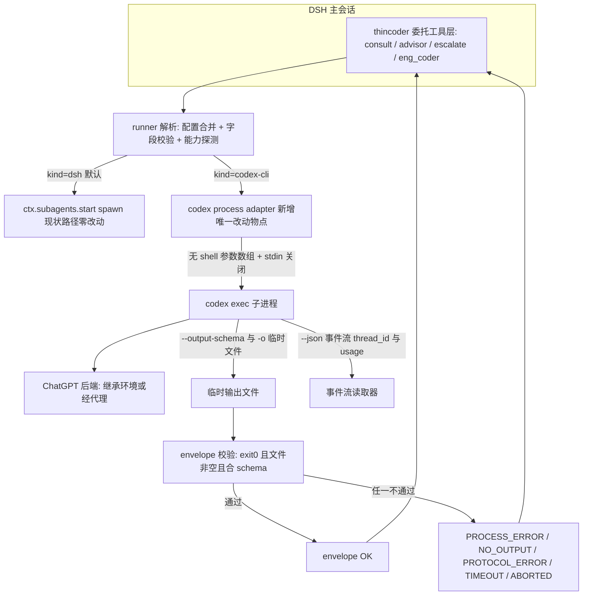
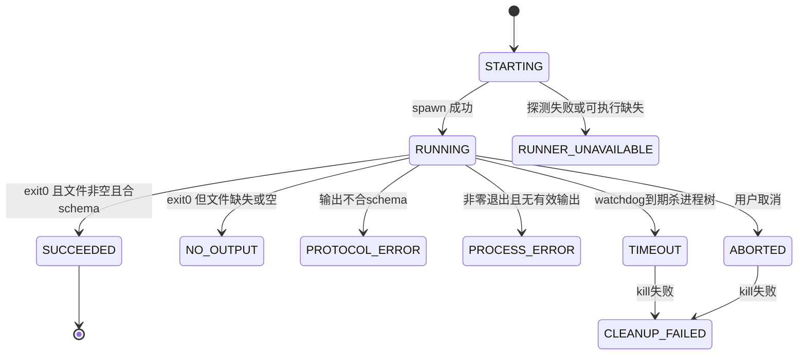
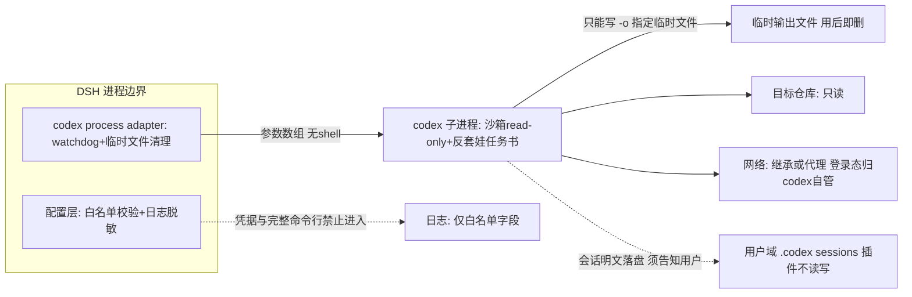

# Codex CLI 接入 thincoder 子代理体系 — 调研与设计 v2

- 日期：2026-09-03　|　状态：调研完成，设计定稿待评审，未实现
- 环境：Windows 11 · codex-cli 0.150.1（npm 安装，能力探测后兼容 ≥0.150）· ChatGPT 登录态
- 评审来源：codex gpt-5.6-sol（high effort，66k tokens，179s）深度评审已逐条采纳；GLM-5.3 会诊三次尝试全部 child aborted（会诊池环境故障，见附录 B）。本文档由 codex 评审 + 作者综合执笔。
- 术语表（首次出现先解释）：**runner** = 模型后端适配器，决定任务交给谁跑；**headless** = 无交互命令行模式，跑完退出；**resume** = 继续上一次 codex 会话接着聊；**AGENTS.md** = codex 启动时自动读取的项目规则文件；**envelope** = 统一返回信封，不管后端是谁返回结构一致；**fail-closed** = 校验不过就拒绝，绝不带病运行、绝不静默换后端；**watchdog** = 看门狗定时器，超时强杀进程。

## 0. 三句话摘要

**现在有什么问题**：thincoder 四个委托机制（advisor 评审 / consult 会诊 / escalate 飞刀 / eng_coder 实现）最终都走 ctx.subagents.start("spawn")，而它要求 provider 是 llm-pi-ai 注册表里的 HTTP 模型路由——本机已登录、模型为 gpt-5.6-sol 的 Codex CLI 是本地子进程程序，进不了这个体系。

**这次要达成什么**：给 advisor 组和 consultModels 行加可选 runner 字段；runner="codex-cli" 时改由子进程驱动 codex exec；不配置则现状一行不变。

**最终建议**：做，但按本文档边界与 schema 做——一期只接 consult + advisor（只读沙箱），escalate/eng_coder（写沙箱）二期；线程连续性（"联调模式"）暂缓并写明重启条件。

## 1. 需求：我们要解决什么问题

### 1.1 用户故事
- **US-1（评审）**：作为重度 DSH 用户，我希望 advisor 评审能指定 codex/gpt-5.6-sol——不同家的模型做第二意见更有价值；今天做不到。
- **US-2（会诊）**：作为架构决策者，我希望 consult 池混入 codex 后端，让 OpenAI 系与 GLM 并行给意见；今天池子只收 HTTP 路由。
- **US-3（维护）**：作为插件维护者，我要代理、可执行路径、AGENTS.md 策略全部可配置、零本机硬编码，换机器改配置即可用。

### 1.2 功能需求（FR）
| 编号 | 需求 | 验收标准 |
|---|---|---|
| FR-1 | advisor 两组与 consultModels 行支持可选 runner 字段；runner="codex-cli" 时任务由 codex exec 子进程执行 | 端到端测试 5 连跑全部返回有效 envelope |
| FR-2 | 不配置 runner 时行为与现状完全一致 | 现有测试套件全绿，断言零改动 |
| FR-3 | 代理、可执行路径、AGENTS.md 策略、超时全部可配置 | 代码检索无 7897、无用户绝对路径 |
| FR-4 | 每次调用返回统一 envelope，失败归类稳定错误码 | 故障注入：每类错误码至少一个用例 |
| FR-5 | 成功判定不依赖 exit code 单一信号 | 注入 exit=0 但输出损坏 → PROTOCOL_ERROR 而非成功 |

### 1.3 非功能需求（NFR）
| 编号 | 需求 | 指标 |
|---|---|---|
| NFR-1 | 延迟 | 有代理环境单次只读调用 P95 < 120s（PONG 实测 26–44s，留 3x 余量）；无代理靠 watchdog 兜底 |
| NFR-2 | 资源 | 并发沿用 consult 池上限（≤5 路），一期不新增全局预算机制 |
| NFR-3 | 隐私 | 日志白名单：runner 类型 / codex 版本 / 耗时 / 错误码 / 代理主机名 / 重连计数；禁记完整命令行、URL 凭据、任务文本、代码、会话内容 |
| NFR-4 | 兼容 | 启动时能力探测 codex 版本；不过则该 runner 拒绝启动（RUNNER_UNAVAILABLE），禁止降级 dsh |

## 2. 目标与非目标

### 2.1 一期目标
1. consult + advisor 支持 runner="codex-cli"（只读沙箱），端到端可用。
2. 第 5 章配置契约实现并通过校验测试。
3. 全部失败路径有稳定错误码与用户可见消息。

### 2.2 二期候选（有触发条件才做，见第 8 章）
- escalate / eng_coder 接 runner（workspace-write）。
- escalate 返工的线程连续性（resume）。

### 2.3 非目标（明确不做 + 理由）
| 不做什么 | 为什么 |
|---|---|
| OpenAI 协议 shim（把 codex 包装成 HTTP 端点塞进 llm-pi-ai 注册表） | 无状态 chat 与 codex thread 语义错配；每请求 spawn 开销大；runner 路线已覆盖全部场景 |
| 完整"联调模式"（DSH 与 codex 常驻结对、流式协作） | 与 DSH 工具请求-响应模型冲突；等价于引入 jobs 级工程，收益未证明 |
| advisor round1→2→3 共享 codex thread | 现协议无状态注入已解耦传输；线程化与 advisorRound 重置语义耦合（8.1 详析） |
| 插件托管 codex 登录态 | 登录态归 codex（~/.codex/auth.json），插件只消费 |
| dsh runner 任何行为改动 | FR-2，零兼容风险 |

## 3. 调研结论

### 3.1 结论表（每条绑定证据与置信度）
| # | 结论 | 证据 | 置信度 |
|---|---|---|---|
| C1 | codex exec headless 可作子进程子代理 | PONG 全链路成功，-o 文件落盘，exit 0 | 已实测（单机单版本） |
| C2 | 网络重连是最大延迟源；代理环境变量可解 | 无代理 153.9s/4 重连 vs HTTPS_PROXY 44.2s/0 重连 | 已实测（对照） |
| C3 | project_doc_max_bytes=0 关闭 AGENTS.md 级联 | 开关后 skillRead=no（26.5s）；默认 skillRead=YES（37.9s） | 已实测（对照） |
| C4 | exit code 只是必要条件，成功判定必须看输出文件 + schema | 实测模型刷新超时 ERROR 仍完成任务 | 已实测 + 设计 |
| C5 | --json 事件流可作 threadId 捕获与完成信号 | thread.started{thread_id} → turn.completed{usage} 字段已验证 | 已实测 |
| C6 | --output-schema 走 OpenAI 严格模式：properties 全部键必须进 required | 违反时 400 invalid_json_schema（踩坑实证） | 已实测 |
| C7 | resume 多轮成立且增量 token 极小 | 续轮答对前轮内容；+220 tokens 可见增量 | 已实测 |
| C8 | mcp-server 通道可用但已 deprecated | codex/codex-reply 握手成功 + CLI 弃用警告 | 已实测 |
| C9 | codex 胜任结构化设计/评审任务 | 66k tokens 产出 47 条结构化评审，严格 schema 下零格式错误 | 已实测（1 次） |
| C10 | 联调模式默认不值得做 | 无状态注入已解耦 + 状态机耦合成本（8.1 详析） | 推断（设计分析） |
| C11 | 模型 ID 与 effort 均为透传，codex 不做本地校验 | 非法模型：fallback metadata 警告后照跑，最终 API 400；effort=low / high / xhigh 实测通过并反映在运行头部 | 已实测 |
| C12 | 模型目录可动态发现：官方入口 codex debug models（exit 0，原始目录 JSON）+ models_cache.json 同结构兜底；每模型 effort 枚举不同（gpt-5.6-sol 含 ultra，5.5 系封顶 xhigh） | 实测 9 模型全量拉取成功（5.6） | 已实测 |

### 3.2 实测矩阵（n=1，验收阶段要求 n=5）
| 用例 | 命令要点 | 耗时 | 关键观测 |
|---|---|---|---|
| T1 干净cwd·无代理 | codex exec -C tmp --skip-git-repo-check -s read-only | 153.9s | 4 次 Reconnecting→HTTPS fallback；exit 0 |
| T2 干净cwd·代理 | 同 T1 + HTTPS_PROXY=127.0.0.1:7897 | 44.2s | 0 重连 |
| T3 AGENTS禁用·代理 | T2 + -c project_doc_max_bytes=0，cwd=DSH-Portable | 26.5s | skillRead=no |
| T4 AGENTS默认·代理 | T2，cwd=DSH-Portable | 37.9s | skillRead=YES（superpowers 级联实证） |
| T5 resume 多轮 | codex exec resume 追问 | 137.2s | 答对前轮；+220 tokens；4 重连 |
| T6 --json | T1 + --json | 约30s | 4 事件/轮 |
| T7 结构化输出 | --output-schema 设计任务 | 223.3s | 45.6k tokens，校验通过 |
| T8 设计评审 | gpt-5.6-sol high 读 v1 文档评审 | 179.2s | 66k tokens，零格式错误 |
| T9 queue 发消息 | codex queue --thread --message | <5s | Queued message 确认 |

### 3.3 实验局限（诚实声明）
- 单机单版本无重复试验；tokens used 波动大（3.2k–66k）不可当成本计量，只看 skillRead/重连/延迟三个稳定信号。
- doctor 显示本机双安装（AppData npm 前缀 vs DSH-Portable node npm 前缀），升级会打错目标——executable 字段的直接证据。
- WebSocket 超时属本机网络特征（doctor 有告警），不代表普遍环境；代理因此是可选项而非前提。

## 4. 边界与防偏离设计

规则强度用 必须 / 应 / 可 表达；违反任何"必须"条目视为缺陷。

### 4.1 兼容边界
| # | 规则 |
|---|---|
| B1 | runner 缺失或 kind="dsh" 时，行为必须与现状逐字节一致 |
| B2 | kind 取 dsh、codex-cli 之外的值必须拒绝整次请求（fail-closed），禁止静默换后端 |
| B3 | 超时 / schema 错误 / 模型不存在 / 版本不支持时禁止自动回退 dsh 或换模型——失败就报失败；换后端必须用户显式改配置 |
| B4 | dsh 行出现 codex 专属字段（agentsMd/proxy 等）必须忽略并 warn 配置错误 |

### 4.2 执行边界
| # | 规则 |
|---|---|
| B5 | 沙箱映射：advisor/consult 必须 read-only；escalate/eng_coder 必须 workspace-write；danger-full-access 必须显式配置且日志记录来源 |
| B6 | executable 只接受可执行名或绝对路径，禁止 shell 片段/重定向/管道/参数拼接；spawn 必须用无 shell 参数数组 |
| B7 | stdin 必须 ignore 或立即 end()（codex 在管道 stdin 下会等待追加——实测） |
| B8 | 任务书必须含反套娃条款：禁止再派生子代理、禁止交互确认；声明 AGENTS.md 是约束而非授权来源 |
| B9 | 子进程必须有 watchdog：到期 taskkill /T /F 杀进程树 + 清临时文件；escalate 的"无墙钟"设计对进程不适用（会留孤儿） |

### 4.3 配置与版本边界
| # | 规则 |
|---|---|
| B10 | 代理只经配置与环境变量（inherit/none/url），禁止硬编码 IP/端口；日志只记"是否启用 + 主机名" |
| B11 | 启动时能力探测（codex --version + 关键 flag 试探）；不过则该 runner 报 RUNNER_UNAVAILABLE 拒绝启动，禁止降级 |
| B12 | 非法配置（类型错/枚举外/必填缺）必须拒绝整次请求并报字段级错误，禁止尽力解析 |

### 4.4 隐私与资源边界
| # | 规则 |
|---|---|
| B13 | 日志白名单（NFR-3）；禁止记录完整环境/命令行/会话内容 |
| B14 | threadId 只存会话内存，禁止进持久化配置与普通日志；必须向用户告知 codex 会话明文落盘 ~/.codex/sessions 且可能与 Desktop 共享 |
| B15 | 并发沿用 consult 池上限（≤5）；每次调用受单次 timeoutMs 约束 |

### 4.5 phase-2 防偏离门槛
- escalate/eng_coder 接 runner：入口 = 一期稳定运行且有真实写场景需求；退出 = 写沙箱端到端 + 越权用例全过。
- 线程连续性：触发指标 = escalate 返工率（同一任务二次飞刀比例）≥30% 或用户显式要求；触发前 threadId 不进任何持久层。

## 5. 具体配置契约（schema）

### 5.1 runner 字段（advisor 组 / consultModels 行的可选字段）

配置入口：**thincoder 设置页为主**（model / effort 为动态下拉，数据源见 5.6），手编 config.json 是兜底。

| 字段 | 类型 | 必填 | 默认 | 合法范围 | 非法时行为 |
|---|---|---|---|---|---|
| kind | string | 对象形式必填 | "dsh" | "dsh" 或 "codex-cli" | B2：拒绝整次请求 |
| executable | string | 否 | 全局 codexCli.executable（最终默认 "codex"） | 可执行名或绝对路径；禁 shell 元字符与参数拼接 | B12：拒绝并报字段级错误 |
| model | string | 否 | codex 自身 config 默认 | 非空字符串（codex 模型 ID，不经 llm-pi-ai 注册表） | B12：拒绝 |
| effort | string | 否 | codex 默认（本机 config.toml 为 high） | 透传字段：实测 low / high / xhigh 通过；codex 不做本地校验，非法值由 API 400 兜底 | 不做本地枚举拒绝（codex 按模型演进）；失败归 PROCESS_ERROR 带 400 诊断 |
| sandbox | string | 否 | read-only（advisor/consult） | read-only / workspace-write / danger-full-access | B5：advisor/consult 行出现写沙箱必须拒绝 |
| timeoutMs | integer | 否 | 600000（对齐 advisor round1 缺省） | 30000 到 3600000 | B12：拒绝 |
| proxy | string | 否 | 全局 codexCli.proxyMode（最终默认 "inherit"） | "inherit" / "none" / http(s) 开头 URL | B10：URL scheme 校验失败拒绝 |
| agentsMd | string | 否 | 全局 codexCli.agentsMdPolicy（最终默认 "disable"） | "respect" / "disable" / "clean-cwd" | B12：拒绝 |

JSON Schema 形状（字符串简写与对象两种形式归一化为同一结构；additionalProperties=false）：

    {
      "oneOf": [
        { "type": "string", "enum": ["dsh", "codex-cli"] },
        {
          "type": "object",
          "required": ["kind"],
          "additionalProperties": false,
          "properties": {
            "kind":      { "enum": ["dsh", "codex-cli"] },
            "executable": { "type": "string" },
            "model":     { "type": "string" },
            "effort":    { "enum": ["off", "low", "medium", "high", "max"] },
            "sandbox":   { "enum": ["read-only", "workspace-write", "danger-full-access"] },
            "timeoutMs": { "type": "integer", "minimum": 30000, "maximum": 3600000 },
            "proxy":     { "type": "string" },
            "agentsMd":  { "enum": ["respect", "disable", "clean-cwd"] }
          }
        }
      ]
    }

跨字段约束：kind="dsh" 时禁止出现 codex 专属字段（B4 忽略并 warn）；proxy 为 URL 时 scheme 必须 http/https；kind="codex-cli" 时 model 可省略（用 codex 自身默认）。

### 5.2 全局配置 codexCli（config-store 新增节）

| 字段 | 类型 | 默认 | 说明 |
|---|---|---|---|
| proxyMode | "inherit" / "none" / "url" | "inherit" | url 时必须同时提供 proxyUrl，否则 B12 拒绝 |
| proxyUrl | string 或 null | null | http(s) 开头 URL；启动时校验 scheme |
| agentsMdPolicy | "respect" / "disable" / "clean-cwd" | "disable" | runner 行可逐行覆盖 |
| executable | string | "codex" | 双安装机器在此 pin 绝对路径 |
| defaultTimeoutMs | integer | 600000 | runner 行未配 timeoutMs 时的兜底 |

### 5.3 统一返回 envelope（两种后端同一结构）

    {
      "ok": true,
      "code": "OK",
      "text": "agent 最终回复文本",
      "threadId": "01a0-uuid（codex 后端必有；dsh 后端为 null）",
      "usage": { "inputTokens": 0, "outputTokens": 0 },
      "diagnostics": "stderr 摘要，仅失败或有警告时非空",
      "runner": { "kind": "codex-cli", "version": "0.150.1" }
    }

失败时 ok=false、code=错误码、text 保留部分输出（若有）。schema 校验失败时原文只进 diagnostics 截断版，防止把模型伪造的成功字段当真。

### 5.4 错误码表

| code | 触发条件 | 可重试 | 用户可见消息要点 | 上层处理 |
|---|---|---|---|---|
| OK | 全部校验通过 | — | — | 正常返回 |
| RUNNER_UNAVAILABLE | 可执行缺失 / 版本探测不过 | 否 | codex runner 不可用，请检查 executable 与版本 | 该模型行拒绝；consult 其余行继续 |
| PROCESS_ERROR | 进程非零退出且无有效输出 | 否 | codex 进程失败(exit N)，诊断见 diagnostics | 计入该行失败 |
| NO_OUTPUT | exit=0 但输出文件缺失或空 | 否 | codex 未产出有效输出 | 计入失败 |
| PROTOCOL_ERROR | 输出不合 envelope schema / 伪造成功字段 | 否 | codex 输出格式异常 | 原文截断进 diagnostics |
| TIMEOUT | watchdog 到期 | 否（重试由上层策略定） | 超时(Nms)，进程树已终止 | 计入失败 |
| ABORTED | 用户取消 / 父级 abort | 否 | 已取消 | 与模型失败分开统计，不得混淆 |
| CLEANUP_FAILED | kill 失败 / 临时文件残留 | 否 | 附加于 TIMEOUT / ABORTED 的诊断 | 告警日志 |

### 5.5 配置解析优先级与冲突示例

逐字段解析：runner 行显式值 > 全局 codexCli 对应项 > 内置默认；kind 只看 runner 行。

| 示例 | 配置 | 结果 |
|---|---|---|
| 1 | runner.proxy 为显式 URL，全局 proxyMode="inherit" | 行值胜：该行用显式 URL（scheme 校验通过后生效） |
| 2 | runner.kind="dsh"，runner.agentsMd="disable" | agentsMd 忽略 + warn 配置错误（B4） |
| 3 | runner.model 指定了新参数，executable 指向旧版 codex | 能力探测失败 → RUNNER_UNAVAILABLE，禁止降级（B11） |

### 5.6 模型与 effort 动态发现（设置页下拉数据源）

**需求回扣**：runner 的 model / effort 不允许手填死值——必须在 thincoder 设置页配置，且下拉选项实时来自本机 codex 实际支持的目录（每模型 effort 枚举不同：gpt-5.6-sol 为 low..ultra 六档，gpt-5.5 系封顶 xhigh，手填必然漂移）。

数据源优先级：① `codex debug models`（官方 CLI 入口，exit 0，原始目录 JSON，实测 356KB / 9 模型）→ ② `~/.codex/models_cache.json`（同结构缓存，CLI 不可用时兜底）。

API 契约（挂在现有 webServer 前缀路由下）：

    GET /thincoder-suite/api/codex/models
    → { ok: true, source: "debug-models" | "cache", models: [{
         "slug": "gpt-5.6-sol", "displayName": "GPT-5.6 Sol",
         "efforts": ["low","medium","high","xhigh","max","ultra"],
         "defaultEffort": "low", "visibility": "list", "contextWindow": 272000 }] }

设置页行为（对齐现有 settings.section slot + config.json user 层两层模型）：
- runner 行 kind 选 codex-cli → model 下拉（visibility=list 优先，hide 项折叠进「显示全部」）+ effort 下拉（随所选模型联动，默认值 = defaultEffort）
- 「刷新目录」按钮重跑发现；发现失败 → 下拉降级为手输框 + 内联报错（不阻塞其它字段）
- 发现结果带 fetched_at 时间戳展示，超 24h 提示刷新

实测目录（2026-09-03）：

| slug | efforts | default | visibility |
|---|---|---|---|
| gpt-5.6-sol | low,medium,high,xhigh,max,ultra | low | list |
| gpt-5.6-terra | low,medium,high,xhigh,max,ultra | medium | list |
| gpt-5.6-luna | low,medium,high,xhigh,max | medium | list |
| gpt-5.5 | low,medium,high,xhigh | medium | list |
| gpt-5.4 / 5.4-mini | low,medium,high,xhigh | medium | list |
| gpt-5.3-codex-spark | low,medium,high,xhigh | high | list |
| gpt-reserve / codex-auto-review | （各 5 档） | — | hide |

B11 能力探测的落地实现即复用此命令：debug models 能渲染 = CLI 存活且目录可读；顺带记录 client_version。

## 6. 流程图与架构图

### 6.1 目标架构

改动面收敛在一个新增模块：codex process adapter。配置解析在现有 index.mjs 校验层扩展；四个委托机制本体（consult/advisor/escalate/eng）只在 spawn 入口分一次支，业务逻辑零改动；失败统一收口到 envelope 错误码。



### 6.2 consult 会诊调用时序（含 codex runner）

```mermaid
sequenceDiagram
  participant M as 主代理
  participant C as consult 簿记与watchdog
  participant P as codex process adapter
  participant X as codex exec 子进程
  M->>C: consult_start(problem)
  C->>P: 派发各模型行(dsh行走spawn / codex行走本adapter)
  P->>P: 配置合并+能力探测(fail-closed)
  P->>X: spawn codex exec -s read-only --output-schema -o tmp
  P->>X: stdin 关闭 防挂起
  X-->>P: --json 事件流 thread.started item.completed
  X-->>P: exit 0 + 输出文件落盘
  P->>P: envelope schema 校验
  P-->>C: ok code text threadId usage
  C-->>M: consult_check 收回复
  Note over P,X: watchdog 到期则 taskkill 杀进程树返回 TIMEOUT; 用户 stop 返回 ABORTED
```

### 6.3 成功判定与失败状态机（exit code 只是必要条件）



### 6.4 安全与隐私边界（数据流与凭据隔离）



## 7. 分期计划与验收

### 7.0 分期总览

| | 一期（本设计主体） | 二期（一期稳定 + 触发条件满足才启动） |
|---|---|---|
| 委托范围 | consult + advisor 接 codex runner（只读沙箱） | escalate + eng_coder 接 runner（写沙箱）+ escalate 返工线程连续性（@触发条件） |
| 配置面 | codexCli 全局节 + 设置页 UI + model/effort 动态下拉（5.6） | 按角色 effort 预设、idle watchdog 调参、全权沙箱显式配置（D3） |
| 任务清单 | 7.1（T1.1–T1.8） | 7.2（T2.1–T2.5） |

### 7.1 一期任务清单（每行有退出条件）——✅ 已实施（2026-09-03，实施记录见附录 C）
| # | 任务 | 退出条件 |
|---|---|---|
| 1 | index.mjs：runner 字段规范化 + 校验（B2/B4/B12），缺省 dsh 完全兼容 | config-api 新用例全绿；现有套件零改动全绿 |
| 2 | process-adapter：spawn 构造 / stdin 关闭 / envelope schema / 错误码 / 临时文件与进程树清理 | 单测覆盖每类错误码（注入法） |
| 3 | 接入 consult：单次 timeout 与 watchdog/stop 映射为可断言状态机 | consult 并发 5 路（含 codex 行）端到端通过 |
| 4 | 接入 advisor 两组调用 | advisor 端到端 + 收敛轮回归 |
| 5 | 全局配置合并：proxyMode / agentsMdPolicy / executable / 脱敏 | 5.5 三个冲突示例各有断言 |
| 6 | Windows 端到端 + 故障注入 + 回滚验证 | 7.3 验收表全过 |
| 7 | 设置页 UI：codexCli 节 + runner 行 model/effort 动态下拉（5.6 发现 API + 刷新按钮 + 失败降级手输） | 端到端：打开设置页拉到模型目录、选中 gpt-5.6-sol/xhigh、保存后调用生效 |
| 8 | 能力探测落地 = codex debug models（B11）+ 记录 codex 版本进 envelope.runner | 探测失败 → RUNNER_UNAVAILABLE 有断言 |

### 7.2 二期任务清单——✅ 已实施（2026-09-03，实施记录见附录 C）

| # | 任务 | 入口 / 退出 |
|---|---|---|
| T2.1 | escalate 接 runner（workspace-write） | 入口：一期稳定运行且有真实写场景需求；退出：写沙箱端到端 + 越权用例全过（4.5） |
| T2.2 | eng_coder 接 runner（8.4 三边界：治理后移 / 活性信号 / 验证证据留档） | 同上 + 交付评审回归 |
| T2.3 | idle watchdog：--json 事件流做活性信号，替代纯墙钟 | 注入假死用例被正确杀死，健康长任务不被误杀 |
| T2.4 | escalate 返工线程连续性（显式 opt-in；threadId 只存会话内存，abort/完成即弃） | 触发：返工率 ≥30% 或用户显式要求（4.5） |
| T2.5 | danger-full-access 显式配置 + 日志记录配置来源（D3 落地） | 有断言：未配置时拒绝，配置后日志含来源 |

### 7.3 验收清单（一期）
| 用例 | 输入 | 断言 |
|---|---|---|
| 成功路径 | 合法 codex 行 + PONG 任务 | envelope ok=true，threadId 为 UUID，n=5 全过 |
| 进程失败 | executable 指向不存在路径 | RUNNER_UNAVAILABLE，不降级 |
| 输出损坏 | 注入 exit=0 + 空文件 | NO_OUTPUT |
| 格式伪造 | 注入不合 schema 输出 | PROTOCOL_ERROR，原文不进 text |
| 超时 | timeoutMs=30000 + 慢任务 | TIMEOUT，进程树无残留 |
| 用户取消 | consult_stop 中途 | ABORTED，无孤儿进程 |
| 并发 | 5 路 codex 行并行 | 全部返回，无进程泄漏 |
| 兼容 | 不配 runner 跑全部现有测试 | 全绿零改动 |
| 脱敏 | 全路径跑一遍收集日志 | 无完整命令行/URL 凭据/任务文本 |

## 8. 线程连续性（"联调模式"）详析

### 8.1 advisor 跨轮共享 thread：不值得（C10）
- 现协议无状态：每轮全新子代理，上一轮结论以 lastAdvisorOutput（32K 截断）注入下一轮。传输已解耦，换后端零成本。
- resume 每轮重发全历史，token 随轮次线性涨；省下的只是一次 32K 内的 prior 注入。
- 线程生命周期要跟 advisorRound 重置、评审类型切换（设计评审必须从 round1 重新开始、不带 code 评审 prior——session-store 的恢复语义）、收敛上限全套状态机对齐，耦合面大于收益。
### 8.2 escalate 返工：真实受益者，phase-2 opt-in
- 场景：术后报告 → 主代理评审 → 再改一次。今天只能重新飞刀（新 thread 重建上下文）。
- 形态：escalate 返回时把 threadId 存会话内存（不进持久层）；返工以显式 opt-in 的 followup 入口走 exec resume；abort 或完成即弃。
### 8.3 重启条件（防偏离，对应 4.5）
- escalate 返工率 ≥30%，或用户显式要求；触发前不做。

### 8.4 eng_coder 接 codex：可行（二期），三个新增边界

结论先行：**能，且是四个委托机制里与 codex 形态最对口的一个**（codex 本来就是编码代理）。designToken 门禁发生在 spawn 之前，换后端不削弱工程模式纪律；任务书约定（goal / 约束 / 验收 / 末行 Touched files）codex 完全可遵守，parseTouchedFiles 原样复用；沙箱映射 -s workspace-write + approval never。放二期而非一期的原因与对策：

| 新增边界 | 问题 | 二期对策 |
|---|---|---|
| 写权限治理错位 | DSH 写门禁管不到 codex 子进程内部（它用自己的 apply_patch/shell），逐笔审批不可得 | 治理后移：codex 沙箱限定写入范围（workspace-write 默认仅 cwd，额外目录用 --add-dir）+ 任务书反套娃（B8）+ 交付后 advisor 评审照常 + Touched files 对账 |
| 长任务 vs watchdog | 实现任务可跑 30-60 分钟，固定墙钟会杀健康任务 | 用 --json 事件流做活性信号：idle watchdog（连续 N 分钟无新事件才算挂死）替代纯墙钟；timeoutMs 上限放大且可配 |
| 验证证据可信度 | codex 在自己沙箱里跑验证，DSH 无法直接区分真跑与编造 | 任务书强制列出验证命令与结果文本；--json 命令执行事件存 diagnostics 留档；交付评审（advisor type=code）独立复验 |

配置面与 advisor/consult 同一 runner schema，差异仅两处：sandbox 必须为 "workspace-write"（B5），timeoutMs 默认放大（建议 1800000）。模型与 effort 在该行直接配：model: "gpt-5.6-sol" + effort: "xhigh" 即 coder 重活，advisor 侧用 low/medium 控成本。

## 9. 决策记录（2026-09-03 用户拍板：全部按推荐项执行）
| # | 问题 | 选项 | 推荐 |
|---|---|---|---|
| D1 | agentsMd 默认值 | respect（codex 评审建议：advisor 需要仓库规则）/ disable（本文档：防 AGENTS.md 行为链劫持） | **已定：disable**，respect 留行级覆盖；两案已共识必须可配置+日志记录 |
| D2 | 一期范围 | 仅 consult+advisor / 四机制全上 | **已定：仅 consult+advisor**（escalate/eng_coder 涉写沙箱，二期） |
| D3 | danger-full-access 是否可配 | 禁止 / 显式配置允许 | **已定：显式配置允许** + 日志记录来源 |
| D4 | MCP 挂载是否并行落地 | 仅 runner / 另立文档并行推进 | **已定：独立能力另立文档**；codex-reply 天然带 threadId，可低成本观察连续性真实需求 |

## 10. 风险清单
| 风险 | 影响 | 缓解 |
|---|---|---|
| codex 版本漂移（0.153.0 已发布；flag 面随版本变） | 参数失效 | 启动能力探测（B11）+ 记录 runner 版本 + 兼容矩阵回归 |
| 网络重连/登录态/配额不可插件控 | 长时间阻塞 | 外层 timeoutMs + watchdog 进程树清理 + 稳定错误码 |
| consult 5 路并发 = 5 个 CLI 进程 | token/CPU/代理连接放大 | 沿用池上限（B15）+ NFR-2 |
| 会话明文落盘 ~/.codex/sessions（当前 444 文件 1.52GB） | 敏感代码长期留存 | B14 告知 + threadId 不持久 + 日志脱敏 |
| AGENTS.md 行为链劫持（superpowers 实证） | 协议偏离/烧 token | D1 默认 disable + 可配置 |
| --output-schema 严格模式（C6） | 400 报错 | 通用 envelope schema 全 required 固化进 adapter |

## 附录 A：复现命令样例

    # headless 只读调用（成功判定看 -o 文件而非 exit code）
    codex exec -C <dir> --skip-git-repo-check -s read-only -m gpt-5.6-sol -c "model_reasoning_effort=high" --output-schema <schema.json> -o <tmpOut> -- "<task>"
    # 多轮续话
    codex exec resume <threadId> "<prompt>"
    # 事件流（threadId 捕获 + 完成信号）
    codex exec --json "..."   # thread.started{thread_id} / item.completed{agent_message} / turn.completed{usage}
    # 能力探测
    codex --version && codex doctor
    # 注意：非法模型 ID 本地不报错（fallback metadata 警告后照跑），最终 API 400 —— 错误映射归 PROCESS_ERROR
    # effort 透传实测：-c "model_reasoning_effort=\"low\"" / xhigh 均生效并反映在运行头部

## 附录 B：评审记录

- GLM-5.3 会诊：三次尝试（两个 brief）全部 child aborted——会话池环境故障，未获外部意见，已如实标注。
- codex gpt-5.6-sol high（179.2s / 66k tokens / --output-schema 全 required）评审 v1，产出 17 条问题 + 11 章提纲 + 15 条边界缺口 + 15 条 schema 缺口 + 6 图建议 + 12 条人话规则。采纳对照（节选）：

| codex 评审意见 | 落点 |
|---|---|
| 没有先说清需求/痛点/用户故事 | 第 1 章用户故事 + FR/NFR 表 |
| 目标无可验收指标 | 所有目标绑定验收数字（FR/NFR 验收列） |
| 实测不可复现 | 附录 A 完整命令 + 3.3 局限声明 + n=1 标注 |
| 错误处理只有名词没有行为 | 5.4 错误码表（触发/可重试/用户消息/上层处理） |
| 禁止静默 fallback 未成文 | B3 硬规则 |
| 缺配置合并算法与冲突示例 | 5.5 三示例 |
| AGENTS.md 两案未收口 | 9 章 D1 交用户拍板，不替用户决定 |
| 缺发布回滚/测试验收 | 7.1 六步退出条件 + 7.2 验收表 |
| 状态混乱（已验证/建议/待定混写） | 3.1 置信度列逐条标注（已实测/推断） |
| 图只放箭头不解释 | 6 章每图配责任/数据流/收口说明 |

## 附录 C：实施记录

### C.1 一期（2026-09-03）

| 任务 | 落点 | 状态 |
|---|---|---|
| T1.1/T1.5 runner 校验 + codexCli 全局节 | lib/codex-adapter.mjs（新）+ index.mjs（validateAdvisorGroup/validateConsultModels/validateGlobalUserConfig）+ config-store.mjs（GROUP_FIELDS+runner、codexCli 白名单合并） | ✅ |
| T1.2 process adapter | lib/codex-adapter.mjs：runCodexTask（stdin prompt/事件流解析/-o 权威文本/watchdog/进程树清理/envelope）+ probeCodex + discoverCodexModels + resolveExecutableFile（PATH 扫 .exe → npm cmd-shim 解析 JS 入口 node 直启，双格式 %~dp0/%dp0% 兼容） | ✅ |
| T1.3 consult 接入 | lib/consult.mjs startConsultChild 分支（label runner 感知；watchdog/stop 语义不变） | ✅ |
| T1.4 advisor 接入 | lib/advisor.mjs resolveAdvisorRoute codex 分支（免 provider/model 成对；runner.effort/timeoutMs 优先）+ runAdvisorReview 分支（失败回 "Advisor:" 前缀串——不烧轮次） | ✅ |
| T1.6 测试 | test/codex-runner.test.mjs 25 用例（假子进程注入，错误码全覆盖）；全套 104/104 绿 | ✅ |
| T1.7 设置页 UI | lib/client.js：codexCli 卡片（executable/proxyMode/proxyUrl/agentsMdPolicy/defaultTimeoutMs）+ 组/池行 runner 下拉 + model/effort 动态联动下拉 + 刷新目录按钮 + 发现失败降级手输 | ✅ |
| T1.8 模型发现 API | GET /thincoder-suite/api/codex/models（?executable=&refresh=1） | ✅ |
| 真实冒烟 | adapter→真 codex：PONG 全链路（threadId/usage/version 捕获，28.3s）；discoverCodexModels 9 模型（debug-models 路径）；escalate 对 codex 行明确报错（D2 守卫） | ✅ |

实施偏离说明：① runCodexTask 运行时 timeout 下限放开为 >0（区间校验留在配置层 B12——advisor timeoutMs 合法域 1000 起步，测试也需要短超时）；② --output-schema 未进核心路径（评审/会诊需要自由文本，envelope 由 adapter 自行构造——C6 陷阱规避）；③ npm cmd-shim 解析兼容 %dp0% 与 %~dp0 双格式（实测本机 shim 为后者变体）。

### C.2 二期（2026-09-03）

| 任务 | 落点 | 状态 |
|---|---|---|
| T2.3 idle watchdog | adapter runCodexTask 增加 opts.idleTimeoutMs：事件流活性信号（stdout/stderr/stdin 活动刷新时间戳，静默超限判假死 → 杀进程树 → TIMEOUT 带 idle 诊断）；0=关闭。escalate/eng_coder 写任务默认 300000，codexCli.idleTimeoutMs 可调 | ✅ 单测：事件停流被杀 + 假进程 kill 发 exit |
| T2.1 escalate 接 codex 行 | escalate.mjs：codex 行恢复候选；sandbox= runner.sandbox ?? workspace-write（B5）；runner.sandbox=danger-full-access 显式许可 + console.warn 来源留痕（T2.5/D3）；touched files 并入 state；交付后 threadId 存模块内存 Map | ✅ 单测 + 真实冒烟（真建 hello.txt，130.2s） |
| T2.4 线程连续性 | runCodexTask opts.resumeThreadId → `exec [flags] resume <id> -`；escalate 工具新增 followup 参数（无前置线程明确报错；threadId 仅内存 B14，不落盘不进日志） | ✅ 单测 + 真实冒烟（resume 轮追加 bye，125.8s） |
| T2.2 eng_coder 接 codex | eng.mjs：codexCli.engCoderRunner==="codex-cli" 时走 runCodexTask——sandbox 固定 workspace-write（B5，不透传更宽配置）、timeoutMs 默认放大 1800000（8.4）、idle 300000、effort 复用 engCoderEffort（off→不传）、F9 maxTokens 不适用（codex 自管预算）；交付状态写入与 dsh 路径同语义 | ✅ 单测（含 engCoderRunner 未配 → dsh 零变化 B1） |
| T2.5/D3 | 显式配置即许可 + 日志来源：escalate/eng 的 danger-full-access 断言见单测与 console.warn 留痕 | ✅ |
| 测试 | 新增 7 用例（二期）；全套 111/111 绿（--test-force-exit） | ✅ |

二期偏离/教训说明：① 旧一期测试「全池皆 codex 行 → 报错」在 T2.1 后失效，且该用例 deps 未注入 spawn 时误触真 codex 空跑 10 分钟——已删除并由新 T2.1 用例取代（教训：escalate/eng 测试必须注入假 spawn）；② B9 已知边界实证：宿主进程被外部中断时 watchdog 随宿主死亡，codex 孤儿进程需手动清理（watchdog 只保护「宿主活着但任务假死/超时」）；③ followup 语义 = 同一会话内最近一次 codex escalate 的 thread，会话结束/进程重启即失效（内存态，符合 B14）。

### C.3 代码评审执行记录（2026-09-04）

Advisor 评审（codex-cli 路由，gpt-5.6-sol high）共 6 次尝试未完成，三种独立失败模式：
1. dsh 循环内调用 ×2：harness 工具墙钟 600s 截断（与评审预算无关——调用环境上限）；
2. 后台任务 ×2：codex 传输层死亡（wss://chatgpt.com TLS handshake eof → exit 1；models_manager 刷新子进程挂起 → 启动 exit 1）；
3. vendored exe 直启 ×1：PONG >300s 未完成（对照基准期 26-44s）。

结论：**环境退化阻塞**（当日网络/代理对 chatgpt.com 长连接质量骤降），非代码缺陷——同日短任务（PONG 162s exit 0、escalate 写文件 130s、resume 125.8s）全部成功，评审这种 5-10 分钟长任务暴露窗口过大。评审脚本保留在 .tmp-review-part.mjs（按文件评审，900s 预算 + 240s idle），环境恢复后可直接重跑；或由用户在正常对话流自行发起 advisor 评审（不受本侧调用墙钟限制）。round1 已通过 config API 切至 codex-cli 路由（gpt-5.6-sol high，timeoutMs 回落组链 900s——曾误写 runner.timeoutMs=480000 覆盖用户 900s 预算，已修正并记为教训：跨层超时覆盖需谨慎）。

## 附录 D：平台工具墙钟与智能回落（2026-09-04，另一会话 6 连超时反馈驱动）

### D.1 600s 的真相

DSH 平台对**单次同步工具调用**有 600s 墙钟（实证：advisor 调用在 600000ms 整被
"wall-clock ceiling reached" 截断；与 thincoder 的任何配置无关）。后果链：

- advisor 评审预算（round1.timeoutMs，用户可设 900s/40min）只在平台墙钟**之内**有效——
  预算超过 540s 的部分永远跑不完，超时提示显示的是平台的 600s 而非用户预算；
- 之前 9 次评审能过 = glm 快 + 文档短，都在 600s 内完成；codex 高 effort 啃 600+ 行
  文档必然超 → 每次跑到一半被平台砍，且宿主被砍时 watchdog 随宿主死亡（B9 边界），
  codex 变孤儿需手动清理。

**落地**：① 墙钟本身可调——`dsh-code-runtime-worker-thread` 的组合配置 `maxWallMs`
（默认 600000，上限 2147483647；官方文档"size the runtime for your deployment"），
本部署已在用户层 patch（profiles/web/cordis.patch.yml）加 `code-runtime` config 行
提至 2400000（40 分钟，热生效）；② advisor codex 路径的预算截断上限改为可配置
`codexCli.budgetCapMs`（默认 540000，**须低于 maxWallMs** 留 envelope 返回余量），
用户提墙钟时同步上调（本机已设 2300000），截断时结果尾部告警实际预算——设 40 分钟
也可见"截为 Xms"而非无声死亡。

### D.2 落地形态（会诊后修订：ctx.jobs 后台任务，非手写轮询）

会诊（deepseek-v4-pro，实际读码）否决了手写 start/check 两段式：那是重造平台已有的
`ctx.jobs` 设施（本机 dsh-jobs-local + dsh-tool-jobs 已装配），且会引入 session-state
lost-update、finalize 重入、无完成唤醒等坑。落地采用 **方案 C**：

- 预算 ≤ budgetCapMs（默认 540000）：同步走 codex 子进程（现行为，budgetCap 为护栏）；
- 预算 > budgetCapMs：`ctx.jobs.start({ kind: "advisor-codex", owner: agent, run })`
  派后台任务——**评审预算用完整 route.timeoutMs（40 分钟有效）**，平台 600s 墙钟不再
  约束（任务不跑在 run_code 执行内）；finalize（轮次推进/prior/design token）在 done
  settle 前执行（恰好一次）；完成通知由平台唤醒主代理（无需轮询）；owner 归属隔离 +
  会话销毁自动 cancel+await（B9 孤儿边界闭合）；outputLimitBytes 128KiB；
- 智能回落：会话级内存计数，codex 失败连续 ≥2 次 → 下一轮 start 自动回落 dsh 路由
  一轮（响亮告警），成功后计数清零 codex 重试；回落轮 dsh 路由也不可用 → 明确报错；
- 降级：ctx.jobs 缺失/派发失败 → 同步执行 + 预算截为 budgetCap + 响亮告警（绝不无声）；
- 待办（T2.1b）：escalate/eng_coder 的 codex 长预算同样受 600s 墙钟约束，迁移到 jobs
  路径（同一模式）；迁移前其预算 >540s 部分会被平台砍掉（已在结果尾部告警）。

### D.3 实施事故与教训（智能回落首轮自测）

失败/通知文本若放在结果**开头**（warnPrefix/capNote 前缀惯例），会让 "Advisor:" 开头
约定失效 → 失败被误判 completed → 烧轮次 + 失败文本（>200 字符）被存成 prior →
下一轮路由到空 convergence 组 → "no LLM route"（实测复现）。**规则：所有失败/通知
文本一律放结果后缀，"Advisor:" 必须是失败结果的第一个 token。**

### D.4 其他评审反馈落地

- runner 生效时组内显式 provider/model → 路由警告"被忽略"（UX 陷阱可见化：改
  provider/model 以为切回 glm，实际被 runner 覆盖——切回需改 runner 本身）；
- 评审 #4 会话销毁清理：clearCodexThread 接线 session/disposed（threadId 内存生命周期闭环）。

