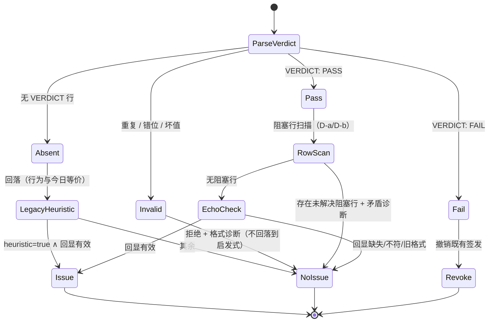
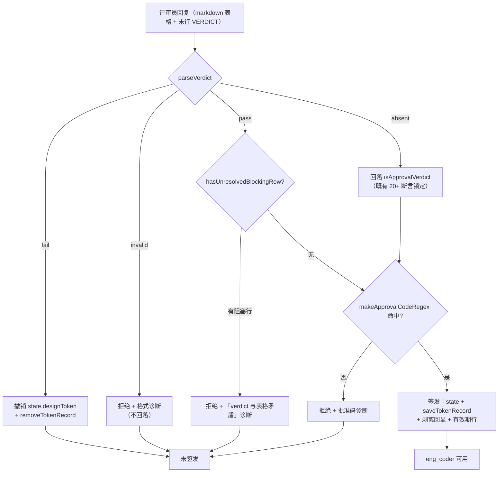

# 设计：评审协议增强（四值词表 / VERDICT 收尾行 / 判定规则 R1–R7e）—— 批 3

- 日期：2026-09-12
- 需求档：[`2026-09-12-review-protocol-requirements.md`](./2026-09-12-review-protocol-requirements.md)（7 用户故事 / 6 非功能标准）
- 设计输入：**会诊 id 2**（kimi-k3 交付完整设计并做出一处关键勘察纠正 —— 见需求档 §2.2；其余模型超时）
- 决策：用户裁定 **VERDICT 并存**（不删启发式）；**D-a…D-d 全按推荐**（§5 逐条记录与理由）
- 章节：按 `METHODOLOGY.md`「设计文档的成文流程与必备章节」九节 + 图示

> ## ⚠️ 行号引用口径（**读本档前必读**）
>
> 本档正文里的 `lib/advisor.mjs:NNNN` 一类行号**已于批 3 处置轮按工作树逐个重测并修正**
> （此前是**设计期快照** as-of 2026-09-12 设计定稿时；批 3 实施后整体右移，
> 实测：原 `:1463` 的 `verdictPassed` 谓词 → 现 **`:1582`**；
> 原 `:1489-1496` 的诊断支 → 现 **`:1629-1641`**；`state.designToken = null` → 现 **`:1620`**）。
>
> **定位方式以符号名为准，不以行号为准**（行号会随每次改动漂移，符号名不会）：
>
> | 要找什么 | 检索符号 |
> |---|---|
> | 签发判定谓词 | `const verdictPassed` |
> | VERDICT 解析器 / 阻塞行扫描 | `export function parseVerdict` / `export function hasUnresolvedBlockingRow` |
> | 六路诊断 | `VERDICT_DIAG` |
> | 撤销分支 | `state.designToken = null` |
> | 批准码派生 | `export function designApprovalCode` |
> | 回落启发式（未改动） | `export function isApprovalVerdict` |
>
> **为什么不把行号当成长期定位手段**：同一目录的 `2026-09-12-absorption-inventory.md` §1 P4 把「文档行号漂移」
> 列为**实测痛**（「文档引用的行号与实际不符，读者按错行号定位」）。逐个改是治标 —— 下次改代码又会漂。
> 故口径定为：**行号按工作树重测**（本处置轮已做，见上），但**定位方式以符号名为准**；
> 此后改动只更新下方符号表，不再重新逐个追行号。

---

## §1 背景

评审协议目前有三处不对称（详见需求档 §2）：

1. **词表少一值** —— 「已派工未落地」无词可表，裁决表被迫撒谎；
2. **结论靠猜** —— 宿主用正则从散文里猜通过与否（`lib/advisor.mjs:741`，三版踩坑）；
3. **判据不固定** —— 评审员对「多严重」全凭发挥；
4. **一句假承诺** —— `advisor-round1.md:25` 声称宿主识别 all-clear 标记，**而宿主对代码评审结果零解析**（父侧核验：`isApprovalVerdict` 全库唯一调用在 design 分支内）。

本批把这四处一起收口，因为它们是同一件事的四张面孔：**让评审结论成为确定性信号**。

---

## §2 问题

| # | 问题 | 根因 | 证据 |
|---|---|---|---|
| P1 | 裁决表无法表达在途 | 三值词表（四处复制） | `lib/prompts/discipline.md:4`、`lib/prompts/engineering.md:217`、`lib/index.mjs:790`、`README.md:51` |
| P2 | 宿主猜散文 | 启发式正则 + 严重度单元格锚定 | `lib/advisor.mjs:741`、`:735`（`APPROVAL_VERDICT_RE`）、`:740`（`RED_SEVERITY_CELL_RE`）、`:736`（`RESOLVED_MARK_RE`） |
| P3 | 判据不固定 | 无 R1–R7e | — |
| P4 | 假承诺 + 代码评审无判定 | 宿主只在 design 分支消费结果 | `lib/advisor.mjs:1582`（唯一调用点）、`:1572`（分支）、`:1477`（reviewType 作用域校验所在行） |
| **P5** | **评审员表达了通过但宿主未识别 → 工程流程静默卡死**（D-33 现场复现） | 启发式的**通过词表只有三个词**（`通过` / `批准` / `approved`），且通过态测试样本**全用同一句英文** | 词表实测：`lib/advisor.mjs:735` 的 `APPROVAL_VERDICT_RE`；实测 `isApprovalVerdict("I approve this design.")===false`、`("Approval granted.")===false`、`("VERDICT: PASS")===false`；断言样本 `test/advisor-config.test.mjs:391-433` |
| **P6** | **判定失败不可见** | 诊断只在 `verdictPassed` 为真时追加 | `lib/advisor.mjs:1631-1639` |
| **P7** | **撤销条件过宽：一次后续轮的 miss 会销毁先前已签发的有效令牌**（D-34，会诊独立提出） | `if (completed)` 覆盖「每一个完成但未签发的 design 轮」——含 verdict 通过但回显缺失，以及**成功签发之后的后续轮** | `lib/advisor.mjs:1617-1628`（`state.designToken = null` + `removeTokenRecord`，无「本轮是否曾签发」的判别） |

**P5/P6 的现场证据链**（2026-09-12，父侧逐条实测）：

1. 评审 PASS，评审员回「**无未决 🔴、无新增阻塞项，设计档可交 eng_coder 实施**」；
2. 批准码铸造并随提示词送达评审员（`:1546-1548` 注入，**每轮无条件**发生——与签发判定无关）；
3. 词表命中数 = **0**（文本中 `通过`=0、`批准`=0；唯一的 `approved` 出现在评审员复述指令的
   `not approved` 里，被当作**否定语境**跳过）→ `isApprovalVerdict` 返回 false；
4. `verdictPassed = true && false = false` → `:1588` 整条 if 为假 → 不签发、不落盘；
5. `:1617-1628` 因 `completed` 为真而**撤销**（P7）→ 连历史记录一起清掉；
6. `:1631-1639` 的诊断被 `verdictPassed` 门住 → **完全静默**；`eng_coder` 报「从未签发」，用户看不到真因。

**这是本批最重要的定位修正**：我最初把 P5 描述为「**中文**评审被误判」——
**不准确**。精确说法是「**通过表达的措辞未命中三词词表**」：换成英文 `I approve this design.` 同样失败。
修正后的表述直接决定了修法（D-h：不扩词表，而以上游 VERDICT 作为主信号）。

**P2 的代价已经量化**：`test/advisor-config.test.mjs:391-433` 有 20+ 条断言专测「猜错」的各种形态
（中英文否定词、表格单元格锚定、粗体变体、散文里出现 🔴 但无表格…）。这些断言是**补丁的补丁**，
而 P5 证明补丁仍不够 —— **样本偏英文**。

---

## §3 目标与非目标

### §3.1 目标

| 目标 | 完成判据 |
|---|---|
| 词表能表达在途 | 四处均含 `Dispatched`；收敛轮把 `Dispatched` 视为未解决直到复核 |
| 结论可机械判定 | 评审员末行给 `VERDICT: PASS\|FAIL`；宿主优先解析它 |
| 行为不倒退 | 无 VERDICT 行时走回落，结果与今日等价（N1） |
| 判据固定且不卡人 | 四份提示词含 R1–R7e；R7a–R7d 类发现永不阻塞通过 |
| 提示词与解析器互锁 | 静态断言把契约字面串钉住（N3） |
| 修掉那句假承诺 | 代码评审也要求 VERDICT；`round1.md:25` 的表述改为事实 |
| **修掉流程卡死**（D-33） | 中文表达通过的评审能签发出令牌；**且任何未签发路径都有可区分诊断**（不再静默） |

### §3.2 非目标（本批明确不做）

- 不删启发式（保留为回落）；
- 不给代码评审建宿主门禁（批 6）；
- 不做公共层重构（批 8）、轮次豁免（批 4）、上下文预算（批 5）；
- 不引入第三个 verdict 取值、不做本地化变体。

---

## §4 方案

### §4.1 契约（FR-1）

**VERDICT 行**：

```
/^\s*(?:\*\*VERDICT\s*:\s*(PASS|FAIL)\.?\s*\*\*|VERDICT\s*:\s*(PASS|FAIL)\.?)\s*$/i
```

- 取值**恰好** `PASS` | `FAIL`；关键字与取值大小写不敏感（`i`）；取值落在 `m[1] ?? m[2]`
  （两条互斥分支：带 `**` 的分支要求**首尾都有** `**`，不带的**首尾都没有** —— JS 正则无法表达配对的回引条件）；
- 容忍：前导空白、**成对** `**` 加粗包裹、**紧跟取值**的**恰好一个**尾句号、CRLF（`\s` 吸收 `\r`）；
- **必须成对 / 必须紧跟（批 3 分歧审计 🟡 #2，N6「放宽项不得放宽到接受错误值」）**：
  容忍面**不缩小**合法形态（`VERDICT: PASS.` / `**VERDICT: PASS**` 仍接受），只把三类**不该接受**的形态
  判为 `invalid(bad-value)`，且**不回落**（D-f）：`VERDICT: PASS   .   `（尾句号未紧跟取值）、
  `**VERDICT: PASS`（缺尾 `**`）、`VERDICT: PASS**`（缺首 `**`）；`VERDICT: PASS..` 继续拒绝。
- **必须是最后一行非空内容**，其后不得有任何内容；
- **英文，永不翻译**（评审员被要求用会话语言回复，故提示词须显式声明该 token 不译——与 `[APPROVE:<code>]` 同款）。

**与 `[APPROVE:<code>]` 的关系**：

- 两者都出现时（design 评审通过）：提示词规定回显**紧邻在 verdict 行上方**，verdict 恒为最后一行；
  但宿主**不要求**该次序 —— 回显匹配沿用既有 `makeApprovalCodeRegex`（`:716`，**零改动**），verdict 用末行锚定。最小改动、最大鲁棒。
- 冲突处理：**verdict 决定「算不算通过」，回显决定「发不发 token」，两者是 AND**（见 §5 状态机）。

**四处提示词**：`advisor-round1.md` / `advisor-round2.md` / `advisor-round3.md` / `advisor-design.md` 均写入该契约。

### §4.2 四值词表与 `Dispatched`（FR-2）

**语义**：修复**已委托出去**（子代理 / 后台 job），**尚未返回经验证的结果**。
它是「认领」的声明，**绝不是「已解决」的声明**。`Fixed` 保持既有「已改完」语义（上游**否决了**改语义的方案——陷阱 #8）。

**四处改动**：`discipline.md:4`、`engineering.md:217`、`index.mjs:790`（工具描述）、`README.md:51`。
措辞：`Action` 为四值 `Fixed` / `Dispatched` / `Not an issue` / `Deferred`；`Dispatched` 行的 Detail **必须**写明派给了什么（job/子代理 id 或具体描述），否则与停滞无法区分。

**收敛轮处理**（`advisor-round2.md` / `advisor-round3.md` 各加一句）：

> `Dispatched` in the agent response means the fix was delegated and is **unverified** — treat the item as **open** until you verify it in the current files.

- 对 **🔴**：**未落地的 `Dispatched` 🔴 阻塞 `VERDICT: PASS` 的正当性**，与未修复的 🔴 同待遇
  （否则「派工 → 立刻重评」成为收敛绕过 —— 用户意图的必然推论，会诊据此加强并获父侧认同）。
- 对 **🟡/🔵**：按 `Deferred` 待遇（非阻塞，但结转；末轮仍未落地 → 交付时上呈用户）。

**宿主解析：零改动**。主代理回复本就以「仅供参考」注入（`advisor-msgs.mjs:143`），且收敛轮评审员本就对当前文件重新 `read` 复核 —— `Dispatched` 只需**可读**，不需**可解析**。

### §4.3 判定规则 R1–R7e（FR-3）

逐条与现有提示词对照后的落点（含冲突处置）：

| 规则 | 内容（逐字来源：`thincoder/src/prompts/advisor-round1.md` Judgment Rules） | 落点与注意 |
|---|---|---|
| R1 | 文档矛盾/状态不一致 → 🟡（由父侧文档层修）；**例外**：同一机制在两处被描述不同 → 🔴 | **合并进** `advisor-design.md:32-33` 既有的 Document-ownership 块（不得让两份清单并存）；R1 新增：非同机制矛盾 → 🟡 |
| R2 | 实现偏离设计（验收未达/静默简化）→ 🔴 | 加进 round1，点名 Project-Guide 文档为参照 |
| R3 | 既有先例（如文件大小债）→ 🟡/🔵，不升级、不重新诉讼 | 扩展到议题级：round2/3 的已裁决行不得以同等或更高严重度重提 |
| R4 | 脆弱测试（挂钟/序列化形状依赖）→ 🔵 + 建议确定性 | 无对应，新增 |
| R5 | 范围协调（父侧 TODO）→ 🟡「协调项」（非缺陷） | 用**普通** 🟡，永不带 must-fix |
| R6 | 测试缝指引（硬编码工具集不可注入时如何做缝） | 纯建议内容，无严重度交互 |
| R7a | **文档态**矛盾/跨文件滞后 → 🟡 只报告不编辑 | ⚠️ **必须与 R1 例外按对象分域**：文档 vs **文档**（同机制两处不同）→ 🔴；文档 vs **现实**（声明已完成而代码不符）→ 🟡 只报告。措辞必须显式点名对象，否则评审员会把两者混淆（该升级的降级、该降级的升级） |
| R7b | 内容矛盾 → 高层胜：Design (D) > Requirements (F) > records (TODO) | 机械排序 |
| R7c | 数字漂移 / TODO 未勾 / 文档卫生 → 🔵 | — |
| R7d | 语义悬空 → 🟡 报告设计缺口（父侧修） | 普通 🟡 |
| R7e | **绝不因文档态矛盾阻塞 pass**（机制级描述不符除外，= 🔴） | 编码为评审员指令：「R7a–R7d 永远 ≤ 普通 🟡，绝不构成 `VERDICT: FAIL` 的理由」。见 §5 关于其**执行面**的诚实说明 |

**「必须修复的 🟡」的机械可辨形式**（决策 D-b）：

```
MUST_FIX_RE = /^\s*(?:\*\*)?🟡(?:\*\*)?\s*\(?\s*must[ -]?fix\b/i
```

即严重度单元格字面量必须是 `🟡 must-fix`（容忍加粗与括号变体；先例：测试里已有 `🔴(must fix)` 形态）。

> ⚠️ **必须先抽取单元格再匹配（设计评审 #1 的修订，实现不得省略此步）**
>
> 上面的正则带 `^\s*` 行首锚定，**若拿整行去匹配就永不命中** —— 因为本仓评审表格行以 `|` 开头
> （实测形态：`| 1 | src/example.mjs | 🔴 | … | … |`）。**正确管线与既有 `RED_SEVERITY_CELL_RE`
> 完全同款**（`lib/advisor.mjs` 内的实际消费方式，`cells.some(...)`）：
>
> ```js
> for (const line of text.split("\n")) {
>   if (!/^\s*\|/.test(line)) continue          // ① 先滤出表格行
>   const cells = line.split("|").map(c => c.trim())   // ② 拆单元格
>   const blocking = cells.some(c =>
>     (c.length <= 16 && RED_SEVERITY_CELL_RE.test(c))          // ③ 逐单元格匹配
>     || (c.length <= 24 && MUST_FIX_RE.test(c)))               //    （上限按标记分设，见收口注）
> }
> ```
>
> > **收口注（批 3 评审 #3）**：长度上限**按标记分设** —— 🔴 仍是 16（既有语义不动），
> > `🟡 must-fix` 放宽到 **24**。成因：`**🟡** (must fix)`（加粗 + 括号组合）的 UTF-16 长度 = **17**，
> > 与 🔴 共用 16 时会在匹配前被护栏挡掉 → must-fix **静默漏判**（fail-open，方向错误）。
> > 放宽**只对以 🟡 开头的严重度单元格生效**（`MUST_FIX_RE` 自带 `^\s*(?:\*\*)?🟡` 锚定），
> > 普通长描述单元格仍不误判（`test/advisor-config.test.mjs` 的 AC-V8b (#3) 双向钉住）。
>
> **为什么写死这一步**：`MUST_FIX_RE` 的语义是「**严重度单元格**字面量」，而单元格存在的前提是先拆分。
> 规格里缺这一步会让实现者拿整行匹配 → must-fix 检测对真实表格**静默失效**（fail-open），
> 且可能以「夹具迁就正则」的形式骗过 AC-V8b。**AC-V8b 的夹具因此必须是 `|` 围栏的真实表格行**
> （severity 在首列与中列各一），并加一条「裸行（无 `|` 围栏）不命中」的反证。

**硬约束**：R7a–R7d 那类**文档态发现禁止携带该标记** —— 这等于把 R7e **结构化**，而不是只靠提示词自觉。

于是全系统得到**唯一一条干净的机械规则**：

> 一行阻塞，当且仅当它的严重度单元格是 🔴 **或** `🟡 must-fix`，**且**该行不带已解决标记。

> **假承诺的替换措辞要点（设计评审 #4）**：`advisor-round1.md:25` 原文称
> 「The host recognizes it via the "all clear" / "no 🔴" / "review passed" / "no issues found" markers」
> —— 但宿主**只对 design 评审做判定**（决策 D-d），代码评审的结论供**发起者/主代理**读取。
> 故替换句的**消费方必须改口为「发起方/主代理」而非「宿主」**，否则只是把一句假话换成另一句假话。
> 建议措辞：`VERDICT` 行为机器可读结论；all-clear 短语等传统标记**仍被主代理接受**（回落路径保留）。

### §4.4 判定失败可见（FR-4，D-33）

**问题**：`:1629-1641` 的返回支里，诊断只在 `verdictPassed` 为真时追加。为假时**完全静默** ——
用户只看到下游的「从未签发」，看不到上游真因（本次实测就是如此）。

**改法**：把该支的返回扩为**可区分的多路诊断**（与 §5.4 的解析结果一一对应）：

| 情形 | 诊断要点 |
|---|---|
| `pass` + 无阻塞行 + 回显有效 | 正常签发（不变） |
| `pass` + 有阻塞行 | 「verdict 与表格矛盾」——点名存在未解决阻塞行 |
| `pass` + 回显缺失/不符/旧格式 | 既有诊断「批准码校验失败——请重跑评审」（保留原措辞；文案常量 `VERDICT_DIAG.echo` 在 `:850`，选用点 `:1634`） |
| `fail` | 「评审员判定为不通过」+ 撤销既有签发 |
| `invalid`(duplicate/misplaced/bad-value) | 「verdict 行格式非法（原因：X）」+ 点名要求格式 |
| **`absent` + 回落判定为不通过** | **「未给出 VERDICT 行；回落启发式判定为不通过」** —— **D-33 的正解**：用户由此知道不是「评审没过」，而是「说了通过但宿主没认出来」 |
| `absent` + 回落判定为通过 | 正常签发（回落路径，`[负]` 锁住：AC-V6） |

**关键**：最后一类之外的所有「未签发」都必须**点名原因**。**任何静默的未签发都视为缺陷**（N7）。

### §4.5 撤销条件收紧（FR-5，D-34，会诊独立提出）

**问题**：`:1617-1628` 的 `if (completed)` 会在**每一个完成但未签发的 design 轮**触发撤销 —— 包括
「verdict 通过但回显缺失/不符」（AC-6 的负例恰好断言了这个行为）以及**成功签发之后的后续轮**。
后果：**一次后续轮的启发式 miss 可以销毁一枚先前已签发的有效令牌**（本次现场极可能就是这样把记录删掉的）。

**改法**：撤销只在**明确的否定裁决**下发生，且**永不静默**：

```
撤销条件（三选一才撤销）：
  ① verdict 行显式为 FAIL                 → 撤销 + 诊断
  ② 无 verdict 行 且 回落判定为不通过      → 撤销 + 诊断（含「未给出 VERDICT 行」）← D-33 情形
  ③ 回显缺失/不符（verdict 通过）          → **仅诊断，不撤销**（令牌语义仍有效；缺的是回显）
「成功签发之后的后续轮」→ **不撤销**（链已闭合，令牌继续有效至过期/续期）
```

**为什么 ③ 不再撤销**：回显是**签发时的**门禁，它管的是「这一轮该不该新签发」；
它不构成「把已签发的作废」的理由 —— 那会让一次疏忽（忘带回显）升级为**丢掉已有授权**。
而 ① ② 是明确的否定裁决，撤销是对的（评审没过就不该拿着旧令牌开工）。

**可观测性**：撤销路径**必须留痕**（`removeTokenRecord` 的布尔返回值当前被丢弃 —— 收集它并 warn），
否则「令牌为什么没了」依然是谜（这正是 D-33 排查时最耗时的一步）。

---

## §5 机制伪代码与状态机

### §5.1 解析器（新增，导出以便单测）

```js
/** 解析 VERDICT 行。返回 {kind:"pass"|"fail"} | {kind:"invalid",reason} | {kind:"absent"} */
function parseVerdict(result) {
  const lines = String(result ?? "").split("\n")
  const hits = lines.filter(l => /^\s*(?:\*\*)?VERDICT\s*:/i.test(l))
  if (hits.length === 0) return { kind: "absent" }
  if (hits.length > 1)  return { kind: "invalid", reason: "duplicate" }
  const lastNonEmpty = [...lines].reverse().find(l => l.trim() !== "")
  if (hits[0] !== lastNonEmpty) return { kind: "invalid", reason: "misplaced" }
  const m = hits[0].match(/^\s*(?:\*\*VERDICT\s*:\s*(PASS|FAIL)\.?\s*\*\*|VERDICT\s*:\s*(PASS|FAIL)\.?)\s*$/i)
  if (!m) return { kind: "invalid", reason: "bad-value" }
  return { kind: (m[1] ?? m[2]).toLowerCase() }
}

/** 阻塞行扫描（决策 D-a + D-b）：🔴 或 🟡 must-fix，且无已解决标记 */
function hasUnresolvedBlockingRow(text) { /* 复用 RED_SEVERITY_CELL_RE + MUST_FIX_RE + RESOLVED_MARK_RE + UNRESOLVED_MARK_RE */ }
```

**前置 / 后置条件**（调用方契约 —— 这两条是签发门禁的依据，必须写死）：

| 函数 | 前置 | 后置 |
|---|---|---|
| `parseVerdict(result)` | `result` 可以是任意值（内部 `String(result ?? "")`）；不要求是字符串 | **纯函数、无副作用、不抛**。返回四种形态之一：`{kind:"pass"}` / `{kind:"fail"}` / `{kind:"invalid",reason}` / `{kind:"absent"}`。保证：`kind==="pass"` ⟹ 该行是**最后一行非空内容**且取值恰为 `PASS`（大小写 / **成对** `**` / **紧跟取值**的一个尾句号容忍后）。**绝不**在 `kind==="absent"` 之外返回 absent |
| `hasUnresolvedBlockingRow(text)` | 同上，任意值 | 纯函数、无副作用、不抛。**内部必须先按 §4.3 的管线抽取单元格**（滤表格行 → `split("|")` → trim → 逐单元格匹配），不得对整行匹配。`true` **当且仅当**至少一行满足：**某单元格**（🔴 ≤16 / `🟡 must-fix` ≤24，见 §4.3 收口注）是 🔴 或 `🟡 must-fix`，**且**该行不含已解决标记（`RESOLVED_MARK_RE`）或含未解决标记（`UNRESOLVED_MARK_RE`）。方向：**宁可误判 true**（fail-closed，多跑一轮评审）**不可误判 false**（错发凭证） |

**唯一调用方**：`lib/advisor.mjs` 的 `finalize`（`:1572-1643`，design 分支）。两者的结果做 AND 后决定签发，**不得**在任何其他路径消费（尤其：代码评审路径不得消费 —— 决策 D-d）。

### §5.2 判定状态机



### §5.3 数据流（评审回复 → 判定 → 签发）



### §5.4 宿主改动（谓词替换，最小 diff）

`lib/advisor.mjs:1582` 的单个谓词替换：

```js
// 旧：const verdictPassed = completed && isApprovalVerdict(result)
const v = parseVerdict(result)
const verdictPassed = completed && (
  v.kind === "pass"  ? !hasUnresolvedBlockingRow(result)
: v.kind === "absent" ? isApprovalVerdict(result)      // 回落：逐字节等价
: false                                                 // fail / invalid
)
```

`:1588-1642` 的签发/撤销/持久化骨架**不动** —— 这是安全门禁该有的 diff 尺寸。
**:1633-1639 的单条诊断扩为三路**（回显失败 / verdict 格式非法 / verdict 与表格矛盾），各自有用例
（主代理唯一的补救手段就是「重跑评审」，诊断指错方向等于送它进错误的洞）。

### §5.5 R7e 的执行面（诚实说明）

宿主**无法**强制 R7e —— 它读不到评审员「为什么」判 FAIL。故 R7e 的执行面是**两段**：

1. **提示词层**：告诉评审员 R7a–R7d 永不构成 FAIL 理由；
2. **机械层**：D-b 的行分类使 R7a–R7d 类发现天然落在「普通 🟡/🔵」→ 永不进入阻塞行扫描
   → **遵守规则的评审员总能合法地 PASS**。

**遗留不对称（如实记录）**：回落路径下，一个**违反** R7e（把文档态标记成 🔴）的评审员会得到 fail-closed 拒绝。
这是回落路径刻意的保守性 —— VERDICT 正是它的逃生舱。可接受，记录在案。

---

## §6 状态与 schema

| 项 | 变化 | 谁写 | 谁读 |
|---|---|---|---|
| `sessionState.designToken` | **无 schema 变化**（谓词变了，字段不变） | `advisor.mjs` finalize | `eng.mjs` 授权判定 |
| `sessionState.pendingDocHash` / `pendingDocPaths` | 无变化（D-30 已建） | `advisor.mjs` 铸造时 | `eng.mjs` 续期判定 |
| **`design-tokens.json`** | **无变化**（D-30 结构不动） | `token-store.mjs` | `eng.mjs` / 续期 |
| **新增：无** | 本批**不新增任何持久化字段** | — | — |

**本批无 schema 变更、无迁移**。判定所需的一切都在内存中的评审结果文本里。

---

## §7 防偏离（验收标准）

> 全部可机验；`[负]` = 负向/回归断言。会诊明确点名 AC-V6 与 AC-V9 是**防将来「好心简化」**的锁。

### §7.1 解析器单测（`parseVerdict` 导出）

| AC | 断言 |
|---|---|
| AC-V1 | pass / fail / absent / bad-value / misplaced / duplicate 六类；加粗 / 尾句号 / 大小写 / 前后空白 / CRLF 变体逐项。**另加盲点用例**（批 3 分歧审计 🟡 #2 / N6）：`VERDICT: PASS   .   `（尾句号未**紧跟**取值）与 `**VERDICT: PASS` / `VERDICT: PASS**`（`**` 未**成对**）→ 一律 `invalid(bad-value)`；`VERDICT: PASS..` 继续拒绝；并**反证** D-c 合法形态（`VERDICT: PASS.` / `**VERDICT: PASS**` / `**VERDICT: PASS.**` / 前后空白 / CRLF）**仍全部接受**（容忍面不得被过度收紧） |

### §7.2 签发路径集成（finalize 层）

| AC | 断言 |
|---|---|
| AC-V2 | PASS + 有效回显 → **签发**；回显被剥离；签发文案形状（`:1606`，设计期 `:1482`）保持 |
| AC-V3 | PASS + 回显缺失/不符 → **不签发** + 「批准码校验失败」诊断 |
| AC-V4 | FAIL + 有效回显 → **不签发**；`state.designToken === null`；`removeTokenRecord` 被调用 |
| AC-V5 | INVALID（三种原因）→ 不签发 + 诊断**点名** `VERDICT: PASS\|FAIL` 格式 |
| **AC-V6** `[负]` | **无 VERDICT 行 + 启发式判通过 + 有效回显 → 仍签发**（把回落路径永久钉住：将来若有人把 VERDICT 改成必需，此测试必红） |
| AC-V7 | 无 VERDICT + 启发式判不通过 + 有效回显 → 不签发（既有无 VERDICT 的负向行为保持） |
| AC-V8 | PASS + 未解决 🔴 行 + 有效回显 → **不签发** + 「verdict 与表格矛盾」诊断（D-a） |
| AC-V8b | PASS + `🟡 must-fix` 行 + 有效回显 → **不签发**（D-b）。**夹具必须是 `|` 围栏的真实表格行**（severity 单元格在首列与中列各一，与真实评审表同形）；**另加反证**：无 `|` 围栏的裸行（如 `🟡 must-fix here`）**不得**命中 —— 锁死「先抽单元格再匹配」这一管线语义（设计评审 #1） |
| **AC-V9** `[负]` | **PASS + 普通 🟡 未解决行 + 有效回显 → 签发**（防有人把行扫描简化成「扫所有 emoji」，静默改变 verdict 语义） |
| AC-V10 | PASS + `[DESIGN-TOKEN:…]` 旧格式回显 → 不签发（钓鱼通道封闭在新路径下依然成立） |
| AC-V11 | 截断表格夹具（启发式为真 / 为假各一）→ 两者均不签发（verdict 与回显**都是**末行 → 截断双失，双重 fail-closed） |
| AC-V12 | `reviewType="code"` + `VERDICT: PASS` + 任意回显 → **不签发任何东西**，不触碰 token 路径（宿主只对 design 设门禁） |
| **AC-V18** `[负]` | **D-33 回归锁**：夹具为**本次实测评审文本的忠实重建**（中文、含「无未决 🔴」「可交 eng_coder 实施」、末行批准码回显）—— 散文与表格**逐字保留**，但**末行回显的批准码由夹具待批令牌派生**（实测值为 `a6065235`，而批准码 = sha256(token 首段) 前 8 位、**无法反推**，只能派生，故不逐字保留；实施者已在 `test/advisor-config.test.mjs` 的夹具注释中披露）。加上 `VERDICT: PASS` 末行后**必须签发**；去掉 VERDICT 行则走回落（用于证明「VERDICT 修好了中文通过」）。**这条是把 D-33 钉死不再复发的锁** |
| AC-V19 | **失败可见（N7）**：六类「未签发」路径**各自**给出可区分诊断 —— 特别地 `absent` + 回落判不通过 → 诊断须含「未给出 VERDICT 行；回落启发式判定为不通过」（D-33 情形）。**任何未签发路径若无诊断即红** |
| AC-V20 | 中文通过语在**回落路径**下的诊断可读（D-33 的次生要求）：断言该诊断不被写成「评审未通过」（会误导），而是明说「评审员表达了通过但宿主未识别」 |
| **AC-V21** | **D-34 撤销收紧**：① `verdict: FAIL` → 撤销 + 诊断；② 无 verdict + 回落判不通过 → 撤销 + 诊断；③ **verdict PASS 但回显缺失/不符 → 只诊断、`state.designToken` 与磁盘记录均不动**（`[负]` 锁住「不再因回显问题销毁已签发令牌」）；④ **成功签发后的后续轮** → 令牌仍在 |
| AC-V22 | 撤销路径留痕：断言 `removeTokenRecord` 的返回值被收集并在失败/发生时 warn（不再丢弃） |

### §7.3 提示词↔解析器防漂移（N3 的核心）

| AC | 断言 |
|---|---|
| AC-V13 | 四份 advisor 提示词**均含**契约字面串 `VERDICT: PASS` 与 `VERDICT: FAIL`；`advisor-msgs.mjs:157 / :295` 的 Approval-Signal 构建处写有「回显在 verdict 行上方」的次序 |
| AC-V14 | 四处词表均含 `Dispatched`，且**不再**含「exactly three values」这类封闭三值表述；`advisor-round2.md`/`advisor-round3.md` 含「Dispatched = 未验证即未解决」那句 |
| AC-V15 | R1 已并入 `advisor-design.md` 的 Document-ownership 块（断言「同机制→🔴 / 文档态→🟡」的分域句在位）；R7e 句在位 |
| AC-V15b | **R 规则跨四份提示词的静态锚点**（设计评审 #3，补 US-4/N3 的互锁缺口）：`advisor-round1.md` 含 R2 参照句（实现偏离设计 → 🔴，点名 Project-Guide）；`advisor-round2.md` 与 `advisor-round3.md` **各含** R3 议题级句（「不得以同等或更高严重度重提已裁决项」）；R4（脆弱测试 → 🔵 + 确定性建议）与 R5（范围协调 → 普通 🟡「协调项」）关键短语在位。任一缺失即红 |
| AC-V15c | **假承诺修复**（设计评审 #4）：`advisor-round1.md` **不再含** `The host recognizes it`（负向断言）；且新的消费方措辞在位（断言不含「宿主识别」语义、含指向发起方/主代理的表述） |
| AC-V16 `[负]` | **T16 的 25 条 `isApprovalVerdict` 断言被独立复述并逐条重跑**（回落启发式必须逐字节行为不变）。落点 = `test/advisor-config.test.mjs` 的 `AC-V16 [negative lock]` 用例：① **源级计数锁** —— 锁表条数必须等于 T16 内 `assert.equal(isApprovalVerdict(` 的条数（抽空锁表或漏抄样本即红）；② 逐条 `assert.equal` 重跑全部样本（任一行行为改动即红）。T16 本体**原样未动**（N1）。⚠️ **批 3 分歧审计 🔴 #1**：本条此前**只有一行注释而没有用例** —— 注释不是机械保护，已按此补齐 |

### §7.4 全量

> **AC-V17 已移除**（批 3 分歧审计 🔴 #1）：原断言「`node --test` 全量绿 + `package.json` dependencies 为空（N4）」
> 不是单测可断言的对象，故**由 AC-28 与全量跑承担** —— **全量绿**由每次交付实际跑出的 `node --test`
> 数字承担（不是断言能锁的东西）；**`dependencies` 为空**由 **AC-28**（`test/codex-runner.test.mjs` 的静态锁）承担。
> 本表不再声称此处有用例。编号**留空不重排**：AC-V18…V22 已被测试与提示词静态断言逐名引用，重排会制造新的行号式漂移。

---

## §8 边界与失败方向

| 情形 | 分支 | 结果 | 方向 |
|---|---|---|---|
| 有 verdict、忘了回显 | EchoCheck | 不签发 + 既有诊断 | fail-closed ✅ |
| 有回显、无 verdict | LegacyHeuristic | **回落判定**（并存条款本体） | 等价今日 ✅ |
| PASS + must-fix 🟡 | RowScan | 不签发（D-b） | fail-closed ✅ |
| PASS + 普通 🟡/🔵 | EchoCheck | 签发（与「🟡/🔵 不阻塞」全局一致） | ✅ |
| verdict 行**之后**还有文字 | Invalid(misplaced) | 不签发 + 格式诊断，**不回落** | fail-closed ✅ |
| **回复中部出现行首 `Verdict:` 散文/小节头**（如 `**Verdict:** Approved`、`Verdict: looks good`） | Invalid(misplaced) | **硬拒且不回落**（D-f）—— 存在过滤器是行首+大小写不敏感+容忍 `**` 前缀，故中部这类散文会被判为「显式 verdict 却错位」。方向安全，但**必须如实记录**：N1「无 VERDICT 行时逐字节等价」**仅对「不含行首 Verdict 的回复」成立**；US-3「行为不会比现在更差」在此形态下不严格成立（设计评审 #5） | fail-closed ✅（口径已写窄） |
| `**VERDICT**: PASS`（**仅关键字**加粗） | Absent | 存在过滤器要求 `VERDICT` 处于 `**` 之外，故关键字独立加粗**不**命中过滤器 → 走**回落**。方向安全（等价今日），属**未声明的容忍边界**，此处显式标注以免实现者自行发挥（设计评审 #6） | 等价今日 ✅ |
| 大小写 / 关键字与取值周围的空白 / CRLF | — | 接受（`i` + `\s`）；**但尾句号与取值之间的空白不接受**（见下两行） | 容忍不放松语义 |
| `VERDICT: PASS.` / `**VERDICT: PASS**` | — | 接受（D-c 容忍） | 同上 |
| `VERDICT: PASS   .   ` / `VERDICT: PASS .`（尾句号未**紧跟**取值） | Invalid(bad-value) | 不签发 + 格式诊断，**不回落**（D-f） | fail-closed ✅（批 3 分歧审计 🟡 #2 / N6 收紧） |
| `**VERDICT: PASS`（缺尾 `**`）/ `VERDICT: PASS**`（缺首 `**`） | Invalid(bad-value) | 不签发 + 格式诊断，**不回落**（D-f） | fail-closed ✅（同上；`**` 必须**成对**） |
| `VERDICT: PASS..`（多于一个尾句号） | Invalid(bad-value) | 不签发 + 格式诊断，**不回落** | fail-closed ✅（继续拒绝，非本轮新增） |
| `VERDICT: PASS — all good` / `VERDICT: MAYBE` | Invalid(bad-value) | 不签发 | fail-closed ✅ |
| **两行 verdict（哪怕相同）** | Invalid(duplicate) | 不签发 | fail-closed ✅ 严格性是信号可机读的前提 |
| 表格中途截断 | LegacyHeuristic | verdict 与回显双双丢失 → 启发式几乎必假 → 不签发；即便为真，回显缺失也拦住 | 双重 fail-closed ✅ |
| `VERDICT: FAIL` + 有效回显 | Fail | 不签发、忽略回显、撤销 | ✅ |
| 评审员把「请以 VERDICT: PASS 结尾」的**指令原文**当末行复述 | Pass（风险） | 受 AND 约束：还需有效回显 +（D-a）干净的阻塞行扫描 | **接受的残余风险**，末行锚定是它的界 |
| 中文评审 | — | verdict 保持英文不译（提示词显式声明） | ✅ |
| **design vs code 评审** | — | 四份提示词都要求 VERDICT；宿主**只**对 design token 路径设门禁；code 的 verdict 供主代理消费 | D-d ✅ |
| 并发 / 重启 / 升级 | — | **无状态新增**，故无并发面；重启后 token 走既有回填与续期路径（D-30） | 无新面 ✅ |

---

## §9 决策记录（含被否决备选）

| # | 决策 | 选定 | 被否决的备选与理由 |
|---|---|---|---|
| D-a | verdict 路径保留**阻塞行扫描** | **保留**（用户裁定按推荐） | 否决「verdict + 回显纯 AND」：那样一个马虎评审员写 `PASS` 而表格里躺着未修 🔴 就能签发 —— 绕过 token 协议存在的唯一理由。代价（行扫描误拒传染）方向是 fail-closed，可接受 |
| D-b | `🟡 must-fix` **阻塞签发**，且 R7a–R7d 禁止携带该标记 | **采纳** | 否决「仅评审员约定、不阻塞」：那样标记**没有牙齿**，不如不加。附带效果：R7e 从「提示词自觉」变为**结构化** |
| D-c | 容忍加粗 + 一个尾句号 | **采纳** | 否决「逐字节严格」：每次误拒 = 用户多跑**一整轮评审**；容忍成本近零（先例：`RED_SEVERITY_CELL_RE` 已容忍 `**`）。**但容忍仅限格式，不放宽语义**（多行、错值仍判 INVALID） |
| D-d | 代码评审拿提示词契约，宿主**只**对 design 设门禁 | **采纳** | 否决「本批给 code 建宿主门禁」：属批 6 评审链守卫范围；本批做会让批次边界模糊 |
| D-e | verdict 取值只用 `PASS` / `FAIL` | **采纳** | 否决 `CHANGES-REQUIRED`：连字符/下划线变体风险；且「🔴 即阻塞」已是既有严重度语言 |
| D-f | verdict **不回落**当显式 verdict 存在但畸形 | **采纳** | 否决「畸形则回落启发式」：企图给机器信号却写坏，不能被路由回散文猜测 —— 那正是 VERDICT 要堵的洞（`VERDICT: FAIL` + 尾部垃圾 + 通过散文 不得签发） |
| D-g | `Dispatched` 在宿主侧**零解析** | **采纳** | 否决「宿主加 lint」：主代理回复本就仅供参考注入，评审员本就重新 `read` 复核 —— 只需可读，不需可解析。最小面 |
| **D-h** | **不扩充 `isApprovalVerdict` 的通过词表**；改以 VERDICT 为主信号 + 失败可见 | **采纳**（D-33 的关键取舍） | 否决「扩词表」（把 `approve`/`approval`/`同意`/`认可`/`PASS` 加进去）：那是同类字符串匹配问题的延续 —— 本次漏「无未决 🔴、可交 eng_coder 实施」，下次会漏别的；且会让 20+ 断言继续膨胀。**正解是让评审员给不依赖语气的显式信号**，启发式退回真正的「回落」角色。代价（回落路径下措辞仍可能不被识别）由 AC-V19/V20 的**可见诊断**兜住 —— 用户至少知道该重跑（此时会带上 VERDICT 行） |
| **D-i** | **撤销收紧**：回显缺失/不符时**只诊断不撤销**；仅显式 FAIL 或「回落判不通过」才撤销 | **采纳**（D-34） | 否决「维持现状（completed 即撤销）」：那让一次**忘带回显**的疏忽升级为**丢掉已有授权**（令牌本可继续用到过期/续期）。回显只是**签发时**的门禁，不构成作废已签发凭证的理由。会诊独立提出，父侧核实条件确实过宽 |

---

## §10 受影响文件（as-of 2026-09-12 收尾轮，行数整列重测）

> **「现状行数」口径** = 工作树**读盘实测**的文本行数，与 `read` 工具报告的总行数同口径
> （`\n` 计数；末行无换行符时该行计入 —— 例：`lib/prompts/discipline.md` 末行无换行符，计 10）。
> **刷新纪律**：本列历史上两度因**逐点打补丁**而失准（2026-09-12 收尾轮、批 3 收尾轮）。
> 故**整列重写**为本轮实测值，并规定：此后任何改动落地，只要动到表中文件，就必须**整列重新实测**，
> 不得只改动过的那几行 —— 局部修补正是本列反复失准的成因。

| 文件 | 现状行数 | 改动性质 |
|---|---|---|
| `lib/advisor.mjs` | 1997 | 新增 `parseVerdict` + `hasUnresolvedBlockingRow`（导出）+ 新正则 2 条；`:1582` 谓词替换；`:1629-1641` 诊断扩为三路 |
| `lib/prompts/advisor-round1.md` | 74 | 加 VERDICT 契约段 + R1–R7e 判据段 + 修 `:25` 那句假承诺 |
| `lib/prompts/advisor-round2.md` | 53 | 加 VERDICT 契约 + 「Dispatched = 未验证即未解决」+ R3 议题级扩展 |
| `lib/prompts/advisor-round3.md` | 49 | 同上 |
| `lib/prompts/advisor-design.md` | 66 | 加 VERDICT 契约 + R1 并入 Document-ownership 块（含文档态分域句）+ R7e 句 |
| `lib/prompts/discipline.md` | 10 | 词表 3→4 值 + `Dispatched` 语义 + 收敛退出条件改为「all clear = `VERDICT: PASS`（旧标记仍计）」 |
| `lib/advisor-msgs.mjs` | 427 | **（设计评审 #2 补登）** 两处 Approval-Signal 构建（`:157` / `:295`）补「回显紧邻在 verdict 行上方」的次序句 —— AC-V13 的落点，缺此该 AC 无法合规实施 |
| `lib/prompts/engineering.md` | 233 | `:217` 词表 3→4 值 |
| `lib/index.mjs` | 1155 | `:790` 工具描述词表 3→4 值 |
| `README.md` | 342 | `:51` 响应表协议描述 3→4 值 |
| `test/advisor-config.test.mjs` | 1815 | 新增 AC-V1…V18 用例（`parseVerdict` 单测 + 签发路径 + 提示词静态断言）；**T16（`:392-435`）原样不动**（N1）。批 3 处置轮另加：`AC-V16 [negative lock]`（把 T16 的 25 条断言独立复述并逐条重跑 + 源级计数锁）与 `AC-V1 (blind spots)`（尾句号/`**` 配对收紧的证伪用例 + D-c 容忍面反证） |
| `test/codex-runner.test.mjs` | 4610 | AC-V12（code 评审不签发）等少量集成用例 |
| `test/preset-static.test.mjs` | 449 | **（批 3 实施补登）** AC-V13…V15c 的**提示词↔解析器静态断言**落点（契约字面串 / 四值词表 / R 规则锚点 / 假承诺负向锁）——设计评审 #2 只补登了 `advisor-msgs.mjs`，本文件是同一类漏登：缺此 AC-V13–V15c 无法合规实施 |

**新增文件**：无。**不新增**：schema、迁移、依赖、持久化字段。
**本批无 UI 变更。**

**批 3 收口轮（评审 #1–#5，同批、同表所列文件，无新增文件）**：

| # | 文件 | 改动 |
|---|---|---|
| #1 | `lib/prompts/advisor-round1.md` / `advisor-design.md` / `lib/advisor-msgs.mjs`（:158-159 / :296-297） | 四处一揽子「🟡/🔵 不阻塞」句各补 must-fix 例外（严重度单元格字面为 `🟡 must-fix` 的行**阻塞**签发，与 `hasUnresolvedBlockingRow` 一致）；`test/preset-static.test.mjs` 加静态锚点 `AC-V13b (#1)` 钉住该措辞 |
| #2 | `lib/prompts/advisor-round{1,2,3}.md` / `advisor-design.md` | malformed/misplaced 的表述由「counts as **no verdict at all**」改为「counts as a **refused** verdict — …the host never falls back」（= invalid 硬拒不回落，决策 D-f）；`AC-V13` 扩为同时钉 `refused` / `never falls back` 语义并负向锁 `**no verdict at all**` |
| #3 | `lib/advisor.mjs`（§4.3 / §5.1 的上限已同步更新） | must-fix 单元格长度上限 16 → 24（`MUST_FIX_CELL_MAX`），修 `**🟡** (must fix)`（17 字符）的 fail-open 漏判；`test/advisor-config.test.mjs` 加 `AC-V8b (#3)` 双向用例 |
| #4 | `lib/prompts/engineering.md` | 删去重复的 `## Questioning Style (requirement clarification)` 标题 → 233 行（与本表记录一致） |
| #5 | `lib/prompts/advisor-round2.md` / `advisor-round3.md` | 收敛轮的悬空跨轮引用（`see round 1's R7a–R7d`）改为自足的一行 R7a–R7d 摘要（收敛轮跑在隔离上下文，round 1 的判据不在其中） |

**批 3 处置轮（独立只读分歧审计 #1–#4 的处置；**同批、同表所列文件，无新增文件**）**：

| # | 文件 | 改动 |
|---|---|---|
| #1 🔴 | `test/advisor-config.test.mjs`（`AC-V16 [negative lock]`）/ §7.2 / §7.4 | AC-V16 此前**只有注释没有用例**（N1 的锁悬空）：现补**真用例** —— 独立复述 T16 的 25 条 (输入 → 期望) 对并逐条重跑，另加**源级计数锁**（锁表条数必须 == T16 内 `assert.equal(isApprovalVerdict(` 的条数）。AC-V17「全量绿 + `dependencies` 为空」**不是单测可断言的对象**，故**从 §7.4 移除**并在原地注明**由 AC-28（`test/codex-runner.test.mjs` 的静态锁）与全量跑承担**；`test/advisor-config.test.mjs` 的既有注释行**只增不改**（`git diff --numstat` 零删除，N1） |
| #2 🟡 | `lib/advisor.mjs`（`VERDICT_LINE_RE`） / `test/advisor-config.test.mjs`（`AC-V1 (blind spots)`）/ §4.1 / §5.1 / §7.1 / §8 | 收紧 `parseVerdict` 的容忍面（N6：放宽项不得放宽到接受错误值）：尾句号必须**紧跟**取值、`**` 必须**成对**（正则拆为两条互斥分支，取值取 `m[1] ?? m[2]`）。三形态各配**能证伪的**用例（对旧正则必红，已实测）；并**反证** D-c 合法形态（`VERDICT: PASS.` / `**VERDICT: PASS**` / `**VERDICT: PASS.**` / CRLF）**仍接受**，容忍面未被过度收紧 |
| #3 🟡 | 本档（§2/§4.2/§4.4/§4.5/§5.1/§5.4/§7.2/§7.3/§10 + 行号口径块）/ `docs/2026-09-12-review-protocol-requirements.md`（§2.0/§2.1/§2.2） | 行号引用按工作树**逐个重测并修正**（`advisor.mjs` 一族 / `advisor-msgs.mjs` 一族 / `advisor-round1.md` / `engineering.md`）；AC-V18 的过度声称改为**诚实措辞**（夹具为**忠实重建**，末行批准码**由夹具待批令牌派生** —— 实测 `a6065235` 无法反推，已在测试夹具注释中披露） |
| #4 — | 无（仅回归） | 全量回归：`node --test` **303/303 绿**（基线 301，本轮净增 2 条：`AC-V16 [negative lock]` + `AC-V1 (blind spots)`）；`git diff --numstat test/advisor-config.test.mjs` 仍为**零删除** |

---

## §11 部署注意（非代码）

1. **提示词改动需要重启 DSH 才生效**（模块启动时加载）—— 与批 1/批 2 同款。
   生效判据：设置页/会话中评审员回复的末行出现 `VERDICT:` 行。
2. 本批**不改任何缺省值**，无运维动作。
3. 兼容性：本批只**新增**一个可选信号 + 扩一个词表；旧格式回复（无 VERDICT、三值表）仍按回落路径处理，**不产生升级中断**。
