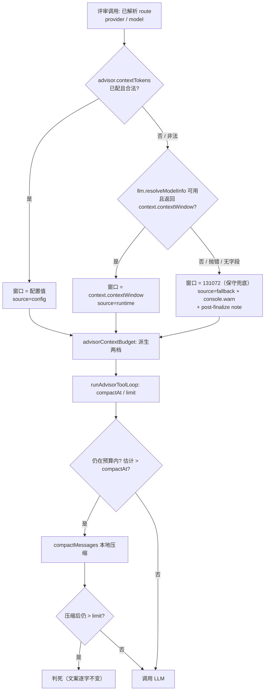
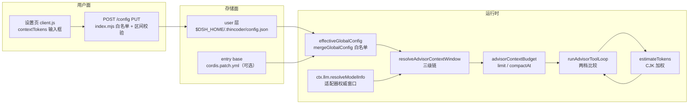

# 设计：评审上下文预算跟随模型窗口 + 评审估算器 CJK 加权 —— 批 5

- 日期：2026-09-13
- 需求档：[`2026-09-13-context-budget-requirements.md`](./2026-09-13-context-budget-requirements.md)（6 用户故事 / 6 非功能标准）
- 设计输入：**会诊 id 1**（glm-5.3 / deepseek-v4-pro / kimi-k3 交付；gpt-6-astra 超时）+ **父侧只读勘察**（DSH 运行时窗口通道）——分歧与裁定见需求档 §0.3 / §0.4
- 章节：按 `METHODOLOGY.md`「设计文档的成文流程与必备章节」九节（§1 背景 · §2 问题 · §3 目标 · §4 决策与理由 · §5 方案 · §6 机制伪代码 · §7 状态与 schema · §8 防偏离 · §9 边界）+ §10 受影响文件与验收 + §11 变更记录；图示：图 1（流程）/ 图 2（数据流）
- 状态：**已实施（v0.11.0）** —— 批 5 已交付（设计评审 轮次 1 `PASS` → 实施 → 独立分歧审计 🔴1 已修 → 交付代码评审 `PASS`；全量 `node --test` **320/320**）。**本行此前滞后写「设计待评审」，2026-09-13 批 10 文档卫生订正**（全流程见 [`README.md`](./README.md) 地图该行）

> ## ⚠️ 行号引用口径（读本档前必读）
>
> 本档行号为 **as-of 2026-09-13 设计定稿**的工作树实测值（落笔前逐个 `read` 核对）。
> **定位方式以符号名为准，不以行号为准**（行号随每次改动漂移，符号名不会）：
>
> | 要找什么 | 检索符号 |
> |---|---|
> | 旧写死上限（本批退役） | `MAX_CONTEXT_TOKENS` |
> | 判死/压缩两档消费点 | `MAX_CONTEXT_TOKENS * 0.8`（本批改为 `budget.compactAt` / `budget.limit`） |
> | 判死尾文案 | `context window limit reached` |
> | 估算器 | `function estimateTokens` |
> | 本地压缩本体（零改） | `export function compactMessages` |
> | 窗口解析接线点（dsh 主路径 / 回落轮） | `resolveSupportedEffort(`（两处，窗口解析紧邻其后） |
> | 循环入口 | `export async function runAdvisorToolLoop` |
> | 配置键三面 | `ADVISOR_MAX_OUTPUT_TOKENS_MIN`（本批新键照抄此先例） |
>
> 本档**不逐个追行号**：批 5 实施后行号必然右移，定位一律走上表符号名。

---

## §1 背景

评审循环（`runAdvisorToolLoop`）里有两个写给「假想模型」的常数：

1. **上限写死 120K**（`MAX_CONTEXT_TOKENS`）——与它实际要调的那个模型的窗口无关；
2. **估算器用 UTF-16 码元数 ÷ 4** ——对中文内容低估约 4×。

两者是同一个安全论证的两半：上限×头寸负责「不越窗」，估算器负责「量得准」。现状是**两半都不成立**：
上限只有本机默认路由（`deepseek-official/deepseek-flash`，适配器声明 **1M**）的 1/8.3；估算器在中文内容上
把「真实 4 tokens/字」量成「0.25 tokens/字」。

上游 thincoder 已分两批修掉同款缺陷（`ADVISOR-CONTEXT-BUDGET` = F27 窗口派生；`ADVISOR-CONVERGENCE` §18 = F32 CJK 加权），
并在 F27 的设计里**自认**「20% 头寸不能完全覆盖 4× 级 CJK 低估，根治 = 估算器修正（另批）」。
本批把两件一起做（理由见需求档 §2.3：拆开任何一件都比现状更糟）。

---

## §2 问题

| # | 问题 | 根因 | 证据（as-of 2026-09-13） |
|---|---|---|---|
| **P1** | 评审上限与真实模型窗口脱钩 | 常量 `MAX_CONTEXT_TOKENS = 120_000` | `lib/advisor.mjs:44`；消费点 `:1155-1161`；当前生效两档 = 触发 96000 / 判死 120000 |
| **P2** | 估算器按 UTF-16 码元 ÷4，CJK 低估 ~4× | `.length` 计码元而非 token | `lib/advisor.mjs:944-946`；`"中"×400` 估 100（真值 ≈400） |
| **P3** | 两缺陷互为前提，单修其一更糟 | 见需求档 §2.3 复算表 | 「只上窗口派生 → CJK 真实死点 ~3.2M 越过 1M 真窗」；「只上估算器 → CJK 死点 480K→120K，4× 回退」 |
| **P4** | 旧注释把「防进程 OOM」当成头寸理由 | 归因错误 | `:44` 注释「上下文窗口预算（预留余量）」；量级论证见需求档 §2.4 |
| **P5** | 上限来源不可观测、不可覆盖 | 无来源标注、无手配键 | 全库无窗口来源输出；`advisor` 组内无窗口相关键（`ADVISOR_OVERRIDE_GROUP_PATHS` = provider/model/effort/timeoutMs/runner） |

**P1 的严重性口径（诚实边界）**：本机会话记录检索 `context window limit reached` **零命中**——这是**潜在缺陷**，
不是本地历史事故；上游同款缺陷是以事故形态暴露的（120225 tokens 判死）。本批动因 = 代码事实 + 上游实证。

---

## §3 目标

| # | 目标 | 验收面 |
|---|---|---|
| G1 | 判死线/压缩触发**由模型窗口派生**（比例式），写死常量退场 | AC-CB1 / AC-CB2 / AC-CB3 |
| G2 | 估算器对 CJK **加权**，纯 ASCII **逐值零回归** | AC-CB4 |
| G3 | 窗口来源**三级可分辨**（手配 > 运行时权威 > 保守兜底），元数据不可得**绝不砖化** | AC-CB5 |
| G4 | 手配键 `advisor.contextTokens` **三面同步**（PUT ⊕ merge ⊕ 设置页） | AC-CB6 / AC-CB7 |
| G5 | 协议面（判定族/六条尾文案/压缩本体/两段式结构）**逐字零改** | AC-CB8 / AC-CB9 |

---

## §4 决策与理由（含否决备选）

| # | 决策 | 理由 / 否决备选 |
|---|---|---|
| **D-CB1** | 窗口来源 = **三级链**：`advisor.contextTokens`（手配）> `llm.resolveModelInfo(provider, model).context.contextWindow`（运行时权威）> `CONTEXT_FALLBACK_WINDOW_TOKENS = 131_072`（保守兜底） | 运行时通道已实证且**本插件已在用**（`lib/effort-resolve.mjs:81`，评审两处接线 `advisor.mjs:1722`/`:1907`）；它返回适配器最终值（pi-ai：`models[].contextWindow ?? 目录 base ?? defaultContextWindow`），**覆盖 settings.yaml 里查不到的内置路由**。**否决**：读 `settings.yaml`（glm-5.3 / v4-pro 主张）——那是用户覆盖层，对内置路由必然落空，且需引入 YAML 解析（违反 N-1）；**否决**：插件内置模型表（v4-pro 主张）——必然随模型 ID churn 腐烂的第三份目录，且它要解决的那类（内置适配器路由）恰由运行时通道解决 |
| **D-CB2** | 兜底值 = **131072（128K）**，不用 262144 | 262144 是 **pi-ai 声明式路由的配置缺省**（本部署 settings.yaml 5/5 provider 同值），对未识别路由不构成证据；**且对 pi-ai 路由它本来就会经权威通道到达**——选 128K 不丢弃它，只是不让它在「一无所知」时冒充证据。失败不对称：高估 → provider 硬报错 + 预算白烧；低估 → 早压缩、评审仍完成。**否决**：262144（v4-pro 主张，把「对该路由一无所知」的判死线抬高 75%，方向与保守教义相反） |
| **D-CB3** | 派生式 = **比例式**：`limit = floor(window × 0.8)`、`compactAt = floor(limit × 0.8)` | 与上游 F27 同构（不发明第三种）；两档分开命名、关系保持 ×0.8；跟随窗口天然适配任何模型的量级。**否决**：绝对预留（小窗崩、大窗浪费）· 混合式（两常数无对应收益）；**否决**：手配值直接当判死线（三源语义分裂成配置地雷）——手配键语义钉死为**窗口** |
| **D-CB4** | 手配键 `advisor.contextTokens`，值域整数 `16384..4194304` | 语义 = 模型窗口（用户从模型规格页照抄）；4M = 本部署实测最大窗（1048576）的 2 倍——挡得住多打一位的笔误，又不约束现实模型。**否决**：不提供手配键（则门面构建 / 非 pi-ai 适配器下用户无路可走；D-29 教训：不可配的键就是不可用的键） |
| **D-CB5** | 接线点 = **已在调 `resolveModelInfo` 的那两处**（`advisor.mjs:1907` 主路径 / `:1722` 回落轮），**每次评审解析一次** | 与 `resolveSupportedEffort` 同缝同点（同一路由对象、同一 llm 句柄）；不改 `resolveAdvisorRoute` 的**纯同步契约**（它是多处复用的纯函数）。解析为进程内调用（`resolveModelInfo` 非 `@Remote`），与既有 effort 解析同量级。**否决**：入口注入（签名扰动 + 重复解析）· 循环内每轮解析（每轮一次往返，无收益） |
| **D-CB6** | 循环只吃 `opts.contextTokens`；**缺省静默回落兜底窗** | 循环不自己解析（保持纯 + 可测）；缺省静默是 N-3 的必然（测试直调 `runAdvisorToolLoop` 时无路由上下文）。「生产忘了传」由 **AC-CB5 的源码级锁**兜住，而不是靠运行期日志 |
| **D-CB7** | 估算器改**函数体**，签名与导出面不变：逐消息 `ceil(ascii/4) + nonAscii` | 纯 ASCII **逐值等于旧式**（`ceil(len/4)`，可机验零回归）；CJK 加权（`"中"` 计 1）。保留「逐消息 ceil」形状（旧式同形）。**否决**：整串估算（改变 ASCII 逐值行为）· 复用主循环 `estimateText`（跨模块耦合，且我们要的是最小面） |
| **D-CB8** | `0.8/0.8` 比例**保留**，只改写注释归因 | 旧注释「防进程 OOM」量级错误（1M tokens ≈ 8MB 字符串，与 V8 堆差两个数量级）；头寸真实用途四项：① 输出预算（输入输出同窗，默认 16384、可配 65536）② 估算器看不见的 system prompt + tools schema ③ 分词漂移 ④ 压缩后增长走廊 |
| **D-CB9** | 观测：**console 告警 + 兜底时 post-finalize note**；**判死文案零改** | 返回文案是协议面（`"Advisor:"` 前缀 = failed 判定契约，`lib/advisor.mjs:1732` 等消费）；机制后缀在 `finalize(...)` 之后追加是既有先例（`dshEffNote`/`dshCapNote`/`fbCapNote`，注释明写「插件元数据不参与 completed 判定/prior 存储」）。**否决**：把窗口来源写进判死文案（动协议面换取诊断，得不偿失） |
| **D-CB10** | 新键**不做会话级覆盖**（不进 `ADVISOR_OVERRIDE_GROUP_PATHS`） | 窗口是模型/端点的属性，不是「本次评审的路线选择」；会话级改模型时窗口由 L2 自动跟随。**否决**：进覆盖组（多一个可漂移的源，收益为零） |
| **D-CB11** | codex-cli 路由**零改动** | `runAdvisorToolLoop` 全库仅三个调用点（`:1727` 回落 dsh / `:1947` dsh 后台 job / `:2011` dsh 同步），**全是 dsh 路由**；codex 走 `runCodexTask` 子进程自管上下文，无消费面 |

---

## §5 方案

**交付单元索引**：FR-CB1 窗口解析链 · FR-CB2 预算派生 · FR-CB3 循环侧消费 · FR-CB4 估算器 · FR-CB5 配置三面同步 · FR-CB6 观测与 note · FR-CB7 接线点（验收映射见 §10.3）。

### §5.1 FR-CB1 窗口解析链（新增异步旁路）



- 逐级下探、命中即止；**任一层的失败都不抛出**（N-3）。
- 非法手配值（越界/非整数）→ `console.warn` + 视为未配，下探 L2（**不是**直接落兜底——用户的意图是「给它一个窗口」，配置打错时权威值比猜值更可信）。

### §5.2 FR-CB2 预算派生（纯函数，可直测）

`advisorContextBudget(windowTokens) → { limit, compactAt }`：

| 窗口 | limit = floor(w × 0.8) | compactAt = floor(limit × 0.8) | 场景 |
|---|---|---|---|
| 131072（兜底） | **104857** | **83885** | 未知路由 / 元数据不可得 |
| 200000 | 160000 | 128000 | glm-5-turbo 一类的声明窗 |
| 262144 | 209715 | 167772 | pi-ai 声明式路由缺省 |
| 1000000 | 800000 | 640000 | **本机默认评审路由（deepseek-flash）** |
| 1024000 | 819200 | 655360 | zai 系 1M 档 |
| 1048576 | 838860 | 671088 | 2^20 |

**两档定义**：`compactAt` = 触发 `compactMessages`（本地裁剪，规则零改）；`limit` = 压缩后仍超即判死（`context_limit`）。
**浮点口径**：**两次 floor**（先 limit 后 compactAt）——与「先派生上限再乘比例」的既有结构同形；与 `floor(w × 0.64)` 在
131072 上差 1 token（83885 vs 83886），**设计钉死两次 floor**，由 AC-CB1 逐值锁定。

### §5.3 FR-CB3 循环侧消费（结构零改，只换阈值来源）

`runAdvisorToolLoop` 在 `while` 之前一次性派生：

```js
const ctxWindow = (Number.isFinite(opts.contextTokens) && opts.contextTokens > 0)
  ? Math.floor(opts.contextTokens) : CONTEXT_FALLBACK_WINDOW_TOKENS
const budget = advisorContextBudget(ctxWindow)
```

两处消费点由 `MAX_CONTEXT_TOKENS * 0.8` / `MAX_CONTEXT_TOKENS` 改为 `budget.compactAt` / `budget.limit`；
`if` 分支结构、二次估算、尾文案**逐字不动**（D-CB9）。

### §5.4 FR-CB4 估算器（函数体改，签名不变）

逐消息：`ceil(ascii码元数 / 4) + 非ASCII码元数`（被测字符串仍是 `JSON.stringify(m.content ?? [])`，与旧式同源）。

| 输入（单条消息内容） | 旧式 | 新式 | 说明 |
|---|---|---|---|
| 纯 ASCII 400 字符 | 100 | **100** | **逐值相等**（零回归） |
| 纯 ASCII 3 字符 | 1 | **1** | 逐消息 ceil 形状保留 |
| `"中"` × 400 | 100 | **400** | 低估 4× 修正 |
| 200 ASCII + 200 CJK | 100 | **250** | 混合（50 + 200） |

### §5.5 FR-CB5 配置三面同步（照抄 `advisor.maxOutputTokens` 先例）

| 面 | 位置（as-of） | 动作 |
|---|---|---|
| 校验单一事实源 | `lib/advisor.mjs:194-236` 一带 | 新增 `ADVISOR_CONTEXT_TOKENS_MIN/MAX` + `isValidAdvisorContextTokens` + `resolveAdvisorContextTokens` |
| PUT | `lib/index.mjs:186-187`（键白名单 + 错误消息）/ `:206-214`（区间校验块） | 加 `contextTokens` 键 + 同款校验分支 |
| merge 白名单 | `lib/config-store.mjs:259-263` | 白名单透传（本层不重复值校验） |
| 设置页 | `lib/client.js:115-119`（内联校验）/ `:223-225`（payload）/ `:308`（回显）/ `:391-392`（reset）/ `:1373-1374`（来源）/ `:1414-1427` 卡片后） | 新增字段卡片 + 提示语 |

**设置页交互规格（UI 决策，须照此实现）**：

1. **卡片标题**：`评审上下文窗口（contextTokens）`；
2. **输入框**：`type=number`，`min=16384`、`max=4194304`、`step=1024`，`placeholder` = `留空 = 评审时自动跟随模型`（**不得写具体数值**——窗口随路由变化，写死必然过时）；
3. **提示行**：必须写明四件事——① 口径 = **模型窗口**（不是判死线）；② 留空时自动跟随（评审时解析：运行时权威值不可得则保守兜底 131072）；③ 合法区间 `16384~4194304`；④ **残余格子提示（承接需求档 R-3）**：若把 `maxOutputTokens` 调得很大而模型窗口较小，20% 头寸可能盖不住输出预算——此时放宽本键或调低输出预算；
4. **当前生效回显 = 仅配置层**：`当前生效（配置层）：<值 | 未设置>（来源 <base|user>）`——复用既有 `fieldSource(base, user, ["advisor","contextTokens"])`（与 `maxOutputTokens` 卡片同款）；**不显示 runtime/fallback 值**：那是评审时才知道的运行时事实，设置页进程取不到——为避免「发明数据源」，本批**不新增服务端 GET 载荷**（零新接线）；
5. **内联校验**：越界/非整数 → 表单内联报错（与 PUT 同规则），不静默丢；
6. **reset 语义**：清空 = 删除该键（回落自动跟随），与既有 `touched`/`setOf` 机制一致。

### §5.6 FR-CB6 观测与 note 通道

| 场景 | console | 返回文本（post-finalize） |
|---|---|---|
| L1 config 命中 | 静默 | 无 |
| L2 runtime 命中 | 静默 | 无 |
| L3 兜底（元数据不可得 / 无 `context` 字段 / 门面构建） | `console.warn` 一行 | **追加一行 note** |
| 非法手配值 | `console.warn`（含合法区间） | 该轮无额外 note（已下探，正常态） |

note 文案（设计钉死形状，实施可微调措辞但须保留四个信息：**值 / 来源 / 两档 / 出口**）：

```
[thincoder-suite] 评审上下文窗口 = 131072（保守兜底；原因：<适配器未提供 context 字段 | 元数据查询失败：<msg> | llm 运行时不可用 | provider/model 未知>）
——压缩触发 83885 / 判死 104857。若该模型窗口更大，请在设置页配置 advisor.contextTokens。
```

**归并方式（最小改动）**：并入既有的机制性后缀变量——主路径 `dshEffNote`（`advisor.mjs:1908`，同时覆盖后台 job 分支
`:1969` 与同步分支 `:2015-2017`）、回落轮 `:1749` 的 `effRes.note` 链。**不新增第三个后缀变量**。

### §5.7 FR-CB7 接线点（两处，各 3 行）

| 位置 | 现状 | 新增 |
|---|---|---|
| 主路径 | `:1907` `const effRes = await resolveSupportedEffort(...)` → `:1909` `loopOpts` | 其后 `const winRes = await resolveAdvisorContextWindow(deps.llm ?? null, route.provider, route.model, config)`；`loopOpts` 增 `contextTokens: winRes.window` |
| 回落轮 | `:1722` `const effRes = await resolveSupportedEffort(...)` → `:1727` `runAdvisorToolLoop(deps, {...})` | 同上（用 `fbRoute`），opts 增 `contextTokens` |

---

## §6 机制伪代码

```js
// ── 常量（lib/advisor.mjs）──────────────────────────────
export const CONTEXT_FALLBACK_WINDOW_TOKENS = 131_072  // 保守兜底（= 2^17；非 DSH 声明缺省 262144，理由 D-CB2）
export const CONTEXT_LIMIT_RATIO = 0.8                 // 判死线 = 窗口 × 0.8
export const COMPACT_TRIGGER_RATIO = 0.8               // 压缩触发 = 判死线 × 0.8
export const ADVISOR_CONTEXT_TOKENS_MIN = 16_384
export const ADVISOR_CONTEXT_TOKENS_MAX = 4_194_304

// ── 预算派生（纯函数）───────────────────────────────────
export function advisorContextBudget(windowTokens) {
  const w = (Number.isFinite(windowTokens) && windowTokens > 0)
    ? Math.floor(windowTokens) : CONTEXT_FALLBACK_WINDOW_TOKENS
  const limit = Math.floor(w * CONTEXT_LIMIT_RATIO)
  const compactAt = Math.floor(limit * COMPACT_TRIGGER_RATIO)
  return { limit, compactAt, window: w }
}

// ── 手配键校验/解析（单一事实源；index.mjs PUT 与运行时共用）──
export function isValidAdvisorContextTokens(v) {
  return typeof v === "number" && Number.isFinite(v) && Number.isInteger(v)
    && v >= ADVISOR_CONTEXT_TOKENS_MIN && v <= ADVISOR_CONTEXT_TOKENS_MAX
}
export function resolveAdvisorContextTokens(config) {   // → number | null
  const adv = (config?.advisor && typeof config.advisor === "object" && !Array.isArray(config.advisor))
    ? config.advisor : {}
  const raw = adv.contextTokens
  if (raw === undefined || raw === null) return null
  if (isValidAdvisorContextTokens(raw)) return raw
  console.warn("[thincoder-suite] advisor.contextTokens " + JSON.stringify(raw)
    + " 非法（需要 " + MIN + ".." + MAX + " 的整数）——忽略并下探运行时窗口")
  return null
}

// ── 窗口解析链（异步旁路；fail-open）────────────────────
export async function resolveAdvisorContextWindow(llm, provider, model, config) {
  // L1 手配
  const cfgWin = resolveAdvisorContextTokens(config)
  if (cfgWin !== null) return { window: cfgWin, source: "config", note: null }

  // L2 运行时权威（与会话 effort 解析同源同缝）
  const fail = (reason) => {
    const note = "评审上下文窗口 = " + FALLBACK + "（保守兜底；原因：" + reason + "）"
      + "——压缩触发 " + bud.compactAt + " / 判死 " + bud.limit
      + "。若该模型窗口更大，请在设置页配置 advisor.contextTokens。"
    console.warn("[thincoder-suite] " + note)
    return { window: FALLBACK, source: "fallback", note }
  }
  const bud = advisorContextBudget(FALLBACK)
  if (!llm || typeof llm.resolveModelInfo !== "function") return fail("llm 运行时不可用/无 resolveModelInfo")
  if (!provider || !model) return fail("provider/model 未知")
  let info = null
  try { info = await llm.resolveModelInfo(provider, model) }
  catch (e) { return fail("元数据查询失败：" + (e?.message ?? String(e))) }
  const w = info?.context?.contextWindow
  if (!Number.isInteger(w) || w <= 0) return fail("适配器未提供 context.contextWindow")
  return { window: w, source: "runtime", note: null }
}

// ── 估算器（函数体改，签名不变）──────────────────────────
function estimateText(s) {
  let nonAscii = 0
  for (let i = 0; i < s.length; i++) if (s.charCodeAt(i) > 0x7f) nonAscii++
  return Math.ceil((s.length - nonAscii) / 4) + nonAscii
}
function estimateTokens(messages) {
  return messages.reduce((sum, m) => sum + estimateText(JSON.stringify(m.content ?? [])), 0)
}

// ── 循环（结构零改，只换阈值来源）────────────────────────
export async function runAdvisorToolLoop(deps, opts) {
  const budget = advisorContextBudget(
    (Number.isFinite(opts.contextTokens) && opts.contextTokens > 0)
      ? opts.contextTokens : CONTEXT_FALLBACK_WINDOW_TOKENS)
  while (true) {
    ...
    const currentTokens = estimateTokens(messages)
    if (currentTokens > budget.compactAt) {               // 原 MAX_CONTEXT_TOKENS * 0.8
      compactMessages(messages)
      if (estimateTokens(messages) > budget.limit) {      // 原 MAX_CONTEXT_TOKENS
        return "Advisor: context window limit reached (…). Review incomplete — …"  // 逐字不变
      }
    }
    ...
  }
}

// ── 接线（两处，主路径 / 回落轮）─────────────────────────
const winRes = await resolveAdvisorContextWindow(deps.llm ?? null, provider, model, config)
const loopOpts = { …, contextTokens: winRes.window }
// 机制后缀：note 非空时并入既有 dshEffNote / effRes.note 链（post-finalize）
```

---

## §7 状态与 schema

### §7.1 数据流（配置三面 → 运行时 → 循环）



### §7.2 持久化 schema（**无新增文件、无版本升级**）

`$DSH_HOME/.thincoder/config.json`（既有）：

```json
{ "version": 1,
  "config": {
    "advisor": { "contextTokens": 1000000, "round1": { "...": "..." } }
  } }
```

- 新键 = `config.advisor.contextTokens`（可选整数；与 `maxOutputTokens` 同级、同文件、同版本号——**additive，不 bump `version`**）；
- merge 语义 = 白名单透传（与 `maxOutputTokens` 逐字同款）；
- 缺省 = **键不存在**（区别于 `null`/`0`；不存在才走 L2/L3）；
- 会话级覆盖：**无**（D-CB10，`ADVISOR_OVERRIDE_GROUP_PATHS` 不动）。

### §7.3 内存态

**零新增**。窗口解析是每次评审一次的局部值（不缓存、不落盘）；`codexFailureCount` 一类的会话级计数不受影响。

---

## §8 防偏离

### §8.1 零改面（逐字保全，验收拒收项）

| 面 | 位置 | 判据 |
|---|---|---|
| 判死尾文案 | `advisor.mjs:1159` | 逐字：`Advisor: context window limit reached (<N> tokens). Review incomplete — too many tool calls. Try a narrower scope.` |
| 两段式守卫结构 | `:1156-1161` | 顺序不变（先 `compactMessages` 后二次估算判死）；`if` 嵌套形状不变 |
| `compactMessages` 本体与摘要串 | `:956-974` | 源码逐字未改（`[Context compacted] …` 串不动）；T13 原样绿 |
| `estimateTokens` 签名与调用面 | `:944-946` | 仍为 `(messages) → number`、模块内私有（不新增导出） |
| 判定族六 kind / 其余五条尾文案 | 全文件 | 零 diff |
| `resolveAdvisorRoute` | `:280` | 仍是**纯同步**函数（窗口解析走异步旁路） |
| codex 路由 | `:1680` 一带 | 零 diff |
| 既有测试 | `test/**` | **零用例修改**；全量 304 原样绿（N-5） |

### §8.2 反向控制（fail-when-unfixed，必做）

**夹具（算术钉死——评审 #4）**：`firstUserText` = **786432 个 ASCII 字符**（= 12 × 65536，与 `MAX_RESULT_CHARS` 同量纲）⇒
`estimateTokens(messages) = 786432 / 4 = **196608**`。**夹具必须是单条消息**：消息总数 ≤ 20 ⇒ `compactMessages` 必然早退
（`if (messages.length <= 20) return` 是它的第一条守卫），故三行矩阵不依赖压缩行为、可确定复现。
（**否决**多轮工具结果夹具：12 轮会把消息数推过 20 条门槛而触发压缩，压缩后估值随裁剪规则变化——若确要覆盖该路径，
另立可选项 T-CB3b 并显式断言压缩前后的两个估值，不计入 AC-CB2/AC-CB3。）

| 版本 | 期望 |
|---|---|
| **HEAD（未修）** | 判死：尾行以 `Advisor: context window limit reached (196608 tokens)` 收尾 |
| 交付版 + `contextTokens: 1_000_000` | **正常收尾**（不判死，无 `context_limit` marker） |
| 交付版 + 兜底 131072 | 判死，尾文案**逐字**同 HEAD |

### §8.3 机验锚（防静默退化）

- `MAX_CONTEXT_TOKENS` 在 `lib/` 递归扫描**零命中**（常量真退场，不留别名——防双源漂移）；
- 两处接线点**源码级锁**：`resolveAdvisorContextWindow(` 在 `advisor.mjs` 恰好出现 2 次调用 + 1 次定义，且每次调用后
  同函数体内出现 `contextTokens:`（防「生产忘了传」由 AC-CB5 兜住，而非靠运行期日志）；
- `estimateTokens` 纯 ASCII 逐值等价：用**旧式公式的独立复算函数**与新式对比（多组长度，含 ceil 边界 4k±1）。

---

## §9 边界

**本批不做**（与需求档 §5 一致）：内置模型表 / settings.yaml 解析 / codex 路由 / 服务端窗口与 tpm /
`compactMessages` 与判定族 / `estimateTokens` 签名与导出面 / `resolveAdvisorRoute` 同步契约 /
consult·escalate·eng 的本地守卫。

**未确认面（如实登记）**：

| # | 项 | 状态与处置 |
|---|---|---|
| U-1 | 本部署**运行时** `ctx.llm.resolveModelInfo` 是否真可用 | 静态证据充分（`lib/effort-resolve.mjs:81` 生产路径已在调，且 fail-open）；**实机确认点 = 部署后首次真实评审**（若走 L3 兜底，note 会明说原因——不静默） |
| U-2 | 部分 app 构建下 `ctx.llm` 是门面（`lib/index.mjs:490-491`/`:517-521` 记录 2026-09-07 实证：仅 `stream`/`resolveModel`，无 `list*`） | 该实证**只涉及 `list*`**，未涉及 `resolveModelInfo`；本批按 N-3 fail-open 设计，门面构建下自动落 L3 + note |
| U-3 | 某些适配器可能不返回 `context` 字段 | 已按 `!Number.isInteger(w) → fail(...)` 处理（复用 `dsh-compaction-basic` 同款判据） |
| U-4 | 星平面字符（emoji）按 UTF-16 码元计 2 | 与上游同口径；登记（需求档 R-1），本批不改 |
| U-5 | 吸收清单行号漂移（**两处**，评审 #5 补全）：§1 **P1** 引 `:1032/:1034` 实为 `:1155-1161`；§1 **P2** 引 `:820-821` 实为 `:944-946` | **设计期不改台账**（防改写审计基线——批 3 教训）；**批 5 收口时随批更新**（P1/P2 两行 + §2 的 `ADVISOR-CONTEXT-BUDGET`/`VSC-REVIEW-ASYNC-SWEEP-B4` 两行） |
| U-6 | 上游档（`D:\workspace\thincoder\docs\...`）在**工作区外，设计评审方读不到**（评审 #7 实测） | 本档对上游的引用是**父侧核验值**，在仓可读锚点 = 吸收清单 §2 对应两行；上游原文不可复核这一事实如实登记（不改设计结论——§2.3 的论证自洽可独立复算） |

---

## §10 受影响文件全清单与验收

### §10.1 实施域（eng-coder 写域）

| # | 文件 | 当前行数（as-of） | 动作 | 预计增量 |
|---|---|---|---|---|
| 1 | `lib/advisor.mjs` | 2023 | 常量（退役 `MAX_CONTEXT_TOKENS` / 新增 4 常量）+ `advisorContextBudget` + `isValidAdvisorContextTokens`/`resolveAdvisorContextTokens` + `resolveAdvisorContextWindow` + `estimateTokens` 函数体 + 循环消费 + 两处接线 + note 归并 + 注释归因改写（D-CB8） | +~70 |
| 2 | `lib/config-store.mjs` | 316 | merge 白名单透传 `advisor.contextTokens` | +4 |
| 3 | `lib/index.mjs` | 1155 | PUT 键白名单 + 区间校验 + 错误消息 | +6 |
| 4 | `lib/client.js` | 1569 | 设置页字段卡片（标题/输入框/提示/回显）+ 内联校验 + payload + 回显 + reset（§5.5 六条 UI 规格） | +~40 |
| 5 | `test/context-budget.test.mjs` | 新 | T-CB1–T-CB8 | ~200 |

**测试基建**：`test/*.test.mjs` 无注册清单（既有惯例）；新档零网络、零真实 LLM（`deps.llm.stream` 桩）、零长等待。

### §10.2 文档域（本设计者写域）

| 文件 | 变更 |
|---|---|
| `docs/2026-09-13-context-budget-requirements.md` | 新建（本批需求） |
| `docs/2026-09-13-context-budget-design.md` | 本档 |
| `docs/README.md` | 索引增两行 |
| `docs/2026-09-12-absorption-inventory.md` | **仅收口时**更新 §1 **P1 + P2** 两行（状态 + 行号修正）与 §2 对应两行（`ADVISOR-CONTEXT-BUDGET` / `VSC-REVIEW-ASYNC-SWEEP-B4`）的状态（评审 #5；细节见 U-5） |
| `CHANGELOG.md` / `README.md`（插件根） | 收口时随批（父侧写域） |

### §10.3 用例与验收标准

| AC | 回指 | 用例 | 判据 |
|---|---|---|---|
| **AC-CB1** | G1 / US-2 | T-CB1 | `advisorContextBudget` 六组数对逐值（§5.2 表）；非法入参不抛且落兜底派生 |
| **AC-CB2** | G1 / US-1 | T-CB2 | 1M 窗 + 196608 tokens → **不判死**、评审正常收尾 |
| **AC-CB3** | G1 / US-2 | T-CB3 | 兜底 131072 + 同夹具 → 判死且尾文案**逐字**吻合 |
| **AC-CB4** | G2 / US-3 | T-CB4 | 纯 ASCII 与旧式**逐值相等**（≥8 组，含 ceil 边界）；`"中"×400`→400；混合→250 |
| **AC-CB5** | G3 / US-4 | T-CB5 + 源码锁 | 四级分支逐断言（config / config 非法下探 / runtime / 不可得→fallback+note）；两处接线点源码级锁 |
| **AC-CB6** | G4 / US-5 | T-CB6 | PUT：合法落盘、越界/非整数报错且不入 sanitized、未知键消息含新键名 |
| **AC-CB7** | G4 / US-5 | T-CB7 | merge 白名单透传；base 未定义时不产生空键 |
| **AC-CB8** | G5 / US-6 | T-CB8 + 反向控制 | `MAX_CONTEXT_TOKENS` 零残留；判死文案逐字在位；HEAD 版夹具判死可复现 |
| **AC-CB9** | N-5 | 全量 | `node --test` = 既有 304 **原样全绿** + 新增全绿（零用例修改） |

---

## §11 变更记录

| 日期 | 变更 |
|---|---|
| 2026-09-13 | 首版（设计待评审）：会诊 id 1 三份裁定 + 父侧只读勘察（运行时窗口通道）→ 九节 + 图 1/图 2；D-CB1–D-CB11 决策记录；AC-CB1–AC-CB9 |
| 2026-09-13 | 设计评审**轮次 1 PASS**（🔴0 · 🟡3 · 🔵4；路由 `zai-coding-cn:glm-5.3`，900s 预算，job `advisor-dsh-4`）。**7 条发现同链处置（无新范围，不触发重评审——对齐上游「PASS 后 advisory 全修」先例）**：#1 🟡 设置页回显缺数据源 → §5.5 第 2/4 条改写（占位去数值化 + 回显限「配置层」+ **明确不新增服务端 GET 载荷**）· #2 🟡 R-3 残余格子提示缺落点 → 补入 §5.5 第 3 条④ · #3 🟡「Advisor:」前缀语义两档说法相反 → 订正需求档 §0.3 #5（前缀 = **失败**判定契约，`advisor.mjs:1732` 消费）· #4 🔵 反向控制夹具算术未验证 → §8.2 钉死为**单条 786432 字符**夹具（消息数 ≤20 ⇒ `compactMessages` 必为 no-op）+ 显式否决多轮夹具 · #5 🟡 收口台账更新面不全 → U-5/§10.2 由 P1 扩为 **P1+P2+§2 两行** · #6 🔵 方案节未按交付单元组织 → §5 重编号为 **FR-CB1…FR-CB7** + 索引行 · #7 🔵 上游档在工作区外不可读 → 登记 **U-6**（父侧核验值，在仓锚点 = 吸收清单 §2）。 |

---

## §12 交付后修正（父侧——**本追加与上文本冲突时以本追加为准**）

**背景**：批 5 由 `eng_coder` 交付（完成轮，`eng-dsh-1`），终态 **319 tests / 319 pass / 0 fail**（既有 304 原样全绿）。
交付报告如实登记了两处**设计档本身的数字缺口**；两处都在本设计者写域，父侧据此修正。

| # | 缺口 | 修正 |
|---|---|---|
| **C-1** | §8.2 的夹具算术是**纯字符串口径**：写「786432 字符 ÷ 4 = **196608**」，但生产估算测的是 `JSON.stringify(m.content ?? [])`（含 `[{"type":"text","text":"…"}]` 信封，实测 **786459** 字符）⇒ 实测估值 = **196615**（Δ=7） | **以 196615 为准**；§8.2 与 §10.3 里出现的 `196608` 一律读作 **196615**。**判死语义零影响**（两侧均远大于兜底判死 104857）；新测档已同时保留设计口径常量 `DESIGN_ARITHMETIC_ESTIMATE === 196608` 与实测 196615 并断言，**夹具不确定性不存在** |
| **C-2** | §10.1「预计增量」列是**估计值**，实际偏大 | 实测（LF 口径，`git numstat` 为准）：`lib/advisor.mjs` 2023 → **2140**（`+123/-6`，净 +117；估 +70）· `lib/client.js` 1569 → **1612**（`+43`；估 +40 ✓）· `lib/config-store.mjs` 316 → **322**（`+6`；估 +4 ✓）· `lib/index.mjs` 1155 → **1167**（`+14/-2`；估 +6）· 新测档 `test/context-budget.test.mjs` **625** 行（估 ~200）。偏差根因 = 估算口径（含注释/边界分支与 T-CB9 46 行），**非削减**——AC-CB1…AC-CB9 逐条有可失败断言 |
| **C-3** | §10.3 的 AC 表**没有 UI 用例**（`client.js` 是宿主内联 bundle，本进程无法渲染） | 交付者按仓内既有先例（`codex-runner.test.mjs` 的「设置页表单接线齐全」静态核对）新增 **T-CB9 源码级锁**，逐条覆盖 §5.5 六条 UI 规格 + payload/回填/两端口径常量同值/渲染串零 markdown 泄漏。**判定：超出 AC 表的加锁（合规），不是偏离**——并顺带抓出并修掉一处真缺陷：提示行把设计档的 markdown 强调 `**不是**判死线` 当字面量渲染（卡片上会显示两个星号） |
| **C-4** | 未确认面 U-1（`ctx.llm.resolveModelInfo` 本部署实机可用性） | **保持未确认**：交付的全部窗口解析证据走 `deps.llm` 桩；实机确认点 = 部署后首次真实评审（走 L3 兜底时 note 会明说原因，**不静默**） |
| **C-5** | 未确认面（新增）：`client.js` 卡片**视觉呈现**未经机上验证 | 登记：静态源码锁 ≠ 渲染验证（无 DOM 测试面）；首次打开设置页时人工确认 |
| **C-6** | 台账更新（U-5 / §10.2） | **父侧收口时执行**（设计期不改台账的纪律未破） |

**交付证据摘要（父侧采信）**：① 手工反向控制——HEAD 版同夹具实测判死 `Advisor: context window limit reached (196615 tokens)…` 且 `LLM 调用数 = 0`；交付版 **sha256 逐字节还原**（`30B53E9B…043C9`，`+123/-6` 与换出前一致）；② 零改面 diff 判据：`^[-+].*"Advisor:` **零命中**、`[Context compacted]`/`messages.length <= 20` 零命中、`resolveAdvisorRoute` 零命中、`runCodexTask` 零命中、`ADVISOR_OVERRIDE_GROUP_PATHS` 零命中；③ `test/` **零用例修改**（`git diff --numstat -- test` 为空）。 |
