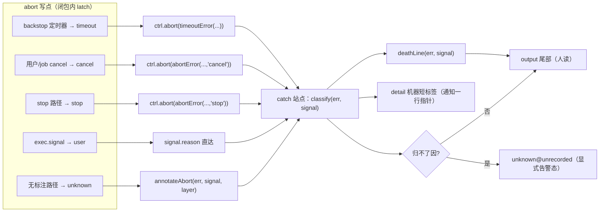
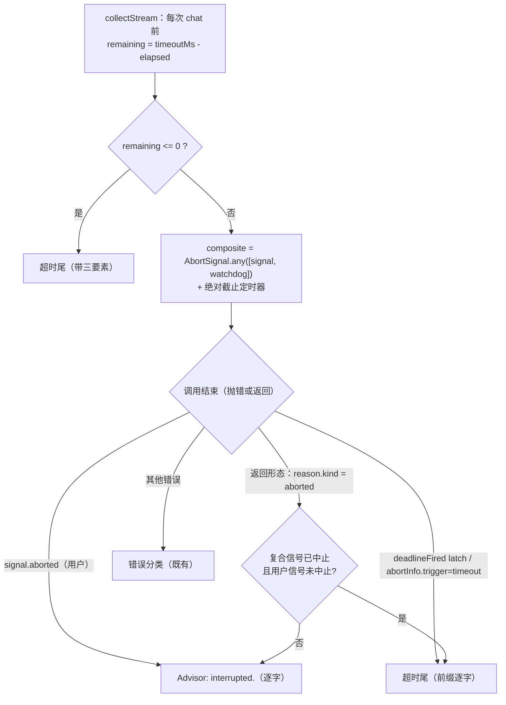

# 设计：死亡可诊断（守卫 D 判定换血 + 四家族 abort 溯源 + 裸 abort 灭绝）—— 批 6

- 日期：2026-09-13
- 需求档：[`2026-09-13-death-diagnosability-requirements.md`](./2026-09-13-death-diagnosability-requirements.md)（5 用户故事 / 5 非功能标准）
- 设计输入：**会诊 id 1**（deepseek-v4-pro / glm-5.3 **两份均交付**；含对我方勘察的**两处前提纠错**与守卫 E 的**结算侧指纹兜底**——见需求档 §0.2/§0.3）
- 章节：九节（§1 背景 · §2 问题 · §3 目标 · §4 决策与理由 · §5 方案 · §6 机制伪代码 · §7 状态与 schema · §8 防偏离 · §9 边界）+ §10 受影响文件与验收 + §11 变更记录；图示：图 1（归因数据流）/ 图 2（墙判定）
- 状态：**设计待评审**

> ## ⚠️ 行号引用口径（读本档前必读）
>
> 行号为 **as-of 批 5 交付后**实测值，会随每次改动漂移。**定位一律按符号名**：
>
> | 要找什么 | 检索符号 |
> |---|---|
> | 逐调用硬墙（已存在，本批只换**判定**） | `async function collectStream` |
> | 墙判定的错误点（现有的文本嗅探在此） | `/deadline reached/` |
> | 循环 catch（本批主战场） | `runAdvisorToolLoop` 内 `catch (e)` |
> | 超时尾 | `timeoutMsg` |
> | 用户中断尾 | `Advisor: interrupted.` |
> | 裸 abort 写点 | `.abort()`（无参调用） |
> | 四家族的通用死亡文案 | `eng_coder aborted.` / `escalate (` + `) aborted.` / `Advisor: interrupted.` / `"aborted"` |
> | 完成判定（前缀逐字依赖） | `startsWith("Advisor:")` |

---

## §1 背景

我们的四个机制家族（advisor / eng / escalate / consult）都有「子任务或 LLM 调用被中止」的路径。
它们今天**全部**把不同死因写成同一句通用文案——`"eng_coder aborted."`、`"Advisor: interrupted."`、`"aborted"`。
更糟的是：**「谁按下的」在写点就已经丢了**——同一 controller 有多个写者，其中若干调用 `.abort()` **不带 reason**。

上游 `ABORT-PROVENANCE`（第 24 批）用「结构化 `err.abortInfo` + 报告面合成器」修掉同类问题，
并留下一条硬判据：**不改 abort 机制本体，只加可诊断性**。

我方有**生产事故实证**：`consult.mjs` 的注释自认「2026-09-08 生产：20 次失败全被读成『aborted 无死因』」，
当时是靠连续 21 次尝试才诊断出 D-28。**这不是假想问题。**

同时本批顺带收掉守卫 D 的最后两块（判定换血 + 预算提示）——它与溯源**共用同一个载体与同一批 catch 站点**，
分开做会把同一批行改两遍，且中间形态（一半嗅探一半结构化）比现状更难审。

---

## §2 问题

| # | 问题 | 根因 | 证据（符号） |
|---|---|---|---|
| **P1** | 死因坍缩（四家族） | 每个 catch 只透传一句话；写点已丢 reason | `eng_coder aborted.`（3 处，其一 `detail:"aborted"`）· `escalate (… ) aborted.`（3 处）· `Advisor: interrupted.`（4 处）· consult 两分 |
| **P2** | 墙判定靠文本嗅探 | `/deadline reached/` 正则 | 适配器以无声样的 AbortError 抛出 → 误判 `interrupted` + 丢超时统计 |
| **P3** | 预算将尽静默 | 无提示机制 | `timeoutMs` 可配 1h |
| **P4** | 超时尾统计不全 | 只有 rounds/files | `timeoutMsg` |
| **P5** | 五处裸 `.abort()` | 多写者、部分不传 reason | `forwardSignal`（eng/escalate）、consult forward 与 stop 循环 |
| **P6** | 取消后立即重派 → 旧完成通知可能被误读 | 槽位清除即失忆 | **缓议**（需求档 §0.5） |

---

## §3 目标

| # | 目标 | 验收面 |
|---|---|---|
| G1 | 四家族死亡**四分辨**（user / timeout / cancel / crash），归不了因时显式 `unknown` | AC-AP1 / AC-AP5 |
| G2 | **零文案回归**：所有既有前缀逐字保留 | AC-AP2 |
| G3 | 墙判定**绑信号状态**，删除文本嗅探 | AC-AP3 |
| G4 | 预算将尽**一次性**可见提示，且不污染正文/prior | AC-AP4 |
| G5 | 超时尾含统计 + 配置指引 | AC-AP6 |
| G6 | 裸 `.abort()` 灭绝（`grep` 零命中）；机制本体零改 | AC-AP7 |
| G7 | 单一词汇表（一个模块、无第二套字面） | AC-AP8 |

---

## §4 决策与理由（含否决备选）

| # | 决策 | 理由 / 否决备选 |
|---|---|---|
| **D-AP1** | 载体 = **结构化 `err.abortInfo = {trigger, layer, detail}`** | 可机判 + message 零改（零回归）。**否决**：message 内嵌（会撞 `startsWith("Advisor:")` 判定与既有 fixture）· 新通道（多一个观察面） |
| **D-AP2** | `trigger` 五值 `user/timeout/cancel/stop/unknown`；`unknown` **是显式告警态** | 归不了因正是最难查的形态；静默回落 = 本批白做 |
| **D-AP3** | `layer` 映射：**provider**（适配器/CLI 面）· **agent**（我方自持控制器：backstop / budgetCap 定时器 / stall 看门狗 / forwardSignal 中继）· **settle**（宿主面：`exec.signal` abort、job kill → cancel 回调）· **unrecorded**（无信号无标注，计入 unknown 告警） | 上游三层语义到我方的**重新映射**（不是照抄）：我方多一层「自持控制器」 |
| **D-AP4** | **分类在 abort 写点闭包内 latch**，结算处读 latch；**不从错误对象倒推** | 竞态实据（两家各自给出）：子代理可能以 **resolve**（`stopReason=aborted`）而非 reject 结束——错误对象里没有「谁按下的」 |
| **D-AP5** | 死亡行 = `<原 message 逐字>[ ← cause: <cause.message>][ · abort(<trigger>@<layer>:<detail>)]`，**只在**有 `abortInfo` ∨ `signal?.aborted` ∨ `err.name ∈ {AbortError, TimeoutError}` 时追加；总长 ≤300（超长先截 detail） | 正常失败零污染；前缀逐字是 `completed` 判定的依赖 |
| **D-AP6** | 机器短标签 `abort(<trigger>@<layer>)` 进 **`detail`** 字段（替换今天的 `detail:"aborted"` 纯丢失形态）；死亡行进 `output` 尾部 | 两个消费者分开：通知一行指针要短（`detail`），人要可读（`output`） |
| **D-AP7** | 墙判定：**信号状态/latch 优先** → `AbortError` 回落 `interrupted`（现行为）→ **文本正则全删** | 正则只可能匹配我们自己的 reason，而该 reason 改带 `abortInfo` 后即冗余；留着 = 双源漂移起点。**否决**：保留正则作「兜底」 |
| **D-AP8** | 超时尾**前缀逐字**保留（`Advisor: review timeout after {S}s.`），其后追加三要素统计 + 预算行 | 前缀是判定族字面依赖（`startsWith("Advisor:")` / `extractUnfixedIssues` / fixture） |
| **D-AP9** | 0.75 提示 = 纯函数 `shouldBudgetNudge(elapsed, timeoutMs, alreadyNudged)` + 循环顶检查，**每场至多一次**；文本走 `messages` 注入，**绝不进返回正文/prior** | 纯函数可机测；提示是**墙钟维**，不在提示里谈 token 预算（两套诊断不搅浑） |
| **D-AP10** | 裸 `.abort()` 五处**补 reason**（只加载荷，不改触发条件与时长） | 「不改机制本体」的边界就是「只加诊断载荷」；判据 = 零新增写点、零定时器变更 |
| **D-AP11** | 本批**不做**守卫 E 与墓碑（需求档 §0.5） | 守卫 E 的键与批 4 的 `designDocKey` 同族，须排其后；墓碑零消费者 |

---

## §5 方案

### §5.1 FR-AP1/FR-AP2/FR-AP5 归因数据流（图 1）



**四家族接线站点（逐符号）**：advisor 循环 catch + 两条 job catch + 外层 catch；eng 三处；
escalate 三处；consult 五处（含 `session.stopped` 面）。**已可分辨的站点不改**（eng/escalate 的超时信封、
`dshTimedOut` 分支）——只对齐词汇表命名。

### §5.2 FR-AP3 墙判定（图 2）



**关键**：原判定 `if (/deadline reached/.test(e.message))` **删除**；改由 `deadlineFired` latch /
`err.abortInfo.trigger === "timeout"` 判定，**抛错形态与返回形态同判**（后者是多数实现者会漏掉的一条路）。

### §5.3 FR-AP4 0.75 一次性提示

检查点在循环顶部（与既有预算检查同处）；判定抽成纯函数；文本形如
`[thincoder-suite] 评审预算已用 75%（elapsed/total）——可收窄范围或上调 advisor 组 timeoutMs。`
注入为 `messages` 中的一条 user 消息（**不进返回正文、不进 prior**）。

### §5.4 FR-AP6 超时尾扩容

```
Advisor: review timeout after {S}s. completed {R} tool rounds · tool calls: {T} · review text produced: {yes|no}
budget: {S}s（advisor 组 timeoutMs）——收窄范围重发，或上调该组 timeoutMs。
```
**第一行前缀逐字不动**；既有 `(completed R tool rounds, F files read)` 属**判定族字面**，替换为三要素时
必须同步全仓字面断言（`grep` 该句，逐处更新）。

---

## §6 机制伪代码

```js
// ── lib/abort-provenance.mjs（新模块，唯一词汇表）──────────────
export const TRIGGERS = ["user", "timeout", "cancel", "stop", "unknown"]
export const LAYERS   = ["provider", "agent", "settle", "unrecorded"]

/** 从信号读触发源（Node ≥17.2 的 signal.reason 标准面；不读 message 文本） */
export function triggerOf(signal) {
  const r = signal?.reason
  if (!r) return { trigger: signal?.aborted ? "unknown" : null, detail: "no reason on signal" }
  if (r.abortInfo?.trigger) return { trigger: r.abortInfo.trigger, detail: r.abortInfo.detail ?? "" }
  if (r.interrupt === true) return { trigger: "user", detail: "caller interrupt" }
  if (r.name === "TimeoutError" || r.abortTrigger === "timeout") return { trigger: "timeout", detail: "" }
  if (r.abortTrigger === "cancel") return { trigger: "cancel", detail: "" }
  if (r.abortTrigger === "stop")   return { trigger: "stop",   detail: "" }
  return { trigger: "unknown", detail: String(r.message ?? r).slice(0, 80) }
}

export function abortError(signal, layer, detail, trigger = "cancel") { /* Error + .abortInfo */ }
export function timeoutError(message, layer, detail) { /* trigger: "timeout" */ }
export function annotateAbort(err, signal, layer, detail) { /* 4th layer 缺省 "unrecorded" */ }

/** 死亡行：原 message 逐字 + 可选 cause + 可选 abort 后缀；总长 ≤300 */
export function deathLine(err, signal) {
  const msg = String(err?.message ?? err ?? "")
  const info = err?.abortInfo ?? (signal?.aborted ? { ...triggerOf(signal), layer: "unrecorded" } : null)
  if (!info && !["AbortError", "TimeoutError"].includes(err?.name)) return msg
  const cause = err?.cause?.message ? " ← cause: " + String(err.cause.message).slice(0, 120) : ""
  const tag = " · abort(" + (info?.trigger ?? "unknown") + "@" + (info?.layer ?? "unrecorded")
    + (info?.detail ? ": " + String(info.detail).slice(0, 120) : "") + ")"
  return (msg + cause + tag).slice(0, 300)
}

// ── 写点补 reason（只加载荷；触发条件/时长零改）──────────────
// eng/escalate:  const forwardSignal = () => { try { dshCtrl.abort(abortError(signal, "agent", "parent signal")) } catch {} }
// consult:       看门狗改为 ctrl.abort(timeoutError("consult watchdog", "agent", ...))——timedOut latch 由
//                ctrl.signal.reason 派生后删除；stop 路径 ctrl.abort(abortError(null, "agent", "stop requested", "stop"))

// ── collectStream：墙判定 latch 化 ────────────────────────
let deadlineFired = false
const deadlineTimer = setTimeout(() => { deadlineFired = true; wd.abort(timeoutError("deadline reached", "provider", "review budget exhausted")) }, deadlineMs)
// catch 侧（runAdvisorToolLoop）——顺序不变：绝对截止优先于 interrupted
if (e?.abortInfo?.trigger === "timeout" || deadlineFired) return timeoutMsg()   // 原：/deadline reached/.test(e.message)
if (e?.name === "AbortError" || signal?.aborted) return "Advisor: interrupted."
// 返回形态（不抛错）：reason.kind === "aborted" ⇒ 同上判（复合中止且用户未中止 → 超时尾）

// ── 0.75 一次性提示（纯函数）──────────────────────────────
export function shouldBudgetNudge(elapsed, totalMs, alreadyNudged) {
  return !alreadyNudged && totalMs > 0 && elapsed >= totalMs * 0.75
}
```

---

## §7 状态与 schema

| 面 | 变更 |
|---|---|
| 磁盘 schema | **零变更**——本批不新增任何持久化字段/文件；死亡行与短标签都是**返回值/通知**面 |
| 运行时新增 | 每个在飞调用内的三个局部量：`deadlineFired`（latch）、`budgetNudged`（一次性旗标）、`err.abortInfo`（错误对象上的结构化标注） |
| 新模块 | `lib/abort-provenance.mjs`（纯函数，无状态、无 IO） |
| 词汇表权威 | `TRIGGERS`（5）/ `LAYERS`（4）只在本模块定义；其他文件一律 import，禁止字面复制 |

---

## §8 防偏离

### §8.1 零改面（验收拒收项）

| 面 | 判据 |
|---|---|
| 既有死亡文案**前缀** | `"Advisor: interrupted."` / `"eng_coder aborted."` / `"escalate (…"` 逐字保留（后缀只追加） |
| `completed` 判定 | `startsWith("Advisor:")` 零改 |
| 机制本体 | 零新增 `.abort(` 写点；零定时器时长/条件变更；`grep '\.abort()' lib/` → **0 命中** |
| `dshBackgroundTimeoutMs` 兜底 | 语义零改（与 per-call 墙是两层故障面） |
| 批 4 / D-35 / conventions 谓词 | 零触碰（防「顺手修」） |
| 既有测试 | `test/**` 既有文件零修改 |

### §8.2 机验锚（防静默退化）

- **四分辨矩阵**：四家族 × `{user, timeout, cancel, unknown}` 各一构造，断言 `trigger@layer` 正确；**crash 单列第五构造**（真 crash 是非 abort 错误，断言「**无** abort 后缀 ∧ 原 message 逐字」——口径见 §12 #2，评审轮次 2 的 🔵 #12）；
- **双形态同判**：抛错形态 + 返回形态（`reason.kind === "aborted"`）**都**判超时尾；
- **未知态显式**：构造无 reason 的 abort → 断言输出含 `unknown@`（**不得**静默回落成通用文案）；
- **前缀保真**：既有 fixture 全绿 + 新用例断言 `startsWith` 原前缀；
- **提示一次性**：同场跨阈多次检查只注入一条；两场各注入一条；
- **幂等/边界**：`deathLine` 对无 `abortInfo` 且非 Abort/TimeoutError 的错误**零改动**返回原 message；≤300 截断。

---

## §9 边界

**本批不做**：守卫 E（批 6b）· 墓碑（缓议）· 不改 abort 触发条件与权限 · 不动兜底语义 · 不动批 4/D-35 · 不动 conventions 谓词。

**未确认面**：

| # | 项 | 处置 |
|---|---|---|
| U-1 | `signal.reason` 的可得性 | Node ≥17.2 标准面（本机 Node 24）；**兜底路径必须存在**（reason 缺失 → `unknown` 显式态，不是崩溃） |
| U-2 | 我方**无** digest 自动注入通道 | 死亡行的消费者 = 主代理（工具返回尾部）+ `job_output`；不影响本批形态 |
| U-3 | 上游 §20 的 VSC 侧（600s 文案生产者）在本机不存在 | 与本批无关；本批只做我方四家族 |
| U-4 | 勘察前提纠错（需求档 §0.2）已留痕 | 防后续批次重复造墙 |

---

## §10 受影响文件全清单与验收

### §10.1 实施域（eng-coder 写域）

| # | 文件 | 动作 | 预计增量 |
|---|---|---|---|
| 1 | `lib/abort-provenance.mjs` | **新增**（TRIGGERS / LAYERS / triggerOf / abortError / timeoutError / annotateAbort / deathLine） | ~110（新档） |
| 2 | `lib/advisor.mjs` | 循环 catch 换判定 + `deadlineFired` latch + 0.75 提示 + 超时尾扩容 + 4 处死亡行接线 + job catch 两处 | +~70 |
| 3 | `lib/eng.mjs` | 3 处接线 + `forwardSignal` 补 reason + `detail` 改机器短标签 | +~25 |
| 4 | `lib/escalate.mjs` | 3 处接线 + `forwardSignal` 补 reason | +~25 |
| 5 | `lib/consult.mjs` | 5 处接线 + forward/stop 补 reason（`timedOut` latch 可由 reason 派生） | +~30 |
| 6 | `test/death-provenance.test.mjs` | **新增**（T-AP1–T-AP8） | ~260 |

### §10.2 用例与验收标准

| AC | 回指 | 用例 | 判据 |
|---|---|---|---|
| **AC-AP1** | G1 / US-1 | T-AP1 | 四家族 × 四触发构造 → `trigger@layer` 正确；**含 `unknown` 显式态** |
| **AC-AP2** | G2 / US-2 | T-AP2 + 全量 | 既有前缀逐字（`startsWith` 断言 + 既有 fixture 全绿） |
| **AC-AP3** | G3 / US-3 | T-AP3 | 无声样 AbortError → 超时尾；用户取消 → `Advisor: interrupted.`；**返回形态同判**；源码锁：`/deadline reached/` 在循环 catch 内零命中 |
| **AC-AP4** | G4 / US-4 | T-AP4 | `shouldBudgetNudge` 纯函数三态；同场跨阈只注入一次；提示不进返回正文/prior |
| **AC-AP5** | G1 | T-AP5 | 竞态形态：子代理以 **resolve**（`stopReason=aborted`）结束 → 仍正确归因（证明 latch 而非倒推） |
| **AC-AP6** | G5 / US-5 | T-AP6 | 超时尾含三要素 + 预算行；第一行前缀逐字 |
| **AC-AP7** | G6 / N-2 | T-AP7 + diff 审计 | `grep '\.abort()' lib/` = 0；零新增写点；零定时器变更；`deathLine` 对无标注错误零改动 |
| **AC-AP8** | G7 / N-3 | T-AP8 | `TRIGGERS`/`LAYERS` 只在 `abort-provenance.mjs` 定义（字面复制零命中）；每家族四分辨用例 |
| **AC-AP9** | N-1 | 全量 | `node --test` 既有用例**原样全绿** + 新增全绿 |

---

## §11 变更记录

| 日期 | 变更 |
|---|---|
| 2026-09-13 | 首版（设计待评审）：会诊 id 1 两份交付（含对我方勘察的**两处前提纠错**）→ 九节 + 图 1/图 2；D-AP1–D-AP11；AC-AP1–AC-AP9；守卫 E 出批 6b、墓碑缓议（需求档 §0.5） |

---

## §12 设计评审轮次 1 修正块（2026-09-13 —— **本追加与上文本冲突时以本追加为准**）

**背景**：设计评审**轮次 1 = `VERDICT: FAIL`**（**🔴1 · 🟡6 · 🔵4 = 11 条**，job `advisor-dsh-2`；计数已按评审表实际值订正——见 §12.1 的 🔵 #13）。**唯一的 🔴 是父侧设计档的内部自相矛盾**——评审员判得对，且它正好落在本批最核心的「只追加、字面不动」纪律上。

| # | 级别 | 处置（**本追加为准**） |
|---|---|---|
| **#1** | 🔴 | **超时尾一律「纯追加」，绝不替换既有字面**。原文三处打架：D-AP8 说「追加」、§5.4 说「替换 + 全仓逐处更新断言」、而 N-1/§8.1/AC-AP9 要求既有断言**零修改、原样全绿**——照任一条走都会违反另一条，且「逐处更新」还可能碰到 §10.1 六文件清单之外（违反写域）。**新格式（唯一权威）**：<br>　`Advisor: review timeout after {S}s (completed {R} tool rounds, {F} files read). Try again with a narrower scope.` ← **这一段逐字保留、一个字符都不动**；其后**追加**：<br>　` · tool calls: {T} · review text produced: {yes\|no} · budget: {S}s（advisor 组 timeoutMs）——收窄范围重发，或上调该组 timeoutMs。`<br>US-5 是「**含**」式判定，追加即满足；**既有断言零修改**（N-1/§8.1/AC-AP9 不变）。**§5.4 的「替换」表述作废** |
| **#2** | 🟡 | **「四分辨」的构造集改为 `{user, timeout, cancel, unknown}`**（原写「含 crash」不成立——真 crash 是非 abort 错误，按 D-AP5 **不带** abort 后缀）。**crash 单列为第五个构造**，其断言 = 「**无** abort 后缀 ∧ 原 message 逐字」。需求档 US-1 / 设计档 G1 与 AC-AP1 按此读 |
| **#3** | 🟡 | **layer 判定统一：我方自持定时器一律 `agent`**（backstop / budgetCap / stall 看门狗 / per-call deadline 定时器 / `forwardSignal` 中继）。**`provider` 保留给适配器与 CLI 自产的错误面**（如 `runCodexTask` 子进程错误、适配器抛出的 AbortError）。§6 伪代码里 collectStream 截止定时器的 `provider` 标注**作废**，改 `agent` |
| **#5** | 🟡 | **前言与内容脱节已修**：档头「行号为 as-of 实测值」一句改为如实口径——**本档以符号定位为准**（符号表即定位手段）；并在 §2 的根因处补 as-of 行号（引父侧实测：`eng.mjs:667/:737/:811`、`escalate.mjs:268/:504/:576`、`consult.mjs:171/:221/:230/:232`、`advisor.mjs:1299/:2136`） |
| **#7** | 🟡 | **§6 每个导出函数补前置/后置条件**（`triggerOf`：前置 signal 可为 undefined；后置返回 `{trigger, detail}`。`deathLine`：后置 ≤300 且原 message 前缀逐字。`annotateAbort`：前置 err 为对象；后置 `err.abortInfo` 就位并返回同一 err） |
| **#8** | 🔵 | **截断顺序钉死**：**先截 `detail`（120 → 必要时更短）→ 再拼装 cause 与 tag → 最后整体兜底 `.slice(0, 300)`**（防整体截断砍进 message 本体或砍断 tag 中段） |
| **#9** | 🔵 | **五处裸 `.abort()` 逐一点名**（防漏改）：① `eng.mjs` 的 `forwardSignal` ② `escalate.mjs` 的 `forwardSignal` ③ `consult.mjs` 的 `forward`（看门狗） ④ `consult.mjs` stop 路径的控制器循环 ⑤ `advisor.mjs` job 派发侧的 `forwardSignal` 等价物。（实施首步以 `grep '\.abort()' lib/` **校准实际集合**，以实测为准。） |
| **#10** | 🔵 | **reason 形状盘点前移为实施首步**（同批 4 §13 #11 的做法）：先 `grep` 现存 `abort(` 写者，把实际 reason 形状落成 `abort-provenance.mjs` 顶部注释的分支表；文档里的 `r.interrupt === true` / `r.abortTrigger` 形状是**预期**而非证据 |
| **#11** | 🔵 | **文档地图登记已核**：两份批 6 档已在 `docs/README.md` 登记（父侧早前完成）——本项闭环 |
| **#4** | 🟡 | **吸收清单 §6 批 6 行由父侧回写**（6/6b 拆分 + 墓碑缓议 + 变更理由行，按其 §7 自身规则）——不在本档 |

**未变**：D-AP1–D-AP7、D-AP9–D-AP11、§5.1–§5.3、§7、§8（除 #1 所述的追加式表述）、§9、§10.1 六文件清单、AC-AP1…AC-AP9（除 #1/#2 的口径澄清）。

### §12.1 设计评审轮次 2 落档（2026-09-13 —— `VERDICT: PASS`，**本追加与上文本冲突时以本追加为准**）

**背景**：轮次 2 = **PASS**（job `advisor-dsh-4`）。评审员**逐条复验了 §12 的 11 条处置**（每条都给了代码/文档锚点抽验），新提两条 🔵 与两处余留，父侧全部落地：

| # | 级别 | 处置 |
|---|---|---|
| **#12** | 🔵（新） | **§8.2 的四分辨矩阵口径同步**：原文仍写 `{user, timeout, cancel, crash}`，与 §12 #2 的订正冲突 —— **已改为 `{user, timeout, cancel, unknown}` + crash 单列第五构造**（"无 abort 后缀 ∧ 原 message 逐字"） |
| **#13** | 🔵（新） | **§12 / 需求档 §8 自报的发现计数有误**（写 🟡7，实际 🟡6）—— **两处均已订正为 🔴1 · 🟡6 · 🔵4 = 11 条** |
| **#9 余留** | 🔵 | 评审员实测校准了裸 `.abort()` 的**实际集合**：`consult.mjs:122/:325/:333` + `eng.mjs:773` + `escalate.mjs:554`（仍是 5 处，但 §12 #9 点名的 ⑤「advisor job 派发侧的 forwardSignal 等价物」**并不存在**——advisor 的 abort 全部带参）。**实施以实测集合为准**（AC-AP7 的 `grep '\.abort()' lib/` 零命中门禁兜底） |
| **#7 余留** | 🔵 | 前置/后置条件已给核心三函数（`triggerOf`/`deathLine`/`annotateAbort`）；`abortError`/`timeoutError`/`shouldBudgetNudge` 的语义已由调用点与 AC-AP4 三态钉死，**不逐条补记**（措辞级，不改可实施性） |

**评审员的独立抽验（值得留档，说明这不是走过场）**：它回读了代码字面确认「纯追加」可行——`advisor.mjs` 的 `timeoutMsg` 现有两段与 §12 #1 的保留段**逐字相符**，而既有断言 `test/advisor-config.test.mjs` 的 `/\(completed 0 tool rounds, 0 files read\)\. Try again with a narrower scope\./` 与 `test/codex-runner.test.mjs` 的 `startsWith("Advisor: review timeout after")` **在追加式改动下不转红** ⇒ AC-AP2/AP6/AP9 可同时满足、写域仍限于 §10.1。**它还核实了批 4 的两条 Dispatched 确已落地**（校验前移 `advisor.mjs:1766/1776` 先于 `:1799`；计数封顶 `:251`）——跨批抽验。

### §12.2 分歧审计落档与**设计面**修正（2026-09-13 —— **本追加与上文本冲突时以本追加为准**）

**背景**：批 6 首次交付（356/355/1，唯一红 = 既有锚 **D-37**）后，独立分歧审计判 `AUDIT: 8 divergences (1🔴 / 4🟡 / 3🔵)`。其中**四条指出的是设计档自身的缺口**（不是实现的偏离）——父侧在此修正；其余四条属实现面，由修复轮处置。

| 审计 # | 级别 | **设计面修正（本追加为准）** |
|---|---|---|
| **#2** | 🟡 | **§5.2 图 2 的 E 节点（「返回形态同判」）在当前代码库中不可达** —— 审计以实测证明：latch 只由「会同时 abort 看门狗的截止定时器／墙钟双检」置位 ⇒ `Promise.race` 里 `stallP` **恒先 settle**，`collectStream` 必然走**抛错形态**；证据 = `stream observation: finish=aborted`（该分支**之前**的观测点）从未打印。**修正**：该分支**保留为防御式**（**不进任何 AC 判据**）并在代码内注明不可达理由；**AC-AP3 的「返回形态同判」子句收窄为「用户信号变体」**（用户信号已中止 → `interrupted`；无信号 → 带 `unknown@` 溯源）。**否决**删分支：宿主或未来适配器的形态变化会让它重新可达，防御式保留成本 ≈ 0 |
| **#4** | 🟡 | **§5.1 的 advisor 接线站清单漏了第三个站点** —— 环内 `reason.kind === "error"` 站（返回 `"Advisor: review failed — " + failure.message`）**正是需求档 §2 P1 点名的那个串**（`Advisor: review failed — The operation was aborted`）的来源，而 §5.1 只列了「循环 catch + 两条 job catch + 外层 catch」。**修正：advisor 接线站 = 五处**（循环 catch · 环内 `kind==="error"` 站 · codex job catch · dsh job catch · 外层 catch） |
| **#1** | 🔴 | **「四构造全部有报告面消费者」这一隐含前提在 consult 的 `stop`/`cancel` 面上不成立** —— §5.1 把 `session.stopped` 面列为接线站，却**没有指定它的消费点**：实际 `settleChild` 的 stopped 分支**丢弃 payload**（只累加 `terminated` 计数）。**修正**：**凡列为接线站者，必须指定消费者**——stopped / cancel 面的死亡行**必须**进入 consult 结果里该行模型的可见文本（这正是 US-1「在一次工具返回里可判」的落点）；**不得**只算出一个无人读的字符串 |
| **#3** | 🟡 | **D-AP3 的层映射补一条机械判据**：本批之后我方写者**全部**会给自己写的 reason 打标 ⇒ 这些控制器上**未打标**的 reason **只可能来自宿主** ⇒ 层判 **`settle`**、trigger 判 **`cancel`**（job-kill / dispose 面）。原文只说「宿主面 → settle」而没给**可判据**，实现者据此把宿主面误标成 `agent` + `unknown`——现补上「**未打标 ⇒ 宿主**」这条判据 |

**审计明确判 CLEAN 的四类（留档，双向记录）**：① 超时尾**纯追加**（与基线 diff 级验证 + 两处既有断言未改且绿）；② 机制本体零改（`.abort(` 计数 4/5/5/3 与 HEAD **逐文件相等**、9 处定时器的时长与条件在位、四家族前缀**逐字节**相同）；③ 静默回归扫描（追加后缀**不会**让 `startsWith` 类判定重新归类）；④ 文件域（改动限于 §10.1 六文件，无新依赖）。
