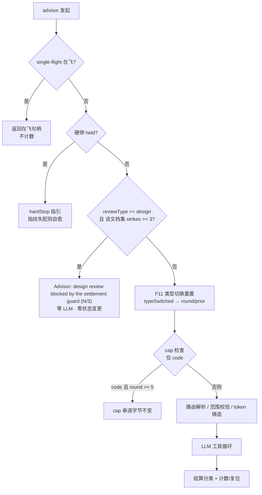
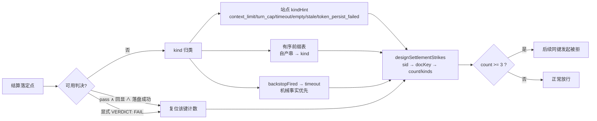

# 设计：设计评审豁免 5 轮上限 + 三振结算护栏（成对吸收）—— 批 4

- 日期：2026-09-13
- 需求档：[`2026-09-13-design-review-guard-requirements.md`](./2026-09-13-design-review-guard-requirements.md)（6 用户故事 / 6 非功能标准）
- 设计输入：**会诊 id 2**（deepseek-v4-pro / glm-5.3 交付；kimi-k3 / gpt-6-astra 因 DSH 非正常结束不可复得——需求档 §0.1）
- 章节：按 `METHODOLOGY.md`「设计文档的成文流程与必备章节」九节（§1 背景 · §2 问题 · §3 目标 · §4 决策与理由 · §5 方案 · §6 机制伪代码 · §7 状态与 schema · §8 防偏离 · §9 边界）+ §10 受影响文件与验收 + §11 变更记录；图示：图 1（发起检查序）/ 图 2（结算→计数数据流）
- 状态：**设计待评审**

> ## ⚠️ 行号引用口径（读本档前必读）
>
> 行号为 **as-of 2026-09-13 批 5 交付前**的工作树实测值。批 5 与批 4 自身都会让行号右移
> （批 5 已实测把 `MAX_ADVISOR_ROUNDS` 检查从 `:1497` 推到 `:1606`）。**定位一律按符号名**：
>
> | 要找什么 | 检索符号 |
> |---|---|
> | cap 常量 / 检查点 | `MAX_ADVISOR_ROUNDS` / `convergence cap reached` |
> | 评审类型归一 | `const reviewType = opts.reviewType === "design"` |
> | 类型切换重置（预检必须在其**之前**） | `const typeSwitched` |
> | 硬停持有检查（预检在其**之后**） | `advisorHardStops.get(sid)` |
> | 完成判定（`"Advisor:"` 前缀 = 失败） | `startsWith("Advisor:")`（finalize 闭包内） |
> | 签发判定 / 凭证落盘 | `const verdictPassed` / `saveTokenRecord(` |
> | 轮次推进（失败不烧轮次） | `state.advisorRound = (state.advisorRound \|\| 0) + 1` |
> | 会话销毁清理组 | `session/disposed`（`lib/index.mjs`） |
> | 会话级内存计数先例 | `codexFailureCount` / `advisorHardStops` |
> | 路径归一（键的唯一实现来源） | `export function normalizeDocPath`（`lib/doc-hash.mjs`） |

---

## §1 背景

评审机制有两条**拒绝轴**，但只有一条真正上膛：

1. **轮次上限**（`MAX_ADVISOR_ROUNDS = 5`，第 6 次调用零 LLM 直接拒）——**全类型共享**，注释原文即「code 与 design 共享预算」；
2. **结算健康**——**不存在**。

问题在于设计评审与代码评审的**收敛形状不同**：设计文档要反复修订，而「改文档 → 重评审」正是本机制的设计意图；
代码评审的 cap 防的是「改 A 报 B」的无限拉锯（cap 引入的原始动机）。

同时，**失败不烧轮次**（`verdictPassed` 为真才推进 `advisorRound`）——所以「跑得通但产不出可用结算」这一类
（超时、上下文截断、轮次上限、空响应、provider 错误、通过但回显缺失…）**没有任何上界**：cap 靠轮次计数，
而这类的轮次永远停在原地。

**两半的真实关系（成对性）**：豁免是「放开」轴，三振是「兜住」轴。

| 中间态 | 后果 |
|---|---|
| **只豁免** | 撤掉唯一的界：垃圾完成轮（`looksLikeReview === false` 也推进轮次）与失败重试一起变得无界 ⇒ 同一文档集**无限烧钱零结算**——比现状更糟 |
| **只护栏** | 设计评审第 6 次仍被 cap 拒（P1 原样保留），而护栏在第 3 次失败就触发——两闸并存但**误杀依旧**，吸收等于没做 |

---

## §2 问题

| # | 问题 | 根因 | 证据（符号） |
|---|---|---|---|
| **P1** | 设计评审被轮次上限误杀 | cap 与设计评审的收敛形状冲突 + 全类型共享 | `MAX_ADVISOR_ROUNDS` / `convergence cap reached`；实测侧证：本机会话出现过 `advisorRound=4, lastReviewType=code`（离第 6 次只差一步） |
| **P2** | 无结算路径无上界 | 失败不烧轮次 ⇒ cap 永不触发 | `verdictPassed` / `state.advisorRound + 1` |
| **P3** | 计数面两个漏洞 | ① 内部兜底截止以 `"Advisor: interrupted."` 面世 ⇒ 被 `interrupted` 豁免漏掉；② 凭证落盘失败与陈旧结算绕过 `finalize` | `saveTokenRecord(` 返回值丢弃；job 内 `backstopFired` 与 `signal.aborted` 同闭包 |
| **P4** | 预检若放在 cap 处会**产生副作用** | cap 检查在 `typeSwitched` **之后**（类型切换已改 `advisorRound`/prior 并落盘） | `const typeSwitched` 先于 cap 检查 |
| **P5** | 工具面会撒谎 | 工具描述写 `max 5 rounds`；豁免后对 design 不成立 | `lib/index.mjs` 的 advisor 工具描述；`README.md` |

---

## §3 目标

| # | 目标 | 验收面 |
|---|---|---|
| G1 | cap **只对代码评审**生效；设计评审豁免（轮次照增、提示词轮换与显示不变） | AC-G1 / AC-G2 |
| G2 | 同文档集连续 3 次无可用结算 ⇒ 后续发起被拒（零 LLM、零状态变更、双入口） | AC-G3 / AC-G4 |
| G3 | 计数面完整（含两个漏洞形态）且**不被散文猜测**驱动 | AC-G5 |
| G4 | 复位面 = 可用判决；显式 FAIL 与 token 撤销是两条正交轴 | AC-G6 |
| G5 | 键为**纯路径形状**（次序无关、写法归一）、按文档集隔离 | AC-G7 |
| G6 | 与硬停轴正交、不可自解除、会话销毁即清 | AC-G8 |
| G7 | 零改面：cap 串逐字节、代码评审语义、既有测试 | AC-G9 |

---

## §4 决策与理由（含否决备选）

| # | 决策 | 理由 / 否决备选 |
|---|---|---|
| **D-G1** | **豁免落点唯一**：cap 条件加 `reviewType !== "design"`，消息体与 unfixed 提取**逐字节不动** | 全文件 cap 消费点只有一处（`MAX_ADVISOR_ROUNDS` 无第三读者）；`reviewType` 在检查点之前已归一（D-G1 的前提可机验）。**否决**：把 cap 整体删掉（code 侧「改 A 报 B」的原始动机未消失）· 在 cap 前另起一条 design 分支（同一判据两处实现 = 漂移面） |
| **D-G2** | 三振预检**先于 F11 类型切换**，且**晚于**「single-flight / 硬停 held」 | 预检必须零副作用（N-1）：类型切换会改 `advisorRound`/prior 并落盘——预检在其前才满足。放硬停之后：硬停是更早的停机轴，且它自带指纹自愈。**否决**：与 cap 同点（= 在类型切换之后，见 P4）· 放在路由解析之后（多烧一次路由解析，无收益） |
| **D-G3** | 计数键 = **归一化路径表**（`normalizeDocPath` → 去重 → 排序 → join `\n`），**只取本次调用的 `documents`**；空集 → 哨兵键 `"empty"` | 护栏问的是「**同一发起范围**是否在原地打转」——范围是路径形状的。**否决**：`computeDocHash` 内容绑定（一次空白编辑即洗白计数 = 绕过面；且 D-30 token 用它是**另一条语义**——那里「文档变了=新授权对象」，两处不得统一）· 历轮并集键（`pendingDocPaths` 累积 ⇒ 每轮换键 ⇒ 计数永不复位）· 空集不计（留一个无上界缺口，与本批目标直接冲突） |
| **D-G4** | 计数载体 = **会话级内存** `Map<sessionId, Map<docKey, {count, kinds, lastAt}>>`；不落盘；清理挂 `session/disposed` | 照抄 `codexFailureCount`/`advisorHardStops` 先例与**成文理由**（「失败计数不是需要持久化的状态」）。落盘会制造两条上游明令禁止的解除轴（重启复活 / TTL 自动解除）。**否决**：进 `session-state.json` 白名单；**否决**：挂 `resetRouteFailureState`（那是「路由成功即复位」语义，会破坏「垃圾结算不清零」） |
| **D-G5** | 计数触发面 = 结算落定点，**kind 来自机械事实而非散文**：站点显式传 `kindHint`（`context_limit`/`turn_cap`/`timeout`/`empty`/`stale`/`token_persist_failed`），无 hint 时按**本插件自产串的有序前缀表**归类，默认 `review_failed` | 我们完全拥有这些串的生成点（前缀表是契约，与 `finalize` 的 `startsWith("Advisor:")` 同族）；**dsh 后台兜底 abort 用 `backstopFired` 事实直传 `timeout`**——不做串面猜（否则「挂起→兜底杀→重试→再挂」永久豁免）。**否决**：靠 `interrupted` 串豁免内部截止 · 每个 return 点各自打点（漏点面大，且派发返回不是结算） |
| **D-G6** | 复位面 = ① pass ∧ 回显 ∧ `saveTokenRecord` **成功**；② 显式 `VERDICT: FAIL` | 两者都是**可用判决**（评审产出了可执行结论）。FAIL 同时撤销 token 是**另一条轴**——注释钉死，防未来「修一致」。**否决**：FAIL 记为 neutral（会让 FAIL 穿插打断「连续」判定，语义更绕）；**否决**：无限 FAIL 也计振（用户的正常收敛循环，每次都拿到可用结论） |
| **D-G7** | 拒绝串 = **`"Advisor:"` 前缀**、第一行即结论、诊断后置；两级防线（工具层预检 + `runAdvisorReview` 直调预检） | 前缀是 `completed` 判定的机械契约（`startsWith("Advisor:")` = 失败）；即使将来被误送进 `finalize` 也天然是失败态（不写 prior、不推进轮次、不签发）。工具层给快速指引，核心层做直调防线。**否决**：`"Error:"` 前缀（那是工具级并发错误域，域不对） |
| **D-G8** | 拒绝串必含六项：`N/3` · 归一文档集 · 最近三次 kind · **不可自解除**声明 · **唯一出口=新会话** · **防乒乓**行 + 按 kind 的可行动指引 | 「停得可见」是本护栏的存在意义（对照 D-33：静默失败是最贵的失败）。防乒乓：eng 续期拒绝说「重跑设计评审」，而护栏拒绝重跑——不加这一行就会把主代理送进乒乓 |
| **D-G9** | 与硬停轴**正交、互不解除** | 硬停 = 路由健康轴（连续 2 次回落失败，指纹失配自愈）；三振 = 结算健康轴（不可自解除）。解除三振**只**发生在 `session/disposed`。**否决**：照抄硬停的指纹自愈（上游明令不可自解除；且「改配置即绕过」会把这个界变成装饰） |
| **D-G10** | 不计数面 = 预检类拒绝（无范围 / 非法文档 / 无路由 / single-flight / 硬停 held / code cap） | 它们**零 LLM**、调用方立即可自纠，不属「评审未结算」；计进去会让护栏误伤「配置还没配好」的首次使用 |
| **D-G11** | 轮次语义**零改**：轮次照增、提示词轮换照常、`advisorRound` 落盘照常 | 豁免的只是「第 6 次拒绝」这一轴（与上游 F3 逐字吻合）；改轮次语义会波及路由组选择（`>=1 → convergence`）与提示词轮换 |
| **D-G12** | 工具描述与 README 表述**必须同步** | 工具面撒谎 = 主代理按错的规则决策（批 3 已吃过这个教训） |

---

## §5 方案

### §5.1 FR-G1/FR-G2 发起路径的检查序（图 1）



**关键**：三振预检（D）在类型切换（E）之前——被拒的发起**不触碰任何状态**（N-1）。

### §5.2 FR-G3 结算分类与计数（图 2）



### §5.3 FR-G4 键与计数载体

```js
// 键：纯路径形状（D-G3）——唯一实现来源 = doc-hash.mjs 既有的 normalizeDocPath
function designDocKey(documents) {
  const list = (Array.isArray(documents) ? documents : []).filter(d => typeof d === "string" && d.trim() !== "")
  if (list.length === 0) return "empty"                       // 哨兵（D-G3：空集照计）
  return [...new Set(list.map(normalizeDocPath))].sort().join("\n")
}
// 载体：会话级内存（D-G4）——照抄 codexFailureCount 先例；不进 session-state 白名单
const designSettlementStrikes = new Map()   // sessionId → Map(docKey → { count, kinds: [≤3], lastAt })
```

### §5.4 FR-G5/FR-G6 触发面与复位面（逐符号）

| 形态 | 落点（符号） | kind | 方向 |
|---|---|---|---|
| 上下文截断 | LLM 循环的 `context window limit reached` 返回 | `context_limit` | +1 |
| 轮次上限（工具轮） | `stopped after N tool rounds` | `turn_cap` | +1 |
| 超时 | `review timeout after` / codex `TIMEOUT` 信封 | `timeout` | +1 |
| 空响应 | `empty response — 重试一次仍空` | `empty` | +1 |
| **内部兜底截止** | job 内 `backstopFired` 为真且未完成 | **`timeout`**（**不是** `interrupted`） | +1 |
| 陈旧结算（代际失配弃置） | job 完成但 finalize 被跳过（绕过 `finalize`） | `stale` | +1 |
| 凭证落盘失败 | `saveTokenRecord(...)` **接住**返回值，false 且 verdict 通过 | `token_persist_failed` | +1（**不复位**） |
| 无报告结算 | completed 但无可用判决（verdict absent/invalid、pass 但阻塞行矛盾/回显缺失、`looksLikeReview === false`） | `review_failed` | +1 |
| provider / 进程类失败 | 其余以 `"Advisor:"` 开头的结算 | `review_failed` | +1 |
| **用户中断** | `Advisor: interrupted.` | `interrupted` | **0** |
| **派发返回** | `Advisor: … review … job <id>` | — | **0**（评审尚未发生） |
| 预检类拒绝 | 无范围 / 非法文档 / 无路由 / single-flight / 硬停 / code cap | — | **0**（D-G10） |
| **可用判决** | `verdictPassed ∧ 回显 ∧ 落盘成功`；或显式 `VERDICT: FAIL` | — | **复位为 0** |

### §5.5 FR-G7 拒绝串（设计钉死形状）

```
Advisor: design review blocked by the settlement guard (3/3 for this document set).
Document set (normalized):
- <归一化路径>
- <归一化路径>
Recent settlement failures (oldest → newest): timeout → context_limit → empty
This guard cannot be cleared inside this session — editing the documents, changing advisor
config, or reverting files does NOT reset it. Only a new session starts a fresh count.
What to do: <按 kind 的可行动指引（timeout→提高 timeoutMs/换 runner；context_limit→收窄文档集或配 advisor.contextTokens；empty→上调 maxOutputTokens/换模型）>
If you were sent here by an eng_coder renewal refusal ("documents changed — re-run the design review"):
the exit is a NEW SESSION — do not retry in this one.
```

### §5.6 FR-G8 接线点

| 面 | 落点 | 动作 |
|---|---|---|
| 核心层预检 | `lib/advisor.mjs`，`const typeSwitched` **之前** | 计算 `designDocKey(options.documents)`；`reviewType === "design" && count >= 3` → 返回护栏串（零 LLM、零状态变更） |
| 工具层预检 | `lib/index.mjs` advisor 工具 `execute` | 同一判定（导入 `designDocKey` / 计数查询）→ 快速返回护栏串 + 指引 |
| 计数/复位 | `lib/advisor.mjs` 结算落定点（逐符号见 §5.4） | `recordDesignSettlement(sid, docKey, kind / null)` |
| 会话销毁清理 | `lib/index.mjs` 的 `session/disposed` 钩子 | 与 `clearCodexFailureCount` 并排：清 `designSettlementStrikes.delete(sid)` |
| 工具面文案 | `lib/index.mjs` 工具描述 + `README.md` | 「5 轮」→「cap 仅 code；design 豁免 cap 但受三振护栏」（D-G12） |

---

## §6 机制伪代码

```js
// ── 键与计数（FR-G4）────────────────────────────────────
function designDocKey(documents) {
  const list = (Array.isArray(documents) ? documents : []).filter(d => typeof d === "string" && d.trim() !== "")
  return list.length === 0 ? "empty"
    : [...new Set(list.map(normalizeDocPath))].sort().join("\n")
}
const designSettlementStrikes = new Map()          // sid → Map(docKey → { count, kinds, lastAt })
export const DESIGN_STRIKE_LIMIT = 3

function designStrikes(sid, docKey) {              // 纯读（预检用）
  return designSettlementStrikes.get(sid)?.get(docKey)?.count ?? 0
}
export function clearDesignSettlementStrikes(sid) { designSettlementStrikes.delete(sid) }

/** 结算打点：kind === null ⇒ 可用判决 ⇒ 复位；否则 +1（kinds 只留最近 3） */
function recordDesignSettlement(sid, docKey, kind) {
  if (!docKey) return
  let m = designSettlementStrikes.get(sid)
  if (!m) { m = new Map(); designSettlementStrikes.set(sid, m) }
  if (kind === null) { m.delete(docKey); return }
  const e = m.get(docKey) ?? { count: 0, kinds: [], lastAt: 0 }
  e.count += 1
  e.kinds = [...e.kinds, kind].slice(-3)
  e.lastAt = Date.now()
  m.set(docKey, e)
}

// ── 结算 kind 归类（FR-G5；机械事实优先，散文只做兜底）──────
const SETTLEMENT_PREFIXES = [
  ["Advisor: context window limit reached", "context_limit"],
  ["Advisor: stopped after", "turn_cap"],
  ["Advisor: review timeout after", "timeout"],
  ["Advisor: review failed (empty response", "empty"],
  ["Advisor: interrupted.", "interrupted"],
]
function classifySettlement(text, kindHint) {
  if (kindHint) return kindHint                        // 站点机械事实优先（stale / token_persist_failed / backstop→timeout）
  const t = String(text ?? "").trimStart()
  for (const [p, k] of SETTLEMENT_PREFIXES) if (t.startsWith(p)) return k
  return t.startsWith("Advisor:") ? "review_failed" : null   // 不以 "Advisor:" 开头 = 完成态，由调用方按可用判决另行判定
}

// ── 预检（FR-G2；在 typeSwitched 之前）────────────────────
const reviewTypeEarly = opts.reviewType === "design" ? "design" : "code"
const docKeyEarly = reviewTypeEarly === "design" ? designDocKey(opts.documents) : null
if (reviewTypeEarly === "design" && designStrikes(sid, docKeyEarly) >= DESIGN_STRIKE_LIMIT) {
  return settlementGuardText(sid, docKeyEarly)          // "Advisor:" 前缀；零 LLM；零状态变更
}

// ── cap（FR-G1；保持在其原位置，仅加类型条件）────────────
if (reviewType !== "design" && (state.advisorRound || 0) >= MAX_ADVISOR_ROUNDS) { /* 原文逐字节不动 */ }

// ── 复位面（FR-G6）────────────────────────────────────
const persisted = saveTokenRecord(agent.session.id, {...})       // 接住返回值（现状被丢弃）
const usable = verdictPassed && echoOk && persisted === true
recordDesignSettlement(sid, docKeyEarly, usable ? null : (persisted === false ? "token_persist_failed" : "review_failed"))
// 显式 FAIL 分支：recordDesignSettlement(sid, docKeyEarly, null)
```

---

## §7 状态与 schema

### §7.1 内存态（唯一新增状态）

| 结构 | 键 | 值 | 生命周期 |
|---|---|---|---|
| `designSettlementStrikes` | `sessionId` → `docKey` | `{ count: number, kinds: string[], lastAt: number }` | 会话内存；`session/disposed` 即清；**不落盘**、不进 `session-state.json` 白名单 |

### §7.2 磁盘 schema

**零变更**。`session-state.json` 的既有字段（`advisorRound` / `lastReviewOutput` / `lastReviewType` / `engineering` / …）一个都不动；
`design-tokens.json` 的 schema 不动（`saveTokenRecord` 只是**接住**返回值，不改写入内容）。这是本批「零 schema 变更」的显式声明。

---

## §8 防偏离

### §8.1 零改面（逐字保全，验收拒收项）

| 面 | 判据 |
|---|---|
| cap 消息 | 含 unfixed 提取与三条 Options 的整段**逐字节**不变（code 路径契约，由既有断言 + 新测试双重锁） |
| `MAX_ADVISOR_ROUNDS` | 导出名与值不变 |
| 轮次语义 | `advisorRound` 照增、落盘照常、路由组选择与提示词轮换零改 |
| 硬停状态机 | `advisorHardStops` / 指纹自愈 / 解除路径零改 |
| token 生命周期 | 铸造/续期/撤销零改（仅接住落盘返回值） |
| `resetRouteFailureState` | **不碰**三振 |
| `session-store` / `eng.mjs` / `prompts` | 零改动 |
| 既有测试 | `test/**` 既有文件零修改；全量原样绿 |

### §8.2 机验锚（防静默退化）

- **成对锁（本批核心）**：对**每个** design 拒绝路径断言「`llm.stream` 零调用 ∧ 状态快照全等」；对**每个**放行路径断言「`advisorRound` 照常推进」——**二者缺一则该对未吸收**；
- **摘除即红**：临时移除护栏钩子 → 「第 4 次发起必须调用 llm」的用例转红（证明护栏真的在拦）；临时移除豁免条件 → design@round5 用例转红；
- **键不变性**：`["b","a"]` / `["a","b"]` / `["docs\\a.md"]` / `["./docs/a.md"]` → 同键；大小写不同 → 不同键（G-4 口径）；
- **前缀表即契约**：`classifySettlement` 的五个前缀逐条断言（改文案即红）。

---

## §9 边界

**本批不做**（与需求档 §5 一致）：轮次预算语义 / 自动重跑与自动缩范围 / token 生命周期 / 硬停阈值与自愈 / `eng.mjs` 续期文案 / 代码评审生效面。

**未确认面（如实登记）**：

| # | 项 | 处置 |
|---|---|---|
| U-1 | 会诊另 2 份回复不可复得（DSH 崩溃） | 设计评审做独立复核（需求档 G-1） |
| U-2 | 重启可规避三振（计数在内存） | 已知漂移（D-G4 的理由链），登记 G-2；不为此落盘 |
| U-3 | 「连续」的界定 = **结算事件**连续，不按调用连续 | 代码评审穿插不打断 design 结算连败序列；实现注释钉死 |
| U-4 | 吸收清单 §1 P3 行行号漂移（引 `:1372`） | 随批 5 收口的台账更新面一并处理（G-3） |

---

## §10 受影响文件全清单与验收

### §10.1 实施域（eng-coder 写域）

| # | 文件 | 动作 | 预计增量 |
|---|---|---|---|
| 1 | `lib/advisor.mjs` | `import { normalizeDocPath }` + `DESIGN_STRIKE_LIMIT` / `designDocKey` / 计数 Map / `designStrikes` / `clearDesignSettlementStrikes` / `recordDesignSettlement` / `classifySettlement` / `settlementGuardText`；预检（`typeSwitched` 之前）；cap 条件加类型；结算打点（逐符号见 §5.4）；接住 `saveTokenRecord` 返回值 | +~110 |
| 2 | `lib/index.mjs` | 工具层预检；`session/disposed` 清理挂点；工具描述同步 | +~30 |
| 3 | `README.md` | 「5 轮」表述同步（D-G12） | ±1 |
| 4 | `test/design-review-guard.test.mjs` | 新增（T-G1–T-G9） | ~260 |

### §10.2 文档域（本设计者写域）

| 文件 | 变更 |
|---|---|
| `docs/2026-09-13-design-review-guard-requirements.md` | 新建 |
| `docs/2026-09-13-design-review-guard-design.md` | 本档 |
| `docs/README.md` | 索引增两行 |
| `docs/2026-09-12-absorption-inventory.md` | **仅收口时**更新 §1 **P1/P2/P3** 三行 + §2 对应行（与批 5 的 U-5 合并一次做完） |

### §10.3 用例与验收标准

| AC | 回指 | 用例 | 判据 |
|---|---|---|---|
| **AC-G1** | G1 / US-1 | T-G1 | 播种 `advisorRound: 5` + `lastReviewType: "design"` → 发起 design **不返回 cap 串**（走正常路径产物）；摘除豁免条件即红 |
| **AC-G2** | G1 / US-6 | T-G2 | 同播种换 `code` → cap 串**逐字节**等于现行文案 |
| **AC-G3** | G2 / US-2、US-3 | T-G3 | 三次无结算后第 4 次：返回护栏串（六项齐备）+ **零 LLM** + 状态快照全等 + **双入口**（工具层/核心层）都拦 |
| **AC-G4** | G2 / N-2 | T-G4 | 摘除护栏钩子 → 第 4 次**必须**调用 llm（成对锁的「摘除即红」面） |
| **AC-G5** | G3 / US-4 | T-G5 | §5.4 每一形态逐一投喂：`context_limit`/`turn_cap`/`timeout`/`empty`/`stale`/`token_persist_failed`/`review_failed` 各 +1；`interrupted` +0；派发返回 +0；`backstopFired` → `timeout`（**不是** interrupted） |
| **AC-G6** | G4 / US-5 | T-G6 | pass∧回显∧落盘成功 → 0；显式 FAIL → 0；pass 但落盘 false → +1（`token_persist_failed`） |
| **AC-G7** | G5 / G-4 | T-G7 | 键不变性（乱序/相对/绝对/反斜杠）与隔离（不同集独立；内容编辑**不**换键；大小写不同键） |
| **AC-G8** | G6 / N-5 | T-G8 | `session/disposed` → 清除；路由成功（`resetRouteFailureState`）→ **不清**；硬停解除 → **不清** |
| **AC-G9** | G7 / N-4、N-6 | T-G9 + 全量 | 零改面逐项静态锚（cap 串逐字节 / `MAX_ADVISOR_ROUNDS` 不变 / 工具描述含新表述 / `session-store`·`eng`·`prompts` 零 diff）；全量 `node --test` 既有用例**原样全绿** + 新增全绿 |

---

## §11 变更记录

| 日期 | 变更 |
|---|---|
| 2026-09-13 | 首版（设计待评审）：会诊 id 2 两份交付（另两份因 DSH 崩溃不可复得）→ 九节 + 图 1/图 2；D-G1–D-G12 决策记录（含两处分歧的父侧裁定：计数键取**纯路径形状**、预检取**类型切换之前**）；AC-G1–AC-G9 |

---

## §12 范围变更（2026-09-13 —— D-35 折入；**本追加与上文本冲突时以本追加为准**）

**背景**：本批设计评审发起时**现场复现了新缺陷 D-35**（已登记 `docs/2026-09-05-defect-registry.md`）——
设计评审链是**会话级**而非**文档集级**：轮次键 `sessionState.advisorRound` 只在 `reviewType` 变化时重置，
换一份设计文档集仍沿用会话轮次 ⇒ 提示词走 `advisor-round2.md`（收敛轮：**只验证、不找新问题**），
prior 注入的是**另一份文档**的发现。实测后果：批 4 的设计评审返回的是「复验批 5 那 7 条发现」的报告，
并**据此铸造了一枚声称覆盖批 4 文档的令牌**——即「令牌声称覆盖的文档从未被真正评审」（评审报告读起来像正常评审，**静默**）。

**为什么折入本批（而不是另开一批）**：三振护栏的键（`designDocKey`，D-G3）与链的作用域是**同一把键**；
D-35 的修法 = 把「同一条链」的判据从会话级换成文档集级（同一实现、同一文件、同一状态字段面）。
拆开做会出现「同一把键实现两遍」的漂移面。

**本追加新增**：

| # | 项 | 内容 |
|---|---|---|
| **FR-G9** | 设计评审链按**文档集**作用域 | design 调用时计算 `docKey = designDocKey(documents)`；若 `state.lastDesignDocKey` 存在且 ≠ `docKey` ⇒ **等价于类型切换**：`advisorRound = 0`、`lastAdvisorOutput = null`、代际 +1、落盘；随后写 `state.lastDesignDocKey = docKey` |
| **D-G13** | 链作用域键**复用 D-G3 的同一实现**（`designDocKey`），不新造第二种 | 同一语义只能有一处实现（D2 纪律）；空文档集走哨兵键 `"empty"`，与计数键一致 |
| **AC-G10** | 换文档集 ⇒ 轮次与 prior 重置 | **T-G10**：播种 `advisorRound: 3` + `lastAdvisorOutput` + `lastDesignDocKey: "A"`，以文档集 B 发起 design ⇒ 轮次归 0、prior 清空、提示词取 **round-1 设计提示词**；以**同一**文档集 B 再发起 ⇒ 轮次**照常递增**（不受影响，证明只对「换集」动作重置） |
| **状态** | `session-state.json` **新增字段** `lastDesignDocKey`（字符串，可选） | **必须落盘**：`advisorRound` 是落盘的，链作用域键不落盘会在重启后失配（同一文档集被误判为新链）。**本批不再是「零 schema 变更」**——新增 1 个可选字段 + 白名单同步 |
| **文件** | `lib/session-store.mjs` **由「零改动」改为「+1 字段」** | 上文 §8.1 零改面清单中 `session-store` 一栏**相应失效**，以本追加为准 |

**未变**：D-G1–D-G12、AC-G1–AC-G9、§5.1–§5.6、§6 伪代码主体（预检代码块在 `designDocKey` 计算之后接链重置判定）、
§8 零改面除 `session-store` 一栏外全部有效。

**过渡缓解（如实登记，非设计的一部分）**：D-35 落地前，会话内**每两次设计评审之间插一次代码评审**即可规避
（类型切换会重置轮次与 prior）——这正是本仓每批「设计评审 → 实施 → 交付代码评审」的既有节奏；
本批自身即用此法取得有效的 round-1 评审（前一次「批 4 设计评审」的报告经父侧判定为**无效评审**，其令牌**不予采用**）。
