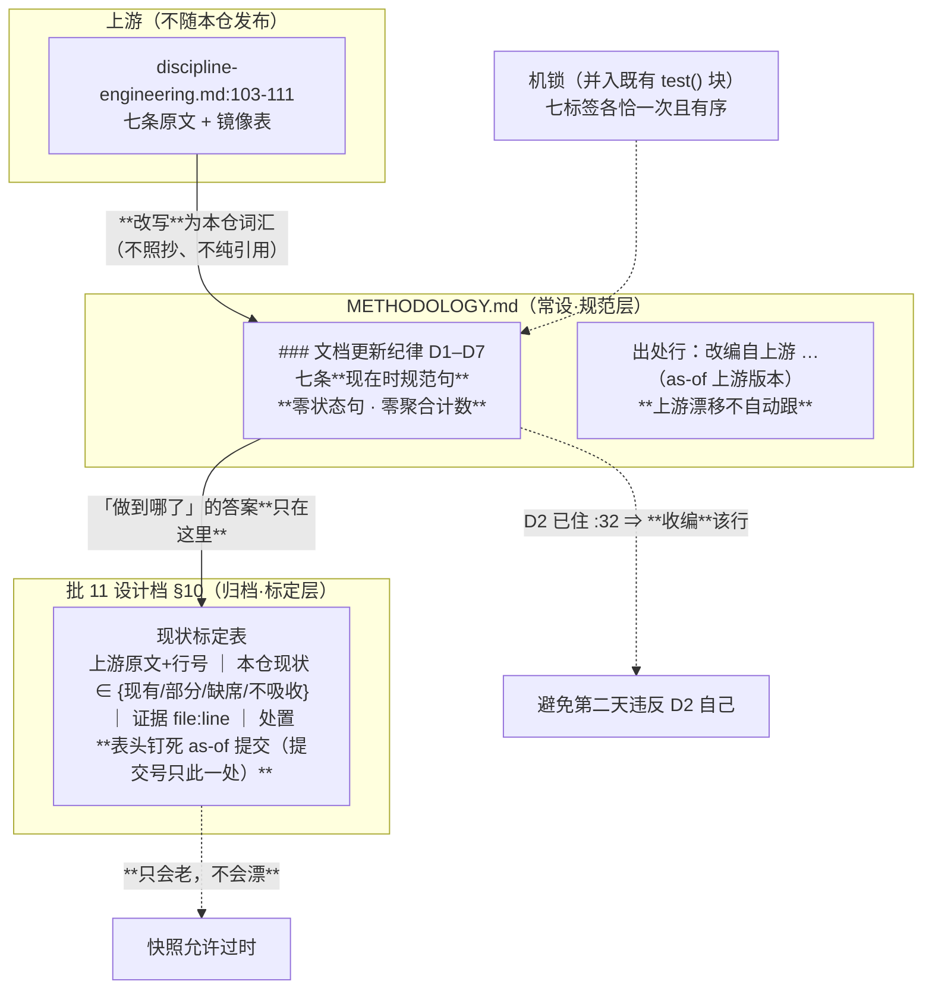
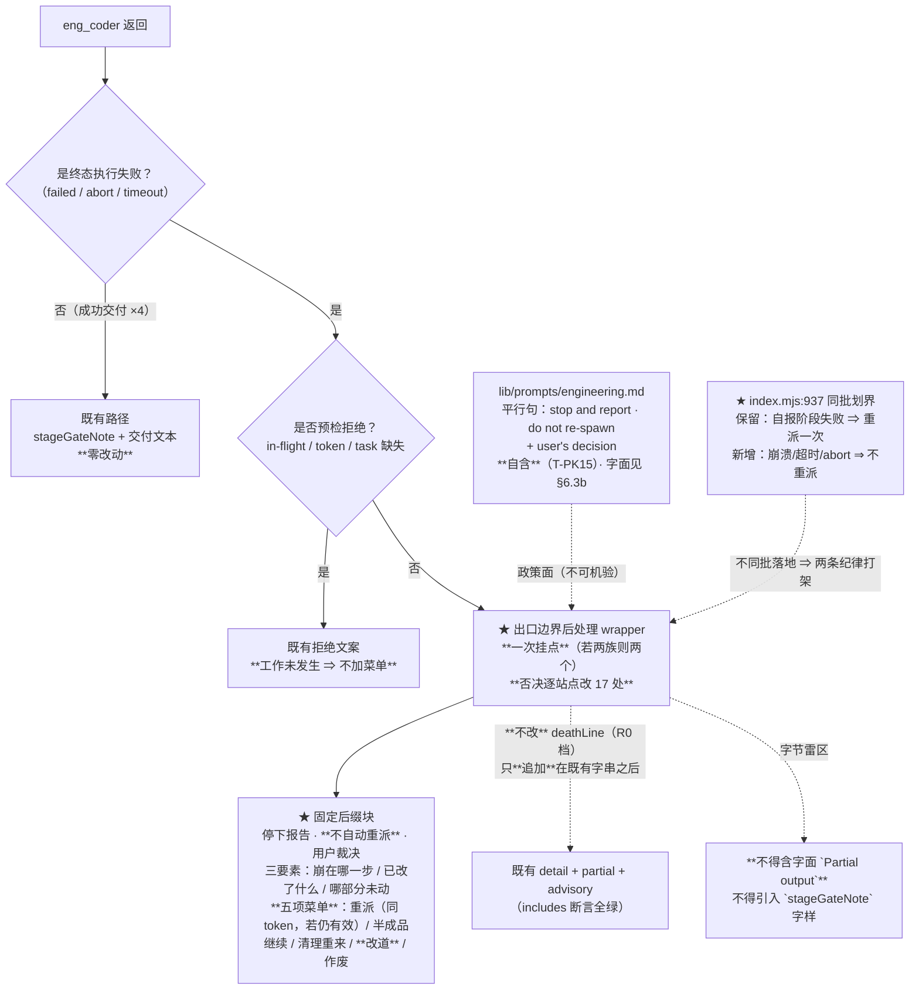

# 设计：D1–D7 文档纪律 + 上游失败路径语义 + DOC-HYGIENE 提示词级纪律 —— 批 11

- 日期：2026-09-13
- 需求档：[`2026-09-13-doc-discipline-requirements.md`](./2026-09-13-doc-discipline-requirements.md)（13 用户故事 / 8 非功能标准）
- 会诊纪要：[`2026-09-13-doc-discipline-consult-minutes.md`](./2026-09-13-doc-discipline-consult-minutes.md)（会诊 id 2，**4/4 交付**；含五问裁定与**不可真机验证清单**）
- 章节：九节（§1 背景 · §2 问题 · §3 目标 · §4 决策与理由 · §5 方案 · §6 机制伪代码 · §7 状态与 schema · §8 防偏离 · §9 边界）+ **§10 D1–D7 现状标定表（as-of 提交快照）** + **§11 本批不可真机验证清单** + **§12 受影响文件与验收** + **§13 变更记录** + **§14 评审落档**
- 图示：**图 1（D1–D7 的双层防漂形态）** / **图 2（失败终态的出口边界后处理）**
- 状态：**设计待评审**

> ## ⚠️ 本档的特殊性质（读前必读）
>
> **1. 这是「规范层」的对偶：本档承载必须过期的部分。** `METHODOLOGY.md` 的新子节写**只有规范、零状态句**（规范不会漂）；而「我们做到哪了」这份**现状标定表只活在本档**（§10），其表头钉死一个 **as-of 提交**。**归档快照允许过时，常设条文不允许含快照。**
>
> **★ 提交号的权威钉点只在 §10 的表头一处**（评审轮次 3 的 #2 订正、**轮次 4 的 #13 收紧作用域**）：初稿在此前言与图 1 各留了一份副本，两轮订正都没扫全 ⇒ **按 D2「单一权威源」自体应用，正文与图里的副本一律改为不含提交号的指代**。**★ 作用域说明（评审轮次 4 的 #13）**：本条只约束**正文与图**；§10 自己的 as-of 裁定注、以及 §13/§14 的**评审留痕行**中出现提交号——那是**记录性引用**（记「当时用的是哪个提交」），**不构成第二个权威源**。初稿的「只出现在 §10 一处」是**绝对化表述**，与 §10 的裁定注自相矛盾，已收紧。
>
> **2. 行号/位置引用口径**（沿用批 9/10）：定位一律按符号名或标题，行号仅作 as-of 参考。
>
> | 要找什么 | 检索符号 |
> |---|---|
> | T9 测的到底是什么（**本批零触碰**） | `test/stages.test.mjs` 的 `T9: stages omitted` |
> | brief 的 stages 分支（缺省时不进） | `lib/eng.mjs` 的 `export function buildCoderBrief` |
> | 工程模式主提示（**不在 brief 路径上**） | `lib/prompts.mjs` 的 `export const ENGINEERING` |
> | 六串禁字锁 | `test/path-kind.test.mjs` 的 `AC-P1/锚 B1 methodology` 一带 |
> | 注册进每个会话的那把 section | `lib/index.mjs` 的 `thincoder:discipline` |
> | 活矛盾源头 | `lib/index.mjs` 的 `If a stage fails, re-spawn ONE new eng_coder` |
> | 字节雷区（禁字面） | `test/codex-runner.test.mjs` 的 `无 partial 块、无 Touched advisory 行` |
> | 阶段门的接线与切片边界 | `lib/eng.mjs` 的 `export function stageGateNote` → `makeWriteGate` |

---

## §1 背景

本批三项有个共同点：**纪律在别处，而执行者看不到**。

- **D1–D7** 在本仓被引用 **22 次**，却**零内容**——它是上游 `src/prompts/discipline-engineering.md:103-111` 的七条文档更新纪律，本仓**从未展开**。逐条现状：**D1 写权矩阵完全缺席**；D2 已有；D3 部分机检；D4 部分；**D5 已实现为机制、未写为纪律**（批 6b 守卫 E）；D6 部分且对象不同；D7 一半（留痕有、**核销同步已在批 10 明文废除**）。
- **失败路径**：上游 `docs/requirements/ENGINEERING-MODE.md:593-631` 定 11 条，其中 **#10「子代理崩溃 ⇒ 停下报告 → 用户决策，不自动重派」**。我方 `lib/eng.mjs` 有 ~17 个非成功返回，但全是 `detail + partial`——**没有「不自动重派」的明示，没有可选项菜单，没有用户裁决框架**。而批 10 那个 30 分钟超时 abort，我是**手工**做了这件事，**没有任何机制要求它**。更糟的是 `lib/index.mjs:937` 写着一条**现行的自动重派指令**。
- **DOC-HYGIENE**：`§5:129` 明文不吸收上游的机械检查器，说「背后纪律随批 11 以**提示词级**补」——而我方**今天没有任何提示词级文档卫生规则**。

而**静默写坏已实证三次**：PowerShell 往返双编码（批 6）、shell 单行脚本把 `METHODOLOGY.md` 截断为 **1 行**（批 8）、U+FFFD（多批）。⇒ 这是我们自己的 D6 缺位的代价。

---

## §2 问题

| # | 问题 | 根因 | 证据 |
|---|---|---|---|
| **P1** | D1–D7 是未定义编号 | 引用而不展开 | 全仓 22 处、零内容 |
| **P2** | D1 写权矩阵缺席 | 从未成文 | grep `写权矩阵` = 0 |
| **P3** | D5 机制已有、纪律未成文 | 批 6b 只交付代码 | 守卫 E 在位，METHODOLOGY 无此条 |
| **P4** | 失败时无选项可依 | 无明示、无菜单 | `lib/eng.mjs` 17 个失败返回 |
| **P5** | `index.mjs:937` 是现行自动重派指令 | 与新纪律张力 | 逐字引用见纪要 §1-7 |
| **P6** | 文档卫生无提醒面 | 主代理系统提示里没有它 | `discipline.md` 只有 review-discipline |
| **P7** | **静默写坏实证三次** | 无一般规则、无机检 | 见 §1 |

**靶心 = P1/P2/P4/P6**；**P7 是最疼的一条**。

---

## §3 目标

| # | 目标 | 验收面 |
|---|---|---|
| G1 | D1–D7 成文且**不会漂** | AC-1 / AC-2 / AC-6 |
| G2 | 现状标定可查且**允许过时** | AC-3 |
| G3 | 失败时**选项在手、不自动重派** | AC-7 / AC-8 / AC-9 |
| G4 | 两条纪律**不互相矛盾** | AC-10 |
| G5 | 文档卫生纪律**每个会话可见且自含** | AC-11 / AC-12 |
| G6 | 静默写坏**有机械网** | AC-13 / AC-14 |
| G7 | **不花用不上的授权**（T9 零触碰） | AC-4 / AC-16 |
| G8 | 本批主张**诚实分组**（可验 / 待重启观察） | AC-17 |

**非目标（一句话）**：不做批文档载体、不做修正轮机制、不强制 `docs` 参数、不引入 `stalled`、不动「失败不簿记」、不改 `deathLine`、不给失败路径加阶段门横幅、不建一般文档检查器、不做 docs 地图双射、不新建被加载提示词、不做 T9 重基线 —— 逐条理由见 §4 与需求档 §5.1。

---

## §4 决策与理由（含否决备选）

| # | 决策 | 理由 / 否决备选 |
|---|---|---|
| **D11-1** | D1–D7 **规范层进 `METHODOLOGY.md`**，不独立成档 | ① `METHODOLOGY.md:3` 自我声明为「advisor 与 eng_coder 对照的单一标准」、`:25` 已把「方法论合规」列为评审维度 ⇒ **写这里自动进两道评审视野**；② **独立成档会违反它自己要写的 D2**（且 `docs/` 登记**无机检**，漏登不会红，R-25）；③ **否决**：把七条写进日期档（形态错误——`docs/` 下是史物） |
| **D11-2** | **双层防漂**：规范层**零状态句**、标定层**只在本档** | **规范句不含经验断言 ⇒ 不会漂**；快照带 `as-of` ⇒ **只会老、不会漂**。**否决**在 METHODOLOGY 里写「现有 N 条/部分 M 条」——聚合自报正是本会话 12 次漂移的病灶 |
| **D11-3** | 上游关系 = **改写 + 出处行** | **否决照抄**（会上游条文含本仓**已废除**名词与**不存在**的载体 ⇒ 进口未定义名词）；**否决纯引用**（`D:\workspace\thincoder` **不随插件发布** ⇒ 规则对发布产物不可见，且**重现「未定义编号」病**，正是本批要治的） |
| **D11-4** | **D7 不复活废除名词** | 「核销」全节**仅一处、只在否定语境**。**废除一个名词的正确方式是指名道姓地否定它一次，而不是假装它没存在过**（与 `CHANGELOG.md:12` 同构） |
| **D11-5** | **D3 收编** `METHODOLOGY.md:32` 的既有 bullet | 否则新子节**第二天就违反 D2 自己** |
| **D11-6** | D6 覆盖**代码面 + 文档面** | 三次实证横跨两面，**只罩代码面会把最狠那次（文档截断）留在网外** |
| **D11-7** | D6 判据 = **三谓词 + 一禁令** | ① 预期改动在位 ② U+FFFD = 0 ③ 行数与**预期增删**一致。**否决固定阈值**（「降幅 >50%」是伪精确——删档型改动会误伤）。禁令「禁同一 shell 管道回读」封掉**已实证的假回读**路径（harness 实测 `(Get-Content).Count` 低报）；禁令「结构性改档用编辑工具」把批 8 事故升格为条文 |
| **D11-8** | D6 机械层 = **新建 `test/doc-hygiene.test.mjs`**（用户裁定） | 两项：U+FFFD 全仓 + 五常设档 canary。**否决并入既有档**（用户已选新档；且新档语义更清）。**否决做一般检查器**（`§5:129` + `T-PK15` 双锁） |
| **D11-9** | 失败路径**双落点、分工写死** | **能放进返回串的绝不放进提示词**——返回串是**机锁面**（字串断言可测），提示词是**行为面**（遵守不可机验） |
| **D11-10** | 返回串形态 = **出口边界后处理 wrapper** | **否决逐站点改 17 处**（必漏 + churn）。**否决改 `deathLine`**（被 18 例锁，且该档是 **R0 不可入授权面**）⇒ 块只能**追加在既有字串之后**（既有断言全是 `includes`，全绿） |
| **D11-11** | 恢复菜单 = **五项**（上游四项 + **改道**）（用户裁定） | 上游四项穷尽了「**工作区 × 任务**」的积空间，**但穷不尽「通道」这一维**。**改道的必要性有实测**：批 10 的 codex **连续两次 `PROCESS_ERROR`**，四项**无一对症**（重派会用同一坏通道再死一次）。**否决开放式措辞**（立刻失去字串可锁性） |
| **D11-12** | **`index.mjs:937` 同批划界** | 保留「子代理自报阶段失败 ⇒ 重派一次」（**出口干净、工作区可检**，走既有修正流）· 加边界「崩溃/超时/abort **不自动重派**」（**出口脏、工作区未知**）。**否决只加新纪律**——那会留下一条与既有指令打架的纪律，模型想选哪个选哪个。已 grep 实证该串**无任何测试断言** |
| **D11-13** | DOC-HYGIENE 落 **`discipline.md`** | 决定性论据：`lib/index.mjs:808-813` 把它注册进 `systemPrompt.section` ⇒ **进每个会话（含主代理）**；`engineering.md` **只在工程模式注入**。而文档卫生的病灶**所有模式都咬** |
| **D11-14** | 纪律条文**必须自含** | `T-PK15` 的 `/methodology/i` **大小写不敏感**且在列 ⇒ **不能指向 METHODOLOGY**。**「提示词 ↔ METHODOLOGY 双源」不是违反 D2，是被锁强制的形态**（上游本就双源） |
| **D11-15** | **本批零字节触碰 T9 与 `prompts.mjs`** | **父侧任务书前提错误已被四家一致反驳**：T9 测 `buildCoderBrief` 的 **stages 缺省**输出，而 `ENGINEERING`/persona **不在 brief 路径上**。**用户预接受的 T9 重基线成本从本批划掉**（且它今天结构上走不通——授权面口径锁要求 `.test.mjs` 而夹具是 `.txt`） |
| **D11-16** | 本批 AC **只允许字符串/结构断言** | **未重启** ⇒ 运行中的 DSH 看不到新提示词、返回串是旧字节。**不得出现「主代理将会停下」这类行为断言**——那是不可验的主张 |

---

## §5 方案

### §5.1 D1–D7 的双层防漂形态（图 1）



**读图要点**：**规范与现状分居两处**。规范里**没有任何会过期的句子**，所以它不会漂；现状是一份**带日期的快照**，所以它只会老。**图的右上角那条虚线是本设计最要紧的一句**：D2 的既有内容必须收编，否则新子节**第二天就违反自己**。

### §5.2 失败终态的出口边界后处理（图 2）



**读图要点**：**菜单进返回串（机锁面），政策进提示词（行为面）**。而 `index.mjs:937` 的划界是**必须**的——不划，父代理手里就有两条互相矛盾的指令。

---

## §6 机制伪代码

### §6.1 METHODOLOGY 新子节（规范层，零状态句）

```markdown
### 文档更新纪律 D1–D7

> 改编自上游 `src/prompts/discipline-engineering.md:103-111`（as-of 上游 v0.12.61）；**上游漂移不自动跟**。
> 本节只写**规定**，不写「我们做到哪了」——现状标定见批 11 设计档 §10（as-of 快照）。

**D1 写权矩阵** —— 每类文档有唯一写入者，同一区域同时只有一个写入者：
批次文档（需求/设计/纪要/**交接**）= 主代理 · `lib/**` 与 `test/**` = eng_coder（凭 design token）·
**常设标准档**（`METHODOLOGY.md`，含本节）= 主代理定内容、eng_coder 凭任务书指名落笔 ·
提示词 = 主代理定内容、eng_coder 落笔 ·
**登记面**（`docs/test-lifecycle.md`：§三 / `docs/2026-09-05-defect-registry.md` / `docs/2026-09-12-absorption-inventory.md`：§6 / 条目状态变更）= 主代理（**收口时唯一自报点**，R-19）·
`docs/README.md` 文档地图 = **建档者随建随登**。
**例外**：eng_coder 在其任务书显式指名的**文本块**上落笔（凭 design token）——
含**登记行/收口行**，也含**常设标准档中由设计固定内容的新子节**；
此时一律归主代理定内容、eng_coder 落笔——与提示词同一分工形式。

**D2 单一权威源** —— 一条机制只在一处详述，其余处只引用不重述。

**D3 计数·枚举纪律** —— 声明「N 项/N 处/N 条」时，计数与列表必须在**同一次编辑**内同改；
计数须来自**当次实测**，不得抄自记忆或旧档；一个数只设一个权威自报点，他处用指针。
未被机械检查覆盖的面，明确标注为**人工核对**。

**D4 指针纪律** —— 引用本仓文档用「**档名：§节**」；**禁**「见上/见该节」式相对指针；
行号只作 **as-of** 括注，不承诺永久有效。

**D5 冻结窗口** —— 评审在途**不得**改被审对象；对象变了即按既有机制判该评审陈旧。
（机制锚：守卫 E 的文档冻结窗口，见 `test/guard-e.test.mjs`——本句只指位置，不陈述状态）

**D6 回读核对** —— 任何写入/编辑报成功后，**必须用读工具回读被改区域**，
确认三点再报完成：① 预期改动在回读内容中；② U+FFFD 计数为 0；
③ 行数变化与本次改动的**预期增删**一致（意外塌缩 = 异常）。
**回读不得使用刚执行写入的同一条 shell 管道**。
**结构性改档一律用编辑工具，禁 shell 单行脚本整档重写。**
回读未见改动 = 写入静默失败 ⇒ 按失败路径报告，**不得重报成功**。

**D7 变更留痕** —— 每批收口须留下可追的变更记录（吸收清单 §6 变更理由行 / CHANGELOG /
本档文档历史表）。
> 上游 D7 另含「核销同步」半条——**不吸收**（R-20 已废除该名词）。其意图由收口对账面覆盖：
> 台账 §三等值（T-LC2）· 登记表/吸收清单计数（ledger-parity）· 状态行与变更记录（批 10 AC-H1 形态）。
```

> **★ 本块的最终字面即上段代码块，逐字交付。** 三条约束由设计评审轮次 1 钉死：
> **① 规范层零状态句**（V2）——上段已无「已实现 / 现有 / 部分 / 缺席」等；原 D5 括注的「机制已实现」已改为**只指位置**的「机制锚」。
> **② 原 D2 批动作括注已外移**至本档 §13 变更记录（「收编 `METHODOLOGY.md:32` 的 bullet」是**本批动作**，写进规范层即过时）。
> **③ D1 的例外句**（评审 #1）——本批的 `eng-coder 写域` 含交接页/台账/吸收清单 §6/README 登记，与「主代理唯一写入者」冲突；例外句把该冲突**显式化**为与提示词同一形式的分工（**主代理定内容、eng_coder 落笔**）。
>
> **V2 的精确禁词表（评审 #5 要求钉死）**：`现有` · `已有` · `部分` · `缺席` · `已实现` · `未实现` · `已交付` · `待评审` · `已完成` · 以及任何 **`N 条/N 处/N 项` 聚合计数句**。
> **豁免**：D7 的**否定句**（含「不吸收」「已废除」「既有」）**在词表之外**——它是**对上游半条的指名否定**，不是本仓状态陈述（V3 单独锁它恰一处）。
>
> **`METHODOLOGY.md:32-35` 四条既有 bullet 的归并（评审 #6 要求有字面判据）**：
> - `:32`「每个机制只在**一处**详述，其他文档引用不复制」→ **并入 D2**
> - `:33`「新建文档必须登记到 `docs/README.md` 文档地图」→ **并入 D1 的地图职责句**
> - `:34`「用户在设计讨论中做出的决策，当日写入相关文档」+ `:35`「UI/交互决策必须落入设计文档，并在 eng_coder 任务中复述或引用其章节」→ **保留在原位**（它们是**流程义务**，不属于 D1–D7 的七条域；迁移会造成第二次移动）
> - **V4 的判据（字面）**：`每个机制只在**一处**详述` 与 `新建文档必须登记到` 两个短语**出现在新子节的 D2/D1 段内**，且**原 `:32`/`:33` 行不再含这两个短语**。

**机锁**：一行「七标签各恰一次且有序」的断言，**并入既有 `test()` 块**（见 §6.4）。

### §6.2 失败后缀块（`lib/eng.mjs`）

```js
// ★ 出口边界后处理：一次（或两族各一）挂点，**否决逐站点改 17 处**。
// ★ 必须放在 stageGateNote → makeWriteGate 切片**之外**（stage-gate.test.mjs 锁该段函数体）。
// ★ 不改 deathLine（R0 档）——只**追加**在既有字串之后（既有断言全是 includes）。
// ★ 字节雷区（**设计评审 #3 钉死**）：`codex-runner.test.mjs:4037` 的逐字谓词是
//   `!outcome.output.includes("Partial output") && !outcome.output.includes("Touched 行")`
//   —— 禁令字面是 **`Partial output`** 与 **`Touched 行`**（带「行」字）；**裸词 `Touched` 不禁**。
//   故本块写作「见上方 partial 与 Touched advisory」，**不含**那两个禁字面。§8.2 的 V8 同步锁这两串。
const FAILURE_OPTIONS_BLOCK = [
  "",
  "--- eng_coder 执行已停止 —— **不自动重派**，由用户裁决。---",
  "报告须含：崩在哪一步（见上方 detail）/ 工作区已改了什么（见上方 partial 与 Touched advisory）/ 任务哪部分未动。",
  "可选项：",
  "  ① 原样重派（同 token，若仍有效 —— 自报阶段失败那一类 token 未消费）",
  "  ② 带半成品继续（先核对 partial 与工作区实况）",
  "  ③ 清理工作区后重来（必要时 git 回滚）",
  "  ④ 改道（换执行通道或策略）",
  "  ⑤ 作废本链",
].join("\n")
```

> **★ 菜单① 措辞的订正（设计评审 #4）**：初稿写死「同 token —— **token 未消费**」，而 `index.mjs:937` 的「token is not consumed」原句**只针对「自报阶段失败」那一类**。崩溃 / 超时 / 中途 abort 时 token 的消费语义**本设计未建立** ⇒ 固定字面会**输出假事实**。改为「**同 token，若仍有效**」并把「未消费」限定在它确有其据的那一类。**要更强断言先要建 token 消费语义 —— 那超出本批范围**（需求档 §5.1 已列为不做）。

**适用范围（枚举进设计档，防过用）**：罩**终态执行失败**（codex 后台/同步非零退出 · codex reject · dsh 后台兜底超时 · `stopReason !== completed` · abort · 同步截止 · 泛错 · failed-to-start）；**不罩**预检拒绝（task 缺失 / token 门 / in-flight 单飞——**工作未发生**，自带补救指引，无菜单）。

**★ 两类失败的区分机制（评审轮次 3 的 #8 补）**：**在返回点处区分，不靠解析返回内容**——两类的**代码位置本就不同**：预检拒绝发生在 `eng_coder` **尚未 spawn** 之前（`task` 校验 / `designToken` 三态校验与续期腿 / in-flight 单飞检查），这三个返回点是**同步的、在函数前段**；终态执行失败全部发生在 **spawn 之后**的 try/catch 与 settle 路径上。⇒ **wrapper 只挂在 spawn 之后的那一组返回点上**（stage 0 的映射表负责把它们逐一点出）。**绝不用「输出串里有没有 partial」之类的内容判据**——那是脆性判据，且与本批「谓词要写全」的标准不符。

### §6.3 DOC-HYGIENE（`lib/prompts/discipline.md` 追加块）

```markdown
**文档卫生（五条；违反 = advisor 🔵 起步）**
1. **计数与列表同改**：任何「N 项/N 处/N 条」声明，改列表必须同一次编辑改计数；
   计数须来自当次实测（grep / 读档），不得抄自记忆或旧档。
2. **指针可解析**：引用本仓文档用「档名：§节」；禁「见上/见该节」；行号只作 as-of 括注。
3. **写后回读**：任何写入后回读被改区域（目标锚点仍在 / 全文无替换字符 U+FFFD / 行数与预期增删一致）
   再报完成；结构性改档用编辑工具，禁 shell 单行脚本整档重写。
4. **状态行与事实同步**：状态/版本/日期类声明改一处，必须全库检索同类声明同改。
5. **描述面与实现一致**：注释与模型可见描述（工具 description / 参数说明）不得与代码现状矛盾；
   语义变更同批同步。
```

**硬约束**：不得含 `T-PK15` 六串（**尤其不得指向 METHODOLOGY**）⇒ 五条**自含**；**只追加**、不删改既有 review-discipline 行（保 `AC-V14` 四值词表）。

#### §6.3b `lib/prompts/engineering.md` 追加句（**评审轮次 3 的 #7 要求钉死字面**）

```markdown
When `eng_coder` returns a **non-success** status (crashed / aborted / timed out / tool failure):
**stop and report** — do not re-spawn on your own. Present the returned failure report
(where it stopped / what the workspace already changed / which part of the task is untouched)
together with the options it lists, and wait for the user's decision.
The `re-spawn ONE with corrected stages` rule applies **only** to a stage the sub-agent
itself declared failed in a complete report.
```

> **★ 本句即逐字交付文本**（与 §6.1 同规格）。三类关键串 **`stop and report`（停下 / 报告）· `do not re-spawn`（不自动重派）· `user's decision`（用户裁决）** 是 V11② 的正向锚；**不含** T-PK15 六串（`methodology` 等一律未出现）。
>
> **★★ `do not re-spawn` 与 `user's decision` 两处必须保持「无行内强调」**（评审轮次 4 的 🔴 钉死）：初稿写作 `**do not** re-spawn` 与 `the **user's** decision`，**加粗星号会把锚串切断** ⇒ 作为「逐字交付」文本时 **V11②/AC-12 不可满足**（这正是轮次 2 的 🔴#1 与轮次 3 的 #4/#5 的同一陷阱，**第四次**）。**对照先例**：V4② 之所以成立，是因为它引的 `文档地图 = **建档者随建随登**` **连同 `**` 一起引**；本处选择**去掉强调**而非把星号写进锚，因为 `do not re-spawn` 与 `user's decision` 的「不加粗」也更符合行文。

### §6.4 新测试档（`test/doc-hygiene.test.mjs`）

```js
// 落地前**先实测今天全仓 U+FFFD 计数**：为 0 则零白名单直锁；若有故意样本则精确豁免并写理由。
test("U+FFFD 全仓扫描：被跟踪文本零命中", …)      // 根 + docs/ + lib/ + test/ 的 *.md/*.mjs/*.js/*.json/*.txt
test("常设档 canary：五个常设档各含其顶层标题锚（防截断为 1 行）", …)  // METHODOLOGY / docs/README /
                                                   // docs/test-lifecycle / 吸收清单 / 缺陷登记表
```

**登记**：新档须在**落地同一 stage 内**入 `test/guard-e.test.mjs` 的 `existing`（含理由与裁定引用）+ `docs/test-lifecycle.md` §三 行与计数（T-LC2）。

---

## §7 状态与 schema

| 面 | 变更 | 说明 |
|---|---|---|
| `METHODOLOGY.md` | 修改 | 新子节 D1–D7（**规范层，零状态句**）+ 收编 `:32` 原 bullet |
| `lib/prompts/discipline.md` | 修改 | 追加文档卫生五条（**自含**、只追加） |
| `lib/prompts/engineering.md` | 修改 | 追加失败路径政策一句（**自含**） |
| `lib/eng.mjs` | 修改 | 失败后缀块常量 + 出口边界后处理；**不改 `deathLine`**；helper 在阶段门切片之外 |
| `lib/index.mjs` | 修改 | **`:937` 的 eng_coder 描述同批划界** |
| `test/doc-hygiene.test.mjs` | **新增** | U+FFFD 全仓 + 五常设档 canary |
| `test/guard-e.test.mjs` | 修改（**基线后档**） | T-E19 登记新档（含理由与裁定引用） |
| `docs/test-lifecycle.md` | 修改 | §三 加新档行与计数 + §七 记录 |
| `docs/2026-09-12-absorption-inventory.md` | 修改 | **§2:84 的「共 4 条」→ 3 条** + §2:39/40/57 行标已闭环 + §6 变更理由行 |
| `docs/2026-09-13-handoff.md` | 修改 | §1 批 11 行 + §4 状态 + 「哪些面已机检/仍人工」表更新 |
| `docs/README.md` | 修改 | 本批三份档登记 + 地图行 |
| **零字节** | **`test/fixtures/**`** · **`lib/prompts.mjs`** · `lib/prompts/` 无新档 | N-1 / N-2 |

---

## §8 防偏离

### §8.1 零改面（验收拒收项）

| # | 面 | 判据 |
|---|---|---|
| 1 | **T9 夹具与两份 fixture** | `test/fixtures/**` **零 diff**；`stages.test.mjs` **不改自绿** |
| 2 | **`buildCoderBrief` / `renderStagesBlock`** | 零改动 |
| 3 | **`lib/prompts.mjs`** | 零字节；`lib/prompts/` 无新档 |
| 4 | **`deathLine` 格式** | 零改动（R0 档） |
| 5 | **「失败不簿记」** | 零改动（`stage-gate.test.mjs:209` 锁） |
| 6 | **失败路径无阶段门横幅** | 零改动（`stage-gate.test.mjs:210` 反向锁） |
| 7 | **基线 10 档测试内容** | 零 diff（T-AP9 锚 B） |
| 8 | **一般性文档检查器** | `lib/**` 内六串命中 = 0 |

### §8.2 机验锚（**律 1：谓词写全三件事**）

| # | 锚 | 谓词 |
|---|---|---|
| **V1** | D1–D7 形状 | `METHODOLOGY.md` 新子节**恰含 D1…D7 七标签、各恰一次、顺序精确**（并入既有 `test()` 块） |
| **V2** | **规范层无状态句** | 子节内**零**禁词表命中。**精确词表（评审 #5 钉死）**：`现有` · `已有` · `部分` · `缺席` · `已实现` · `未实现` · `已交付` · `待评审` · `已完成`。**★ 聚合计数句的判据（评审轮次 3 的 #5 钉死为可判形式）**：`/[0-9０-９]+\s*[条处项]/`（**必须是数字字面**——初稿写「任何 `N 条/N 处/N 项` 聚合计数句」是**不可判的描述**，且若按字面 `includes("N 项")` 判，会命中 §6.1 D3 **自身**的元变量写法 `N 项/N 处/N 条`，**与「逐字交付」互斥——即轮次 2 那条 🔴 的陷阱在 V2 上再现**）。**元变量写法 `N 项/N 处/N 条` 显式豁免**（它是**规则的一部分**，不是本仓状态的计数）。**豁免**：D7 的**否定句**（含「不吸收」「已废除」「既有」）在词表之外（由 V3 单独锁它恰一处） |
| **V3** | D7 名词纪律 | 「核销」在子节内**恰一处**且**在同一行含「不吸收」** |
| **V4** | bullet 归并（**字面判据 · 评审轮次 2 的 🔴#1 订正**） | 三条字面判据，**全部取自 §6.1 的冻结交付文本**（此前误用**原句**作判据，与 §6.1 的**改写**互斥 ⇒ 照 §6.1 则 V4 红、照 V4 则违反「逐字交付」）：① 短语 **`一条机制只在一处详述，其余处只引用不重述`** 出现在新子节的 **D2 段内**；② 短语 **`文档地图 = **建档者随建随登**`** 出现在 **D1 段内**；③ **原 `METHODOLOGY.md:32` 与 `:33` 两行不再含其原短语**（`每个机制只在**一处**详述` / `新建文档必须登记到`） |
| **V5** | **六串零命中** | **文件清单（评审 #10 钉死）**：本批**每个新增/修改行的落点文件**——`METHODOLOGY.md`（新子节）· `lib/prompts/discipline.md` · `lib/prompts/engineering.md` · `lib/eng.mjs`（后缀块）· `lib/index.mjs`（`:937` 描述）· `test/doc-hygiene.test.mjs`（若其断言内含六串字面则**必然**命中 ⇒ 该档需以拼接写法规避，如批 9 的 `has` + `Git` 先例）。逐文件负向 grep 清单附交付报告 |
| **V6** | 失败后缀在位 | 枚举的**每个**终态失败返回点含**五项菜单 + 「不自动重派」+ 「由用户裁决」**（**评审 #7 补**：「由用户裁决」此前在草案文本里但不在锚内 ⇒ 不可验）+ 三要素。**另**：交付报告须回填「**失败种类 → 返回点**」映射表（**评审 #12**），该表即 V6 的测试清单 |
| **V7** | **预检拒绝不入网** | 预检拒绝点**不得**含菜单（反向断言） |
| **V8** | 字节雷区（**评审 #3 钉死实际字面**） | 后缀**不含** `Partial output` 与 **`Touched 行`**（`codex-runner.test.mjs:4037` 的逐字谓词——**裸词 `Touched` 不禁**）；失败行**不含** `stageGateNote` |
| **V9** | 既有断言零破坏 | `codex-runner` 五处 + `stage-gate` 两族的既有 `includes` 断言全绿 |
| **V10** | **`:937` 已划界** | 描述串含「自报阶段失败 ⇒ 重派一次」**且**含「崩溃/超时/abort 不自动重派」 |
| **V11** | 政策句**自含且正向在位** | ① `engineering.md` 新句**不含**六串；② **正向锚（评审 #7 补、轮次 3 的 #7 钉死字面）**：新句含**英文**三类关键串 **`stop and report`** · **`user's decision`** · **`do not re-spawn`**（**订正**：图 2 曾标中文「停下 / 报告 / 用户裁决」，而 §6.3b 的权威字面是英文 ⇒ 锚与文本不一致，**以本节为准**） |
| **V12** | 卫生条**自含且正向在位** | ① `discipline.md` 新块**不含**六串；② **正向锚（评审轮次 3 的 #4 钉死字面）**：新块含以下五串，**逐字取自 §6.3 的标题/正文**——**`计数与列表同改`**（§6.3 标题；**订正**：初稿写「计数同改」，而那不是 §6.3 的连续子串 ⇒ 锚不可满足）· `档名：§节` · `回读` · `状态行` · `描述面`；③ `AC-V14` 绿 |
| **V13** | U+FFFD 网 | `test/doc-hygiene.test.mjs` 的扫描绿；**变异**：注入一个 U+FFFD ⇒ 红 |
| **V14** | canary 网 | **变异**：把某常设档截断为 1 行 ⇒ 红。**锚串清单（评审 #9 加、轮次 2 的 #3 订正）**：`METHODOLOGY.md` → **`## 文档纪律`** 与 **`## 工作流（四步 + 门禁）`** 两条顶层标题（**父侧实测：该档真实顶层标题为 `## 目标` / `## 工作流（四步 + 门禁）` / `## 评审标准（advisor 对照维度）` / `## 文档纪律` / `## 测试纪律` / `## 文档历史`；初稿写的 `## 评审流程` 全档 0 命中 ⇒ 照字面实现该腿必红**）· `docs/README.md` → 其两张表的表头行 · `docs/test-lifecycle.md` → 其顶层标题 · 吸收清单 → `## §2` 与 `## §6` · 缺陷登记表 → 其表头行。**每档 ≥1 个稳定顶层标题** |
| **V15** | 登记制 | 新档在 T-E19 与台账 §三**均**登记（含理由与裁定引用） |
| **V16** | 零改面 | §8.1 八项逐条成立 |

---

## §9 边界

| # | 边界 | 行为 | 理由 |
|---|---|---|---|
| 1 | **未重启 DSH** | 一切 `lib/**` 行为**只在测试进程内验**（`node --test` 直接 import 源码 = 真验）；**真机行为挂「待重启观察」** | §10 不可验清单 |
| 2 | **预检拒绝** | **不加菜单**（工作未发生） | D11-9 的适用边界 |
| 3 | **自报阶段失败（出口干净）** | **保留**「重派一次」授权 | D11-12：与崩溃类不同——出口干净、工作区可检 |
| 4 | **崩溃/超时/abort（出口脏）** | **不自动重派**，菜单在手 | 同上 |
| 5 | **提示词里的六串** | 一律不得出现（含 `methodology` 小写） | `T-PK15` |
| 6 | **新提示词档** | **不加** | 新增启动期 throw 面 |
| 7 | **`docs/` 地图漏登** | 本批**不做**机检 | R-25：最贴近 §5:129 拒绝检查器的方向 ⇒ 将来决策项 |
| 8 | **合规的 U+FFFD 样本** | 若某夹具**故意**含之 ⇒ **精确豁免并写理由**，不做全仓零命中的一刀切 | D11-8 落地前先实测 |
| 9 | **快照过时** | 标定表允许过时，**不改成实时状态表** | D11-2：快照只会老、不会漂 |
| 10 | **T9 重基线** | **本批不做**（用不上；且今天结构上走不通） | D11-15 / R-26 |

---

## §10 D1–D7 现状标定表（**as-of `0c15c69` / v0.18.0 —— 归档快照，允许过时**）

> **★ as-of 点的裁定（评审轮次 2 的 #2 订正）**：父侧实测 `git rev-list -n1 v0.18.0` = **`0c15c69`**（= tag 点），而初稿写的 **`6bb02ea`** 是**其后的文档收口提交**。⇒ **标定基线取 `0c15c69`**（v0.18.0 的真实内容点）；`6bb02ea` 只是本档之前的收口留痕，**不是版本点**。**该错误影响的只是表头**——§10 各行证据（登记表 36 行 / 台账 19 行 / 各 file:line）在 `0c15c69` 上**同样成立**（两个提交之间只动了 `docs/2026-09-13-handoff.md`）。
>
> **本表是「我们做到哪了」的唯一住所。** `METHODOLOGY.md` 的规范层**不含**任何状态句。
> 每格证据为**当次实测**（父侧 + 摸底子代理回盘核过），非自报。

| 编号 | 上游原文（`discipline-engineering.md:103-111`） | 本仓现状 | 证据 | 处置 |
|---|---|---|---|---|
| **D1** | 写权矩阵 — 文档类 → 唯一作者 | **缺席** | 全仓 grep `写权矩阵` = **0 命中**；`METHODOLOGY.md:12-19` 的流程**不点名任何文档作者** | **本批新写**（按本仓真实分工） |
| **D2** | 单一权威源 — 只在一处详述，其余只引用 | **已有** | `METHODOLOGY.md:32` + `docs/README.md:3` | **本批收编**该 bullet 进新子节 |
| **D3** | 计数·枚举 — 计数与列表同时改（可机判） | **部分机检** | `test/ledger-parity.test.mjs`（登记表 36 行 / 吸收清单 §2 的 `共 42 档` / 触发列闭合四值）· `test/test-lifecycle.test.mjs` T-LC2（台账 §三 19 档用例数）· `defect-registry.md:4` 的 R-19 单点声明 | **本批补一般条文**；**明确标注哪几面已机检、其余人工** |
| **D4** | 指针纪律 — `文档:节`；行号只作 as-of | **部分** | 登记表有指针列（批 10），但**只机检文件存在、行号刻意不机检**（设计档 §9-11）——**无一般「文档:节 / as-of」规则** | **本批补条文**。**活的反例就在本会话**：批 10 补行后两处 `:141` 行号指针漂到 `:150`（**同一批内**） |
| **D5** | 冻结窗口 — 评审在途不改被审档 | **机制已有、纪律未成文** | 批 6b 守卫 E：`lib/advisor.mjs` 的预闸只读访问器扫全表找武装中的冻结窗口；标记 `designFreezeSet` / `makeDocFreezeGate` / `frozen: ` 锁在 `test/guard-e.test.mjs` | **本批成文**并指向既有机械腿 |
| **D6** | 回读核对 — 写入后回读再报完成 | **部分且对象不同** | `docs/2026-09-13-handoff.md` 的「写后核 U+FFFD = 0」（代码面）· `CHANGELOG.md` 的「交付文档面必须回读本批纪要的裁定清单」（对象是裁定不是文件）· **无一般规则** | **本批补条文 + 建机械网**（新档） |
| **D7** | 变更留痕 + 核销同步 | **一半** | 留痕**已有**：吸收清单 §6 变更理由行（`:150`/`:152`/`:153`）· `METHODOLOGY.md` 文档历史表 · 各批 §12/§13 块。**核销同步已在批 10 明文废除**（`CHANGELOG.md:12` · 纪要 R-20 · 设计档 AC-C3） | **只写留痕面**；「核销同步」以**一行否定句**处置（**不假装它没存在过**） |

---

## §11 本批**不可真机验证**清单（未重启 DSH）

| # | 主张 | 为何不可验 | 何时可验 |
|---|---|---|---|
| 1 | 运行中的 DSH 会话**看不到**新提示词条文与旧返回串 | 该进程已装载旧 `lib/**` | **重启后** |
| 2 | 真实宿主子代理 abort 的**端到端**路径 | mock 只验字串构造 | **重启后观察** |
| 3 | 父 agent（模型）**遵守**「不自动重派」与卫生五条 | 提示词级纪律只有**字节锁**可验 | **长期观察** |

⇒ **本批一切 AC 措辞为字符串/结构断言**（N-7）；本清单同步进交接页。

---

## §12 受影响文件全清单与验收

### §12.1 实施域（eng-coder 写域）

| 文件 | 改动 | 类型 |
|---|---|---|
| `METHODOLOGY.md` | 修改：新子节 D1–D7 + **收编 `:32` 与 `:33` 两条 bullet**（原位置不再含其原短语，见 V4） | 修改 |
| `lib/prompts/discipline.md` | 修改：追加文档卫生五条（**自含、只追加**） | 修改 |
| `lib/prompts/engineering.md` | 修改：追加失败路径政策一句（**自含**） | 修改 |
| `lib/eng.mjs` | 修改：失败后缀块 + 出口边界后处理（**不改 `deathLine`**；helper 在阶段门切片之外） | 修改 |
| `lib/index.mjs` | 修改：`:937` 描述**同批划界** | 修改 |
| `test/doc-hygiene.test.mjs` | **新增**：U+FFFD 全仓 + 五常设档 canary | **新增** |
| `test/guard-e.test.mjs` | 修改：T-E19 登记新档（**基线后档，非基线 10 档**） | 修改 |
| `docs/test-lifecycle.md` | 修改：§三 行与计数 + §七 记录 | 修改 |
| `docs/2026-09-12-absorption-inventory.md` | 修改：`§2:84` 4→3 条 + 三行标已闭环 + §6 变更理由行 | 修改 |
| `docs/2026-09-13-handoff.md` | 修改：批 11 行 + §4 + 机检/人工表 | 修改 |
| `docs/README.md` | 修改：本批三份档登记 | 修改 |

**零字节**：`test/fixtures/**` · `lib/prompts.mjs` · `buildCoderBrief` / `renderStagesBlock` / `deathLine` · 基线 10 档。

### §12.2 用例与验收标准

| # | 验收标准 | 形态 |
|---|---|---|
| **AC-1** | `METHODOLOGY.md` 新子节含 D1…D7 七条**现在时规范句** | **核心** |
| **AC-2** | 子节内**零状态句、零聚合计数**（V2） | **核心** |
| **AC-3** | 标定表**只在设计档**、表头含 as-of 提交号、逐格带证据（V1 反面） | 核心 |
| **AC-4** | T9 夹具与 `test/fixtures/**` **零 diff**；`stages.test.mjs` 不改自绿 | **零回归** |
| **AC-5** | `lib/prompts.mjs` 零字节；`lib/prompts/` 无新档 | **零回归** |
| **AC-6** | D2 的既有 bullet **已收编**；D7 的「核销」恰一处且只在否定语境 | 核心 |
| **AC-7** | 枚举的**每个**终态失败返回点含五项菜单 + 不自动重派 + 三要素（V6） | **核心** |
| **AC-8** | **预检拒绝点不含菜单**（V7 反向断言） | **核心** |
| **AC-9** | 后缀**不含**字面 `Partial output`；失败行不含 `stageGateNote`（V8） | **核心** |
| **AC-10** | `index.mjs:937` 含**两侧**（重派授权 + 不重派边界）（V10） | **核心** |
| **AC-11** | `discipline.md` 含五条**带判据**的卫生条文 | **核心** |
| **AC-12** | 全部新文本过**六串**负向 grep（V5）；`AC-V14` 绿；**★ 且含正向锚（评审轮次 3 的 #6 补）**：`discipline.md` 命中 V12② 的五串 · **`engineering.md` 命中 V11② 的三类关键串（停下 / 报告 / 用户裁决）** | **核心** |
| **AC-13** | 新档的 U+FFFD 扫描绿，且**注入一个 ⇒ 红**（变异自证） | **核心** |
| **AC-14** | canary 绿，且**截断某常设档 ⇒ 红**（变异自证） | **核心** |
| **AC-15** | 新档在 T-E19 与台账 §三**均**登记（含理由与裁定引用） | 零回归 |
| **AC-16** | 既有失败 `includes` 断言**零破坏**（V9） | **零回归** |
| **AC-17** | 设计档含**不可真机验证清单**；交接页含重启后观察项 | 核心 |
| **AC-18** | `§2:84` 的「共 4 条」→ **3 条**；订正后留 §6 变更理由行；**★ 评审轮次 3 的 #9 补**：**`§2:39` / `§2:40` / `§2:57` 三行的「已闭环」标记**亦须落地（§7、§12.1、stage 7 三处都要求了它们，此前无 AC 承载） | 核心 |
| **AC-19** | 全量 `node --test` 全绿（基线 **449** + 新增） | 收口 |

### §12.3 建议 stages（给 eng_coder）

| stage | goal | 检查 |
|---|---|---|
| **0** | **只读勘察（不写）**：① `git ls-tree -r 2e6ca8b -- test` 枚举基线集合；② 读 `lib/eng.mjs` 确认**是否存在单一出口边界**（或 codex/dsh 两族各有）并**枚举「失败种类 → 返回点」映射表**（V6 的测试清单），**同时点出哪些返回点在 spawn 之前（预检拒绝，不挂 wrapper）**；③ 实测**今天全仓 U+FFFD 计数**（决定 V13 是否需白名单）；④ **逐字抄录** `codex-runner.test.mjs:4037` 的禁令谓词与 `stage-gate.test.mjs:118/209/210` 的反向锁；⑤ 核实**五个常设档各自的稳定顶层标题锚**（V14 的锚串清单）；⑥ **★ 锚串存在性自检（轮次 3 的 #4/#5 对策）**：对 V1–V16 的**每一条字面锚**，`grep` 验证其引用的字符串**在设计档的冻结文本（§6.1 / §6.2 / §6.3 / §6.3b）中真的命中**——**凡不命中即在实施前上报**，不得带病进入后续 stage | 报告**六项**事实（**不写任何文件**） |
| 1 | `METHODOLOGY.md` 新子节 + **收编 `:32` 与 `:33` 两条 bullet**（原位置不再含其原短语） | 读档核对七标签 + V2/V3/V4 |
| 2 | `lib/prompts/discipline.md` 追加五条 + `engineering.md` 追加政策句（**字面见 §6.3 / §6.3b**） | 六串负向 grep = 0 + `AC-V14` 绿 + **★ 正向锚（评审轮次 3 的 #6；轮次 4 的 #12 订正为真落此格）**：V12② 五串命中 + V11② 三串命中 |
| 3 | `lib/eng.mjs` 失败后缀块 + 出口边界后处理（**不改 `deathLine`**） | 既有两个测试档全绿（V9） |
| 4 | `lib/index.mjs:937` 划界 | 读档核对两侧（V10） |
| 5 | `test/doc-hygiene.test.mjs` 两项检查 + **变异自证**（注入 U+FFFD ⇒ 红；截断常设档 ⇒ 红） | `node --test test/doc-hygiene.test.mjs` |
| 6 | 新档入 T-E19 + 台账 §三 + 计数 | `node --test test/guard-e.test.mjs` + `test-lifecycle.test.mjs` |
| 7 | 吸收清单 `§2:84` 订正 + 三行标已闭环 + `§6` 变更理由行 + 交接页 + `docs/README.md` | 读档核对 |
| 8 | 收口：全量 + 锚 V1–V16 + 变异矩阵 | `node --test` |

---

## §13 变更记录

| 日期 | 变更 |
|---|---|
| 2026-09-13 | 首版（设计待评审）：会诊 id 2 **4/4 交付** → 九节 + §10 标定表 + §11 不可验清单 + 图 1/图 2；D11-1…D11-16；US-1…US-13；AC-1…AC-19；锚 V1–V16；§12.3 **九 stage（含 stage 0 只读勘察）**。六项用户裁定已落（含**五项菜单**与**建新档做两项机械检查**）。**本档同时承载「归档快照」角色**（§10）。 |
| 2026-09-13 | **设计评审轮次 1（`VERDICT: FAIL`，🔴2 🟡6 🔵4，job `advisor-dsh-20`）修正块**（详见 §14.1）。两条 🔴 均为「**本批要写入的规范/计划，被本批自己的另一处条文否定**」：① **D1 写权矩阵 vs §12.1 的实施域分配**（本批引入 D1 的同时就违反 D1）⇒ D1 增**例外句**把冲突**显式化**为分工；② **§6.1 的规范层文本违反本设计自己的 V2**（D5 括注逐字命中禁词「已实现」；D2 括注是本批动作的状态句）⇒ D5 改**只指位置**、D2 批动作**外移**、**§6.1 钉死为逐字交付文本** + **V2 补精确禁词表与 D7 否定句豁免**。🟡 四条：**字节雷区实际字面**经父侧核实为 `Partial output` 与 **`Touched 行`**（裸词 `Touched` 不禁）⇒ 后缀改写 + V8 扩为实际全集；菜单①的「token 未消费」**只对自报阶段失败那一类有其据** ⇒ 改「同 token，若仍有效」；**V4 谓词模糊**（未抄原文）⇒ 抄录关键短语并给四条 bullet 归并表；US-6 两个**正向**判定句无正向 AC ⇒ V6/V11/V12 补正向锚。🔵 四条：canary 锚串清单 · V5 文件范围 · N-8 四档全集 · 「失败种类→返回点」映射表。**★ 另修一处我自己的错**：三档的 `as-of` 写成 **`6bb2ea`（该提交不存在）**，真实为 **`6bb02ea`**——**数字换位**，已 `replace_all` 订正；**这正是本批要立的纪律在我自己档上的第一次失效**。 |

---

## §14 评审落档

### §14.1 设计评审轮次 1 落档（2026-09-13 —— `VERDICT: FAIL`，job `advisor-dsh-20`）

**🔴2 · 🟡6 · 🔵4。** 评审员对整体覆盖与范围收束给正面评价（US-1…US-13 / N-1…N-8 / J11-1…J11-13 均有落点；§5.1 十一项不做逐一兑现；AC 全为字符串/结构断言符合 N-7），但判两条 🔴 **必须先解决**。

> **两条 🔴 的共同性质（评审员原话值得逐字记）**：「都是『**本批要写入的规范/计划，被本批自己的另一处条文否定**』。本项目历史（批 6 轮次 1、批 7 纪要裁定未兑现）对这类缺陷一贯判 🔴。」

| # | 级别 | 内容 | 处置 |
|---|---|---|---|
| **1** | 🔴 | **新写的 D1 写权矩阵与本设计自己的实施域分配直接矛盾**：`§6.1` 规定「批次文档（…交接）/ 台账·清单·历史行 = **主代理**」，而 `§12.1` 把 `handoff.md` / `test-lifecycle.md` / 吸收清单 / `README.md` **全分给 eng_coder**，`§12.3` stage 6/7 明令其执行 ⇒ **本批引入 D1 的同时就违反 D1**（与 D11-5 极力避免的「新子节第二天违反自己」同型） | **已修（采纳选项①）**：D1 增**例外句**——「eng_coder 在其任务书显式指名的**登记行/收口行**上落笔（凭 design token），归主代理定内容、eng_coder 落笔，**与提示词同一分工形式**」。⇒ 冲突被**显式化**为分工，而非靠 stage 6/7 的归属回避 |
| **2** | 🔴 | **§6.1 草拟的规范层文本违反本设计自己的 V2/AC-2**：V2 禁词表含「**已实现**」，而草案 D5 写着「（机制**已实现**：守卫 E 的文档冻结窗口）」——**逐字命中**；D2 的括注「（**收编原 `:32` 的 bullet**）」是**本批动作的状态句**，实施后即过时 ⇒ 违反 D11-2 | **已修**：① D5 括注改**只指位置**的「机制锚：…见 `test/guard-e.test.mjs`」（**不陈述状态**）；② D2 的批动作括注**外移**至本节；③ **§6.1 钉死为逐字交付文本**，并补 **V2 的精确禁词表**与 D7 否定句的**显式豁免**（否则 V3 强制的 D7 句自带「已废除」会与 V2 打架——评审 #5 同题） |
| **3** | 🟡 | 后缀含「见上方 partial 与 **Touched** 提示」，而前言把「无 **Touched** advisory 行」列为字节雷区；V8 只锁 `Partial output` 与 `stageGateNote` 两串 ⇒ 若 `:4037` 按词锁「Touched」则击穿 V9 | **已修 + 父侧核实**：`codex-runner.test.mjs:4037` 的逐字谓词是 `!includes("Partial output") && !includes("Touched 行")`——**禁令字面是 `Touched 行`（带「行」字），裸词 `Touched` 不禁**。⇒ 后缀改写为「Touched advisory」（**不含**那两个禁字面）；**V8 扩为实际禁字面全集** |
| **4** | 🟡 | 菜单①固定字面「同 token —— **token 未消费**」对**所有**失败种类统一断言，而 `index.mjs:937` 的「token is not consumed」**只针对自报阶段失败**那一类 | **已修**：改为「**同 token，若仍有效**」，并把「未消费」**限定在它确有其据的那一类**。**要更强断言须先建 token 消费语义——超出本批范围**（需求档 §5.1 已列不做） |
| **5** | 🟡 | V2 的「类状态词」**未钉词表**；且 V3 强制保留的 D7 否定句自带「已废除」「既有」⇒ 与 V2 有词表张力，测试强度全凭实现者裁量 | **已修**：V2 补**精确词表**（九个词 + 聚合计数句型）并**显式豁免 D7 否定句**（由 V3 单独锁） |
| **6** | 🟡 | V4「原 `:32` 的 bullet **已并入** D2」谓词模糊——bullet 原文未抄录，「并入」无字面判据，**违背本仓律 1「谓词写全三件事」的自身标准** | **已修**：抄录原 `:32`/`:33` 的关键短语，判据钉为「该短语**出现在新子节的 D2/D1 段内** 且 **原位置不再含该短语**」；并给出 `:32-35` **四条 bullet 的逐条归并表** |
| **7** | 🟡 | US-6 的两个**正向**判定句无正向 AC：`engineering.md` 政策句只有负向锚 V11（不含六串），无「含某锚字串」断言；返回串「由用户裁决」未入 V6 组件清单 | **已修**：V6 增列「**由用户裁决**」；V11 增**正向锚**（含「停下」「报告」「用户裁决」三类关键串）；V12 同补正向锚（五条判据关键串） |
| **8** | 🟡 | **as-of 标定不一致**：设计/纪要/需求三处写 `as-of 6bb2ea (v0.18.0)`，而交接页记 v0.18.0 = `0c15c69` | **已修 + 父侧核实**：`git cat-file -t 6bb2ea` ⇒ **`fatal: Not a valid object name`**（**该提交不存在**）；真实是 **`6bb02ea`**（批 10 的收口提交）⇒ 我写的是**数字换位**，三档**全带此错**，已 `replace_all` 订正。**★ 这正是本批要立的 D3/D5 纪律在我自己档上的第一次失效——状态/版本/日期类声明必须指得到 git 证据** |
| **9** | 🔵 | canary 的「顶层标题锚」集合未枚举 | **已修**：V14 补**逐档锚串清单**（每档 ≥1 个稳定顶层标题） |
| **10** | 🔵 | V5 未定义文件范围（`T-PK15` 只扫 `lib/**`，是否含 METHODOLOGY 与 docs 新文本不明） | **已修**：V5 补**逐文件清单** + 对 `test/doc-hygiene.test.mjs` 的**拼接写法规避**要求（批 9 的 `has`+`Git` 先例） |
| **11** | 🔵 | N-8 括注只点名两档，而 `AC-V14` 实际罩**四档**（含本批要改的 `index.mjs`） | **已修**：N-8 订正为四档全集 |
| **12** | 🔵 | §6.2 枚举的是失败**种类**而非返回**点**，V6 依赖 stage 0 勘察后才闭合 | **已修**：V6 与 stage 0 均要求交付报告回填「**失败种类 → 返回点**映射表」 |

### §14.2 设计评审轮次 2 落档（2026-09-13 —— `VERDICT: FAIL`，job `advisor-dsh-21`）

**🔴1 · 🟡1 · 🔵2。** 轮次 1 的 12 条经**逐条复核**：#10/#11/#12 **完全落地**；**#1/#2 两条 🔴 的修复本体核实为真**；#3/#4/#5/#7 **全部落地**（评审员逐字核了后端锚：`codex-runner.test.mjs:4037` 的禁字面、`index.mjs:937` 的挂载范围、`lib/eng.mjs` 三态路由、`guard-e` 的消息串 ⇒ 与设计档引用一致）。

| # | Orig | 级别 | 内容 | 处置 |
|---|---|---|---|---|
| **1** | 6（**新引入**） | 🔴 | **V4 的字面判据无法被 §6.1 的「逐字交付」文本满足 ⇒ V4/AC-6 不可满足**，与轮次 1 两条 🔴 **同型**。V4 要求 `每个机制只在**一处**详述` 与 `新建文档必须登记到` 两短语**出现在新子节 D2/D1 段内**，而 §6.1 冻结文本是**改写**（`一条机制只在一处详述，其余处只引用不重述` / `文档地图 = **建档者随建随登**`）⇒ **照 §6.1 实施则 V4 红，照 V4 实施则违反「逐字交付」**。另：V4 第二句要求 `:33` 行也去字面，而改动描述只写「收编 `:32`」——**覆盖面声明不齐** | **已修**：V4 三条字面判据**全部改取 §6.1 冻结文本**（① `一条机制只在一处详述，其余处只引用不重述` 在 **D2** 段内；② `文档地图 = **建档者随建随登**` 在 **D1** 段内；③ **原 `:32` 与 `:33` 两行**不再含其原短语）；**§12.1 与 stage 1 的覆盖面同步补上 `:33`** |
| **2** | 8 | 🟡 | **as-of 残留**：三档已改 `6bb02ea`，而交接页把 v0.18.0 配到 `0c15c69` | **已修 + 父侧裁定**：`git rev-list -n1 v0.18.0` = **`0c15c69`**（= **tag 点**）；`6bb02ea` 是**其后的文档收口提交**。⇒ **标定基线取 `0c15c69`**，三档表头同步订正，并在 §10 表头写明两者关系与「该错只影响表头、各行证据在两提交上同样成立」 |
| **3** | 9 | 🔵 | **V14 的锚之一是「不存在的标题」**：初稿写 `METHODOLOGY.md` → `## 评审流程`，而父侧实测该档**无此标题**（grep = 0）⇒ 照字面实现该腿必红 | **已修**：改为实测存在的 **`## 文档纪律`** 与 **`## 工作流（四步 + 门禁）`**，并附该档**六个真实顶层标题**清单 |
| **4** | （新引入） | 🔵 | **#3/#4 的修复未扫全库副本**：被 §6.2 订正掉的旧菜单①措辞仍活在两处**规定性副本**里 | **已修**：**图 2** 的菜单括注与**纪要 §2-③ 的「固定字面」块**均订正，注明「**以设计档 §6.2 为准**」+ 两处订正来由。**另三处命中是引用旧措辞的记录**（§14.1 的评审处置表 · 纪要描述 `:937` 的现状 · 需求档 P6 描述现状）⇒ **保留不改**——历史引述正常化反而会篡改记录 |

> **★ 评审员对 #1 的定性值得逐字记**：「与轮次 1 两条 🔴 **同型**（**本批自己的判据否定本批自己的规范文本**）。」⇒ **同一类缺陷在两轮里各出现一次，而第二次是修复动作自己制造的**。已登记为方法论教训（见 §14.4）。

### §14.3 「规范／判据自己打自己」——本会话第三次同型命中（方法论留痕）

| 批次 | 形态 | 级别 |
|---|---|---|
| 批 8 | 设计档**静默改写**了自己纪要里的裁定（纪要说做版本一致性常驻断言、设计档写不做且无留痕） | 🔴 |
| 批 10 | 「文档卫生」交付物**自己引入错数字**（状态行订正成 `342/342` 而正史是 `340/340`）+ 我误判 §5.2 计数（先改后证） | 🟡 |
| **批 11** | **两轮各一次**：① D1 写权矩阵 vs 本设计自己的实施域分配；② V4 判据 vs 本设计自己的冻结规范文本（**且由修复引入**） | 🔴×2 |

**共同形态**：**同一份档里，一处条文/判据否定另一处条文/判据**；且**每次都是本批自己的产物**。
**可执行对策**（本批已部分落地，其余留待后续批次）：**新增或修改任何判据时，必须回扫本档是否已有被它覆盖/否定的文本**——与批 9 立下的「设计档交付前把本批纪要的裁定清单逐条 grep 进正文」同族，区别是**扫描对象从「纪要 → 设计档」扩展到「设计档 → 设计档自身」**。

### §14.4 设计评审轮次 3 落档（2026-09-13 —— 🔴1 · 🟡5 · 🔵4，job `advisor-dsh-22`）

> **★ 宿主层面的一条观察（值得记）**：本轮评审**没有写 `VERDICT:` 末行**，宿主按启发式回落到「不通过」，并附提示「这**不等于**评审员判了不通过——常见情形是评审员表达了通过但宿主未识别其通过措辞」。
> **父侧按内容判读：本次确为 FAIL**（评审员明写「结论：失败」并声明 🔴 必须在实施前修复）。
> ⇒ **可改进项**：任务书应显式要求评审员在**末行**给出 `VERDICT: PASS|FAIL`（英文关键字，不翻译）——**否则一次通过会被系统判成不通过，白烧一轮**。已登记 R-28。

| # | 级别 | 内容 | 处置 |
|---|---|---|---|
| **1** | 🔴 | **固定的 D1 写权矩阵既没有覆盖 `METHODOLOGY.md` 本身，也没有授权本批对它的写入**——D1 只列五类（批次文档 / `lib/**`+`test/**` / 提示词 / 登记面 / README 地图），而**常设标准档 `METHODOLOGY.md`（D1–D7 恰好住在里面）不属于任何一类**；轮次 1 的例外只覆盖「登记行/收口行」，而 §12.1 与 stage 1 把**一个新的规范性子章节**写进 `METHODOLOGY.md` 并派给 eng_coder ⇒ **本批引入 D1 的同时就违反 D1**，且**交付出去的矩阵会让本仓的常设标准档在未来所有批次里都没有指定写入者** | **已修**：D1 **新增一类**「**常设标准档**（`METHODOLOGY.md`，含本节）= 主代理定内容、eng_coder 凭任务书指名落笔」；**例外句同时扩为「任务书显式指名的文本块」**（含登记行/收口行 **+ 常设标准档中由设计固定内容的新子节**）；该行**不引入 V4 所锁的两个短语** ⇒ V4 仍可满足 |
| **2** | 🟡 | **as-of 订正未扫全设计档内的副本**：§10 标题已改 `0c15c69`，但**前言**与**图 1 的 TBL 节点**仍钉 `6bb02ea`；⇒ 轮次 2 声称的「三档表头同步订正」**本身不准确** | **已修（采纳「删提交号」方案）**：前言与图 1 **去掉提交号**，改为「其表头钉死一个 as-of 提交」/「提交号只此一处」⇒ **提交号只在 §10 表头出现一次**——**这正是 D2「单一权威源」的自体应用** |
| **3** | 🟡 | **表头的章节映射偏了一位**（写「§11 受影响文件 + §12 变更记录 + §13 评审落档」，实际 §11 是不可验清单 / §12 受影响文件 / §13 变更记录 / §14 评审落档）⇒ **一个 D3 型枚举漂移，发生在本批正在规范它的档上** | **已修**：表头重写为实际五节 |
| **4** | 🟡 | **V12② 的字面锚无法对 §6.3 文本做子串匹配**：V12 要求含「计数同改」，而 §6.3 规则 1 的标题是「**计数与列表同改**」⇒ **不是连续子串**（**与轮次 2 那条 🔴 同型**） | **已修 + 父侧核实**：`grep 计数同改` **只命中 V12 自己那一行** ⇒ 属实。V12② 五串**逐字改取 §6.3**，首串固定为 `计数与列表同改` |
| **5** | 🟡 | **V2 的第十个禁止类别没有机械谓词，且 §6.1 的冻结 D3 文本含被禁字面**：V2 禁「任何 `N 条/N 处/N 项` 聚合计数句」，而 §6.1 D3 **自身**就写着 `N 项/N 处/N 条` 作为**元变量** ⇒ 简单 `includes("N 项")` 会让**逐字交付文本变红**（**又一次轮次 2 的不可满足陷阱**） | **已修 + 父侧核实**：判据钉死为 **`/[0-9０-９]+\s*[条处项]/`（必须是数字字面）**，并**显式豁免元变量写法**（它是规则的一部分，不是本仓状态的计数） |
| **6** | 🟡 | **US-6 的提示词侧正向断言无 AC/无 stage 检查**（V11② 有正向锚，但 AC-12 只引否定的一半；stage 2 的 check 也只是负向 grep） | **已修**：AC-12 与 stage 2 **均补引 V11② 的正向锚** |
| **7** | 🔵 | `engineering.md` 政策句的**最终字面从未被指定**（只有锚点） | **已修**：**新增 §6.3b** 逐字交付文本（与 §6.1 同规格），并把 V11② 的锚钉为**英文**三类串——**同时发现并修掉图 2 曾标中文锚而文本是英文的不一致** |
| **8** | 🔵 | wrapper 如何在边界处**区分**终态失败与预检拒绝未明确 | **已修**：§6.2 补区分机制——**靠返回点位置**（预检拒绝发生在 spawn **之前**、终态失败全在 spawn **之后**）⇒ wrapper 只挂后一组；**明令禁用内容判据** |
| **9** | 🔵 | **AC-18 只覆盖 `§2:84` 的计数订正**，而 §7/§12.1/stage 7 还要求 `:39/:40/:57` 三行的「已闭环」标记 | **已修**：AC-18 补该覆盖面 |
| **10** | 🔵 | D1 用速记指针（「台账 §三」「吸收清单 §6」）⇒ 与 D4 自身的「档名：§节」有轻微自不一致 | **已修**：D1 内改为**档名 + §节**（`docs/test-lifecycle.md`：§三 等） |

> **轮次 3 的核心教训**：#4 与 #5 **是轮次 2 那条 🔴 的同一陷阱在另两个锚上的再现**——**「锚引的字符串必须在文本里真的存在」这件事，必须逐个锚机械核一遍，不能靠眼看**。⇒ 本批对策：**stage 0 增加一项「锚串存在性自检」**（对 V1–V16 的每条字面锚，用 grep 验证其在设计档冻结文本中真的命中）。

### §14.5 设计评审轮次 4 落档（2026-09-13 —— `VERDICT: FAIL`，🔴1 · 🔵2，job `advisor-dsh-23`）

**轮次 3 的 10 条经逐条复核：9 条确认修复 ✅**（评审员逐字核了 D1 新行 / 前言与图 1 的提交号清空 / 表头章节映射 / V12② 五串连续 / V2 数字型谓词与元变量豁免 / AC-12 正向锚 / §6.3b 存在性与六串洁净 / 区分机制与代码位置 / AC-18 覆盖面 / D1 指针带档名）。**唯一的 🔴 由 #7 的修复自己引入**。

| # | Orig | 级别 | 内容 | 处置 |
|---|---|---|---|---|
| **1** | 7（**新引入**） | 🔴 | **V11② 的字面锚在它所称「逐字交付」的 §6.3b 文本里不存在 ⇒ V11②/AC-12 不可满足**（**第四轮同一类**）。冻结文本写作 `**do not** re-spawn` 与 `the **user's** decision` ⇒ **加粗星号把锚串切断**：`do not re-spawn` / `user's decision` **都不是连续子串**。⇒ 照 §6.3b 逐字交付则 V11② 红；让 V11② 绿则违反「逐字交付」。**评审员的对照极准**：**V4② 之所以成立，是因为它引的 `文档地图 = **建档者随建随登**` 连同 `**` 一起引**；V11② 引的是裸串 ⇒ 不成立 | **已修**：**去掉那两处的行内强调**（`do not re-spawn` / `user's decision` 改为无 `**`），并在 §6.3b 的注里**钉死「此两处必须保持无行内强调」**+ 记下与 V4② 的对照。**父侧已用机械自检验证**：围栏内三串**连续命中**，被切断写法**零残留** |
| **2** | 6（残留） | 🔵 | **§14.4 对 #6 的记录夸大了改动**——写着「AC-12 **与 stage 2** 均补引 V11② 的正向锚」，而 **stage 表的 stage 2 那一格其实没动** | **已修**：**真的落进 stage 2 的 check 格**（这就补上了，不是改记录） |
| **3** | 2（残留） | 🔵 | **前言的绝对化表述与 §10 自己的裁定注矛盾**：「提交号只出现在 §10 的表头一处」，而 §10 的 as-of 裁定注、§13/§14 的留痕行里也有提交号 | **已修**：**收紧作用域**为「**正文与图**里的副本一律不含提交号；§10 的裁定注与 §13/§14 的**记录性引用**不构成第二权威源」 |

> **★ 四轮四次的同一类，且各有新意**：轮次 1（规范块 vs V2 · D1 vs 实施域）→ 轮次 2（V4 锚 vs §6.1 冻结文本）→ 轮次 3（V12②「计数同改」· V2「N 项」字面）→ **轮次 4（V11② 锚被加粗星号切断）**。
> **共同根因**：**「锚引的字符串必须在文本里真的存在」这件事，我一直在靠眼看来判，而不是靠机械核**。
> **已有对策（本批已落地）**：stage 0 第 ⑥ 项「锚串存在性自检」——**对 V1–V16 的每条字面锚 grep 验证其命中**。**★ 而本次父侧在缺陷出现后自己先跑了这道自检**（围栏内锚串命中 + 被切断写法零残留）——**说明这道自检是可行的、也是有效的**，只是它此前只被规划为 stage 0 的一项，**没有在设计期也跑一遍**。⇒ **对策升级：设计档交付评审前，父侧须先跑一次锚串存在性自检**（并入 §14.6 的方法论教训）。

### §14.6 分歧审计与交付代码评审落点（预留）
