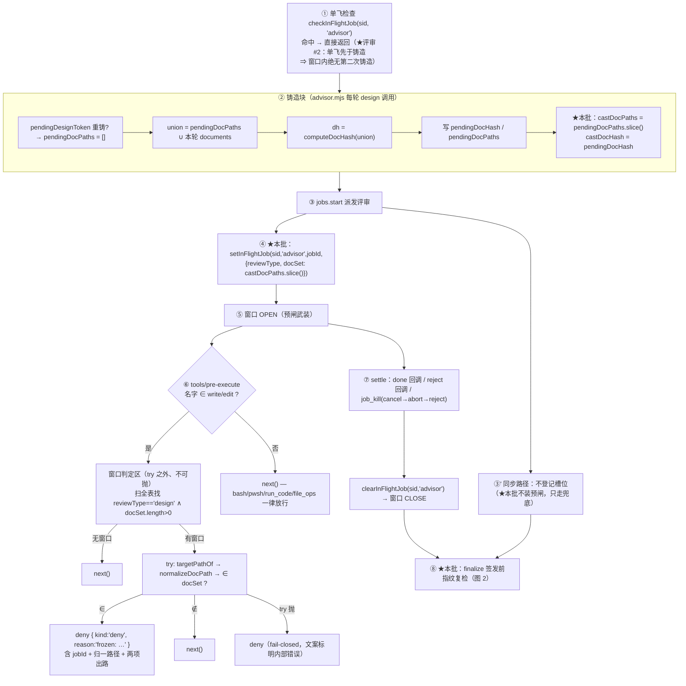
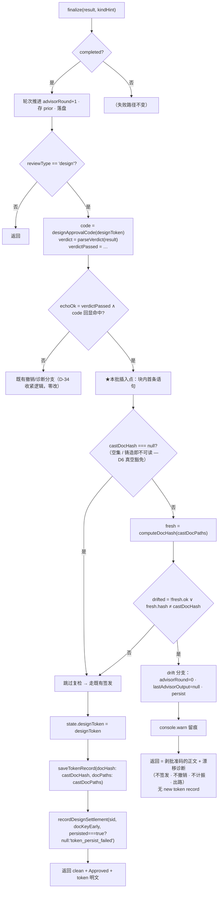

# 设计：守卫 E（在途窗口冻结 + 预闸拦截 + 结算侧指纹兜底）—— 批 6b

- 日期：2026-09-13
- 需求档：[`2026-09-13-guard-e-requirements.md`](./2026-09-13-guard-e-requirements.md)（7 用户故事 / 7 非功能标准）
- 会诊纪要：[`2026-09-13-guard-e-consult-minutes.md`](./2026-09-13-guard-e-consult-minutes.md)（会诊 id 1，四家交付；5 处分歧 + 父侧裁定 + 6 项登记）
- 章节：九节（§1 背景 · §2 问题 · §3 目标 · §4 决策与理由 · §5 方案 · §6 机制伪代码 · §7 状态与 schema · §8 防偏离 · §9 边界）+ §10 受影响文件与验收 + §11 变更记录；图示：**图 1（窗口生命周期与两个拦截面）** / **图 2（结算侧指纹复检数据流）**
- 状态：**已实施（v0.14.0）** —— 设计评审轮次 1 `FAIL`（🔴1 · 🟡4 · 🔵7）→ 修 12 条 → 轮次 2 **`PASS`** 并签发令牌（见 §12.2；本档正文自此为**冻结基线**）→ `eng_coder` 实施 → 独立分歧审计（🔴0 🟡1 🔵5，§12.4）→ 修复轮（§12.5）→ 交付代码评审 **`PASS`**（🔴0 🟡1 🔵4，§12.8）。全量 `node --test` **384/384**

> ## ⚠️ 行号引用口径（读本档前必读）
>
> 行号为 **as-of 批 6 交付后**实测值，会随每次改动漂移。**定位一律按符号名**：
>
> | 要找什么 | 检索符号 |
> |---|---|
> | 在飞槽位表（本批扩容） | `const inFlightJobs = new Map()` |
> | 槽位登记 / 清除 | `export function setInFlightJob` / `export function clearInFlightJob` |
> | 令牌铸造 + 指纹快照（本批加捕获） | `state.pendingDesignToken = generateDesignToken(config)` 所在块 |
> | 签发判定 + 签发分支（本批插兜底） | `const echoOk = ` / `if (echoOk) {` |
> | 批准码剥除（漂移路径复用） | `makeApprovalCodeRegex(code, "g")` |
> | 三振打点（**漂移分支必须绕过**） | `recordDesignSettlement(` |
> | 三振通用计振尾 | `recordDesignSettlement(sid, docKeyEarly, persisted === true ? null : "token_persist_failed")` 之后的 `else` 分支 |
> | `stale` 的真实语义（**机械定义**，勿混用） | `if (env.ok && env.text) recordDesignSettlement(sid, docKeyEarly, "stale")` |
> | 写门禁（**逐字节不动**） | `export function makeWriteGate` |
> | 写工具枚举 / 目标提取（本批导出复用） | `const WRITE_TOOLS = new Set(["write", "edit"])` / `function targetPathOf` |
> | 指纹实现（**唯一**） | `export function computeDocHash` / `export function normalizeDocPath` |
> | 监听器注册点（本批并排新增第二个） | `ctx.on("tools/pre-execute", makeWriteGate(...))` |

---

## §1 背景

审查链现在是「**判**得准（批 3 协议 + 批 4 护栏 + 批 6 死因）」，但仍有一个**开环**：一次设计评审所依据的**文档内容**，与该次评审签发的**授权**之间，只有「派发前的一枚快照」相连——签发那一刻**不复检**。

后果是一个**静默**的漏洞（登记为 **F17 型**）：评审在飞期间（我方路由下可达数分钟到 1 小时）改动被审文档，评审员读到的是「前半段旧内容 + 后半段新内容」的混合体；而**宿主完全不知道**，照常按 `verdictPassed ∧ echoOk` 签发令牌，该令牌还携带着**派发前**的指纹——指纹与令牌一起声称「我审的就是这些内容」。

上游靠基于变更日志的 `reviewIsStale` 事后判新鲜度；我方**没有**那种通道（架构差异，不照抄）。我方的等价物必须由自己的两口子拼出来：**在途槽位**（已有的单飞机制）+ **指纹**（D-30 已有的实现）。本批就是把这两样接起来，形成「事前拦 + 事后核」的完整守卫。

---

## §2 问题

| # | 问题 | 根因 | 证据（符号） |
|---|---|---|---|
| **P1** | **F17 型漏洞**：签发时不复检指纹 ⇒ 窗口内改动被「追认」 | `finalize` 签发分支无指纹复检 | `if (echoOk) {` 块内首条语句即 `state.designToken = designToken` |
| **P2** | 窗口内写被审文档**零可见性**：不拒绝、不告警、不记录 | 在飞槽位**不携带本轮在审的文档集** | `setInFlightJob(sessionId, mechanism, jobId)` —— 三参，无 docSet |
| **P3** | 无「窗口」概念：评审在飞与文档可写**同时成立** | 无任何 `tools/pre-execute` 监听器管文档冻结（现有写门禁只管「有没有令牌」，目标是**产品代码**，与文档不相交） | `makeWriteGate` 的 `isProductCode` 分支 |
| **P4** | 拦不住的面（`bash` 族）**无从补救** | 同上 | — |

**P1 的严重性**：它不是「偶尔出错」，而是**每一次窗口内编辑都必然**产出「令牌声称审过、实际没审过」的凭证。批 6 把「失败」变可见了；本批把「**成功的依据**」变可见。

---

## §3 目标

| # | 目标 | 验收面 |
|---|---|---|
| G1 | 窗口开启时，写入冻结集的 `write`/`edit` **事前拒绝**，且给出真实逃生门 | AC-E1 / AC-E2 / AC-E3 |
| G2 | 拒绝面**精确**：非冻结路径、非窗口态、非写工具**零影响** | AC-E4 / AC-E5 / AC-E6 / AC-E14 |
| G3 | 窗口结算时**复检指纹**，失配则本次**不签发** | AC-E7 / AC-E9 / AC-E11 / AC-E15 |
| G4 | 失配**不引入新死锁**：不撤销既有令牌、不计三振、不永久损伤 | AC-E13 / AC-E16 |
| G5 | 未失配时签发路径**逐字节等价**今日 | AC-E12（+ 既有 360 用例全绿） |
| G6 | 两闸**独立**、fail 朝向**分层**、判据**单点同源** | AC-E8 / AC-E17 |

---

## §4 决策与理由（含否决备选）

| # | 决策 | 理由 / 否决备选 |
|---|---|---|
| **D-E1** | 拦截面 = **独立** `tools/pre-execute` 监听器，**不并进** `makeWriteGate` | 两闸有**三条**结构性差异：① **fail 朝向相反**（写门禁 `catch → next()` fail-open；预闸在已确认窗口内 fail-closed）——单个 waterfall stage 的一个 catch 无法同时表达两个方向；② **depth 豁免相反**（写门禁 `depth > 0` 放行——子代理是受令牌保护的 sanctioned 实现者；预闸**全深度**拦截——被审文档的写入权与写入者身份无关）；③ **拒域不相交**（`isProductCode` = 非文档 vs 冻结集 = 文档）。**否决**：并进写门禁（一个 catch 两个方向 = 必然错一个） |
| **D-E2** | 触发工具**恰为** `{write, edit}`，**复用** `eng.mjs` 的 `WRITE_TOOLS`（导出，不新造字面量） | 唯一「单一 file_path 目标可机械提取」的写工具；bash 族目标在命令串里**原理上不可判定**（子 shell/重定向/编码）。**否决**：纳入 bash 族（fail-closed 下只能窗口内全禁 shell ⇒ 测试/git/构建全瘫，窗口长达数分钟不可接受）；纳入 `file_ops`（schema 未核实，扩枚举是独立变更 → 登记 O-E4） |
| **D-E3** | 冻结集 = 槽位载荷 `docSet`，登记时对 `state.pendingDocPaths` 的 **`.slice()` 快照**，**不读活 state** | 槽位是**窗口作用域的不可变权威**；`:1959` 每轮重赋值使别名「当前无害」，拷贝使正确性**不依赖**该实现细节。与 D-E6 是同一纪律的两处应用（见 D-E6） |
| **D-E4** | 冻结集 = **本轮并集**（`pendingDocPaths`，含历轮），**不是**本轮 `documents` | **两半必须同集**：兜底按 `pendingDocPaths` 重算，若预闸只冻本轮 `documents`，则「预闸放行的写、结算侧照样拒」= 两半自相矛盾。并集也是 D-30 的授权语义本体（「授权覆盖讨论中出现的全部文档」） |
| **D-E5** | **扫全表**拦任意会话/任意 depth 的写入；拒绝文案含**四条**（在飞 job id + 归一路径 + settle 自释放 + `job_kill <id>`） | 子代理的 `session.id` 与父不同 ⇒ 按执行者会话键单查**必然 miss**，而子代理恰是典型漂移向量。哨兵的全部意义是「**在被烧掉之前**拦住」——漏一个已知向量 = 哨兵价值打折。**否决**（kimi）：按执行者会话键自然 miss（把已知向量交给兜底）→ 登记其反方代价为 **O-E1**（跨会话误拒，爆炸半径 = 有界窗口内一次工具调用） |
| **D-E6** | **闭包捕获**铸造对（`castDocPaths` / `castDocHash`），finalize 只读捕获值 | 读活 `state.pendingDoc*` 在当前代码下**确实等价**（单飞入口检查早于铸造；窗口内无第二写点），但捕获让正确性**不依赖**该不变式：将来若有人在窗口内加一个写点，读活版会静默退化成「**自比恒真**」——守卫失效且**无测试会红**。捕获还让「不许读活 state」可落**机器验锚**（签发块内 `state.pendingDoc*` 出现次数 = 0）。风险不对称：捕获代价 = 两行局部变量 |
| **D-E7** | 兜底插入点 = `if (echoOk) {` 块内**首条语句**（`:2014` 与 `:2015` 之间），**仅当 `pendingDocHash !== null`** 才求值 | ① 只对「即将签发」的轮次付 fs 读成本；② 必须**先于**一切状态写点（`state.designToken` / `saveTokenRecord`），否则需要事后回滚 = 复制批 4 撤销路径（正是要避免的）；③ `null` 是 D-30 决策 D6 的**真空豁免**（空集 / 铸造即不可读 → 无指纹可漂），漏判会让**空文档集评审永远签不出** |
| **D-E8** | 漂移 ⇒ **早返回**，**绕过**通用计振尾；对 `recordDesignSettlement` **零调用**（既不加 1 也不复位） | ① **护栏计的是插件自身健康度**：七 kind 全是管线自己的故障，其指引全是「改我方配置/参数/路由」；漂移是**管线工作正常**（PASS + 回显命中）而外部改了文件——计数会让 `settlementGuardText` 的「最近三次 kind」诊断面指向**错误修法**（这正是批 6 全批在修的同一类病：把不同死因坍缩成一句话）；② 先例 `interrupted`（批 4 已豁免「行为造成、非管线故障」）；③ 回滚成本不可逆 vs 循环可自愈（每轮烧一次真实评审 LLM 是自限上界）。**否决**（v4-pro）：新增第 8 kind `doc_drift` 并计振——`stale` 的机械定义是「job **完成**但 **finalize 被跳过**（代际失配）」，漂移发生在 finalize **内部**、`completed` 为真、轮次照常推进，复用 `stale` 破坏 D-G5 机械事实归类；新增 kind 则要把七 kind 契约改八 kind + 改既有断言。**配套**：`SETTLEMENT_KIND_GUIDANCE` 保持七行**不扩**，并在其上方加注释钉死理由 |
| **D-E9** | 漂移 ⇒ **复位轮次**（`advisorRound = 0` + `lastAdvisorOutput = null` + 落盘）；**不** `bumpAdvisorGeneration` | 漂移轮的 `advisorRound` 照常 +1（轮次推进在 design 分支**之前**）⇒ 若不复位，下一轮取 `round >= 2` 的**收敛轮提示词**（「只做验证，不找新问题」）+ 注入**已失效**的 prior，而漂移内容**从未被评审**——这是真实的**放行面**。复位 ⇒ 下轮取全量设计提示词 + 无 prior = **全量重审**。代际**不 +1**：代际是「弃置在飞结果」的轴，漂移只影响本轮评审本身，+1 会连带把无关机制的 settle 误判为 stale |
| **D-E10** | 漂移 ⇒ **不撤销**既有令牌（不 `removeTokenRecord`、不置 `state.designToken = null`） | 前提是「失配**不签发**」，非「失配撤销」。漂移触及旧令牌已绑文档 ⇒ `eng_coder` 续期路径自会 fail-closed 拒绝（下游已闭合）；漂移只触及新并入文档 ⇒ 旧令牌完全有效，撤销即**误伤**（违背 FR-6「一次守卫事件不销毁既得授权」，与情形 ③「PASS + 回显问题不撤销」同族） |
| **D-E11** | fail 朝向**分层**：**窗口已确认** ⇒ 判定故障 **deny**（fail-closed）；**窗口未确认**（注册表读取故障）⇒ 放行 + warn | fail-closed 的正确形态是「**无法证明目标在冻结集之外**时按在其中处理」——前提是「有窗口」已确立；窗口未确认时**无可护之物**。实现上结构化保证：**窗口判定区**（`inFlightJobs` 遍历 + 槽位字段读，纯模块态、不可抛）**先于且独立于** `try` 区，`try` 只包目标解析/归一/成员判定 ⇒ `catch → deny` 在结构上只可能发生在窗口内。与写门禁（`catch → next()` 无条件 fail-open）**确实相反**，满足 N-4 |
| **D-E12** | 预闸**不查** `engEffective`（与 `makeWriteGate` 的第一道分支刻意不同） | 窗口完整性不变式与主代理模式**无关**：标准模式下同样可能有在飞 design 评审。加模式门只会造出「标准模式下评审窗口无冻结」的**静默洞**。拦截面已被「冻结集成员资格」收窄到「正在审的那几份文档」，不需要模式门来收窄 |
| **D-E13** | 拒绝前缀 = **`"frozen: "`**（**不复用** `"denied: "`） | 写门禁的 `"denied: "` 是既有契约，既有断言按前缀区分两态；混用会让「被拒是因为没有令牌」与「被拒是因为文档在审」变得不可分辨——而这两件事的**出路完全不同**（前者去写设计文档/过 eng_coder，后者等 settle 或 job_kill）。N-7：判定族字面**只追加** |
| **D-E14** | 漂移诊断**不逐文件点名**，但重算 `ok:false` 时列出 `missing` 清单 | 逐文件二次比对 = 新增一轮 N 次 fs 读 + 一份会漂的归因逻辑；`missing` 清单**零成本**且是 fail-closed 路径独有的诊断价值（「你删/改名了这份」） |
| **D-E15** | 漂移路径**剥离批准码回显**（复用 `makeApprovalCodeRegex(code, "g")`） | 漂移路径 = 「签发路径**减去**签发」，继承签发路径的卫生：防止任何自动化把「未签发轮的回显」误当批准信号。（与 FAIL 路径不回显、无码可剥不矛盾） |
| **D-E16** | 槽位载荷扩容为**位置参数**（`setInFlightJob(sid, mechanism, jobId, payload)`），非对象重构 | 既有 **6** 个调用点（advisor ×2、eng ×2、**escalate ×2**——审计 F3 订正，原文误记 escalate ×1 / 共 5）**零改动**即可继续工作（payload 缺省 `{}`）——把「不改既有调用点」写成结构性事实而非纪律。**否决**：改成对象参数（全改 = 同样数量的新回归面） |
| **D-E17** | 本批**不做**同步路径预闸、不改令牌生命周期、不扩七 kind、不做墓碑、不做逐文件归因 | 需求档 §5.1（六项） |

---

## §5 方案

### §5.1 窗口生命周期与两个拦截面（图 1）



**读图要点**：① **单飞检查在铸造块之前**（与代码同序——单飞命中即返回，**不触铸造**，故窗口内 `pendingDoc*` 逐字节不变）；⑥ 的**窗口判定区在 `try` 之外**——这是 D-E11 分层 fail 朝向的结构性保证；⑦ 的三条 settle 路径（正常 settle / reject / 宿主 `job_kill`）**都**经 `clearInFlightJob`，故窗口必有界，逃生门是真的。


### §5.2 结算侧指纹复检数据流（图 2）



**读图要点**：G4 的两个分支都在**同一份捕获数据**上判定（D-E6），故「预闸冻的集合」（图 1 D3 的 `docSet`）与「兜底重算的集合」（G3 的 `castDocPaths`）**必然是同一个数组的两个拷贝**——两半同集（D-E4）由图结构保证，不靠纪律。

---

## §6 机制伪代码

### §6.1 `advisor.mjs` —— 槽位载荷 + 捕获 + 访问器

```js
// ——— 槽位表（既有，仅值形态扩容）———
const inFlightJobs = new Map() // "sessionId:mechanism" → { jobId, mechanism, reviewType, docSet }

/**
 * 派发成功后登记槽位。`payload` 为本批扩容载荷（缺省 {} —— 既有 5 个调用点零改动）。
 * reviewType: "design" 时 docSet 必须传入（快照拷贝，见 D-E3）；其余机制不传。
 */
export function setInFlightJob(sessionId, mechanism, jobId, payload) {
  const p = payload && typeof payload === "object" ? payload : {}
  inFlightJobs.set(inFlightKeyOf(sessionId, mechanism), {
    jobId: String(jobId ?? "?"),
    mechanism,
    reviewType: typeof p.reviewType === "string" ? p.reviewType : null,
    docSet: Array.isArray(p.docSet) ? p.docSet.slice() : [], // ★拷贝：不持有活引用
  })
}

/**
 * 守卫 E（预闸）只读访问器：扫**全表**找武装中的 design 冻结窗口（D-E5）。
 * 扫全表而非键查：子代理 session.id ≠ 父 ⇒ 键查必然 miss，而子代理是典型漂移向量。
 * 多条 design 槽位同时武装 → 全部并入（文档级并集语义；窗口有界、并发度低）。
 * @returns {{jobIds: string[], docSet: string[]}|null} 无武装窗口 → null（窗口判定区，不可抛）
 */
export function designFreezeSet() {
  const jobIds = []
  const docSet = new Set()
  for (const slot of inFlightJobs.values()) {
    if (slot?.reviewType !== "design") continue
    if (!Array.isArray(slot.docSet) || slot.docSet.length === 0) continue
    jobIds.push(slot.jobId)
    for (const d of slot.docSet) docSet.add(d)
  }
  return jobIds.length > 0 ? { jobIds, docSet: [...docSet] } : null
}

// ——— 铸造块末尾（C5）：闭包捕获（D-E6）———
const castDocPaths = [...state.pendingDocPaths]   // 本轮冻结副本
const castDocHash = state.pendingDocHash

// ——— 派发点（advisor 两条 jobs 路径）———
setInFlightJob(sid, "advisor", started, {
  reviewType,                        // "design" | "code"
  docSet: reviewType === "design" ? castDocPaths : [],
})
```

### §6.2 `advisor.mjs` —— finalize 漂移分支（插入点 = `if (echoOk) {` 首条语句）

```js
if (echoOk) {
  // ★守卫 E 兜底（D-E7）：签发前重算并集指纹。纯读判定，先于一切状态写点。
  // 基准 = **闭包捕获**的铸造对（D-E6），绝不读活 state.pendingDoc*（机验锚 AC-E17）。
  // 评审 #9：`warnPrefix` 是本 finalize 闭包**外层**的既有局部量（`advisor.mjs` 路由解析处
  // 定义，as-of 批 6 实测 :1935）——非本批新引入，逐字沿用。
  // fresh 只算一次（下分支复用它的 missing 清单——**不要重复调用**，那是多余的 N 次 fs 读）
  const fresh = castDocHash === null ? null : computeDocHash(castDocPaths)
  const drifted = fresh !== null && (!fresh.ok || fresh.hash !== castDocHash)
  if (drifted) {
    // D-E9：复位轮次 —— 漂移内容从未被评审，绝不能让下一轮以「收敛轮」提示词 + 已失效
    // prior 去只验证不找新问题（那是真实的放行面）。**不** bumpAdvisorGeneration（D-E9）。
    state.advisorRound = 0
    state.lastAdvisorOutput = null
    persistSessionState(agent, state, opts)
    console.warn("[thincoder-suite] 守卫 E：签发前文档集指纹失配（冻结 " + castDocPaths.length
      + " 份文档）——本次不签发。")
    const cleanDrift = String(result).replace(makeApprovalCodeRegex(code, "g"), "").trim()
    const missList = !fresh.ok && Array.isArray(fresh.missing) && fresh.missing.length > 0
      ? "\nUnreadable (deleted / renamed / permission):\n" + fresh.missing.map(p => "- " + p).join("\n")
      : ""
    // D-E8：**早返回** —— 绕过下方通用计振尾（recordDesignSettlement 零调用；既不加 1 也不复位）。
    return warnPrefix + cleanDrift
      + "\n\n[thincoder-suite] guard E: the reviewed document set changed while the review was in flight — "
      + "no designToken was issued for this round." + missList
      + "\nThe other clauses hold: the existing token (if any) is NOT revoked, this round does NOT count "
      + "against the settlement guard, and the round counter has been reset."
      + "\nOption: make sure the documents are stable, then re-issue advisor(type='design') for a full re-review."
  }
  state.designToken = designToken
  // ↓↓↓ 既有签发路径**零改动**（但喂料换成捕获值 —— D-E6；稳定时与今日等值）↓↓↓
  const persisted = saveTokenRecord(agent.session.id, {
    token: designToken,
    issuedAt: Date.now(),
    expiresAt: tokenExpiryMs(designToken),
    docHash: castDocHash,
    docPaths: castDocPaths,
  }, opts.storPathOverride, agent.session?.header?.cwd)
  // …以下逐字节不动…
}
```

### §6.3 `eng.mjs` —— 预闸工厂（`makeWriteGate` 旁）+ 两个复用点的导出

> **imports（评审 #6）**：`eng.mjs` 现有 `import { computeDocHash } from "./doc-hash.mjs"`，**需**扩为
> `import { computeDocHash, normalizeDocPath } from "./doc-hash.mjs"`（N-3：路径归一**只此一处实现**，
> 预闸不得自造副本）。该改动须记入 §10.1 的 `lib/eng.mjs` 行。

```js
/** 写工具集合（导出供预闸复用 —— N-3 单一实现，禁第二份字面量）。 */
export const WRITE_TOOLS = new Set(["write", "edit"])

/** 从工具参数提取目标路径（导出，同上）。 */
export function targetPathOf(name, args) { /* 既有实现逐字不动 */ }

/**
 * 守卫 E 预闸（D-E1/D-E11/D-E12）：窗口内冻结被审文档。
 * 与 makeWriteGate **刻意不同**的三点：① fail 朝向（已确认窗口内 fail-closed）；
 * ② depth 不豁免（全深度拦截）；③ 不查 engEffective（窗口完整性不变式与模式无关）。
 * @param {() => ({jobIds: string[], docSet: string[]}|null)} getFreezeSet
 */
export function makeDocFreezeGate(getFreezeSet) {
  return async (exec, next) => {
    // ① 名字门（评审 #7：**先于**注册表扫描）——绝大多数工具调用在此零成本返回，
    //    且使「注册表读取故障」的影响面被收窄到 write/edit 之内。
    if (!WRITE_TOOLS.has(exec?.name)) return await next()
    // ② 窗口判定区：在 try **之外**，纯模块态、不可抛（D-E11 的结构性保证）
    let freeze
    try { freeze = getFreezeSet() } catch (e) {
      // 注册表读取故障 ⇒ 窗口**未被确认** ⇒ 无可护之物 ⇒ 放行，但**必须 warn**
      //（D-E11 / N-4 / AC-E8 三处均要求「放行 + warn」——静默 fail-open 不可接受）
      console.warn("[thincoder-suite] 守卫 E 预闸：" + (e?.message ?? String(e)))
      return await next()
    }
    if (!freeze) return await next()
    const frozen = new Set(freeze.docSet)
    // ③ 判定区：try 内，抛异常 = fail-closed（deny）
    try {
      const target = targetPathOf(exec?.name, exec?.arguments)
      if (!target) return { kind: "deny", reason: frozenReason(freeze, null, "unresolvable target") }
      if (!frozen.has(normalizeDocPath(target))) return await next()
      return { kind: "deny", reason: frozenReason(freeze, normalizeDocPath(target), null) }
    } catch (e) {
      return { kind: "deny", reason: frozenReason(freeze, null, "gate internal error: " + (e?.message ?? e)) }
    }
  }
}

/** 拒绝文案（D-E5：四条必备；D-E13：前缀 "frozen: " 与写门禁 "denied: " 不混用）。 */
function frozenReason(freeze, target, err) {
  return "frozen: " + (freeze.docSet.length) + " document(s) are frozen while a design review is in flight"
    + " (job " + freeze.jobIds.join(", ") + ").\n"
    + (target ? "Target: " + target + "\n" : "")
    + (err ? "Reason: " + err + "\n" : "")
    + "Frozen document set (normalized):\n" + freeze.docSet.map(d => "- " + d).join("\n") + "\n"
    + "Options: (1) wait for the completion notice, then read it with job_output; "
    + "(2) escape early with job_kill " + freeze.jobIds[0] + " — the slot releases on settle.\n"
    + "Note: editing a reviewed document now would in any case make this round fail the "
    + "settlement-side fingerprint re-check, so it cannot buy a token."
}
```

### §6.4 `index.mjs` —— 并排注册（第二个独立监听器）

```js
// —— 写门禁（既有，逐字节不动）——
const offGate = ctx.on("tools/pre-execute", makeWriteGate(() => configDefaultEngineering))
disposes.push(offGate)

// —— 守卫 E 预闸（D-E1：**独立**监听器，不并进写门禁）——
// 两闸拒域**按设计意图**不相交（冻结集 = 文档 vs isProductCode = 非文档）；即便重叠也无害
// （deny 可复合，注册次序仍无关）。**评审 #12**：不主张「构造性」——isProductCode 与 isDocFile
// 是两份互相矛盾的谓词（交接页 §5），属批 7「判据单一权威」。
// 放后侧保持既有门禁位置零移动。
const offFreezeGate = ctx.on("tools/pre-execute", makeDocFreezeGate(() => designFreezeSet()))
disposes.push(offFreezeGate)
```

---

## §7 状态与 schema

| 面 | 变更 | 说明 |
|---|---|---|
| `inFlightJobs` 槽位值 | `{jobId, mechanism}` → `{jobId, mechanism, reviewType, docSet}` | **纯内存态**（既有性质不变）：不落盘、崩溃自清、生命周期挂 done settle |
| 新导出 `designFreezeSet()` | `advisor.mjs` | 只读访问器；**唯一**的槽位读取面（预闸不直接摸 Map） |
| 新导出 `makeDocFreezeGate()` / `WRITE_TOOLS` / `targetPathOf()` | `eng.mjs` | 前二者为新建与提升可见性；`WRITE_TOOLS`/`targetPathOf` 由「模块私有 const/function」升为 export，**实现逐字不动** |
| `session-state.json` | **零新增字段** | 窗口态是内存态；AC-20「文档路径不得入会话状态镜像」既有契约**不受影响**（`docSet` 只活在内存 Map 与 token-store 的既有 `docPaths` 字段） |
| `design-tokens.json` | **零 schema 变更** | 既有 `docHash`/`docPaths` 字段**改喂捕获值**（D-E6）——稳定时与今日等值 |
| 三振账本 / `SETTLEMENT_KIND_GUIDANCE` | **零变更** | D-E8：不新增 kind、不改词表；**只在 guidance 表上方加注释**钉死「漂移不属计数面」的理由 |
| 新增测试档 | `test/guard-e.test.mjs` | 唯一新增文件（N-6） |

---

## §8 防偏离

### §8.1 零改面（验收拒收项）

| # | 面 | 判据 |
|---|---|---|
| 1 | **既有写门禁** | `makeWriteGate` 函数体**逐字节不动**；既有写门禁断言**零修改**全绿 |
| 2 | **既有 360 用例** | 全部零修改通过（新增用例只进新档 `test/guard-e.test.mjs`） |
| 3 | **既有 6 个 `setInFlightJob` 调用点** | `eng.mjs` ×2 与 `escalate.mjs` ×2 **逐字节不动**；`advisor.mjs` ×2 **仅追加第四参**（既有三参形态**仍合法**——D-E16 的位置参数兼容保证，故「既有调用点未变」指的是这三种机制**不需要为兼容而改**，不是我方 advisor 派发点不动）。**评审 #4 修订**：原文把调用点一并写成「零改动」，与 §10.1 ④ / stage 2 直接冲突，会误伤合规交付。**分歧审计 F3 订正**：原文数「escalate ×1 / 共 5 处」**是错的**——实测 `escalate.mjs` 有**两处**三参调用点（`:218` 与 `:536`），批前总数 = **6**（advisor ×2、eng ×2、escalate ×2），批后仍为三参的 = 4 处 |
| 4 | **`checkInFlightJob` 拒绝文案** | 逐字不动（单飞语义零改） |
| 5 | **令牌生命周期** | 铸造 / 续期 / 撤销 / TTL 零改；本批只**新增一个签发前复检** |
| 6 | **批 4 三振面** | 计数逻辑、键、词表、`settlementGuardText` 形状零改（只在 guidance 表上方**加注释**） |
| 7 | **`doc-hash.mjs`** | 逐字节不动（判据同源 = 复用它，不是改它） |
| 8 | **前缀字面** | 既有 `"denied: "` / `"Advisor: "` / `"eng_coder aborted."` 等**一律不动**；新前缀 `"frozen: "` **只追加** |

### §8.2 机验锚（防静默退化 —— **谓词写全三件事**）

> **交接页 §2 纪律 2 / D-37 教训**：每条锚必须写清 **何时点**（历史提交 vs 当前工作树）· **何谓改**（新增 ≠ 修改，须用 `--diff-filter=MD`）· **自指**（锚所在文件自身是否在集合内）。

| # | 锚 | 谓词写全 | 现在是否通过 |
|---|---|---|---|
| **A1** | 漂移分支**不读活 state** | 对 `lib/advisor.mjs` 的 `if (echoOk) {` 起的签发块做**文本切片**（切片以 `const persisted = saveTokenRecord(` 为右界），断言切片内 `state.pendingDoc` 出现 **0** 次 | ✅（新锚，断言本批新增形态） |
| **A2** | **零改面**：`makeWriteGate` 函数体未改 | 对 `lib/eng.mjs` 的 `function makeWriteGate(` 起始文本切片断言含 `return await next() // 门禁自身故障` 等既定子串，且**本批 diff** 不含该函数体区间 | ✅（**不用**「工作树 vs HEAD」形态——D-37 三连坑；改用「本批提交的 diff 是否触及该函数体」这一**持久形态**） |
| **A3** | 预闸**全深度**拦截（depth 不豁免） | 断言 `makeDocFreezeGate` 的文本切片**不含** `delegationDepth`；并由 AC-E2 以 depth=1 真调用断言 deny | ✅ |
| **A4** | 预闸**不查** eng 模式 | 断言 `makeDocFreezeGate` 切片不含 `engEffective`；AC-E14 以标准模式真调用断言 deny | ✅ |
| **A5** | 两闸**独立** | 断言 `index.mjs` 内 `ctx.on("tools/pre-execute"` 出现 **2** 次，且分别绑定 `makeWriteGate` 与 `makeDocFreezeGate` | ✅ |
| **A6** | 判定族字面**只追加** | 断言 `lib/eng.mjs` 内 `"denied: "` 出现 **≥2** 次（**实测既有值 = 2**：过期态 `:176` 与无令牌态 `:178`——**不得写 `=== 1`**，那会假红）**且** `"frozen: "` 出现 ≥1 次。两侧口径刻意不同：既有字面**不许减少**（替换会归零 → 红），新字面**必须存在**（漏实现 → 红） | ✅ |
| **A7** | 兜底在**写点之前** | 对 `if (echoOk) {` 块断言 `computeDocHash(castDocPaths)` 的**字符下标 <** `state.designToken = designToken` 的字符下标 | ✅ |
| **A8** | 漂移**绕过**计振尾 | 断言漂移分支文本切片内含 `return` 且 `recordDesignSettlement` 出现 **0** 次 | ✅ |
| **A9** | guidance 七 kind **不扩** | 断言 `SETTLEMENT_KIND_GUIDANCE` 长度 = 7（既有批 4 断言形式的镜像；防「顺手加第 8 行」） | ✅ |
| **A10** | **单一实现**（N-3 / 评审 #10） | 跨 `lib/` 断言三处字面各只出现 1 次：`new Set(["write", "edit"])`（**实测既有 = 1**，`eng.mjs:44`）· `export function normalizeDocPath`（**实测 = 1**，`doc-hash.mjs:35`）· `function targetPathOf`（**实测 = 1**，`eng.mjs:61`）。断言的是「**没有第二份副本**」，故用「该形态在 `lib/**` 内的命中数 == 1」而非「文件内出现 1 次」 | ✅（**实测三处均为 1**） |

> **A2 的口径说明（D-37 正面范式）**：该锚断言的是「**本批的交付**没有改 `makeWriteGate`」，其持久形态 = 对**批 6b 的提交**取 `git show --name-only --format= <sha>` 看路径 + 对函数体做**内容子串**断言——两者都不随后续批次的工作树状态变化。**禁止**再用 `git diff --name-only HEAD --` 这种「只在提交前成立」的形态（D-37 的 T-G9 与 T-AP9 两次事故）。

---

## §9 边界

| # | 边界 | 行为 | 理由 |
|---|---|---|---|
| 1 | **同步路径**（budget ≤ cap / jobs 不可用） | 预闸**恒空转**（不登记槽位、无 jobId）；**只有兜底生效** | 拒绝文案若给 `job_kill` 出路即是**撒谎**（该 job 不存在）；同步调用期间主代理被冻在自己的工具调用内，写入者是外部 ⇒ 归兜底。**设计档显式声明**，防审计误报为缺陷 |
| 2 | **空文档集**（`documents` 为空 / 铸造即不可读） | `docSet=[]` ⇒ 预闸**不武装**；`pendingDocHash===null` ⇒ 兜底**真空豁免**、签发照旧 | D-30 决策 D6 的既有权衡（空集 hash 恒等，会让续期护栏真空为真）；漏判会让空文档集评审**永远签不出** |
| 3 | **`code` 评审在飞** | 不冻结任何路径（`docSet: []`） | code 评审不铸令牌，`documents` 只是「验收语境」，无冻结义务 |
| 4 | **`escalate` / `eng` 槽位** | 永不武装（不传 `reviewType: "design"`） | 非设计评审机制 |
| 5 | **非 `write`/`edit` 工具** | 一律放行（含 bash/pwsh/run_code/file_ops） | D-E2；该面归兜底 |
| 6 | **窗口内第二次 advisor design 调用** | 单飞拒绝（既有语义零改），`pendingDoc*` 逐字节不变 | 窗口内无第二铸造 ⇒ 捕获基准天然是 dispatch 时刻快照 |
| 7 | **跨会话 / 跨 depth 写冻结集** | **拒绝**（D-E5 扫全表） | 被审文档的写入权与写入者身份无关；反方代价登记 O-E1 |
| 8 | **`job_kill`** | 槽位经 cancel → abort → reject 处理器 → `clearInFlightJob` 释放 | 逃生门真实可用（批 6 已核实 `job_kill` 在平台工具表上） |
| 9 | **相对 vs 绝对路径偏斜** | 预闸可能 **miss**（不是误拒） | `normalizeDocPath` 以 `process.cwd()` 为基；miss → 兜底捕获。deny 文案展示**归一后**集合供排查（O-E5） |
| 10 | **跨链过度冻结** | 转链后 B 的窗口仍冻结 A 的文档 | D-30「并集永不忘」既有语义投影（O-E2，非本批引入） |

---

## §10 受影响文件全清单与验收

### §10.1 实施域（eng-coder 写域）

| 文件 | 改动 | 类型 |
|---|---|---|
| `lib/advisor.mjs` | ① 槽位表值形态 + `setInFlightJob` 第四参 `payload`；② 新导出 `designFreezeSet()`；③ 铸造块末尾捕获 `castDocPaths`/`castDocHash`；④ 两条 advisor jobs 派发点传载荷；⑤ `if (echoOk) {` 首条语句插漂移分支；⑥ `saveTokenRecord` 喂料换捕获值；⑦ `SETTLEMENT_KIND_GUIDANCE` 上方加注释 | 修改 |
| `lib/eng.mjs` | ① **import 扩为** `{ computeDocHash, normalizeDocPath } from "./doc-hash.mjs"`（评审 #6：`normalizeDocPath` **当前未 import**——实测该文件只 import 了 `computeDocHash`；预闸要用它且 N-3 禁自造，故必须显式声明）；② `WRITE_TOOLS` 与 `targetPathOf` 升为 export（实现逐字不动）；③ 新增 `makeDocFreezeGate` 与 `frozenReason` 模块私有辅助 | 修改 |
| `lib/index.mjs` | ① import `makeDocFreezeGate` / `designFreezeSet`；② 写门禁之后并排注册第二个监听器 + disposer | 修改 |
| `test/guard-e.test.mjs` | 新增：AC-E1…AC-E21 + 机验锚 A1…A10 | **新增** |

**不改动**：`lib/escalate.mjs`（既有三参调用形态天然适配 D-E16）· `lib/doc-hash.mjs` · `lib/token-store.mjs` · `lib/session-store.mjs` · `lib/state.mjs` · `lib/prompts.mjs` · 所有既有测试档。

### §10.2 用例与验收标准

| # | 验收标准 | 形态 |
|---|---|---|
| **AC-E1** | 真实派发一个 design 评审（后台）→ 在飞窗口内 `makeDocFreezeGate` 对冻结集内路径返回 `{kind:"deny"}`，reason 含 **jobId** + **归一路径** + **`job_kill`** + settle 自释放说明四要素 | 核心 |
| **AC-E2** | 同一写以 `delegationDepth=1` 的子代理会话发起 → **仍 deny**（写门禁放行、预闸拦截的不对称即本条，锚 A3） | 核心 |
| **AC-E3** | 窗口内写**非冻结**路径（其他文档 / 产品代码）→ `next()`（放行） | 正常 |
| **AC-E4** | 无在飞窗口时，任意 `write`/`edit` → `next()`（无窗口 = 惰性） | 正常 |
| **AC-E5** | 窗口内 `bash` / `pwsh` / `run_code` / `file_ops` 名 → `next()`（不触发预闸） | 边界 |
| **AC-E6** | `reviewType: "code"` 槽位在飞 → **不武装**（其 documents 可写）；`escalate`/`eng` 槽位同 | 边界 |
| **AC-E7** | 窗口内目标**不可解析**（无 `file_path`/`path`）→ **deny**（fail-closed） | 错误 |
| **AC-E8** | 判定区抛异常 + 窗口**已确认** → **deny** 且文案标明内部错误；注册表读取故障 + 窗口**未确认** → **next()** + warn（两个方向各一断言，锚 A5 反向） | 错误 |
| **AC-E9** | PASS + 回显 + **铸造后改动一份冻结文档** → **不签发**：`state.designToken` 未写、`saveTokenRecord` **未调用**、返回含漂移诊断四元（不签发 / 不撤销 / 不计振 / 出路） | **核心（F17 闭合）** |
| **AC-E10** | 逃生门真实：对在飞 job 调用 `job_kill` → 槽位释放 → 同一写**由 deny 转为放行** | 核心 |
| **AC-E11** | 铸造后**删除**一份冻结文档（重算 `ok:false`）→ 同失配，且诊断含 `missing` 清单（锚 D-E14） | 错误 |
| **AC-E12** | PASS + 回显 + 文档**未动** → 签发路径与今日**逐字节等价**（返回串含 `Approved.` + token 明文；`saveTokenRecord` 收到 `castDocHash`/`castDocPaths`）；既有 360 用例全绿 | **零回归** |
| **AC-E13** | 漂移轮之后重跑 design → 按当前内容重铸指纹、**正常签发**（漂移被吸收，无永久损伤）；且漂移后 `designStrikes` **与漂移前相等**（不计振，锚 A8） | 恢复 |
| **AC-E14** | **标准模式**（eng OFF）下窗口内写冻结集 → **仍 deny**（锚 A4） | 边界 |
| **AC-E15** | 漂移分支后 `advisorRound === 0` 且 `lastAdvisorOutput === null` 且**已落盘**（D-E9：下一轮取全量提示词 + 无 prior） | 核心 |
| **AC-E16** | 漂移**不撤销**既有令牌：漂移前先签发一枚 → 制造漂移 → `state.designToken` 与 `design-tokens.json` 记录**原样存活** | 核心 |
| **AC-E17** | 机验锚 **A1/A2/A7/A8** 全绿（漂移分支不读活 state · 写门禁函数体未改 · 兜底在写点之前 · 漂移绕过计振尾） | 防退化 |
| **AC-E18** | 机验锚 **A3/A4/A5/A6/A9** 全绿（全深度拦截 · 不查 eng 模式 · 两闸独立且各一 · 判定族字面只追加 · guidance 七 kind 不扩） | 防退化 |
| **AC-E19** | 全量 `node --test` **375+ 全绿**（360 既有 + 新增），**既有测试档零修改** | 收口 |
| **AC-E20** | **真空豁免不死锁**（评审 #1 / 纪要 §4 栽点 2）：`documents=[]`（或铸造时全部不可读 ⇒ `castDocHash === null`）+ PASS + 回显命中 → **签发照旧**（`state.designToken` 写入、`saveTokenRecord` 被调用、返回含 `Approved.`）；且**不得**走入漂移分支。反设成立时本条转红（把 `fresh.hash !== castDocHash` 写在 null 守卫之外即触发） | **核心** |
| **AC-E21** | **单一实现锚 A10 全绿**（`WRITE_TOOLS` 字面 / `normalizeDocPath` 导出 / `targetPathOf` 各只一份，跨 `lib/**`） | 防退化 |

### §10.3 建议 stages（给 eng_coder）

| stage | goal | 检查 |
|---|---|---|
| 1 | 槽位载荷扩容 + `designFreezeSet()`；**`escalate.mjs` ×1 与 `eng.mjs` ×2 三参调用点逐字节不动**（advisor ×2 的第四参留到 stage 2） | `node --check lib/advisor.mjs` + 既有单飞用例绿 |
| 2 | 铸造块捕获 + 两条派发点传载荷 | `node --check lib/advisor.mjs` |
| 3 | finalize 漂移分支 + 喂料换捕获值 + guidance 注释 | `node --check lib/advisor.mjs` + 既有 design 签发用例绿 |
| 4 | `eng.mjs`：导出 `WRITE_TOOLS`/`targetPathOf` + `makeDocFreezeGate` | `node --check lib/eng.mjs` + 既有写门禁用例绿 |
| 5 | `index.mjs` 并排注册 | `node --check lib/index.mjs` |
| 6 | `test/guard-e.test.mjs` 全部 AC + 锚 | `node --test test/guard-e.test.mjs` 绿 + 全量 `node --test` 绿 |

---

## §11 变更记录

| 日期 | 变更 |
|---|---|
| 2026-09-13 | 首版（设计待评审）：会诊 id 1 四家交付 → 九节 + 图 1/图 2；D-E1…D-E17；AC-E1…AC-E19 + 机验锚 A1…A9；§10.3 六 stage 建议 |
| 2026-09-13 | **设计评审轮次 1 修正块（§12）**：评审 `VERDICT: FAIL`（🔴1 · 🟡4 · 🔵7 = 12 条，job `advisor-dsh-2`）。🔴#1 真空豁免无 AC → 新增 **AC-E20**；🟡#2 图 1 顺序与代码相反 → 重排（单飞**先于**铸造）；🟡#3 §6.3 catch 漏 warn → 补；🟡#4 §8.1 #3 与 §10.1 冲突 → 改口径；🟡#5 US-2 措辞 → 改 requirements；🔵#6 `normalizeDocPath` 未 import → §10.1 显式声明（实测该文件确未 import）；🔵#7 扫描前移名字门；🔵#8 重复 `computeDocHash` → 已修；🔵#9 `warnPrefix` 出处标注；🔵#10 → 新增锚 **A10** + **AC-E21**；🔵#11 docs/README.md 注册（父侧收口步）；🔵#12「构造性不相交」→ 软化为「按设计意图」 |

---

## §12 设计评审落档

### §12.1 轮次 1（2026-09-13 —— `VERDICT: FAIL`，job `advisor-dsh-2`）

**🔴1 · 🟡4 · 🔵7 = 12 条**。逐条处置见 §11 第二行（处置表已在会话中逐条落）。**修正方式 = 就地修（inline）**，以 `★评审 #N` 标记标在被改处——故本档**不另设**「轮次 1 修正块」小节。

### §12.2 轮次 2（2026-09-13 —— `VERDICT: PASS`，job `advisor-dsh-3`）

评审员**重新读盘**复核 12 条：**全部 Fixed**（🔴#1 以 AC-E20 的「专门且可证伪」收口；源码侧「实测」主张经其抽样复核与当前代码一致——`eng.mjs` import 清单 · `warnPrefix` 作用域 · 锚 A10 三处计数 · `"denied: "` 计数 = 2 · `tools/pre-execute` 注册数）。

**新增两条（均 🔵 文档卫生，非阻塞）**：

| 新# | 内容 | 处置 |
|---|---|---|
| 13 | 纪要 §1 #9 仍写「拒域**构造性**不相交」，未随 #12 同步（跨档滞后，R7a） | **已修**：纪要 §1 #9 改为「两闸**拒域按设计意图不相交**」——三层档口径现已一致 |
| 14 | 本档无 `§12` 章节，却在 §11 标「修正块（§12）」、纪要 §2 也称「写进设计档 §12」（悬空引用，R7d） | **已修**：**新增本节 §12**（轮次 1 + 轮次 2 落档），使引用落地；并明确「轮次 1 的修正就地做、不另设修正块小节」的口径 |

**签发**：`designToken` = `d0993b23-…`（有效至 2026-09-20，TTL `engTokenTtlMs`）。**本档此后为冻结基线**——实施期如需偏离，按 §8.1 走偏差裁定，不改本档正文。

### §12.3 父侧任务书自身缺陷登记（2026-09-13，`eng_coder` 交付报告偏差 ②）

| # | 缺陷 | 事实 | 处置 |
|---|---|---|---|
| 1 | **stage 1 的 check 命令指向不存在的文件** | 本父侧在派发 `eng_coder` 时把 stage 1 的 `check` 写成 `node --test test/in-flight.test.mjs`——该档**在本仓不存在**（单飞 D-06 用例实际住在 `test/codex-runner.test.mjs` 与 `test/advisor-config.test.mjs`）。这是父侧**照符号名推路径而未回盘核**的产品，正是批 6 §0.2 记的同一类病（凭形状推测而不回代码核验） | 实现者**按纪律处理**：以 `test/codex-runner.test.mjs`（177/177）作等价自检，**没有**为迁就任务书新建文件、也没有把「文件不存在」静默吞掉——如实写进交付报告偏差 ②。**登记以留痕**（父侧错误必须落档，对齐需求档 §0.2 纪律）；§10.3 的 stage 表维持原文（它是历史记录），但后续派发前必须先核路径存在性 |

### §12.4 分歧审计落档（2026-09-13 —— 独立子代理 `c576567a`，只读 + 10 组变异实验）

**结论：`DIVERGENCE: 6 items（🔴0 🟡1 🔵5）`——无机制级分歧**。审计自证只读（跑前跑后 `git status --porcelain` 逐字节相同）、变异实验全部在 `%TEMP%` 的一次性副本上做。

**§10.2 §10.1 逐条对照全清**：机制伪代码 §6.1–§6.4 与实现逐字相符（含 capture 时点、单次 `computeDocHash`、早返回、全场扫描、`.slice()` 拷贝）；写域只含获批四文件；§8.1 零改面 **8/8 清**；§9 边界无一条被违反（同步路径永不武装槽位——`setInFlightJob` 仅出现在两处 `jobs.start` 成功分支内）。

| # | 级别 | 内容 | 处置 |
|---|---|---|---|
| **F1** | 🟡 | **两条已规定不变式零覆盖**（代码合规，删了实现也全绿）：`docSet` 的 `.slice()` 拷贝（D-E3）与 `docSet=[]` 不武装（§9 边界 2）。变异 M8/M10 各自 **22/22 存活** | **已修**（修复轮）：新增 `T-E22`（登记后 `arr.push` → 冻结集长度不变且新元素不渗入）与 `T-E23`（`reviewType:'design'` + `docSet:[]` → 先证槽位**确在飞**、再证 `designFreezeSet()===null`、该形态下 write/edit 全放行）。**修复轮自证可失败**：M8 → 23/1（唯红 T-E22）· M10 → 23/1（唯红 T-E23）。全量 **382 → 384** |
| **F2** | 🔵 | **空洞对照断言**：`T-E14` 的对照组 `runGate(makeWriteGate(() => false), …)` **未传 agent** ⇒ 在 `eng.mjs` 的 `!agent?.session` 处就 `next()` 了，通过原因与 eng 模式无关（变异 M9 下仍绿） | **已修**（修复轮）：对照组补第四参 `makeAgent(sid, 0)`，真走到模式判定。修复轮实测 M9 下 `T-E14` **变红**；同场取证旧形态在 M9 下 `kind=next`（装饰性确证）。AC-E14 主断言与锚 A4 未动 |
| **F3** | 🔵 | **调用点计数错**（且被抄进代码注释）：`advisor.mjs` JSDoc 与本档 §8.1 #3 / D-E16 均写「escalate ×1 / 共 5」，**实测 escalate 有两处**（`escalate.mjs:218` 与 `:536`）⇒ 批前共 **6**、批后仍三参者 **4** | **已修**：本档 §8.1 #3 与 D-E16 就地订正；`lib/advisor.mjs` 的 `setInFlightJob` JSDoc 同步订正（注释级，不涉逻辑） |
| **F4** | 🔵 | **锚 A2 的形态偏离 §8.2 的约定**：实现用**函数体逐字节 fixture 比对**，而非约定的「内容子串 + 对提交取 `git show --name-only`」；commit-scoped 那一半本批未提交故天然缺席；且将来任何对 `makeWriteGate` 的合法改动都会让本档测试变红（D-37「必然红的断言」形态） | **接受偏离（父侧裁定，见 §12.6）**：该形态**更强**（审计 M9 下由它捕获写门禁被改），且「`makeWriteGate` 不许改」正是本档的**永久契约**，不是本批的时点事实——故它不会产生 D-37 那种「提交后自行转红」的伪红。代码不动 |
| **F5** | 🔵 | **越域产物**：仓库根 `verify-delivery.mjs`（未跟踪）——父侧一次性核验脚本 | **收口时删除**（该档头部自述「一次性，收口后删除」） |
| **F6** | 🔵 | **文档索引滞后**：`docs/README.md` 的 guard-e 三行仍写「设计待评审」 | **收口时修正**为「已实施（v0.14.0）」并记录审计/评审结论 |

**实现者主张复核**：①「382/382 + 既有测试档零修改」——审计复跑一致；②「变异自检后还原」——M1/M3 **精确复现**审计的预期红集，且树内**无变异残留**（父侧另查 `*.b6b-orig` 无输出）；③「偏差 1（`let` 块外声明）」——**确认为等价且是被迫的**：§6.1 伪代码的块内 `const` 被 §6.1 自己的派发点与 §6.2 的 finalize 引用，**两者都在该块之外，伪代码按字面不可运行**。这是**设计文本缺陷而非实现偏离**，见 §12.6。

### §12.5 修复轮落档（2026-09-13 —— F1/F2，`eng_coder` 第二轮）

**改动域**：仅 `test/guard-e.test.mjs`（净 +47 行，既有 21 条 AC 用例与全部锚用例**零修改**）。`lib/**` **零改动**（变异验证期间的临时改写经 sha256 逐字节还原：`advisor.mjs` `e32ceb19…`、`eng.mjs` `76bc569b…`）。

**结果**：`test/guard-e.test.mjs` **24/24** · 全量 **384/384**（基线 382 + 2）· 父侧独立复跑一致（384/384，exit 0）· `git status -- test/` 仍只有 `?? test/guard-e.test.mjs` · 无变异残留 · U+FFFD = 0。

### §12.6 父侧裁定与设计文本订正（2026-09-13）

| # | 事项 | 裁定 |
|---|---|---|
| 1 | **§6.1 伪代码的块作用域缺陷**（审计 Deviation 1 附注） | **承认设计文本有误**：§6.1 把 `const castDocPaths/castDocHash` 画在 `if (reviewType === "design") {` **块内**，却又要求块**外**的两处消费（派发点传载荷、finalize 兜底）可见——按字面**不可运行**。实现的 `let` 块外声明 + 块内同点赋值是**唯一可用形态**且语义等价（捕获时点未变、此后只读捕获值）。**本档正文不改**（冻结基线，改 §6.1 会让已签发的令牌所指内容漂移），**以本裁定为准**；若后续批次重印本档，§6.1 应改为块外声明 |
| 2 | **锚 A2 形态偏离被接受**（F4） | 见 §12.4 F4 行：接受，理由是「`makeWriteGate` 不许改」是**永久契约**而非时点事实，故不构成 D-37 型伪红 |
| 3 | **F1 的「设计无 AC/锚覆盖」范围问题** | 父侧认定 F1 的两条不变式**本应**有 AC——它们分别由 D-E3 与 §9 边界 2 规定。修复轮以测试用例（而非新 AC 编号）覆盖，**等价性成立**（可失败、定位精确）；不回头补 AC 编号，理由：AC 是设计档条目，补编号需重跑设计评审，而**保护强度已由测试达成** |

### §12.7 后续落点（预留）

交付代码评审落档追加为 §12.8（与批 4 §15、批 6 §12.4 同构）。

### §12.8 交付代码评审落档（2026-09-13 —— `VERDICT: PASS`，job `advisor-dsh-4`）

**结论：`PASS`，🔴0 · 🟡1 · 🔵4。** 评审员**逐行**核对了关键实现区（槽位表 + `designFreezeSet` / 铸造捕获块 / finalize 漂移分支 / 两条派发点 / 预闸 + `frozenReason` / 并排注册 / guidance 注释）与 D-E1…D-E17、AC-E1…AC-E21、锚 A1…A10，并确认实现与「会诊纪要 → 需求 → 设计」三轮文档的裁定链一致。

**它独立复核到的、值得记的点**：① 四个既有三参调用点（`eng.mjs:684`/`:822`、`escalate.mjs:218`/`:536`）确实未动——即评审是在 **F3 订正后**的口径下做的（批前 6 / 批后仍三参 4）；② 实现者把 `castDocPaths/castDocHash` 声明在 `if` 块**外**并**在码内自注理由**（块内 `const` 到不了派发点）——与 §12.6 #1 的裁定一致；③ `T-E19` 的测试清单**跳闸线**与真实 `test/` 目录相符（11 既有 + 新增 1）；④ 锚 A2 的**逐字节 fixture** 与当前 `makeWriteGate` 函数体**逐字相符**；⑤ 明确判定 **F17 漏洞闭合**（AC-E9）、真空豁免不死锁（AC-E20）、§8.1 零改面八项、单一实现（N-3/A10）、分层 fail 朝向（N-4/AC-E8）**均与设计逐条对上**。

| # | 级别 | 内容 | 处置 |
|---|---|---|---|
| **1** | 🔵 | **状态行滞后**：设计档 `:7`、需求档 `:7`、README 地图条目三处仍写「设计待评审」，与 §12.2 已记录的「轮次 2 PASS + 令牌签发 + 冻结基线」自相矛盾 | **已修**：三处均改为「**已实施（v0.14.0）**」并附全流程一行摘要（设计评审 → 实施 → 分歧审计 → 代码评审 → 384/384） |
| **2** | 🔵 | **README 数字漂移**：`:33` 摘要写「既有 **5** 调用点零改动」，而 F3 订正后的权威值是 **6**（批后仍三参 = 4） | **已修**：README `:33` 改为「既有 **6** 调用点零改动——批前 advisor ×2/eng ×2/escalate ×2；批后仍三参 = 4」，并注明「原文误记 5」以留痕 |
| **3** | 🟡 | **§12.4 预留的三个落档位（§12.5/§12.6/§12.7）为空**，而分歧审计与修复轮已实际发生（协调项，非实现缺陷） | **已修**：§12.4 审计落档 / §12.5 修复轮落档 / §12.6 父侧裁定 / 本节 §12.8 评审落档**全部补齐**（编号顺延——原预留的 §12.6「交付代码评审」因 §12.6 已被父侧裁定占用，评审顺移至 §12.8） |
| **4** | 🔵 | **多窗口并集时逃生门只点名 `jobIds[0]`**：deny 文案头部列全了 job id，但 `job_kill` 提示只给第一个；若被冻文档属另一条窗口，kill 掉首个后仍被拒 | **已修（超越建议的最小形态）**：`frozenReason` 改为**逐 job 列出**（`freeze.jobIds.map(id => "job_kill " + id).join(" 或 ")`）——单窗口时渲染与原来**逐字相同**（AC-E1 的 `job_kill <id>` 断言仍绿，24/24 复跑通过），多窗口时给出全部出路。裁定落本节；属已登记边界 O-E1 内的边角收敛 |
| **5** | 🔵 | **缩进瑕疵**：`lib/index.mjs:943` 的 `return runEngCoder(...)` 多 2 个前导空格（10 vs 同层 8） | **已修**：改为 8 空格对齐（纯排版，零行为变更；`node --check` 通过）。评审员标注「属既有排版问题，非本批改动面」——按「不因缺陷出现的时点决定是否该修」的口径**一并修齐** |

**终态**：全量 `node --test` **384/384**（既有 360 原样全绿 + 新增 24）· 既有测试档零修改 · 写域 = `lib/advisor.mjs` / `lib/eng.mjs` / `lib/index.mjs` / `test/guard-e.test.mjs` 四文件。
