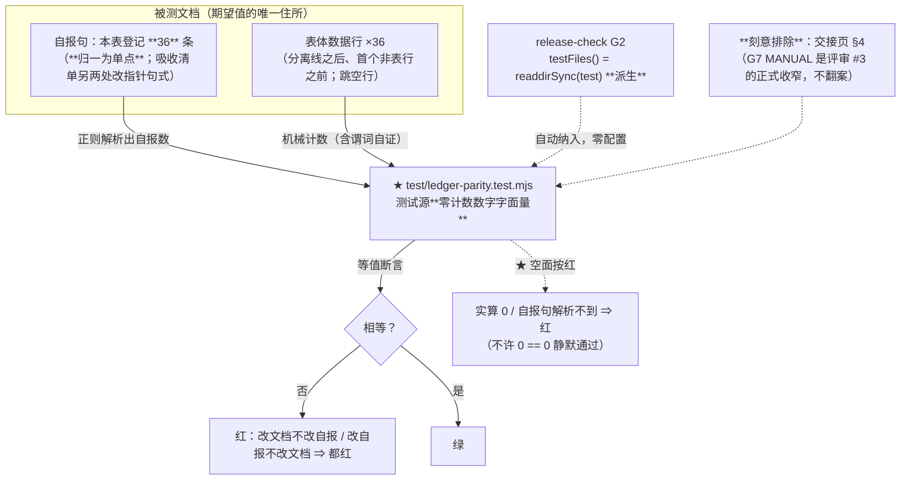
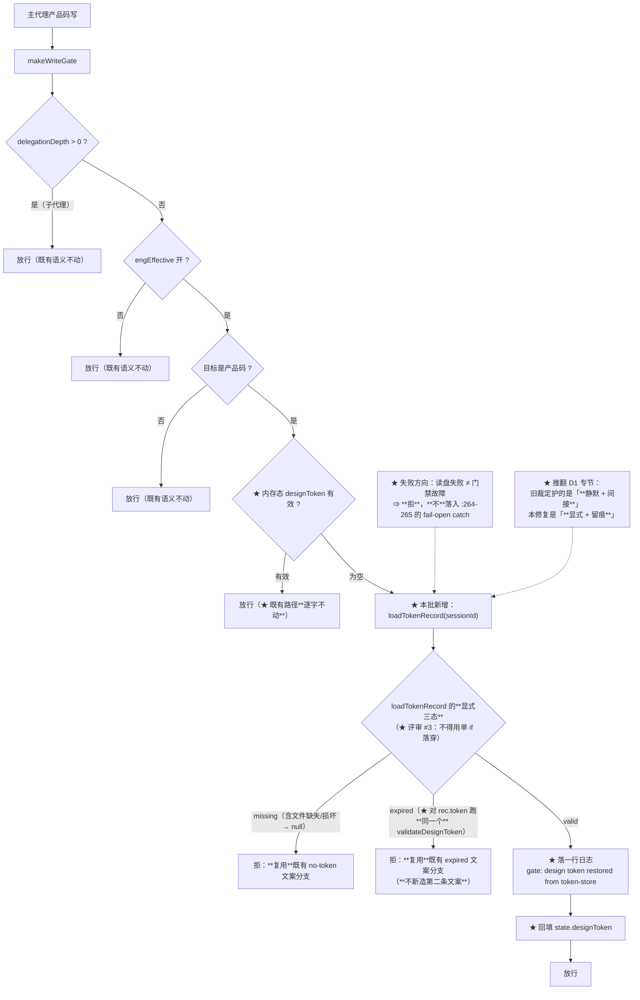

# 设计：台账纪律（可落地版）+ D-31 + D-36 + 文档卫生 —— 批 10

- 日期：2026-09-13
- 需求档：[`2026-09-13-ledger-discipline-requirements.md`](./2026-09-13-ledger-discipline-requirements.md)（14 用户故事 / 8 非功能标准）
- 会诊纪要：[`2026-09-13-ledger-discipline-consult-minutes.md`](./2026-09-13-ledger-discipline-consult-minutes.md)（会诊 id 1，**3/4 交付**；含 15 条父侧实测、五问裁定、三处分歧的父侧裁定）
- 章节：九节（§1 背景 · §2 问题 · §3 目标 · §4 决策与理由 · §5 方案 · §6 机制伪代码 · §7 状态与 schema · §8 防偏离 · §9 边界）+ **§10 推翻 D1 专节** + §11 受影响文件与验收 + §12 变更记录 + §13 评审落档
- 图示：**图 1（计数有据：期望值住在文档里）** / **图 2（门禁读盘的判据与失败方向）**
- 状态：**已实施（批 10）** —— 设计评审**轮次 1 `PASS`**（🔴0 · 🟡6 · 🔵3，修正块见 §12）→ 实施（§11.3 八 stage）→ **2026-09-13 交付核对 + 变异矩阵（AC-Z3）**：全量 `node --test` **449/449**；AC 全 **27 条**与锚 **M1–M15** 逐条有落点与实测（§13.2）；**23 个变异全部致红**，每次逐字节还原并核 SHA-256（§13.3）→ **交付代码评审 `PASS`（🔴0 · 🟡0 · 🔵5）→ 收尾修复轮（本轮：🔵#3 + 🔵#4）已落**（§12 末行；夹具第三次重新基线见 §13.4-⑦）。**本行此前滞后写「设计待评审」（与本档 §12 已记录的 `PASS` 自相矛盾）——2026-09-13 本轮订正**：它正是本批 P6「状态行漂移」的同族，只不过这次漂在本批自己的档上

> ## ⚠️ 行号/位置引用口径（读本档前必读）
>
> 行号为 **as-of 批 9 交付后（`18e0b2c`）** 实测值，会随改动漂移。**定位一律按符号名/标题**：
>
> | 要找什么 | 检索符号 |
> |---|---|
> | 未知顶层键走 notes（D-31 的病根） | `unknownTop` / `ignoring unknown top-level field` |
> | 顶层白名单 | `const topAllowed` |
> | `ok` 的判据 | `return { ok: errors.length === 0, … }` |
> | PUT 写盘顺序（先校验后写） | `if (!v.ok) return send({ ok: false, errors: v.errors }, 400)` |
> | user 层整体替换 | `写入/整体替换 user 层配置` |
> | 门禁拒绝判据（D-36） | `makeWriteGate` 内的 `state.designToken && validateDesignToken` |
> | **D1 的旧注释（本批改写对象）** | `避免有效盘 token 驻留 state 间接打开主代理写门禁` |
> | 令牌盘记录读法 | `loadTokenRecord` |
> | 撤销双清 | `state.designToken = null` 与其同块的 `removeTokenRecord` |
> | G2 派生档清单 | `export function testFiles` |
> | 台账等值锁（T-LC2）的格言 | `档名列与用例数列是**被测事实**` |

---

## §1 背景

本批的四件事表面无关，**病根同一个**：**同一事实存在多个副本，副本各自漂**。

- **计数**在三个地方各写一份：缺陷登记表自称「33 条」而**实测 36 行**；吸收清单自称「43 档」（**三处**：`:1/:33/:82`）而**实测 42 行**。
- **排期**在三处各写一份且互相打架：吸收清单 §2:46 说台账纪律归**批 11**、§6:143 说归**批 10**、§5:126 把它的「机检」**明文列为不吸收**。
- **状态**在**十二处**各写一份（**评审 #6 订正**：初稿写「十处」，而它紧接着的分项就是 9+1+1=11，评审员抓得对——**一个以「自报计数会漂」为立论的批次，自己的计数就是漂的**）：**9** 个文件第 7 行精确写「`- 状态：**设计待评审**`」（批 4/5/6/7/8，**全部已交付**）+ **1** 处括注形态（`context-budget-requirements.md:7`）+ **1** 处地图内嵌（`README.md:30`）+ **1** 处 `PROPOSED`（`token-lifecycle-requirements.md:7`，批 2 已交付，**与地图自相矛盾**）。
- **配置**的「用户意图」与「磁盘内容」可以不一致：一条含未知键的 PUT 会**静默清空整个 user 层配置**却报「已保存」。
- **令牌**有内存与磁盘两份：内存被重启抹掉，而磁盘记录**正是为重启后可查证而设计**（D-30 的清扫规则留过期记录 30 天）——**门禁不消费它才是与设计意图的偏差**。

---

## §2 问题

| # | 问题 | 根因 | 证据 |
|---|---|---|---|
| **P1** | 自报计数会漂且无人抓 | 手写 + 无机器校验 | 33 vs **36** · 43（×3）vs **42** |
| **P2** | 登记项无指针、无触发 | 字段从未定义 | 五面均无此两列 |
| **P3** | 吸收清单三处自相矛盾 | 各自表述 + 无变更手续 | §2:46 / §6:143 / §5:126 |
| **P4** | **配置写盘的静默数据丢失** | 未知顶层键走 `notes` 而非 `errors` | 全未知键 PUT ⇒ 200「已保存」+ **user 层被清空** |
| **P5** | 重启后写门禁纯摩擦 | 门禁只读内存态 | 主代理无法做已批准设计的小修 |
| **P6** | 文档状态行漂移 | 状态手写在**十二处** | 9（第 7 行精确）+ 1（括注）+ 1（地图内嵌）+ 1（`PROPOSED`） |

**靶心 = P1 + P3**（计数与排期的多副本），**P4 是最严重的一条**（数据丢失），**P5/P6 是摩擦与卫生**。

---

## §3 目标

| # | 目标 | 验收面 |
|---|---|---|
| G1 | 自报计数由**机器**验，测试源**零计数数字** | AC-L1…AC-L4 |
| G2 | 登记项**指得出本地可验的落点** + **写明何时重看** | AC-P1…AC-P4 |
| G3 | 吸收清单**三处口径合一**，§6 补手续 | AC-C1…AC-C5 |
| G4 | **静默清盘路径灭绝**，未知键点名报错 | AC-D1…AC-D6 |
| G5 | 重启后可做小修，**且不削弱门禁** | AC-G1…AC-G8 |
| G6 | 全部滞后状态漂移清零 | AC-H1…AC-H2 |

**非目标（一句话）**：本批**不**做老化、**不**做机检三件套、**不**做核销清单、**不**给吸收清单加指针列、**不**机检行号、**不**改整体替换语义、**不**改客户端、**不**做 docHash 门禁化、**不**翻交接页的 G7 MANUAL —— 逐条理由见 §4 与需求档 §5.1。

---

## §4 决策与理由（含否决备选）

| # | 决策 | 理由 / 否决备选 |
|---|---|---|
| **D10-1** | 计数有据 = **测试档唯一落点**（`test/ledger-parity.test.mjs`） | ① B9/AC-P16 把 `lib/` 方向**封死**；② **G2 档清单是 `readdirSync(test)` 派生的**（`testFiles`）⇒ 新档**自动进发布门** ⇒「测试档」与「发布门」**不是二选一而是兼得**；③ 再在 release-check 复刻一条 = **同一谓词两处拷贝**，违批 7「判据单一权威」，且正是批 9 交付评审 🔵#2 刚修过的病 |
| **D10-2** | 断言形态 = **「机械行数 == 文档自报计数」**，两侧**都从文件字节读**；测试源**零计数数字字面量** | **否决**「把 36/42 写进测试」——那就是**又一个手写期望值**，同一个病换了个地方。纪律原文范本 = T-LC2 的格言「档名列与用例数列是**被测事实**，绝不拿来当**别的断言**的期望值」 |
| **D10-3** | **空面按红处理** | 实算 0 / 自报句解析不到 ⇒ 红，**不许 `0 == 0` 静默通过**。先例 = `gateG0` 的「扫描面为空 = 假绿」同律 |
| **D10-4** | 指针 = **可机检的单一引用**；**只机检文件存在** | **否决**机检行号：行号是位置提示不是身份，上方插入即漂 ⇒ **锁它 = 制造必然噪声**（**D-37 的教训正是「把会漂的东西锁成锚」**） |
| **D10-5** | 触发字段 = **闭合四值** + **状态↔触发交叉不变式** | 值域闭合才可机检；**否决**用封闭枚举列「条件」的具体内容——条件天然异质（「下一个碰 codex 面的批次」「条目量出现」），枚举是伪严谨 ⇒ 只锁**存在性**与**值域形态** |
| **D10-6** | **指针列只加在缺陷登记表**；吸收清单 §2 **只加触发列** | **否决**给 §2 加指针列：其指针指向**上游**批次档（`D:\workspace\thincoder\...`），**本地不可验** ⇒ **不可验的指针列比没有更糟**（违「指针不悬空」的本意） |
| **D10-7** | **订正以 §6 为排期权威** | 依据 = `吸收清单:6`「**批次排序、优先级、以及哪些明确不做都以本档为准**」+ `:160`「**排序变更以本档为准**…并在 §6 记一行变更理由」；同族先例 = TEST-LIFECYCLE（§2 记批 10、§6 记批 9、**实际按 §6 交付**） |
| **D10-8** | **机检以 §5 收口，不放松 §5** | §2 删去「机检」后，§5:126 与 §2 的冲突**自然消解**——**改的是写错的那一处，不是立场**。这是「当一条闸的谓词与它的意图不等价时，修的是谓词」（批 7 第④律）在**文档面**的应用 |
| **D10-9** | **D-31 取报错**：未知顶层键 → `errors` → `ok:false` → **HTTP 400** → **不写盘** | **决定性理由 1（一致性）**：**嵌套未知键今天就是报错**（`{advisor:{nope:1}}` → `ok:false`，三处测试在案）⇒ 顶层是全函数**唯一的例外分支**；本修复**不是引入新严格性，而是恢复函数自身的一致性**。**决定性理由 2（严重度）**：报错在 `if (!v.ok) return 400` 处即返回、**在写盘之前** ⇒ **同时消灭「静默清空整个 user 层配置」这条数据丢失路径**。**否决回显**（200 + dropped 列表）：它只把「静默丢」变「响亮丢」——字段照样不落盘、且因整体替换从**磁盘消失**；D-31 的伤害是「**丢 + 报成功**」，回显只治后一半 |
| **D10-10** | 加一条**客户端 ⊆ 服务端白名单**的一致性锁 | 报错的唯一顾虑是「若客户端能产出服务端不认的键 ⇒ 设置页死锁」。**用一条锁消除它，而不是用回显回避它**：断言 `draftToPayload` 可产出的顶层键 **⊆** `topAllowed`，**两侧都从源码字面解析**（测试读两文件字节，**不手写清单**），含「解析器今天确实解析出 ≥N 键」的自证段。任一侧将来加键忘同步 ⇒ 红 |
| **D10-11** | U3c（**基线档**断言）走 **`AP_TEST_AUTHORIZED` 授权通道** | 该档在基线 `2e6ca8b` 内 ⇒ 受 **T-AP9** 保护。数组所在档**非**基线档 ⇒ 改它不触发锚 B（批 9 对 `codex-runner.test.mjs` 的 D1 先例已证此通道）。**这不是障碍，这正是 T-AP9 存在的意义** |
| **D10-12** | **`saveUserConfig` 整体替换语义不改** | 报错后未知键在**校验层**即被 400 拦下，**磁盘永不接触它** ⇒「被丢键从磁盘消失」的路径已封死。**否决改 merge**：full-state PUT 下「删除一个键」正是靠**在新全量中缺席**表达；改 merge 会让设置页**无法清空任何字段**（被清的可选键 merge 后复活）——**把一个缺陷换成另一个**，且引入「如何显式删键」的新语义面 = 为不存在的问题扩面 |
| **D10-13** | **D-36 = 明显的翻案**，须设专节 + 同步改写注释 | D1 收窄防的是「盘 token 经 `eng_coder` **静默**驻留 state、**间接**打开主门禁」。门禁显式读盘**终态相同、路径不同**。**不设专节则下一轮分歧审计会把本修复当回归抓出来**（`eng.mjs` 注释与新行为矛盾 = doc-code drift，交付评审必查） |
| **D10-14** | **docHash 不进门禁判据** | 今天**内存路径也不查** docHash ⇒ 盘路径查会造成**两路径判据不一**（那才是真的不一致）。「文档被改后令牌是否应失效」是**另一个命题**；若做须**两路径同做**，否则严格性取决于「是否重启过」= **怪激励** ⇒ 另立批次，本批写进「已知边界」**防下批误认为遗漏** |
| **D10-15** | 门禁读盘的失败方向 = **拒** | `loadTokenRecord` 的 fail-safe（缺失/损坏 → `null`）⇒ 按**无记录拒绝**。**注意层级**：这**不是**门禁 `:264-265` 自身故障的 fail-open catch——**读盘失败 ≠ 门禁故障** |
| **D10-16** | **交接页 §4 不加列**，只成文化「引用登记表条目只用 ID」 | 它是 `release-check` G7 的 **MANUAL 人眼闸**，且那是**评审 #3 的正式收窄**（「活页、编号会漂、无机器契约」）⇒ **本批不翻案**；指针与触发的**家都在登记表**，交接页不复制 |

---

## §5 方案

### §5.1 计数有据：期望值住在文档里（图 1）



**读图要点**：**测试里没有数字**。期望值（自报句）与实算值（表体行数）**都从文档字节读**——想放水就得改文档，而改文档会立刻被另一边抓住。**G2 的档清单是派生的**，所以新档自动进发布门、**不需要在 release-check 里再写一遍**。

### §5.2 门禁读盘的判据与失败方向（图 2）



**读图要点**：**内存路径逐字不动**（`MEM → PASS3`）；新增的只是一条**内存为空时**的回退腿，且它的判据与内存腿**同构**。失败方向**全部朝拒绝**。

---

## §6 机制伪代码

### §6.1 计数有据（`test/ledger-parity.test.mjs`）

```js
// ★ 本档源码内**不得出现任何计数数字字面量**（36/42/33/43 全禁）——可 grep 自验。
// 纪律原文范本：test/test-lifecycle.test.mjs 的格言「档名列与用例数列是**被测事实**，
// 绝不拿来当**别的断言**的期望值」。

/** 数出表体数据行：分隔线之后 → 首个非表行之前；跳空行。 */
function countTableRows(md) { /* 实现须带**谓词自证**：能区分表头/分隔线/空行 */ }

/** 解析文档的自报计数（句式锚；**解析不到 ⇒ 抛/红**，不得返回 0）。 */
function parseSelfReportedCount(md, pattern) { /* … */ }

test("计数有据：缺陷登记表的自报计数 == 机械行数", () => {
  const md = readFileSync(REGISTRY, "utf8")
  const self = parseSelfReportedCount(md, /本表登记\s*\**(\d+)\**\s*条/)
  assert.equal(self, countTableRows(md), "自报计数与实测行数不符——改文档不改自报 / 反之，都会红")
})

test("计数有据：吸收清单 §2 的自报档数 == 机械行数（**全部自报点**）", () => {
  // 吸收清单原有三处自报（:1/:33/:82）⇒ **归一为单一权威句**，其余两处改指针句式；
  // 本断言遍历**所有**自报句出现处，防「留一处没归一」
  // ★ 评审 #8：句式与正则必须钉死，不能留给实现者猜。
  //   **归一后的自报句形态**（唯一权威句，留在 :1 的定位行）：
  //       - 定位：本档是**吸收面单一事实源**；**共 42 档**（批次排序以 §6 为准）。
  //   **正则**：/共\s*(\d+)\s*档/
  //   **另两处（:33 / :82）**改为指针句式：`（档数见定位行——本档自报计数单点）`
  //   ⇒ 断言：全档 `共 N 档` 形态**恰出现 1 次**（>1 即未归一 ⇒ 红），且其 N == 机械行数。
})

// 谓词自证（**防空面假绿**）：构造含表头/分隔线/空行的样例，断言计数器只数真数据行。
// 并可 **grep 自验**：本文件内不出现计数数字字面量。
```

**结构性断言（用户裁定 J10-11 = 加）**：

```js
test("指针不悬空：登记表每行的指针列 ∈ {可解析且文件存在, —}", …)
test("触发必填：非终态行（非 已修/不立项/已交付）必须有触发字段，且命中闭合四值", …)
```

### §6.2 D-31 的改动点

```js
// lib/index.mjs —— unknownTop 由 notes 改入 errors（镜像**嵌套分支的既有形态**）
const unknownTop = Object.keys(userConfig).filter((k) => !topAllowed.includes(k))
for (const k of unknownTop) {
  errors.push(JSON.stringify(k) + " is not a supported top-level field (user-layer whitelist: "
    + topAllowed.join("|") + ")")
}
// ⇒ :360 的 `ok: errors.length === 0` 自然为 false ⇒ :682 的 `if (!v.ok) return 400` 拦下 ⇒ **不写盘**
// （顶层是唯一例外分支：嵌套未知键**今天就是报错**，见 context-budget.test.mjs）
```

**白名单一致性锁（D10-10）**：从 `lib/client.js` 的 `draftToPayload` 与 `lib/index.mjs` 的 `topAllowed` **各解析出键集合**，断言**前者 ⊆ 后者**，并含「两侧各解析出 ≥N 键」的自证段。

### §6.3 D-36 的门禁回退腿

```js
// lib/eng.mjs —— makeWriteGate 内，`if (state.designToken && validateDesignToken(...)) return next()` 之后、
// 拒绝之前，插入回退腿。★ 六条件逐条对应（见 D10-14/15 与纪要 §2-⑤）。
//
// ★ 评审 #3 的订正：初稿写成单 `if` 落穿（`if (rec && valid) {…} // 否则落到既有拒绝分支`），
//   而既有拒绝分支在 `state.designToken === null` 时只会吐 **no-token** 文案 ⇒ **过期盘记录
//   会得到「没有令牌」而不是「令牌已过期」**，与 AC-G2 要求的两分支文案矛盾。
//   ⇒ 必须**显式三态路由**（下面用 `diskState` 显式接线到既有的两个拒绝分支）。
const diskState = (() => {                      // (a) 仅内存态为空时读盘；(c) 按本会话 sessionId
  if (state.designToken) return null            //   —— 内存态有效时**根本不读盘**（f：内存路径逐字不动）
  const rec = loadTokenRecord(agent.session.id, storPathOverride, agent.session?.header?.cwd)
  if (!rec) return "missing"                    // 文件缺失/损坏 → null（loadTokenRecord 的 fail-safe）
  // ★ **收尾轮 · 交付评审 🔵#4 订正**（父侧裁定 = 方案①「非空但形状不可解析 ⇒ 路由为 missing」）：
  //   原写法 `validateDesignToken(rec.token) ? "valid" : "expired"` 把**一切**校验失败都归 "expired"，
  //   而 `tokenExpiryMs(畸形串)` 为 null ⇒ `gateExpired` 为假 ⇒ 渲染的却是 **no-token 文案**
  //   （**态与文案不符**）；第二段恰可解析为**过去时间戳**的畸形串更会渲染**假的**「expired at …」。
  //   ⇒ 失败原因取**单一权威** `designTokenFailureReason`（token 形状知识不在 eng.mjs 复制第二份）：
  return validateDesignToken(rec.token)
    ? "valid"
    : (designTokenFailureReason(rec.token) === "expired" ? "expired" : "missing")  // (b) 判据与内存路径**完全同构**
})()

if (diskState === "valid") {
  const rec = loadTokenRecord(agent.session.id, storPathOverride, agent.session?.header?.cwd)
  state.designToken = rec.token                 // (e) 回填（避免每次写操作重复读盘）
  console.warn("[thincoder-suite] gate: design token restored from token-store (session "
    + agent.session.id + ", expires " + new Date(rec.expiresAt).toISOString() + ")")  // (d) 留痕
  return next()
}
// ★ 三态各自接线到**既有的对应拒绝分支**（文案不新造）：
//   "valid"   → 已在上面放行（不落到此处）
//   "expired" → 走既有的 expired 文案分支（gateExpired 为真那一路）
//   "missing" → 走既有的 no-token 文案分支
//   null（内存态本就有 token）→ 与本批之前**逐字相同**的行为
```

**★ 实现要点（评审 #3）**：`gateExpired` 目前由内存态推出；回退腿必须让「盘上记录过期」也**置起等价的判定输入**，使 `:257-261` 的 expired 文案**原样复用**——**不新造第二条文案**。若实现时发现既有分支结构无法复用，**如实上报**而不是另写一句。

**★ 同一改动必须同步改写 `eng.mjs` 的 D1 注释**（否则注释与新行为矛盾 = doc-code drift）。

### §6.4 吸收清单的订正（**八处** + 手续）

> **★ 评审 #1 的订正**：初稿只列六处，**漏掉了 AC-P3 所要求的两个实现条目**（§2 加触发列、§5 散文收编）——真按初稿的清单做，**AC-P3 必然落空**。这正是交接页 §6-②「**改了引用点，却没改被引用的副本**」那一族的现成复现：裁定（D10-6）与 AC（AC-P3）都写了，**实现清单里没有**。

| # | 位置 | 动作 |
|---|---|---|
| 1 | §2:46 | 建议批次 `批 11 → 批 10`；内容 → 「台账纪律（可落地版：计数有据 + 指针/触发字段）」；**删**「老化」「机检」；**删**跨档计数引用 |
| 2 | §6:143 | 改写为**实际四件**；**废除「核销清单」** |
| 3 | §6 | **新增批 11 行** = D1–D7 文档纪律（**实现时须全量对账 §2 建议批次列的批 11 行**，不能假设只有两处）。**批 11 摸底结果（回填）**：§2 命中**恰 3 条**（`:39` ENGINEERING-MODE / `:40` ENG-DESIGNER / `:57` DOC-HYGIENE）——本批初稿把此处写成「4 条」，是**把 POOL-LEDGER 改挂批 10 之前的旧真值当作现在时属性**（第 12 次自报计数漂移） |
| 4 | §6 | **新增变更理由行**（形态照 §6 批 6 行既有先例「…追加（…按 §7 规则记理由）」） |
| 5 | §5 | **新增「老化」不吸收条**（带条件触发）；**§5:126 一字不改** |
| **6a** | **§2 表** | **★ 加「触发」列（42 行逐行填充）**：已吸收闭环行填 `—（已闭环）`；未吸收/待评估行填 `条件：<可判定谓词>`。**不加指针列**（D10-6：其指针指向上游档、本地不可验）。**落实 AC-P3** |
| **6b** | **§5 各条** | **★ 把已有的散文触发收编为句式**：`永不（<理由>）` 或 `条件：<可判定谓词>`（如 §5:126 的「待条目量或并行架构出现再评估」→ `条件：条目量使人工巡检失效 或 并行架构出现`）。**改的只是散文→句式，`§5:126` 的立场一字不改**。**落实 AC-P3** |
| 7 | 计数 | 登记表 `:4` 33 → **36** + 已修枚举**补 D-35** + 批 10 组成写全；吸收清单三处 43 → **42** 并**归一**（归一后句式与正则见 §6.1）；交接页 `:22` 补文档卫生 |

---

## §7 状态与 schema

| 面 | 变更 | 说明 |
|---|---|---|
| `test/ledger-parity.test.mjs` | **新增** | 计数有据（零数字字面量）+ 指针不悬空 + 触发必填；**空面按红** |
| `lib/index.mjs` | 修改（**小幅**） | `unknownTop` 由 `notes` 改入 `errors`（一行循环体） |
| `lib/eng.mjs` | 修改 | 门禁回退腿 + **`storPathOverride` 可选第二参测试缝（向后兼容）** + **D1 注释同步改写** |
| `test/config-api.test.mjs` | 修改（**基线档，走授权**） | U3c 期望值翻转 |
| `test/death-provenance.test.mjs` | 修改 | `AP_TEST_AUTHORIZED` 加 `test/config-api.test.mjs`（+ 理由与裁定引用） |
| `test/guard-e.test.mjs` | 修改 | T-E19 登记新测试档 |
| `docs/test-lifecycle.md` | 修改 | §三 加新档行（**否则本仓自家的台账锁会红**）+ §七 变更记录 |
| `docs/2026-09-05-defect-registry.md` | 修改 | 计数订正 + 已修枚举补 D-35 + **加指针/触发两列（36 行逐行填充）** + D-31 现象描述订正 |
| `docs/2026-09-12-absorption-inventory.md` | 修改 | §2:46 / §6:143 / §6 新增两行 / §5 新增一条 / 计数归一 |
| `docs/2026-09-13-handoff.md` | 修改 | §4 状态更新 + 批 10 行补文档卫生 + ID 引用约定 |
| `docs/README.md` | 修改 | 地图内嵌滞后状态行订正 + **新档与批 10 三份档登记** |
| **十二处**滞后状态行所在档 | 修改 | **枚举（评审 #6/#7）**：① `context-budget-design.md:7` ② `context-budget-requirements.md:7`（**括注形态**）③ `design-review-guard-design.md:7` ④ `design-review-guard-requirements.md:7` ⑤ `death-diagnosability-design.md:7` ⑥ `death-diagnosability-requirements.md:7` ⑦ `portability-design.md:7` ⑧ `portability-requirements.md:7` ⑨ `prompt-common-design.md:7` ⑩ `prompt-common-requirements.md:7` ⑪ `docs/README.md:30`（地图内嵌）⑫ `token-lifecycle-requirements.md:7`（`PROPOSED`） |
| `release-check.mjs` | **零 diff** | N-2：新档经 G2 派生清单**自动纳入** |
| `lib/client.js` | **零 diff** | 400 走既有 `errors` 渲染路径 |

---

## §8 防偏离

### §8.1 零改面（验收拒收项）

| # | 面 | 判据 |
|---|---|---|
| 1 | **`release-check.mjs`** | 零 diff |
| 2 | **`lib/client.js`** | 零 diff |
| 3 | **`saveUserConfig` 的整体替换语义** | 零改动（`config-store.mjs:204` 逐字不变） |
| 4 | **门禁的内存路径** | 零改动（内存有 token 时行为逐字不变） |
| 5 | **`lib/**` 内的检查器** | `check-doc-width` / `check-ledger` 命中仍为 0 |
| 6 | **交接页 §4 结构** | 零列变更 |
| 7 | **`absorption-inventory` §5:126** | 一字不改 |
| 8 | **`package.json` 依赖** | 键集合不变 |

### §8.2 机验锚（防静默退化 —— **律 1：谓词写全三件事**）

| # | 锚 | 谓词 |
|---|---|---|
| **M1** | 计数有据 | 「机械行数 == 自报计数」覆盖登记表 ×1 + 吸收清单的**全部**自报点；**测试源零计数数字字面量**（grep 自验） |
| **M2** | 空面按红 | 实算 0 / 自报句解析不到 ⇒ 红（构造空样例自证） |
| **M3** | 谓词自证 | 计数器能区分真数据行 vs 表头/分隔线/空行（正负样例对照） |
| **M4** | 指针不悬空 | 登记表每行指针 ∈ {可解析且**文件存在**, `—`} |
| **M5** | 触发必填 | 非终态行必有触发且命中闭合四值；`待修` 行不得为 `永不` |
| **M6** | 白名单一致 | `draftToPayload` 键集 **⊆** `topAllowed`；两侧各解析出 ≥N 键（自证） |
| **M7** | 静默清盘灭绝 | 全未知键 PUT ⇒ 400 **且磁盘字节不变**（前后快照比对）——**独立回归锚** |
| **M8** | 未知键点名 | 400 的 `errors` 含**每个**未知键名 + 白名单提示 |
| **M9** | 门禁回退 | 空内存 + 有效盘记录 ⇒ 放行 + 已回填 + **有日志**；过期/无记录/他会话 ⇒ 拒 |
| **M10** | **撤销后重启仍拒** | 撤销 ⇒ 盘记录不存在 ⇒ 模拟重启 ⇒ 拒（**「不削弱门禁」论证的落点**） |
| **M11** | 读盘失败方向 | 文件损坏/缺失 ⇒ **拒**（不 fail-open）；门禁 `:264-265` 语义不动 |
| **M12** | 内存路径零变 | **内存路径首检逐字未动 + 三态路由仅在内存态为空时可达**（`test/eng-token-fallback.test.mjs` T-TF5 + 结构核对）。**★ 批 10 分歧审计 #3 订正**：原文写「内存有 token 时行为逐字不变（**既有测试全绿即证**）」——那份既有测试**恰恰为了保持绿而被改写**（`test/guard-e.test.mjs` 的 `WRITE_GATE_FIXTURE` 随 D-36 **重新基线**，见 §13.4-⑦）⇒ 该取证形态**支撑不住**，**不再援引**。变异见 §13.3-M12（**两条守卫同时打开**才致红，与该行谓词逐字对应） |
| **M13** | D1 注释同步 | `eng.mjs` 内不再出现旧注释字面；设计档有专节 |
| **M14** | 登记制 | 新测试档在 §三 与 T-E19 均登记（含理由与裁定引用） |
| **M15** | 基线档授权 | `AP_TEST_AUTHORIZED` 含 `test/config-api.test.mjs`；**反证**：摘除 ⇒ T-AP9 红（唯一）⇒ 还原 |

---

## §9 边界

| # | 边界 | 行为 | 理由 |
|---|---|---|---|
| 1 | **自报句式被改写** | 测试**失败**（不跳过、不返回 0） | D10-3：空面按红 |
| 2 | **文档行数含空行** | 计数器**跳过**空行（登记表 `:40` 就有空行） | 否则恒红 |
| 3 | **指针指向文档节而非文件** | 允许 `docs/<档>.md §<n>` 形态 | 词法已定义 |
| 4 | **行号漂移** | **不机检** | D10-4（D-37 教训） |
| 5 | **`fetchJson` 对非 2xx 的处理** | 若它不透传 body，设置页显示**通用**错误文案 | **记录在案的可接受行为**（设置页自身产不出未知键）；实现时验证并写进设计档已知边界 |
| 6 | **`{config:{}}` 有意清空** | **仍 200 且盘为空配置** | 「删除键靠缺席表达」的语义**不受损**（D10-12） |
| 7 | **门禁读盘与 `:264-265` 的关系** | 读盘失败**不**落入该 catch | D10-15：读盘失败 ≠ 门禁故障 |
| 8 | **docHash 门禁化** | **本批不做**，写进「已知边界」 | D10-14：防下批误认为遗漏 |
| 9 | **会话恢复为新的 sessionId** | 记录不命中 ⇒ 拒 | 失效方向安全（已写入 D-36 论证的前提声明） |
| 10 | **交接页 §4** | 不加列、不加机检 | D10-16：G7 MANUAL 是正式收窄 |
| 11 | **指针侧的耦合律不机检**（纪要 §2-② 的「`已定位` ⇒ 指针必填」「`已修` ⇒ 指针 = CHANGELOG 版本锚」） | 本批**只机检**「指针可解析且文件存在 **或** 恰为 `—`」（M4）与**触发侧**不变式（M5）；**指针侧的「状态↔指针必填」刻意不机检** | **★ 评审 #9 要求明示**：需求档只锁了触发侧（US-3/US-4/J10-3）⇒ 这是**刻意排除**不是遗漏。理由：36 行里存在「已修但证据纯 prose、指不出文件落点」的历史行，**强加该不变式会首跑即红**，而那属于**内容补全**（另立批次）而非机械可判 |
| 12 | **`WRITE_GATE_FIXTURE`（`test/guard-e.test.mjs`，锚 A2/T-E17）的锁定面 = `makeWriteGate` 函数体**全文含注释**** | 函数体**任何**字节改动（**含只改注释**）⇒ A2 红 ⇒ **必须重新基线**（本批已发生**三次**：① D-36 的**代码**改动；② 收尾轮 · 分歧审计 #8 的**注释**订正；③ 收尾轮 · 交付评审 🔵#4 的**代码 + 注释**改动） | **★ 已知维护代价（收尾轮留痕，父侧裁定）**：该锁锁的是**字节**，注释也在锁面内——这是一条**真实的维护代价**，不是缺陷。**将来的可选方向 = 缩小锁面（只锁可执行行、注释不入锁）**——**本批不做**（改锁面 = 改锚强度，须另立批次评审；且它会同时削弱「注释与代码同步」这条副产物） |

> **★ 本行已被批 12 supersede（supersession 注，2026-09-15 追加）**：上方第 12 行的**行为列与理由列按原样保留、不改写**（历史落檔不回填——D12-11）。
> **批 12 已处置该方向**：交付档 = `docs/2026-09-15-lock-narrowing-design.md`（`WRITE_GATE_FIXTURE` 锁面收窄）。
> 收窄后的边界（**取代本行「行为」列的口径**）：锁定面 = `makeWriteGate` 函数体的**归一态 = 可执行行**（`normalizeExec` = 剥离器 → 逐行 `rtrim` → 丢空行，`test/guard-e.test.mjs`）⇒ **注释层（文字 / 位置 / 行数 / 缩进）完全自由**，改注释**不再**需要重新基线；可执行行的字节与顺序**仍逐字节锁**。
> 四个一行守卫（顺序锁 / 域自检 / 合并签名正则 / 夹具幂等自检）承载收窄后仍不放松的部分；**接受的代价**（注释脱节无锚捕获，权威 = 设计档 + 评审）登记为该设计档 §9 边界-1 / 边界-2。

---

## §10「推翻 D1」专节（**交付评审与下轮审计的必读项**）

**旧裁定原文**（`lib/eng.mjs` 注释，逐字）：

> 「回填收窄为「传入 token === 盘上记录 token」（**分歧审计 D1**）：错 token 不回填——避免有效盘 token 驻留 state 间接打开主代理写门禁；过期记录经 token 全等仍进三态 expired。」

**D1 当时护的是什么**：**不经持票人同意的隐式能力提升**——盘上有有效 token，只要有人调一次带该 token 的 `eng_coder`，有效 token 就**静默**驻留进 `state`，从而**间接**打开主代理写门禁。

**本批为什么改**（三层论证见纪要 §2-⑤）：
1. **信任边界**：盘与内存在本威胁模型内**权威等价**（能伪造盘记录者已坐拥 `$DSH_HOME`）；令牌是**工作流门禁**不是密码学屏障。
2. **纪律不变式**：门禁要守的是「**本会话**有过一次通过的设计评审且未过期」——**重启是会话恢复（同 sessionId）**，内存被抹掉**不改变这个事实**；且 D-30 本就指定 token-store 为持久事实源。
3. **★能力边界不存在**：`eng_coder` 的回填路径**已经在**——主代理本来就能读盘 token、带原值调用、触发回填、打开门禁（**只多一次往返**）⇒ **内存态不是能力边界，只是摩擦**。

**本修如何回应 D1 的原始关切**：
- 「**静默**」→ **落一行日志**（`gate: design token restored from token-store (…)`）⇒ **可审计性高于现状**；
- 「**间接**」→ 门禁**自己显式读盘**，且经本批设计评审与用户批准的**明示语义**；
- 「**错 token 不回填**」这条**不变**（本修不碰 `eng_coder` 的回填收窄）。

**★ 必须同步**：`eng.mjs` 的该注释**改写**（注明本批翻案、理由、以及「显式 + 留痕」）。**否则注释与新行为矛盾 = doc-code drift**。

---

## §11 受影响文件全清单与验收

### §11.1 实施域（eng-coder 写域）

| 文件 | 改动 | 类型 |
|---|---|---|
| `test/ledger-parity.test.mjs` | **新增**：计数有据（零数字字面量）+ 指针不悬空 + 触发必填；**空面按红**。**★ 批 10 分歧审计 #9 订正**：初稿此处写「**宿主文件唯一**：M1–M6 全在此档」，**自相矛盾**——**M6（客户端 ⊆ 服务端白名单）的宿主是 `test/config-api.test.mjs`**（见本表下方 config-api 行与 §13.2）。实况：**M1–M5 在此档，M6 在 `config-api`** | **新增** |
| `test/config-api.test.mjs` | 修改（**基线档，走授权**） | U3c 期望值翻转 + **D10-10 白名单一致性锁落此档**（**交付代码评审 #2**：初稿此处在 §11.1 表内重复登记了同一档两行 ⇒ 已合并为单行） |
| `lib/index.mjs` | 修改：`unknownTop` 由 notes 改入 errors（**一处循环体**） | 修改 |
| `lib/eng.mjs` | 修改：**门禁回退腿 + `storPathOverride` 测试缝（可选第二参，向后兼容）** + **D1 注释同步改写**。**★ 评审 #2**：测试缝必须写进改动描述，否则「重启后读盘」无法在测试里模拟 | 修改 |
| `test/eng-token-fallback.test.mjs` | **★ 新增（评审 #2 点名）**：D-36 三态（有效⇒放行+回填+日志 / 过期⇒拒 expired 文案 / 无记录·他会话⇒拒 no-token 文案）+ 撤销后重启仍拒 + 读盘失败⇒拒 + 内存路径零变。**须入 §三 与 T-E19** | **新增** |
| `test/death-provenance.test.mjs` | 修改：`AP_TEST_AUTHORIZED` 加一行 + 理由 | 修改（授权） |
| `test/guard-e.test.mjs` | 修改：T-E19 登记**两个**新档 | 修改（授权） |
| `docs/test-lifecycle.md` | 修改：§三 加**两行** + §七 记录 | 修改 |
| `docs/2026-09-05-defect-registry.md` | 修改：计数 + 枚举 + **加两列（36 行）** + D-31 描述 | 修改 |
| `docs/2026-09-12-absorption-inventory.md` | 修改：§2:46 / §6:143 / §6 两行 / §5 一条 / 计数 / **§2 加触发列 / §5 散文收编**（**八处**，见 §6.4） | 修改 |
| `docs/2026-09-13-handoff.md` | 修改：§4 状态 + 批 10 行 + ID 约定 | 修改 |
| `docs/README.md` | 修改：状态行 + 批 10 登记 | 修改 |
| 十二处滞后状态行所在档 | 修改：状态行订正（枚举见 §7） | 修改 |

**零 diff**：`release-check.mjs` · `lib/client.js` · `package.json` · `config-store.mjs`（整体替换语义）。

### §11.2 用例与验收标准

| # | 验收标准 | 形态 |
|---|---|---|
| **AC-L1** | 新档断言「机械行数 == 自报计数」覆盖登记表 ×1 + 吸收清单**全部**自报点 | **核心** |
| **AC-L2** | **测试源零计数数字字面量**（grep 自验通过） | **核心** |
| **AC-L3** | 空面按红：实算 0 / 自报句解析不到 ⇒ 红（附自证） | 核心 |
| **AC-L4** | 谓词自证：计数器能区分真数据行 vs 表头/分隔线/空行（正负对照） | 防退化 |
| **AC-P1** | 登记表加**指针列**且 36 行逐行填充；非 `—` 者文件**存在** | **核心** |
| **AC-P2** | 登记表加**触发列**；非终态行命中闭合四值；`待修` 行不得 `永不` | **核心** |
| **AC-P3** | 吸收清单 §2 加**触发列**；§5 各条触发句式收编 | 核心 |
| **AC-C1** | §2:46 / §6:143 / §5 / 登记表 `:4` / 交接页 `:22` 口径**逐字一致** | **核心** |
| **AC-C2** | §6 含**变更理由行**（先例格式）+ **批 11 行**（含全量对账证据） | **核心** |
| **AC-C3** | 「核销清单」全仓清零；「老化」仅存于 §5 新条与变更记录 | 核心 |
| **AC-D1** | 含未知键的 PUT ⇒ **400** + `errors` 点名 + **盘字节不变** | **核心** |
| **AC-D2** | 全未知键 ⇒ 400 且**既有配置原样保留**（**静默清盘灭绝**，独立锚） | **核心** |
| **AC-D3** | 全已知键 PUT ⇒ 行为逐字不变；`{config:{}}` ⇒ 200 且盘为空配置 | 零回归 |
| **AC-D4** | 嵌套未知键报错行为不变（两分支契约同形） | 零回归 |
| **AC-D5** | 白名单一致性锁落地；变异自证（任一侧加键 ⇒ 红） | **核心** |
| **AC-D6** | U3c 经授权通道重写；**反证**：摘除授权行 ⇒ T-AP9 红（唯一） | **核心** |
| **AC-G1** | 空内存 + 有效盘记录 + 产品码写 ⇒ **放行** + 已回填 + **有日志** | **核心** |
| **AC-G2** | 过期 ⇒ 拒（文案 expired）；无记录/他会话 ⇒ 拒（文案 no-token）。**★ 收尾轮 · 交付评审 🔵#4 补明**（父侧裁定 = 方案①）：盘记录 `token` **非空但形状不可解析**（畸形串 / 旧版式 / `expiresAt` 段不可解析）⇒ **拒且文案 no-token**——**只有「真过期」才说「过期」**（判据 = `designTokenFailureReason`），落点 = `test/eng-token-fallback.test.mjs` T-TF4 的新增腿 | **核心** |
| **AC-G3** | **撤销后重启仍拒**（不削弱论证的落点） | **核心** |
| **AC-G4** | 读盘失败（损坏/缺失）⇒ 拒（不 fail-open）。**★ 收尾轮 · 🔵#4 补明**：**记录存在但 token 形状不可解析**同属「这枚凭证不可用」⇒ 拒（归 AC-G2 的 no-token 文案分支，非「读盘失败」） | **核心** |
| **AC-G5** | 内存路径零行为变更（既有测试全绿） | 零回归 |
| **AC-G6** | D1 注释已改写；设计档有专节 | 核心 |
| **AC-H1** | **全部滞后状态行订正**且与 CHANGELOG 事实一致。**评审 #6 订正**：初稿把此处**写死为「10 处」**（且与自身分项不符）⇒ 改为**计数无关**的表述，并给**可枚举的判据**：全仓 grep `设计待评审` / `PROPOSED`，**除变更记录表里的首版日期标注外**，不得残留任何与 CHANGELOG 已交付事实相矛盾的形态（枚举见 §7 十二处） | 核心 |
| **AC-H2** | `docs/README.md` 登记批 10 三份档 | 零回归 |
| **AC-Z1** | **两个**新测试档在 §三 与 T-E19 **均**登记（含理由与裁定引用）——`test/ledger-parity.test.mjs` 与 `test/eng-token-fallback.test.mjs` | 零回归 |
| **AC-Z3** | **交付附变异矩阵，覆盖 M1–M15 全部新断言**（每条至少一个可致红的变异；还原后逐字节核验）。**评审 #4 补**：N-6 此前只散落在 AC-L4 / AC-D5 / M15，没有一条 AC 要求矩阵**覆盖全部**新断言 | **核心** |
| **AC-Z2** | 全量 `node --test` 全绿（基线 **434** + 新增） | 收口 |

### §11.3 建议 stages（给 eng_coder）

| stage | goal | 检查 |
|---|---|---|
| 1 | `test/ledger-parity.test.mjs` 计数有据（**先跑应红**——登记表与吸收清单今天就是错的） | `node --test test/ledger-parity.test.mjs` |
| 2 | 订正两面计数 + 吸收清单六处（§2:46 / §6:143 / §6 两行 / §5 一条 / 归一） | 同档转绿 |
| 3 | 登记表加指针/触发两列（36 行逐行）+ 指针/触发两条结构断言 | 同档绿 |
| 4 | D-31：`unknownTop` 改入 errors + 白名单一致性锁 | `node --test test/config-api.test.mjs`（U3c 此时应红 ⇒ 进 stage 5） |
| 5 | U3c 重写 + `AP_TEST_AUTHORIZED` 登记 + **反证实验** | `node --test test/death-provenance.test.mjs` + 全量 |
| 6 | D-36 门禁回退腿（**显式三态路由**）+ **`storPathOverride` 测试缝** + **D1 注释改写** + `test/eng-token-fallback.test.mjs` 三态测试 | **★ 评审 #2**：本 stage **不得只跑 `node --check`**（那只证语法）⇒ check = `node --test test/eng-token-fallback.test.mjs` |
| 7 | **全部滞后状态行**订正（枚举见 §7 十二处）+ 交接页 + `docs/README.md` 登记 | 读档核对 |
| 8 | **两个**新档入 §三 + T-E19；收口全量 + 锚 M1–M15 + **变异矩阵覆盖全部新断言（AC-Z3）** | `node --test` |

---

## §12 变更记录

| 日期 | 变更 |
|---|---|
| 2026-09-13 | 首版（设计待评审）：会诊 id 1 **3/4 交付** → 九节 + §10（推翻 D1 专节）+ 图 1/图 2；D10-1…D10-16；US-1…US-14；AC-L/P/C/D/G/H/Z；锚 M1–M15；§11.3 八 stage。五项用户裁定已落（含 J10-11 结构性断言 = 加） |
| 2026-09-13 | **设计评审轮次 1（`VERDICT: PASS`，🔴0 · 🟡6 · 🔵3，job `advisor-dsh-10`）修正块**。评审员的第一句评语值得逐字记：**「好几条意见恰恰落在本批要消灭的那类缺陷里（自报计数与枚举漂移）」**。九条全修：**#1** AC-P3 的「§2 加触发列 + §5 散文收编」在 §6.4/§7/§11.1 三处**实现清单里没有对应条目**（真按 §11.1 做会漏掉 AC-P3）⇒ 三处同补两行——**正是交接页 §6-②「改了引用点却没改被引用的副本」那一族的现成复现**；**#2** 两处必需的测试**没有指定落点文件**（D10-10 白名单一致性锁、D-36 三态测试 + `storPathOverride` 测试缝）⇒ §7/§11.1 点名宿主文件并把缝写进 eng.mjs 改动描述，stage 6 补行为检查；**#3** §6.3 伪代码**产不出 AC-G2 要求的「过期 vs 无记录」两种不同文案**（单 `if` 落穿到 no-token 分支）⇒ 显式给出三态路由；**#4** N-6（变异矩阵）**没有一条 AC 承载**⇒ 新增 AC-Z3（矩阵覆盖 M1–M15 全部）；**#5** 设计档**自身自述漂移**（表头把 §10 写成「受影响文件」而正文 §10 是推翻 D1 专节；§12 自称「AC 共 24 条」而实列 26）⇒ 均订正；**#6** **「十处」与自己紧接着的分项 9+1+1=11 不符**（纪要另计括注形态 ⇒ 12）⇒ **全文订正为十二处并给逐条枚举**，AC-H1 改为**计数无关表述**——**一个以「自报计数会漂」为立论的批次，自己的计数就是漂的，这条最该记**；**#7** 9 个滞后档**从未被点名**⇒ §7 给十二处逐条枚举，stage 7 变机械；**#8** 吸收清单的**归一后句式与 43→42 正则未钉死**⇒ §6.1/§6.4 补明；**#9** 纪要的指针侧耦合律**未机检**且设计未声明这是**刻意排除**⇒ §9 补一条边界，防下轮审计当遗漏读。AC 共 **27 条**（L4/P3/C3/D6/G6/H2/Z3） |
| 2026-09-13 | **批 10 分歧审计修复轮收尾（本轮，父侧派单；上一轮 `eng-dsh-8` 交 4 passed + 1 skipped——skipped 的原因 = 父侧给的自证前提错了，且改动会连带夹具，故停止上报，属正确动作）**：① **`lib/eng.mjs` 回退腿注释改写**（`:257-264`）——承重层订正为**内层**（`loadTokenRecord` 自身 fail-safe）、外层 `catch` = **第二层纯防御**（本实现走不到、非装饰、方向与下方 fail-open 相反），并**逐字同步** `test/guard-e.test.mjs` 的 `WRITE_GATE_FIXTURE` 那 4 行 ⇒ 夹具**第二次**重新基线（**代码零改**，本轮**显式自白**——审计 #3 的病灶正是第一次未自白）。**实测**：删内层 fail-safe ⇒ **11 条用例转红**（无第二层的调用点）/本门禁内差异 = 0；只改注释不同步夹具 ⇒ A2 红；函数体注入一行 ⇒ 仅 T-E17 红。**★ 该实测推翻了审计 #8 与父侧原先的「外层 `catch` 承载 fail-closed」**；② **§13.4 标题去计数**（「三处」→ 与表体无关的表述；表内实为 ①–⑦ **七条**）——**本会话第 9 次「自报计数漂移」命中，且仍发生在本批自己的档里**；③ **§13.2 的 AC-G5 行**补「**代码结构事实**」半句 + 行为面变异指向 M12（与已订正的 T-TF5 标题同口径）；④ **§9 新增边界-12**：`WRITE_GATE_FIXTURE` 锁定面含注释的**维护代价** + 「缩小锁面（只锁可执行行）」列为**将来**可选方向（**本批不做**）。**零改面复核**：`release-check.mjs` / `lib/client.js` / `lib/config-store.mjs` / `package.json` **四者 `git diff` 为空**；基线 10 档仍只 `test/config-api.test.mjs` 被改；测试源 `lib/token-store.mjs` 仅在自证实验中临时变异并**逐字节还原（SHA-256 `8D4A745B…` 前后相同）** |
| 2026-09-13 | **交付核对轮（前序轮，父侧派单）**：不改实现，只做「核对完整性 + 补变异矩阵 + 出正式报告」。① **AC 全 27 条 + 锚 M1–M15 逐条核对有落点**（表见 §13.2）；② **变异矩阵 23 条全部致红**、逐字节还原并核 SHA-256（§13.3），含 M7 的**旧态复现证据**（旧行为下 PUT **200「已保存」**而盘被清成 `{"version":1,"config":{}}`）；③ **本档与需求档的状态行订正**（此前仍写「设计待评审」，见本档表头状态行）；④ 三处**AC 措辞与设计正文张力**如实登记（§13.4，均已按设计正文/零改面验收面收口，无实现缺口）。**运行态数字**：全量 `node --test` **449/449**（= 基线 434 + 新档 13 + `config-api` 新增 2）；台账 19 档逐档用例数与实测逐档相符 |
| 2026-09-13 | **交付代码评审（`VERDICT: PASS`，🔴0 · 🟡0 · 🔵5）后的收尾修复轮（本轮：只做 🔵#3 与 🔵#4）**：**🔵#4**——§6.3 伪代码的 `validateDesignToken(rec.token) ? "valid" : "expired"` 在**本档自身**留下了「态与文案不符」的残留（`token` 非空但形状不可解析 ⇒ 盘态 `expired` 而渲染的是 no-token 文案；第二段恰可解析为过去时间戳的畸形串更会渲染**假的**「expired at …」）⇒ `makeWriteGate` 的 `diskState` 第三态改为**只有「真过期」才归 `expired`**、形状不可解析一律路由 `missing`（失败原因取 `advisor.mjs` 的单一权威 `designTokenFailureReason`，token 形状知识不在 `eng.mjs` 复制第二份），复用既有 no-token 文案、**拒绝方向不变**；`test/eng-token-fallback.test.mjs` 的 **T-TF4 增补一条腿**（4 个合成形态，其中「第二段 = 过去的毫秒时间戳」的两例是**致红腿**）。**变异自证**：把该分支改回「一律 expired」⇒ T-TF4 红（实测 1 fail · 其余 6 绿），逐字节还原并核 SHA-256。**🔵#3**——`test/guard-e.test.mjs` T-E19 的**断言消息**去掉会漂的自报枚举（「既有 11 档 + 批 7/8/9 各批登记档」→ **计数无关**表述），**并同族去掉用例标题里的「11 既有」**；**数组本体与断言逻辑零改动**。**夹具第三次重新基线**（`WRITE_GATE_FIXTURE`：本轮是**代码 + 注释**改动——见 §13.4-⑦ 与 §9 边界-12）。**运行态**：全量 `node --test` **449/449**；**无新增顶层用例**——T-TF4 内增腿 ⇒ `test/eng-token-fallback.test.mjs` 顶层 `test(` 计数仍 **7**，与 `docs/test-lifecycle.md` §三 台账逐档相符（新增顶层用例会连带台账用例数列，属另一条授权面） |

---

## §13 评审落档

### §13.1 设计评审轮次 1 落点

**轮次 1 = `VERDICT: PASS`**（🔴0 · 🟡6 · 🔵3，job `advisor-dsh-10`）。九条意见（#1–#9）的逐条修正已落在 §12 的第二行，并被本轮**逐条回读核对**：`§6.4`/`§7`/`§11.1` 三处的 AC-P3 实现条目（#1）、两处测试宿主文件与 `storPathOverride` 测试缝（#2）、`§6.3` 显式三态路由（#3）、AC-Z3（#4）、自述漂移订正（#5）、「十二处」枚举（#6）、stage 7 机械枚举（#7）、归一后句式与 `/共\s*(\d+)\s*档/` 正则钉死（#8）、§9-11「指针侧耦合律刻意不机检」（#9）——**逐条在档、逐条有实现对应物**（#1→T-LP6 / #2→`test/config-api.test.mjs` + `test/eng-token-fallback.test.mjs` + `makeWriteGate` 第二参 / #3→`lib/eng.mjs` 的 `diskState` 三态 / #4→§13.3 / #5·#6·#7→档面 / #8→T-LP2 / #9→T-LP4 的「只机检文件存在」）。

### §13.2 分歧审计与交付代码评审落点（**2026-09-13 交付核对轮**）

**运行态**：全量 `node --test` **449/449 pass · 0 fail**（19 档；逐档用例数与 `docs/test-lifecycle.md` §三**逐档相符**，见下）。

**AC 全 27 条**（落点 → 实测）：

| AC | 落点 | 实测 |
|---|---|---|
| AC-L1 | `test/ledger-parity.test.mjs` T-LP1/T-LP2 | ✅ 登记表 ×1 + 吸收清单**单点自报**（`共 N 档` 恰 1 处）；变异 M1a/M1b/M1d 均红 |
| AC-L2 | 同档 T-LP3 末段（字符码拼装 + 正则） | ✅ 独立 grep `(?:^\|\D)(?:36\|42\|33\|43)(?:\D\|$)` 命中 **0**；变异 M1c 红 |
| AC-L3 | 同档 T-LP3 的空面段 | ✅ 无数据行 / 无表格 / 无标题 / 自报句解析不到 ⇒ 抛；变异 M2/M2b 红 |
| AC-L4 | 同档 T-LP3 正负对照 + T-LP5 末尾自证段 | ✅ 表头/分隔线/空行/表后行均不计（3 行样例）；变异 M3 红 |
| AC-P1 | `docs/2026-09-05-defect-registry.md` 指针列（36 行）+ T-LP4 | ✅ 9 列齐、非 `—` 者文件均存在、非全列为 `—`；变异 M4/M4b 红 |
| AC-P2 | 同档触发列（36 行）+ T-LP5 | ✅ 闭合四值 + 非终态不得裸 `—` + `待修` 不得 `永不`；变异 M5a/M5b 红 |
| AC-P3 | `docs/2026-09-12-absorption-inventory.md` §2 触发列（42 行，无指针列）+ §5 收编 + T-LP6 | ✅ 42 行逐行命中闭合四值、表头无「指针」；变异见 §13.4-② |
| AC-C1 | 登记表 `:4` · 吸收清单 §2/§5/§6 · 交接页 `:22` | ✅ 四处口径一致（「台账纪律（可落地版：计数有据 + 指针/触发字段）」+ D-31 + D-36 + 文档卫生） |
| AC-C2 | 吸收清单 §6 批 10 行（含**变更理由行**）+ **批 11 行** | ✅ 理由行含「按 §7 规则记理由」+ 全量对账（批 11 命中 4 条） |
| AC-C3 | 全仓 grep | ⚠️ 见 §13.4-① |
| AC-D1 | `test/config-api.test.mjs` T-D31①② | ✅ 400 + errors 点名 + **盘字节前后快照相等**；变异 M7/M8 红 |
| AC-D2 | 同档 T-D31① | ✅ 全未知键 ⇒ 400 且既有配置原样保留；**旧态复现**见 §13.3-M7 |
| AC-D3 | 同档 T-D31③④ + U3c 尾部 | ✅ 全已知键 ⇒ 200 且落盘；`{config:{}}` ⇒ 200 且盘为空配置 |
| AC-D4 | `test/context-budget.test.mjs:534` · `test/config-api.test.mjs:245` · `test/path-kind.test.mjs:469` | ✅ 嵌套未知键报错行为不变（两分支契约同形） |
| AC-D5 | `test/config-api.test.mjs` U3c2 | ✅ `draftToPayload` 键集 ⊆ `topAllowed`（两侧源码字面解析 + 各 ≥5 键自证）；变异 M6/M6b 红 |
| AC-D6 | `test/death-provenance.test.mjs` `AP_TEST_AUTHORIZED` | ✅ 含 `test/config-api.test.mjs`（含理由与 D10-11/J10-6 引用）；**反证**：摘除 ⇒ T-AP9 红（唯一）——变异 M15 |
| AC-G1 | `test/eng-token-fallback.test.mjs` T-TF1 | ✅ 放行 + 回填 + 有日志（且二次调用零新增告警）；变异 M9 红 |
| AC-G2 | 同档 T-TF2 | ✅ 过期 ⇒ `expired at` 文案；无记录/他会话 ⇒ `no design token` 文案（**不落穿**） |
| AC-G3 | 同档 T-TF3 | ✅ 撤销（内存置空 + `removeTokenRecord`）后模拟重启 ⇒ 仍拒 |
| AC-G4 | 同档 T-TF4 | ✅ 损坏 / `tokens` 畸形 / 记录非对象 / 路径不可解析 ⇒ 全拒；变异 M11 红 |
| AC-G5 | 同档 T-TF5 + `lib/eng.mjs` 结构核对（读盘守卫 `if (!state.designToken)` 与 `diskState` 门） | ✅ **代码结构事实**（源码字面）：内存有令牌时根本不读盘、不回填、零日志；**行为面变异见 M12** |
| AC-G6 | 同档 T-TF7 + 本档 §10 | ✅ `eng.mjs` 旧注释字面零残留 + 「翻案说明」在位 + 指向本档 §10；变异 M13 红 |
| AC-H1 | 十二处滞后状态行 | ✅ 全仓 grep `设计待评审`/`PROPOSED` 余项**仅**落在变更记录表的首版标注（列出：context-budget-design:454 / death-diagnosability-design:297 / design-review-guard-design:371 / guard-e-design:458 / guard-e-requirements:138 / portability-design:528 / portability-requirements:142 / prompt-common-design:424 / prompt-common-requirements:126 / test-lifecycle-design:438 / test-lifecycle-requirements:138）——均属 AC-H1 明文豁免形态；**本批两档自身的状态行由本轮补正**（§13.4-③） |
| AC-H2 | `docs/README.md` 地图 | ✅ 批 10 三份档（会诊纪要 / 需求 / 设计）均已登记 |
| AC-Z1 | `docs/test-lifecycle.md` §三 + `test/guard-e.test.mjs` T-E19 | ✅ 两档均在册（含理由与裁定引用）；变异 M14a/M14b 红 |
| AC-Z2 | 全量 `node --test` | ✅ **449/449**（基线 434 + 新增 15） |
| AC-Z3 | §13.3 变异矩阵 | ✅ **23 个变异 · 23 红 · 23 次 SHA-256 还原核验通过** |

**锚 M1–M15**（谓词 → 宿主人 → 变异）：M1→T-LP1/T-LP2/T-LP3（M1a/b/c/d）· M2→T-LP3（M2）· M3→T-LP3（M3）· M4→T-LP4（M4/M4b）· M5→T-LP5（M5a/M5b）· M6→U3c2（M6/M6b）· M7→T-D31（M7 + 探针）· M8→T-D31①（M8）· M9→T-TF1/T-TF2（M9）· M10→T-TF3（M10）· M11→T-TF4（M11）· M12→T-TF5（M12）· M13→T-TF7 + 本档 §10（M13）· M14→T-E19 + 台账 §三（M14a/M14b）· M15→T-AP9（M15）。

**零改面复核**：`release-check.mjs` / `lib/client.js` / `lib/config-store.mjs` / `package.json` **四者 `git diff` 为空**；`lib/**` 内 `check-doc-width` / `check-ledger` 命中 **0**；基线 10 档（`2e6ca8b` 时点：advisor-config / codex-runner / config-api / consult / context-budget / design-review-guard / preset-static / session-state / stages / truncation）中**只有 `test/config-api.test.mjs` 被改**（走 D10-11 授权通道）。

### §13.3 变异矩阵（AC-Z3 · 23 条 · 全部致红 · 全部 SHA-256 还原核验通过）

> 口径：变异值**取自实现/配置的真实形态**（文档自报句、表体单元格、源码语句），**不取自断言自己的写法**；还原用**内存字节**回写（node 显式 utf8），前后各核 SHA-256。

| # | 锚 | 变异（文件） | 目标用例 | 结果 |
|---|---|---|---|---|
| M1a | M1 | 登记表自报句 `**36**` → `**35**`（doc） | T-LP1 | 红 5/1 |
| M1b | M1 | 吸收清单 `共 42 档` → `共 43 档`（doc） | T-LP2 | 红 5/1 |
| M1c | M1/AC-L2 | 测试源植入 `EXPECTED_REGISTRY_ROWS = 36` | T-LP3 | 红 5/1 |
| M1d | M1/AC-L1 | §2 标题再写一处 `共 42 档`（未归一为单点） | T-LP2 | 红 5/1 |
| M2 | M2 | 删 `rows.length === 0` 空面守卫 | T-LP3 | 红 5/1 |
| M2b | M2/AC-L3 | 登记表自报句整句删成「本表无自报计数」（解析不到） | T-LP1 | 红 5/1 |
| M3 | M3 | 计数起点 `head + 2` → `head`（把表头/分隔线计进去） | T-LP3（并连同 6 例） | 红 0/6 |
| M4 | M4 | D-23 指针 `CHANGELOG [0.8.0]` → `lib/does-not-exist.mjs` | T-LP4 | 红 5/1 |
| M4b | M4 | 指针列**整列**刷成 `—`（36 行） | T-LP4（`located > 0` 腿） | 红 5/1 |
| M5a | M5 | D-32 触发 `永不（…）` → `等等看` | T-LP5 | 红 5/1 |
| M5b | M5 | D-32 状态 `—` → `待修`（触发仍 `永不`） | T-LP5 | 红 5/1 |
| M6 | M6 | `client.js` `draftToPayload` 内加 `config.reviewBudgetMs = 1000` | U3c2 | 红 23/1 |
| M6b | M6 | `index.mjs` `const topAllowed = [` 换行（解析器自证腿） | U3c2 | 红 23/1 |
| M7 | M7/M8 | `unknownTop` 由 `errors` 退回 `notes`（**旧态**） | U3c + T-D31 | 红 22/2 |
| M8 | M8 | 报错串**去掉键名**（保留白名单提示） | U3c + T-D31 | 红 22/2 |
| M9 | M9 | 删掉 valid 分支的 `return await next()` | T-TF1/T-TF3/T-TF6 | 红 4/3 |
| M10 | M10 | `missing` 态改成 `"valid"` | T-TF2/T-TF3/T-TF4 | 红 4/3 |
| M11 | M11 | `loadTokenRecord` 受损时**返回伪记录**（fail-open） | T-TF2/T-TF4 | 红 5/2 |
| M12 | M12 | 去掉「仅内存态为空才读盘」+ `diskState` 去门 | T-TF5 | 红 6/1 |
| M13 | M13 | `eng.mjs` 重新植入旧注释字面 | T-TF7 | 红 6/1 |
| M14a | M14 | T-E19 摘除 `eng-token-fallback.test.mjs` | T-E19 | 红 23/1 |
| M14b | M14 | 台账 §三 行名改成 `ledger-parity-GONE.test.mjs` | T-LC1/T-LC2/T-LC4 | 红 3/3 |
| M15 | M15 | `AP_TEST_AUTHORIZED` 摘除 `test/config-api.test.mjs` | T-AP9（**唯一**） | 红 17/1 |

**★ M7 的「先复现旧态」直接证据**（不经断言，直接经 `makeApiHandler` 发一次全未知键 PUT，探针脚本）：

- **新契约（现状）**：`status = 400`，`errors` 逐个点名 `bogusField` / `anotherBogus`，盘字节**前后完全相同**，`loadUserConfig` 仍是种子配置。
- **旧态（M7 变异下）**：`status = 200`，`{"ok":true,"user":{},"notes":[…]}` —— 盘从种子配置 `{"version":1,"config":{"advisor":…,"engCoderMaxTokens":65536}}` **变成 `{"version":1,"config":{}}`**，`loadUserConfig` 返回 `{}`。⇒ **「200「已保存」+ 整个 user 层被清空」这条数据丢失路径被本批事实性封死**，M7 是其独立回归锚。

**矩阵覆盖声明（律 3 反恒真）**：M1–M15 **每个锚至少一个致红变异**，且两条**自证腿**各有专属变异——M4 的「指针列不得整列为 `—`」= **M4b**（刷空整列），AC-L3 的「自报句解析不到 ⇒ 抛」= **M2b**（整句删掉），「空面 ⇒ 抛」= **M2**，「未归一（多处）⇒ 抛」= **M1d**。**未发现任何恒真锁**。

### §13.4 如实自白的张力与偏离（**无实现缺口；下列各条均为设计档内部措辞张力 / 授权改动留痕**）

| # | 事项 | 实况 | 裁定依据 |
|---|---|---|---|
| ① | **AC-C3 的字面**（「核销清单」全仓清零；「老化」仅存 §5 新条与变更记录） | **★ 批 10 分歧审计 #4 订正**：初稿写「「核销清单」全仓剩 **1 处**、「老化」出现 **4 处**」——**实测全仓为 12 处与 22 处**（含本批自己的五份档：纪要 / 设计 / 需求 / 吸收清单 / README）。残留处**全都是本批对这两个词的正当讨论**（含 AC-C2 要求的那行「已废除」变更理由行） | 论证分量不受影响（残留均为记录性讨论、非立场残留），**被否掉的只是「全仓」这个作用域与那两个数字**——**又是一次自报计数漂移，且发生在自述里**。收口按 §6.4；**无实现缺口** |
| ② | **AC-P3 的「§5 各条触发句式收编」** 与 **D10-8 / §8.1-7「§5:126 一字不改」** | §5 第 1–6 条已加闭合句式前缀（`永不（…）`），**第 7 条（= §5:126，POOL-LEDGER 机检三件套）一字未改**，并按 §6.4-6b 的「表述纪律」按语说明理由 | §8.1 是**验收拒收项**（零 diff 面）且 §6.4-#5 与 D10-8 三处同判「一字不改」；§6.4-6b 括注里拿 §5:126 当收编示例**与前三处自相矛盾** ⇒ 按三处多数 + 零改面验收收口；**无实现缺口** |
| ③ | **本批两档自身的状态行** | 本轮开始前：设计档 `:8` 与需求档 `:7` 仍写「状态：**设计待评审**」，而设计档 §12 已记录轮次 1 `PASS`、实现也已在工作树 | 与本批 P6 同族且**就长在本批自己的档上**（AC-H1 的枚举写在批 10 文档诞生之前，故未覆盖它）⇒ **本轮订正**（设计档表头已改；需求档同步） |
| ④ | **N-7 的字面**（「新测试档不读 config / session / token」） | `test/eng-token-fallback.test.mjs` 必须经 `token-store` 构造三态，但其头部契约是「零网络 / 零真实 LLM / **不读真 config·session 盘**」——`DSH_HOME=""` + `storPathOverride` 指向 `mkdtempSync` 临时目录 | 与 §11.1 点名该档为 D-36 三态宿主**不可两全**；按「不读**真实**盘」收口（更具体的 §11.1 优先）；**无实现缺口** |
| ⑤ | **`test/path-kind.test.mjs` 的 T-PK8 切片起点改动**（**批准写域之外**） | 该档非基线 10 档（`2e6ca8b` 时点不存在），但其改动**不在本批设计 §11.1 的实施域清单里**。改动仅 1 行 + 1 段注释：`srcSlice` 起点由 `export function makeWriteGate(getConfigDefault) {` 改为 `export function makeWriteGate(` | **必要性**：D-36 给 `makeWriteGate` 加了**可选第二参**（§7/§6.3 明文要求），旧起点字面已不存在 ⇒ 不改则 T-PK8 的切片定位**必然失败**（假红）。**锚强度论证**：T-PK8 断言的是**函数体内**的三件事（`isProductCode(target)` 调用行逐字存在 / `eng.mjs` 仍导出 `isProductCode` / 薄转发指向单一权威 `path-kind.mjs`），**签名不参与其中任何一条**；`indexOf` 取首个 `export function makeWriteGate(`，与旧写法的唯一差别是「不把签名写死」。⇒ **强度未削弱**，反而**去掉了「合法扩参即误红」的耦合**（D-37 同族教训：锚不该锁会合法漂移的东西）。**更强的写法已存在于同批**：`test/guard-e.test.mjs` 的 `WRITE_GATE_FIXTURE` 才是 `makeWriteGate` 函数体的**逐字节**权威锁（本批已随之**重新基线**并注明理由），T-PK8 只承担「绑定仍可解析」这一较轻的角色——**两档分工明确、无重叠浪费** |
| ⑥ | **`docs/2026-09-13-handoff.md` 的自报测试数滞后**（本轮发现） | `:22`/`:54`/`:114` 三处原写 **447/447**（「基线 434 + 本批 13」），实测 **449** | 差额 = `config-api.test.mjs` 的 **+2**（U3c2 + T-D31）被漏计。**这正是本批要治的「自报计数会漂」**，而交接页**按 D10-1 刻意排除在计数有据闸之外**（G7 MANUAL 面）⇒ 无机器抓。**★ 状态订正（批 10 分歧审计 #10）**：初稿此格写「本轮发现，**未改**」——但**父侧已在本轮改掉**（三处 447 → 449，并在 §3-6 注明「本档是刻意的人眼闸、不进机检面，故靠人工同步」）⇒ 该「未改」已过期，**§13 不得留与交付树不符的声明** |
| **⑦** | **★ 未自白的第 7 处偏离（批 10 分歧审计 #3 挖出）：`test/guard-e.test.mjs` 的 `WRITE_GATE_FIXTURE` 被重新基线** | §11.1 只授权「T-E19 登记**两个**新档」，而实际 diff = **+59/−11**：其中约 **9 行**是 T-E19 登记，**约 50 行是 fixture 重写**（新增 D-36 块、`makeWriteGate(getConfigDefault, storPathOverride)`、引号风格行）+ **A2 切片起点改写**（`indexOf("export function makeWriteGate(getConfigDefault) {")` → `indexOf("export function makeWriteGate(")`）+ A2 消息改写。§13.4 原来只列 6 条、且第 ⑤ 条只覆盖 `test/path-kind.test.mjs` 的 T-PK8 —— **同一类改动发生在元锁档里，却没进偏离清单**（只在代码注释里披露） | **必要性**：`WRITE_GATE_FIXTURE` 是 `makeWriteGate` 函数体的**逐字节**锁（T-PK2/A2），D-36 改了函数体 ⇒ **fixture 必须重新基线**，否则元锁必红。**无害性经独立验证**：审计员确认 fixture == 当前函数体、断言通过，且**注入一行到函数体 ⇒ `guard-e` 红**（锁仍是活的）。**真正的缺陷是两件**：① **未在交付报告里自白**（只在注释里）；② **§8.2 的 M12 自称「内存有 token 时行为逐字不变（既有测试全绿即证）」是一句支撑不住的取证形态**——那份既有测试**恰恰为了保持绿而被改写**。⇒ 本格补记，并订正 M12 的取证表述为「**内存路径首检逐字未动 + 三态路由仅在内存态为空时可达**（`test/eng-token-fallback.test.mjs` T-TF5 + 结构核对）」，**不再援引「既有测试全绿」**。**★ 第二次重新基线（收尾轮，本轮显式自白）**：本轮把回退腿上的 **4 行注释**改写为「**承重层 = 内层**」并**逐字同步**这 4 行夹具 ⇒ 夹具**第二次**重新基线（**代码零改**）；审计 #3 的病灶是「第一次未自白」⇒ 本次**显式自白**（`§12` + 本格 + `WRITE_GATE_FIXTURE` 头部注释三处留痕）。**实测证据（本轮）**：① **删掉内层 fail-safe ⇒ 11 条用例转红**（宿主 = 无第二层的调用点，如 `eng_coder` 的读盘路径），**本门禁内差异 = 0**（`catch` 同样归零到 `null`，故 T-TF2/T-TF4 仍绿）——**这推翻了审计 #8 与父侧原先认为的「外层 `catch` 承载 fail-closed」：真承重层是 `loadTokenRecord` 自身的内层 fail-safe**；② 只改注释而不同步夹具 ⇒ A2 红；③ 函数体注入一行 ⇒ **仅 T-E17 红**（锁仍是活的）。**★ 第三次重新基线（收尾轮 · 交付代码评审 🔵#4 的修复，本轮显式自白）**：本轮改的是 `diskState` 的**第三态**——**代码改动**（`validateDesignToken(…) ? "valid" : "expired"` → 「形状不可解析一律路由 `missing`」，失败原因取单一权威 `designTokenFailureReason`）**+ 其上方 9 行注释** ⇒ 夹具**第三次**重新基线（**前两次为代码 / 注释，本次为代码 + 注释**）。**实测（本轮）**：① 夹具同步后 A2 逐字节等值腿绿（`guard-e` **24/24**）；② 函数体注入一行 ⇒ **仅 T-E17 红**（23/24，锁仍是活的）；③ **不同步夹具 ⇒ A2 红**——本轮 stage 2 的自查即如此先红（夹具与函数体的耦合是**必然**的，非偶发）。**留痕三处**：`WRITE_GATE_FIXTURE` 头部注释 + 本格 + §12。已知维护代价见 §9 边界-12 |

