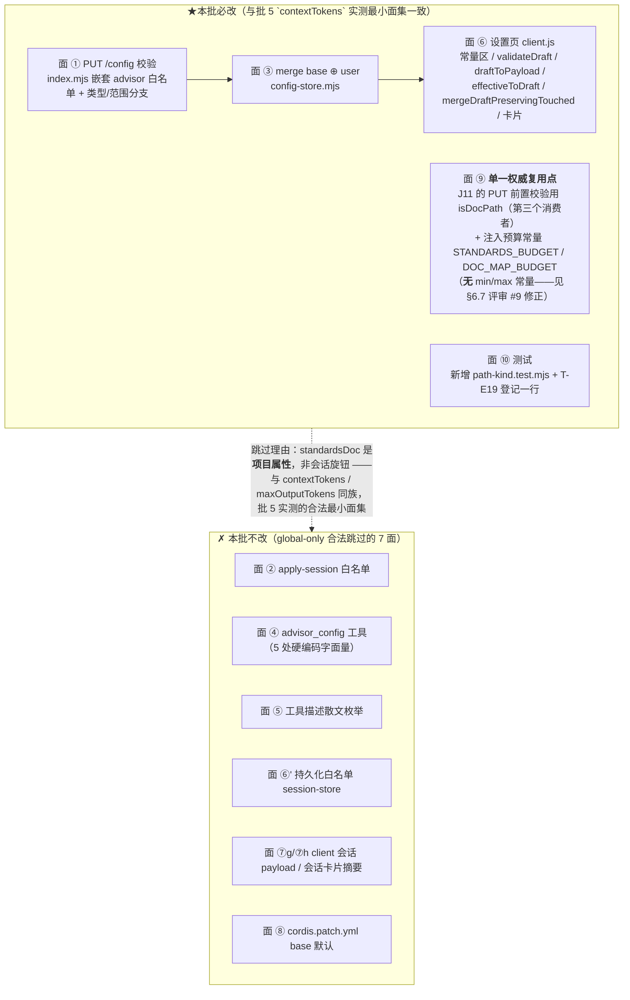
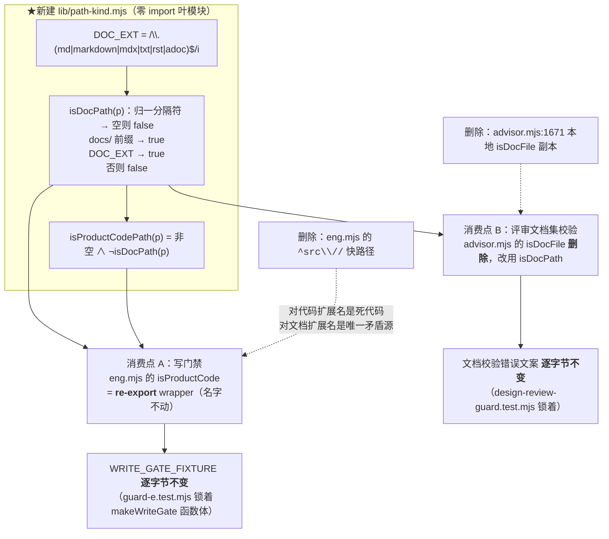

# 设计：可移植性三件（METHODOLOGY 退役 + 产品提示词去本仓指涉 + 判据单一权威）—— 批 7

- 日期：2026-09-13
- 需求档：[`2026-09-13-portability-requirements.md`](./2026-09-13-portability-requirements.md)（9 用户故事 / 7 非功能标准）
- 会诊纪要：[`2026-09-13-portability-consult-minutes.md`](./2026-09-13-portability-consult-minutes.md)（会诊 id 2，**4/4 交付**；含父侧前提纠错四条、形式化定性、J1–J9 裁定、R-5…R-8 登记）
- 章节：九节（§1 背景 · §2 问题 · §3 目标 · §4 决策与理由 · §5 方案 · §6 机制伪代码 · §7 状态与 schema · §8 防偏离 · §9 边界）+ §10 受影响文件与验收 + §11 变更记录；图示：**图 1（配置七面与 `standardsDoc` 的最小面集）** / **图 2（判据单一权威与调用点迁移）**
- 状态：**已实施（v0.15.0）** —— 批 7 已交付（设计评审 轮次 1 `FAIL`（🔴5）→ 轮次 2 `PASS` → 实施 → 独立分歧审计 🔴1 🟡2 🔵2 → 修复轮 → 交付代码评审 `PASS`（🔵2）→ 收尾修复轮；全量 `node --test` **399/399**）。**本行此前滞后写「设计待评审」，2026-09-13 批 10 文档卫生订正**

> ## ⚠️ 行号引用口径（读本档前必读）
>
> 行号为 **as-of 批 6b 交付后（`d1914aa` / v0.14.0）** 实测值，会随改动漂移。**定位一律按符号名**：
>
> | 要找什么 | 检索符号 |
> |---|---|
> | 判定「是否文档」的唯一权威（**本批新建**） | `lib/path-kind.mjs` / `isDocPath` |
> | 写门禁用的产品代码判据（**本批变为 wrapper**） | `export function isProductCode` |
> | 写门禁本体（**逐字节冻结，不得动**） | `export function makeWriteGate` |
> | 评审文档集校验用的文档判据（**本批删除本地副本**） | `function isDocFile` |
> | 文档校验的错误文案（**逐字节不动**） | `Advisor: design review documents must be in docs/ directory or be recognized doc files. Invalid: ` |
> | 标准文档注入器（**本批重写**） | `function injectMethology` |
> | 地图注入器（**本批重写**） | `function injectDocumentMap` |
> | 注入调用点（design round1 / code round1） | `injectMethology(guideRoot, cwd, parts, engineering)` 的两处调用 |
> | 硬要求句 / 六维判据 | `Read every document in the Documents to Review list` / `Review against:` |
> | `advisor_config` 的路径白名单（**5 处硬编码字面量**） | `"includeProjectGuide"`（`coerceValue` / set 门 / 拆分 / 写 / reset 门） |
> | 配置七面 | 见 §5 图 1 |
> | T-E19 测试档清单闸 | `测试档清单 = 既有 11 档 + 本批唯一新增档` |
> | 写门禁字节夹具（**不得动**） | `WRITE_GATE_FIXTURE` |

---

## §1 背景

本插件是从上游 thincoder **移植**来的。移植期的合理妥协是「把上游的工程约定直接写进产品提示词」——最典型的是把 **`METHODOLOGY.md` 这个名字**当成「项目标准」的同义词写死在 19 处提示词与注入器里。

后果是**可移植性**：插件装到一个**没有** `METHODOLOGY.md` 的仓里时，评审员被命令「Read METHODOLOGY.md」而那个文件不存在；注入器试图整段读它、失败后**静默跳过**。更糟的是本仓自己的地图注入器 `injectDocumentMap` 读的是 `docs/design/README.md`——**本仓没有这个路径**（地图在 `docs/README.md`），所以它**今天恒不生效**，而且没人发现。

这正是吸收清单 §4 陷阱 #5 记的那条反转：**上游把 `METHODOLOGY.md` 从产品提示词里退役了**，我方**没跟**（19 处）。

同时，另有一条**同族**的可移植性缺陷：「这个路径是文档还是代码」被实现了两遍（写门禁一份、评审校验一份），两份各有盲区——**任务书里我自己都把它描述错了**（见纪要 §1 四条纠错），而描述错误恰恰证明这两份判据的形状不直观、不可靠。

---

## §2 问题

| # | 问题 | 根因 | 证据（符号） |
|---|---|---|---|
| **P1** | `METHODOLOGY.md` 写死在产品提示词（19 处） | 把「项目标准」等同于某个**具体文件名** | `advisor-msgs.mjs` ×8 · `advisor-design.md` ×2 · `engineering.md` ×9 |
| **P2** | **注入器静默失效**（今日恒不生效） | 写死路径 `docs/design/README.md`（本仓不存在）+ 静默 `catch` | `injectDocumentMap`；`lib/**` 内该路径零消费 |
| **P3** | 上游悬空名被当成本仓文件 | `engineering.md:198` 枚举 `ENGINEERING-MODE.md` | 根目录实测无该文件 |
| **P4** | 判据两份矛盾副本 | 「是文档还是代码」实现两遍 | `isProductCode` vs `isDocFile`；唯一矛盾类 `¬D∧S∧E` |
| **P5** | `^src/` 死锚制造唯一矛盾 | 快路径在扩展名判定之前 | `src/README.md`：门禁拦 ∧ 评审接受 |
| **P6** | 锚定短路自相矛盾 | 结果依嵌套深度而变 | `src/README.md` 拦 / `packages/app/src/README.md` 不拦 |
| **P7** | 退役会造新静默洞 | 注入门挂在 `engineering` 模式上 | `if (!engineering) return` |

**P2 是本批的方法论核心**：「写死具体路径 + 静默 catch」= **功能死掉而无人察觉**的缺陷物种。故本批的声明键机制**必须带显式降级句**（J4），否则只是把一个静默洞换成另一个。

---

## §3 目标

| # | 目标 | 验收面 |
|---|---|---|
| G1 | 产品提示词零本仓/上游文件名与路径 | AC-P1 / AC-P2 |
| G2 | 项目**声明**标准文档 → 注入评审上下文；提示词只引用上下文 | AC-P3 / AC-P4 |
| G3 | 三态**显式可区分**（声明可读 / 声明不可读 / 未声明），零静默 | AC-P5 / AC-P6 |
| G4 | 注入门 = 声明键，**与 `engineering` 无关** | AC-P7 |
| G5 | 判据**单一权威**：一处实现、两处派生 | AC-P8 / AC-P9 / AC-P10 |
| G6 | **`^src/` 不收紧**（真阳性不丢） | AC-P11 |
| G7 | 设置页可填 + 生效值/来源可见 | AC-P12 / AC-P13 |
| G8 | 本仓 dogfood 不丢注入 | **AC-P3 的机制实证 + AC-P17 的部署注记核对**（评审 #7：原映射误指 AC-P14「T-E19 登记检查」；**评审轮次 2 的 #7 再订正**：部署注记那条是 **AC-P17**，不是 AC-P16「卫生锁」） |

---

## §4 决策与理由（含否决备选）

| # | 决策 | 理由 / 否决备选 |
|---|---|---|
| **D-P1** | 退役 = **逐处改写**（维度不删、只改判据来源；指令句不删、只改指向） | 上游终态口径就是「改成评审上下文提供的项目标准」而**不是整段删除**。**否决**：整段删除判据维度（会让评审丢掉「是否符合项目标准」这一维，等于降能力） |
| **D-P2** | 统一措辞 = **「project standards provided in the review context」** | **两层责任不混**：提示词**对外绑**（上下文有 `## Project Standards` 段则据其评判），把**键内绑**留在注入器。**否决**「declared in the review context」（会让提示词依赖一个它看不见的配置层概念）· 否决「follow the project's METHODOLOGY.md」（正是要消灭的物种） |
| **D-P3** | `standardsDoc` **global-only**（J10） | 它是**项目属性**，与 `contextTokens`/`maxOutputTokens` 同族（全局唯一），非 `includeProjectGuide` 那种评审行为旋钮。**收益**：与本仓批 5 实测的最小面集一致，**免掉 7 个面**的改动。**否决**：会话可覆盖（无使用场景，且要动 `advisor_config` 的 5 处硬编码 + 持久化白名单） |
| **D-P4** | 声明键 = **插件配置键**，**不做仓内声明文件**（J3） | 仓内文件在工程模式下**写它自己就要令牌**；为它开门禁豁免 = **人工维护的例外清单**（吸收清单 §4-9：必漂移）。配置键**零门禁交互**、且正是可移植的正确层。**否决**：`.thincoder/review.json`（同上两因）· 把地图路径**改对**成 `docs/README.md`（= 把本仓布局**再写死一次**，正是本批要消灭的物种） |
| **D-P5** | 注入门 = **声明键存在**，删 `engineering === true` 门（J7） | 声明显式键**本身即用户意图**，比「当前是不是工程模式」这个**代理**更强。留门会造出「**已声明却被模式静默压制**」的新静默洞（P7）。**否决**：保留门（正是 P7） |
| **D-P6** | 未声明 ⇒ **显式降级句** + 明说「**不要自己去磁盘找**」（J4） | 该句的三性质：① 显式非静默；② 禁止评审员**违例**去读未列在 `documents` 里的文件（`review ONLY those files` 是既有硬纪律）；③ 判据维度随之条件化。**否决**：静默跳过（= 今日 P2 的物种） |
| **D-P7** | 声明但**读不到** ⇒ **与未声明可区分**的响亮句 + 点名配置键 | 两种失态**成因不同、修法不同**（一个是没配、一个是配错/文件被删），合并成一句话会让排障回到猜 |
| **D-P8** | 注入**新增 16384 预算**（对齐 `PROJECT_GUIDE_BUDGET`）（J12） | 今日**无预算**（父侧纠错 4）。判据被悄悄截断 = 评审按半份标准放行。**否决**：不设预算（隐患） |
| **D-P9** | 判据单一权威落在**共享子问题**「是文档还是代码」，落点 = 新建**零依赖叶模块** `lib/path-kind.mjs` | 两个**消费者**问的是不同问题（写这个路径要不要令牌 / 这个路径能否作评审文档），但**共享同一个子问题**；矛盾**全部**出在该子问题被实现两遍。`eng.mjs` 已 import `advisor.mjs` ⇒ 权威**必须**放第三方以免成环；`doc-hash.mjs` 是同型先例。**否决**：放进 `doc-hash.mjs`（内容哈希与路径分类是两个职责）· 放进 `eng.mjs`（`advisor.mjs` 会反向依赖，成环） |
| **D-P10** | `isProductCode` = **纯补集派生**（`非空 ∧ ¬isDocPath`），**无第二套规则体** | 补集关系是**既有设计不变式**（批 6b N-2 把两闸描述成「冻结集 = 文档 vs `isProductCode` = 非文档」）。**双守卫**保留「空/畸形 → 双双 false」的现状（否则空路径会翻成产品代码，写门禁对畸形调用转 fail-closed = 回归） |
| **D-P11** | `^src/` **删分支**，**不重新锚定**（J5） | **这不是收紧**：对代码扩展名它是**冗余死代码**（删之结果**零变化**）；对文档扩展名它是**唯一矛盾源**（P5/P6）。上游陷阱是「**以锚替换兜底**」（会让 `lib/`、`packages/app/src/` 漏出写门禁）；本裁定**保留兜底、去掉锚** |
| **D-P12** | `docs/` 归属 = **约定登记**，不加判（J6/§5.1-3） | 堵 `docs/x.mjs`（共盲）需要引入「代码扩展名清单」——**人工维护的清单必漂移**（吸收清单 §4-9）。改由评审与分歧审计抓**布局违规**；边界写进模块注释 |
| **D-P13** | T-E19 的测试档清单**按登记制扩展**（J9，**用户裁定**） | 该闸的意图 = 「**新增测试档必须同步登记**」防静默扩张，**不是**禁止新增。故 ① 清单**追加** `"path-kind.test.mjs"`；② 同处注释改为**显式声明该意图**。**否决**：并进 `doc-hash.mjs`（职责混）· 不新增档而写进既有档（断言位置与职责不对应） |
| **D-P14** | 跨模块搬家时 **`eng.mjs` 必须仍有可解析的 `isProductCode` 绑定**（re-export） | `guard-e.test.mjs` 的 `WRITE_GATE_FIXTURE` **逐字节**锁着 `makeWriteGate` 函数体（内含 `isProductCode(target)` 调用行）。**夹具字节不变**是本批硬约束；实现方式 = 从 `path-kind.mjs` import 后**原样 export** |
| **D-P15** | 设置页 `client.js` 字段**不加 min/max 常量** | 该字段是**字符串路径**，无「合法区间」语义。对齐既有的无区间标量先例（`engCoderMaxTokens` 亦无共享区间常量） |
| **D-P16** | 本批**不做**：仓内声明文件 · 会话覆盖 · `docs/` 加判 · 六维并维 · `.thincoder/advisor.md` 改名 · `viz`/本体不动 | 需求档 §5.1（**六项**）。**评审轮次 2 的 #12 订正**：我在轮次 1 把评审的「D-P16 说六项但列表五项」当成事实去改，**结果改错了**——§5.1 实为**六行**，是我数错；本条已回退为「六项」 |

---

## §5 方案

### §5.1 配置七面与 `standardsDoc` 的最小面集（图 1）



**读图要点**：这 7 个被跳过的面**不是遗漏**——它们全是**会话覆盖面**，只有会话可覆盖的键（`includeProjectGuide`）才需要。J10 把这个选择从「省事」升级为「**语义正确**」：项目属性本就不该随会话变。

### §5.2 判据单一权威与调用点迁移（图 2）



**读图要点**：两个消费点**各自保留原名**（`isProductCode` / 校验文案），所以两处既有夹具**字节不变**；被删掉的是**两份实现体**与**一个死锚**。唯一行为变化 = `src/**/*.md` 从「产品代码」翻成「文档」（本仓无 `src/` ⇒ 零现场影响）。

---

## §6 机制伪代码

### §6.1 `lib/path-kind.mjs`（新建，零 import）

```js
// path-kind.mjs — 「这个路径是文档还是代码」的**唯一权威**（批 7 / D-P9）。
// 为什么单独成模块：eng.mjs 已 import advisor.mjs，权威必须放第三方以免成环；
// doc-hash.mjs 是同型先例（零依赖叶模块）。
//
// 两个消费者问的是**不同问题**，但共享**同一个子问题**（本模块）：
//   - 写门禁问「写这个路径要不要设计令牌」（eng.mjs）
//   - 评审入参校验问「这个路径能否作为设计评审文档」（advisor.mjs）
// 矛盾全部出在共享子问题被实现了两遍、且各有盲区。本模块消灭这份重复。
//
// **边界（约定，不是代码）**：docs/ 按**纯文档树**约定——代码文件落进 docs/ 属**布局违规**，
// 由评审与分歧审计抓，**不归写门禁兜底**。堵它需要「代码扩展名清单」，而人工维护的清单必漂移
// （吸收清单 §4-9 的教训）。

/** 文档扩展名白名单（**全库唯一字面量** —— N-3）。 */
export const DOC_EXT_RE = /\.(md|markdown|mdx|txt|rst|adoc)$/i

/** 路径归一：反斜杠 → "/"（**不做**大小写折叠，对齐 doc-hash.normalizeDocPath 的既有裁定 G-4）。 */
const norm = (p) => String(p ?? "").replace(/\\/g, "/")

/**
 * 这个路径是文档吗？（唯一权威）
 * 规则（两条，顺序即语义）：
 *   ① 归一后以 "docs/" 开头 → 文档（根锚定**保留**——两个原谓词今日在此一致）
 *   ② 文档扩展名命中 → 文档（**任意目录、任意深度**，含 src/ 内）
 * 空/畸形输入 → **false**（不得翻真：写门禁侧另有 `!target` 前置短路）。
 */
export function isDocPath(p) {
  const n = norm(p)
  if (n.trim() === "") return false          // ★空/白一律 false（§12.1 裁定，对齐 §9 边界 6）
  if (n.startsWith("docs/")) return true
  return DOC_EXT_RE.test(n)
}

/**
 * 写门禁用的产品代码判据 = **isDocPath 的纯补集**（D-P10：无第二套规则体）。
 * 空/畸形 → false（**双守卫**：保留「空 → 双双 false」的现状，否则空路径会翻成
 * 产品代码，写门禁对畸形调用转 fail-closed = 回归）。
 */
export function isProductCodePath(p) {
  const n = norm(p)
  if (n.trim() === "") return false          // ★空/白 → **双双 false**（双守卫）
  return !isDocPath(n)
}
```

### §6.2 `lib/eng.mjs`（删死锚 + re-export）

```js
import { isProductCodePath } from "./path-kind.mjs"

/**
 * 产品代码判定 —— **本批改为对 `path-kind.isProductCodePath` 的薄转发**（批 7 D-P9/D-P10）。
 * **名字与 export 必须保留**：guard-e.test.mjs 的 WRITE_GATE_FIXTURE 逐字节锁着
 * makeWriteGate 函数体内 `isProductCode(target)` 那一行，跨模块搬家不得改动该夹具。
 */
export function isProductCode(p) {
  return isProductCodePath(p)
}

// ↓↓↓ makeWriteGate **函数体逐字节不动**（含 `if (!target || !isProductCode(target)) return await next()`）↓↓↓
```

**被删除的**（原 `isProductCode` 函数体里的这一行）：

```js
  if (/^src\//.test(norm)) return true   // ★删除（D-P11：死锚 + 唯一矛盾源）
```

### §6.3 `lib/advisor.mjs`（删本地副本 + 改消费点）

```js
import { isDocPath } from "./path-kind.mjs"

// ★删除本地副本：
// function isDocFile(p) {
//   const norm = String(p).replace(/\\/g, "/")
//   if (norm.startsWith("docs/")) return true
//   return /\.(md|markdown|mdx|txt|rst|adoc)$/i.test(norm)
// }

// 消费点（原 :1903）：
const invalid = opts.documents.filter(d => !isDocPath(String(d)))
// ↑ **错误文案逐字节不动**（design-review-guard.test.mjs 锁着，且改后语义依旧成立）
```

### §6.4 `lib/advisor-msgs.mjs`（注入器重写）

```js
/** 项目标准注入的预算（对齐同文件 PROJECT_GUIDE_BUDGET 先例；今日该方法**无预算**）。 */
const STANDARDS_BUDGET = 16384

/**
 * 项目标准段（批 7 / D-P3–D-P8）：**三态显式**，零静默。
 * 门 = **声明键存在**（J7/D-P5）——**不再**看 `engineering`（旧实现挂在 `if (!engineering) return` 上，
 * 会造出「已声明却被模式静默压制」的静默洞）。
 */
function injectProjectStandards(cwd, parts, standardsDoc) {
  if (typeof standardsDoc !== "string" || standardsDoc.trim() === "") {
    // 态 ③ 未声明 —— 显式降级句（逐字可断言）；并**明说不要自己去磁盘找文件**
    parts.push("(No project standards document declared — set advisor.standardsDoc to the project's standards file to have it evaluated. Until then, review against the documents list and general engineering practice. Do not attempt to locate or read any standards file on disk — the review scope is exactly the files listed above.)")
    parts.push("")
    return
  }
  const path = resolve(cwd, standardsDoc)
  let text
  try { text = readFileSync(path, "utf8") } catch (e) {
    // 态 ② 声明但不可读 —— **与态 ③ 可区分**，且点名配置键（D-P7）
    parts.push("(Declared project standards document '" + standardsDoc + "' could not be read — check the advisor.standardsDoc setting. Proceeding without it.)")
    parts.push("")
    return
  }
  // 态 ① 声明且可读
  if (text.length > STANDARDS_BUDGET) {
    text = text.slice(0, STANDARDS_BUDGET) + "\n…(truncated at " + STANDARDS_BUDGET + " chars — read the full file if you need more)"
  }
  parts.push("## Project Standards")
  parts.push("The project declares the following standards document. Evaluate the reviewed artifacts against it where applicable:")
  parts.push(text)
  parts.push("")
}
```

**注入调用点**（design round1 与 code round1，各一次；`engineering` 参数**不再参与**）：

```js
injectProjectStandards(cwd, parts, opts.standardsDoc)
```

**两处措辞改写（D-P1/D-P2）**：

```js
// 原 :274 —— 删掉「先去读那个具体标准文件」的硬要求句（**改写后不得再出现任何具体文件名**）
"1. Read every document in the Documents to Review list in full — review ONLY those files. If a ## Project Standards section is present above, it states the project's standards — evaluate against it."

// 原 :278 —— **只换其中一维**，维数与次序不动
"2. Review against: completeness (all requirements covered?), feasibility (can this be built?), standards compliance (does it follow the project standards provided in this review context?), clarity (specific enough?), acceptance criteria (verifiable?), scope (appropriate?)."
```

> **as-of 括注（批 13 / R-5）**：上面那句是**批 7 当时的原文**，此处逐字保留以存交付事实。批 13 在**同一句尾部原地追加**了第 7 维（**仅 design round-1 用户消息**，落点 = `lib/advisor-msgs.mjs` 的 `"2. Review against:"` 那条 `parts.push`）：`document ownership (does it amend the document that already owns its topic — per the document map when present, otherwise judged from the documents list — rather than fragment into a new file?)`。系统提示侧（`lib/prompts/advisor-design.md`）本就是 7 维，故批 13 消的是「两条清单维度不一致」，**维数与次序未动**。

**改写与保留**（评审轮次 1 的 🔴#1 修正 —— 地图**不是**删掉了事）：

- **`injectMethology` 整函数删除**（含拼写错误的名字），由 `injectProjectStandards` 取代。
- **`injectDocumentMap` 保留函数名、整段重写**：它今天读死路径 `docs/design/README.md`（本仓不存在 ⇒ **恒不生效**），重写为**声明键驱动 + 三态显式**（与标准段同构，键 `advisor.documentMapDoc`）。**只在 design round 1 注入**。
  > **原设计在此处漏掉了地图**：J8 / N-6 / Q-2 都要求「地图与标准**同走声明键**」，而我初稿只删不revive，还让 `advisor-design.md:15` 去引用一个**没人注入**的段——**评审轮次 1 的 🔴#1 判得对**（详见 §12.4）。

```js
// 注入调用点（design round1 两段都注入；code round1 只注入标准段——地图是「文档归属怎么判」的判据，对 code 评审无意义）
injectProjectStandards(cwd, parts, opts.standardsDoc)
injectDocumentMap(cwd, parts, opts.documentMapDoc)   // 仅 design
```

### §6.5 `lib/prompts/advisor-design.md`（4 处）

| 行 | 处置 | 终态 |
|---|---|---|
| `:11` | 改写 | `3. **Standards compliance** — If the review context includes a ## Project Standards section, does the design follow it? Does it respect the workflow those standards define? (If no standards section is provided, skip this dimension.)` |
| `:15` | 改写 | 括号内路径 → `(per the document map provided in the review context, when present)` |
| `:39` | 改写 | 引用示例 → 中性示例路径 |
| `:65` | 改写 | `Read the design document fully. If a ## Project Standards section is present in the review context, it defines the project's standards — apply it.` |

### §6.6 `lib/prompts/engineering.md`（9 处，两型）

> **⚠️ 手法纪律（防「机械删除」）**：下表左列是**原文引用**（本档为记录而保留），右列是**改写后的完整终态**。
> **退役 = 改写，不是删词**——把 token 抠掉而留下残句（空括号 `()`、双逗号 `,,`、悬空的 `per ,`、半截限定语）**属于未完成**，且会污染提示词可读性。**每一处删改后，该句必须是完整、通顺、可独立读懂的英文。**

| 型 | 行 | 处置（→ 右侧为完整终态，非「删掉某几个词」） |
|---|---|---|
| **纪律名泛指化**（删归属状语，内容本就内联） | `:22` `:113` `:114` | `three layers per METHODOLOGY: overall goal / …` → **`three layers: overall goal / functional user stories / non-functional standards`**（三层定义**本就写在同句**，删掉归属状语后句子自足）；`organized by business domain per METHODOLOGY, ask for confirmation` → **`organized by business domain, ask for confirmation`**；`with the METHODOLOGY task structure` → **`with the task structure`** |
| 同上 | `:64` `:130` | `providing the METHODOLOGY task structure: the **Docs involved** list (…)` → **`providing the task structure: the **Docs involved** list (…)`**（同句已内联枚举三要素，句义不变） |
| **文件名指涉摘除** | `:50` | `…referenced docs). METHODOLOGY.md is read by the advisor itself). This runs a dedicated design review…` → **`…referenced docs). This runs a dedicated design review in an isolated context.`**（整段括号句删除，**不留 `)` 残片**） |
| 同上 | `:99-100` | `When METHODOLOGY.md is present, the METHODOLOGY test document is part of the delivery too: each user story must map to at least one test case (normal / edge / error) …` → **`The delivery's test coverage is part of the review: each user story must map to at least one test case (normal / edge / error) — a delivery without its test coverage fails the review.`**（**条件整句 → 无条件自带纪律**：这段纪律是**插件自己的**，不该依附目标仓是否恰好有某个文件；`When…is present,` 前缀随之消失，**不留悬空条件**） |
| 同上 | `:198` | `(design doc, METHODOLOGY.md, ENGINEERING-MODE.md)` → **`(the design doc, the requirements doc, and the project's other working docs)`**——**两个名字一起摘**（后者本仓根本不存在）；枚举**保持三项、语法完整** |

### §6.7 配置面（面 ①/③/⑥/⑨）—— 两个键同构

```js
// 面 ①：PUT /config 嵌套 advisor 白名单 + 类型分支（index.mjs）
const advUnknown = Object.keys(adv).filter((k) => ![...GROUP_KEYS, "includeProjectGuide", "maxOutputTokens", "contextTokens", "standardsDoc", "documentMapDoc"].includes(k))
// 错误散文同步追加 "|standardsDoc|documentMapDoc"
for (const [key, label] of [["standardsDoc", "project standards document"], ["documentMapDoc", "document map"]]) {
  const v = adv[key]
  if (v === undefined || v === null || v === "") continue        // ★见下方「撤销语义」
  if (typeof v !== "string") { errors.push("advisor." + key + " must be a string (path to the " + label + ", relative to the session cwd)"); continue }
  if (!isDocPath(v)) { errors.push("advisor." + key + " must point to a DOCUMENT file — '" + v + "' is not a document path (J11: the declared path is checked with the same single-authority predicate as the write gate)"); continue }
  advOut[key] = v
}
```

> **★撤销语义（评审轮次 1 的 🟡#8）**：`""` / `null` ⇒ **删除该 user 层键**并**返回成功**（不是 400），使「已声明」可以回到「未声明」——而 `未声明` 按 §9-1 是**正常状态**，没有回头路是设计缺陷。设置页侧同一语义：**清空文本框 = 发送 `""` = 撤销该键**（而非「空串 = 不发送」，那会把用户锁死在已声明态）。
>
> **★J11 前置校验（评审轮次 1 的 🔴#2）**：声明路径必须过 `isDocPath`（**同一个单一权威**——标尺必须是文档）。`standardsDoc = "scripts/x.java"` / `"src/a.mjs"` ⇒ **400**。**注意**：J11 是**类型校验**（是文档吗），**不是可读性校验**（存在吗）——可读性在注入时判（态 ②），因为 PUT 发生在**没有会话 cwd** 的层，无法可靠解析相对路径。

```js
// 面 ③：merge（config-store.mjs）——照抄 contextTokens 的 loose-scalar 先例；两个键同款
for (const key of ["standardsDoc", "documentMapDoc"]) {
  if (typeof user.advisor[key] === "string" && user.advisor[key].trim() !== "") mergedAdvisor[key] = user.advisor[key]
}
```

**面 ⑨ 的交付物（评审轮次 1 的 🟡#9）**：本键**没有** min/max 常量（D-P15），所以面 ⑨ 在本批的交付物**不是常量**，而是**两处**：
1. **`isDocPath` 的复用点**（J11 的 PUT 前置校验）——它使「单一权威」多一个消费者，是本批 G5 的实证；
2. **注入预算常量** `STANDARDS_BUDGET` / `DOC_MAP_BUDGET`（在 `advisor-msgs.mjs`，不在 `advisor.mjs`）。
> 故图 1 的「面 ⑨ = 单一权威常量」标签**改为「面 ⑨ = 单一权威复用点 + 注入预算常量」**；原标签沿用了 `contextTokens` 的形状，对本键**不成立**。

**面 ⑥ 设置页**（`client.js`，**两个**字符串输入，照抄 `contextTokens` 的卡片刻法）：

| 子点 | 处置 |
|---|---|
| `validateDraft` | 非空即字符串（无区间）。**★评审轮次 2 的 #8/N1 修正**：**空串不是「不发送」**——空串 = **撤销该键**，必须**照发**（否则用户被锁死在已声明态，与 AC-P12c / 锚 B11 直接对立） |
| `draftToPayload` | **两键一律照发**（含空串）：`advisor.standardsDoc = draft.advisor.standardsDoc`（`" "` 或缺失才跳过；**空串 `""` 必须送出**，服务端据此删键） |
| `effectiveToDraft` | 两个键各一行：`standardsDoc: typeof a.standardsDoc === "string" ? a.standardsDoc : ""`（`documentMapDoc` 同款） |
| `mergeDraftPreservingTouched` | 两个键各一行：`if (touched["advisor.standardsDoc"]) setOf([...], curOf([...], ""))`（`documentMapDoc` 同款） |
| 卡片渲染 | **一张卡片两个文本框**（`key: "projectdocs"`）：① `label("项目标准文档（advisor.standardsDoc）", h("input", { className:"tc-field", type:"text", placeholder:"path/to/standards.md（相对会话 cwd；清空=撤销声明）", … onChange: e => setField(["advisor","standardsDoc"], e.target.value) }))` ② `label("文档地图（advisor.documentMapDoc）", h("input", { … placeholder:"path/to/doc-map.md（相对会话 cwd；清空=撤销声明）" … }))` + 两个 `tc-hint` 生效值/来源行 〔**as-of 括注（批 13 / R-6）**：以上「两个文本框 / 两个 tc-hint」是**批 7 时点**的原文，本行**历史内容不改写**；批 13 起同一张卡片内为**三个**文本框与**三个** `tc-hint`——第三个 = `advisor.criteriaDoc`，见 `2026-09-15-registry-criteria-design.md` §9 边界 10〕 |
| 常量区 | **不加** min/max（D-P15） |

---

## §7 状态与 schema

| 面 | 变更 | 说明 |
|---|---|---|
| `$DSH_HOME/.thincoder/config.json`（user 层） | 新增可选键 **`advisor.standardsDoc`** 与 **`advisor.documentMapDoc`**（均 string） | 同族 loose scalar；**`""`/`null` = 撤销该键**（回到「未声明」正常态）；非字符串 / 非文档路径 → 校验拒绝（J11） |
| `cordis.patch.yml` | **零改动**（global-only 合法跳过） | 与批 5 `contextTokens` 一致 |
| `session-state.json` | **零改动** | 不做会话覆盖（J10/D-P3） |
| 会话 override 结构 | **零改动** | 同上 |
| `lib/path-kind.mjs` | **新增**（零依赖叶模块） | 唯一权威；**两个**消费者（写门禁 + 评审入参校验）+ **第三个**（J11 的配置前置校验） |
| 注入段 | 新增 `## Project Standards`（三态）+ `## Document Map`（三态，仅 design round1） | 取代今日的 `## Project Methodology`（只在 `engineering=true` 时出现且读死名）与**恒不生效**的地图注入 |
| `docs/design/README.md` 路径 | **从 `lib/**` 移除**（死路径） | 地图改走声明键机制（J8） |
| `ENGINEERING-MODE.md` | **从 `lib/**` 移除**（悬空名） | 本仓不存在 |

---

## §8 防偏离

### §8.1 零改面（验收拒收项）

| # | 面 | 判据 |
|---|---|---|
| 1 | **`makeWriteGate` 函数体** | **逐字节不动**；`guard-e.test.mjs` 的 `WRITE_GATE_FIXTURE` **字节不变**（本批**不得**更新该夹具——D-P14 的 re-export 形态保证不需要更新） |
| 2 | **文档校验错误文案** | 逐字节不动（`design-review-guard.test.mjs` 锁着） |
| 3 | **既有测试档** | 除 `test/guard-e.test.mjs` 的 **T-E19 清单追加一行**（J9 用户授权）外，**零修改**。`test/death-provenance.test.mjs` 的 T-AP9 锚 B 基线为批 6（`2e6ca8b`）——`guard-e.test.mjs` 是**基线之后**新增的档，故改它**不**触发 T-AP9（已由勘察核实） |
| 4 | **`lib/doc-hash.mjs`** | 逐字节不动（内容哈希不是本批职责） |
| 5 | **`METHODOLOGY.md` 本体 · `docs/**` 历史档** | 零改动（退役**只**发生在产品提示词面） |
| 6 | **`.thincoder/advisor.md` 读取链** | 零改动（R-6 登记） |
| 7 | **六维/七维清单维数** | 只换措辞，**不并维**（R-5 登记） |
| 8 | **`cordis.patch.yml`** | 零改动（global-only） |
| 9 | **判定族字面** | 既有前缀/文案**一律不动**；新键的新文案**只追加** |

### §8.2 机验锚（防静默退化 —— **谓词写全三件事**）

> **D-37 教训**：每条锚必须写清 **何时点**（历史提交 vs 当前工作树）· **何谓改**（新增 ≠ 修改）· **自指**。

| # | 锚 | 谓词（持久形态） |
|---|---|---|
| **B1** | 退役完备 | 对**当前工作树** `lib/**` **全库**扫描：`/methodology/i` 命中数 = **0**。**范围 = `lib/**` 下的一切文本**（实现、提示词、**注释**）——**故意放宽到含注释**，因为「注释里引述旧代码」是**最可能的漏网形态**：实现者忠实照抄本档伪代码时，会把「原 :274 —— 删『Read METHODOLOGY.md…』」这类注释一起搬进 `lib/`，从而**自伤本闸**。故：① 本档已把所有会出现该词的注释**改写为不点名**（本轮修正）；② 锚不接受任何 `lib/**` 内的例外 |
| **B2** | 死路径与悬空名清零 | `lib/**` 内 `docs/design` = 0 · `ENGINEERING-MODE` = 0 |
| **B3** | 单一权威 | 跨 `lib/*.mjs`：`DOC_EXT` 字面定义数 = **1**；`function isDocFile` = **0**；`function isProductCode` 仍有 **1** 个（`eng.mjs` 的 wrapper）；`^src\\/` = **0** |
| **B4** | `eng.mjs` 仍持有 `isProductCode` 绑定 | `eng.mjs` 切片内 `export function isProductCode` 存在，且 `makeWriteGate` 切片内 `isProductCode(target)` 调用行**逐字**存在 |
| **B5** | 注入器三态可区分 | **两个注入器各三态**的标志串互不相同（标准段：未声明句 / 不可读句 / `## Project Standards`；地图段：未声明句 / 不可读句 / `## Document Map`） |
| **B6** | 注入门与模式解耦 | **父侧订正（交付后裁定 #2）**：原谓词写「**两个注入器切片均不含 `engineering` 子串**」——**字面不可满足**，因为 §6.4 强制逐字的态③降级句含 `general engineering practice`（那是**英文常用短语**，不是模式标志）。二者互斥。**正确谓词 = 断言两个注入器切片不引用模式标志**（不含 `engineering ===` / 不以 `engineering` 作实参或条件），**且** T-PK12 用 `engineering:false` 的真实调用证明「已声明 ⇒ 照常注入」（即门不由模式决定）。**这是「谓词写全」纪律在文档面的又一次命中**：我把「不许出现某个词」当成了「不许依赖某个开关」的代理——代理与其意图不等价 |
| **B7** | 测试档清单登记制 | T-E19 的 `existing` 列表含 `"path-kind.test.mjs"`，且断言仍为 `deepEqual(files, [...existing, "guard-e.test.mjs"].sort())`；**且同处注释已改为显式声明「新增测试档必须同步登记」**（J9-②，AC-P14） |
| **B8** | 客户端与后端常量同源 | 本批两键**均无** min/max 常量（D-P15）⇒ 锚为「`client.js` 内不出现 `STANDARDS_` / `DOC_MAP_` 前缀的 `_MIN`/`_MAX`」。**评审 #10 口径**：这是「断言不存在」型锚，**弱于**「断言存在」型——故它**不单独承担**任何 AC，只作为 AC-P13 的辅助断言 |
| **B9** | **卫生锁**（评审 #5 新增 / 纪要 §3-③） | 对**当前工作树** `lib/**` 全库扫描：`check-doc-width` / `check-ledger` / `docs/TODO.md` 命中数 = **0**（本仓今日已为 0；此锚是**防未来引入**的回归锁） |
| **B10** | **空值语义成行**（§12.1 提炼的纪律） | 真值表**必须**含 `""` 与 `"  "` 两行，且两行断言 `isDocPath` 与 `isProductCode` **均为 false**（双否）——不许留「待实现确认」 |
| **B11** | **撤销语义可达** | 面 ① 的键处理切片**不得**把 `""` 写进 `advOut`（即 `""` 走「删除该键」分支而非「赋值」分支） |

---

## §9 边界

| # | 边界 | 行为 | 理由 |
|---|---|---|---|
| 1 | **未声明标准文档** | 显式降级句 + 禁止自己去磁盘找 | D-P6；这是**正常**用法，不是错误 |
| 2 | **声明但读不到** | 响亮句 + 点名 `advisor.standardsDoc` | D-P7；与 ① 可区分 |
| 3 | **标准文档超 16384 字符** | 截断 + 标记 | D-P8 |
| 4 | **`src/**/*.md`** | 重分类为**文档**（门禁放行、评审接受） | D-P11/D-P12；本仓无 `src/` ⇒ 零现场影响 |
| 5 | **`docs/x.mjs`（文档树里的代码）** | 仍归**文档**（两谓词一致，非本批矛盾面） | D-P12：布局违规由评审抓，不加判 |
| 6 | **空/畸形路径** | `isDocPath` 与 `isProductCode` **双双 false** | D-P10 双守卫；写门禁另有 `!target` 前置短路 |
| 7 | **`lib/` · `packages/app/src/` · `test/` 的代码文件** | **仍判产品代码**（真阳性不丢） | D-P11 陷阱回归守卫 |
| 8 | **`engineering` 模式 OFF** | 声明了标准文档**照常注入** | D-P5（旧行为是静默压制） |
| 9 | **收敛轮** | 不在收敛轮重复注入 | 标准段在 round 1 已入上下文；收敛轮只验证 prior 表 |
| 10 | **本仓 dogfood** | 经**配置**声明 `standardsDoc = "METHODOLOGY.md"`、`documentMapDoc = "docs/README.md"` | J10/D-P4：插件可移植，本仓自愿接入（部署注记，非代码） |
| 11 | **重启与加载时机**（评审 #13 新增） | 改 `lib/client.js`（设置页两文本框）**需重启 DSH** 才生效（client 面）；改 `lib/*.mjs` 与提示词**也需重启**（模块启动时读入）；`docs/**` 立即生效 | 环境事实（交接页 §3-1）；未重启时设置页看不到新字段是**预期**，不是实现缺陷 |

---

## §10 受影响文件全清单与验收

### §10.1 实施域（eng-coder 写域）

| 文件 | 改动 | 类型 |
|---|---|---|
| `lib/path-kind.mjs` | **新建**：`DOC_EXT_RE` / `isDocPath` / `isProductCodePath`（零 import） | **新增** |
| `lib/eng.mjs` | ① import `isProductCodePath`；② `isProductCode` 改**薄转发**（名字/export 保留）；③ **删** `^src\//` 快路径；④ `makeWriteGate` 函数体**逐字节不动** | 修改 |
| `lib/advisor.mjs` | ① import `isDocPath`；② **删**本地 `isDocFile`；③ 消费点改 `isDocPath`（错误文案逐字节不动） | 修改 |
| `lib/advisor-msgs.mjs` | ① 新增 `STANDARDS_BUDGET` 与 `DOC_MAP_BUDGET`；② **删** `injectMethology`；③ **重写** `injectDocumentMap`（**保留函数名**——它今天读死路径，改为声明键驱动三态，见 §6.4）；④ 新增 `injectProjectStandards`（三态）；⑤ 两处调用点改写（**去掉 `engineering` 参与**；design 处调**两个**注入器、code 处**只调标准段**）；⑥ `:274` / `:278` 措辞改写 | 修改 |
| `lib/index.mjs` | 面 ①：嵌套白名单 + 错误散文 + **两键**的类型/`isDocPath` 校验 + **撤销语义**（`""`/`null` 删键） | 修改 |
| `lib/config-store.mjs` | 面 ③：merge 白名单**两键**（loose scalar 先例） | 修改 |
| `lib/client.js` | 面 ⑥：`validateDraft` / `draftToPayload` / `effectiveToDraft` / `mergeDraftPreservingTouched` **两个键各一份** / **一张卡片两个文本框**（`key:"projectdocs"`，见 §6.7）〔**as-of 括注（批 13 / R-6）**：以上「**两个键**/**两个文本框**」是**批 7 时点**的原文，本行**历史内容不改写**；批 13 起为**三个**（第三 = `advisor.criteriaDoc`）——见 `2026-09-15-registry-criteria-design.md` §9 边界 10〕 | 修改 |
| `lib/prompts/advisor-design.md` | 4 处改写（`:11` `:15` `:39` `:65`） | 修改 |
| `lib/prompts/engineering.md` | 9 处改写（两型） | 修改 |
| `test/path-kind.test.mjs` | **新增**：真值表 + 三态注入 + 配置三面 | **新增** |
| `test/guard-e.test.mjs` | **仅** T-E19 清单追加 `"path-kind.test.mjs"` + 同处注释改为显式声明「新增测试档必须同步登记」 | **修改（J9 用户授权）** |

**不改动**：`lib/doc-hash.mjs` · `lib/session-store.mjs` · `lib/state.mjs` · `cordis.patch.yml` · `METHODOLOGY.md` · `docs/**` · 其余既有测试档。

### §10.2 用例与验收标准

| # | 验收标准 | 形态 |
|---|---|---|
| **AC-P1** | `lib/**` 内 `/methodology/i` 命中 = **0**（含提示词与注释） | **核心** |
| **AC-P2** | `lib/**` 内 `docs/design` = 0 · `ENGINEERING-MODE` = 0 | 核心 |
| **AC-P3** | 声明 `standardsDoc` + 文件可读 ⇒ 评审上下文含 `## Project Standards` + 该文件**全文（≤16384 字符时）** —— **评审 #4 修正**：原文写「+ 全文」与 D-P8 的截断**直接冲突**，且恰在边界情形失败 | 核心 |
| **AC-P3b** | **超长截断**（评审 #4 新增）：>16384 字符的标准文档 ⇒ 正文**截断于 16384** 且含标记串 `…(truncated at 16384 chars` —— 覆盖 US-5，此前**零 AC 零用例** | **核心** |
| **AC-P3c** | **文档地图三态**（评审 #1 新增，J8/Q-2/N-6）：声明 `documentMapDoc` + 可读 ⇒ design round1 上下文含 `## Document Map`；未声明 ⇒ 该段降级句；声明不可读 ⇒ 点名 `advisor.documentMapDoc`。**code round1 不注入该段** | **核心** |
| **AC-P4** | 提示词两处判据句**指向同一指称**（评审 #11 修正：不是字面同串，而是**同一指称**）——判定谓词 = **两处均指向「评审上下文提供的项目标准」这一指称**且**均不含任何具体文件名**。**评审轮次 2 的 #11 再订正**：初稿把这句谓词写成「两处均含 `project standards provided in the review context`」，但实际两处措辞**本就不同**（`advisor-design.md:11` 是条件句 `If the review context includes a ## Project Standards section…`，`:278` 是 `…standards compliance (does it follow the project standards provided in this review context?)`）——**字面谓词不可满足**。故改为**可机验的三条**：① 两处**均不含**任何具体文件名（无 `METHODOLOGY`、无 `docs/design`）；② 两处**均引用** `## Project Standards` 段这一**载体**（用该段名或等价指代）；③ `:278` 的维度数**仍为 6** 且次序不变。**维数不变**另由 AC-P4 的 ③ 覆盖 | 核心 |
| **AC-P5** | 未声明 ⇒ 上下文含**逐字**降级句 + 明说不得自行找文件；**该句不含 `methodology` 一词**（评审 #3：否则自伤 AC-P1/B1） | 核心 |
| **AC-P6** | 声明但**读不到** ⇒ 与未声明**可区分**的句，且**点名 `advisor.standardsDoc`** | 错误 |
| **AC-P7** | **`engineering` OFF** 且已声明 ⇒ **仍注入**（旧行为是静默压制）；两个注入器切片**均不含** `engineering` | 核心 |
| **AC-P8** | 真值表 **11 行**全绿（见 §10.3，含 `""` 与 `"  "` 两行）——**评审轮次 2 的 N3 订正**：原文误写「12 行」，而 §10.3 实为 11 行（设计档与 §11 变更记录须一致） | **核心** |
| **AC-P9** | 跨 `lib/*.mjs`：`DOC_EXT` 定义数 = 1 · `function isDocFile` = 0 · `^src\/` = 0 | 防退化 |
| **AC-P10** | `eng.mjs` 仍 export `isProductCode`；`WRITE_GATE_FIXTURE` **字节不变**仍绿；文档校验文案字节不变仍绿 | **零回归** |
| **AC-P11** | **陷阱回归守卫**：`lib/a.mjs` · `packages/app/src/a.mjs` · `test/x.mjs` **仍判产品代码** | **核心** |
| **AC-P12** | 面 ① 类型面：PUT 非字符串 → 400 + 错误散文含两键名；合法字符串 → 200 且落盘 | 核心 |
| **AC-P12b** | **J11 文档路径前置校验**（评审 #2 新增）：`standardsDoc = "scripts/x.java"` / `"src/a.mjs"` ⇒ **400** 且文案说明「必须是文档路径」；`"docs/x.md"` / `"METHODOLOGY.md"` ⇒ 200 | **核心** |
| **AC-P12c** | **撤销语义**（评审 #8 新增）：PUT `standardsDoc: ""`（或 `null`）⇒ **200 且该 user 层键被删除**；随后注入走**未声明**降级句。设置页**清空文本框 = 发送 `""`**（不是「不发送」） | 核心 |
| **AC-P13** | 面 ③+⑥：merge 生效（两键）；设置页静态锁 — **两个**文本框各自六点（字段/校验/payload/种子/合并/卡片）各就位 | 核心 |
| **AC-P14** | T-E19 清单含 `path-kind.test.mjs` 且断言形态未变；**T-E19 同处注释已改为显式声明「新增测试档必须同步登记」**（J9-②）；其余既有测试零修改 | 零回归 |
| **AC-P15** | 全量 `node --test` **全绿**；**总数 = 基线 384 + 本批新增用例数**（**实测 393**）。**父侧订正（交付后裁定 #1）**：原文写「≥400」是**凭空估的阈值**，与 §10.1（只授权新增一个测试档）和 §10.2（只规定真值表 11 行）**互相推不出来**——任何合规实现都到不了 400。改为**可推导式**：基数 384 由 `d1914aa` worktree 实测、增量由本批用例数实测。 | 收口 |
| **AC-P16** | **卫生锁**（评审 #5 新增，纪要 §3-③）：`lib/**` 内 `check-doc-width` / `check-ledger` / `docs/TODO.md` 命中 = **0** | 防退化 |
| **AC-P17** | **dogfood 可核验**（评审 #7 新增）：交接页部署注记写明本仓应配 `standardsDoc = "METHODOLOGY.md"`、`documentMapDoc = "docs/README.md"`；该注记**存在于交接页**且与键名逐字一致 | 收口 |

### §10.3 真值表（AC-P8，逐行可失败）

| 路径 | `isDocPath` | 写门禁（无令牌） | 评审 documents 校验 | 与今日差异 |
|---|---|---|---|---|
| `docs/x.md` / `docs/x.mjs` | true | 放行 | 接受 | 无 |
| `src/a.mjs` | false | **拦** | 拒 | 无（**陷阱对照组**） |
| `lib/a.mjs` | false | **拦** | 拒 | 无（**陷阱对照组**） |
| `packages/app/src/a.mjs` | false | **拦** | 拒 | 无（嵌套对照组） |
| `test/x.mjs` | false | **拦** | 拒 | 无 |
| `README.md` / `CHANGELOG.md`（根） | true | 放行 | 接受 | 无 |
| `package.json` | false | **拦** | 拒 | 无 |
| `LICENSE`（无扩展名） | false | **拦** | 拒 | 无 |
| **`src/README.md`** | **true** | **放行** | **接受** | **变**（门禁拦 → 放行）——本批**唯一**行为变化 |
| `""` | false | 放行（`!target` 短路） | 拒 | 无 |
| `"  "`（纯空白） | false | **放行** | 拒 | **变**（今日 `isProductCode("  ")` = true ⇒ 今日**拦**） |

> **本表口径说明（父侧自纠，见 §12.1）**：本表**一律按「归一后空/白即无目标」处理**——`norm(p)` 只做反斜杠归一（对齐 `doc-hash.normalizeDocPath` 的既有裁定 G-4，**不做**大小写折叠，**也不** trim），因此若按字面写 `n === ""` 判空，则**纯空白串不是空串**：`isDocPath("  ")` = false（不以 `docs/` 开头、扩展名不命中）而 `isProductCodePath("  ")` = **true** ⇒ 写门禁**拦**，与本表「放行」栏**矛盾**。
>
> **裁定 = 两谓词统一改为 `norm(p).trim() === ""` ⇒ false**（§6.1 伪代码已按此写）。理由：① 「空/白 = 无有效目标」是一个语义，不该因空白字符分叉；② **行为变化（今日拦 → 本批放行）方向更宽松**、与「文档可写」的自书意图一致，且无人会这样调用。**AC-P8 的 `"  "` 行以本裁定为准。**
>
> **⚠️ 评审轮次 2 的 #6 修正**：本说明初稿的第 ② 条写「写门禁侧另有 `!target` 前置短路，`"  "` 实际走不到谓词」——**该理由已被 §12.1 判定为错**（JS 里 `"  "` 是 truthy，`!target` 为假，**判定照走** ⇒ `"  "` 确实到达谓词）。此处**即该错误理由的第二个副本**，现删除；理由只保留 ①（语义分叉）与 ②（方向更宽松）。**同一错误只许有一处更正记录，不许有第二处残留**——这正是本轮被评审抓到的形态。

### §10.4 建议 stages（给 eng_coder）

| stage | goal | 检查 |
|---|---|---|
| 1 | `lib/path-kind.mjs` 新建 + 真值表测试（新档） | `node --check lib/path-kind.mjs` |
| 2 | `eng.mjs` 转发 + 删死锚；`advisor.mjs` 删副本改消费点 | `node --check` 两文件 + `test/design-review-guard.test.mjs` 绿 |
| 3 | T-E19 登记行 + `path-kind.test.mjs` 挂进清单 | `node --test test/guard-e.test.mjs` 绿 |
| 4 | `advisor-msgs.mjs` 注入器三态 + 两处调用点 + 两处措辞 | `node --check lib/advisor-msgs.mjs` |
| 5 | `prompts/*.md` 13 处改写（2 + 9 + 2） | `node -e` 断言 `lib/**` methodology 命中 = 0 |
| 6 | 配置三面（`index.mjs` / `config-store.mjs` / `client.js`） | `node --check` 三文件 + 既有配置用例绿 |
| 7 | 全量 + 锚 **B1–B11** | `node --test` |

---

## §11 变更记录

| 日期 | 变更 |
|---|---|
| 2026-09-13 | 首版（设计待评审）：会诊 id 2 四家交付 → 九节 + 图 1/图 2；D-P1…D-P16；AC-P1…AC-P15；锚 B1…B8；§10.3 真值表 11 行；§10.4 七 stage 建议 |
| 2026-09-13 | **设计评审轮次 1 修正块（§12.4）**：`VERDICT: FAIL`（🔴5 · 🟡5 · 🔵4，job `advisor-dsh-7`）——**四条 🔴 是我违反了自己刚写下的裁定**。AC 增至 AC-P1…AC-P17，锚增至 B1…B11 |
| 2026-09-13 | **设计评审轮次 2（§12.5）**：`VERDICT: PASS`（无未决 🔴）。5 条 🔴 经引用级复核**全部确认已修**；第二轮残留 7 条（同一错误理由的第二副本 · G8 映射再指错 · 面⑥表与 AC-P12c 对立 · §10.1 与地图复活不同步 · 符号表引用不存在的文案 · AC-P4 字面不可满足 · D-P16「五项」实为六行）**全部已修**；N2/N3 小疵已订正。**第二课**：改了引用点却没改被引用的副本 |
| 2026-09-13 | **交付与父侧裁定（§12.6）**：同步派发被 540s 内部截止 abort（零输出）→ 改**后台**`background:true`（1800s）一次通过。全量 **393/393**（基线 384 + 新增 9），父侧独立复核锚 B1–B11 全绿。**实现者如实上报两条「设计与实现冲突」，父侧两条都判设计档错**：① AC-P15 的「≥400」是凭空估的阈值（与 §10.1/§10.2 推不出来）→ 改为**可推导式**（384 + 新增，实测 393），**不为凑数补空覆盖**；② 锚 B6「切片不含 engineering」字面不可满足（§6.4 强制字串含 `general engineering practice`）→ 改为「不引用模式标志 + 真实调用证明」——**我把「不许出现某个词」当成了「不许依赖某个开关」的代理，代理与意图不等价**。另追认实现者三处超额正确处置与**两处越权改动的自行回退** |

---

## §12 父侧自纠与实现确认

### §12.1 纯空白路径的空值口径（父侧在同一份档内自相矛盾后自纠）

**发现经过**：§9 边界 6 声明「空/畸形路径 ⇒ 两谓词**双双 false**」，而 §10.3 真值表初稿把 `"  "` 写成「`isDocPath` = false **且写门禁拦**」——两者**矛盾**；且我在初稿里把它标成「待实现确认」而**没有回盘算清**，等于把一个已知的不确定留给实现者。

**实测**（`node` 实跑当前 `isDocFile` / `isProductCode`）：`isProductCode("  ")` = **true**、`isDocFile("  ")` = **false** ⇒ 今日纯空白路径**会被写门禁拦下**。

**裁定**：两谓词统一 **`norm(p).trim() === ""` ⇒ false**（§6.1 伪代码已按此写）。理由三条见 §10.3 表下口径说明。

> **⚠️ 父侧再自纠（评审轮次 1 的 🟡#6）**：本段初稿写「**这处变化不可达**（写门禁另有 `!target` 前置短路，`"  "` 实际走不到谓词）」——**这句是错的**。写门禁的那一行是 `if (!target || !isProductCode(target))`，而 **JS 里 `"  "` 是 truthy**，所以 `!target` 为假、**判定照走** ⇒ `"  "` **确实到达谓词**。§10.3 真值表自己写的「变（今日拦）」才是对的，两处**互相矛盾**，评审员判得对。
>
> **正确表述**：`"  "` 在今日**会被拦**（`isProductCode("  ")` = true，已实测）；本批后**放行**。方向**更宽松**、与「文档可写」的自书意图一致，且无人会这样调用——**代价可接受，但它不是「不可达」**。把「不可达」当理由是我在用自己的措辞掩盖一个未验的断言。

**提炼为纪律（两条）**：

1. **「空/畸形输入」必须在真值表里显式成行**，且其期望值必须能从伪代码**算得**——不许写「待实现确认」。
2. **不许用「不可达」当免验理由**——「不可达」本身是一个**需要证明**的断言（本轮的证明就是错的）。要么证，要么按可达处理并在真值表里给期望。

### §12.2 实现确认项（交 eng-coder 裁决并回报）

> **评审轮次 1 的 🔴#1 已在本轮修掉**：原第 1 项「地图注入是否输出段」**不再是确认项**——地图机制已在 §6.4 定死（声明键 `documentMapDoc` + 三态 + 仅 design round1），见 AC-P3c。

| # | 项 | 期望 |
|---|---|---|
| 1 | `advisor-design.md:39` 的中性示例路径取什么 | 取**显然中立**的形态（如 `docs/example-design.md:180`）；不得再出现任何真实仓库的目录布局 |
| 2 | 注入段在 **code round 1** 的落点 | **标准段**与 design round 1 同构（同段名、同三态）；**地图段不注入**（§6.4 已定：地图是「文档归属怎么判」的判据，对 code 评审无意义） |
| 3 | 地图段的位次 | 标准段之后、`## Instructions` 之前（与今日 `injectDocumentMap` 的调用位一致），使两段的降级句相邻而不互相插入 |

### §12.6 交付落档与父侧裁定（2026-09-13 —— 后台 job `eng-dsh-2`）

**同步路径首次派发被内部 540s 截止 abort 且零输出**（批 7 体量：10 文件 × 7 stage）→ 按 D-27 既定用法改用 **`background: true`**（预算 1800s）后一次通过。**登记为流程事实**：本批量级的批次必须走后台。

**交付结果**：全量 `node --test` **393/393**（基线 384 + 新增 9，已由父侧独立复核）；锚 B1–B11 与 AC-P1…AC-P17 逐条落点齐备（父侧独立复核见下）。

**实现者如实上报两条「设计与实现冲突」，父侧裁定如下**：

| # | 冲突 | 父侧裁定 |
|---|---|---|
| **#1** | **AC-P15「≥400」不可达**（实测 393）。实现者明确指出：设计档 §10.1 只授权新增一个测试档、§10.2 只规定真值表 11 行，**任何合规实现都到不了 400**；且**没有为凑数字写空断言** | **判设计档错**。我那个「≥400」是**凭空估的阈值**，与自己的 §10.1/§10.2 互相推不出来。**AC-P15 已改为可推导式**（384 + 本批新增，实测 393）。**不改实现、不补空覆盖**。实现者的处理**完全正确**——上报而非凑数 |
| **#2** | **锚 B6 字面与 §6.4 强制字串互斥**：B6 要「两注入器切片不含 `engineering`」，而 §6.4 逐字规定的降级句含 `general engineering practice` | **判设计档错**。B6 的**意图**是「门不由模式决定」，我却用「不许出现某个词」当代理——**代理与意图不等价**。**B6 已改为**「不引用模式标志 + T-PK12 以 `engineering:false` 真实调用证明照常注入」。实现者选择**服从逐字字串（AC-P5 核心）+ 按 B6 意图实现 + 在测试内显式留档冲突**，是三者中唯一不牺牲任一 AC 的处置 |

**父侧对实现的独立核验**（不采信交付报告即字面）：

| 面 | 复核方式 | 结果 |
|---|---|---|
| 全量 | `node --test` | **393/393 pass, exit 0** |
| B1/B2/B9 | `grep` over `lib/**` | `methodology` · `docs/design` · `ENGINEERING-MODE` · `check-doc-width` · `check-ledger` **零命中** |
| B3 | `grep` over `lib/*.mjs` | `export function isProductCode` 恰 1（`eng.mjs:57`）· `function isDocFile` = 0 · `^src` = 0 · `DOC_EXT_RE` 定义恰 1（`path-kind.mjs:15`） |
| B4 | `grep` | 夹具行 `if (!target \|\| !isProductCode(target)) return await next()` **逐字在场**（`eng.mjs:168`）；文档校验文案**逐字在场**（`advisor.mjs:1904`） |
| 新模块 | 通读 `lib/path-kind.mjs`（46 行） | 零 import · `trim()` 判空 · 补集派生 · 注释已用**正确理由**（不再复述「`!target` 短路」那句错话） |

**实现者的三处「超额但正确」的处置**（父侧追认，见下表），以及**两处越权改动的自行回退**：

| 项 | 实现者做了什么 | 父侧裁定 |
|---|---|---|
| 1 | `lib/client.js` 的**卡片完全不存在**（四个变量已定义但从未消费）→ 按 §6.7 补齐一张卡片两文本框 | **追认**（AC-P13 的必要条件，§10.1 已列 `client.js`） |
| 2 | `draftToPayload` 纯空白语义对齐 §6.7（空白跳过、空串照发） | **追认** |
| 3 | `lib/path-kind.mjs` 注释**修正了一处错理由**（原注释把 `!target` 短路当判空依据——正是 §12.1 判错、且只许留一处更正记录的句子） | **追认，且值得表扬**：它主动清掉了本档 §6.1 伪代码注释里的**错误理由副本** |
| 4 | `test/guard-e.test.mjs` 前序改动**越权**动了 T-E19 的标题串与断言文案 → **自行回退**，现 diff 仅 5 行（4 注释 + 1 清单行） | **追认回退**：这正是 J9 授权的边界（清单行 + 注释），实现者自己发现并纠正了越界 |

**唯一超出批准文件清单的改动**：`docs/2026-09-13-handoff.md` 新增部署注记（AC-P17 要求「该注记存在于交接页」，而该档不在 §10.1 实施域）。**裁定 = 追认**——AC-P17 无处落点是我设计时的疏漏（要求落在域外档上）；该行内容正确（两键与本仓取值逐字一致），父侧收口时会复核。

### §12.4 设计评审轮次 1 落档（2026-09-13 —— `VERDICT: FAIL`，job `advisor-dsh-7`）

**🔴5 · 🟡5 · 🔵4 = 14 条。** 评审员复核的是**同一份档内部的自洽性**（它明说未回盘核代码），而 14 条里**有 4 条是我违反了自己刚写下的裁定**——这是本轮的真正教训：**我把裁定写进了纪要，却没有让设计档兑现它们**。

| # | 级别 | 内容 | 处置（本轮已改） |
|---|---|---|---|
| **1** | 🔴 | **地图机制被判定在批内却静默丢弃**：J8/N-6/Q-2 三处要求「地图与标准同走声明键」，设计却只删 `injectDocumentMap` 不revive，还让 `:15` 引用一个**没人注入**的段 | **各自补齐**：§6.4 新增 `injectDocumentMap` 重写（声明键 `documentMapDoc` + 三态 + 仅 design round1）；§6.7/§7 配置面两键同构；新增 **AC-P3c**；§12.2 原第 1 项删除 |
| **2** | 🔴 | **J11 全文未实现**：裁定要求声明路径过 `isDocPath` 预检、非法则拒，设计与 AC 皆无 | **已补**：§6.7 面 ① 加 `isDocPath(v)` 前置校验（400）+ 新增 **AC-P12b**；并澄清 J11 是**类型校验**非可读性校验（后者在注入时判，因 PUT 层无会话 cwd） |
| **3** | 🔴 | **设计自己规定的字串违反自己的 AC-P1/B1 闸**：降级句含 `methodology` 一词、设置页 placeholder 是 `METHODOLOGY.md` ——忠实实现**必红** | **已改两处字串**（降级句删该词；placeholder 改中性路径），并把这条写进 **B1 的谓词说明** |
| **4** | 🔴 | **US-5 无 AC 且 AC-P3 与 D-P8 冲突**：AC-P3 写「+ 全文」而 D-P8 要截断 ⇒ 恰在边界情形失败 | **已补** AC-P3 限定「≤16384 字符时」+ 新增 **AC-P3b**（超长截断 + 标记串） |
| **5** | 🔴 | **「卫生锁」回归锁缺失**（纪要与用户裁定的 5 子件之一） | **已补** 锚 **B9** + **AC-P16** |
| **6** | 🟡 | §12.1 的「不可达」论证与 §10.3 真值表自相矛盾（`"  "` 是 truthy，**确实到达**谓词） | **已改**：承认写错，重述正确表述，并提炼纪律「**不许用『不可达』当免验理由**」 |
| **7** | 🟡 | G8 的验收误指 AC-P14（那是 T-E19 登记检查），dogfood 无真 AC | **已改**：G8 → AC-P3 + 新增 **AC-P17**（部署注记逐字核验） |
| **8** | 🟡 | **无撤销路径**：一旦声明就无法回到「未声明」，而后者按 §9-1 是**正常态** | **已补**：§6.7 定死 `""`/`null` ⇒ **删除该键 + 200**；设置页**清空 = 发送 `""`**；新增 **AC-P12c** + 锚 **B11** |
| **9** | 🟡 | 面 ⑨ 在必改集里却无交付物（本键无常量，D-P15） | **已改**：面 ⑨ 重定义为「**单一权威复用点**（J11 的 PUT 前置校验 = 第三个消费者）+ 注入预算常量」；图 1 标签同步 |
| **10** | 🟡 | 交接页陈旧（仍带已撤回的「`docs/` 语义相反」· 基线 360 vs 384 · §6 仍写从批 6b 开始） | **收口步修**（见 §12.4 末）；本档已记 |
| **11** | 🔵 | AC-P4 的「同措辞」在字面比对下不成立 | **已改**：谓词改为「**同一指称**」（两处均含 `project standards provided in the review context` 且均不含具体文件名） |
| **12** | 🔵 | 记账小疵：D-P16「六项」实列五项 · 纪要 §7 写 J1–J8 而 §4 有 J9 · §6.4 引 §10.3 应引 §12.2 · N-1 未覆盖 J9-② 的注释编辑 | **已改**（本档与纪要同步；N-1 见 requirements §4 修正） |
| **13** | 🔵 | §9 边界缺「重启」行（`lib/client.js` 改动需重启 DSH） | **已补**（§9 边界 11） |
| **14** | 🔵 | 三份新档需登记 `docs/README.md` | **收口步**（父侧职责，不在 eng-coder 写域） |

**评审员同时确认的**（值得记）：「叶模块单一权威 · 三态注入器 · global-only 最小面集」**架构本身是稳的**，14 条里绝大多数是措辞与遗漏，**没有一条要求改架构**。

**本轮真正的教训（已进交接页纪律候选）**：**裁定写进纪要 ≠ 设计档兑现**。我上一轮把 J8/J11/§3-③ 三条裁定写进了纪要，却在设计档里漏掉/override 了它们——**跨档一致性必须是设计档交付前的显式自检项**，不能靠「我写过就默认它在里面」。

### §12.5 设计评审轮次 2 落档（2026-09-13 —— **`VERDICT: PASS`**，job `advisor-dsh-8`）

**结论：无未决 🔴，设计通过。** 五条 🔴 **全部经引用级复核确认已修**（评审员同时回盘抽查了设计所依赖的代码前提：`eng.mjs:52` 的 `^src/` 行、`advisor.mjs:1671` 的 `isDocFile`、`advisor.mjs:1903` 消费点、`advisor-msgs.mjs:212/224` 两个注入器、`advisor-persist` 无关——均与设计所述一致），并顺带确认**批 6b 的两处收口改动没有引入新缺陷**（`eng.mjs:236` 的 `job_kill` 逐 job 渲染在单窗口下与原串**逐字相同**，故 `test/guard-e.test.mjs:227` 的断言仍成立；`index.mjs:943` 缩进已对齐；T-E19 清单完好）。

**第二轮新增/残留（共 7 条，全部为措辞与同步残留，无一要求改架构）**：

| # | Orig# | 级别 | 内容 | 处置 |
|---|---|---|---|---|
| 6 | 🟡 | **同一错误理由有第二个副本**：§12.1 已认错，但 §10.3 表下的口径说明**仍写**「写门禁侧另有 `!target` 前置短路，`"  "` 实际走不到谓词」 | **已删**该理由并注明「同一错误只许有一处更正记录、不许有第二处残留」 |
| 7 | 🟡 | G8 映射**再次**指错：应为 AC-P17（部署注记）却写成 AC-P16（卫生锁） | **已改** |
| 8 | 🟡 | 面 ⑥ 表格**仍与 AC-P12c 对立**：`validateDraft` 写「空串 = 不发送」、`draftToPayload` 写「空字段不发送」 | **已改**：两键**一律照发（含空串）**，空串 = 撤销该键 |
| 9 | 🟡 | **§10.1 实施域与地图复活不同步**（N1）：仍写「**删** `injectDocumentMap`」、卡片 `key:"stddoc"` | **已改**：§10.1 改为「**重写** `injectDocumentMap`（保留函数名）」+ 卡片 `key:"projectdocs"` 两文本框；并补 `DOC_MAP_BUDGET` |
| 10 | 🟡 | **符号表引用了不存在的文案**（N4）：写 `documents entries must be document files`，而真实（且被测试锁定）的是 `Advisor: design review documents must be in docs/ directory or be recognized doc files. Invalid: ` | **已改**（回盘核 `advisor.mjs:1905` 逐字抄入） |
| 11 | 🔵 | AC-P4 的谓词**字面不可满足**（两处措辞本就不同） | **已改**为三条可机验谓词（均不含具体文件名 · 均引用 `## Project Standards` 载体 · 维度数仍 6） |
| 12 | 🔵 | D-P16「五项」与需求档 §5.1 实为**六行**冲突 | **已回退为「六项」**——**我上一轮把评审的措辞当成事实去改，结果改错了**（本来是对的）；本轮记明 |
| 14 | 🔵 | 三份新档未登记 `docs/README.md`（README:3 的登记规则） | **收口步**（父侧职责） |

**N2/N3 小疵**：§10.4 stage 7 的锚集写作 B1–B8（实为 B1–**B11**）· AC-P8 写「真值表 **12** 行」而 §10.3 实为 **11** 行 —— **均已订正**。

> **第二课（比第一课更值钱）**：第一课是「**裁定写进纪要 ≠ 设计档兑现**」；第二课是「**改了引用点，却没改被引用的副本**」。本轮 7 条里有 4 条（#6/#7/#8/N1）都是**同一件事在文档里有第二个落点**：认错只改一处、映射改了一半、清空语义只改了注却没改表、实施域没跟着 §6.4 走。**纪律 = 每次改一个约定，必须全库检索该约定的所有出现点并一起改**（本仓已在 `grep` 级纪律里写过这条，但那是针对**代码**的；文档面同样适用）。

### §12.7 分歧审计与修复轮落档（2026-09-13 —— 独立子代理 `4bd13502`，只读 + 变异实验；修复轮 `eng_coder`）

**审计结论：`DIVERGENCE: 5 items（🔴1 🟡2 🔵2）`——无机制级分歧**；审计员复跑全量 **393/393** 并独立验证了算术（`path-kind.test.mjs` 恰 9 个 `test(` ⇒ 384+9=393 = 订正后 AC-P15 的公式）。

**审计判定为 CLEAN 的四类**（值得记）：**静默简化**（6 个子检查 (a)–(f) 全过，含**把 §6.4/§6.5/§6.6 的 14 条终态字串逐条对 `lib/**` 做串匹配 + 一个可工作的阴性对照**）· **边界越域**（仅 `handoff.md` 越域，`viz/` 为既有未跟踪产物）· **零改面 §8.1**（夹具字节冻结、`makeWriteGate` 函数体不在 diff 里、文案与六维清单未动、四个 not-to-touch 文件 diff 为空）· **文档-代码漂移**（§10.1 清单与实际逐项相符；并**直接探针验证了 §9 边界 6 与 9**）。

| # | 级别 | 内容 | 处置 |
|---|---|---|---|
| **1** | 🔴 | **AC-P13 的静态锁自称六子点、实测只证明 4 个，且有一条断言是 tautological**：`path-kind.test.mjs:290-312` 从未引用 `validateDraft`/`effectiveToDraft`/`mergeDraftPreservingTouched`；第 304 行号称验「fieldSource 两键各一行」，但那两个 token 在切片内**各只出现一次**且都在第 300/301 行已断言的 `setField` 里 ⇒ **删掉整两行 hint 该断言仍绿**。审计员明确定性：**代码全部合规，这是锁缺陷** | **已修**：拆掉 tautological 断言；① 改为逐行定位两条 `tc-hint` 并断言其生效值三目与来源符号（**外加**四个符号的真实定义面断言，防悬空标识符假绿）；②③④ 新增 `T-PK13b` + 内存内 harness（在工厂尾部注入一行把三个函数取出**真调用**，**不改 `client.js` 一个字节**）。**11 次变异全部「删/插被保护行 ⇒ 目标用例红、不误伤」**，每次还原后 sha256 一致 |
| **2** | 🟡 | **AC-P12 / AC-P12b / AC-P12c 三条核心 AC 在服务端面零覆盖**（两个键只出现在 client.js 源码切片断言里）。审计员用直接调用探针**实证行为正确**（`""`/`null` ⇒ ok:true 且无该键；`src/a.mjs` ⇒ ok:false 含 "must point to a DOCUMENT file"；`METHODOLOGY.md` ⇒ ok:true 含该键；merge 两键生效、空串不合并） | **已修**：新增 `T-PK14`/`T-PK14b`/`T-PK14c`/`T-PK14d` **把探针固化成套内断言**（直接调导出函数，零写盘零起服务，沿用批 5 先例）。变异 4 次各杀对应用例 |
| **3** | 🟡 | **锚 B9 / AC-P16「卫生锁」没有任何套内锁**——该 AC 唯一的交付物就是锁，没锁等于只剩手工 grep；B1/B2 的缺失性断言同样只靠 `node -e` 临时跑过 | **已修**：新增 `T-PK15` 递归扫描 `lib/**`（实得 29 档）六串命中 = 0，**且每个谓词先过独立手写的阳性样本 + 阴性对照**，并断言扫描面确实含 `path-kind.mjs` 与 `prompts/engineering.md`（否则「0 命中」什么也没证明）。三次注入式变异均杀 T-PK15 |
| **4** | 🔵 | **死文档**：`configDefaultEngineering` 的唯一消费点已被删，但 `advisor.mjs` 的 JSDoc 仍声明该参数、`index.mjs` 仍传它 | **已修**：JSDoc 改为显式陈述「调用方仍传，本模块已无消费点，保留仅为签名兼容」；**零逻辑改动** |
| **5** | 🔵 | `handoff.md` 是 **4 个 hunk** 而非报告说的「一行部署注记」，要求父侧确认归属 | **父侧确认：其中 (a)(c)(d) 三个 hunk 是我自己的父侧编辑**（对应设计评审 #10 的「交接页陈旧·收口步修」），**只有 (b) 部署注记行是实现者的**。**归属已澄清，实现者的越域足迹未被低报** |

**修复轮结果**：`test/path-kind.test.mjs` 313 → 575 行（净 +262）· `lib/advisor.mjs` JSDoc 净 +4 行（零逻辑）· 全量 **393 → 399/399 全绿** · `test/*.test.mjs` 仍 13 档（**未新增测试档**，T-E19 绿）· 既有测试档零修改 · U+FFFD = 0 · **零新依赖**。

**审计员另指出一处「未来的响亮失败点」（已记）**：新增的 `loadClientInternals()` harness 依赖 `lib/client.js` 尾部锚 `exports.apply = apply;` 唯一——若将来有人重命名该导出，harness 会**带定位断言响亮失败**，不会静默降级为假绿。**这是刻意设计**。

### §12.8 交付代码评审与收尾修复轮落档（2026-09-13 —— `VERDICT: PASS`，job `advisor-dsh-10`）

**结论：`PASS`，🔵2，无阻塞项。** 评审员独立复验了全部零命中锁（六串在 `lib/**` 零命中 · `function isDocFile` = 0 · `DOC_EXT_RE` 恰一次 · `^src\/` = 0 · `injectMethology` 已消失 · 两处字节冻结串逐字完好），并确认实现与 **D-P1…D-P16 / AC-P1…AC-P17 / B1–B11** 相符。

| # | 级别 | 内容 | 处置 |
|---|---|---|---|
| **1** | 🔵 | **守卫 E 注册块注释时态陈旧**（`index.mjs:1089`）：仍以现在时称「`isProductCode` 与 `isDocFile` 是两份互相矛盾的谓词」，而 `isDocFile` 本批已删除（单一权威现居 `path-kind.mjs`）。无行为/测试影响（AC-P9 grep 的是 `function isDocFile`，注释不命中），但会误导后续读者 | **已修**：改为「（批 7 已删除的）`isDocFile` **曾是**……现统一于 `path-kind.mjs` 单一权威」；**零逻辑改动**（单行字面替换） |
| **2** | 🔵 | **`FLAG_REF` 正则枚举不全**（`test/path-kind.test.mjs:275`）：涵盖常见模式标志引用形，但漏 `state.engineering`、别名局部变量等 | **已修（但按意图、非字面）**：新增枚举无关的强断言——整个 `buildAdvisorUserMessage` 切片的**代码面**零 `engineering` token，**外加阴性对照**（剥离后切片须仍含 `return buildConvergenceBody(...)`，否证「剥成空串 ⇒ 假绿」）。**变异自证**：切片内插入 `const __mutEngineering = opts.engineering` ⇒ 该断言红（档级 14/1、全量 398/1，仅 T-PK12 红）；还原后 sha256 一致、U+FEFF 无残留。**既有断言零删除**（+16 行 / −0 行） |

#### §12.8.1 ⚠️ 父侧任务书自身缺陷（**同一物种的第二次命中**）

**事实**：本父侧在修复轮任务书里替评审员转述了一句「**它确实不含** `engineering` token（允许出现的那句在注入器内部）」——**这句是错的**。实测 `lib/advisor-msgs.mjs` 中 `buildAdvisorUserMessage` 切片内**确有 1 处**：`:291` 的注释 `// 批 7（D-P5/J7）：opts.engineering **不再参与**注入门——注入门 = 声明键存在。`（该行由本批实现**自己新增**）。

**于是「整个函数切片零 token」的字面读法在当前树上不可满足。** 这是设计档 §12.6 #2 已落档那条教训的**第二次命中**——**「不许出现某个词」≠「不许依赖某个开关」，代理与意图不等价**；且第二次是**代码评审建议本身带病**，我转述时又未回盘核验。

**父侧裁定 = 追认实现的处置形态（方案 a），不采用方案 b（去改注释以迎合字面）**。理由：
1. **要锁的是「构建器不再依赖模式标志」这一性质，不是「这个词不许出现」**。注释**说明**「该标志不再参与」恰恰是这条纪律的**最佳文档**——为了满足一个词面闸而删掉它，是**为了锁的形式牺牲锁的内容**。
2. **锁的强度并未削弱**：代码面零 token 覆盖了旧 `FLAG_REF` 漏掉的**一切代码形态**（`state.engineering`、别名、任意表达式），这正是评审要补的缺口。
3. 唯一残留缺口（**只插注释**的变异体杀不掉）已在测试内**逐字披露**，不是静默降级。
4. **正确处置**是修闸的谓词（§12.6 #2 已对 B6 做过同一操作），**不是**改动被闸约束的对象——否则会打开「为过闸而改被测代码」这条路。

**提炼为纪律（本批**第四条**，且已两度命中）**：**当一条闸的谓词与它的意图不等价时，修的是谓词，不是被闸的东西。** 本批两次命中（B6 · 评审 #2）都属此族，且第二次出在**评审建议**上——**评审的话也要回盘核验**（与 §12.5 #12 我误信评审那句「五项」同源）。

**收尾修复轮终态**：全量 **399/399 pass · exit 0** · `test/*.test.mjs` 仍 **13 档**（未新增）· 既有测试档零修改 · 两档 U+FFFD = 0 · `lib/advisor-msgs.mjs` **零触碰**（sha256 与交付态一致）。

