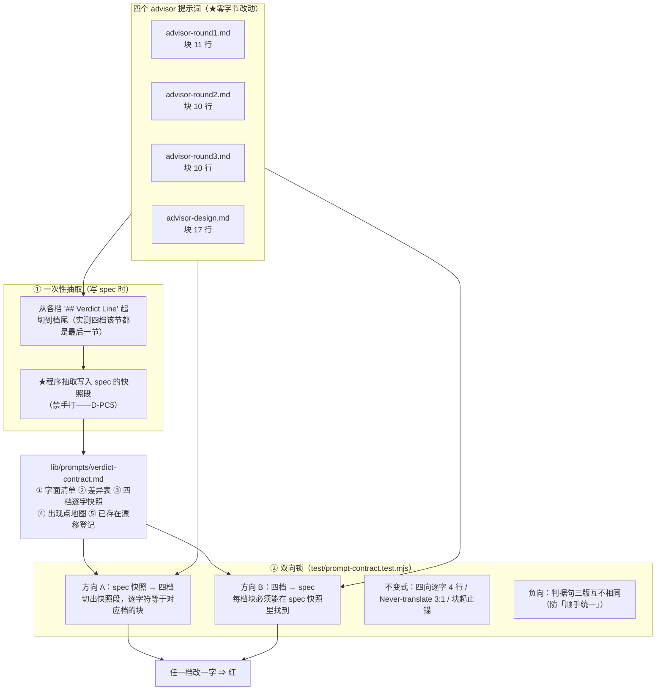
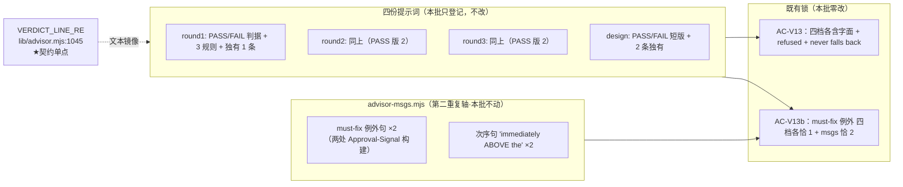

# 设计：提示词公共层（裁减版）—— 批 8

- 日期：2026-09-13
- 需求档：[`2026-09-13-prompt-common-requirements.md`](./2026-09-13-prompt-common-requirements.md)（7 用户故事 / 6 非功能标准）
- 会诊纪要：[`2026-09-13-prompt-common-consult-minutes.md`](./2026-09-13-prompt-common-consult-minutes.md)（会诊 id 3，**4/4 交付**；含父侧实测 8 条、四家事实主张核验、J1–J8 裁定）
- 章节：九节（§1 背景 · §2 问题 · §3 目标 · §4 决策与理由 · §5 方案 · §6 机制伪代码 · §7 状态与 schema · §8 防偏离 · §9 边界）+ §10 受影响文件与验收 + §11 变更记录；图示：**图 1（spec ↔ 四档双向锁的数据流）** / **图 2（判定族的出现点地图）**
- 状态：**已实施（v0.16.0）** —— 批 8 已交付（设计评审 轮次 1 `FAIL`（🔴1 = 纪要裁定的闸**组件②**被静默丢弃）→ 轮次 2 `PASS` → 实施；全量 `node --test` **413/413**，18 次变异自证）。**本行此前滞后写「设计待评审」，2026-09-13 批 10 文档卫生订正**

> ## ⚠️ 行号/位置引用口径（读本档前必读）
>
> 行号为 **as-of 批 7 交付后（`8b4c47f` / v0.15.0）** 实测值，会随改动漂移。**定位一律按符号名/标题**：
>
> | 要找什么 | 检索符号 |
> |---|---|
> | 判定契约块起点（**四档各自**，且**都是档尾最后一节**） | `## Verdict Line (machine-readable — REQUIRED)` |
> | 宿主机械解析点（**契约单点**） | `VERDICT_LINE_RE` |
> | 四档含字面与 must-fix 例外的既有锁 | `AC-V13` / `AC-V13b`（`ADVISOR_PROMPTS` 循环） |
> | 既有锁的**读档方式**（本批零改面的关键约束） | `const readPrompt = (name) => readFileSync(...)` |
> | 第二重复轴的出现点 | `advisor-msgs.mjs` 的 `MUST_FIX_EXCEPTION` 与 `immediately ABOVE the` |
> | 提示词装载（**本批零改动**） | `function loadPrompt` / `lib/prompts.mjs` 顶层 const |
> | 测试档清单登记闸 | `测试档清单 = 既有 11 档 + 本批唯一新增档`（T-E19） |
> | 既有测试档零修改闸（**含授权例外清单**） | `AP_TEST_AUTHORIZED` / `AP_BASELINE_SHA`（T-AP9） |

---

## §1 背景

四个 advisor 提示词（`advisor-round1/2/3.md` + `advisor-design.md`）各自**完整携带**一份「判定契约」——即那个让宿主能机械解析评审结论的 `VERDICT: PASS` / `VERDICT: FAIL` 段。

这段契约对应宿主侧**一个**正则（`VERDICT_LINE_RE`，`lib/advisor.mjs:1045`）——**代码单点、文本四处**。

它是本仓最敏感的一段文本：批 3 曾为「malformed 必须写成 **refused** 而不是 no-verdict-at-all」专门加过负向锁，又为「一揽子句必须带 must-fix 例外」加过计数锁——**两次都是因为提示词与宿主判据不同步而白跑整轮评审**。所以它的每一个字都在承重。

---

## §2 问题

| # | 问题 | 根因 | 证据（父侧实测） |
|---|---|---|---|
| **P1** | 判定契约**四处逐字拷贝**（其中 4 行四向逐字相同） | 无公共层 | 四档块 11/10/10/17 行；行交集实跑 = 4 行 |
| **P2** | **已经漂过一次**：`Never translate this token` 那行 3:1 | 人工同步 | `advisor-design.md:57` = `the host parses this line literally`；其余三档 = `the line is parsed literally` |
| **P3** | **无跨档一致性锁** | 现有锁只做「**每档各自含某字面**」 | `preset-static.test.mjs` 的 `ADVISOR_PROMPTS` 循环逐档 `includes`，**无跨档比较** |
| **P4** | 重复面被**低估** | 记载未复核 | 吸收清单记「`engineering.md:173-174` 重复标题」——实测**无重复标题**；真实重复面就是那 4 行 |
| **P5** | 契约**单点在代码、文本在多处** | 历史成因 | `VERDICT_LINE_RE` 单点 + 四档 + `advisor-msgs.mjs` 6 处 |

**靶心是 P2+P3**：重复只占 12 行（微不足道），但**它已经漂过，且没有任何东西会阻止下一次**。

---

## §3 目标

| # | 目标 | 验收面 |
|---|---|---|
| G1 | 判定契约有**一处权威可查**（含四档逐字快照） | AC-1 / AC-2 |
| G2 | **跨档一致性机检**：任一档改一字即红 | AC-3 / AC-4 |
| G3 | 带意差异**显式登记**，不被当 bug 修掉 | AC-5 |
| G4 | **零改面**：四档 + 装载器零字节改动 | AC-9 / AC-9b |
| G5 | 改动字面时**知道要同时改哪些地方** | AC-5b |
| G6 | **零新增启动期失败面** | AC-10 |

**非目标（一句话）**：本批**不**引入组装层、**不**合并任何判据句措辞、**不**单点化 `advisor-msgs.mjs` 的第二重复轴、**不**做 D1–D7、**不**做上游式 4→10 节分层 —— 逐条理由见 D-PC2/3/8/9/10 与需求档 §5.1。

---

## §4 决策与理由（含否决备选）

| # | 决策 | 理由 / 否决备选 |
|---|---|---|
| **D-PC1** | **形态 = 零改面**：四档与 `lib/prompts.mjs` **零字节改动**；交付物 = 一份 spec 档 + 一条双向锁测试 | **用户 2026-09-13 裁定**。见 D-PC2 的收益/成本账 |
| **D-PC2** | **否决组装层**（片段档 + `loadPrompt` 标记展开） | **收益 = 消灭 12 行重复**（4 行 × 3 份副本），**且只省 12 行**。**成本三条**：① 新增**启动期**失败面——`prompts.mjs:21-39` 是模块顶层急读，片段缺失 ⇒ **整个插件加载失败**（爆炸半径从「一个评审」升为「插件起不来」）；② **必须改写 `AC-V13`/`AC-V13b`**——实测 `readPrompt` 是 `readFileSync(resolve(PROMPTS_DIR, name))`（**读裸档字节，不走 `prompts.mjs`**），抽取后裸档不再含那 4 行 ⇒ 这两个本仓**最安全相关**的测试必红，**为 12 行去动它们，风险收益倒挂**；③ 破坏本仓「**零构建**（纯 JS 免构建）」这一既存性质。**注**：会诊中有一家主张「自足性锁在渲染层、故组装层兼容」——**父侧实测推翻**（见 `readPrompt` 实现），该主张不成立 |
| **D-PC3** | **只登记，不合并**：三版 PASS 判据句 / 两版 FAIL / `Never translate` 的 3:1 / `design` 独有两条**一律原地保留** | 它们是**判定边界文本**。统一任一措辞 = **替换** 2/3 份 ⇒ 违反批 7 纪律 3「判定族字面只追加、绝不替换」。**另**：`design` 的 `the host parses this line` 在它自己的语境里**更精确**（design 评审的 verdict 由**宿主**核验 echo 码并注入令牌，而 code 评审的判定行按 round1 自述是 *machine-readable to the caller*）——**那不是错，是有意的** |
| **D-PC4** | spec 落点 = **`lib/prompts/verdict-contract.md`**（与资产**同目录**） | 根因就近；且**实测该目录无任何目录扫描**（`loadPrompt` 按显式文件名装载，库里无 `readdirSync` 触 `prompts`），故新增 `.md` **对装载路径完全惰性** ⇒ 零新增失败面（N-3）。**否决**放 `docs/`（离资产远，且会被当成「给读者看的文档」而非「与资产同源的契约」）。**必须登记进 `docs/README.md`**（既有纪律） |
| **D-PC5** | spec 的**规范性纪律**：每条引述必须与四档**逐字一致**，不得改写成摘要 | spec 一旦「重述」契约，它自己就变成**同机制的第二落点**（R1 域），会制造一个新的 🔴。故 spec 的快照段由**程序抽取写入**（禁手打），并由双向锁测试反过来盯住它。**维护路径（评审 #10：纪律若无常驻载体就会退化成民间传说）**：抽取脚本**不**入库（入库 = 把 603 行语料再复制一份）；**日常维护路径 = 「手工改 + 锁纠错」**——spec 或档任一侧手改，另一侧没跟上就红，红了再手改对齐。**「禁手打」只在 stage-1 首版成立**（那一版必须程序抽取，避免一次性引入上百个字符级偏差）；**后续维护允许手改**，因为**锁本身就是纠错器**。此口径写入 spec 的头部说明 |
| **D-PC6** | 零改面闸 = **两个组件（评审轮次 1 的 🔴#1 修正）**：① **spec ↔ 四档逐字一致**（**EOL 归一后**比较）；② **四档 Verdict 块的 sha256 内容指纹**（**对 EOL 归一后的块内容**求哈希，即 `sha256Hex(lf(block))`；硬编码常量，仅刻意更新时改动） | ① 由纪要 §3-④ 定义，本档初稿**漏掉了②**——纪要原话是「闸 = spec ↔ 四档双向逐字一致 **+ 四档 Verdict 块内容指纹**」（纪要 `:84`）。**为何必须有②**：①是**共拥有**的锁——「提示词 + spec 快照」**协同改**能全绿，而纪要给闸定的框架是禁止这种静默协同漂移；②把「四档的块内容」钉成常量，协同改即红（**审计员已独立复现 M3**：协同改 ⇒ ① 绿、② 红）。**否决**：只留①并记裁定的理由不成立（纪要已把②写成闸的组成部分，删它需要推翻纪要，而不是「省略」）。**口径订正（审计 F3 ③）**：② 钉的是**归一后的块内容**，**不是**「文件存储形态」——同一内容在 CRLF/LF 两种落地方式下指纹相同，原措辞会自相矛盾 |
| **D-PC6b** | 零改面闸**不用**渲染快照金样 | 因 `AC-V13` 锁的是**裸档字节**（D-PC2 ②），四档**本就一字不改** ⇒ 闸天然更强。会诊建议的「金样渲染快照」在**零改面形态下多余**（渲染路径根本没动）——这一条与 D-PC6 的②是**不同**的两件事：②钉的是**源档块内容**，金样钉的是**渲染产物** |
| **D-PC7** | **测试落点 = 新增 `test/prompt-contract.test.mjs`** | **用户 2026-09-13 裁定**。三条路里唯一不碰硬锁的：① 新增档建于基线 `2e6ca8b` **之后** ⇒ **T-AP9 不管它**（锚 B 只护「基线时已存在」的档）；② 只需 **T-E19 清单再登记一行**。**已实测否决**「并进 `preset-static.test.mjs`」——该档建于 `ab056e7`（**基线之前**），改动它会让 **T-AP9 锚 B 变红**（父侧用审计员谓词实跑证红后还原）。**亦否决**「改 T-AP9 授权清单」——`AP_TEST_AUTHORIZED` 位于 `death-provenance.test.mjs`，而它**自身**也在基线时点已存在 ⇒ 改它同样触发锚 B |
| **D-PC8** | `advisor-msgs.mjs` 的**第二重复轴本批不动**，只登记进 spec 的出现点地图 | 它不在「提示词公共层」面内；把它拉进来会让本批从「提示词一致性」扩成「判定族单点化」（另立批次） |
| **D-PC9** | **不做 D1–D7** | 吸收清单 §2 的 `ENG-DESIGNER` 行明写归**批 11**；§6 的批 8 行原有冲突已就地订正（按 §7 记理由） |
| **D-PC10** | **不做上游式 4→10 节分层** | 体量不成比例（**603** 行语料 / 真实重复面 4 行）；留待提示词数过 ~15 或出现第 5 种 advisor 变体时重议。**订正（审计 F3 ①）**：初稿此处与需求档 §5.1-6 写「604 行」，与本文档 §6.2 的 603/603 自相矛盾——实测 **603**（`lib/prompts` 下 10 个既有档） |

---

## §5 方案

### §5.1 spec ↔ 四档双向锁的数据流（图 1）



**读图要点**：**同一个相等断言覆盖两类失败**（评审轮次 2 的 #5 订正：不是「两个方向各做一遍」）——失败类 A = 档改了 / spec 没跟上；失败类 B = spec 改了 / 档没跟上。**另**有**组件②（`BLOCK_SHA256` 指纹）**独立钉住「四档 Verdict 块的**归一后内容**不变」（**口径订正，审计 F3 ③**：它钉的是内容而非文件存储形态——同一内容 CRLF/LF 两种落地指纹相同），两者合起来才等价于纪要 §3-④ 的闸。

### §5.2 判定族的出现点地图（图 2）



**读图要点**：这是 spec 第 ④ 节的**可执行版本**——**改动任何一个判定族字面，要一起看的就是这张图**（批 7 纪律 ②「改了引用点要改所有副本」的可执行清单化）。

---

## §6 机制伪代码

### §6.1 spec 档结构（`lib/prompts/verdict-contract.md`）

```markdown
# Verdict 契约（判定族）—— 四档 prompt 的公共层权威

> **本档的规范性纪律**：以下每一句引述都与四个 advisor 档**逐字一致**，由
> `test/prompt-contract.test.mjs` 双向锁死。改任何一处必须同时改本档——
> 反之，改本档也会让测试红。**本档不减少任何字节，它把「一致性」变成可机检的。**

## ① 契约字面（宿主机械解析，只追加不替换）

## ② 差异表（带意差异，登记 ≠ 待修）

## ③ 四档逐字快照（程序抽取写入）

<!-- SNAPSHOT:advisor-round1.md -->
…该档从 `## Verdict Line` 起至档尾的全部字节…
<!-- /SNAPSHOT:advisor-round1.md -->

（round2 / round3 / design 同构，共四段）

## ④ 出现点地图

## ⑤ 已存在的漂移登记
```

**关键形态**：
- 快照段用 **HTML 注释哨兵** `<!-- SNAPSHOT:<档名> --> … <!-- /SNAPSHOT:<档名> -->` 界定——**哨兵在 spec 里**（spec 不被任何 loader 装载，故注释不会进入任何提示词）。
- 快照段是**纯 markdown 文本**（不做代码围栏），以便逐字符比对。
- **spec 的归属**：它是 `lib/prompts/` 下的**资产旁文档**，**不参与装载**（D-PC4）。

### §6.2 双向锁测试（`test/prompt-contract.test.mjs`）

> **切片谓词的前提（AC-8）**：四档的 `## Verdict Line` **都是该档最后一节**（父侧实测：其后无 `##` 级标题）⇒ 「从该标题切到档尾」就是精确的块。该前提由 AC-8 断言。
>
> **尾换行契约（评审轮次 2 的 #3）**：`verdictBlockOf` 保留块的**尾换行**（`slice(i)` 到档尾），故 spec 的快照载荷**必须同样保留**——`<!-- /SNAPSHOT:… -->` 写**独立一行**且输入**无末尾换行**时，捕获载荷恰等于 `block`。**两侧不对称会让 AC-3/4 恒红**，故该契约在此显式写死。
>
> **EOL 口径（评审 #4；**审计 F2 的裁定修正**）**：**先纠正父侧的前提错误**——本仓**无 `.gitattributes`**，**提交进库的 blob 是 LF**（`git cat-file -s` 对照工作树：round1 9049 vs 9123，Δ74 = 其 CRLF 数），工作树之所以是 CRLF 只因**本机 `core.autocrlf=true`** ⇒ 「全库 CRLF 是仓内既有约定」（初稿语）**不成立**；那 603/603 是**本机 checkout 的投影**。**裁定 = 三处统一归一**：① spec 档与四档 **EOL 契约 = 环境无关**（同档不混用 + 跨档一致，见 AC-9b；**不再**要求「全 CRLF」）；② 比对前对**双方**做 `\r\n → \n` 归一（**归一的是 EOL，不是内容**——逐字符比对仍在归一后的字符串上做）；③ 哨兵匹配用**正则**而非 `indexOf`（`\r` 容忍）。**「逐字」的含义因此被精确化为：除行尾符外逐字符相同。**

```js
const PROMPTS_DIR = join(PLUGIN_DIR, "lib", "prompts")
const SPEC = readFileSync(join(PROMPTS_DIR, "verdict-contract.md"), "utf8")
const ADVISOR_PROMPTS = ["advisor-round1.md", "advisor-round2.md", "advisor-round3.md", "advisor-design.md"]

/** EOL 归一（只归行尾，不动内容）。 */
const lf = (s) => s.replace(/\r\n/g, "\n")

/** 从某档切出判定契约块：'## Verdict Line' 起 → 档尾。 */
function verdictBlockOf(text) {
  const i = lf(text).indexOf("## Verdict Line")
  assert.ok(i >= 0, "该档缺 ## Verdict Line 标题")
  return lf(text).slice(i)
}

/** 从 spec 取出某档快照（哨兵之间）——正则匹配，容忍 CRLF。
 *  ★评审轮次 2 的 #3：**不剥尾换行**——`verdictBlockOf` 用 `slice(i)` 保留块的尾换行，
 *  故快照载荷必须**同样保留**；两侧不对称会让 AC-3/4 **恒红**。
 *  规范 = `/SNAPSHOT:… -->` 写在**独立一行**且输入末尾**无换行** ⇒ 捕获到的载荷
 *  恰好等于 `block`（末行的 CRLF 落在 `<!-- /SNAPSHOT -->` 之前）。 */
function snapshotOf(spec, name) {
  const re = new RegExp("<!-- SNAPSHOT:" + name + " -->\\r?\\n([\\s\\S]*?)<!-- /SNAPSHOT:" + name + " -->")
  const m = lf(spec).match(re)
  assert.ok(m, name + " 在 spec 里缺快照哨兵（或未闭合）")
  return m[1]   // ★不 replace(/\n$/,"") —— 与 verdictBlockOf 的尾换行契约对齐
}

// ── 组件①：双向逐字一致（一次相等，两类失败——评审 #6 的措辞订正）──
//   失败类 A：档里改了 / spec 没跟上；失败类 B：spec 里改了 / 档没跟上。同一断言两向都报。
for (const name of ADVISOR_PROMPTS) {
  const block = verdictBlockOf(readFileSync(join(PROMPTS_DIR, name), "utf8"))
  assert.equal(snapshotOf(SPEC, name), block, name + " 的判定契约块与 spec 快照不一致")
}

// ── 组件②：四档 Verdict 块的 sha256 内容指纹（评审 #1 的 🔴 修复）──
//   ★硬编码常量：把「四档 Verdict 块的**归一后内容**不变」变成机械事实。协同改（prompt + spec 快照一起改）
//   在组件①下能全绿，但会撞这里 ⇒ 红。刻意更新指纹是**可见动作**（改常量即改测试）。
const BLOCK_SHA256 = {
  "advisor-round1.md": "<stage-1 抽取后填写>",
  "advisor-round2.md": "<stage-1 抽取后填写>",
  "advisor-round3.md": "<stage-1 抽取后填写>",
  "advisor-design.md": "<stage-1 抽取后填写>",
}
for (const name of ADVISOR_PROMPTS) {
  const block = verdictBlockOf(readFileSync(join(PROMPTS_DIR, name), "utf8"))
  assert.equal(sha256Hex(block), BLOCK_SHA256[name],
    name + " 的判定契约块内容已变（块内容的 EOL 归一后字节是本批闸的框架）——若确为刻意，请同步更新本指纹常量")
}

// ── 哨兵集合断言（评审 #6）：spec 里恰有四个 SNAPSHOT 名，无多余、无重复 ──
const names = [...lf(SPEC).matchAll(/<!-- SNAPSHOT:([^>]+?) -->/g)].map((m) => m[1])
assert.deepEqual([...names].sort(), [...ADVISOR_PROMPTS].sort(),
  "spec 的 SNAPSHOT 哨兵集合必须恰为四个 advisor 档（无第五个、无重复）")

// ── 不变式 1：四向逐字共享行 = 恰 4 行（**定位谓词**见下，防 tautology）──
const SHARED_PREFIXES = [
  "## Verdict Line (machine-readable",          // 块标题
  "End your **final reply** with one verdict",  // 引导句
  "- Tolerated: leading whitespace",            // 容忍形
  "- A malformed or misplaced verdict line",    // 拒签形
]
for (const p of SHARED_PREFIXES) {
  const hits = ADVISOR_PROMPTS.map((n) =>
    verdictBlockOf(readFileSync(join(PROMPTS_DIR, n), "utf8"))
      .split("\n").filter((l) => l.startsWith(p)).length)
  assert.deepEqual(hits, [1, 1, 1, 1], p + " 必须在四档各恰出现一次且逐字相同")
}

// ── 不变式 2：Never-translate 行 = 3 档一版 + design 另一版（带意差异）──
const NT_PREFIX = "- **Never translate this token.**"
const nts = ADVISOR_PROMPTS.map((n) =>
  verdictBlockOf(readFileSync(join(PROMPTS_DIR, n), "utf8"))
    .split("\n").find((l) => l.startsWith(NT_PREFIX)) ?? "")
assert.ok(nts.every((l) => l !== ""), "四档都必须有 Never-translate 行")
assert.equal(new Set(nts).size, 2, "Never-translate 行应恰有两版（3:1）")
assert.equal(nts.filter((l) => l === nts[0]).length, 3, "其中一版应恰出现 3 次（3:1 的 3）")

// ── 不变式 3（**负向锁**）：三版 PASS 判据句互不相同 —— 防「顺手统一」──
const passLines = ADVISOR_PROMPTS.map((n) =>
  verdictBlockOf(readFileSync(join(PROMPTS_DIR, n), "utf8"))
    .split("\n").find((l) => l.trimStart().startsWith("`VERDICT: PASS`")) ?? "")
assert.ok(passLines.every((l) => l !== ""), "四档都必须有 PASS 判据句")
assert.equal(new Set(passLines).size, 3, "PASS 判据句应恰有三版（round1 / round2≡round3 / design）")

// ── 不变式 4（AC-8）：块以档尾结束（切片谓词的正确性前提）──
for (const n of ADVISOR_PROMPTS) {
  const t = lf(readFileSync(join(PROMPTS_DIR, n), "utf8"))
  const i = t.indexOf("## Verdict Line")
  assert.ok(!/^## /m.test(t.slice(i + 1)), n + " 的 Verdict 块之后不得再有 ## 级标题（切片前提）")
}
```

**spec 第 ② 节的结构化形态（评审 #5：让「恰 4 类」可判定）**：

```markdown
## ② 差异表（带意差异，登记 ≠ 待修）

<!-- DIFF:pass-criterion --> 三版 PASS 判据句（round1 / round2≡round3 / design）
<!-- DIFF:fail-criterion --> 两版 FAIL 判据句（round1/2/3 一版 / design 短版）
<!-- DIFF:never-translate --> `Never translate` 行的 3:1 措辞差
<!-- DIFF:design-only    --> design 独有两条（host 拒签发 / plain 🟡🔵 不阻塞）
```

⇒ `AC-5` 的判定 = 断言 spec 里 `<!-- DIFF:` 哨兵**恰 4 个**且 id 集合**恰为**上面四个（**不是关键词 grep**）。

### §6.3 T-E19 登记（本批唯一的既有档改动）

```js
// test/guard-e.test.mjs 的 T-E19：existing 数组追加一行
const existing = [ …, "path-kind.test.mjs", "prompt-contract.test.mjs" ]
// 断言形态不变；同处注释已声明「新增测试档必须同步登记」（批 7 的 J9-②）
```

---

## §7 状态与 schema

| 面 | 变更 | 说明 |
|---|---|---|
| 四个 advisor 提示词 | **零字节改动** | 本批的核心约束（N-1） |
| `lib/prompts.mjs` | **零字节改动** | 装载路径不动（N-3） |
| `lib/prompts/verdict-contract.md` | **新增**（旁文档） | **不被任何 loader 装载**（实测无目录扫描） |
| `docs/README.md` | 新增一行登记 | 既有纪律：新建文档必须先登记 |
| `test/prompt-contract.test.mjs` | **新增** | 双向锁 |
| `test/guard-e.test.mjs` | **仅 T-E19 清单一行** | 用户裁定（J8） |
| `AC-V13` / `AC-V13b` | **零字节改动** | 本仓最安全相关的测试 |
| 插件运行时行为 | **零变更** | 无任何代码路径改动 |

---

## §8 防偏离

### §8.1 零改面（验收拒收项）

| # | 面 | 判据 |
|---|---|---|
| 1 | **四个 advisor 提示词** | 由 **C1（本批提交的改动集合「恰等于」§10.1 四文件）** 覆盖 —— 它们不在集合内即未动（**一律用提交形态**，不用工作树形态；评审轮次 2 的 #2 扫净此处） |
| 2 | **`lib/prompts.mjs`** | 同上，由 C1 覆盖 |
| 3 | **`AC-V13` / `AC-V13b`** | 所在档（`preset-static.test.mjs`）**零 diff**（T-AP9 授权例外之外）——亦由 C1 覆盖 |
| 4 | **`death-provenance.test.mjs`** | 零 diff（`AP_TEST_AUTHORIZED` 未扩）——亦由 C1 覆盖（评审轮次 2 的 #2） |
| 5 | **`lib/advisor.mjs` 的 `VERDICT_LINE_RE`** | 由 C1 覆盖 |
| 6 | **`advisor-msgs.mjs` 的 6 处出现点** | 由 C1 覆盖 |
| 7 | **判定族字面** | 四档内一个字都不动（本批**无**「追加」也无「替换」）——由 C1 + 组件②指纹双向覆盖 |

### §8.2 机验锚（防静默退化 —— **谓词写全三件事**）

> **交接页 §2 纪律 2 / D-37**：每条锚必须写清 **何时点** · **何谓改** · **自指**。

| # | 锚 | 谓词（持久形态） |
|---|---|---|
| **C1** | **本批提交的改动面恰为本批工作产物集**（**审计 F1 的裁定修正**：原写「恰等于 §10.1 四文件」，但**批次的文档面本就是该批次的工作产物**——批 6/6b/7 的提交都含各自的设计记录；把设计档排除在提交外会让修完的文档永远留工作树） | 对**本批提交**取 `git show --name-only --format= <sha>`，断言集合**恰等于**：实现面 4 文件（`lib/prompts/verdict-contract.md` · `test/prompt-contract.test.mjs` · `test/guard-e.test.mjs` · `docs/README.md`）**+** 本批文档面 4 文件（`docs/2026-09-13-prompt-common-{consult-minutes,requirements,design}.md` · `docs/2026-09-13-handoff.md`）**+** `docs/2026-09-12-absorption-inventory.md`（§6 批 8 行的 D1–D7 订正）**+** `CHANGELOG.md` · `METHODOLOGY.md` · `package.json`（收口三件）。**「恰等于」蕴含「其余一律未动」** ⇒ §8.1 的 7 个零改面（含 `advisor.mjs` / `advisor-msgs.mjs` / `preset-static` / `death-provenance` / 四档提示词 / `prompts.mjs`）**全部被这一条覆盖**。**不用**「工作树 vs HEAD」形态（D-37 三次坑——批 7 的未提交改动会污染它） |
| **C2** | **自指**排除 | C1 的集合里**含** `test/guard-e.test.mjs`（T-E19 登记，用户授权 J8）——它是**本批合法改动**；而 `test/preset-static.test.mjs` 与 `test/death-provenance.test.mjs` **不在集合内** ⇒ 由 C1 的「恰等于」保证零改 |
| **C3** | spec 逐字一致 | 双向锁测试即锚（组件①） |
| **C4** | **差异登记完备（可判定形态）** | 断言 spec 内 `<!-- DIFF:` 哨兵**恰 4 个**，且 id 集合**恰为** {`pass-criterion`, `fail-criterion`, `never-translate`, `design-only`}（评审 #5：**不是**关键词 grep） |
| **C5** | 不变式恒定（**带定位谓词**，评审 #11） | 四条共享行按**行首前缀**定位（`## Verdict Line (machine-readable` / `End your **final reply** with one verdict` / `- Tolerated: leading whitespace` / `- A malformed or misplaced verdict line`），各档**恰 1 次**；`Never translate` 行按前缀 `- **Never translate this token.**` 定位，**恰两版、其一出现 3 次** |
| **C6** | 装载路径零接入 | 断言 `lib/prompts.mjs` 源码**不含** `verdict-contract`（本档永不进装载路径） |
| **C7** | **两组件齐备**（评审 #1 的 🔴 收口） | 断言 `test/prompt-contract.test.mjs` **同时**含组件①（逐字相等）与组件②（`BLOCK_SHA256` 指纹常量 + `sha256Hex` 比对）；缺任一即红 |
| **C8** | **spec 覆盖出现点地图（评审 #7）** | 断言 spec 第 ④ 节含关键锚：四个档名 · `VERDICT_LINE_RE` · `advisor-msgs.mjs` · `AC-V13` · `AC-V13b` |
| **C9** | **spec 与四档 EOL 契约一致（环境无关）**（**审计 F2 的裁定修正**）：断言 ① **同档内不混用 EOL**（`\r\n` 与孤立 `\n` 不得并存）② **spec 与四档的 EOL 约定一致**（同为 CRLF 或同为 LF 皆合法）。**原谓词「裸 LF 计数 = 0（全 CRLF）」已废止**——它钉的是**本机 checkout 配置**而非仓库属性：本仓**无 `.gitattributes`**、**提交进库的 blob 是 LF**，工作树之所以 CRLF 只因本机 `core.autocrlf=true`；在 `autocrlf=false`（git 默认）的克隆上，**一个字节未改的仓库**就会变红 ⇒ 新增**环境依赖失败面**，违 §9-6 与 G6 |
| **C10** | 既有锁未被削弱（**评审轮次 2 的 #7：原编号与 C7 撞车，已顺延为 C10**） | `AC-V13`/`AC-V13b` 的测试名与断言体零 diff（由 §8.1 #3 覆盖） |

---

## §9 边界

| # | 边界 | 行为 | 理由 |
|---|---|---|---|
| 1 | **本批无运行时行为变更** | 插件加载路径、评审路径、宿主解析路径**全不动** | 本批只新增旁文档 + 测试 |
| 2 | **spec 不进提示词** | `verdict-contract.md` 永不被 `loadPrompt` 装载（实测无目录扫描 + C6 锚） | 否则它会成为模型可见噪声 |
| 3 | **spec 改名/移动** | 双向锁会红 | 哨兵 + 路径写在测试里 |
| 4 | **将来有人统一三版判据句** | **组件①（双向一致）不阻止**——把档与 spec 快照**协同改**即可全绿；**组件②（sha256 指纹）会红**——它钉的是「四档 Verdict 块的**归一后内容**不变」；而**不变式 3（负向锁）也会红**——它钉的是「三版必须互不相同」。**三者合起来才等价于纪要 §3-④ 的闸**；缺②则协同改无人拦（评审轮次 1 的 🔴#1 正是此处）。**要合法地统一三版，必须同时做三件事**：改四档 + 改 spec 快照 + **改指纹常量**，且删/改不变式 3——那是一组**可见、可评审**的动作，而不是一次静默的「顺手统一」 | 有意设计：一致性由组件①保证、「不许协同漂移」由组件②保证、「不许统一」由不变式 3 保证 |
| 4b | **本批交付前的时序前提（评审 #3）** | AC-9 的核验必须在**批 7 已提交**之后进行。批 7 的工作树若仍未提交，`git diff` 会把它的一堆改动算成本批的——**这是 D-37 教训的同一形状**（工作树 vs HEAD 形态）。故 AC-9 **一律用提交形态** `git show --stat <本批 sha>`，**不用**工作树形态；C1 锚同理 | D-37 三次坑的正面应用 |
| 5 | **将来有人抽取组装层** | 本批不阻止；但那需要同时改写 `AC-V13` 的读档方式 | 记在 D-PC2，留待体量够大时重议 |
| 6 | **无 git 的机器** | 本批不依赖 git（双向锁直接读文件） | 比 T-AP9 更可移植 |
| 7 | **提示词数增长到 ~15 或出现第 5 种 advisor 变体** | 重议是否引入组装层 | D-PC10 的触发条件 |

---

## §10 受影响文件全清单与验收

### §10.1 实施域（eng-coder 写域）

| 文件 | 改动 | 类型 |
|---|---|---|
| `lib/prompts/verdict-contract.md` | **新增**：五节 spec（字面清单 / 差异表 / **四档逐字快照** / 出现点地图 / 漂移登记） | **新增** |
| `test/prompt-contract.test.mjs` | **新增**：双向锁 + 四条不变式 | **新增** |
| `test/guard-e.test.mjs` | **仅** T-E19 的 `existing` 数组追加 `"prompt-contract.test.mjs"` | **修改（用户授权 J8）** |
| `docs/README.md` | 新增一行登记 | 修改 |

**不改动**（**本批最硬约束**）：四个 advisor 提示词 · `lib/prompts.mjs` · `lib/advisor.mjs` · `lib/advisor-msgs.mjs` · `test/preset-static.test.mjs` · `test/death-provenance.test.mjs` · 其余全部。

### §10.2 用例与验收标准

| # | 验收标准 | 形态 |
|---|---|---|
| **AC-1** | `lib/prompts/verdict-contract.md` 存在且五节齐全 | 核心 |
| **AC-2** | 该档登记进 `docs/README.md` | 核心 |
| **AC-3** | **方向 A**：spec 快照 ↔ 四档块**逐字符相等**（四档各一条断言） | **核心** |
| **AC-4** | **同一个相等断言的失败类 B**（评审轮次 2 的 #5：叙述统一为「一次相等，两类失败」，不再叫「方向 B」）：spec 里多出的内容也会让该断言红；**另**由哨兵集合断言（AC-7c）兜住「第五个哨兵 / 重名」 | **核心** |
| **AC-5** | 差异表**可判定**：spec 内 `<!-- DIFF:` 哨兵**恰 4 个**且 id 集合恰为 {`pass-criterion`, `fail-criterion`, `never-translate`, `design-only`}（评审 #5：不用关键词 grep） | 核心 |
| **AC-5b** | **出现点地图有内容**（评审 #7）：spec 第 ④ 节含 `VERDICT_LINE_RE` · `advisor-msgs.mjs` · `AC-V13` · `AC-V13b` · 四个档名 | 核心 |
| **AC-6** | 不变式：四向逐字共享行 = **恰 4 行**（**按行首前缀定位**，评审 #11）；`Never translate` 行 = **恰两版、其一 3 次** | 防退化 |
| **AC-7** | **负向锁**：三版 PASS 判据句互不相同（按 `VERDICT: PASS` 行首定位；防「顺手统一」） | 防退化 |
| **AC-7b** | **两组件齐备**（评审 #1 的 🔴 收口）：测试文件**同时**含组件①（逐字相等）与组件②（`BLOCK_SHA256` 指纹常量）；**协同改四档 + spec 快照**必须能撞红组件② | **核心** |
| **AC-7c** | **哨兵集合完备**（评审 #6）：spec 的 `SNAPSHOT:` 名集合**恰等于**四个档名（无第五个、无重复） | 防退化 |
| **AC-8** | 恒定：四档块均以档尾结束（该节是最后一节）——**切片谓词的正确性前提** | 防退化 |
| **AC-9** | **零改面（收敛为「恰等于」）**：本批提交的改动文件集合**恰为** C1 所列的工作产物集（实现面 4 + 文档面 4 + 收口 3）。**核验一律用提交形态** `git show --name-only --format= <sha>`，**不用**工作树形态（评审 #3：批 7 若未提交会污染；D-37 同形教训）。**审计 F1** 指出该锚在交付时**尚未可执行**（无提交即无 sha）——由**父侧在提交后**执行，属收口步骤 | **零回归** |
| **AC-9b** | **EOL 契约（环境无关，审计 F2 裁定修正）**：① 同档内不混用 EOL；② spec 与四档 EOL 约定一致（同 CRLF 或同 LF 皆可）。**不再**断言「裸 LF = 0 / 全 CRLF」——那是本机 `core.autocrlf=true` 的投影，非仓库属性 | 零回归 |
| **AC-10** | C6 锚：`lib/prompts.mjs` 源码不含 `verdict-contract` | 防退化 |
| **AC-11** | T-E19 清单含 `prompt-contract.test.mjs` | 零回归 |
| **AC-12** | 全量 `node --test` 全绿（基线 **399** + 新增），既有测试档中**仅** `guard-e.test.mjs` 有改动 | 收口 |

### §10.3 建议 stages（给 eng_coder）

| stage | goal | 检查 |
|---|---|---|
| 1 | **程序抽取**四档块 → 写入 spec 的五节骨架（**禁手打**；**抽取脚本用 node 显式 `utf8` 读写，写后核 U+FFFD = 0**——评审轮次 2 的 #4：交接页 §2-4 的编码纪律须进本设计；**禁止用 PowerShell 做读-改-写**） | `node --check` 抽取脚本 + 读 spec 快照段核对 |
| 2 | 写 `test/prompt-contract.test.mjs` 双向锁 + 四条不变式 | `node --test test/prompt-contract.test.mjs` |
| 3 | T-E19 登记一行 | `node --test test/guard-e.test.mjs` |
| 4 | `docs/README.md` 登记 | 读档核对 |
| 5 | 收口：全量 + 零改面核验（AC-9） | `node --test` + **`git show --name-only --format= <本批 sha>`「恰等于」核验**（评审轮次 2 的 #2：**不用**工作树形态） |

---

## §11 变更记录

| 日期 | 变更 |
|---|---|
| 2026-09-13 | 首版（设计待评审）：会诊 id 3 四家交付 → 九节 + 图 1/图 2；D-PC1…D-PC10；AC-1…AC-12；锚 C1…C7；§10.3 五 stage 建议。**形态 = 零改面**（用户裁定）；**否决组装层**（父侧实测推翻「自足性锁在渲染层」这一会诊主张） |
| 2026-09-13 | **设计评审轮次 1 修正块（§12.1）**：`VERDICT: FAIL`（🔴1 · 🟡7 · 🔵5，job `advisor-dsh-14`）。**🔴 = 批 7 第一课的第五次命中**：纪要写明闸有两组件（双向一致 **+ 四档 Verdict 块内容指纹**），设计档只落了前者且无裁定记录。已补 D-PC6 组件②（`BLOCK_SHA256` 指纹常量）+ 锚 C7（两组件齐备）+ 重写 §9-4 使框架与纪要「源档字节不变」一致。另修：AC-9 收敛为「恰等于 §10.1 四文件」且一律用**提交形态**（#2/#3）· §6.2 补 EOL 归一与正则哨兵（#4）· 差异表改 ID 化 `<!-- DIFF:… -->` 使「恰 4 类」可判定（#5）· 补哨兵集合断言（#6）· 补出现点地图内容锚 C8（#7）· 补抽取脚本的**维护路径**（#10）· 不变式改**行首前缀定位**（#11）· R-11 归属订正（#12）· §3 补非目标行（#13）· 纪要重复段与交接页陈旧已修（#8/#9）。AC → **AC-1…AC-12 + AC-5b/7b/7c/9b**，锚 → **C1…C9** |

| 2026-09-13 | **设计评审轮次 2（§12.2）**：**`VERDICT: PASS`**（无未决 🔴）。13 条旧项全部核实已修；新增/残留 7 条全部 🟡/🔵 且**父侧本轮全部修掉**——含**尾换行不对称（会让 AC-3/4 恒红）**、需求档 J5 跨档滞后、三处「提交形态」未扫净、抽取脚本 utf8 纪律、图 1/AC-4 叙述统一、纪要 R-11 归属、**锚编号撞车（旧 C7 → C10）**。锚集 = **C1…C10** |

| 2026-09-13 | **分歧审计与修复轮（§12.3）**：独立子代理 `51fe20ee` 只读 + 内存变异 → **`DIVERGENCE: 4 items（🔴0 🟡2 🔵2）`**。**核心主张经字节级核验为真**（四档 + `prompts.mjs` git diff 为空；审计员另用字节读取佐证，因 `autocrlf=true` 会让 git diff 吞掉 EOL-only 编辑）。四修：**F2 = 父侧设计前提错误**（AC-9b 钉的是 checkout 配置而非仓库属性：本仓无 `.gitattributes`、blob 是 LF、CRLF 只是本机 `autocrlf` 投影 ⇒ 会造出环境依赖失败面）→ 改为环境无关的 EOL 契约（模拟全 LF 克隆验证 14/14 绿）· F1 锚 C1 改为「本批工作产物集」并明确由父侧提交后执行 · F3 两处数量/限定词 + 组件② 口径订正（归一后内容 ≠ 存储形态）· F4 `readdir` 谓词收窄到本目录。全量 **413/413** |

---

## §12 设计评审落档

### §12.1 轮次 1（2026-09-13 —— `VERDICT: FAIL`，job `advisor-dsh-14`）

**🔴1 · 🟡7 · 🔵5 = 13 条。** 评审员逐条核对了纪要 J1–J8 与设计档的对应（正是批 7 第一课要求的动作），并指出**有一条裁定没活过转移**。

| # | 级别 | 内容 | 处置 |
|---|---|---|---|
| **1** | 🔴 | **纪要裁定的闸组件被静默丢弃**：纪要 §3-④ 把零改面闸定义成**两个**组件（「spec ↔ 四档双向逐字一致 **+ 四档 Verdict 块内容指纹**」，框架为「以**源档字节不变**为闸」），而需求档 J5 与设计档 D-PC6 只留了前者，**且无任何裁定记录**说明为何去掉。评审员点明这不是小事：**双向锁是共拥有的**——「提示词 + spec 快照」**协同改**能全绿，与纪要的「源档字节不变」框架**直接矛盾**；而 §9-4 还**明确预期**协同改能通过 | **已补（实现指纹，非记裁定）**：D-PC6 拆为 **D-PC6（组件②= `BLOCK_SHA256` 指纹常量）+ D-PC6b（不用渲染金样）**；§6.2 补 `sha256Hex` 比对与「协同改必撞红」的说明；新增锚 **C7**（两组件齐备）；**§9-4 重写**：协同改现在会撞**组件②**与**不变式 3**，要合法统一三版必须同时改档 + spec + 指纹常量 + 不变式，是一组**可见可评审**的动作 |
| **2** | 🟡 | AC-9 与锚 C1 的零 diff 面**列举不全**（§8.1 护着 `advisor.mjs` / `advisor-msgs.mjs`，AC/C1 未列；`package.json` 亦未提） | **已修**：AC-9 与 C1 一律收敛为「**恰等于** §10.1 的四文件」——一句即蕴含「其余全部未动」 |
| **3** | 🟡 | AC-9 的 `git diff --stat` **工作树形态**会被**批 7 的未提交改动**污染 | **已修**：AC-9 与 C1 **一律用提交形态** `git show --name-only --format= <sha>`；§9-4b 新增**时序前提**（批 7 须先提交） |
| **4** | 🟡 | `snapshotOf` 的开哨兵以裸 `\n` 结尾，而全库是 CRLF；**新建 spec 档的 EOL 未指定** ⇒ CRLF 写入时 `indexOf` 失配 | **已修**：§6.2 补 **EOL 口径**（spec 与四档一律 CRLF；比对前双方 `\r\n → \n` 归一；哨兵改**正则**匹配）；补锚 **C9**（裸 LF 计数 = 0）；「逐字」的含义精确化为「**除行尾符外逐字符相同**」 |
| **5** | 🟡 | AC-5/C4 的「恰 4 类」**无机器可判定形态**（易退化成脆弱的关键词 grep） | **已修**：spec §② 改 **ID 化哨兵** `<!-- DIFF:pass-criterion -->` 等四个；AC-5/C4 断言哨兵**恰 4 个且 id 集合恰为那四个** |
| **6** | 🟡 | AC-4 的「无孤儿」未被 §6.2 实现（逐名 `assert.equal` 抓不到第 5 个哨兵或重名）；「方向 A/B」叙述与实际的一次相等不符 | **已修**：补**哨兵集合断言**（AC-7c）；叙述改为「**一次相等，两类失败**」 |
| **7** | 🟡 | US-5 的地图**内容**无验收（AC-1 只管「五节齐全」） | **已修**：新增 **AC-5b** + 锚 **C8**（spec 第 ④ 节须含 `VERDICT_LINE_RE` / `advisor-msgs.mjs` / `AC-V13` / `AC-V13b` / 四个档名） |
| **8** | 🟡 | 纪要**重复了一整段**（`:102-104` 与 §3-⑤ 同文，孤立在 §3-⑥ 表后） | **已修**：删去孤立副本 |
| **9** | 🟡 | 交接页内部陈旧（§3-6 写 384、§6 写「从批 7 开始」，而 §1 已是批 7 ✅ 399） | **已修**：§3-6 改 **399/399**；§6-2 改 399；§6-3 改「从**批 8** 开始」；§6-5 补第四条纪律 |
| **10** | 🔵 | D-PC5 的「程序抽取（禁手打）」**无常驻载体**，stage 1 的脚本是一次性的 ⇒ 后续更新全变手工 | **已修**：D-PC5 补**维护路径**——抽取脚本不入库；**stage-1 首版必须程序抽取**；**后续维护允许手改**（「锁就是纠错器」）；该口径写入 spec 头部 |
| **11** | 🔵 | 不变式的抽取器**缺定位谓词**（AC-6/7 可能 tautological） | **已修**：§6.2 与锚 C5 给出**行首前缀**定位谓词 |
| **12** | 🔵 | R-11 把「must-fix ×6 / 次序句 ×3」**全记在 `advisor-msgs.mjs` 名下**（×6 实为全族合计 = 四档 + msgs ×2） | **已修**：R-11 改为按图 2 的正确分布 |
| **13** | 🔵 | §3 目标缺一行**非目标**；代码侧锚与文档登记属域外（评审员明示**未核验**） | **已修**：§3 补非目标行；域外侧由父侧在交付时核（`docs/README.md` 登记为父侧职责，见 §10.1） |

### §12.2 轮次 2（2026-09-13 —— **`VERDICT: PASS`**，job `advisor-dsh-15`）

**无未决 🔴。** 评审员逐条复核 13 条旧项：**主 🔴（#1 指纹）已按「实现指纹」方案真正落地**（D-PC6 双组件 + `BLOCK_SHA256` + AC-7b + 锚 C7 + §9-4 重写），#2…#13 全部核实已修。**新增/残留 7 条，全部 🟡/🔵 非阻塞**，父侧在本轮**全部修掉**：

| 新# | Orig# | 级别 | 内容 | 处置 |
|---|---|---|---|---|
| 1 | 1 残留 | 🟡 | **需求档 J5 仍是单组件口径**（该档全文无「指纹」二字）——跨档滞后（R7a/R7b） | **已修**：J5 改写为两组件 + 记录 🔴#1 的来历 |
| 2 | 3 残留 | 🔵 | 新规「一律用提交形态」**未扫净三处工作树形**（§8.1 第 1/2 行 + §10.3 stage 5 的 `git diff --stat`），与 C1 的「不用工作树形态」自相矛盾 | **已修**：三处全部改为**由 C1 覆盖** / 提交形态 |
| 3 | **新** | 🟡 | **尾换行不对称 ⇒ AC-3/4 按现文永远红**：`verdictBlockOf` 的 `slice(i)` 保留块的尾换行，而 `snapshotOf` 却 `.replace(/\n$/,"")` 剥掉一个 —— 两侧不对称 | **已修（本轮最实的一条）**：删掉 strip，并把**尾换行契约**显式写进 EOL 口径（哨兵独行 + 输入无末尾换行 ⇒ 捕获载荷恰等于 block） |
| 4 | 4 残留 | 🔵 | 抽取脚本的**显式 `utf8` 编码纪律**（交接页 §2-4）未写入本设计；stage 1 无此要求 | **已修**：stage 1 补「node 显式 utf8 读写 + 写后核 U+FFFD = 0 + 禁 PowerShell 读改写」 |
| 5 | 6 残留 | 🔵 | 措辞订正只落在 §6.2 注释，**图 1 与 AC-4 仍是双方向框架** | **已修**：图 1 读图要点与 AC-4 均改为「一次相等，两类失败」 |
| 6 | 12 残留 | 🔵 | **纪要 R-11 行仍把 ×6 记在 msgs 名下**（需求档已订正，纪要未跟上） | **已修**：纪要 R-11 按图 2 的正确分布改写 |
| 7 | **新** | 🔵 | **锚编号撞车**：§8.2 出现**两个 C7**（新「两组件齐备」与旧「既有锁未被削弱」），而 §11 声称「锚 → C1…C9」 | **已修**：旧 C7 顺延为 **C10**，锚集 = **C1…C10** |

> **评审员另附一句值得记的话**：它指出上下文里的「Agent Response」是**批 7 交付的收尾内容**、与本轮 prior review **不同源**，仅作参考。——这正是**设计评审链按文档集作用域**（批 4 折入的 D-35）在起作用：串台会被评审员自己识破。

### §12.3 分歧审计与修复轮落档（2026-09-13 —— 独立子代理 `51fe20ee`，只读 + 内存变异）

**审计结论：`DIVERGENCE: 4 items（🔴0 🟡2 🔵2）`。** 审计员**字节级核验了本批的核心主张**：`git diff` 对四档提示词 + `prompts.mjs` **为空**，对 `advisor.mjs`/`advisor-msgs.mjs`/`preset-static`/`death-provenance`/`package.json` **全空**，`guard-e.test.mjs` **恰一行**；并且它指出 **git diff 在此不可全信**（`core.autocrlf=true` 会在 diff 前归一 EOL），于是**另用字节级读取佐证**「五档裸 LF = 0」⇒ 无 EOL-only 的隐藏编辑。**它还独立复现了 M3**（协同改 ⇒ 组件①绿、组件②红）。

| # | 级别 | 内容 | 处置 |
|---|---|---|---|
| **F1** | 🟡 | **AC-9（提交形态）在交付时不可执行**——无提交即无 sha；锚 C1 未触发。**闭合风险**：工作树还带着父侧改动与三份新档，若它们混进本批提交，C1 的「恰等于四文件」会失败 | **父侧裁定**：C1 改为断言「**本批的工作产物集**」（实现面 4 + 文档面 4 + 收口 3）——**批次的文档面本就是该批次的工作产物**（批 6/6b/7 的提交都含各自的设计记录），把设计档排除在提交外会让改好的文档永远留工作树。**由父侧在提交后执行该锚** |
| **F2** | 🟡 | **`AC-9b` 钉的是 checkout 配置而不是仓库属性**（**父侧设计前提错误**）：本仓**无 `.gitattributes`**、**提交进库的 blob 是 LF**（Δ = 各档 CRLF 数：74/53/66），工作树 CRLF 只因本机 `core.autocrlf=true` ⇒ 在 `autocrlf=false`（git 默认）的克隆上，**一个字节未改的仓库**就会红 = 新增**环境依赖失败面**（违 §9-6 与 G6） | **已修**：AC-9b/C9 改为**环境无关**——① 同档不混用 EOL ② 跨档 EOL 约定一致。**变异自证**：spec 半 CRLF 半 LF ⇒ 红；spec 整档转 LF ⇒ 红；**模拟 `autocrlf=false` 的全 LF 克隆 ⇒ 14/14 绿**（旧断言在此必红）。设计档 §6.2 EOL 口径同步纠正了「全库 CRLF 是仓内既有约定」这一错误前提 |
| **F3** | 🔵 | 两处数量/限定词不准：spec 写「604 行语料」（实测 **603**；设计档自相矛盾——§6.2 写 603、D-PC10 与需求档写 604）· 写「行交集的**全部内容** = 4 行」（字面含空行是 13 行，须限定「**非空行**」） | **已修**（spec 与设计档/需求档三处同步）。**另按父侧裁定订正一处措辞**：组件② 的指纹是 `sha256Hex(lf(block))` = **归一后的块内容**，**不是**「源档字节不变」——同一内容 CRLF/LF 两种落地指纹相同，原措辞自相矛盾 |
| **F4** | 🔵 | `readdir` 负向断言是**整档一刀切**：将来 `prompts.mjs` 里任何无关目录扫描都会让它红，而它从未证明扫描目标是 prompts 目录 | **已修**：谓词收窄为「扫**本目录**」（`PROMPTS_DIR` / 字面 `"prompts"` / 实参就是 `__dirname` 才命中）。**变异自证**：加无关的 `readdirSync(join(__dirname,"..","docs"))` ⇒ **不红**（旧谓词会命中）；扫 `prompts` ⇒ 红 |

**审计判定 CLEAN 的四类**（值得记）：**静默简化——NONE**（五节结构齐备、四份快照与源块**字节相等**、DIFF id 恰 4、装载锁在、哨兵集合精确；§6.2 伪代码 **0 削弱 + 3 处强化**）· **越域——NONE**（仅 4 个批准文件；其余为父侧改动）· **文档-代码漂移——§10.1 与实际逐项相符**，且**§④ 出现点地图的计数核对正确**（must-fix = 1/1/1/1 + msgs 2 = 6 ✓；次序句 = design 1 + msgs 2 = 3 ✓）· **未自白项——无实质**（无死代码、无 `skip`/`only`、无吞错、无不败断言）。

> **审计员的方法论贡献（值得记）**：它指出 **`git diff` 在本仓不可单独作为「零改动」的充分证据**——因为 `core.autocrlf=true` 会在 diff 前归一 EOL，一次「只改行尾」的编辑会被 diff 吞掉。它遂**另用字节级读取佐证**（五档裸 LF = 0）。**这条应进纪律**：**在 `autocrlf=true` 的机器上，「零改动」必须由字节级证据佐证，不能只靠 git diff。**

**修复轮结果**：`lib/prompts/verdict-contract.md` 169 → **180** 行 · `test/prompt-contract.test.mjs` 214 → **256** 行 · 全量 **413/413 绿**（连续 7 次）· `test/*.test.mjs` 仍 14 档 · 四档与 `prompts.mjs` 零字节改动 · U+FFFD = 0 · 零新依赖。

**一处非可复现的红（父侧登记）**：修复轮中一次全量出现 `test/session-state.test.mjs` T6（TTL 清扫）失败；单独复跑该档 10/10 绿、其后全量连续 7 次绿。该档**不在本批写域**、与本批 diff 无因果 ⇒ 判为**既有时序 flake**。**登记为 R-13**（待后续批次排查），**不阻塞本批**。
