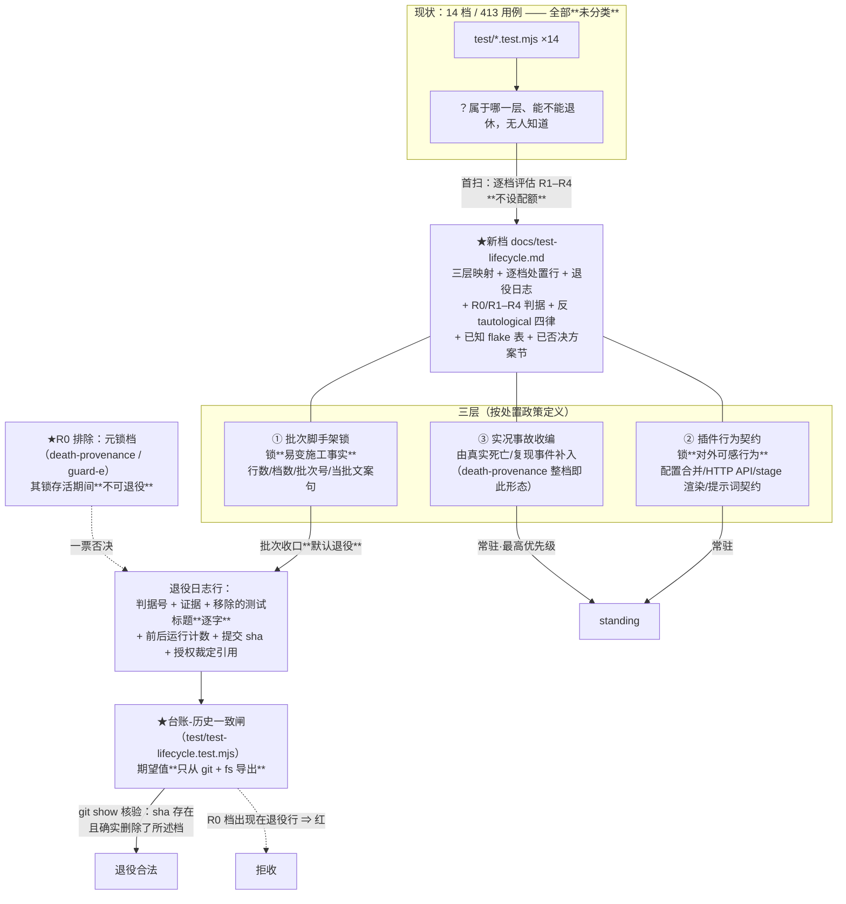
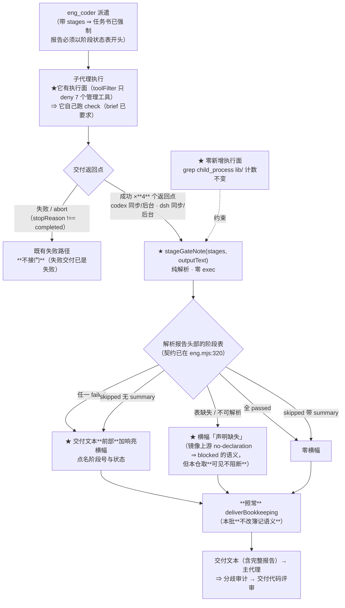

# 设计：测试生命周期三层 + 发布门 + verify 宿主侧门禁 —— 批 9

- 日期：2026-09-13
- 需求档：[`2026-09-13-test-lifecycle-requirements.md`](./2026-09-13-test-lifecycle-requirements.md)（12 用户故事 / 7 非功能标准）
- 会诊纪要：[`2026-09-13-test-lifecycle-consult-minutes.md`](./2026-09-13-test-lifecycle-consult-minutes.md)（会诊 id 1，**3/4 交付**；含 15 条父侧实测、四问裁定、六项已否决方案）
- 章节：九节（§1 背景 · §2 问题 · §3 目标 · §4 决策与理由 · §5 方案 · §6 机制伪代码 · §7 状态与 schema · §8 防偏离 · §9 边界）+ §10 受影响文件与验收 + §11 变更记录 + §12 评审落档；图示：**图 1（三层与处置流向）** / **图 2（阶段门在交付返回路径上的接线）**
- 状态：**已实施（设计评审轮次 2 `PASS` · 交付代码评审轮次 2 `PASS`；待收口提交）**

> ## ⚠️ 行号/位置引用口径（读本档前必读）
>
> 行号为 **as-of 批 8 交付后（`a3aaea9` / v0.16.0）** 实测值，会随改动漂移。**定位一律按符号名**：
>
> | 要找什么 | 检索符号 |
> |---|---|
> | 基线 sha 常量（**历史事件，禁止重锚到 HEAD**） | `AP_BASELINE_SHA` |
> | 授权例外清单（退役基线档的唯一合法通道） | `AP_TEST_AUTHORIZED` |
> | 测试档清单登记闸（**非递归**） | `readdirSync(testDir)` / T-E19 的 `existing` |
> | 阶段表**契约**（本批零改动） | `Your report MUST START with the stage status table` |
> | 阶段表渲染（本批零改动） | `function renderStagesBlock` |
> | 交付簿记（本批**不改语义**，只在其前加横幅） | `function deliverBookkeeping` |
> | 子代理工具面（证明实现者能自己跑 check） | `toolFilter: { deny:` |
> | 阶段门的接线点 | 成功交付的 **4** 个返回点（codex 同步 / codex 后台 / dsh 同步 / dsh 后台）——**实测 `deliverBookkeeping` 恰 4 处调用**（`lib/eng.mjs:747 / :802 / :874 / :1003`）；**实现交付时订正**：初稿写 5，是把主返回点与 dsh 同步数了两遍 |

---

## §1 背景

这个套件的测试**只进不出**：14 个档、413 条用例、11 673 行；`git` 全史里 `test/` **一条都没删过**（`git log --diff-filter=D -- test/` 为空）；用例数单调增长 274 → 304 → 320 → 342 → 360 → 384 → 399 → 413。

而它**没有 CI、没有 `scripts/` 目录**，发布靠 **git tag**（用户 2026-09-13 裁定）。本机是 junction 挂载 ⇒ 改完重启即生效，**没有发布步骤**。

同时，本仓的**锁会衰变**——这不是假设，是**已实证两次**的教训：

- **D-37**：一条「零改面」锚写成「工作树 vs HEAD」形态 ⇒ 只在提交前成立，之后**必然误红**（同一教训连续命中两次）。
- **批 7 分歧审计**：`AC-P13` 的静态锁**自称覆盖六子点、实测只证 4 个**，其中一条断言是 **tautological**（删掉被保护的两行它仍然绿）。审计员的定性原话是「**代码全部合规，是锁缺陷**」。

**而没有任何机制会告诉你哪把锁已经坏了**——坏掉的锁和好锁一样是绿的。

---

## §2 问题

| # | 问题 | 根因 | 证据 |
|---|---|---|---|
| **P1** | 锁衰变且无人标记 | 断言写弱时测试**照样绿** | D-37 两次返工 · 批 7 `AC-P13` tautological |
| **P2** | 台账数字会漂 | 同一事实多处手写 | **342**（交接页）vs **340**（`CHANGELOG.md:75`） |
| **P3** | 套件结构性只进不出 | 只有「追加」先例 | `git log --diff-filter=D -- test/` 空 |
| **P4** | 打 tag 前无机械检查 | 无 CI、无 `scripts/` | `package.json` 只有 `"test": "node --test"` |
| **P5** | 阶段自报没人读 | 宿主只判 `stopReason` | `lib/eng.mjs:910-918` |
| **P6** | 退役动作天然受限 | T-AP9 锁基线 10 档的 M/D | 纪要 §1-1 |

**靶心是 P1+P2**：不是「测试太多」，而是「**锁坏了没人知道**」+「**数字漂了没人知道**」。

---

## §3 目标

| # | 目标 | 验收面 |
|---|---|---|
| G1 | 每个测试档有登记行 + 写死的退役判据 | AC-1 / AC-2 |
| G2 | 元锁档不可被悄悄删除 | AC-3 / AC-4 |
| G3 | 台账数字**从 git + fs 算出**，不参与自证 | AC-4 / AC-5 |
| G4 | tag 前有一条会真的被跑的体检门 | AC-6 / AC-7 |
| G5 | 门的**非计数**断言常驻套件（保证被执行） | AC-8 |
| G6 | 阶段自报机械可见、**不阻断** | AC-9 / AC-10 / AC-11 |
| G7 | 零新执行面 / 零基线档改动 / brief 零字节改动 | AC-12 / AC-13 / AC-14 |

**非目标（一句话）**：本批**不**退役任何档、**不**建集成集目录、**不**做宿主复跑、**不**改簿记语义、**不**修 R-13 / D-31 / D-36、**不**设退役配额、**不**把 T-E19 改成递归 —— 逐条理由见 §4 与需求档 §5.1。

---

## §4 决策与理由（含否决备选）

| # | 决策 | 理由 / 否决备选 |
|---|---|---|
| **D9-1** | 三层**按处置政策定义**（不按测试风格），落点 = **台账分类，不是物理移动** | **T-AP9 锚 B 是 `--diff-filter=MD` ∩ 基线已存在档**：对基线 10 档的**任何**删改都红 ⇒ 物理移动**不可行**。且 taxonomy 住台账 ⇒ 零触碰 T-E19/T-AP9。**否决**：建 `test/integration/` 目录实体（无 runner 需求；且会撞登记制） |
| **D9-2** | **本批退役 0 档**；首扫逐档记录处置行（含「保留」及理由）；**不设配额** | 上游「9 退 4 并」是**他们的扫描结果**，不是目标；**预设配额正是假退役的制造机**。当前 14 档**无一死档**（零 skip/only/TODO） |
| **D9-3** | **R0 排除项**：元锁档（`death-provenance` / `guard-e`）在其锁存活期间**不可退役** | **唯一能「安静地」拆掉整个锁体系的路径** = 删掉锁档本身——套件**照样全绿**而锁已消失。必须明令禁止 + 交付评审一票否决 |
| **D9-4** | **反 tautological 四律**升级为 AC | 律 1 谓词写全（D-37）· 律 2 独立事实源（批 7 `AC-P13`）· 律 3 还原即红（把批 4/7/8 的实践从惯例升为 AC）· 律 4 锚不动（**禁止 HEAD 相对锚**） |
| **D9-5** | 台账-历史一致闸的期望值**只从 git + fs 导出，台账不参与推导** | 律 2：断言必须是**测试档自身之外**的事实。若「读台账再按台账自证」，tautological 在结构上可构造 |
| **D9-6** | 发布门 = **仓根脚本**（`release-check.mjs`） | **否决纯 `gate-as-test`（glm）**——**计数相等性自指、结构上不可满足**：`node --test` 的用例数**包含门自己这个测试档**，而 CHANGELOG 的 `N` 要等**全绿之后**才写 ⇒ 单次运行内不可能同时成立。**实测佐证**：批 8 的静态计数 413 是在 `test/prompt-contract.test.mjs` 落盘后才等于 CHANGELOG 的 `413` |
| **D9-7** | **但采 glm 的一半**：门的**非计数**断言做成**常驻套件内用例** | 「**不新增测试层**」≠「不新增测试」。写进脚本的东西**可能永远没人跑**，而本仓文化已把 `node --test` 当通用门 ⇒ 保真断言必须常驻 |
| **D9-8** | ~~版本一致性不做常驻测试~~ → **本裁定已被推翻并留痕**（**评审 #2 的 🔴**）：**恢复该常驻断言** —— `package.json#version` == CHANGELOG 顶部版本头。 | **本条的原始理由（「实现期与收口期不一致的时序窗口」）经评审员反驳后判定不成立**：交付时点两者**同为上一版本、是一致的**；红窗**只**在收口两步非原子时出现 ⇒ 正确处置是**加一条收口纪律**（bump 与 CHANGELOG 条目同一提交，见 §6.3），**不是砍掉断言**。**留痕纪律**：纪要 §2.1 曾把版本一致性列入常驻断言，我在此**显式登记推翻该条**（比照纪要 §2.2 对 v4-pro 的登记方式）——**不得静默改写裁定内容**；这也正是交接页纪律①所指的物种（「纪要有裁定、设计档 override」），本轮**自己又犯了它**，故本条同时作为**该纪律的第 6 次命中**记录。**仍然成立的**：**计数**相等性不进常驻测试（自指，单次运行内不可能成立）——那条与版本一致性是**两件事**，初稿把它们混为一谈 |
| **D9-9** | `verify` 取**声明式**，落点 = `eng_coder` 返回路径上的**阶段表机械核验**（单 helper） | 声明通道**已在位且是契约**（`eng.mjs:320`）；机械解析交付报告**已有先例**（`deliverBookkeeping` 解析 `Touched files:` 尾行）。**否决宿主复跑**：六条代价见纪要 §2-④（含**把模型输出当 shell 跑**的注入面、dsh 同步路径的 budgetCap 墙钟硬伤、**逆上游架构裁定**） |
| **D9-10** | 阶段门后果 = **响亮横幅 · 不阻断簿记** | **否决 v4-pro 的「跳过簿记」**：① 与上游先例相悖（`completion.mjs:70-74`/`:118-122` 明言工程模式排除机械推回）；② **`mutatedThisRun`/`touched` 描述的是磁盘真实发生了什么**——跳过簿记会让评审链**看不见真实变更**，从而**制造更糟的静默**（正是本批要治的物种）；③ 信息不可毁（主代理要靠完整报告发修复轮） |
| **D9-11** | **零 brief 改动** ⇒ 零触碰 T9 fixture | 这是**唯一**能完全避开基线锁的落点。将来要改申报格式 = 独立授权轮 |
| **D9-12** | 计数权威口径 = `node --test` 的**运行计数**（`--test-reporter=tap` 解析），**不是静态 grep** | 静态计数会把「被注释掉的 test」算进去；且 **TAP 是稳定机器格式**，人类可读格式（`ℹ pass N`）不是契约 |
| **D9-13** | tag 命名 = **`vX.Y.Z`**；`package.json#version` **不带 v** | 用户裁定 J9-8；G4 断言二者去掉前缀后相等 |
| **D9-14** | R-13 **本批不修**，只在 G6 写死预案 | 修它要改 `session-state.test.mjs`（**基线档** ⇒ 撞 T-AP9）+ 不在写域；**严禁为消 flake 顺手改基线档** |
| **D9-15** | 退役基线档的合法路径 = **三处同提交**（授权表 + T-E19 行 + 台账行 + 用户裁定） | 本批退役 0 档 ⇒ 不触发；但路径要写死，否则将来会有人「删档 + 抹掉两锁里的引用却不登记」= **绿但锁已被私有化拆除** |

---

## §5 方案

### §5.1 三层与处置流向（图 1）



**读图要点**：**没有一条箭头指向「删除文件」**。本批产出的是**分类与判据**，退役动作要等**独立授权轮**——因为对基线 10 档的任何删改都会**先撞 T-AP9**。

### §5.2 阶段门在交付返回路径上的接线（图 2）



**读图要点**：门**只读文本**（零 exec），**只加横幅**（不改簿记），**四处接线一个 helper**（防路径劈叉）。

---

## §6 机制伪代码

### §6.1 台账结构（`docs/test-lifecycle.md`）

```markdown
# 测试生命周期台账（活登记表）

> **本档是活台账，不是批次档**——批次档会过期，登记制要求单一权威。
> 机械锚在 `test/guard-e.test.mjs` 的 T-E19 清单（档清单）；本档做**理由镜像**，两者互指。

## 一、三层判据（按处置政策定义，不按测试风格）

## 二、反 tautological 四律（凡是锁都必须满足；交付评审必查）

## 三、逐档处置行
| 档名 | 用例数 | 层 | 处置 | 判据 | 理由 / 证据 |

## 四、退役日志
| 日期 | 提交 sha | 移除的测试标题（逐字） | 判据+证据 | 退役前计数 | 退役后计数 | 授权裁定引用 |

## 五、已知 flake 表
| 测试 | 症状 | 处置 |

## 六、已否决方案（防回潮）
```

### §6.2 路线一：发布门（`release-check.mjs`，仓根单文件）

```js
// release-check.mjs —— 仓根单文件、零依赖、纯 node。
// **不进 scripts/ 目录**（本仓无该目录；package.json 加一行 script 即够）。
// **零配置、零 DSH 态**（D-31/D-36 教训）：全新进程可跑，不 import config/session/token。
//
// 用法：node release-check.mjs v0.17.0     （在 git tag **之前**跑；非零退出 = 拦）

import { readFileSync, readdirSync, existsSync } from "node:fs"
import { join, dirname } from "node:path"
import { fileURLToPath } from "node:url"
import { execFileSync } from "node:child_process"

const ROOT = dirname(fileURLToPath(import.meta.url))

// ── 导出纯函数（供 test/release-check.test.mjs 做单测；律 2：断言的是外部事实）──
export function parseChangelogTopVersion(md) { /* 取首个 `## [x.y.z]` */ }
export function parseChangelogCountLine(md) { /* 取首节 `**N/N**` 的 N（含「基线 X + 本批 Y」形态） */ }
export function parseTapPass(tap) { /* 取 `# pass N`；**TAP 是稳定机器格式** */ }
export function countStaticTests(files) { /* 备用/交叉核验：`^\s*test\(` 计数 */ }
export function semverEq(a, b) { /* 去掉可选 `v` 前缀后相等 */ }

// ── 七闸 ──
// G0 语法：node --check 全部 lib/*.mjs
// G1 工作树卫生：git status --porcelain 为空（`??` 未跟踪**豁免**——viz/ 是故意不提交的）
//    + 目标 tag 不存在（git tag -l）
// G2 全量套件：node --test --test-reporter=tap <显式档清单>，退出码 0 且解析 `# pass N`
//    ★ **零重试**（重试 = 假绿机制）
// G3 计数一致：N == CHANGELOG 顶部计数
//    ★ **评审 #3 收窄**：初稿还比「交接页 §3-6 基线计数」——但交接页是**活页**、编号会漂、
//      且该行混有多处历史数字（399/384/360），**无机器契约** ⇒ **从 G3 剔除**。
//      交接页一致性降级为 **G7 人工核验项**（人眼闸，明说不机械化）。
// G4 版本一致：package.json#version == CHANGELOG 顶 `## [x.y.z]` == 传入 tag（去 v 前缀后相等）
// G5 ★ 编号保留、无闸 —— **不要顺手补一个 G5**（评审 #7：上游三环里被本仓砍掉的 lint 环
//    已由 G0 承担，G5 号段留作将来；此注记即为防误读）
// G6 flake 预案：G2 红且**失败项全部**命中台账「已知 flake 表」（今仅 R-13）⇒ 允许立即复跑**一次**
//    ★ **交付代码评审 F6 订正**：初稿写「**唯一**失败项」——实现（`gateG6`）的谓词是**每个**失败项
//      都命中 ⇒ 三处文档口径改为「**全部**命中」（取更合理的语义：将来 flake 表扩到 ≥2 条时，
//      不必因「不止一条」阻断复跑）；**反例保留**：任一失败项未命中 ⇒ 门红。行为零改动。
//    ★ **两跑结果由「人」按台账 flake 表行格式登记**
//    （日期 / 两次结果 / 处置）——**脚本只负责打印待登记内容，不写任何文档**
//    （评审 #5：发布工具不得获得文档写面；若将来要脚本写，须单列 node utf8 + U+FFFD 编码纪律）
// G7 （**人工**，明说是人眼闸）：① CHANGELOG 顶条目覆盖上一 tag 以来的 diff
//     ② 交接页基线计数与 CHANGELOG 顶部计数一致（自 G3 移出，见上）

for (const [id, name, fn] of GATES) { /* 逐个跑，红则**点名**是哪一项 + 非零退出 */ }
```

**导出的纯函数（**评审 #4**：闸级比较逻辑必须在可测面内）**：`release-check.mjs` 除解析函数外，**另导出每个闸的比较函数** `gateG3(counters) → {ok, detail}` / `gateG4(versions) → {ok, detail}` 等（**输入已解析的值，输出判定与点名详情**）。⇒ `test/release-check.test.mjs` 可用 **fixture 态**直接断言「漂移 ⇒ 红且点名哪两处」，**无需**给脚本加 `--root` 注入口、也无需触碰真实仓库。

**G2 的档清单来源**：`readdirSync(join(ROOT, "test")).filter(f => f.endsWith(".test.mjs"))`（**显式清单**，不靠 node 默认 glob ⇒ 免疫 glob 行为随版本漂移）。

### §6.3 路线二：门的常驻断言（`test/release-check.test.mjs`）

> **评审 #2 的 🔴 修复**：初稿把「版本一致性」排除在常驻断言之外（原 D9-8），理由是该检查有「实现期与收口期不一致」的时序窗口——**该理由已被评审员反驳并判定成立**：交付时点 `package.json#version` 与 CHANGELOG 顶部版本头**同为上一版本**（如同为 `0.16.0`），**是一致的**；红窗只在**收口两步非原子**时出现。⇒ **恢复该常驻断言**，并以**收口纪律**消灭红窗。

```js
// 常驻断言（**保证会被执行**——本仓文化已把 node --test 当通用门）
test("G-常驻: test/ 无 .skip / .only —— 锁住套件诚实（现状即 0 命中）", ...)
test("G-常驻: package.json#version 是合法 semver", ...)
// ★ 版本一致性（评审 #2 恢复）——**不是计数**，故无自指问题
test("G-常驻: package.json#version == CHANGELOG 顶部 `## [x.y.z]`（去 v 前缀后相等）", ...)
test("G-常驻: CHANGELOG 顶部计数行**形态**合法（可推导式）", ...)
test("G-常驻: package.json 的 dependencies/devDependencies 键集合不变（N-3 的对应 AC，评审 #9）", ...)
test("G-常驻: 档清单等值 —— 引用 T-E19，不重复造", ...)
// 门的**纯函数**单测（畸形输入）：parseChangelogTopVersion / parseChangelogCountLine /
//   parseTapPass / semverEq / **gateG3(counters) / gateG4(versions)**（评审 #4：闸级比较逻辑须在可测面内）
```

> **★ 配套收口纪律（消灭红窗）**：**`package.json#version` 的 bump 与 CHANGELOG 新条目的写入必须在同一次编辑/同一个提交内完成**。写入 `METHODOLOGY.md` 的批收口清单。⇒ 该常驻断言在全生命周期内恒真；若有人把两步拆开，它会**立刻红**——那正是我们要的（它抓的是收口动作不原子，而不是抓版本本身）。
>
> **计数相等性为何仍不进常驻测试**（与版本一致性的**关键区别**）：`node --test` 的用例数**包含本测试档自己**，而 CHANGELOG 的 `N` 要等全绿之后才写 ⇒ **自指、单次运行内不可能成立**。版本一致性**不含**此类自指。

### §6.4 路线三：阶段门 helper（`lib/eng.mjs`）

```js
/**
 * 阶段门（批 9 / D9-9/D9-10）：解析交付报告**头部**的阶段状态表。
 * **只读文本、零 exec、不改簿记语义**（D9-10）——产出的是**横幅**（可见）而非**阻拦**。
 * 契约来源：任务书已强制「report MUST START with the stage status table」（renderStagesBlock）。
 * 上游对照：verify 是声明式机械门禁；本仓取**可见不阻断**，因工程模式刻意用 flow-driven review
 *          而非 per-turn mechanical pushback（thincoder completion.mjs:70-74 / :118-122）。
 */
function stageGateNote(stages, outputText) {
  if (!Array.isArray(stages) || stages.length === 0) return ""   // 未带 stages ⇒ 不核验
  const head = outputText.slice(0, 4000)                          // 表在头部（契约），只扫头部
  const rows = parseStageTable(head)                              // 期望列：| Stage | Status | check summary |
  if (rows === null) return BANNER("stage verification: UNDECLARED — 报告未以阶段状态表开头")
  const bad = rows.filter(r => r.status === "failed")
  const noReason = rows.filter(r => r.status === "skipped" && !r.summary.trim())
  if (bad.length === 0 && noReason.length === 0) return ""
  const parts = []
  if (bad.length) parts.push("FAILED stage " + bad.map(r => r.n).join(","))
  if (noReason.length) parts.push("skipped without a summary " + noReason.map(r => r.n).join(","))
  return BANNER("stage verification: " + parts.join(" · "))
}
```

**接线**：**4 个成功交付返回点**各调一次（codex 同步 / codex 后台 / dsh 同步 / dsh 后台——**实测 `deliverBookkeeping` 恰 4 处调用**）；**失败 / abort 返回点不接**。helper 单一实现（`D-26-⑥` 纪律）。**实测形态**：每处 `return` 均以 `stageGateNote(stages, …) + …` **前置拼接** ⇒ 横幅必然在文本**最前**。

**横幅形态**（`warnPrefix` N4 通道先例）：置于交付文本**前部**，不改动报告正文一个字节 ⇒ **US-9 的可读性保住**。

### §6.5 台账-历史一致闸（`test/test-lifecycle.test.mjs`）

```js
// ★ 律 2（独立事实源）：期望值**只从 git + fs 导出**——台账**不参与推导**。
// ★ 律 4（锚不动）：基线用固定 sha 常量，**禁止** HEAD 相对锚。
const BASELINE_SHA = "2e6ca8b"   // 历史事件常量；**不得**改成 HEAD/工作树形态（D-37 的原罪）

test("台账-历史一致：退役行的 sha 存在且**确实删除**了所述档", ...)   // git show 核验
test("台账↔fs 双射：处置行的档名集合 == readdirSync(test) 的档集合", ...)
test("R0：元锁档（death-provenance / guard-e）**不得**出现在退役行", ...)  // 一票否决项
test("四方一致：台账 ↔ fs ↔ T-E19 清单 ↔ **退役授权面**", ...)
//   ★ 评审 #6：第四方的谓词**不是等值**——`AP_TEST_AUTHORIZED` 是**例外清单**。
//   **评审轮次 2 的 #16 订正**：其当前值为 `["test/design-review-guard.test.mjs"]`（**非空**，
//   含批 6 的授权档）——初稿写「当前为空」是**事实错记**，会让实现者误判第四方基线。
//   正确谓词 = 「*被标记为退役、且属于基线集合的档*」⊆ `AP_TEST_AUTHORIZED`
//   （基线后档不受 T-AP9 约束，无需授权）。按字面做等值比较必错。
test("台账数值**独立算得**：每档用例数由本测试自己用 fs+正则计数，不信台账数字", ...)
```

---

## §7 状态与 schema

| 面 | 变更 | 说明 |
|---|---|---|
| `docs/test-lifecycle.md` | **新增**（活台账） | 三层 + 处置行 + 退役日志 + R0/R1–R4 + 四律 + flake 表 + 已否决方案 |
| `release-check.mjs` | **新增**（仓根） | 七闸，零依赖纯 node；导出纯函数供单测 |
| `test/release-check.test.mjs` | **新增** | 门的常驻断言（**非计数**）+ 纯函数单测 |
| `test/stage-gate.test.mjs` | **新增** | 阶段门三态 + **4** 返回点接线断言（结构配对） |
| `test/test-lifecycle.test.mjs` | **新增** | 台账-历史一致闸 + 四方一致 |
| `lib/eng.mjs` | 修改 | 单 helper `stageGateNote` + **4** 处接线（**实现交付时订正**：初稿写 5，把主返回点与 dsh 同步数了两遍）；**不改** `deliverBookkeeping` 语义 |
| `package.json` | 修改 | 加一行 script（`release:check`） |
| `test/guard-e.test.mjs` | 修改 | T-E19 清单登记**三个**新档（一行内追加）+ **同处注明理由与用户裁定引用**（评审 #10；**评审轮次 2 的 #18**：此处初稿漏了后半句，与 AC-15 口径不齐——**自检纪律提示**：改了 AC 就要 grep 全档找同名条目） |
| `docs/README.md` | 修改 | 登记台账 + 三份批 9 文档 |
| 运行时行为 | **仅一处可见变化** | 阶段表不合格时交付文本**前部**多一条横幅；**簿记语义零变化** |

---

## §8 防偏离

### §8.1 零改面（验收拒收项）

| # | 面 | 判据 |
|---|---|---|
| 1 | **基线 10 档测试内容** | 零 diff（T-AP9 绿） |
| 2 | **T9 fixture 字节** | `test/fixtures/coder-brief-with-docs.txt` 字节相同 |
| 3 | **`renderStagesBlock` / `buildCoderBrief` / `validateStages` 输出** | 零改动（逐字） |
| 4 | **`deliverBookkeeping` 的簿记语义** | 零改动（只在**其前**加横幅字符串） |
| 5 | **`child_process` 调用点** | `lib/**` 计数不变（零新执行面） |
| 6 | **四个提示词** | 零 diff |
| 7 | **`death-provenance.test.mjs`** | 零 diff（退役 0 档 ⇒ 授权清单不必动） |
| 8 | **T-E19 改为递归** | **禁止**——非递归是**特性**（集成集不入清单） |

### §8.2 机验锚（防静默退化 —— **谓词写全三件事**）

> **律 1（谓词写全）**：每条锚必须写清 **何时点**（历史提交 / 工作树 / 基线集合）· **何谓改**（新增 / 修改 / 删除分开）· **自指**（锚所在文件是否在集合内）。

| # | 锚 | 谓词（持久形态） |
|---|---|---|
| **N1** | 零退役 + **台账覆盖面 = 交付时全档** | **对当前工作树**：`readdirSync(test)` 的 `.test.mjs` 集合 **==** 台账处置行的档集合（**交付时为 17 == 17**：首扫 **14** + 本批新增 **3**——**评审 #1 的 🔴 修复**：初稿把此处写死为 14，与「本批新增 3 个测试档」直接冲突，照文实施必红）；`git log --diff-filter=D -- test/` 对**本批提交**为空。**自指说明**：台账**不在** `test/` 内 ⇒ 它不是集合成员；但**本批三个新档在集合内**，故台账必须覆盖它们 |
| **N2** | 零基线档改动 | **对基线集合**（`git ls-tree 2e6ca8b`）：`git diff --diff-filter=MD 2e6ca8b -- test/` ∩ 基线档 = **∅**（`AP_TEST_AUTHORIZED` 未扩） |
| **N3** | 元锁档存活 | **当前工作树**存在 `death-provenance.test.mjs` + `guard-e.test.mjs`；且**不在**任何退役行 |
| **N4** | 独立事实源 | `test/test-lifecycle.test.mjs` 源文件**不含**「先读台账再按台账自证」的路径（机验：断言所用的期望值均来自 `execFileSync("git",…)` / `readdirSync` / 字面常量） |
| **N5** | 零新执行面 | `grep -c "child_process" lib/**` == 1（仅 `codex-adapter.mjs`）——**本批不得增加** |
| **N6** | brief 零改动 | `test/fixtures/coder-brief-with-docs.txt` 的 sha256 == 交付前值 |
| **N7** | **簿记点 = 接线点 = 4**（**实现交付时订正**：初稿写 5——把主返回点与 dsh 同步数了两遍；实测 `deliverBookkeeping` 恰 4 处调用） | `lib/eng.mjs` 中 `deliverBookkeeping(` 调用处数 == **4**；紧跟其后的 `return` 中调用 `stageGateNote` 的处数 == **4**（**结构配对**）；失败/abort 返回点处 == **0** |
| **N8** | 门可独立跑 | 全新进程 `node release-check.mjs <tag>` 可执行（不 import plugin 内任何模块） |
| **N9** | 台账登记 | `docs/README.md` 含 `test-lifecycle.md` |

---

## §9 边界

| # | 边界 | 行为 | 理由 |
|---|---|---|---|
| 1 | **未带 `stages` 的派遣** | **不核验** | 自由文本段检测不可靠（明言放弃）；该路径已有 F13 漂移警告兜底 |
| 2 | **阶段表缺 `summary` 列** | 视为 `skipped` 无理由? **否**——解析按列位取值，缺列则该行判为**不可解析** ⇒ 走 UNDECLARED | 宁可响亮，不猜 |
| 3 | **报告很长、表在头部但超出扫描窗** | 只扫前 **4000** 字符 | 契约要求表在**最前**；超窗即违约 ⇒ UNDECLARED |
| 4 | **G2 遇到 R-13** | 允许**复跑一次**，两跑都记台账；仍红 = 门红 | J9-7：不冤杀、不纵容 |
| 5 | **G1 遇到未跟踪文件** | `??` **豁免**（`viz/` 是故意不提交的） | 否则门永远红 |
| 6 | **G3 的计数不一致**（**评审轮次 2 的 #17 订正**：G3 已收窄为**两处**，初稿残留「三处」） | 点名**哪两处**不一致（不是「计数错」） | 342/340 那族的可诊断性 |
| 7 | **退役基线档（将来）** | 三处同提交：`AP_TEST_AUTHORIZED` + T-E19 行 + 台账行 + 用户裁定 | D9-15；本批退役 0 档 |
| 8 | **元锁档进入退役行** | **一票否决**（评审拒收） + N3 锚红 | D9-3 |
| 9 | **CHANGELOG 顶部计数行缺失** | G3 红并点名 | 计数行是**机器契约** |
| 10 | **tag 已存在** | G1 红（防覆盖） | — |
| 11 | **D-36（重启后 token 空）** | 本批不修；实施按交接页 §3-2 走（过一次 `eng_coder` 回填） | 属批 10 |

---

## §10 受影响文件全清单与验收

### §10.1 实施域（eng-coder 写域）

| 文件 | 改动 | 类型 |
|---|---|---|
| `docs/test-lifecycle.md` | **新增**：活台账六节 | **新增** |
| `release-check.mjs` | **新增**：七闸 + 导出纯函数 | **新增** |
| `test/release-check.test.mjs` | **新增**：常驻断言 + 纯函数单测 | **新增** |
| `test/stage-gate.test.mjs` | **新增**：阶段门三态 + **4** 返回点接线（结构配对） | **新增** |
| `test/test-lifecycle.test.mjs` | **新增**：台账-历史一致闸 + 四方一致 | **新增** |
| `lib/eng.mjs` | 修改：单 helper + **4** 处接线（**不改簿记语义**） | 修改 |
| `package.json` | 修改：加一行 script | 修改 |
| `test/guard-e.test.mjs` | 修改：T-E19 清单追加**三个**新档 + 注明理由与用户裁定引用 | 修改（用户授权） |
| `docs/README.md` | 修改：登记台账 + 三份批 9 文档 | 修改 |

**不改动**：基线 10 档内容 · `test/fixtures/*` · 四个提示词 · `death-provenance.test.mjs` · `renderStagesBlock`/`buildCoderBrief`/`validateStages` · `deliverBookkeeping` 语义。

### §10.2 用例与验收标准

| # | 验收标准 | 形态 |
|---|---|---|
| **AC-1** | `docs/test-lifecycle.md` 存在且含六节；**交付时的全部 17 档逐行**登记（**首扫 14 档** + **本批新增 3 档**；每行含档名 + 用例数 + 层 + 处置 + 理由）。**评审 #1 的 🔴 修复**：初稿写「14 档逐行」，与本批新增 3 个测试档冲突 ⇒ 改为「交付时全档 = 17」 | 核心 |
| **AC-2** | 台账含 R1–R4 判据（各带举证要求）+ **R0 排除项**明文 | 核心 |
| **AC-3** | **退役日志为空**（本批退役 0 档）——可机验 | **零回归** |
| **AC-4** | 台账-历史一致闸落地：期望值只从 git + fs 导出；台账不参与推导 | **核心** |
| **AC-5** | 四方一致（台账 ↔ fs ↔ T-E19 ↔ 授权表）；每档用例数由测试**独立算得** | 核心 |
| **AC-6** | `node release-check.mjs <tag>` 七闸齐全；**六条机械闸（G0/G1/G2/G3/G4/G6）各有「破坏 → 红」变异自证**；**G7 单列为人工核验项**（评审 #8：人眼闸不可机械变异） | **核心** |
| **AC-7** | G3 对「计数漂移」态 fixture 红且**点名漂移项**；G4 对「版本不一致」态红 | **核心** |
| **AC-8** | 常驻断言在套件内且绿：无 skip/only · semver · **★版本一致性（`package.json#version` == CHANGELOG 顶部 `## [x.y.z]`，评审轮次 2 的 #20 补挂点）** · 依赖键集合不变 · CHANGELOG 形态 · 档清单引用 T-E19 | 核心 |
| **AC-9** | 阶段门三态各一用例：全 passed ⇒ 零横幅；任一 failed ⇒ 点名阶段号；表缺失 ⇒ UNDECLARED | **核心** |
| **AC-10** | `skipped` 无 `summary` ⇒ 横幅；有 ⇒ 零横幅 | 核心 |
| **AC-11** | **4** 个成功返回点各有接线断言；失败返回点**反向断言无横幅**。**实现交付时的订正（父侧数错）**：初稿写「**5** 个成功返回点：4 个路径 **+ 主返回点**」——**把主返回点与 dsh 同步数了两遍**：`deliverBookkeeping` 调用点与紧随其后的 `return` **同属一个返回点**。**实测 `deliverBookkeeping` 恰 4 处调用**（`lib/eng.mjs:747 / :802 / :874 / :1003`），故接线数 = **4**。实现者按实测 4 接线，并把「**接线数 == 簿记数**」做成**结构配对断言**（漏接/劈叉/多接皆红）⇒ 断言强度不降 | **核心** |
| **AC-12** | `child_process` 在 `lib/**` 的计数 == 1（零新执行面）；**另**（评审 #9 / N-3）：`package.json` 的 `dependencies` / `devDependencies` 键集合不变（现状为空） | 零回归 |
| **AC-13** | 基线 10 档零 diff（`git diff --diff-filter=MD 2e6ca8b -- test/` ∩ 基线档 = ∅）——**评审 #11** 订正旗标（初稿写的旗标无效），**评审轮次 2 的 #19** 订正 markdown 码段内的 `**` 字面污染 | **零回归** |
| **AC-14** | T9 fixture 字节相同；`renderStagesBlock` 输出零改动 | **零回归** |
| **AC-15** | T-E19 清单含三个新档；**且登记处注明「理由 + 用户裁定引用」**（评审 #10 / N-5：设计初稿只写「一行内追加」，理由与裁定注记无处落） | 零回归 |
| **AC-16** | 全量 `node --test` 全绿（基线 **413** + 新增），既有测试档中**仅** `guard-e.test.mjs` 有改动 | 收口 |

### §10.3 建议 stages（给 eng_coder）

| stage | goal | 检查 |
|---|---|---|
| 1 | `docs/test-lifecycle.md` 六节 + **首扫 14 档**处置行（逐档评估 R1–R4，倾向「保留」但不设配额） | 读档核对首扫行数 = 14 |
| 2 | `test/test-lifecycle.test.mjs`：台账-历史一致闸 + 四方一致（**含变异矩阵**）。**时序裁定（评审轮次 2 的 #21 + 实现交付时的第二次命中）**：**台账与 T-E19 清单都必须随新档在同一 stage 内登记**——否则本 stage 的双射（fs）与等值（T-E19）两条腿会先红。⇒ 本 stage **同时**触及 `test/guard-e.test.mjs` | `node --test test/test-lifecycle.test.mjs` |
| 3 | `lib/eng.mjs` 的 `stageGateNote` + **4** 处接线；**第 15 行已随 stage 2 落地登记，本 stage 无新行**（**交付评审 #5 订正**：初稿写「落地即登记第 15 行」，但 #21 的时序裁定已把该行挪到 stage 2；台账 `:147` 已如实登记该分歧） | `node --check lib/eng.mjs` |
| 4 | `test/stage-gate.test.mjs` 三态 + 4 接线 + 失败点反向；**落地即登记台账（第 16 行）与 T-E19 清单** | `node --test test/stage-gate.test.mjs` |
| 5 | `release-check.mjs` 七闸 + 导出**解析函数与闸级比较函数** | `node release-check.mjs v0.0.0-test`（应红且**点名**） |
| 6 | `test/release-check.test.mjs` + `package.json` script；**落地即登记第 17 行与 T-E19 清单** | `node --test test/release-check.test.mjs` |
| 7 | T-E19 终局核对（三档已在各自 stage 登记）+ `docs/README.md` 登记 + **核对台账 = 17 行**。**实现交付时订正（同一族的第二次命中）**：初稿把 T-E19 登记只排在本 stage，但 §6.5 的「四方一致」含 `台账 ↔ fs ↔ **T-E19 清单**`**等值**腿 ⇒ 新档一落地（fs=15）而 T-E19 仍 13，**stage 2 自查必红**——这正是初稿为**台账**侧修掉的 #21，**漏在 T-E19 侧**。⇒ 裁定：#21 的落地纪律**同样施加于 T-E19**，**每个新门档在其落地的同一 stage 内登记**（stage 2 / 4 / 6），本 stage 只做终局核对 | `node --test test/guard-e.test.mjs` + 读档核对行数 = 17 |
| 8 | 收口：全量 + 锚 N1–N9 | `node --test` |

---

## §11 变更记录

| 日期 | 变更 |
|---|---|
| 2026-09-13 | 首版（设计待评审）：会诊 id 1 **3/4 交付** → 九节 + 图 1/图 2；D9-1…D9-15；US-1…US-12；AC-1…AC-16；锚 N1…N9；§10.3 八 stage。三项用户裁定已落：形态全做 · R-13 不根治 · tag 带 `v` |
| 2026-09-13 | **设计评审轮次 1 修正块（§12.1）**：`VERDICT: FAIL`（🔴2 · 🟡5 · 🔵5，job `advisor-dsh-1`）。**两条 🔴 均成立**：① 台账覆盖面自相矛盾（三处写死 14，而本批新增 3 档 ⇒ 交付时 17）⇒ 四处同订正；② **我静默改写了自己纪要里的裁定**（版本一致性：纪要说**做**、设计说**不做**）⇒ 已恢复该常驻断言 + 显式登记推翻 + 补收口纪律）。🟡/🔵 五条：G3 收窄为两处（交接页无机器契约）· 门导出**闸级比较函数**使判定可测 · G6 登记由**人**执行（脚本不写文档）· 四方一致的第四方谓词定义为**子集**而非等值 · 闸 ID 跳号加注记 · AC-6 变异限定六条机械闸 · 依赖不变并入 AC-12 · T-E19 登记补理由与裁定引用 · 修正 `--diff-filter` 旗标笔误与接线点表述。**本轮记为交接页纪律①（裁定写进纪要 ≠ 设计档兑现）的第 6 次命中** |

---

## §12 评审落档

### §12.1 设计评审轮次 1 落档（2026-09-13 —— `VERDICT: FAIL`，job `advisor-dsh-1`）

**🔴2 · 🟡5 · 🔵5 = 12 条。** 评审员完整读了四份档，并指出**两条硬伤**——其中一条**正是我自己刚写下的纪律被违反**。

| # | 级别 | 内容 | 处置 |
|---|---|---|---|
| **1** | 🔴 | **台账覆盖面自相矛盾，照文实施必红**：三处写死「14」（AC-1 行数 · stage 1 检查 · 锚 N1），而本批**新增 3 个测试档** ⇒ 交付时 `readdirSync(test)` 是 **17**，与 §6.5 的双射断言冲突。实现者无论怎么走都会踩一条 AC | **已修**：台账覆盖面定为**交付时全档 = 17**（首扫 14 + 本批新增 3）；AC-1 / N1 / stage 1 / stage 7 四处同步订正；N1 补**自指说明**（台账不在 `test/` 内，但三个新档在集合内） |
| **2** | 🔴 | **裁定被静默改写**：纪要 §2.1 已把「版本一致性」列入常驻断言，而设计 D9-8 + §6.3 + 需求档 §5.1-9 三处都写**不做**，**且未按纪律留痕该 override**。评审员还**反驳了我的时序理由**：交付时点 package.json 与 CHANGELOG 顶部**同为上一版本、是一致的**，红窗只在收口两步非原子时出现 | **已修（采纳反驳）**：§6.3 **恢复该常驻断言**；D9-8 改写为**显式登记推翻**（比照纪要 §2.2 的留痕方式）；补**收口纪律**（bump 与 CHANGELOG 条目同一提交）以消灭红窗；并**把本轮记为交接页纪律①的第 6 次命中**——我 15 分钟前刚写下它，随即又犯 |
| **3** | 🟡 | G3 的「交接页 §3-6 基线计数」**无机器契约**（活页、编号会漂、该行混有多处历史数字） | **已修**：G3 **收窄为两处**（运行数 == CHANGELOG）；交接页一致性降级为 **G7 人工核验项** |
| **4** | 🟡 | AC-7 要断言「漂移 ⇒ 红且点名」，但 `release-check.mjs` 的 ROOT 由 `import.meta.url` 定死、只导出解析函数 ⇒ **判定逻辑不在可测面内** | **已修**：要求**另导出闸级比较函数** `gateG3(counters) → {ok, detail}` / `gateG4(versions)` 等 ⇒ fixture 态可直接断言，无需 `--root` 注入口 |
| **5** | 🟡 | G6 的「两跑结果都记台账」**未指定谁写、写哪、什么格式**；若由脚本写文档，发布工具就获得了**文档写面** | **已修**：明确**由人**按 flake 表行格式登记；**脚本只打印待登记内容，不写任何文档** |
| **6** | 🟡 | 「四方一致」对 `AP_TEST_AUTHORIZED` 这一方的**谓词未定义**（它是**例外清单**，按字面做等值比较必错） | **已修**：谓词改为「*被标记为退役、且属于基线集合的档*」⊆ `AP_TEST_AUTHORIZED`（基线后档不受 T-AP9 约束，无需授权） |
| **7** | 🔵 | 闸 ID **跳过 G5** 且无解释 | **已修**：加注记「G5 号段保留、无闸——不要顺手补一个」 |
| **8** | 🔵 | AC-6 的「每条闸都有变异自证」按字面**包含 G7 人眼闸**（不可机械变异） | **已修**：限定为**六条机械闸**（G0/G1/G2/G3/G4/G6）；G7 单列人工核验项 |
| **9** | 🔵 | N-3 的「依赖不变」**无对应 AC** | **已修**：并入 AC-12（`dependencies` / `devDependencies` 键集合不变） |
| **10** | 🔵 | N-5 要求 T-E19 登记「注明理由与用户裁定」，设计只写「一行内追加」 | **已修**：§7 与 AC-15 补理由与裁定引用的落点 |
| **11** | 🔵 | AC-13 的 git 旗标写成 `--filter=MD`（**无效旗标**，正确为 `--diff-filter=MD`）；另 §首「5 个 return 点」只列 4 条路径 | **已修**：旗标订正。**接线点表述**：**当时**统一为「4 个路径 + 主返回点 = 5」——**该表述在实现交付时被证伪**（主返回点与 dsh 同步是**同一个**返回点），见 §12.3 的订正：**实测 = 4** |
| **12** | 🟡 | 交接页 §1 工作树快照仍写「批 7 已交付待提交」，与同表批 8 行矛盾 | **收口时修**（父侧文档层职责） |

> **评审员的定性值得逐字记**：「这不是『设计比纪要更细』，而是**同一机制在裁定档与设计档中给出相反清单**。本仓自己的纪律（交接页 §6-①）与纪要 §2.2 的留痕先例都要求：要么兑现裁定，要么显式登记推翻。**当前两头都没做**。」
>
> **本轮的真正教训（第 6 次同族命中）**：**「裁定写进纪要 ≠ 设计档兑现」这条纪律我写下它之后，立刻又违反了**——而且违反的方式是**静默改写**（改写我自己 20 分钟前裁定的内容）。说明**「知道纪律」与「执行纪律」之间仍缺一个机械步骤**。已据此在 §12.2 登记一项流程改进候选：**设计档交付前，把本批纪要的裁定清单逐条 grep 进设计档正文做交叉自检**（不靠记忆）。

### §12.2 轮次 2 落档（2026-09-13 —— **`VERDICT: PASS`**，job `advisor-dsh-2`）

**两条 🔴 经读盘复核确认已修**（评审员实跑了侧证：`test/` 恰 14 个 `*.test.mjs` ⇒ 14+3=17 自洽；`package.json:4` 与 `CHANGELOG.md:5` 版本锚一致，印证版本一致性断言的理由成立）。**残留 9 条**，本轮**全部修掉**（无一延后除 #12）：

| 新# | Orig# | 级别 | 内容 | 处置 |
|---|---|---|---|---|
| 13 | 1 | 🟡 | **需求档 US-1 仍写「14 档逐行」**（跨档滞后） | **已修** → 17 档（首扫 14 + 新增 3） |
| 14 | 2 | 🟡 | **需求档 §5.1-9 仍写「不把版本一致性做成常驻测试」**（与设计相反） | **已修** → 该项**作废**并注明 D9-8 的显式推翻与收口纪律 |
| 15 | 3 | 🔵 | 需求档 US-6 未随 G3 收窄同步 | **已修** → 剔除交接页项并注明降级 |
| 16 | 6 | 🟡 | **事实错记**：`AP_TEST_AUTHORIZED`「当前为空」——实测为 `["test/design-review-guard.test.mjs"]`（**非空**） | **已修** → 订正为实际值并标注错记 |
| 17 | 3 | 🔵 | 边界表残留「G3 的**三处**计数」（已收窄为两处） | **已修** |
| 18 | 10 | 🔵 | §7 的 T-E19 行未含理由/裁定落点，与 AC-15 口径不齐（§12.1 自称已补，**实未补**） | **已修** → §7 与 §10.1 两处同补 |
| 19 | 11 | 🔵 | AC-13 的 markdown 码段内 `**` 成为**字面字符**（照抄不是有效命令）；图 2 仍只列 4 条路径 | **已修** → 码段清理；图 2 与 §首表述统一 |
| 20 | 2 | 🔵 | AC-8 枚举未纳入 #2 恢复的常驻断言 ⇒ **恢复的断言缺 AC 挂点** | **已修** → AC-8 补版本一致性 |
| 21 | 1 | 🔵 | **时序歧义**：stage 1 说「各 stage 落地后补登」、stage 7 说「一次性补登 14→17」——若按 stage 7 一次补登，stage 2 的双射断言会在 fs=15/台账=14 时先红 | **已修** → 裁定「**三个新门档各在其落地的同一 stage 内同步登记**」，stage 7 只核对 17 |
| 12 | 12 | 🟡 | 交接页 §1 工作树快照陈旧（仍写「批 7 待提交」） | **收口时修**（父侧文档层职责） |

> **评审员给出的可操作建议（已采纳为流程）**：「需求档三行（#13/#14/#15）建议在进入实施前随设计档一并 **grep 式同步**。」⇒ 本轮就是这么做的——**用 grep 找同名条目而不是靠记忆**。这正是 §12.1 末尾登记的流程改进候选的**首次执行**，而且它立刻又抓出一条我自称已改而实际没改的（#18：§12.1 写「§7 与 AC-15 补…」，§7 实未补）。

### §12.3 分歧审计与修复轮落档（2026-09-13 —— 独立子代理 `8c6b419f`，只读 + 探针）

**审计结论：`DIVERGENCE: 6 items（🔴1 🔵5）`。** 候选的**零改面核心经实测为真**，且审计员用 `git diff --numstat` 给出了 `test/guard-e.test.mjs` 的精确 diff（3 个 hunk，**无一条断言谓词被触碰**）。

| # | 级别 | 内容 | 处置 |
|---|---|---|---|
| **1** | 🔴 | **一条永不失败的断言**（`test/test-lifecycle.test.mjs:146-147`）：`R0_FILES` 是**裸档名**，而 `authorized` 是 `AP_TEST_AUTHORIZED` 的**仓库相对路径**（`test/…`）⇒ `includes` **恒为假**、断言**恒真**。审计员实测：把授权表改成含**真实形态**的 R0 档，该断言**仍然通过**。**同档 `:151-152` 的注释自己就写着「按裸档名比对必然全 miss」**——**本批最讽刺的缺陷：一个专门用来消灭假锁的档案里出现了假锁** | **已修**：改为同口径比对（`"test/" + f`）；**另加一条「授权面口径锁」**——断言授权表每条必须是 `test/<裸名>.test.mjs` 形态，否则下层断言会**再次静默退化为恒真**。**变异自证**：授权表临时加 `test/death-provenance.test.mjs` ⇒ T-LC4 **红**／exit 1（旧形态同变异下仍绿）；还原后 sha256 逐字节一致 |
| **2** | 🔵 | `test/stage-gate.test.mjs:11` 把**接线前**的旧行号（`:665/:719/:790/:918`）标为「**实测**」 | **已修** → 实测值 `lib/eng.mjs:747 / :802 / :874 / :1003`，并标注旧值出处（纪要 §2-④ 初稿） |
| **3** | 🔵 | 台账证据列数字**掉了一位**（「159 行」应为「4 159 行」），且占比分母取自已过期的合计 | **已修**：订正为 **4611 行（占 17 档合计 14214 行的 32.4%）**，并把**完整口径**写进单元格（含 `split("\n")` 与分母构成）⇒ **自文档、可复核**。**父侧裁定**：采实现者的 32.4% 而非审计员的 35.1%——后者我无法用其口径复现，而前者给了可验的完整口径。**另报**：会诊纪要 §1-13 的原始数字本身有误（该档从未是 4159 行）——纪要**不在**本轮写域，**留待收口处置** |
| **4** | 🔵 | `test/stage-gate.test.mjs:73` 断言**弱于其自身消息**（只证「两次调用相等」，若两者都返回空串仍绿） | **已修** → 改为对两个输入**各断包含 UNDECLARED**（确定结果而非关系）。**变异自证**：UNDECLARED 分支临时返空串 ⇒ 4 pass / **2 fail**（旧形态同变异下仍绿）；还原后 sha256 一致 |
| **5** | 🔵 | **未自白的 fail-open**：无 git 时多条断言降级为 `console.warn` 而整体仍报 PASS（审计员定性为**设计缺口非代码 bug**） | **已修（父侧裁定：保行为、自白到档）**：测试档首与台账 §二各加**显式自白**——无 git 时**哪些断言降级**（基线集合等值 + 连带跳过的第四方子集谓词与三条合成行自证、变异 (2)(4)、git 全史零删除事实基）、**不降级**的白名单、**为何降级而非强红**（否则套件无法从导出环境跑）、以及**代价明说**。**实现者另用「PATH 剥掉 git」实跑验证**自白与行为一致 |
| **6** | 🔵 | **设计档残留五处「5 处返回点」**（属父侧文档） | **已修**（父侧直接改）：图 2 · 读图要点 · §7 · §10.1 · §12.1 #11 处置共五处，与已订正的 §首/§12.2/AC-11/N7 口径统一为 **4** |

> **本批登记的第二条新纪律**（与 §12.1 的「grep 式自检」并列）：**新写的锁必须立刻做变异自证——而且变异要打在「真实会发生的形态」上**。🔴#1 的教训正是：实现者做了 23 次变异却漏掉这一条，因为它构造变异时**下意识用了与断言一致的口径**（裸名），而真实世界里那两处的口径本就不同。⇒ 纪律：**变异值要取自「实现/配置的真实形态」，不是取自断言自己的写法**。

### §12.4 交付代码评审落档（2026-09-13）

**本轮（轮次 1）＝ `VERDICT: FAIL`**（🔴1 · 🟡3 · 🔵3）：🔴 = **G6 复跑预案结构性失效**（复跑成功不回写 G2/G3、而复跑只在第一跑红时触发 ⇒ 「放行」永远不可能发生，**死代码**）· 🟡 = 需求档 US-9 漏同步「5 个返回点」· 台账 §四 退役行口径与核验器不一致（埋未来假红）· 文档态陈旧 · 🔵 = 设计档 stage 3 残留旧指令 · G6 谓词比规格宽 · `semverEq("v","v")` 假绿。**全部已修**（代码面经修复轮，见台账 §七 变更记录；文档面由父侧直接改）。

**轮次 2 ＝ `VERDICT: PASS`**（🔴0 · 🟡1 · 🔵7）：F1 修复经读盘核实为真（回写 + 退出码**同源实现** + 结构正则锁三重保障）。新增 8 条**全部为文档态滞后与小口径问题**（README 版本/计数超前 · G6 的 `g2Ok` 谓词双份 · 「放行」措辞歧义 · flake 登记 label 取首行而非实际命中项 · `hasGit` 死代码 · 需求档 §5.2 计数误记 · 两档状态行 · §12.4 空占位）——**全部已修**（文档面父侧直接改，代码面见台账 §七）。

> **本节的空占位由此回收**（轮次 2 的 🔵#8）。两轮修复轮的**逐条落点**以 `docs/test-lifecycle.md` §七 变更记录为准（台账是活档，本档是设计记录）。

**轮次 3 ＝ 收尾修复轮（评审轮次 2 的四条 🔵，**全部代码面**，写域恰为 `release-check.mjs` + 两档测试）**：

| 条 | 落点 | 修法 |
|---|---|---|
| 🔵#2 | `release-check.mjs` G2 段（`const g2r = gateG2({…})`）→ G6 调用点（`g2Ok: g2r.ok`） | G6 **复用**已算出的 gateG2 结果对象；第二份谓词 `first.exitCode === 0 && first.fail === 0` **删除**（它比 gateG2 少 `pass === null` 与 `pass <= 0` 两条红条件） |
| 🔵#3 | 新增导出 `rerunOutcomeClaim(exitCode)`；G6 成功分支的落款 + `flakeRegistrationBlock` 第 4 形参 `rerunExit` | 「放行」二字**只**在机械闸总退出码 0 时出现；登记块落款改按**汇总**退出码（第二跑绿 ≠ 汇总绿）。**措辞比原样建议更严一档**：非 0 分支连「放行」二字都不出现（写「不得发布（以机械闸汇总为准）」）⇒「打印文本含不含『放行』」成为可机验判据 |
| 🔵#4 | `flakeRegistrationBlock` 首列 | 恒用 `names.join(" / ")`（两跑失败项并集）；删掉 `entries[0]` 依赖**及随之无用的 `entries` 形参**（留着就是新的死参） |
| 🔵#5 | `test/test-lifecycle.test.mjs` 的 git 读取器注释处 | 删除定义后从未被调用的 git 可用性探测函数（fail-open 判定实际走 `gitRead(...) === null` 内联）；**行为与自白口径零改动**，注释以拼装写法登记（免成检索命中源） |

> **本轮发现的时序约束（如实登记）**：新增**顶层** `test(` ⇒ `T-LC2` 红（台账 §三 的用例数必须等于 fs 实测），而 `docs/test-lifecycle.md` **不在本轮写域**。⇒ 断言**并入既有用例**（`G-形态` / `G-纯函数: 闸级比较函数` / `G-复跑结算(F1)`），顶层用例数**不变**（`release-check.test.mjs` 9 · `test-lifecycle.test.mjs` 6），全量仍 **434**。代价 = 断言分组归属由「新用例标题」降为「既有用例内的分段注释」，**断言强度与被变异命中的能力不变**（见下）。
>
> **变异自证（每条新/改断言均先构造旧形态必红）**：🔵#2 接线（`g2Ok` 退回旧谓词）⇒ **8 pass / 1 fail**（唯红 `G-形态`）· 🔵#2 行为（禁用 `pass === null` 腿）⇒ 8/1（唯红 `G-纯函数: 闸级比较函数`）· 🔵#2 行为（禁用 `pass <= 0` 腿）⇒ 8/1（同红）；🔵#3（落款退回无条件「放行」/ 谓词退化为恒定「放行」）⇒ 各 8/1（唯红 `G-复跑结算(F1)`）；🔵#4（首列退回 `entries[0]`）⇒ 8/1（同红）。基线态 9/9 绿；全部变异**逐字节还原核验**（`release-check.mjs` sha256 前缀 `365fe5738f3526d1` 前后一致）。
> **另**：首轮把断言放在**新顶层用例**里 ⇒ `T-LC2` 实测红（`actual 9 / expected 12`），该红**在交付前被本档捕获并改法**（并入既有用例）——这正是 §12.3 纪律「变异要打在真实会发生的形态上」的又一次兑现。
