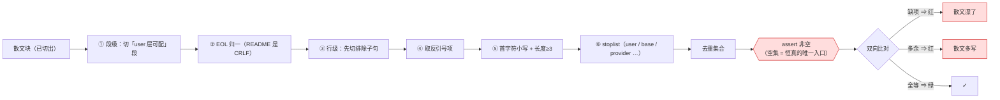
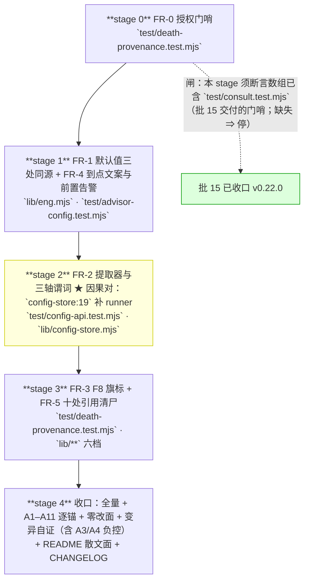

# 设计：配置面与描述面同步 —— 批 14

- 日期：2026-09-15
- 需求档：[`2026-09-15-config-surface-requirements.md`](./2026-09-15-config-surface-requirements.md)（**US-1…US-10** · **N-1…N-7** · §5.1 八项不做 · §5.2 **R-48…R-51**）
- 会诊纪要：[`2026-09-15-config-surface-consult-minutes.md`](./2026-09-15-config-surface-consult-minutes.md)（**会诊 id 2 · 2/4 交付，两份都设计级** · **§2 R-1…R-9** · **§3 D-1…D-5**）
- 摸底与三方对账：[`2026-09-15-config-surface-recon.md`](./2026-09-15-config-surface-recon.md)
- 章节：按 `METHODOLOGY.md:74-93` **九节**（§1 背景 · §2 问题 · §3 目标 · §4 决策与理由 · §5 方案 · §6 机制伪代码 · §7 状态与 schema · §8 防偏离 · §9 边界）+ **§10 上游偏离表** + **§11 受影响文件与验收** + **§12 变更记录** + **§13 评审落档**
- 图示：**图 1（默认值的三处同源与它的锁面）** · **图 2（提取流水线与两级过滤）** · **图 3（六项 / 五个 stage 的依赖与写域）**
- 状态：**设计待评审**

> ## ⚠️ 读前必读
>
> **1. 本批全部是「描述面/配置面与实现的一致性」。** 六项里 **5 项改散文或注释**，**1 项改行为**（默认值）。**⇒ 它的风险不是逻辑错，而是「改漏一处」**——**故 §8 的机验锚是本批的核心交付物，不是附属品**（**会诊 R-9 原话**：「§8 若只列人工检查项，本批等于自证失败」）。
>
> **2. ★ 一切改动只准字符串锚定，禁行号锚定。** 会诊实测**行号在本批写域内已漂三处**；父侧行锚编辑事故**十一次**（见 recon §8）。**本档内所有行号均为 as-of 参考，定位一律按符号/字面。**
>
> **3. ★ 本批有一条锁面变更**：改 `test/advisor-config.test.mjs`（**在基线集内且不在 `AP_TEST_AUTHORIZED`**）⇒ **须走授权仪式**（§11.1 声明）。
>
> **4. 行号引用口径**：定位按**符号名或字面**，行号仅 as-of。
>
> | 要找什么 | 检索符号/字面 |
> |---|---|
> | 默认值与回落 | `let engCoderEffort` · `ENG_CODER_EFFORT_DEFAULT` · `falling back to` |
> | 白名单权威面 | `topAllowed` · `GROUP_KEYS` · `GROUP_FIELDS` |
> | 白名单散文面（四处） | `cordis.patch.yml` 的白名单块 · `README.md` 的白名单块 · `README.md` 的理据句「低推理档把输出预算留给正文」 · `lib/config-store.mjs` 的 mergeGlobalConfig 头注释 |
> | 到点文案 | `超内部截止` |
> | 悬空引用 | `DESIGN-dsh-port.md` · `DESIGN-advisor-token-protocol-fix.md` |

---

## §1 背景

本批的六项**来自三条独立的发现渠道**，而**它们恰好互不重叠**：

| 渠道 | 发现 |
|---|---|
| **父侧摸底**（自测 8 项） | R-38（默认值）· R-9 的散文缺项 · 第 5 项（`budgetCapMs` 文案） |
| **独立勘察** `c189c415` | 六处纠错 + **第二份悬空档** + 隐形锁（`advisor-config` 两条断言） |
| **会诊** `id 2` | **`config-store.mjs:19` 的现役缺陷**（P4）· **`medium` 的枚举** · **两条文案是竞态分支** · **只删指针不重指** |

**⇒ 三方互为补位**（登记为 **R-49**）：**摸底与勘察都没看到 P4，而会诊看到了；反过来父侧的「三处锁」又被复核对账推翻。**

---

## §2 问题（**带 `file:line`**）

| # | 问题 | 根因 | 发现者 |
|---|---|---|---|
| **P1** | 默认值让新部署**静默失去全部推理预算** | `lib/eng.mjs:752` `let engCoderEffort = "low"`（**唯一赋值**）；`:759-760` 的 `else` **不赋值**。**`low` 是唯一在一切非退化支持集上都可能被 `nearestEffort` 静默落到 `off` 的程度档**（枚举见 §4 D14-1）；`README:249` 与 `cordis.patch.yml:43` 的示例都写 `low` | 摸底 + 勘察（**枚举由会诊提供**） |
| **P2** | 回落目标与初始化值**隐式耦合** | 同 `:759-760`：**当前行为靠初始化值间接达成** ⇒ 改初始化值会静默改回落语义 | **会诊 codex** |
| **P3** | 白名单散文**无机检** | `test/` 对 `cordis.patch.yml` **零断言**（只 2 处注释提及）；权威面 = **21 名**（`lib/index.mjs:177` `topAllowed` ×8 · `:202-203` advisor 子键 ×8 · 组字段 ×5，`lib/index.mjs:105` 与 `lib/config-store.mjs:153` 实测相同） | 摸底 + 勘察 |
| **P4** | **★ 现役缺陷：第三处散文面已漂** | `lib/config-store.mjs:19` 的头注释只列 **四名**，而 `:153` 的 `GROUP_FIELDS` 是 **五名**（缺 **`runner`**） | **★ 只有会诊** |
| **P5** | 审计遗留的**假警告** | `test/death-provenance.test.mjs:977`（ENOENT）与 `:979`（128+not-a-repo）**都留空 `addingSha`** ⇒ 都落 `:992` 的 `else` ⇒ 打 `:993`「锚 A 未激活：本批新增档尚未提交」。**★ 精度：只有 128 分支**会打**第二句**假警告（它已先打过准确的 `:980`）；**ENOENT 分支总共只有一句** | 批 13 审计 F8 |
| **P6** | 到点文案**把人引向错的旋钮** | `lib/eng.mjs` **三处**（`:1017` · `:1059` · `:1080` 与 `:1059` **逐字节相同**）写「超内部截止（**budgetCapMs**=…）」。值确实取自 `codexCli.budgetCapMs`（`:917`，缺省 540000，dsh 路径**直接当截止**）⇒ **但没有节前缀，而 schema 里没有顶层 `budgetCapMs`** ⇒ **顶层配一个自然无效** | 用户反馈（另一台机器） |
| **P7** | **10 处注释指向 2 份不存在的档** | `DESIGN-dsh-port.md` 7 处 + `DESIGN-advisor-token-protocol-fix.md` 3 处；**全盘 0 命中、git 零命中、只有引用无正文** | 勘察 + 复核对账 |

---

## §3 目标

| # | 目标 | 验收面 |
|---|---|---|
| G1 | 默认值**不再让新部署静默失去推理** | AC-1 · AC-2 |
| G2 | 回落目标**不靠初始化值隐式达成** | AC-3 |
| G3 | 白名单散文**漂了会被拦** | AC-4 · AC-5 · AC-6 |
| G4 | 散文面**现在就是对的**（P4） | AC-7 |
| G5 | 锚 A **不打假警告** | AC-8 · AC-9 |
| G6 | 到点文案**说出真键名** | AC-10 · AC-11 |
| G7 | **配错之前被提醒** | AC-12 · AC-13 |
| G8 | 注释**不再指向不存在的档** | AC-14 · AC-15 |
| G9 | **机验锚写全三要素** | AC-16 |
| G10 | **不引入新漂移** | AC-17 … AC-21 |

### §3.1 非目标（**本批不做什么**）

逐条见需求档 §5.1 的**八项**。**其中最要紧的三条**：

| # | 非目标 | 理由 |
|---|---|---|
| 1 | **不改 `nearestEffort`**（不把 `off` 排除出回落候选） | **四机制共享面** ⇒ 跨机制爆炸半径（**纪要 D-4**） |
| 2 | **不重指那 10 处引用** | **无真实落点**；重指会造**新假指针**（**纪要 R-2 顶回父侧原候选**） |
| 3 | **不给 `goal`/`authorized` 补机制** | 属**新设计**；本批**如实降 T3** |

---

## §4 决策与理由（选定 + 为什么 + **被否决的备选及否决理由**）

| # | 决策 | 为什么 | 被否决的备选与理由 |
|---|---|---|---|
| **D14-1** | **默认值改 `medium`**，**且回落目标同源** | **枚举**（v4-pro 提供，父侧复核形式）：候选 × 支持集的落点表——**`low` 是唯一在一切非退化集上可能落 `off` 的程度档**；`medium` 只在退化集 `{off}` 落 `off`。**而本部署实测形状 `{off,high,max}` 恰是 `low` 的中招形状** | **否决「保留 `low` + 只显式化」（codex）**：**显式化是对的、但不解决 P1**——`low` 仍会在 `{off,high,max}` 上落 `off`，而**那正是出厂示例配置的值**。**⇒ 两者的论据都采纳：改值（v4-pro）+ 显式化（codex）**。**另否决 `high`/`max`**（F9 实测：高推理档吞噬 `maxTokens`）与 **`off`**（质量坍塌 + 违「`off` 是开关不是档」） |
| **D14-2** | **`nearestEffort` 的根修另立批次** | 它是 **advisor / consult / escalate / eng 四机制共享面**；本项申报域只有 `eng.mjs` | **否决「顺手把 `off` 排除出回落候选」**（批 15 会诊曾倾向）：**跨机制爆炸半径**，且**codex 明确主张「列入开放决策、不静默捆绑」** |
| **D14-3** | 谓词**逐文件各一条断言** + **先钉基数** + **双向比对** | **合并集合会掩盖「一档丢名、另一档补位」的假绿**（例：`patch.yml` 丢 `runner` 而 README 保留 ⇒ 合并后仍 21）；**不钉基数 ⇒ 解析器空转即恒真** | **否决「只测 `payload ⊆ 权威`」**（发现不了散文多写）· **否决「三份合并成一个宽松正则」**（易吞 `engineering`） |
| **D14-4** | **P7 只删指针 + 连接词手术，零新增散文** | **会诊先答了「有没有不可再得的摘要」**：**逐处核过 ⇒ 10 处的内容都已内联在引用行周围的注释块里**；**唯一「断言型」的**是 `state.mjs:4`「差异已诚实标注在 §6」——**而该断言今天是假的**（档不存在）⇒ **删它 = 诚实修复** | **否决「重指到 `docs/2026-09-13-portability-design.md`」**（**父侧原候选**）：**那档主题不对**（是批 7 的「产品提示词去本仓指涉」档）⇒ **重指过去 = 制造新的假指针**（本批物种的第二次犯罪）。**否决「新建空档」**：不恢复信息、只消除路径错误 |
| **D14-5** | **P6 的三处第一字面改键名 + 前置告警，第二字面不动** | **键名须带节前缀**（`codexCli.budgetCapMs`）——**schema 里没有顶层 `budgetCapMs`**，用户在顶层配自然无效（**那是被引偏的机理**）；**第二字面是既有锁**（`doc-hygiene` 期望 2 次） | **否决「合并两条重复文案」**（**父侧原问法**）：两家独立指出**它们是同一截止的两个竞态分支**——**reject-race**（无 output）与 **resolve-race**（有 output + `Partial output`）⇒ **结构上不可合并**，而锁正是对这对分支的 |
| **D14-6** | **前置告警只加在 dsh 同步路径** | 放 `:917` 后会把 **`background=true`** 路径也告警——**而后台无墙钟问题，告警即错告** | **否决「放在 `budgetCap` 解析点之后」**（那是两条路的分叉前） |
| **D14-7** | **P4 与谓词同一 stage 交付** | **因果对**：补 `runner` 之后谓词才能绿；**先出谓词则必然先红**（红是设计意图，但那会与「其他项未完成」的红混淆） | — |
| **D14-8** | **`goal`/`authorized` 如实降 T3** | 它们**只有提示词承载、零机制** ⇒ **声称 T1 是超卖** | **否决「本批补机制」**：属**新设计**（送达时判定 + basis 必填）· **否决「悄悄留 T1」**：评审会放过虚构的绿 |

---

## §5 方案（**分交付单元 FR-x 逐个说明**）

> **★ 交付单元按「文件域 + 因果对」切**（**纪要 R-7**）。**五个 FR 依次做、各自 `node --test` 全绿，但只在全部通过后才提交**——理由：**本批 5/6 项是散文，任何中间态提交都会留下「描述与实现不一致」的窗口**，而那**正是本批要治的**。

### §5.1 FR-1 默认值三处同源（`lib/eng.mjs`）

#### 图 1：默认值的三处同源与它的锁面

```mermaid
flowchart TD
  K["const ENG_CODER_EFFORT_DEFAULT = 'medium'"] --> A["`:752` let engCoderEffort = <常量>`"]
  K --> B["`:759-760` else 分支显式赋值 <常量>"]
  K --> C["警告文案 falling back to <常量>"]
  A --> L1["`advisor-config :487` 默认值断言 → 'medium'"]
  B --> L2["`advisor-config :499` 非法值回落断言 → 'medium'"]
  A --> D["子代理 spawn 的 agentOptions.reasoningEffort"]
  B --> D
  D --> E{"nearestEffort 对 <模型支持集> 取最近档"}
  E -- "{off,high,max}<br/>（本部署实测形状）" --> F["**high** ✓ 有推理预算"]
  E -- "{off,low,high,max}" --> G["**high** ✓"]
  E -- "{off} 退化" --> H["off（唯一不可避免的落点）"]
  style K fill:#dff,stroke:#06c
  style F fill:#dfd,stroke:#090
  style G fill:#dfd,stroke:#090
```

**读图要点**：**三条边都从同一个常量出发**（这就是 P2「隐式耦合」被消除的形态）。**而锁只有两条**（`:487` / `:499`），**均在基线集内、均需授权仪式**。**右侧是本批要避免的那个结局**——`low` 在 `{off,high,max}` 上落 `off`，而**那正是出厂示例的值**。

**做什么**：抽 `const ENG_CODER_EFFORT_DEFAULT = "medium"`（**镜像既有 `ENG_CODER_MAX_TOKENS_DEFAULT` 的形态**）；`:752` 初值引用它；**`:759-760` 的 `else` 显式赋值**；警告文案随之。

**前置**：`test/advisor-config.test.mjs` 已入授权面（FR-0 的产物）。
**后置**：三处**同源**（常量 / 初值 / 回落目标 / 文案）；`grep 'falling back to'` 的文案指向常量值。

### §5.2 FR-2 白名单谓词（`test/config-api.test.mjs`，**并入既有 U3c2**）

**做什么**：`extractDocKeys` 的**两级过滤提取器** + **三轴谓词**（8/8/5）+ **逐文件各一条断言** + **先钉基数** + **双向**。

**★ 因果对**：同 stage 改 **`lib/config-store.mjs:19` 补 `runner`**（P4）。

**前置**：无（不需要授权面）。
**后置**：两处散文各一条断言；**谓词在 `config-store:19` 补名后绿**。

### §5.3 FR-3 F8 旗标（`test/death-provenance.test.mjs`）

**做什么**：加一个**旗标**（如 `skippedNotRepo`），**128 分支置位**，`:992` 的 `else` **据旗标跳过第二句**。**ENOENT 分支行为不变**（它只有那一句，是**有意复用**，`:978` 注释已说明）。

**前置**：无。
**后置**：**128 分支 ⇒ 只打 `:980` 那句准确的**；**ENOENT 分支 ⇒ 仍只有一句**（不变）；其余错误仍 `throw`。

### §5.4 FR-4 到点文案 + 前置告警（`lib/eng.mjs`）

**做什么**：**三处第一字面**统一改为 `超内部截止（内部截止值取自 codexCli.budgetCapMs=<n>）`；**第二字面（两条 `failStop`）不动**；**新增前置告警**——**仅 dsh 同步路径**、`budgetCap >= 600000` 时 **spawn 前** warn。

**前置**：**不得引入 `failStop(`**（`:362` 锁 + `:372-375` 的 PREFLIGHT 禁 spawn 前 `failStop(`）。
**后置**：`grep '超内部截止'` 三处第一字面含 `codexCli.` 前缀；`failStop(` 计数 **仍 18**；第二字面**仍 2 次**。

### §5.5 FR-5 引用清尸（**10 处 / 6 档**）

**做什么**：**只删指针 + 连接词手术**，**零新增散文**。例：`「规则（DESIGN-dsh-port.md §4.2）：」→「规则：」`。

**前置**：无。
**后置**：`grep -rn "DESIGN-dsh-port.md\|DESIGN-advisor-token-protocol-fix.md" lib/` **零命中**。

### §5.6 FR-0 授权仪式（**最先做，其余的前置**）

**做什么**：**先读** `test/death-provenance.test.mjs` 的 `AP_TEST_AUTHORIZED` 当前行，**断言含 `test/consult.test.mjs`**（**批 15 已交付的门哨**；缺失 ⇒ **停、回报**）；**追加** `test/advisor-config.test.mjs`（**不重写整行**）；**同档注释块追加第 ⑤ 条授权理由**。

**前置**：**批 15 已收口**（**已满足**——v0.22.0）。
**后置**：数组含 **5 名**；注释块含第 ⑤ 条。

---

## §6 机制伪代码（**含前置/后置条件**）

### §6.1 FR-1

```js
/**
 * @pre   ENG_CODER_EFFORT_LEVELS 含 "off"|"low"|"medium"|"high"|"max"（既有枚举不变）
 * @post  默认与回落目标同源：二者都引用 ENG_CODER_EFFORT_DEFAULT
 *        改常量即同时改默认值与回落目标（P2 的隐式耦合被消除）
 */
const ENG_CODER_EFFORT_DEFAULT = "medium"            // 镜像 ENG_CODER_MAX_TOKENS_DEFAULT 的形态
let engCoderEffort = ENG_CODER_EFFORT_DEFAULT
if (effCfg !== undefined && effCfg !== null) {
  if (typeof effCfg === "string" && ENG_CODER_EFFORT_LEVELS.has(effCfg)) {
    engCoderEffort = effCfg
  } else {
    warn("invalid engCoderEffort " + JSON.stringify(effCfg)
       + " (expected one of off|low|medium|high|max) — falling back to \""
       + ENG_CODER_EFFORT_DEFAULT + "\"")
    engCoderEffort = ENG_CODER_EFFORT_DEFAULT          // ★ 显式赋值（codex 的论据）
  }
}
```

### §6.2 FR-2 的两级过滤提取器

#### 图 2：提取流水线与两级过滤



**读图要点**：**两级过滤的每一级都由一个实测陷阱逼出来**——③ 是因为 `engineering` 在**排除子句内**（不切就多抓）；⑤ 是因为块内有 **`D-29`** / **`R1 §3.6`** / **`FR-CB5`**（单字母与全大写假阳性）；② 是因为 **`README.md` 是 CRLF**。**⇒ 而 `assert 非空` 是本设计里唯一防「恒真」的环节**——**没有它，提取器一坏就全绿。**

```js
/**
 * 从白名单散文块提取键名。
 *
 * @pre   传入的是**已切出的白名单块**（不是整档）——块边界由档内标记或节标题界定
 * @post  返回**去重后的集合**；**绝不返回空集后继续比对**（调用方须先 assert 非空）
 *        两级过滤：段级（先切「user 层可配」段）→ 行级（按标记剥离）
 */
function extractDocKeys(block) {
  const seg = sliceUserLayerSegment(block)                  // ★ 段级：先切段（尾部反引号项规避）
  const lines = seg.split(/\r?\n/)                          // ★ EOL 归一（README 是 CRLF）
  const out = []
  for (const raw of lines) {
    const mark = splitAtMarker(raw)                         // ★ 先切排除子句（「其余字段」「base 专属」「以及 …」）
    let items = mark.before.match(/`[^`]+`/g) ?? []
    for (const it of items) {
      const s = it.slice(1, -1)
      if (!/^[a-z][a-zA-Z0-9]*$/.test(s)) continue           // ★ 首字符小写 + 长度>=3
      if (s.length < 3) continue
      if (STOPLIST.has(s)) continue                          // ★ stoplist: user / base / provider …
      out.push(s)
    }
  }
  return new Set(out)
}
```

**★ 两级过滤的实测依据**（会诊 codex 给出，父侧复核）：`engineering` 在**两处散文都在排除句内** ⇒ **必须先切排除句再提取**；`patch.yml` 块内有「末两键 **D-29** 并入」、`config-store` 块内有「**R1 §3.6**」「**FR-CB5**」⇒ **单字母与全大写假阳性** ⇒ **首字符小写 + 长度≥3** 双滤。

### §6.3 FR-4 的前置告警

```js
/**
 * @pre   budgetCap 已解析；**仅 dsh 同步路径**（background=true 路径不进入此分支）
 * @post  budgetCap >= 600000 时 warn 一次；**不引入 failStop(**；不改变任何返回路径
 */
if (budgetCap >= PLATFORM_WALL_CLOCK_MS) {                  // 600000
  warn("eng_coder dsh 同步路径的内部截止取自 codexCli.budgetCapMs=" + budgetCap
     + "ms；该值已达或超过平台单次调用墙钟 " + PLATFORM_WALL_CLOCK_MS + "ms —— "
     + "插件读不到平台的 maxWallMs，故无法代为校验；长任务请传 background=true 或拆分 stages")
}
```

---

## §7 状态与 schema

**本批不新增持久化状态、不改任何 schema**——**它改的是三处的「文本」与一处的「默认值」**。**故本节的任务是声明「本批不碰什么」**（这正是本批的风险面）：

| 面 | 本批的动作 | 谁写 | 谁读 |
|---|---|---|---|
| **`engCoderEffort` 的取值域** | **默认值与回落目标改为同源常量**（值 `medium`） | `lib/eng.mjs` | `advisor-config.test.mjs` 的两处断言 · 子代理 spawn 的 `agentOptions.reasoningEffort` |
| **白名单散文（四处）** | 三处**不改值**（本来就对）；**一处补 `runner`** | **人**（`cordis.patch.yml` · `README.md` · `lib/config-store.mjs` 注释） | **新谓词**（FR-2）· 用户 |
| **`AP_TEST_AUTHORIZED`** | **追加一名**（`test/advisor-config.test.mjs`） | `test/death-provenance.test.mjs` | T-AP9 锚 B |
| **`lib/**` 的注释（10 处引用）** | **删指针** | `lib/**`（6 档） | 人 · **新锚**（零命中） |
| **`test/death-provenance.test.mjs` 的旗标** | 新增局部旗标（不落盘） | 同档 | 同档 |
| **新增 schema** | **无** | — | — |
| **新增持久化** | **无** | — | — |

> **★ 但本批有一处「谁读」的关键变化**：**`cordis.patch.yml` 与 `README.md` 从「无人读」变成「有谓词读」**——**这是本批 G3 的实质**。

---

## §8 防偏离

### §8.1 零改面

| # | 面 | 判据 |
|---|---|---|
| 1 | `test/fixtures/**` | `git diff` 空 |
| 2 | **不新增测试档** | `readdirSync(test).filter(.test.mjs)` 数不变（**20**） |
| 3 | **不新增顶层 `test(`** | 台账 §三**零改** |
| 4 | `lib/**` **六串零命中** | T-PK15 |
| 5 | **`failStop(` 恒 18** | 既有断言 |
| 6 | `doc-hygiene` 的到点文案**第二字面仍 2 次** | 既有 needles |
| 7 | **`lib/advisor.mjs` 只改 1 处注释**（FR-5） | 该档在批 15 的禁改清单里，**批 15 已收口 ⇒ 现无阻碍**；**除那一行外零改动** |
| 8 | **平台包 / `docs/` 顶层既有 9 份纪要** | 零改动 |

### §8.2 机验锚（**谓词三要素写全：检索目标 / 谓词 / 期望**）

> **★ 本节的形态是本批的核心**（**会诊 R-9**：§8 若只列名字则本批自证失败；**批 15 被审计抓的 W3 就是这个坑**——V2 谓词 `register(textTool({ name: "consult_` 因注册多行而**匹配 0 处 ⇒ 永不可能通过**）。

| 锚 | 检索目标 | 谓词 | 期望 |
|---|---|---|---|
| **A1** | `lib/eng.mjs` | `grep -c 'ENG_CODER_EFFORT_DEFAULT'` 且断言 `let engCoderEffort = ENG_CODER_EFFORT_DEFAULT` 在位、`else` 分支含显式赋值 | **≥3 处同源**；**初值与回落目标都是常量**（**不出现字面 `"low"` 作为默认**） |
| **A2** | `test/advisor-config.test.mjs` | 两处 `reasoningEffort` 断言 | 值为 **`"medium"`**（`:487` 默认值 · `:499` 非法值回落目标） |
| **A3** | `cordis.patch.yml` + `README.md` 的**白名单块** | FR-2 的 `extractDocKeys` 三轴比对（**逐文件各一条**） | **三轴各零缺项、零多余**（8/8/5） |
| **A4** | 同上 | **基数钉** | `topAllowed.length === 8` · advisor 子键 `=== 8` · 组字段 `=== 5`；**且提取集非空**（空集 ⇒ **红**） |
| **A5** | `lib/config-store.mjs` 的 mergeGlobalConfig 头注释 | 同 A3 的组字段轴 | **零缺项**（**P4 修复后**） |
| **A6** | `test/death-provenance.test.mjs` | 构造 128+not-a-repo 的错误对象，跑锚 A 的分支 | **只打 `:980` 那句**（**不出现**「本批新增档尚未提交」）；**ENOENT 分支**仍打那一句（有意） |
| **A7** | `lib/eng.mjs` | `grep '超内部截止'` 的**第一字面** | 三处均含 **`codexCli.`** 前缀；**第二字面仍 2 次**；`failStop(` **仍 18** |
| **A8** | `lib/eng.mjs` | 用 `captureWarn` + `budgetCap=700000` 跑 dsh 同步路径 | **spawn 前** 恰一条告警；**`background=true` 路径不告警** |
| **A9** | `lib/**` | `grep -rn 'DESIGN-dsh-port\.md\|DESIGN-advisor-token-protocol-fix\.md'` | **零命中**（**只扫 `lib/**`**——`docs/` 里对死名的历史记录是合法存在） |
| **A10** | 全仓 | 既有锁（台账 §三 · 六串 · `failStop(` · T-AP9 · `doc-hygiene`） | 全绿 |
| **A11** | 既有 9 份顶层纪要 + `docs/` 顶层 | R-25 谓词 | **未登记 = `[]`** |

> **★ 两条「锚自身的自证腿」**（防恒真——**批 15 的教训**）：
> - **A3 的负控**：把一个键名从 `patch.yml` 的块里**删掉** ⇒ 该文件的断言**必红**（证明它不是恒真）
> - **A4 的负控**：把提取器**故意改坏**（如吞掉标记剥离）⇒ **空集 ⇒ 必红**（证明基数钉在起作用）

---

## §9 边界（**规范六类 + 失败方向**）

| 类 | 本批必须定义的行为 | 方向 |
|---|---|---|
| **空集** | **散文块为空 / 提取器返回空集** ⇒ **`assert` 非空后红**（**这是恒真的唯一入口**）。**池为空**：不适用（本批不涉池）。**10 处引用若某处本就不存在**（如批 15 已删）⇒ **零命中更宽，仍绿** | **fail-closed**（空集必红） |
| **畸形输入** | `cordis.patch.yml` 是 **LF**、`README.md` 是 **CRLF**、`lib/config-store.mjs` 是 **CRLF** ⇒ **提取器必须 EOL 归一**；散文块内的**全角标点/表格竖线/反引号嵌套** ⇒ 剥离后再匹配 | fail-open（剥离不阻断） |
| **并发** | **不适用**（无运行时并发面）。**唯一相关**：A8 的告警与 `warn` 通道 → 它进 `warnings` 并随返回文本带出（**只前进、不清空**——批 15 的实测结论） | — |
| **重启** | **本批改 `lib/**` ⇒ 需重启才生效**（`eng.mjs` ×2 · `config-store.mjs` · 6 档注释）。**`test/**` 改动即时生效**。⇒ **AC 分层须如实**（§11.2） | 损失如实声明 |
| **升级** | **无 schema 变更、无持久化变更 ⇒ 无迁移面**。**唯一**：`AP_TEST_AUTHORIZED` 的追加是**一次性授权记录**（不随版本演化） | 无迁移面 |
| **失败方向** | **① 谓词面 fail-closed**（空集/缺名/多名都红）· **② 散文面改动 fail-open**（补 `runner` 不阻断任何运行）· **③ 到点文案 fail-open**（改文案不动返回路径）· **④ 前置告警 fail-open**（warn 不改返回；**且不得引入 `failStop(`**）· **⑤ F8 旗标 fail-closed**（**只有 128 分支置位**，其余错误仍 `throw`） | 逐项见左 |

---

## §10 上游偏离表（**六列 + 分叉前言 + 方向值封闭枚举**）

> **★ 分叉前言**
> - **上游基线** = `D:\workspace\thincoder` @ **`58ddb27`**（`v0.12.61-4-g58ddb27`）
> - **本仓复制源** = **`3e1234b^`**（= `v0.12.59-19-g15c14ae`）
> - **分叉事件** = **`3e1234b`（2026-09-07 04:10）**——上游退役 `consult_check`
> - **比对日期** = 2026-09-15
>
> **★ 方向值（封闭枚举，**批 15 被审计抓 W4「说四值而表里有七个」的教训**）**：`跟随` / `本仓加法` / `有意不跟` / `上游已改本仓未跟` / `本仓命名` / `本仓自纠` / `有意不跟仓内先例`——**本批表中出现的每个值必须在此枚举内**。

| 本仓行为 | 上游行为 + 坐标 | 方向 | 理由 | 复检条件 | 锚 |
|---|---|---|---|---|---|
| `engCoderEffort` **默认 `medium`** | 上游是**另一套体制**（`consultTurns` / `consultTimeoutMs`，`docs/core/design/CONSULTATION.md:146-147`），**无此键** | **本仓命名** | 本键是 DSH 移植引入的 | 上游若引入等价键 | **A1 · A2** |
| `nearestEffort` 的**回落含 `off`** | （本仓机制，上游无对应） | **有意不跟（本次不动）** | **四机制共享面** ⇒ 另立批次（**D14-2**） | 该批次立项时 | — |
| **`verify` / `eng` 等本键族** | 上游 `agent.consultModels` 是**唯一**模型池键 | **本仓加法** | DSH 侧新增的配置面 | — | — |
| **两份 `DESIGN-*.md` 悬空引用** | **上游无此问题**（它自带文档树） | **本仓自纠** | 移植时引用了一份**从未提交**的设计档 | 已修，不再适用 | **A9** |
| **`AP_TEST_AUTHORIZED` 的四名** | （本仓机制） | **本仓自纠** | 基线集与授权面的口径不同 | — | **A10** |

---

## §11 受影响文件与验收

### §11.1 实施域

| 文件 | 改动 | 类型 |
|---|---|---|
| `lib/eng.mjs` | FR-1（常量 + 初值 + `else` 显式赋值 + 文案）· FR-4（三处第一字面 + 前置告警）· FR-5（**2 处**注释删指针） | **修改（核心）** |
| `test/advisor-config.test.mjs` | 两处断言的**值**改 `medium` | **★ 锁面变更** |
| `test/death-provenance.test.mjs` | FR-0（`AP_TEST_AUTHORIZED` 追加 + 注释第 ⑤ 条）· FR-3（旗标）· FR-5（**1 处**注释） | **★ 锁面变更 + 修改** |
| `lib/config-store.mjs` | FR-2 的因果对（mergeGlobalConfig 头注释补 `runner`） | 修改（注释） |
| `test/config-api.test.mjs` | FR-2（提取器 + 三轴谓词，**并入既有 U3c2**） | 修改 |
| `cordis.patch.yml` | 无值改动（**本来就对**）——**但它在谓词的检索目标里** | 零改动（**进锁域**） |
| `README.md` | FR-1 的散文（示例值与「缺省」）· FR-1 的**理据句** | 修改 |
| `lib/advisor-msgs.mjs` · `lib/consult.mjs` · `lib/state.mjs` · `lib/readonly-tools.mjs` · `lib/index.mjs` · `lib/advisor.mjs` | FR-5（各 1 处注释删指针；**`eng.mjs` 2 处**） | 修改（注释） |
| `CHANGELOG.md` | 本批条目（**仅新增**） | 修改 |
| **明确排除（禁改）** | `test/fixtures/**` · `test/stage-gate.test.mjs` · `test/stages.test.mjs` · `test/guard-e.test.mjs` · **平台包** · **`docs/` 顶层既有 9 份纪要** · **历史记录的既有内容** | 零改动 |

### §11.2 可验性分层登记（**N-2 要求：AC 一律打标**）

| 标 | 含义 | 本批 AC |
|---|---|---|
| **T1** | 进程内 `node --test` 可证 | AC-1 · AC-3 · AC-8 · AC-12 · AC-13 |
| **T2** | 静态谓词可证（grep / 文件形状 / 集合比对） | AC-2 · AC-4 · AC-5 · AC-6 · AC-7 · AC-9 · AC-10 · AC-11 · AC-14 · AC-15 · AC-16 · AC-17 … AC-21 |
| **T3** | **仅重启后人工核验** | **AC-22**（真机 `console.warn` 的即时可见性）· **AC-23**（仓外部署 profile 的同步——**连 T3 都不是**，`owner = 用户/运维`） |

### §11.3 验收标准（**AC-x → 锚 → US-y → 层**）

| # | 验收标准 | 层 | 锚 | US |
|---|---|---|---|---|
| **AC-1** | 默认值为 `medium` 且**三处同源**（常量/初值/回落/文案） | T1 | A1 | US-1 |
| **AC-2** | **不出现字面 `"low"` 作为默认或回落目标** | T2 | A1 | US-1 |
| **AC-3** | `else` 分支**显式赋值**（改常量即改两处） | T1 | A1 | US-2 |
| **AC-4** | `cordis.patch.yml` 的三轴**零缺项零多余** | T2 | A3 | US-3 |
| **AC-5** | `README.md` 的三轴**零缺项零多余** | T2 | A3 | US-3 |
| **AC-6** | 谓词**先钉基数（8/8/5）且提取集非空** | T2 | A4 | US-3 |
| **AC-7** | `lib/config-store.mjs` 的头注释**含 `runner`**（P4 修复） | T2 | A5 | US-4 |
| **AC-8** | 128 分支**不打**「本批新增档尚未提交」 | T1 | A6 | US-5 |
| **AC-9** | **ENOENT 分支行为不变**（仍只那一句）；其余错误仍 `throw` | T2 | A6 | US-5 |
| **AC-10** | 三处第一字面**含 `codexCli.` 前缀** | T2 | A7 | US-6 |
| **AC-11** | **第二字面仍 2 次**；`failStop(` **仍 18** | T2 | A7 | US-6 |
| **AC-12** | dsh 同步路径 `budgetCap >= 600000` ⇒ **spawn 前恰一条告警** | T1 | A8 | US-7 |
| **AC-13** | **`background=true` 路径不告警**（负向） | T1 | A8 | US-7 |
| **AC-14** | `lib/**` 内两个死名**零命中** | T2 | A9 | US-8 |
| **AC-15** | 10 处引用的**内容保全**（**人验**：每处周围的注释块仍表达其原意） | **T3** | — | US-8 |
| **AC-16** | §8.2 的**每条锚写全三要素** | T2 | — | US-9 |
| **AC-17** | 台账 §三**零改**；T-LC1/T-LC2/T-E19 全绿 | T2 | A10 | US-10 |
| **AC-18** | 六串零命中；`failStop(` 恒 18；**测试档数 20 不变** | T2 | A10 | US-10 |
| **AC-19** | `test/fixtures/**` 零 diff；`lib/advisor.mjs` **除 1 行注释外零改动** | T2 | A10 | US-10 |
| **AC-20** | **A3/A4 各有负控腿**（删键必红 · 提取器改坏必红） | T2 | **§8.2 自证腿** | US-9 |
| **AC-21** | R-25 谓词 `未登记 = []` | T2 | A11 | US-10 |
| **AC-22** | 重启后真机 `console.warn` 可见 | **T3** | — | US-7 |
| **AC-23** | **仓外部署 profile 同步**（**owner = 用户/运维**，本批只登记） | **T3** | — | — |

### §11.4 建议 stages（**五段串行**）

#### 图 3：六项 / 五个 stage 的依赖与写域



**读图要点**：**三个依赖关系决定了这个形状**——
① **stage 0 必须最先**：`advisor-config.test.mjs` 未入授权面时，**改它的任何断言都会让 T-AP9 锚 B 变红** ⇒ 先开门。
② **stage 2 是「因果对」**（黄色）：谓词与 `config-store:19` 的补名**同一 stage** —— **先出谓词则必红**，而那个红会与「其他项未完成」的红混淆。
③ **stage 1 把 FR-1 与 FR-4 绑在一起**：**同一文件（`lib/eng.mjs`）**，且**改默认值却不改到点文案**会立刻制造本批要治的漂移。
**⇒ 六个项、五个 stage、四文件域；每 stage 单独可验，但只在全绿后才提交**（散文的中间态本身就是本批要治的缺陷）。

| stage | goal | 文件 | 检查 |
|---|---|---|---|
| **0** | **FR-0 授权门哨**：读 `AP_TEST_AUTHORIZED` 当前行，**断言含 `test/consult.test.mjs`**（批 15 已交付）；**追加** `test/advisor-config.test.mjs`（**不重写整行**）+ 注释第 ⑤ 条 | `test/death-provenance.test.mjs` | `node --test test/death-provenance.test.mjs` |
| **1** | **FR-1 + FR-4**：默认值三处同源 + 三处第一字面 + 前置告警 | `lib/eng.mjs` · `test/advisor-config.test.mjs` | `node --test test/advisor-config.test.mjs` |
| **2** | **FR-2 + P4**：提取器 + 三轴谓词 + `config-store.mjs:19` 补 `runner` | `test/config-api.test.mjs` · `lib/config-store.mjs` | `node --test test/config-api.test.mjs` |
| **3** | **FR-3 + FR-5**：F8 旗标 + 10 处引用清尸 | `test/death-provenance.test.mjs` · `lib/**`（6 档） | `node --test` |
| **4** | **收口**：全量 + A1–A11 逐锚 + 零改面 8 项 + **变异自证**（**含 A3/A4 的负控**）+ 散文面（README 的示例与理据句）+ CHANGELOG | 全 | `node --test` |

> **★ FR-1（默认值三处同源）必须与 FR-4（同档两处改动）同 stage**——**同一文件、同一批次**，且**改默认值不改散文**会立刻制造本批要治的漂移。

---

## §12 变更记录

| 日期 | 变更 |
|---|---|
| 2026-09-15 | 首版（设计待评审）：九节 + §10 偏离表 + §11 验收；**D14-1…D14-8**；**US-1…US-10**；**AC-1…AC-23**（逐条打 T1/T2/T3）；**锚 A1…A11 写全三要素** + **两条自证腿**；**图 1/2/3**；§11.4 **五 stage**（FR-0 门哨最前）。**三方交叉**（摸底 + 勘察 + 会诊）与**用户三项裁定**已折入。 |

---

## §13 评审落档

### §13.1 设计评审轮次 1 落点（预留）

### §13.2 交付核验落档（预留）
