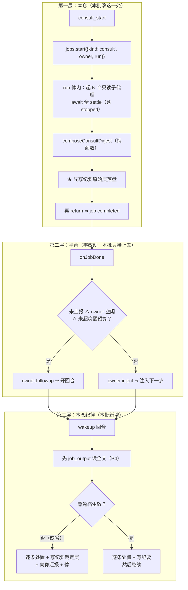
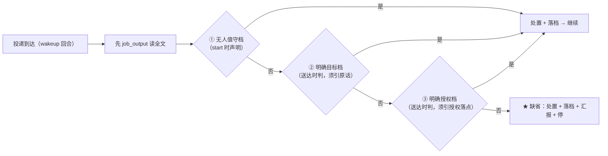
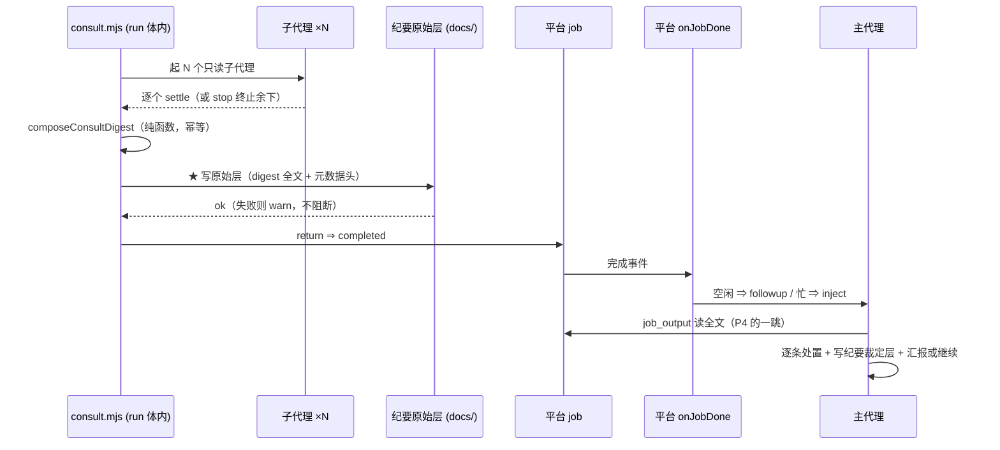

# 设计：会诊结果的投递与消化 —— 批 15

- 日期：2026-09-15
- 需求档：[`2026-09-15-consult-delivery-requirements.md`](./2026-09-15-consult-delivery-requirements.md)（**US-1…US-12** · **N-1…N-7** · §5.1 八项不做 · §5.2 **R-40…R-45**）
- 会诊纪要：[`2026-09-15-consult-delivery-consult-minutes.md`](./2026-09-15-consult-delivery-consult-minutes.md)（**会诊 id 1 · 4/4 交付 / 2 份设计级** · §1 父侧独立回盘核 · **§2 R-1…R-10 逐问裁定**）
- 上游坐标：`D:\workspace\thincoder` @ `58ddb27`（`v0.12.61-4-g58ddb27`）· 本仓复制源 `3e1234b^` · 分叉事件 `3e1234b`（2026-09-07 04:10）
- 章节：按 `METHODOLOGY.md:74-93`「设计文档的成文流程与必备章节」**九节**（§1 背景 · §2 问题 · §3 目标 · §4 决策与理由 · §5 方案 · §6 机制伪代码 · §7 状态与 schema · §8 防偏离 · §9 边界）+ **§10 上游偏离表** + **§11 受影响文件与验收** + **§12 变更记录** + **§13 评审落档**
- 图示：**图 1（投递链三层与责任边界）** / **图 2（三豁免档与缺省停）** / **图 3（settle → 落盘 → completed → 投递 的时序）**
- 状态：**设计待评审**

> ## ⚠️ 读前必读
>
> **1. 本档是重写版。** 初版经用户质问后按 `METHODOLOGY.md:80-93` 逐条量尺，**四个 ❌**：问题缺 `file:line` · 方案无 FR-x · 伪代码无前后置 · **状态与 schema 全无** · 边界十条全是「不做什么」而六类未写。**本档逐节补齐，并在 §12 留痕。**
>
> **2. ★ 本批的第一件事实是「本仓落后上游六天」。** 上游 `3e1234b`（2026-09-07）以 digest 自动注入**退役 `consult_check`**；本仓首个提交 `aeffdf7` = 2026-09-01 ⇒ **本仓复制的是 `3e1234b^`**。**US-1/US-2 不是新设计，是补上落后的六天**；**US-4/US-5（落档）与 US-9/US-10（门禁与墓碑）才是本仓的加法**。
>
> **3. ★ 投递与唤醒由平台已提供**（`dsh-tool-jobs` 的 `onJobDone`，§5.1 逐字）⇒ **本批只把 consult 接上去**，**不照搬上游自造的 `_pendingAsyncResults` 容器**。
>
> **4. 行号引用口径**：定位按**符号名**，行号仅作 as-of 参考。
>
> | 要找什么 | 检索符号 |
> |---|---|
> | 平台的投递点 | `dsh-tool-jobs/lib/index.js` 的 `onJobDone` |
> | 本仓取 jobs 服务 | `lib/advisor.mjs` 的 `getJobsService` |
> | 本仓的 dsh-后台 job 先例 | `lib/eng.mjs` 的 `jobs.start({ kind: "eng-dsh"` |
> | 待退役的协议 | `lib/consult.mjs` 的 `checkConsultSession` · `lib/index.mjs` 的 `"consult_check"` |
> | 待反转的描述 | `lib/index.mjs` 的 `"There is NO completion notification"` |

---

## §1 背景

`consult`（会诊）在本仓是**三工具异步协议**：`consult_start`（非阻塞）/ `consult_check`（逐个收回复）/ `consult_stop`（早停）。

**这套协议是上游 2026-09-01 的形态。上游在 `3e1234b`（2026-09-07 04:10）把它改掉了**——以 **digest 自动注入**退役 `consult_check`（`agent/setup.mjs:269-270` 逐字：「consult 家族**只剩 2 工具**——setup 注册点与描述面同步清零」）。**本仓的移植停在改造之前，且从未记录这次分叉。**

⇒ 本会话里父侧据此撞了**三到四次**（发完 `consult_start` 就结束回合等一个不会来的通知；用户两次追问「会诊结束了没有」）。**父侧先前的处置是把那条描述改成「没有通知，你必须自己回来」（`37d7eef`）——那句话对本仓准确，但它把缺口固化成了契约，而不是修掉它。**（**该句在本批 FR-3 被逐字反转**，见 §4 D15-9 与 §10 偏离表。）

---

## §2 问题（**带 `file:line` 证据**）

| # | 现象 | 根因（`file:line`） |
|---|---|---|
| **P1** | 会诊结束**无人知晓、无物推动** | `lib/consult.mjs:276-308`：`startConsultSession` **fire-and-forget** 起子代理即返回；唯一消费面是 `checkConsultSession`（`:317-352`）的**阻塞轮询**；`lib/index.mjs:1033-1034` 的描述面**自己承认**「There is NO completion notification … you must come back yourself」 |
| **P2** | 协议**落后上游且从未记录** | `lib/consult.mjs:2` 头注仍是三工具协议；上游 `3e1234b`（2026-09-07）已退役 check；**分叉从未入档**——唯一相关痕迹是 `CHANGELOG.md:215` **还在对上游已删协议做加固** |
| **P3** | **重启 = 静默全灭** | `lib/state.mjs:11-13` 与 `:55-56`：`consult*` 明文**不进持久化视图**，Map 纯内存；**已实际咬过一次**：`docs/2026-09-13-design-review-guard-requirements.md:19` 记载重启后 `unknown consult id`，**kimi-api:kimi-k3 的回复不可复得** |
| **P4** | 完成通知**只含一行指针** | 平台契约（`lib/advisor.mjs:1677-1679` 登记）：「完成通知只含一行指针（**全文经 `job_output` 读取**，保尾截断）」⇒ **digest 的实际阅读动作是 wakeup 回合里再调一次 `job_output`**，而父侧初版设计完全没写这一跳 |

**★ P3/P4 由两家会诊各自独立点出**（v4-pro 的发现 3 · glm 的 P4），**父侧初版全部漏掉**。

---

## §3 目标

| # | 目标 | 验收面 |
|---|---|---|
| G1 | 会诊结束**自动投递**，调用方零动作 | AC-1 · AC-2 |
| G2 | 投递到达后**停下向用户汇报**（缺省档） | AC-3 · AC-4 |
| G3 | **三豁免档**成立时不强制停 | AC-5 · AC-6 |
| G4 | **每条意见被分类处置**，不采纳须给理由 | AC-7 · AC-8 |
| G5 | **纪要默认落档**，豁免须显式留痕 | AC-9 · AC-10 |
| G6 | **`consult_check` 二选一并清零** | AC-11 · AC-12 |
| G7 | **偏离有据可查**（六列 + 方向四值 + 分叉前言） | AC-13 |
| G8 | **未消化的会诊拦得住下一次发起** | AC-19 |
| G9 | **stop 不丢已收到的回复** | AC-20 |
| G10 | 不引入新漂移（台账零改 · 零新增测试档 · 六串净） | AC-14 … AC-18 |

### §3.1 非目标（**本批不做什么**）

| # | 非目标 | 理由 |
|---|---|---|
| 1 | **不照搬上游的 `_pendingAsyncResults`** | 平台已有等价设施（N-1） |
| 2 | **不改 consult 只读子代理语义** | 上游明文 |
| 3 | **不做模型间交叉通信** | 上游明文列为不做 |
| 4 | **不做部分 settle 提前注入** | 上游已裁「全 settle 才入流」 |
| 5 | **不修 X-1（`DESIGN-dsh-port.md` 悬空引用）** | 归批 14（同物种） |
| 6 | **不做 `escapeXml`** | DSH 的 `job_output` 是纯文本、无 XML 信封（§4 D15-6） |
| 7 | **不新增持久化**（`consultSessions` 保持纯内存） | **没有持久化就没有迁移面**（§9 升级类）；取证靠新台账 |
| 8 | **不给「汇报质量」加机检锁** | 语义只能人眼（R-41）；**中间层要加**（US-9） |

---

## §4 决策与理由（选定 + 为什么 + **被否决的备选及否决理由**）

| # | 决策 | 为什么 | 被否决的备选与理由 |
|---|---|---|---|
| **D15-1** | **走平台 `jobs`，不自造投递容器** | DSH 的 `dsh-tool-jobs` **已提供同一件事**（§5.1 逐字）；**且本仓已有成品先例**——`lib/eng.mjs` 的 `kind: "eng-dsh"` 后台 job，其 `run` 体内就是 `ctx.subagents.start`（`:919-966`） | **否决「照搬上游 `_pendingAsyncResults`」**：上游自造它是因为**上游没有等价平台设施**；本仓复刻 = **重复实现**，且要复刻挂起 / 唤醒 / 容量 / 截断全套 |
| **D15-2** | **退役 `consult_check`** | 上游明文「只剩 2 工具——**setup 注册点与描述面同步清零**」 | **否决「保留作兼容」**：那会留下**两条消费通道**（半套协议），违反 US-7，且正是上游 `3e1234b` 明令消灭的形态 |
| **D15-3** | **`stopped` 会话产「墓碑 digest」**（**★ 有意偏离上游 `T-R17c`**） | 上游「stop 不产 digest」在**轮询协议**里成立（停者自己回头读队列）；**退役 check 后 digest 是唯一消费通道** ⇒ stop 无 digest = **已收到的回复整批蒸发 + 死亡行失去消费面**——后者**直接打穿批 6 的裁定**（`test/death-provenance.test.mjs:252-265` 的 stop 面断言 = 「死亡行必须经**生产消费面**可见」，见 `docs/2026-09-13-death-diagnosability-design.md:355`） | **否决「照跟 `T-R17c`」**：消费模型变更使有损 stop 从「可容忍」变成「数据丢失」。**两家会诊独立同结论**（v4-pro F-A · glm F-A） |
| **D15-4** | **`jobs` 缺失 ⇒ 拒发（fail-closed），不回落同步** | 仓内先例（`advisor.mjs` / `escalate.mjs` 的「响亮告警 + 回落同步」）**成立的前提是工作量适配 600s 墙钟**；而 **`consultTimeoutMs` 缺省 1800000ms（30 分钟）** ⇒ **回落路径自身就违约通知保证**；且 advisor/eng 是**单次调用**，consult 是 **N 路并行 30 分钟预算** | **否决「回落同步」**：回落 = 起一个**永远无人能读的会话** = P1 原样复活。**两家独立同结论** |
| **D15-5** | **`kind: "consult"`，不带路由后缀** | 既有族是 `<机制>-<路由>`（`advisor-codex` / `eng-codex` / `eng-dsh` / `escalate-*`），**但 consult 会话混跑 dsh 子代理与 codex-cli 行**（`consult.mjs:164-203` vs `:226`）⇒ **带路由后缀必有一侧说谎** | **否决 `consult-dsh`**（v4-pro 的取法）：它给一个混跑会话贴了单一路由标签。**登记为命名偏离** |
| **D15-6** | **不做 `escapeXml`**（**有意不跟上游**） | 上游的 `escapeXml` 是为**它的 XML 消息流**服务的；**DSH 的 `job_output` 是纯文本**，`eng.mjs` 的既有 output 也是裸文本 | **否决「照搬」**：无 XML 信封可逃。**glm 独立同结论** |
| **D15-7** | **「停下汇报」= 两层：质量人眼 + 中间层可机检** | **父侧初版写「不加机检锁，因为散文锁会咬人」——被 glm 指出超界**：它从「散文质量不可机判」滑到了「因此什么都不能机检」。**门禁不变量**（US-9）是 **R-25 形态的 choke-point 谓词**：① 并入既有块 · ② 带自证腿（**每条腿都是文件形状事实，零散文判断**）· ③ 台账零改 | **否决「加散文锁」**（判汇报质量）；**也否决「什么锁都不加」**（放过门禁这个现成机检面） |
| **D15-8** | **三豁免档：不对称判定** | **「无人值守」在 start 时声明**（发起前就知道）；**「明确目标」与「明确授权」在送达时判**（两者都要求**引用对话中的原话或既有授权文档**） | **否决「全在 start 判」**（v4-pro）：start 时无法预知送达时的事实（用户是否还在）。**否决「全在送达时判」**（glm）：事后自判 = **道德风险敞口** |
| **D15-9** | **反转 `37d7eef` 那条描述**，并**连带删掉批 14 的 A 项** | 批 15 让 consult 走平台 `jobs` ⇒ **它有通知了**，那条描述随之变假。**批 14 尚未开工 ⇒ 删它零成本** | **否决「让两批并存」**：留着则批 15 后描述为假；删则批 14 少一项——**两害相权取其轻**（用户裁定 T-1）。**这不冲突：`37d7eef` 的历史不重写，只在偏离表与 CHANGELOG 留痕** |
| **D15-10** | **AC 一律打可验性三层标（T1/T2/T3）** | 本批**多数行为真机不可验**（不重启）⇒ 不分层，**交付评审会放过虚构的绿**。**两家会诊都点出这是「最易写空的空节」** | **否决「只写 AC 不打层标」**（父侧初版）：那使「会诊结束时用户被通知」看起来像可验收的，**而它不可验收** |

---

## §5 方案（**分交付单元 FR-x 逐个说明**）

> **★ 切法与理由**（纪要 R-2）：**三个 FR 依次做，但只在全部通过后才提交。** FR 单元的意义是**验收粒度，不是提交时序**——**退役先行 ⇒ 中间态红**（结果无消费者 = P1 复活）；**投递先行 ⇒ 双通道并存**（违反 US-7）；**且本机不能重启 ⇒ 任何中间态都无法真机验证** ⇒ 分批买不到可验证收益。**两家会诊独立同结论。**

### §5.1 平台已有的投递能力（**逐字，本批不重造**）

`dsh-tool-jobs/lib/index.js` 的 `onJobDone`（`:206-227`）逐字：

```js
ctx.jobs.onJobDone((snapshot, owner) => {
  if (snapshot.reported || owner === void 0) return;
  const spent = spentWakes.get(owner) ?? 0;
  if (delivery === "wakeup" && owner.status === "idle" && spent < wakeBudget) {
    spentWakes.set(owner, spent + 1); owner.followup(message); return;   // 空闲 ⇒ 开一个回合
  }
  owner.inject(message);                                                  // 忙 ⇒ 注入下一个 step
});
```

配套（同档）：`:10-12`「delivers **unreported** completions to the owning agent: injected into a busy owner's next step, or opening a turn on an idle one under the default `wakeup` delivery, bounded per owner」· `:170` `completionDelivery ?? "wakeup"` · `:171` `maxConsecutiveWakes ?? 3` · `:175-177` **用户回合重置唤醒预算**（`agent/inbox/claimed` + `source.kind === "user"` ⇒ `spentWakes.delete`）。

**本仓先例**：`lib/eng.mjs` 的 `jobs.start({ kind: "eng-dsh", …, run: () => ctx.subagents.start(...) })`；取 jobs 服务的 helper = `lib/advisor.mjs` 的 `getJobsService(deps)`（`ctx.get("jobs") ?? null`）。

### §5.2 图 1：投递链三层与责任边界



**读图要点**：**第一层只改一处（派发方式）**；**第二层零改动**（平台已具备）；**第三层是本批真正新增的纪律**。⇒ 这是本批「比看上去小」的结构原因。

### §5.3 图 2：三豁免档与缺省停



**读图要点**：**三档的判据来源都是「对话中的用户原话或既有授权文档」**；**缺省永远是停**；**且三档都不得免除落档**（US-5 的默认独立于豁免）。**豁免的是「停」，不是「读」**（豁免下**仍必须读完 digest 并写处置**）。

### §5.4 图 3：settle → 落盘 → completed → 投递 的时序



**读图要点**：**★ 落盘在 `completed` 之前**——这是**投递失败时的兜底**（§4 D15-4 的记录面 fail-open）：**投递成不成功，纪要都在盘上**。

### §5.5 FR-1 派发与投递

**做什么**：`consult_start` 不再 fire-and-forget，改为**包一个平台 job**：`run` 体内起 N 个只读子代理并 `await` 全 settle；`composeConsultDigest` 抽为**纯函数**；**settle 时刻先写纪要原始层、再让 job complete**。

**前置条件**：① `jobs` 服务可用（否则按 D15-4 **拒发**）· ② 池非空且选择器能匹配（既有校验，`consult.mjs:279-284` 保持）。
**后置条件**：① `session.digest` 为 string 且含头部行 · ② `session.settledAt` 已置 · ③ **纪要原始层已在盘上** · ④ job 输出 = digest 全文。

### §5.6 FR-2 退役 `consult_check`

**做什么**：删注册点（`lib/index.mjs`）· 删 `checkConsultSession` + `waiters` 机制（`lib/consult.mjs`）· **18 字符串点**与**26 调用点**的分面处置 · eng/escalate 的 toolFilter deny 名单同步 · `death-provenance` 测试**改指 digest** · **反转批 14 A 项那句描述**。

**★ 消费面两个数（父侧实测，两家会诊给的是 ~28）**：

| 面 | 数 | 分布 |
|---|---|---|
| **字符串点**（`consult_check`） | **18** | `lib/index.mjs` 4 · `lib/consult.mjs` 3 · `lib/eng.mjs` 2 · `lib/escalate.mjs` 2 · `test/death-provenance.test.mjs` 3 · `README.md` 2 · `lib/prompts/main.md` 2 |
| **函数面**（`checkConsultSession`） | **26** | `death-provenance.test.mjs` 11 · `codex-runner.test.mjs` 6 · `consult.test.mjs` 6 · `lib/index.mjs` 2 · `lib/consult.mjs` 1 |

**★ 锁面变更（须显式声明）**：**`test/consult.test.mjs` 在基线集内（`git ls-tree -r 2e6ca8b -- test` = 12 项之一）且不在 `AP_TEST_AUTHORIZED`**（现有 3 项：`design-review-guard` / `codex-runner` / `config-api`）⇒ **改它必须走授权仪式**：`AP_TEST_AUTHORIZED` 加档名（住在 `death-provenance.test.mjs`，可改）+ 台账退役日志 + 用户裁定引用。**这与批 13 的 `advisor-config.test.mjs` 完全同形。**

**★ 且该档的存续理由被本批改写**：`test-lifecycle.md:90` 载其理由是「锁会诊跨回合存活」——**本批改了那个机制** ⇒ **它必须跟着改，不是可改可不改**（glm）。

**★ `CHANGELOG.md:215` 不是消费点**（历史记录）⇒ **不扫、不改写**；X-2 的处置 = **登记进偏离表**。

### §5.7 FR-3 消化纪律

**做什么**：缺省停 + 三豁免档 + 豁免留痕 + **门禁不变量** + `prompts/main.md` 重写（**含「wakeup 回合先 `job_output` 读全文」**）。

**门禁不变量（US-9）**：**不存在 `settled ∧ ¬digested ∧ ¬minutesExempt` 的会话**。命中 ⇒ `consult_start` **拒发**并**内联未消化 digest** + ack 指引 ⇒ **拒发即恢复通道**（它自己就是那条"下一次发起"）。

**ack 形状**：`digested: [ids]` 且每 id 带 `minutesPath`（**fs 存在性校验**）或 `minutesExempt: {reason}`。

---

## §6 机制伪代码（**含前置/后置条件**）

### §6.1 FR-1：settle 与投递（`lib/consult.mjs`）

```js
/**
 * settleAndDeliver — 会话稳定后合成 digest、落盘、再让 job complete
 *
 * @pre  session.pending === 0 || session.stopped === true   （全 settle 或早停）
 *       session.digest === null                             （幂等：只合成一次）
 * @post session.digest 为 string，头部行形如
 *         "[consult #<id> finished — <N> of <M> replied (<F> failed[, <S> stopped])"
 *       且含「有效数」段（T-3）
 *       session.settledAt 已置（now）
 *       ★ 纪要原始层已在盘上（写失败则 warn，不阻断）
 *       job output === session.digest
 *       异常路径：digest = 失败信封（**仍投递**），绝不静默
 */
async function settleAndDeliver(session, deps) {
  if (session.digest !== null) return session.digest        // 幂等
  const digest = composeConsultDigest(session)              // 纯函数，可单测
  session.digest = digest
  session.settledAt = Date.now()
  try { session.minutesPath = await writeMinutesRawLayer(session, digest) }  // ★ 先落盘
  catch (e) { warn("纪要原始层写出失败（不阻断投递）：" + e?.message) }
  ledgerAppend({ ev: "settled", id: session.id, at: session.settledAt })      // fail-safe
  return digest
}
```

### §6.2 FR-1：发起（`lib/consult.mjs`）

```js
/**
 * consult_start 的派发
 *
 * @pre   池非空且 selectors 能匹配（既有校验保持不变）
 * @pre   jobs 服务可用 —— 否则**拒发**（D15-4）
 * @post  返回 job 句柄文本（复用 jobsDispatchReply 先例）
 *        平台按 onJobDone 投递；本仓不再需要任何"回来读"的动作
 *        拒发路径：**未派发任何子代理**，错误文本响亮且可行动
 */
```

### §6.3 FR-3：门禁（`lib/index.mjs` 的 `consult_start` 入口）

```js
/**
 * 门禁不变量：不存在 settled ∧ ¬digested ∧ ¬minutesExempt 的会话
 *
 * @pre   无（入口最先执行）
 * @post  命中 ⇒ 返回**拒发文本 + 内联未消化 digest + ack 指引**
 *        未命中 ⇒ 正常派发
 *        豁免传入时：consult_start 的结构化参数 `exemption:{kind,note}`
 *          · kind ∈ {"unattended"}（仅此档在 start 时声明）
 *          · note 必填（**留痕**）
 */
```

---

## §7 状态与 schema（**四套形状 + 谁写谁读**）

> **★ 四套而非三套**：第四套是**纪要档模板本身**——**本批的主题，而父侧初版完全没想到要定义它**（v4-pro 的 §Ⅴ-1 点出）。

| 面 | 形状 | **谁写** | **谁读** |
|---|---|---|---|
| **① 会话对象**（**原地扩展，不另起**；现形状见 `consult.mjs:289-293`） | 现有字段（`id` · `controllers` · `runs` · `replies` · `pending` · `failed` · `terminated` · `stopped` · `received` · `total` · `models`）**不动**；**增** `jobId:string\|null` · `settledAt:number\|null` · `digest:string\|null` · `digested:boolean` · `minutesPath:string\|null` · `minutesExempt:{reason:string}\|null` · `exemption:{kind:"unattended",note:string}\|null`；**FR-2 后删** `waiters`（check 专属） | `consult.mjs`（start 面 / settle 面 / ack 面） | run 体（digest→output）· FR-3 门禁 · 测试 |
| **② digest** | **不需要独立对象**——上游的 `{id, role:"consult", report, done:true}` 是为它**自造容器** `_pendingAsyncResults` 服务的；**本仓容器 = 平台 job，job 输出就是 digest 全文**。`session.digest` 只留**字符串副本**（审计/测试/门禁内联用），**单一写点 = `settleAndDeliver` 里的 `composeConsultDigest`** | 纯函数写一次 | run 体 · 门禁 · 纪要作者 |
| **③ job spec** | `{ kind: "consult", label: "consult #<id> (<N> models: …)", owner: agent, outputLimitBytes: 131072, run: () => ({cancel, done}) }`——**逐字段对齐 `lib/eng.mjs` 的既有先例**（含 `{cancel, done}` 返回形） | `consult.mjs` | 平台 `dsh-tool-jobs` |
| **④ ★ 纪要档** | `docs/YYYY-MM-DD-<topic>-consult-minutes.md`（**沿用既有 9 份的命名与结构**）：**§0 汇总 + §1 原始层**（**机制写**）· **§2 逐问裁定 + §3 分歧与父侧裁定 + §4 教训 + §5 不可验清单**（**主代理写**）· §6 历史行 | **§0/§1 机制写 · §2–§5 主代理写** | 人 · V8 谓词 · 后续批次 |
| **⑤ 台账**（新增） | `$DSH_HOME/.thincoder/consult-ledger.jsonl`：`{id, sessionId, at, ev:"started"\|"settled"\|"digested"\|"exempted"\|"stopped"\|"disposed", …}`——**append-only，只增不改** | `consult.mjs`（**写失败 warn，不阻断投递**） | 门禁（重启取证 + **id 计数器续接**）· 测试 |

**★ 关键分工：插件永不写纪要。** 机制只写**原始层**（digest 全文 + 元数据头）；**裁定层是判断，由主代理写**。⇒ 这个二分是「纪要默认落档」能落成机制的关键——否则要么插件替主代理做判断（越权），要么机制无从保证。

**★ `kind` 取 `"consult"` 而非 `<机制>-<路由>`**（D15-5）：consult 会话**混跑** dsh 子代理与 codex-cli 行 ⇒ 带路由后缀**必有一侧说谎**。

---

## §8 防偏离

### §8.1 零改面

| # | 面 | 判据 |
|---|---|---|
| 1 | `test/fixtures/**` | `git diff` 为空 |
| 2 | **不新增测试档** | `readdirSync(test).filter(.test.mjs)` 数不变 |
| 3 | **不新增顶层 `test(`** | 台账 §三**零改** |
| 4 | `lib/**` **六串零命中** | T-PK15 |
| 5 | **`failStop(` 计数恒 18** | 既有断言 |
| 6 | **`lib/advisor.mjs` 零改动** | 只 import 其 `getJobsService` |
| 7 | **平台包 `dsh-tool-jobs` 零改动** | 在仓外，本批只接上去 |

### §8.2 机验锚（**列在 §11.3**）

---

## §9 边界（**规范六类 + 失败方向**）

| 类 | 本批必须定义的行为 | 方向 |
|---|---|---|
| **空集** | **池空 / 选择器无匹配** ⇒ **既有 fail-fast 于 start 前**（`consult.mjs:279-284`）保持。**★ 全模型失败 ≠ 空集**：digest 照投 `0 of M replied (M failed)` + 逐条失败行，`requiresReport: true`——**「什么都没问到」本身就是必须向用户汇报的事实** | fail-closed（拒发） |
| **畸形输入** | **单条回复软顶** `CONSULT_DIGEST_REPLY_CAP = 8000` 字符 + 截断标记 + **全文在纪要**（第二层 = `outputLimitBytes` 保尾截断）。**控制字符清洗**。**★ 不做 `escapeXml`**（D15-6）。空回复**已有兜底**（`consult.mjs:257` 的 `(empty reply)`） | fail-open（截断不阻断） |
| **并发** | **同会话两会诊合法**——各是独立 job / 独立 digest，**不注册 single-flight 槽位**（多会话并发是产品常态，与 advisor/eng 单飞先例**有意偏离**）。**唤醒预算耗尽降级为 inject 不是缺陷**——inject 本就是主通道，wakeup 只是空闲加成；真正残余风险（空闲 owner 三次 wake 耗尽）**要求代理连续两次无视「停下汇报」才会发生** ⇒ **纪律本身是预算的保护者**（本设计显式声明这一依赖）。**stop 与 settle 竞速**：`stopped` 旗标 + 已终态控制器 no-op；**已 settle 的会话 stop 无效** ⇒ 返回 `{stopped: 0, alreadySettled: true}` | — |
| **重启** | `consultSessions` **纯内存** ⇒ **在飞会话与 job 同死**；**不新增持久化**（对齐 `state.mjs` 契约）。**保证面 = 落盘次序**（§5.4）：**settle 即落盘 ⇒ 重启只损失「真在飞」的会话**。台账留下 `started` 无 `settled` 的**孤儿行** ⇒ 下次 start 门禁报「#N 因重启丢失」（**治 P3 的取证面**）。**★ 不写「重启后自动恢复」这类假事实** | 损失如实声明 |
| **升级** | **无持久化 ⇒ 无迁移表**（**不要写**）。仅两条真事：① 旧版 9 份纪要**维持原形状，不回填**；② 本批**不新增配置键**（豁免走工具参数，不走配置） | 无迁移面 |
| **失败方向** | 见 §4 D15-4：**消费链 fail-closed，辅助面 fail-open**——① **start 面拒发**（jobs 缺失 / `jobs.start` 抛错 ⇒ 响亮拒绝，**零部分工作**）· ② **记录面 fail-open**（纪要写盘失败只 warn）· ③ **投递面损失只许是「汇报」，不许是「记录」**（由落盘次序保证）· ④ **台账写失败 ⇒ warn 后照常投递**（取证面不承重） | 逐子系统见表 |

---

## §10 上游偏离表（**六列 + 分叉前言 + 方向四值**）

> **★ 分叉前言（合规必需——没有这一行，「跟随/偏离」全部不可复核）**
>
> - **上游基线** = `D:\workspace\thincoder` @ **`58ddb27`**（`v0.12.61-4-g58ddb27`，2026-09-11）
> - **本仓复制源** = **`3e1234b^`**（= `v0.12.59-19-g15c14ae`）
> - **分叉事件** = **`3e1234b`（2026-09-07 04:10）**——上游退役 `consult_check`，改 digest 自动注入
> - **本仓首个提交** = `aeffdf7`（2026-09-01 18:27）⇒ **本仓抄的是改造前的祖先，且从未记录这次分叉**
> - **比对日期** = 2026-09-15
>
> **★ 方向四值**：`跟随` / `本仓加法` / `有意不跟` / **`上游已改本仓未跟`**——**第四值正是本批自己的事故类别**，三列表写不进它。

| 本仓行为 | 上游行为 + 坐标 | 方向 | 理由 | 复检条件 | 锚 |
|---|---|---|---|---|---|
| **退役 `consult_check`，digest 自动注入** | `agent/setup.mjs:269-270`「只剩 2 工具——setup 注册点与描述面同步清零」；注入 `agent.mjs:105-113` | **上游已改本仓未跟 → 本批补上** | 落后六天；**本批核心** | 每次上游版本对齐时 | **AC-11 · AC-12 · V1/V2** |
| **投递 = 平台 `jobs`** | 上游自造 `_pendingAsyncResults` 容器（`async-settle.mjs:171` · `consult.mjs:149-160`） | **有意不跟**（用更省的下沉设施） | DSH 平台 `onJobDone` **已提供同一件事**；自造 = 重复实现 | 平台投递语义变更时 | **AC-1 · AC-2 · V6** |
| **空闲强制消化轮** | `suspension-drive.mjs:229-230` 跑 `autoTurn` | **有意不跟**（等价物由平台 `followup` 提供） | 平台 `owner.followup` 即「开一个回合」 | 平台 `wakeup` 投递语义变更时 | V6 |
| **停下汇报** | **上游无此语义** | **本仓加法** | **用户裁定 1** | 用户改口时 | AC-3 · AC-4 |
| **三豁免档** | 上游有「按回合档位」（手动档 auto-turn = 整理禁写） | **本仓加法**（取更简形态） | **用户裁定 2** | 用户改口时 | AC-5 · AC-6 |
| **纪要落档** | **上游无此机制**（只有 `TMP_RETENTION_MS = 3×24h` 自轮转 offload 日志，`helpers.mjs:80/:102-119`） | **本仓加法** | **用户裁定 3**；本仓既有 9 份该形态档 | 上游引入等价机制时 | AC-9 · AC-10 |
| **★ `stopped` 产墓碑 digest** | `consult.mjs:151`「cancelled — no digest（`T-R17c`）」 | **有意不跟**（D15-3） | 消费模型变更使有损 stop **从可容忍变成数据丢失**，且**打穿批 6 的死亡行消费面裁定** | 本批验收后**不再适用**（已改） | **AC-20** |
| **★ `jobs` 缺失拒发** | （上游无 jobs 依赖） | **有意不跟仓内先例** | 先例前提是工作量适配 600s；**consult 预算 30 分钟** ⇒ 回落自身违约 | 若平台出现同步 30 分钟通道 | **AC-18** |
| **不做 `escapeXml`** | `consult.mjs:189-191` 用 `escapeXml` | **有意不跟** | **DSH 的 `job_output` 是纯文本、无 XML 信封** | 若 DSH 出现 XML 消息通道 | — |
| **不注册 single-flight** | 上游无（多会话并发是常态） | 跟随 | — | — | AC-16 |
| **不新增 `wait_for`** | `src/tools/wait_for.md:7` 有 `consult done` | **有意不跟** | 等待由 `job_output` 承担 | — | R-42 |
| **`kind: "consult"`（无路由后缀）** | （上游无 job kind 概念） | **本仓命名** | 会话**混跑 dsh 与 codex-cli** ⇒ 后缀必有一侧说谎 | 若会话不再混跑 | — |
| **反转 `37d7eef` 的描述句** | （本仓自加，上游无） | **本仓自纠** | 批 15 让 consult 有通知 ⇒ 那句变假 | 已改，不再适用 | V8 |

---

## §11 受影响文件与验收

### §11.1 实施域

| 文件 | 改动 | 类型 |
|---|---|---|
| `lib/consult.mjs` | FR-1（job 派发 + `settleAndDeliver` + 纯函数）· FR-2（删 `checkConsultSession` + `waiters`）· 台账写出 | **修改（核心）** |
| `lib/index.mjs` | FR-2（删注册点 + 描述面清零 + **反转描述句**）· FR-3（门禁 + ack + 豁免参数） | 修改 |
| `lib/prompts/main.md` | FR-3（流程重写：start → 收投递 → **先 `job_output` 读全文** → 处置） | 修改 |
| `README.md` | 三工具 → 两工具；补投递链与消化纪律 | 修改 |
| `lib/eng.mjs` · `lib/escalate.mjs` | **仅 toolFilter deny 名单同步**（把已退役工具名移除） | **最小改动（注释级）** |
| `test/consult.test.mjs` | 改指 digest 面；**该档存续理由随之改写** | **★ 锁面变更** |
| `test/death-provenance.test.mjs` | T-AP1d 改指 `composeConsultDigest`；**`AP_TEST_AUTHORIZED` 加 `test/consult.test.mjs`** | **★ 锁面变更** |
| `test/codex-runner.test.mjs` | 6 处 `checkConsultSession` 调用迁移（**该档已在授权面**） | 修改 |
| **明确排除（禁改）** | `lib/advisor.mjs` · `test/fixtures/**` · `test/stage-gate.test.mjs` · `test/stages.test.mjs` · `test/guard-e.test.mjs` · `test/advisor-config.test.mjs` · **平台包 `dsh-tool-jobs`** · **历史记录**（`CHANGELOG.md:215` 等） | 零改动 |

### §11.2 可验性分层登记（**N-3 要求：AC 一律打标**）

| 标 | 含义 | 本批 AC |
|---|---|---|
| **T1** | 进程内 `node --test` 可证 | AC-1 · AC-5 · AC-7(形状) · AC-10 · **AC-19** · **AC-20** · AC-21 |
| **T2** | 静态谓词可证（grep / 登记表 / 文件形状） | AC-2 · AC-6 · AC-8 · AC-9 · AC-11 · AC-12 · AC-13 · AC-14 · AC-15 · AC-16 · AC-17 · AC-18 |
| **T3** | **仅重启后人工核验**（owner = 用户） | **AC-3 · AC-4**（「真的停下汇报了」） |

> **★ 诚实边界**：**「会诊结束时用户被通知」是不可验收的**；**可验收的是** AC-19（门禁不变量）+ AC-20（墓碑）+ AC-21（**settle ⇒ 纪要原始层先于 job complete 存在**）。

### §11.3 验收标准（**AC-x → V-y → US-z → 测试用例**）

| # | 验收标准 | 层 | 锚 | US | 测试用例（正常 / 边界 / 错误） |
|---|---|---|---|---|---|
| **AC-1** | 全 settle 时**产生一次投递**，调用方零动作 | T1 | V3,V6 | US-1 | 正常：3 模型全回复 ⇒ digest · 边界：0 回复 · 错误：全失败 ⇒ 仍投 |
| **AC-2** | 投递经平台 `onJobDone`（忙注下一步 / 空闲开回合） | T2 | V6,V7 | US-1 | grep 断言走 `jobs.start`；平台包零改动 |
| **AC-3** | **缺省档**下投递回合**产出面向用户的汇报** | **T3** | — | US-2 | 人工核验单 |
| **AC-4** | 该回合**停下**（不自动进实施） | **T3** | — | US-2 | 人工核验单 |
| **AC-5** | 三豁免档任一成立时**不强制停** | T1 | V5 | US-3 | 正常：`unattended` ⇒ 继续 · 边界：无豁免 ⇒ 停 · 错误：非法 kind ⇒ 拒 |
| **AC-6** | 豁免档**缺省全部关闭** | T2 | V5 | US-3 | grep 缺省值 |
| **AC-7** | 每条意见**恰一条处置**（采纳/不采纳/待定） | T1(形状)/T3(语义) | — | US-4 | 形状：处置行数 == 回复数 · **语义：人眼** |
| **AC-8** | **不采纳必有理由** | T2 | — | US-4 | grep 纪要模板含理由列 |
| **AC-9** | 纪要**默认落档**为 `docs/*-consult-minutes.md` | T2 | V8 | US-5 | V8 谓词扫形状 |
| **AC-10** | 豁免落档时**必须显式说明理由** | T1 | V5 | US-5 | 边界：带 `minutesExempt` ⇒ 需 reason 非空 |
| **AC-11** | `consult_check` 已退役：`lib/**` 与 `lib/prompts/**` **零命中** | T2 | **V1** | US-7 | grep 零命中（**负向断言**） |
| **AC-12** | consult 家族**恰 2 工具** | T2 | V2 | US-7 | 注册点数 |
| **AC-13** | §10 偏离表**六列齐 + 方向四值 + 分叉前言** | T2 | V9 | US-6 | 表结构断言 |
| **AC-14** | 台账 §三**零改**；T-LC1/T-LC2/T-LC4/T-E19 全绿 | T2 | V10 | — | 既有锁 |
| **AC-15** | 六串零命中；`failStop(` 恒 18 | T2 | V10 | — | 既有锁 |
| **AC-16** | 新增**正向锁**：新描述面含「自动投递 / 收到须汇报」 | T2 | V8 | — | grep 正向 |
| **AC-17** | **`lib/advisor.mjs` 与平台包零改动** | T2 | — | — | 空 diff |
| **AC-18** | `jobs` 缺失时**响亮拒发**（绝不静默） | T2 | V4 | — | grep 拒发文案 |
| **AC-19** | **门禁不变量**：不存在 `settled ∧ ¬digested ∧ ¬minutesExempt` | **T1** | V4 | **US-9** | 正常：已消化 ⇒ 放行 · 边界：裸 settle ⇒ 拒发+内联 · 错误：ack 路径不存在 ⇒ 拒 |
| **AC-20** | `stopped` 会话**产墓碑 digest**（含 stop 死亡行） | **T1** | V3 | **US-10** | 正常：stop 后 1/4 ⇒ 墓碑 · 边界：stop 前 0 回复 · 错误：已 settle 再 stop ⇒ `alreadySettled` |
| **AC-21** | **纪要原始层先于 job complete 存在**（落盘次序） | **T1** | V3 | US-11 | 注入写盘失败 ⇒ digest 仍投 + warn |
| **AC-22** | digest 头部行**分开报交付数与有效数** | T1 | V3 | US-11 | 边界：4 交付 2 有效 ⇒ 两个数都在 |
| **AC-23** | `prompts/main.md` 含「先 `job_output` 读全文」 | T2 | V8 | US-12 | grep |
| **AC-24** | 全量 `node --test` **453/453**（并入既有块 ⇒ 零新增用例数） | T2 | — | — | 收口 |

### §11.4 建议 stages

> **★ 前置**：本批**必须** `background: true` 派发 eng_coder（或拆到 600s 内）——**平台的同步 dsh 子代理活不过 600s**（`eng.mjs:914-916`）。

| stage | goal | 检查 |
|---|---|---|
| **0** | **只读勘察**：① 实测 `test/consult.test.mjs` 的基线成员资格 · ② **核实 job spec 是否支持显式 `completionDelivery` / `maxConsecutiveWakes`** · ③ 枚举 `checkConsultSession` 的**全部 26 处**与 `consult_check` 的**全部 18 处** · ④ 核实 `jobs.start` 的拒绝形态 | 报告四项（**不写文件**） |
| **1** | **FR-1**：job 派发 + `settleAndDeliver` + 纯函数 + 墓碑 digest + **落盘次序** | `node --test test/consult.test.mjs` |
| **2** | **FR-2**：退役（18 字符串点 + 26 调用点）+ **授权仪式**（`AP_TEST_AUTHORIZED` + 台账）+ **反转描述句** | `node --test` |
| **3** | **FR-3**：门禁 + ack + 豁免 + `prompts/main.md` | `node --test` |
| **4** | **收口**：全量 + 锚 V1–V10 + 零改面 + **AC-1…AC-24 逐条（含可验层标）** + §10 偏离表落定 | `node --test` |

---

## §12 变更记录

| 日期 | 变更 |
|---|---|
| 2026-09-15 | 首版（设计待评审）——**经用户质问后判定不合格**：对照 `METHODOLOGY.md:80-93` 逐条量尺，**四个 ❌**（问题缺 `file:line` · 方案无 FR-x · 伪代码无前后置 · **状态与 schema 全无** · 边界十条全是「不做什么」而六类未写） |
| 2026-09-15 | **整档重写**：① §2 每条补 `file:line` · ② §5 分 **FR-1/FR-2/FR-3** 逐个说明（含前置依赖与「为何同批」的论证）· ③ §6 伪代码补**前置/后置条件** · ④ **§7 四套 schema + 谁写谁读**（第四套 = **纪要档模板**，父侧初版完全没想到）· ⑤ **§9 改为规范六类 + 失败方向**，「不做什么」移入 **§3.1 非目标** · ⑥ **§10 偏离表六列 + 方向四值 + 分叉前言** · ⑦ **§11.2 可验性三层登记** · ⑧ **AC-1…AC-24 带层标与用例** · ⑨ 新增**图 3 时序**（落盘次序是本批的兜底机制）· ⑩ **D15-1…D15-10** 补「被否决的备选及理由」 |
| 2026-09-15 | **纪要与用户裁定折入**：**R-1**（批 14 A 项撤销，D15-9）· **R-3 墓碑 digest**（D15-3）· **R-4 拒发**（D15-4）· **R-5 四套 schema** · **R-6 两层判定**（D15-7）· **R-8 六列偏离表** · **R-10 可验性分层**（D15-10）· **T-3 交付数/有效数**（AC-22）· **P4 `job_output` 一跳**（AC-23）· **`kind` 无后缀**（D15-5）· **父侧实测 26 调用点 / `consult.test.mjs` 在基线内** |

---

## §13 评审落档

### §13.1 设计评审轮次 1 落点（预留）

### §13.2 交付核验落档（预留）
