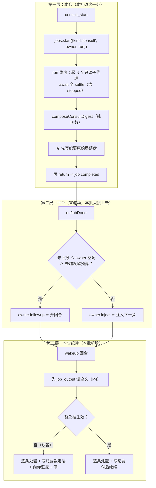
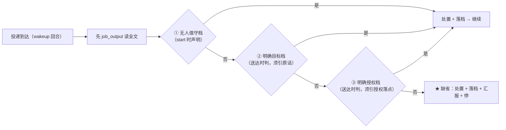
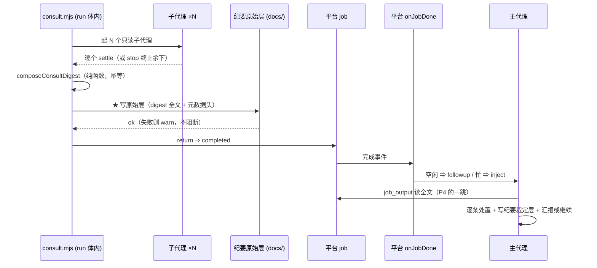

# 设计：会诊结果的投递与消化 —— 批 15

- 日期：2026-09-15
- 需求档：[`2026-09-15-consult-delivery-requirements.md`](./2026-09-15-consult-delivery-requirements.md)（**US-1…US-12** · **N-1…N-7** · §5.1 八项不做 · §5.2 **R-40…R-45**）
- 会诊纪要：[`2026-09-15-consult-delivery-consult-minutes.md`](./2026-09-15-consult-delivery-consult-minutes.md)（**会诊 id 1 · 4/4 交付 / 2 份设计级** · §1 父侧独立回盘核 · **§2 R-1…R-10 逐问裁定**）
- 上游坐标：`D:\workspace\thincoder` @ `58ddb27`（`v0.12.61-4-g58ddb27`）· 本仓复制源 `3e1234b^` · 分叉事件 `3e1234b`（2026-09-07 04:10）
- 章节：按 `METHODOLOGY.md:74-93`「设计文档的成文流程与必备章节」**九节**（§1 背景 · §2 问题 · §3 目标 · §4 决策与理由 · §5 方案 · §6 机制伪代码 · §7 状态与 schema · §8 防偏离 · §9 边界）+ **§10 上游偏离表** + **§11 受影响文件与验收** + **§12 变更记录** + **§13 评审落档**
- 图示：**图 1（投递链三层与责任边界）** / **图 2（三豁免档与缺省停）** / **图 3（settle → 落盘 → completed → 投递 的时序）**
- 状态：**设计待评审**

> ## ⚠️ 读前必读
>
> **1. 本档是重写版。** 初版经用户质问后按 `METHODOLOGY.md:80-93` 逐条量尺，**四个 ❌**：问题缺 `file:line` · 方案无 FR-x · 伪代码无前后置 · **状态与 schema 全无** · 边界十条全是「不做什么」而六类未写。**本档逐节补齐，并在 §12 留痕。**
>
> **2. ★ 本批的第一件事实是「本仓落后上游六天」。** 上游 `3e1234b`（2026-09-07）以 digest 自动注入**退役 `consult_check`**；本仓首个提交 `aeffdf7` = 2026-09-01 ⇒ **本仓复制的是 `3e1234b^`**。**US-1/US-2 不是新设计，是补上落后的六天**；**US-4/US-5（落档）与 US-9/US-10（门禁与墓碑）才是本仓的加法**。
>
> **3. ★ 投递与唤醒由平台已提供**（`dsh-tool-jobs` 的 `onJobDone`，§5.1 逐字）⇒ **本批只把 consult 接上去**，**不照搬上游自造的 `_pendingAsyncResults` 容器**。
>
> **4. 行号引用口径**：定位按**符号名**，行号仅作 as-of 参考。
>
> | 要找什么 | 检索符号 |
> |---|---|
> | 平台的投递点 | `dsh-tool-jobs/lib/index.js` 的 `onJobDone` |
> | 本仓取 jobs 服务 | `lib/advisor.mjs` 的 `getJobsService` |
> | 本仓的 dsh-后台 job 先例 | `lib/eng.mjs` 的 `jobs.start({ kind: "eng-dsh"` |
> | 待退役的协议 | `lib/consult.mjs` 的 `checkConsultSession` · `lib/index.mjs` 的 `"consult_check"` |
> | 待反转的描述 | `lib/index.mjs` 的 `"There is NO completion notification"` |

---

## §1 背景

`consult`（会诊）在本仓是**三工具异步协议**：`consult_start`（非阻塞）/ `consult_check`（逐个收回复）/ `consult_stop`（早停）。

**这套协议是上游 2026-09-01 的形态。上游在 `3e1234b`（2026-09-07 04:10）把它改掉了**——以 **digest 自动注入**退役 `consult_check`（`agent/setup.mjs:269-270` 逐字：「consult 家族**只剩 2 工具**——setup 注册点与描述面同步清零」）。**本仓的移植停在改造之前，且从未记录这次分叉。**

⇒ 本会话里父侧据此撞了**三到四次**（发完 `consult_start` 就结束回合等一个不会来的通知；用户两次追问「会诊结束了没有」）。**父侧先前的处置是把那条描述改成「没有通知，你必须自己回来」（`37d7eef`）——那句话对本仓准确，但它把缺口固化成了契约，而不是修掉它。**（**该句在本批 FR-3 被逐字反转**，见 §4 D15-9 与 §10 偏离表。）

---

## §2 问题（**带 `file:line` 证据**）

| # | 现象 | 根因（`file:line`） |
|---|---|---|
| **P1** | 会诊结束**无人知晓、无物推动** | `lib/consult.mjs:276-308`：`startConsultSession` **fire-and-forget** 起子代理即返回；唯一消费面是 `checkConsultSession`（`:317-352`）的**阻塞轮询**；`lib/index.mjs:1033-1034` 的描述面**自己承认**「There is NO completion notification … you must come back yourself」 |
| **P2** | 协议**落后上游且从未记录** | `lib/consult.mjs:2` 头注仍是三工具协议；上游 `3e1234b`（2026-09-07）已退役 check；**分叉从未入档**——唯一相关痕迹是 `CHANGELOG.md:215` **还在对上游已删协议做加固** |
| **P3** | **重启 = 静默全灭** | `lib/state.mjs:11-13` 与 `:55-56`：`consult*` 明文**不进持久化视图**，Map 纯内存；**已实际咬过一次**：`docs/2026-09-13-design-review-guard-requirements.md:19` 记载重启后 `unknown consult id`，**kimi-api:kimi-k3 的回复不可复得** |
| **P4** | 完成通知**只含一行指针** | 平台契约（`lib/advisor.mjs:1677-1679` 登记）：「完成通知只含一行指针（**全文经 `job_output` 读取**，保尾截断）」⇒ **digest 的实际阅读动作是 wakeup 回合里再调一次 `job_output`**，而父侧初版设计完全没写这一跳 |

**★ P3/P4 由两家会诊各自独立点出**（v4-pro 的发现 3 · glm 的 P4），**父侧初版全部漏掉**。

---

## §3 目标

| # | 目标 | 验收面 |
|---|---|---|
| G1 | 会诊结束**自动投递**，调用方零动作 | AC-1 · AC-2 |
| G2 | 投递到达后**停下向用户汇报**（缺省档） | AC-3 · AC-4 |
| G3 | **三豁免档**成立时不强制停 | AC-5 · AC-6 |
| G4 | **每条意见被分类处置**，不采纳须给理由 | AC-7 · AC-8 |
| G5 | **纪要默认落档**，豁免须显式留痕 | AC-9 · AC-10 |
| G6 | **`consult_check` 二选一并清零** | AC-11 · AC-12 |
| G7 | **偏离有据可查**（六列 + 方向四值 + 分叉前言） | AC-13 |
| G8 | **未消化的会诊拦得住下一次发起** | AC-19 |
| G9 | **stop 不丢已收到的回复** | AC-20 |
| G10 | 不引入新漂移（台账零改 · 零新增测试档 · 六串净） | AC-14 … AC-18 |
| **★ G11** | **跨批判定与收口登记有落点**（**订正：设计评审 #1/#2 指出初版 US-8 与 N-6 无 AC 映射**） | **AC-27**（US-8：偏离表含 X-1 指针）· **AC-28**（N-6：交接页登记） |

### §3.1 非目标（**本批不做什么**）

| # | 非目标 | 理由 |
|---|---|---|
| 1 | **不照搬上游的 `_pendingAsyncResults`** | 平台已有等价设施（N-1） |
| 2 | **不改 consult 只读子代理语义** | 上游明文 |
| 3 | **不做模型间交叉通信** | 上游明文列为不做 |
| 4 | **不做部分 settle 提前注入** | 上游已裁「全 settle 才入流」 |
| 5 | **不修 X-1（`DESIGN-dsh-port.md` 悬空引用）** | 归批 14（同物种） |
| 6 | **不做 `escapeXml`** | DSH 的 `job_output` 是纯文本、无 XML 信封（§4 D15-6） |
| 7 | **不新增持久化**（`consultSessions` 保持纯内存） | **没有持久化就没有迁移面**（§9 升级类）；取证靠新台账 |
| 8 | **不给「汇报质量」加机检锁** | 语义只能人眼（R-41）；**中间层要加**（US-9） |

---

## §4 决策与理由（选定 + 为什么 + **被否决的备选及否决理由**）

| # | 决策 | 为什么 | 被否决的备选与理由 |
|---|---|---|---|
| **D15-1** | **走平台 `jobs`，不自造投递容器** | DSH 的 `dsh-tool-jobs` **已提供同一件事**（§5.1 逐字）；**且本仓已有成品先例**——`lib/eng.mjs` 的 `kind: "eng-dsh"` 后台 job，其 `run` 体内就是 `ctx.subagents.start`（`:919-966`） | **否决「照搬上游 `_pendingAsyncResults`」**：上游自造它是因为**上游没有等价平台设施**；本仓复刻 = **重复实现**，且要复刻挂起 / 唤醒 / 容量 / 截断全套 |
| **D15-2** | **退役 `consult_check`** | 上游明文「只剩 2 工具——**setup 注册点与描述面同步清零**」 | **否决「保留作兼容」**：那会留下**两条消费通道**（半套协议），违反 US-7，且正是上游 `3e1234b` 明令消灭的形态 |
| **D15-3** | **`stopped` 会话产「墓碑 digest」**（**★ 有意偏离上游 `T-R17c`**） | 上游「stop 不产 digest」在**轮询协议**里成立（停者自己回头读队列）；**退役 check 后 digest 是唯一消费通道** ⇒ stop 无 digest = **已收到的回复整批蒸发 + 死亡行失去消费面**——后者**直接打穿批 6 的裁定**（`test/death-provenance.test.mjs:252-265` 的 stop 面断言 = 「死亡行必须经**生产消费面**可见」，见 `docs/2026-09-13-death-diagnosability-design.md:355`） | **否决「照跟 `T-R17c`」**：消费模型变更使有损 stop 从「可容忍」变成「数据丢失」。**两家会诊独立同结论**（v4-pro F-A · glm F-A） |
| **D15-4** | **`jobs` 缺失 ⇒ 拒发（fail-closed），不回落同步** | 仓内先例（`advisor.mjs` / `escalate.mjs` 的「响亮告警 + 回落同步」）**成立的前提是工作量适配 600s 墙钟**；而 **`consultTimeoutMs` 缺省 **600000ms（10 分钟）**（`lib/config-store.mjs:77` 的 `CONSULT_TIMEOUT_DEFAULT_MS`；**★ 订正：本行初写的时长数是错的——父侧误记为「30 分钟」量级，交付期由实施者实测指出**）** ⇒ **回落路径自身就违约通知保证**；且 advisor/eng 是**单次调用**，consult 是 **N 路并行 + 自带墙钟看门狗**（**订正后的论据见下**） | **否决「回落同步」**：回落 = 起一个**永远无人能读的会话** = P1 原样复活；**且 `jobs` 缺失时连投递通道都没有，连「已发起的会诊」都通知不了**。**两家独立同结论**（**★ 结论不受数字订正影响**——真正承重的是「无人能读」与「通知保证违约」，不是预算量级） |
| **D15-5** | **`kind: "consult"`，不带路由后缀** | 既有族是 `<机制>-<路由>`（`advisor-codex` / `eng-codex` / `eng-dsh` / `escalate-*`），**但 consult 会话混跑 dsh 子代理与 codex-cli 行**（`consult.mjs:164-203` vs `:226`）⇒ **带路由后缀必有一侧说谎** | **否决 `consult-dsh`**（v4-pro 的取法）：它给一个混跑会话贴了单一路由标签。**登记为命名偏离** |
| **D15-6** | **不做 `escapeXml`**（**有意不跟上游**） | 上游的 `escapeXml` 是为**它的 XML 消息流**服务的；**DSH 的 `job_output` 是纯文本**，`eng.mjs` 的既有 output 也是裸文本 | **否决「照搬」**：无 XML 信封可逃。**glm 独立同结论** |
| **D15-7** | **「停下汇报」= 两层：质量人眼 + 中间层可机检** | **父侧初版写「不加机检锁，因为散文锁会咬人」——被 glm 指出超界**：它从「散文质量不可机判」滑到了「因此什么都不能机检」。**门禁不变量**（US-9）是 **R-25 形态的 choke-point 谓词**：① 并入既有块 · ② 带自证腿（**每条腿都是文件形状事实，零散文判断**）· ③ 台账零改 | **否决「加散文锁」**（判汇报质量）；**也否决「什么锁都不加」**（放过门禁这个现成机检面） |
| **D15-8** | **三豁免档：不对称判定** | **「无人值守」在 start 时声明**（发起前就知道）；**「明确目标」与「明确授权」在送达时判**（两者都要求**引用对话中的原话或既有授权文档**） | **否决「全在 start 判」**（v4-pro）：start 时无法预知送达时的事实（用户是否还在）。**否决「全在送达时判」**（glm）：事后自判 = **道德风险敞口** |
| **D15-9** | **反转 `37d7eef` 那条描述**，并**连带删掉批 14 的 A 项** | 批 15 让 consult 走平台 `jobs` ⇒ **它有通知了**，那条描述随之变假。**批 14 尚未开工 ⇒ 删它零成本** | **否决「让两批并存」**：留着则批 15 后描述为假；删则批 14 少一项——**两害相权取其轻**（用户裁定 T-1）。**这不冲突：`37d7eef` 的历史不重写，只在偏离表与 CHANGELOG 留痕** |
| **D15-10** | **AC 一律打可验性三层标（T1/T2/T3）** | 本批**多数行为真机不可验**（不重启）⇒ 不分层，**交付评审会放过虚构的绿**。**两家会诊都点出这是「最易写空的空节」** | **否决「只写 AC 不打层标」**（父侧初版）：那使「会诊结束时用户被通知」看起来像可验收的，**而它不可验收** |

---

## §5 方案（**分交付单元 FR-x 逐个说明**）

> **★ 切法与理由**（纪要 R-2）：**三个 FR 依次做，但只在全部通过后才提交。** FR 单元的意义是**验收粒度，不是提交时序**——**退役先行 ⇒ 中间态红**（结果无消费者 = P1 复活）；**投递先行 ⇒ 双通道并存**（违反 US-7）；**且本机不能重启 ⇒ 任何中间态都无法真机验证** ⇒ 分批买不到可验证收益。**两家会诊独立同结论。**

### §5.1 平台已有的投递能力（**逐字，本批不重造**）

`dsh-tool-jobs/lib/index.js` 的 `onJobDone`（`:206-227`）逐字：

```js
ctx.jobs.onJobDone((snapshot, owner) => {
  if (snapshot.reported || owner === void 0) return;
  const spent = spentWakes.get(owner) ?? 0;
  if (delivery === "wakeup" && owner.status === "idle" && spent < wakeBudget) {
    spentWakes.set(owner, spent + 1); owner.followup(message); return;   // 空闲 ⇒ 开一个回合
  }
  owner.inject(message);                                                  // 忙 ⇒ 注入下一个 step
});
```

配套（同档）：`:10-12`「delivers **unreported** completions to the owning agent: injected into a busy owner's next step, or opening a turn on an idle one under the default `wakeup` delivery, bounded per owner」· `:170` `completionDelivery ?? "wakeup"` · `:171` `maxConsecutiveWakes ?? 3` · `:175-177` **用户回合重置唤醒预算**（`agent/inbox/claimed` + `source.kind === "user"` ⇒ `spentWakes.delete`）。

**本仓先例**：`lib/eng.mjs` 的 `jobs.start({ kind: "eng-dsh", …, run: () => ctx.subagents.start(...) })`；取 jobs 服务的 helper = `lib/advisor.mjs` 的 `getJobsService(deps)`（`ctx.get("jobs") ?? null`）。

### §5.2 图 1：投递链三层与责任边界



**读图要点**：**第一层只改一处（派发方式）**；**第二层零改动**（平台已具备）；**第三层是本批真正新增的纪律**。⇒ 这是本批「比看上去小」的结构原因。

### §5.3 图 2：三豁免档与缺省停



**读图要点**：**三档的判据来源都是「对话中的用户原话或既有授权文档」**；**缺省永远是停**；**且三档都不得免除落档**（US-5 的默认独立于豁免）。**豁免的是「停」，不是「读」**（豁免下**仍必须读完 digest 并写处置**）。

### §5.4 图 3：settle → 落盘 → completed → 投递 的时序



**读图要点**：**★ 落盘在 `completed` 之前**——这是**投递失败时的兜底**（§4 D15-4 的记录面 fail-open）：**投递成不成功，纪要都在盘上**。

### §5.5 FR-1 派发与投递

**做什么**：`consult_start` 不再 fire-and-forget，改为**包一个平台 job**：`run` 体内起 N 个只读子代理并 `await` 全 settle；`composeConsultDigest` 抽为**纯函数**；**settle 时刻先写纪要原始层、再让 job complete**。

**前置条件**：① `jobs` 服务可用（否则按 D15-4 **拒发**）· ② 池非空且选择器能匹配（既有校验，`consult.mjs:279-284` 保持）。
**后置条件**：① `session.digest` 为 string 且含头部行 · ② `session.settledAt` 已置 · ③ **纪要原始层已在盘上** · ④ job 输出 = digest 全文。

### §5.6 FR-2 退役 `consult_check`

**做什么**：删注册点（`lib/index.mjs`）· 删 `checkConsultSession` + `waiters` 机制（`lib/consult.mjs`）· **18 字符串点**与**26 调用点**的分面处置 · eng/escalate 的 toolFilter deny 名单同步 · `death-provenance` 测试**改指 digest** · **反转批 14 A 项那句描述**。

**★ 消费面两个数（父侧实测，两家会诊给的是 ~28）**：

| 面 | 数 | 分布 |
|---|---|---|
| **字符串点**（`consult_check`） | **18** | `lib/index.mjs` 4 · `lib/consult.mjs` 3 · `lib/eng.mjs` 2 · `lib/escalate.mjs` 2 · `test/death-provenance.test.mjs` 3 · `README.md` 2 · `lib/prompts/main.md` 2 |
| **函数面**（`checkConsultSession`） | **26** | `death-provenance.test.mjs` 11 · `codex-runner.test.mjs` 6 · `consult.test.mjs` 6 · `lib/index.mjs` 2 · `lib/consult.mjs` 1 |

**★ 锁面变更（须显式声明）**：**`test/consult.test.mjs` 在基线集内（`git ls-tree -r 2e6ca8b -- test` = 12 项之一）且不在 `AP_TEST_AUTHORIZED`**（现有 3 项：`design-review-guard` / `codex-runner` / `config-api`）⇒ **改它必须走授权仪式**：`AP_TEST_AUTHORIZED` 加档名（住在 `death-provenance.test.mjs`，可改）+ 台账退役日志 + 用户裁定引用。

> **★ 订正（设计评审 #13 + 分歧审计 W2）**：本批**零新增测试档、零退役测试档**（**20 个档进 20 个档出**——**★ 本行初写「19/19」是错的**，实测 `test/*.test.mjs` 在 HEAD 与交付树均为 **20**，台账 §三亦 20 行；**实质结论（零新增/零退役）为真，只有数字错**）⇒ **T-E19 清单无需改动**（它 deepEqual 的是 fs 测试档集）。**初版此处未写明「为何省略 T-E19」而被评审标出**——**省略也必须给理由，不能静默**。**而纪要 R-9 列了 4 项却自称「三件套」（含 T-E19），属纪要的计数笔误，已在纪要订正为 3 项。****这与批 13 的 `advisor-config.test.mjs` 完全同形。**

**★ 且该档的存续理由被本批改写**：`test-lifecycle.md:90` 载其理由是「锁会诊跨回合存活」——**本批改了那个机制** ⇒ **它必须跟着改，不是可改可不改**（glm）。

**★ `CHANGELOG.md:215` 不是消费点**（历史记录）⇒ **不扫、不改写**；X-2 的处置 = **登记进偏离表**。

### §5.7 FR-3 消化纪律

**做什么**：缺省停 + 三豁免档 + 豁免留痕 + **门禁不变量** + `prompts/main.md` 重写（**含「wakeup 回合先 `job_output` 读全文」**）。

**门禁不变量（US-9）**：**不存在 `settled ∧ ¬digested ∧ ¬minutesExempt` 的会话**。命中 ⇒ `consult_start` **拒发**并**内联未消化 digest** + ack 指引 ⇒ **拒发即恢复通道**（它自己就是那条"下一次发起"）。

**★ 台账孤儿扫描（订正：设计评审 #12）**：初版 §9 重启行承诺「门禁报『#N 因重启丢失』」，**但门禁不变量只覆盖 `settled ∧ ¬digested`，而 `started` 无 `settled` 的孤儿行根本不触发它**——**承诺与机制不符**。⇒ 在 FR-3 增加**孤儿扫描**：`consult_start` 时扫台账，对**有 `started` 无 `settled`/`stopped`/`disposed`** 的 id，**输出建议性提示**（「#N 曾于 `<t>` 发起，未见 settle——可能因重启丢失」），**不阻断**（它可能正是一个在飞会话）。**给 AC-26**。

**ack 形状**：`digested: [ids]` 且每 id 带 `minutesPath`（**fs 存在性校验**）或 `minutesExempt: {reason}`。

---

## §6 机制伪代码（**含前置/后置条件**）

### §6.1 FR-1：settle 与投递（`lib/consult.mjs`）

```js
/**
 * settleAndDeliver — 会话稳定后合成 digest、落盘、再让 job complete
 *
 * @pre  session.pending === 0 || session.stopped === true   （全 settle 或早停）
 *       session.digest === null                             （幂等：只合成一次）
 * @post session.digest 为 string，头部行形如
 *         "[consult #<id> finished — <N> of <M> replied (<F> failed[, <S> stopped])"
 *       且含「有效数」段（T-3）
 *       session.settledAt 已置（now）
 *       ★ 纪要原始层已在盘上（写失败则 warn，不阻断）
 *       job output === session.digest
 *       异常路径：digest = 失败信封（**仍投递**），绝不静默
 */
async function settleAndDeliver(session, deps) {
  if (session.digest !== null) return session.digest        // 幂等
  const digest = composeConsultDigest(session)              // 纯函数，可单测
  session.digest = digest
  session.settledAt = Date.now()
  try { session.minutesPath = await writeMinutesRawLayer(session, digest) }  // ★ 先落盘
  catch (e) { warn("纪要原始层写出失败（不阻断投递）：" + e?.message) }
  ledgerAppend({ ev: "settled", id: session.id, at: session.settledAt })      // fail-safe
  return digest
}
```

### §6.2 FR-1：发起（`lib/consult.mjs`）

```js
/**
 * consult_start 的派发
 *
 * @pre   池非空且 selectors 能匹配（既有校验保持不变）
 * @pre   jobs 服务可用 —— 否则**拒发**（D15-4）
 * @post  返回 job 句柄文本（复用 jobsDispatchReply 先例）
 *        平台按 onJobDone 投递；本仓不再需要任何"回来读"的动作
 *        拒发路径：**未派发任何子代理**，错误文本响亮且可行动
 */
```

### §6.3 FR-3：门禁（`lib/index.mjs` 的 `consult_start` 入口）

```js
/**
 * 门禁不变量：不存在 settled ∧ ¬digested ∧ ¬minutesExempt 的会话
 *
 * @pre   无（入口最先执行）
 * @post  命中 ⇒ 返回**拒发文本 + 内联未消化 digest + ack 指引**
 *        未命中 ⇒ 正常派发
 *        豁免传入时：consult_start 的结构化参数 `exemption:{kind,note}`
 *          · kind ∈ {"unattended"}（仅此档在 start 时声明）
 *          · note 必填（**留痕**）
 */
```

---

## §7 状态与 schema（**四套形状 + 谁写谁读**）

> **★ 四套而非三套**：第四套是**纪要档模板本身**——**本批的主题，而父侧初版完全没想到要定义它**（v4-pro 的 §Ⅴ-1 点出）。

| 面 | 形状 | **谁写** | **谁读** |
|---|---|---|---|
| **① 会话对象**（**原地扩展，不另起**；现形状见 `consult.mjs:289-293`） | 现有字段（`id` · `controllers` · `runs` · `replies` · `pending` · `failed` · `terminated` · `stopped` · `received` · `total` · `models`）**不动**；**增**（**★ 订正：分歧审计 F5 实测是 9 个而非 8 个——初版枚举漏了 `disposed`**）`jobId:string\|null` · `settledAt:number\|null` · `digest:string\|null` · **`requiresReport:boolean`** · `digested:boolean` · `minutesPath:string\|null` · `minutesExempt:{reason:string}\|null` · `exemption:{kind:"unattended",note:string}\|null` · **`disposed:boolean`**（`R-9`：dispose 不移除会话、也不产墓碑——与 `cancel` 面的既有登记例外一致）；**FR-2 后删** `waiters`（check 专属） | `consult.mjs` | run 体 · 门禁 · **wakeup 回合** |
| **② digest** | **不需要独立对象**——上游的 `{id, role:"consult", report, done:true}` 是为它**自造容器** `_pendingAsyncResults` 服务的；**本仓容器 = 平台 job，job 输出就是 digest 全文**。`session.digest` 只留**字符串副本**（审计/测试/门禁内联用），**单一写点 = `settleAndDeliver` 里的 `composeConsultDigest`** | 纯函数写一次 | run 体 · 门禁 · 纪要作者 |
| **③ job spec** | `{ kind: "consult", label: "consult #<id> (<N> models: …)", owner: agent, outputLimitBytes: 131072, run: () => ({cancel, done}) }`——**逐字段对齐 `lib/eng.mjs` 的既有先例**（含 `{cancel, done}` 返回形） | `consult.mjs` | 平台 `dsh-tool-jobs` |
| **④ ★ 纪要档** | **命名 `docs/consult-minutes/<YYYY-MM-DD>-consult-<id>-minutes.md`**（**★ 订正：评审 #6 指出 `<topic>` 在 settle 时刻不可知**——机制写 §0/§1 时还没有题目 ⇒ **用 `<id>` 派生，保证机制可确定地命名**；主代理补写裁定层时可**在档内补题**，但**不改名**——AC-9/V8 的形状谓词依赖该 glob。**★★ 批 15 修复轮订正（分歧审计 F1 = 🔴 / 用户裁定「改子目录」）：落点由 `docs/` 顶层改为 `docs/consult-minutes/` 子目录**——R-25 登记谓词 `docsTopLevel()` **非递归**只读顶层、且要求顶层每个 `*.md` 登记在 `docs/README.md` 全文里 ⇒ **顶层落一份纪要必令套件红**；该档 `:122` 明文「域 = `docs/` 顶层：子目录天然在域外」⇒ 子目录是唯一既不撞谓词、也不必改谓词语义的位置。**新形态与既有 9 份顶层 `<date>-<topic>-consult-minutes.md` 不同名、不同层 ⇒ 互不干扰（既有 9 份不动）**）。**结构与既有 9 份一致**（盘上真值 **9**，实测于 2026-09-15）：§0 汇总 + §1 原始层（**机制写**）· §2 逐问裁定 + §3 分歧与父侧裁定 + §4 教训 + §5 不可验清单（**主代理写**）· §6 历史行 | **§0/§1 机制写 · §2–§5 主代理写** | 人 · V8 谓词 · 后续批次 |
| **⑤ 台账**（新增） | `$DSH_HOME/.thincoder/consult-ledger.jsonl`：`{id, sessionId, at, ev:"started"\|"settled"\|"digested"\|"exempted"\|"stopped"\|"disposed", …}`——**append-only，只增不改** | `consult.mjs`（**写失败 warn，不阻断投递**） | 门禁（重启取证 + **id 计数器续接**）· 测试 |

**★ 关键分工：插件永不写纪要。** 机制只写**原始层**（digest 全文 + 元数据头）；**裁定层是判断，由主代理写**。⇒ 这个二分是「纪要默认落档」能落成机制的关键——否则要么插件替主代理做判断（越权），要么机制无从保证。

> **★ `requiresReport` 的定义（订正：设计评审 #5 指出它被使用却从未被定义）**
>
> | 面 | 内容 |
> |---|---|
> | **形状** | `boolean`（**非空**，settle 时必写） |
> | **写者** | `settleAndDeliver`（**与 digest 同一次**，单一写点） |
> | **读者** | **wakeup 回合的主代理**——据它决定**是否停在汇报断点** |
> | **取值规则** | ① **正常 settle** ⇒ `true` · ② **全失败** ⇒ `true`（**「什么都没问到」本身就是必须汇报的事实**，§9 空集行）· ③ **`stopped` 墓碑** ⇒ `false`（stop 是代理自己发起的，且 stop 时代理必在回合内）· ④ **豁免档生效** ⇒ **字段仍为 `true`，但主代理按豁免继续**（**字段表达「事实」，不表达「动作」**——豁免是判断，不该污染机制字段） |
> | **锚** | **AC-20**（墓碑 ⇒ false）· **AC-22**（头部行与字段一致） |

**★ `kind` 取 `"consult"` 而非 `<机制>-<路由>`**（D15-5）：consult 会话**混跑** dsh 子代理与 codex-cli 行 ⇒ 带路由后缀**必有一侧说谎**。

---

## §8 防偏离

### §8.1 零改面

| # | 面 | 判据 |
|---|---|---|
| 1 | `test/fixtures/**` | `git diff` 为空 |
| 2 | **不新增测试档** | `readdirSync(test).filter(.test.mjs)` 数不变 |
| 3 | **不新增顶层 `test(`** | 台账 §三**零改** |
| 4 | `lib/**` **六串零命中** | T-PK15 |
| 5 | **`failStop(` 计数恒 18** | 既有断言 |
| 6 | **`lib/advisor.mjs` 零改动** | 只 import 其 `getJobsService` |
| 7 | **平台包 `dsh-tool-jobs` 零改动** | 在仓外，本批只接上去 |

### §8.2 机验锚（**谓词三要素写全：检索目标 / 谓词 / 期望**）

> **★ 订正（设计评审 #9）**：初版只写「列在 §11.3」，而 §11.3 的锚列**只有名字** ⇒ **V4/V5/V9/V10 实为空符号**，实现者只能自造。⇒ 此处逐个写全。

| 锚 | 检索目标 | 谓词 | 期望 |
|---|---|---|---|
| **V1** | `lib/**` · `lib/prompts/**` · **`README.md`**（**订正：评审 #8 指出初版漏了 README**——§5.6 实测它有 2 处、§11.1 也要改它） | 正则 `consult_check` | **零命中**（**负向断言**） |
| **V2** | `lib/index.mjs` 的 consult 注册段 | 正则 `register\(textTool\(\{\s*name: "consult_`（**★ 订正：分歧审计 W3 实测，初版写的 `register(textTool({ name: "consult_` 匹配 0 处——两处注册是多行的 ⇒ 该谓词永远不可能等于 2 ⇒ 锚「不可通过」而非「恒真」**） | **恰 2**（`consult_start` · `consult_stop`） |
| **V3** | `lib/consult.mjs` 的 `composeConsultDigest` | 对合成会话调用，断言输出 | 头部行匹配 `^\[consult #\d+ (finished\|stopped) — \d+ of \d+ replied \(\d+ failed(, \d+ stopped)?\)` **且**含有效数段；逐条回复在场；**墓碑含 stop 死亡行** |
| **V4** | `lib/index.mjs` 的 `consult_start` 入口 | grep 拒发文案与门禁不变量实现 | 存在「`settled ∧ ¬digested ∧ ¬minutesExempt`」判据 + **拒发文案含「未派发任何子代理」**；`jobs` 缺失路径**同样拒发**（不回落） |
| **V5** | `lib/index.mjs` 的豁免参数 schema | 断言 `exemption.kind` 的**取值枚举**与**缺省** | 取值**仅** `"unattended"`（start 时）；**缺省 = 无豁免 = 停**；`note` 必填；`goal`/`authorized` **不在 start 参数里**（送达时判，落纪要裁定层 + ack） |
| **V6** | `lib/consult.mjs` 的派发点 | grep `jobs.start(` 与回落分支 | **走 `jobs.start`**；**无同步回落分支**（拒发替代） |
| **V7** | `dsh-tool-jobs` 包路径 | `git`/`fs` 断言 | **零改动**（在仓外；本批只接上去） |
| **V8** | `docs/*-consult-minutes.md`（顶层既有 9 份，不动）与机制新落点 `docs/consult-minutes/*-minutes.md`（**子目录 = R-25 登记谓词域外**）的形状 + `docs/README.md` | 文件名 glob + 登记谓词 + 新描述面 grep | 机制产的纪要命中 `docs/consult-minutes/<date>-consult-<id>-minutes.md`（**★ 修复轮 F1 订正**：旧谓词写顶层，而顶层会撞 R-25 登记谓词）；**新描述面含「自动投递 / 收到须汇报」**（**正向锁**）；`prompts/main.md` 含「先 `job_output` 读全文」 |
| **V9** | `docs/2026-09-15-consult-delivery-design.md` §10 | 断言表结构 | **六列齐** · 方向值**限四值** · **分叉前言四要素在场**（上游 sha / 本仓复制源 / 分叉事件 / 比对日期） |
| **V10** | 台账 + 既有锁 | 跑 `doc-hygiene` / `ledger-parity` / `test-lifecycle` / `guard-e` 的既有谓词 | 全绿；**台账 §三零改**；`failStop(` 恒 18；六串零命中 |

---

## §9 边界（**规范六类 + 失败方向**）

| 类 | 本批必须定义的行为 | 方向 |
|---|---|---|
| **空集** | **池空 / 选择器无匹配** ⇒ **既有 fail-fast 于 start 前**（`consult.mjs:279-284`）保持。**★ 全模型失败 ≠ 空集**：digest 照投 `0 of M replied (M failed)` + 逐条失败行，`requiresReport: true`——**「什么都没问到」本身就是必须向用户汇报的事实** | fail-closed（拒发） |
| **畸形输入** | **单条回复软顶** `CONSULT_DIGEST_REPLY_CAP = 8000` 字符 + 截断标记 + **全文在纪要**（第二层 = `outputLimitBytes` 保尾截断）。**控制字符清洗**。**★ 不做 `escapeXml`**（D15-6）。空回复**已有兜底**（`consult.mjs:257` 的 `(empty reply)`） | fail-open（截断不阻断） |
| **并发** | **同会话两会诊合法**——各是独立 job / 独立 digest，**不注册 single-flight 槽位**（多会话并发是产品常态，与 advisor/eng 单飞先例**有意偏离**）。**唤醒预算耗尽降级为 inject 不是缺陷**——inject 本就是主通道，wakeup 只是空闲加成；真正残余风险（空闲 owner 三次 wake 耗尽）**要求代理连续两次无视「停下汇报」才会发生** ⇒ **纪律本身是预算的保护者**（本设计显式声明这一依赖）。**stop 与 settle 竞速**：`stopped` 旗标 + 已终态控制器 no-op；**已 settle 的会话 stop 无效** ⇒ 返回 `{stopped: 0, alreadySettled: true}` | — |
| **重启** | `consultSessions` **纯内存** ⇒ **在飞会话与 job 同死**；**不新增持久化**（对齐 `state.mjs` 契约）。**保证面 = 落盘次序**（§5.4）：**settle 即落盘 ⇒ 重启只损失「真在飞」的会话**。台账留下 `started` 无 `settled` 的**孤儿行** ⇒ 下次 start 门禁报「#N 因重启丢失」（**治 P3 的取证面**）。**★ 不写「重启后自动恢复」这类假事实** | 损失如实声明 |
| **升级** | **无 schema 迁移表**（**不要写**）。四条真事：① 旧版 9 份纪要**维持原形状，不回填**；② 本批**不新增配置键**（豁免走工具参数，不走配置）；③ **★ 台账行有 ev-schema 演化面**（**订正：设计评审 #14 指出初版「无迁移面」未涉此事**）——`consult-ledger.jsonl` 是 **append-only 持久工件**，故**读者必须前向兼容**：**遇到未知 `ev` 值 ⇒ 忽略该行、不报错**（新版本写的新事件老读者不应崩）；④ **`consultSessions` 仍纯内存**（无迁移面） | 无 schema 迁移；**台账读者前向兼容** |
| **失败方向** | 见 §4 D15-4：**消费链 fail-closed，辅助面 fail-open**——① **start 面拒发**（jobs 缺失 / `jobs.start` 抛错 ⇒ 响亮拒绝，**零部分工作**）· ② **记录面 fail-open**（纪要写盘失败只 warn）· ③ **投递面损失只许是「汇报」，不许是「记录」**（由落盘次序保证）· ④ **台账写失败 ⇒ warn 后照常投递**（取证面不承重） | 逐子系统见表 |

---

## §10 上游偏离表（**六列 + 分叉前言 + 方向四值**）

> **★ 分叉前言（合规必需——没有这一行，「跟随/偏离」全部不可复核）**
>
> - **上游基线** = `D:\workspace\thincoder` @ **`58ddb27`**（`v0.12.61-4-g58ddb27`，2026-09-11）
> - **本仓复制源** = **`3e1234b^`**（= `v0.12.59-19-g15c14ae`）
> - **分叉事件** = **`3e1234b`（2026-09-07 04:10）**——上游退役 `consult_check`，改 digest 自动注入
> - **本仓首个提交** = `aeffdf7`（2026-09-01 18:27）⇒ **本仓抄的是改造前的祖先，且从未记录这次分叉**
> - **比对日期** = 2026-09-15
>
> **★ 方向值（订正：分歧审计 W4）**：**提交的 §10 表实测有 7 个不同的方向值**——`跟随` / `本仓加法` / `有意不跟` / **`上游已改本仓未跟`** / **`本仓命名`** / **`本仓自纠`** / **`有意不跟仓内先例`**。**本行初写「四值」是错的**（我只列了最初设计的四个，后来表长出三个而枚举没跟——**「枚举不追列表」，本批立项要治的那个病，又一次出现在本批的档里**）。⇒ **验收口径改为「方向值的取值域必须是一个封闭枚举，且表中每个值都在域内」**，具体域见本行枚举。**★ 批 15 修复轮补注（语义零改，只为让本口径可判）**：表里的**方向值 = 单元格主干 token**——取**首个 `（` 或 ` → ` 之前**的部分；括注与箭头后的文字属「理由/补充」，**不是方向值本身**（否则「每个值都在域内」这条口径对实测形态永远判不过——修复轮实跑 V9 时发现）。按此归一，上表 14 行的主干集合**恰为上述 7 值**。

| 本仓行为 | 上游行为 + 坐标 | 方向 | 理由 | 复检条件 | 锚 |
|---|---|---|---|---|---|
| **退役 `consult_check`，digest 自动注入** | `agent/setup.mjs:269-270`「只剩 2 工具——setup 注册点与描述面同步清零」；注入 `agent.mjs:105-113` | **上游已改本仓未跟 → 本批补上** | 落后六天；**本批核心** | 每次上游版本对齐时 | **AC-11 · AC-12 · V1/V2** |
| **投递 = 平台 `jobs`** | 上游自造 `_pendingAsyncResults` 容器（`async-settle.mjs:171` · `consult.mjs:149-160`） | **有意不跟**（用更省的下沉设施） | DSH 平台 `onJobDone` **已提供同一件事**；自造 = 重复实现 | 平台投递语义变更时 | **AC-1 · AC-2 · V6** |
| **空闲强制消化轮** | `suspension-drive.mjs:229-230` 跑 `autoTurn` | **有意不跟**（等价物由平台 `followup` 提供） | 平台 `owner.followup` 即「开一个回合」 | 平台 `wakeup` 投递语义变更时 | V6 |
| **停下汇报** | **上游无此语义** | **本仓加法** | **用户裁定 1** | 用户改口时 | AC-3 · AC-4 |
| **三豁免档** | 上游有「按回合档位」（手动档 auto-turn = 整理禁写） | **本仓加法**（取更简形态） | **用户裁定 2** | 用户改口时 | AC-5 · AC-6 |
| **纪要落档** | **上游无此机制**（只有 `TMP_RETENTION_MS = 3×24h` 自轮转 offload 日志，`helpers.mjs:80/:102-119`） | **本仓加法** | **用户裁定 3**；本仓既有 9 份该形态档 | 上游引入等价机制时 | AC-9 · AC-10 |
| **★ `stopped` 产墓碑 digest** | `consult.mjs:151`「cancelled — no digest（`T-R17c`）」 | **有意不跟**（D15-3） | 消费模型变更使有损 stop **从可容忍变成数据丢失**，且**打穿批 6 的死亡行消费面裁定** | 本批验收后**不再适用**（已改） | **AC-20** |
| **★ `jobs` 缺失拒发** | （上游无 jobs 依赖） | **有意不跟仓内先例** | 先例前提是工作量适配 600s；**consult 预算 30 分钟** ⇒ 回落自身违约 | 若平台出现同步 30 分钟通道 | **AC-18** |
| **不做 `escapeXml`** | `consult.mjs:189-191` 用 `escapeXml` | **有意不跟** | **DSH 的 `job_output` 是纯文本、无 XML 信封** | 若 DSH 出现 XML 消息通道 | — |
| **不注册 single-flight** | 上游无（多会话并发是常态） | 跟随 | — | — | **AC-2**（**★ 订正：分歧审计 W6 指出本行初指 AC-16，而 AC-16 实为「描述面正向锁」——指错了**） |
| **不新增 `wait_for`** | `src/tools/wait_for.md:7` 有 `consult done` | **有意不跟** | 等待由 `job_output` 承担 | — | R-42 |
| **`kind: "consult"`（无路由后缀）** | （上游无 job kind 概念） | **本仓命名** | 会话**混跑 dsh 与 codex-cli** ⇒ 后缀必有一侧说谎 | 若会话不再混跑 | — |
| **反转 `37d7eef` 的描述句** | （本仓自加，上游无） | **本仓自纠** | 批 15 让 consult 有通知 ⇒ 那句变假 | 已改，不再适用 | V8 |
| **★ X-1 `DESIGN-dsh-port.md` 悬空引用** | （本仓自加：7 处注释引用一个从未进 git 的档） | **本仓自纠**（**订正：设计评审 #1/#27 指出初版把这个 US 只放进非目标、未落 AC**） | **跨批延后**：归**批 14**（同物种：描述面指向不存在的落点）⇒ 本批只保证**偏离表在此有条目与指针** | 批 14 收口时 | **AC-27** |

---

## §11 受影响文件与验收

### §11.1 实施域

| 文件 | 改动 | 类型 |
|---|---|---|
| `lib/consult.mjs` | FR-1（job 派发 + `settleAndDeliver` + 纯函数）· FR-2（删 `checkConsultSession` + `waiters`）· 台账写出 | **修改（核心）** |
| `lib/index.mjs` | FR-2（删注册点 + 描述面清零 + **反转描述句**）· FR-3（门禁 + ack + 豁免参数） | 修改 |
| `lib/prompts/main.md` | FR-3（流程重写：start → 收投递 → **先 `job_output` 读全文** → 处置） | 修改 |
| `README.md` | 三工具 → 两工具；补投递链与消化纪律 | 修改 |
| `lib/eng.mjs` · `lib/escalate.mjs` | **toolFilter deny 名单同步**（把已退役工具名移除） | **最小改动（★ 订正：评审 #14 指出初版标「注释级」不实——它实为代码级删名）** |
| `test/consult.test.mjs` | 改指 digest 面；**该档存续理由随之改写** | **★ 锁面变更** |
| `test/death-provenance.test.mjs` | T-AP1d 改指 `composeConsultDigest`；**`AP_TEST_AUTHORIZED` 加 `test/consult.test.mjs`** | **★ 锁面变更** |
| `test/codex-runner.test.mjs` | 6 处 `checkConsultSession` 调用迁移（**该档已在授权面**） | 修改 |
| **`CHANGELOG.md`** | **仅新增本批条目**（**订正：评审 #3 指出初版把 CHANGELOG 整个排除、与本批 R-1 要求的「CHANGELOG 留痕」冲突**）——**`:215` 的既有行不动** | 修改（新增） |
| **`docs/2026-09-15-config-surface-recon.md`** | **批 14 范围订正**（R-1 连带：删 A 项）——**已由主代理落于 `a6ebd72`**，本行仅为指针 | **归主代理** |
| **`docs/2026-09-13-handoff.md`** | **登记本批「`lib/**` 需重启生效」**（N-6 的落点，评审 #2） | **归主代理收口** |
| **明确排除（禁改）** | `lib/advisor.mjs` · `test/fixtures/**` · `test/stage-gate.test.mjs` · `test/stages.test.mjs` · `test/guard-e.test.mjs` · `test/advisor-config.test.mjs` · **平台包 `dsh-tool-jobs`** · **历史记录的既有内容**（★ 订正：评审 #3 指出初版措辞可被读成「整档禁改」⇒ **今明确：禁的是 `CHANGELOG.md:215` 这类既有内容，不是新增条目**） | 零改动 |

### §11.2 可验性分层登记（**N-3 要求：AC 一律打标**）

| 标 | 含义 | 本批 AC |
|---|---|---|
| **T1** | 进程内 `node --test` 可证 | AC-1 · **AC-5（仅 `unattended` 档）** · AC-7(形状：每条回复恰一个编号槽位) · AC-10 · **AC-19** · **AC-20** · AC-21 · **AC-22** · **AC-25（仅 `unattended` 档）** · **AC-26（收尾修复轮补腿：生产站点行为腿）** |
| **T2** | 静态谓词可证（grep / 登记表 / 文件形状） | AC-2 · AC-6 · AC-8 · AC-9 · AC-11 · AC-12 · AC-13 · AC-14 · AC-15 · AC-16 · AC-17 · AC-18 · **AC-23** · **AC-24** · **AC-26** · **AC-27** · **AC-28** |
| **T3** | **仅重启后人工核验**（owner = 用户） | **AC-3 · AC-4**（「真的停下汇报了」）· **AC-5 的 `goal`·`authorized` 两档** · **AC-25 的 `goal`·`authorized` 送达时判定那条腿** · **AC-7 的语义腿**（每条处置是否正确、不采纳的理由是否成立） |

> **★ 批 15 修复轮订正（分歧审计的 partial 清单；**修复轮执行于 2026-09-16**）**：三处**层标与实际验证通道不符**，按审计判定**如实降层 / 补腿**——
> ① **AC-5 与 AC-25 的 `goal`·`authorized` 两档降为 T3**：这两档**只有提示词承载、零机制**（`normalizeConsultExemption` 在 start 时**只接受 `unattended`**；`goal`/`authorized` 要求「引用对话中的原话 / 既有授权文档」⇒ 只能送达时由主代理判、落**纪要裁定层 + ack**）⇒「不强制停」这件事**本身不可机检**。**本修复轮不发明新机制**（那要动 `lib/consult.mjs` 的 ack 面，超出修复轮写域）。
> ② **AC-7 的形状腿补成可机检**：机制产出的纪要必须给**每条回复恰一个编号槽位**（`[N]` 密排 `1..N`）⇒「处置行数 == 回复数」的**形状前提**在 T1 可证（语义仍 T3）。
> ③ **AC-16 的正向锁真的加进测试**（此前只写在设计档里）；**AC-20 的 `alreadySettled` 错误用例**与 **AC-23 / US-12** 的真实覆盖同批补上。

> **★ 订正（设计评审 #7）**：本表初版**漏了 AC-22/23/24**——而 §11.3 逐条表里它们**各自有层标** ⇒ **同文档两处枚举不同步**，**正是本批立项要治的漂移出现在本批自己的设计档里**。已补齐。

> **★ 诚实边界**：**「会诊结束时用户被通知」是不可验收的**；**可验收的是** AC-19（门禁不变量）+ AC-20（墓碑）+ AC-21（**settle ⇒ 纪要原始层先于 job complete 存在**）。

### §11.3 验收标准（**AC-x → V-y → US-z → 测试用例**）

| # | 验收标准 | 层 | 锚 | US | 测试用例（正常 / 边界 / 错误） |
|---|---|---|---|---|---|
| **AC-1** | 全 settle 时**产生一次投递**，调用方零动作 | T1 | V3,V6 | US-1 | 正常：3 模型全回复 ⇒ digest · 边界：0 回复 · 错误：全失败 ⇒ 仍投 |
| **AC-2** | 投递经平台 `onJobDone`（忙注下一步 / 空闲开回合） | T2 | V6,V7 | US-1 | grep 断言走 `jobs.start`；平台包零改动 |
| **AC-3** | **缺省档**下投递回合**产出面向用户的汇报** | **T3** | — | US-2 | 人工核验单 |
| **AC-4** | 该回合**停下**（不自动进实施） | **T3** | — | US-2 | 人工核验单 |
| **AC-5** | 三豁免档任一成立时**不强制停** | **T1（仅 `unattended`）· T3（`goal` / `authorized`）** | V5 | US-3 | T1：`unattended` ⇒ 声明 + 三处留痕 · 无豁免 ⇒ 缺省停 · 非法 kind ⇒ 拒（`test/consult.test.mjs`）· **T3（修复轮如实降层）：`goal` / `authorized` 送达时判 = 只有提示词承载、零机制** |
| **AC-6** | 豁免档**缺省全部关闭** | T2 | V5 | US-3 | grep 缺省值 |
| **AC-7** | 每条意见**恰一条处置**（采纳/不采纳/待定） | T1(形状)/T3(语义) | — | US-4 | **T1 形状（修复轮补腿）：机制产的纪要必须给每条回复恰一个编号槽位 `[N]` 密排 `1..N`**（＝「处置行数 == 回复数」的形状前提；纯函数 `minutesShapeViolations`，带三条谓词自证；真跑一次 4 模型会诊产出）· **T3 语义：人眼** |
| **AC-8** | **不采纳必有理由** | T2 | — | US-4 | grep 纪要模板含理由列 |
| **AC-9** | 纪要**默认落档**（机制落点 = `docs/consult-minutes/<date>-consult-<id>-minutes.md`；**子目录 = R-25 登记谓词域外**，既有 9 份顶层纪要不动） | T1 | V8 | US-5 | T1：真跑一次会诊 ⇒ `minutesPath` 命中子目录 glob **且不为 `docs/` 顶层**（`test/consult.test.mjs`，含 AC-21 的落盘次序）· T2：V8 谓词扫形状 |
| **AC-10** | 豁免落档时**必须显式说明理由** | T1 | V5 | US-5 | 边界：带 `minutesExempt` ⇒ 需 reason 非空 |
| **AC-11** | `consult_check` 已退役：`lib/**` 与 `lib/prompts/**` **零命中** | T2 | **V1** | US-7 | grep 零命中（**负向断言**） |
| **AC-12** | consult 家族**恰 2 工具** | T2 | V2 | US-7 | 注册点数 |
| **AC-13** | §10 偏离表**六列齐 + 方向四值 + 分叉前言** | T2 | V9 | US-6 | 表结构断言 |
| **AC-14** | 台账 §三**零改**；T-LC1/T-LC2/T-LC4/T-E19 全绿 | T2 | V10 | — | 既有锁 |
| **AC-15** | 六串零命中；`failStop(` 恒 18 | T2 | V10 | — | 既有锁 |
| **AC-16** | 新增**正向锁**：新描述面含「自动投递 / 收到须汇报」 | T2 | V8 | — | **修复轮落地**：`test/consult.test.mjs` 断言 `lib/index.mjs` 含 `Delivery is AUTOMATIC` / `you ARE notified in-session` / `STOP and report to the user`，`prompts/main.md` 含后两句的同款；**反向**：批 14 那句 `There is NO completion notification` **只准住注释**（逐行断言 + 「仍在注释里」的自证腿）· **★ 收尾修复轮追加（交付代码评审 #3 的追加要求）**：同一锁组再加**路径字面正向锁**——断言 `lib/prompts/main.md` 与 `README.md` **都含 `docs/consult-minutes/`** **且都不得含**旧顶层字面 `docs/<date>-consult-<id>-minutes.md`（`minutesPathLegs` 双态谓词 + 两条谓词自证腿，防再次漂移） |
| **AC-17** | **`lib/advisor.mjs` 与平台包零改动** | T2 | — | — | 空 diff |
| **AC-18** | `jobs` 缺失时**响亮拒发**（绝不静默） | T2 | V4 | — | grep 拒发文案 |
| **AC-19** | **门禁不变量**：不存在 `settled ∧ ¬digested ∧ ¬minutesExempt` | **T1** | V4 | **US-9** | 正常：已消化 ⇒ 放行 · 边界：裸 settle ⇒ 拒发+内联 · 错误：ack 路径不存在 ⇒ 拒 |
| **AC-20** | `stopped` 会话**产墓碑 digest**（含 stop 死亡行） | **T1** | V3 | **US-10** | 正常：stop 后 1/4 ⇒ 墓碑 · 边界：stop 前 0 回复（`test/consult.test.mjs` 的 stop 用例）· **错误（修复轮补测）：已 settle 再 stop ⇒ `{stopped:0, alreadySettled:true}`，且 digest 不被二次合成、`stopped` 不被置位** |
| **AC-21** | **纪要原始层先于 job complete 存在**（落盘次序） | **T1** | V3 | US-11 | 注入写盘失败 ⇒ digest 仍投 + warn |
| **AC-22** | digest 头部行**分开报交付数与有效数** | T1 | V3 | US-11 | 边界：4 交付 2 有效 ⇒ 两个数都在 |
| **AC-23** | `prompts/main.md` 含「**先读全文再处置**」纪律（**★ 订正：分歧审计 F2 指出初版要求的是中文字面「先 `job_output` 读全文」，而该档正文是英文 ⇒ 中文 grep 永远不可能过；现改为「语义在场的英文谓词」**：断言含 `job_output` 且含一条「先读全文」的等价句——实测 `main.md:21-22` 有 `Step 1 — read the full digest first.` + `call job_output`） | T2 | V8 | US-12 | **修复轮落地**：`test/consult.test.mjs` 断言 `prompts/main.md` 含 `job_output` **且**含「先读全文」等价句 `read the full digest first` |
| **AC-24** | 全量 `node --test` **零新增用例数且全绿**（**★ 订正：评审 #11 指出初版硬编码 `453/453`**——那是**批 11 收口数**，其后批次是否零新增未经核实 ⇒ 改写为**相对基线**表述：**基线 N ⇒ 交付 N**；**stage 0 加「当次全量计数实测」**） | T2 | — | — | 收口 |
| **★ AC-25** | **豁免留痕落点**：`unattended` 写 `session.exemption`（含 `note`）；**`goal`/`authorized` 写纪要裁定层 + ack 回报**（**评审 #4**：三处机制留痕都在 settle 前合成，送达时判定写不进它们） | **T1（`unattended`）· T3（`goal`/`authorized`）** | V5 | US-3 | T1：`unattended` ⇒ `session.exemption` 有值 + digest 头部行 + 台账 `exempted` · `note` 空 / 非法 kind ⇒ 拒（`test/consult.test.mjs`）· **T3（修复轮如实降层）：`goal` 送达时判「纪要裁定层有行 + ack 回报」只有提示词承载、零机制** |
| **★ AC-26** | **台账孤儿扫描**：有 `started` 无 `settled` ⇒ **给建议性提示、不阻断**（**评审 #12**：初版 §9 承诺与门禁机制不符） | **T1 + T2** | V10 | US-9 | 正常：完整会话 ⇒ 无提示 · 边界：孤儿 ⇒ 提示 · 错误：在飞会话 ⇒ 不误报 · **★ 收尾修复轮补腿（交付代码评审 #2）**：**被拒发的会诊 ⇒ 无幽灵提示**（写侧三个终结事件带 `sessionId` ⇒ 那条 `started` 行可被关闭；**行为腿走生产站点** `consult_start.execute` + 对照腿 + **写侧静态锁**） |
| **★ AC-27** | **US-8 的跨批判定**：设计档 §10 偏离表**含 X-1 条目与「归批 14」指针**，且批 14 登记面含 X-1 | T2 | V9 | **US-8** | grep 偏离表 + 批 14 摸底档 |
| **★ AC-28** | **N-6 的落点**：交接页登记本批「`lib/**` 需重启生效」（**归主代理收口**） | T2 | — | — | grep 交接页 |

### §11.4 建议 stages

> **★ 前置**：本批**必须** `background: true` 派发 eng_coder（或拆到 600s 内）——**平台的同步 dsh 子代理活不过 600s**（`eng.mjs:914-916`）。

| stage | goal | 检查 |
|---|---|---|
| **0** | **只读勘察**：① 实测 `test/consult.test.mjs` 的基线成员资格 · ② **核实 job spec 是否支持显式 `completionDelivery` / `maxConsecutiveWakes`** · ③ 枚举 `checkConsultSession` 的**全部 26 处**与 `consult_check` 的**全部 18 处** · ④ 核实 `jobs.start` 的拒绝形态 | 报告四项（**不写文件**） |
| **1** | **FR-1**：job 派发 + `settleAndDeliver` + 纯函数 + 墓碑 digest + **落盘次序** | `node --test test/consult.test.mjs` |
| **2** | **FR-2**：退役（18 字符串点 + 26 调用点）+ **授权仪式**（`AP_TEST_AUTHORIZED` + 台账）+ **反转描述句** | `node --test` |
| **3** | **FR-3**：门禁 + ack + 豁免 + `prompts/main.md` | `node --test` |
| **4** | **收口**：全量 + 锚 V1–V10 + 零改面 + **AC-1…AC-24 逐条（含可验层标）** + §10 偏离表落定 | `node --test` |

---

## §12 变更记录

| 日期 | 变更 |
|---|---|
| 2026-09-15 | 首版（设计待评审）——**经用户质问后判定不合格**：对照 `METHODOLOGY.md:80-93` 逐条量尺，**四个 ❌**（问题缺 `file:line` · 方案无 FR-x · 伪代码无前后置 · **状态与 schema 全无** · 边界十条全是「不做什么」而六类未写） |
| 2026-09-15 | **整档重写**：① §2 每条补 `file:line` · ② §5 分 **FR-1/FR-2/FR-3** 逐个说明（含前置依赖与「为何同批」的论证）· ③ §6 伪代码补**前置/后置条件** · ④ **§7 四套 schema + 谁写谁读**（第四套 = **纪要档模板**，父侧初版完全没想到）· ⑤ **§9 改为规范六类 + 失败方向**，「不做什么」移入 **§3.1 非目标** · ⑥ **§10 偏离表六列 + 方向四值 + 分叉前言** · ⑦ **§11.2 可验性三层登记** · ⑧ **AC-1…AC-24 带层标与用例** · ⑨ 新增**图 3 时序**（落盘次序是本批的兜底机制）· ⑩ **D15-1…D15-10** 补「被否决的备选及理由」 |
| 2026-09-15 | **纪要与用户裁定折入**：**R-1**（批 14 A 项撤销，D15-9）· **R-3 墓碑 digest**（D15-3）· **R-4 拒发**（D15-4）· **R-5 四套 schema** · **R-6 两层判定**（D15-7）· **R-8 六列偏离表** · **R-10 可验性分层**（D15-10）· **T-3 交付数/有效数**（AC-22）· **P4 `job_output` 一跳**（AC-23）· **`kind` 无后缀**（D15-5）· **父侧实测 26 调用点 / `consult.test.mjs` 在基线内** |
| 2026-09-15 | **设计评审轮次 1 落档（`advisor-dsh-1`，`VERDICT: PASS`，🔴0 · 🟡11 · 🔵4）——15 条处置：14 Fixed + 1 Not an issue**（**用户裁定「折入」**）：**#1** US-8 补 AC-27（跨批延后 + 指针）· **#2** N-6 补交接页落点 + AC-28 · **#3** `CHANGELOG.md` 列入实施域（**仅新增条目**）+ **修正排除行措辞**（禁的是**既有内容**，不是新增）· **#4** 送达时判定的两档豁免补留痕落点（**纪要裁定层 + ack**）+ AC-25 · **#5** **定义 `requiresReport`**（形状/写者/读者/取值规则，见 §7 表后） · **#6** 纪要命名改 `<date>-consult-<id>-minutes.md`（**`<topic>` 在 settle 时刻不可知**） · **#7** §11.2 补 AC-22/23/24（**同文档两处枚举不同步 = 本批的病出现在本档里**） · **#8** AC-11/V1 范围**加 `README.md`** · **#9** V1–V10 **逐个写全谓词三要素** · **#10** 纪要份数**统一为 9**（盘上实测；纪要原写 8 是落盘前值，已加 as-of 订正） · **#11** AC-24 改**相对基线**表述 + stage 0 加计数实测 · **#12** **台账孤儿扫描**（初版 §9 承诺与门禁机制不符）+ AC-26 · **#13** 补「**T-E19 零改的理由**」（本批零新增/零退役测试档）；纪要「三件套」计数笔误订正 · **#14** §9 升级行补**台账前向兼容**；eng/escalate 改动标「**最小改动（删名）**」而非「注释级」。**#15 Not an issue**（平台/上游引文「评审无法核验」是事实陈述；父侧已逐条实测并给出可复核坐标 + stage 0 复核项）。**★ 评审总评**：「机制自洽、可实施、范围克制；设计予以批准，建议在实施派发前顺手折入第 1–9 条」。<br>**★ 过程留痕**：本轮折入时父侧**第九次**犯行锚事故——**本行原本是替换了上一行**（「纪要与用户裁定折入」整行被吃掉），**由「数 §12 数据行 = 3 而应 4」发现**并补回。 |
| 2026-09-16 | **批 15 修复轮落档（eng-dsh：审计 F1/F14 + AC partial 的处置）**：**F1（🔴）纪要落点改子目录** = `docs/consult-minutes/<date>-consult-<id>-minutes.md`（用户裁定；`doc-hygiene.test.mjs:122` 明文「子目录天然在域外」）· **F14（🟡）悬空指针改自含**（`test/death-provenance.test.mjs` 的 ④ 条原指 `docs/test-lifecycle.md` **§一**＝通用三层判据表、无 consult 行 ⇒ 改内联理由 + 指向 **§三** 真实落点；同物种相邻订正 `:984` 的授权通道指针 `§一 → §二「退役的合法路径」`）· **`docs/test-lifecycle.md:90` 的存续理由真改**（「锁会诊跨回合存活」⇒ **平台 job 投递 + digest 单消费面**下的跨回合存活与有界终止）· **AC-5 / AC-25 的 `goal`·`authorized` 两档如实降为 T3**（只有提示词承载、零机制；**不发明新机制**）· **AC-7 形状腿补成可机检**（每条回复恰一个编号槽位 `1..N`）· **AC-16 正向锁落地** + **AC-20 `alreadySettled` 补测** + **AC-23 / US-12 真实覆盖**。**§7 ④ 命名 · §8.2 V8 · §11.2 分层表 · §11.3 逐条同批同步** |
| 2026-09-16 | **批 15 收尾修复轮落档（交付代码评审轮次 1 = `advisor-dsh-2`，`VERDICT: PASS`，🔴0 · 🟡4 · 🔵3）**：**#1（🟡）`clearTimeout(watchdog)` 泄漏**（stop-竞速早退分支——**同文件 codex 行注释记录过的同一物种**）· **#2（🟡）三类终结事件补 `sessionId`**（取**写侧**修法，理由见 §13.2.4；行为腿走**生产站点** + 对照腿 + 写侧静态锁）· **#3（🟡）`lib/prompts/main.md:30` 与 `README.md:146` 的旧顶层落点字面订正 + AC-16 锁组加路径字面正向锁** · **#5（🔵）`CHANGELOG.md` 本批条目内两处路径形态就地订正** · **#4 归父侧收口**（不在本轮写域）。**两条 Deferred 登记不修**（ack 弱绑定 · `README.md:148` 陈旧机制描述）。**§13.2.3 的「已知残余」块同批标记为已闭合**；**§11.3 的 AC-16 行**同批补记路径锁、**AC-26 行**同批补腿并**同步 §11.2 的层标（AC-26 升为 T1 + T2）**。 |

---

## §13 评审落档

### §13.1 设计评审轮次 1 落档（`advisor-dsh-1`）

- **结论**：**`VERDICT: PASS`** —— 🔴0 · 🟡11 · 🔵4
- **design token**：`8288cbfb-24a7-40f0-805a-89d9205b92aa:1790087390422`（有效至 2026-09-22）
- **评审员总评**：「三档遵循了规定的流程（会诊纪要 → 需求档 → 设计档），设计档含全部九节 + 三张 mermaid 图，D15-1…D15-10 记录了被否决的备选，AC-1…AC-24 带可验性层标。机制（平台 job 投递 + digest 单消费面 + 退役 + 消化门禁 + 墓碑）**自洽、可实施、范围克制**。**设计予以批准**，建议在实施派发前顺手折入第 1–9 条。」
- **处置**：**15 条 → 14 Fixed + 1 Not an issue**（用户裁定「折入」；逐条见 §12 第二行）
- **★ 评审自身指出的物种**：「多数是**『纪要裁定未完全落进实施域或验收面』**」——**正是本批要治的那种漂移，出现在本批自己的三档里**。其中 **#7 与 #10 是同一文档内两处枚举不同步**。**已登记为 R-46。**

### §13.2 交付核验落档（第一批交付 + 分歧审计）

#### §13.2.0 ★ **交付（`eng-dsh-1`，5 stage passed）**

**实测**：5/5 stage passed · **453/453** · 零新增用例数 · 锚 V1–V10 + 零改面 **23/23 绿** · **变异 10 条**（9 真红 + 1 假红对照）**全部 byte-exact 回退 · sha256 前后一致** · 11 档改动（`lib/consult.mjs` · `lib/index.mjs` · `lib/eng.mjs` · `lib/escalate.mjs` · `lib/prompts/main.md` · `README.md` · `test/consult.test.mjs` · `test/death-provenance.test.mjs` · `test/codex-runner.test.mjs` · `CHANGELOG.md` · `package.json`）。

**实施者自曝 12 处偏离**（§8-①…⑫）与 6 项待父侧决策（§9-1…6）。**父侧已处置**：`package.json 0.22.0` **准**（用户）· 纪要落点 **改子目录**（用户，见 §13.2.2）· `test-lifecycle.md:90` 归入本批修复轮 · `consultTimeoutMs` 数字订正 **已做**（`a8c7675`）· AC-28 交接页登记 **归主代理**（待收口）。

#### §13.2.1 ★ **独立分歧审计（子代理 `80feea19`）——`FAITHFUL`，但 7 处文档错**

> **审计判定**：「The delivery is **FAITHFUL to the design** — every FR, §7 schema, §9 boundary class, §10 row and §8.1 zero-change face checks out, and the suite is 453/453 on my own re-run.」

**它独立复跑并确认的平台事实**（§5.1 **逐字全对**）：`onJobDone :206-227` · 守卫 `:207` · `completionDelivery ?? "wakeup" :170` · `maxConsecutiveWakes ?? 3 :171` · 用户回合重置 `:175-177` · **`JobStart` 形状与投递实现完全匹配** · `readonlyOutput` 缺席 ⇒ 终输出型 job ⇒ `job_output` 返 digest ✔。

**★ 它抓出的 7 处「父侧文档错」**（**W2–W7**，逐条已订正见 §12）：

| # | 父侧写的 | 实测 |
|---|---|---|
| **W2** | §5.6「**19** 档进 19 档出」 | **20**（HEAD 与树均 20；台账 §三 20 行）——**数字错，实质（零新增/零退役）为真** |
| **W3** | V2 谓词 `register(textTool({ name: "consult_` | **匹配 0 处**（两处注册是**多行**的）⇒ **锚永远不可能等于 2** |
| **W4** | AC-13「方向**四**值」 | 提交的 §10 表有 **7 个**不同方向值（**枚举不追列表——本批的病，又一次出现在本批的档里**） |
| **W5** | §11.2 分层表 | **只列 AC-1…AC-26**（28 条里缺 AC-27/28）——**与设计评审 #7 同物种，父侧又犯一次** |
| **W6** | §10 某行指向 `AC-16` | **指错**（AC-16 实为描述面正向锁） |
| **F2** | AC-23/V8 要求**中文字面** | 该档正文是**英文** ⇒ **中文 grep 永远不可能过** |
| **F5** | §7 ① 列 **8** 个新字段 | **9 个**（漏 `disposed`） |

**★ 它另抓到父侧造成的一处悬空指针（F14）**：`test/death-provenance.test.mjs:1002` 写「存续理由已改写，**见 `docs/test-lifecycle.md` §一**」——**而 §一 是通用三层判据表，没有 consult 行** ⇒ **正是本批要治的 X-1 物种，而它在父侧的修复里被造出来**。

**AC 逐条判定**：**AC-5 / AC-7(形状) / AC-16 / AC-25 为 `partial`**（层标与实际验证通道不符或片段未交付）⇒ **归修复轮**；**AC-20** 的 `alreadySettled` 错误用例**未测**；**US-12 / US-4(形状)** 无真实覆盖。

#### §13.2.2 ★★ **F1 = 🔴 唯一阻塞项：纪要落点撞 R-25 谓词**

**审计独立验实两侧**（**父侧此前只读了实施者的报告，未自验**）：
- **写侧**：`lib/consult.mjs:147-149` `minutesTargetRel` → `docs/<date>-consult-<id>-minutes.md`；`:225-231` 以 **`agent.session.header.cwd`** 为基（仓内惯例）⇒ **顶层**
- **检查侧**：`test/doc-hygiene.test.mjs:123-124` 的 `unregisteredDocs` + `:127-132` 的 `docsTopLevel()`（**非递归**，读**插件仓**的 `docs/README.md`）+ `:206-207` 的断言
- **实跑**：真实 README + 真实目录 ⇒ `[]`；**加一个合成的 `2026-09-15-consult-1-minutes.md` ⇒ 返回 `[该档]` ⇒ 断言红 ⇒ `node --test` 非零退出**
- **代码侧零缓解**；**测试被隔离**（各档注入临时 cwd）⇒ **陷阱只在生产触发**

**⇒ 审计的判定**：**代码忠实于 §7 ④**——**缺陷在设计里**；**且设计自己的 V8（本该跑「登记谓词」）在交付时看不到它，因为那时文件还不存在。**

**⇒ 用户裁定（2026-09-15）：取 (a) 子目录**——`doc-hygiene.test.mjs:122` 明文**子目录在 R-25 域外**。⇒ **归本批修复轮**，并连带改：§7 ④ 命名与落点 · **AC-9 / V8 的形状谓词** · 以及**命名形态**（审计指出新名 `<date>-consult-<id>-minutes.md` 与既有 9 份的 `<date>-<topic>-consult-minutes.md` **不同形**——**修复轮须一并裁定**，因为 V8 的 glob 依赖它）。

#### §13.2.3 ★ 修复轮落档（**2026-09-16**：审计 F1/F14 + AC partial 的处置）

**范围**：审计点名的**两项必修** + **AC-5 / AC-7 / AC-16 / AC-20 / AC-23 / AC-25 的 partial**。**不改设计语义、不发明新机制**——凡不可机检者**如实降层**（见 §11.2 的修复轮订正块）。

| 项 | 处置 | 落点 / 证据 |
|---|---|---|
| **F1（🔴）纪要落点撞 R-25 谓词** | **改子目录**（用户裁定）：`minutesTargetRel` 由 `docs/<date>-consult-<id>-minutes.md` 改为 **`docs/consult-minutes/<date>-consult-<id>-minutes.md`**（新增常量 `CONSULT_MINUTES_DIR`）；写盘 `mkdir recursive` 既有、ack 的 fs 存在性校验与 `minutesPath` 字段值随之同步 | `lib/consult.mjs`（`minutesTargetRel` / `writeMinutesRawLayer` 注释 / `consultDigestionGate` 的 ack 指引兜底路径）；`test/consult.test.mjs` 的 AC-9 glob 断言 **+ 反向腿**（落点不得回到顶层） |
| **F14（🟡）悬空指针** | `test/death-provenance.test.mjs` 的 ④ 条注释原写「见 `docs/test-lifecycle.md` §一」——§一 是**通用三层判据表、没有 consult 行** ⇒ 改为**内联理由 + 指向真实落点（§三 的 `consult.test.mjs` 行）**；同物种相邻订正：`:984` 的授权通道指针 `§一 → §二「退役的合法路径」` | 同档两处 + `docs/test-lifecycle.md` §三 的 `consult.test.mjs` 行（**存续理由真改**） |
| **AC-5 / AC-25 的 `goal`·`authorized` 两档** | **如实降为 T3**：两档只有**提示词承载、零机制**（`normalizeConsultExemption` 在 start 时只接受 `unattended`；送达时判定要求引用对话原话 / 授权文档）⇒ §11.2 与 §11.3 层标同批同步 | `lib/consult.mjs` 的 `normalizeConsultExemption` + `lib/prompts/main.md` 第 27–29 条（承载面）；本档 §11.2 / §11.3 |
| **AC-7 形状腿** | **补成可机检**：机制产的纪要必须给每条回复**恰一个编号槽位**（`[N]` 密排 `1..N`）=「处置行数 == 回复数」的形状前提；纯函数 `minutesShapeViolations` 带三条谓词自证（抽槽位 / 编号重复 / 条数不符） | `test/consult.test.mjs` 的 `b15ShapeAndSurfaceChecks`（**真跑一次 4 模型会诊**，含 ok / 空 / 失败三种回复） |
| **AC-16** | **正向锁真的加进测试**：`lib/index.mjs` 含 `Delivery is AUTOMATIC` / `you ARE notified in-session` / `STOP and report to the user`；`prompts/main.md` 含同款两句；**反向**：批 14 那句只准住注释（逐行） | 同档 |
| **AC-20 的 `alreadySettled`** | **补错误用例**：已 settle 再 stop ⇒ `{stopped:0, alreadySettled:true}` 且 digest 不被二次合成 | 同档 |
| **AC-23 / US-12** | **真实覆盖**：`prompts/main.md` 含 `job_output` **且**含「先读全文」等价句 `read the full digest first` | 同档 |

> **★ 该残余已闭合（2026-09-16 收尾修复轮；父侧裁定「续修」）**：`lib/prompts/main.md:30` 与 `README.md:146` 的落点字面**已订正为 `docs/consult-minutes/…`**，并按交付代码评审 #3 的追加要求在 **AC-16 锁组加了路径字面正向锁**（防再漂移）；`CHANGELOG.md` 的**本批自有条目**就地订正（**它是本批自己的交付物、发布前可改**，与「历史行不动」不冲突）。**逐条处置见 §13.2.4。**
>
> **★ 已知残余（**修复轮 1 登记时的原文，保留以便复核裁定边界；勿据其判断现状**）**：纪要落点的**字面路径**在 `lib/prompts/main.md:30`（模型可见描述）与 `README.md:146`（用户可见文档）与 `CHANGELOG.md` 的本批既有条目里**仍写旧形态** `docs/<date>-consult-<id>-minutes.md`。**前两处是描述面与实现不一致**（digest 自报的 `minutesPath` 才是权威、且 ack 用 fs 存在性校验 ⇒ 不致命），**第三处按约束「既有条目不动」不得改写**。⇒ **须父侧裁定是否续修**（本修复轮的写域由任务书逐 stage 列定，这两档不在其中）。

#### §13.2.4 ★ **交付代码评审轮次 1 落档（2026-09-16 · job `advisor-dsh-2`）——`VERDICT: PASS`**

- **结论**：**`VERDICT: PASS`** —— **🔴0 · 🟡4 · 🔵3**（评审对象 = **修复轮 1 的交付**）
- **它抓到的两条实质发现，都长在修复轮 1 自己新增的代码里**（分歧审计看不到它们——它们随修复轮 1 才进来）。

| # | 评审发现 | 处置 | 落点 / 证据 |
|---|---|---|---|
| **#1** | **stop-竞速早退路径漏 `clearTimeout(watchdog)`** ⇒ 定时器 + 已 settle 控制器滞留至 `consultTimeoutMs`（缺省 600000ms）。**★ 而这是同文件 codex 行 `finally` 的注释里逐字记录过的同一缺陷物种**（「看门狗必须在这里显式清掉，否则 unref 定时器 + 已 settle 控制器滞留至 timeoutMs」——advisor 🔵#2 的产物）⇒ **修复轮 1 新增的早退复刻了自己修过的 bug** | **Fixed**：早退分支在 `return` 前加 `clearTimeout(watchdog)`（注释点明物种来源） | `lib/consult.mjs` 的 `startConsultChild` 早退分支；`test/consult.test.mjs` 的 `b15WatchdogLeakChecks`（包裹 `globalThis.setTimeout/clearTimeout` 记账、只认 `delay == consultTimeoutMs` 的那一个：**前置**恰 1 个看门狗 + **断言**它必须被清） |
| **#2** | **三类终结事件不带 `sessionId`**（派发拒发的 `disposed` · 失败信封的 `settled` · `stopped`）⇒ `consultLedgerOrphans` 按 `sessionId` 过滤本会话的行 ⇒ 它们被**系统性丢弃** ⇒ **永远关不掉自己的 `started` 行**。**可达后果**：`jobs.start` 抛错被拒发后，该会话**此后每次 `consult_start` 都附加一句幽灵提示**「#N …… 未见 settle——可能因重启丢失」——**对一个实际被拒发、且已落 `disposed` 行的会诊，这是误导性陈述** | **Fixed（写侧补 `sessionId`）**——**二选一取写侧，理由见下** | 三个写点全补（§7 ⑤ 的 `sessionId` 列）；`test/consult.test.mjs` 的 `b15GhostOrphanChecks`：**生产站点**行为腿（`apply()` 注册的 `consult_start` 工具 `execute`，含 `lib/index.mjs` 的提示组装）+ **对照腿**（把 `disposed` 行改回旧形态 ⇒ 幽灵提示**必现**，证明断言非恒真）+ **写侧静态锁**（四个终结写点逐一断言带 `sessionId`——覆盖「失败信封」这条现有桩下不可达的写点）。`consultLedgerOrphans` 的文档注释同批补**写侧契约**段 |
| **#3** | **旧顶层落点字面**：`lib/prompts/main.md:30` 与 `README.md:146` 仍写 `docs/<date>-consult-<id>-minutes.md`，而 F1 修复后真实落点是 `docs/consult-minutes/…` ⇒ **主提示词是模型可见的指令面，会把 wakeup 回合引向错路径**。评审**另加一条**：应在 AC-16 锁组加**路径字面正向锁**防再漂移 | **Fixed** | 两档订正 + AC-16 组新增 `minutesPathLegs` 双态锁（正向含 `docs/consult-minutes/`、反向不得含旧顶层字面）+ 谓词自证；本档 **§11.3 AC-16** 行同批登记 |
| **#4** | （**归父侧收口**的那一条） | **Dispatched / 归父侧** | **不在本轮的逐 stage 写域内**（任务书明示）；本档只登记归属，**不臆造条目文本** |
| **#5** | `CHANGELOG.md` 本批条目内两处路径形态不一致（`:14` 旧顶层 vs `:19` 已订正） | **Fixed**（本条目是本批自己的交付物、发布前可就地改；与「历史行不动」不冲突） | `CHANGELOG.md` 本批条目（订正 + 新增收尾修复轮两条 bullet） |

> **★ 落档口径（如实声明）**：本表的条目来自**本批任务书逐条转述的评审发现**（`#1`/`#2`/`#3`/`#5`，以及「归父侧收口」的那一条）。**评审原文不在本轮的上下文里** ⇒ **未见的条目文本不臆造、不补写**（`#4` 一行只登记归属）；§13.2.3 登记的两条 Deferred 亦按父侧指示登记。若父侧要**逐条完整**落档，把评审原文的全文/条目标号交回，本节按同一格式追加。

**★ #2 的修法选择（评审要求二选一必须说明）**：**取写侧补 `sessionId`**，不取「扫描侧对 `settled`/`stopped`/`disposed` 做 id 级关闭」。三条理由：① **`sessionId` 本就是台账行 schema 的一部分**（§7 ⑤），且同文件的 `started` 与**正常** `settled` 写点都带着它 ⇒ 缺它的三处是**写侧自相矛盾**，不是读侧策略问题；② 台账是 **append-only 取证工件**（§9 重启类：孤儿行就是重启取证面）——读侧打补丁会把**错的字节永久留在盘上**（人眼与未来读者读到的仍是缺字段的行），写侧修才让工件自描述；③ 读侧「id 级关闭」会让**其它会话**的同 id 终结行关掉本会话的 `started` 行（今日靠 `ledgerMaxId` 的全局续接侥幸安全）⇒ 等于**悄悄削弱那条专防跨会话污染的过滤**。

**★ 两条 Deferred（登记在案，本轮不修）**：

| 编号 | 内容 | 为什么本轮不修 |
|---|---|---|
| **Deferred-1（🟡）** | **ack 弱绑定**：`digested: [{ id, minutesPath }]` 只做 **fs 存在性校验**，不绑内容/摘要 ⇒ 调用方可用**任一条已存在**的路径满足门禁（「纪要真写了没」与「ack 是否合规」之间没有强绑定） | 要强绑定必须**改 ack 面语义**（新增字段 / 摘要校验）⇒ **超出修复轮写域**，且属**设计变更**（须回设计评审 + 用户裁定），不得由修复轮夹带 |
| **Deferred-2（🔵）** | **`README.md:148` 的机制描述陈旧**：「会诊子代理可通过 `main_history` 工具回看主会话历史」——而 `lib/consult.mjs` 头注早已记明该工具在本仓**被退役**（改为**主历史尾部直接注入 prompt**） | 属**描述面陈旧**（不改变行为、不进任何 AC 的可验面）；与 **X-1 同物种**（描述面指向不存在的机制）⇒ 登记待下一批**与 X-1 一并处置** |
