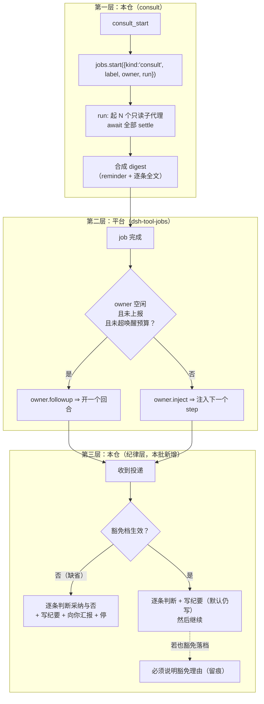
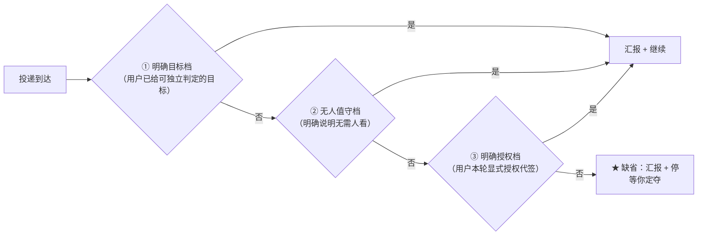

# 设计：会诊结果的投递与消化 —— 批 15

- 日期：2026-09-15
- 需求档：[`2026-09-15-consult-delivery-requirements.md`](./2026-09-15-consult-delivery-requirements.md)（**US-1…US-8** · **N-1…N-6** · §5.1 七项不做 · §5.2 R-40…R-42）
- 上游调研：`D:\workspace\thincoder` @ `58ddb27`（`v0.12.61-4-g58ddb27`）——**源实现在盘，逐条核实**（勘察子代理 `963108c5`）
- 章节：九节（§1 背景 · §2 问题 · §3 目标 · §4 决策与理由 · §5 方案 · §6 机制伪代码 · §7 状态与 schema · §8 防偏离 · §9 边界）+ §10 调研落档 · §11 受影响文件与验收 · §12 变更记录 · §13 评审落档
- 图示：**图 1（投递链：三层与责任边界）** / **图 2（三个档位与「停 / 不停」的判据）**
- 状态：**设计待评审**

> ## ⚠️ 读前必读
>
> **1. 本批是 `consult` 的协议改造，不是补丁。** 它退役一个工具、改一条派发路径、新增一个落档机制。
>
> **2. ★ 本批的第一件事实是「本仓落后上游六天」。** 上游在 `3e1234b`（**2026-09-07 04:10**）以 digest 自动注入**退役了 `consult_check`**；本仓首个提交 `aeffdf7` 是 **2026-09-01 18:27** ⇒ **本仓忠实复制的是 `3e1234b^`**。⇒ **US-1/US-2 不是「新设计」，是「把上游已裁定的形态补上」**；**只有 US-4/US-5（落档）是上游也没有的新设计**。
>
> **3. ★ 而平台的投递能力就在本仓手上**（`dsh-tool-jobs/lib/index.js:206-227`，逐字见 §5.1）——**所以 US-1/US-2 不该照搬上游的 `_pendingAsyncResults`**（那是上游自造的，因为上游没有等价平台设施）。**⇒ 本批走平台。**
>
> **4. 行号引用口径**：定位按**符号名**，行号仅作 as-of 参考。
>
> | 要找什么 | 检索符号 |
> |---|---|
> | 平台的投递点 | `dsh-tool-jobs/lib/index.js` 的 `onJobDone` |
> | 本仓取 jobs 服务 | `lib/advisor.mjs` 的 `getJobsService` |
> | 本仓已有的 dsh-后台 job 先例 | `lib/eng.mjs` 的 `jobs.start({ kind: "eng-dsh"` |
> | 待退役的协议 | `lib/index.mjs` 的 `"consult_check"` |
> | 待落档的纪律锚 | 本仓 `METHODOLOGY.md` 的「批次文档（需求/设计/纪要/交接）= 主代理」 |

---

## §1 背景

`consult`（会诊）在本仓是**三工具异步协议**：`consult_start`（非阻塞）/ `consult_check`（逐个收回复）/ `consult_stop`（早停）。

**这套协议是上游 2026-09-01 的形态。上游在 2026-09-07 把它改掉了**（退役 `consult_check`，改为 digest 自动注入），**而本仓的移植停在改造之前，且从未记录这次分叉**（需求档 §0.1）。

⇒ **本会话里我据此撞了三到四次**：发完 `consult_start` 就结束回合、等一个不会来的通知；用户两次追问「会诊结束了没有」。**我先前把那条描述改成了「没有通知，你必须自己回来」（`37d7eef`）——那句话对本仓是准确的，但它把这个缺口**固化成了契约**，而不是修掉它。**

---

## §2 问题

| # | 问题 | 根因 | 实测 |
|---|---|---|---|
| **P1** | 会诊结束时**无人知晓、无物推动** | 停在 pre-R17 协议，消费全靠调用方主动调 `consult_check` | 本会话撞 3–4 次 |
| **P2** | **「回来」这个动作没有任何机制保证** | 唯一保证是一句提示词（`lib/index.mjs` 的 `consult_start` 描述） | 靠自觉 |
| **P3** | 回复到达后**常只被总结/梳理/对比，不被落实** | 没有把「逐条判断采纳与否并处置」写进任何契约；`*-consult-minutes.md` 只是**惯例** | 本会话我落纪要**是因为用户反复要求** |
| **P4** | **上游分叉从未被记录** | 移植抄的是一个时间点，而源继续走 | 全仓无记载 |

**靶心 = P2**；**P3 是本批唯一「上游也没有」的新设计**。

---

## §3 目标

| # | 目标 | 验收面 |
|---|---|---|
| G1 | **会诊结束时自动投递**，不需调用方任何动作 | AC-1 · AC-2 |
| G2 | **投递到达后停下来向用户汇报**（缺省档） | AC-3 · AC-4 |
| G3 | **三种情形可不停**（明确目标 / 无人值守 / 明确授权） | AC-5 · AC-6 |
| G4 | **回复的每条意见被分类处置**，不采纳须给理由 | AC-7 · AC-8 |
| G5 | **纪要默认落档**，豁免须显式且留痕 | AC-9 · AC-10 |
| G6 | **`consult_check` 的去留明确**（二选一，不留半套协议） | AC-11 · AC-12 |
| G7 | **本仓对上游的偏离有据可查** | AC-13 |
| G8 | **不引入新的漂移**（台账零改 · 零新增测试档 · 六串净） | AC-14 … AC-17 |

**非目标**：照搬上游的自造容器 · 改只读子代理语义 · 模型间交叉通信 · 部分 settle 提前注入 · 修 X-1（归批 14）· 改预算语义 · 给纪要内容做机器强校验。逐条理由见 §4 与需求档 §5.1。

---

## §4 决策与理由（含否决备选）

| # | 决策 | 理由 / 否决备选 |
|---|---|---|
| **D15-1** | **走平台 `jobs`，不自造投递容器** | **否决「照搬上游的 `_pendingAsyncResults`」**：上游自造它是因为**上游没有等价平台设施**；而 DSH 的 `dsh-tool-jobs` **已经提供同一件事**（忙时注入下一步 / 空闲开回合，见 §5.1）。⇒ 自造 = **重复实现**，且要复刻上游的挂起 / 唤醒 / 容量 / 截断全套。**且本仓已有成品先例**：`lib/eng.mjs` 的 `kind: "eng-dsh"` 后台 job 就是「`jobs.start` 的 `run` 内部 `ctx.subagents.start`」——**正是 consult 需要的形态** |
| **D15-2** | **退役 `consult_check`**（与上游 R17 一致） | **上游明文**（`agent/setup.mjs:269-270`）：「`consult_check` 已退役（digest 自动注入是唯一消费通道）——consult 家族**只剩 2 工具**（`consult_start`/`consult_stop`——**setup 注册点与描述面同步清零**）」。**否决「保留它作兼容」**：那会留下**半套协议**（两条消费通道），而 US-7 要求二选一 |
| **D15-3** | **缺省档 = 停下汇报；三情形可不停** | 用户裁定。**这是本批与上游的第二个偏离**：上游的 digest 注入**没有「停下」语义**——它注入后直接进入消化轮。**⇒ 本批的「停下」是本仓的加法**，须在 §10 登记为**有意偏离** |
| **D15-4** | **「停 / 不停」落在「投递后是否允许继续写」这一层** | 与上游的**动作域档位**同族（上游：用户回合 / AUTO 档 = 正常决策域；手动档 auto-turn = **整理禁写**）。**本批取更简的形态**：缺省 = **汇报 + 停**；豁免 = **汇报 + 继续**。**否决「按回合档位分档」**（上游那套要引入档位概念，面太大） |
| **D15-5** | **纪要默认落档为 `docs/<...>-consult-minutes.md`**（沿用本仓既有惯例） | 本仓已有 8 份该形态档（批 12/13 各一份），`METHODOLOGY.md:41` 把「批次文档（需求/设计/纪要/交接）= 主代理」写成纪律。⇒ **本批把这个惯例升级为机制**（落成契约 + 一条可机检锚），而**不发明新的档形态** |
| **D15-6** | **豁免须显式且留痕** | 用户裁定「默认落档，特定情况可豁免」。⇒ **豁免不是静默的**：豁免时**必须在会话里说明「因 X 豁免落档」**，使事后可判断 |
| **D15-7** | **不照搬上游的 `wait_for "consult done"`** | 上游有该原语（`src/tools/wait_for.md:7`）；**本批走平台 job 后，等待由 `job_output` 承担**（本仓既有），**不新增工具**。**登记为 R-42 的裁定结果** |
| **D15-8** | **`consult 家族` 工具数 3 → 2**，描述面与注册点**同步清零** | 照上游做法；**这是锁面变更，须显式声明**（§11.1 列出全部消费点） |

---

## §5 方案

### §5.1 ★ 平台已有的投递能力（**逐字，本批不重造**）

`dsh-tool-jobs/lib/index.js` 的 `onJobDone`（`:206-227`）逐字：

```js
ctx.jobs.onJobDone((snapshot, owner) => {
  if (snapshot.reported || owner === void 0) return;
  const message = createUserMessage({ content: [{ type: "text", text: fitCompletionNotice(snapshot) }],
    source: { kind: "plugin", plugin: "tool-jobs", form: "notice", summary: completionSummary(snapshot) } });
  const spent = spentWakes.get(owner) ?? 0;
  if (delivery === "wakeup" && owner.status === "idle" && spent < wakeBudget) {
    spentWakes.set(owner, spent + 1);
    owner.followup(message);        // ★ 空 闲 ⇒ 开一个回合
    return;
  }
  owner.inject(message);            // ★ 忙 ⇒ 注入下一个 step
});
```

配套事实（同档，逐条）：**完成通知** `:10-12`「delivers **unreported** completions to the owning agent: **injected into a busy owner's next step, or opening a turn on an idle one** under the default `wakeup` delivery, bounded per owner」· **档位** `:170` `completionDelivery ?? "wakeup"` · **唤醒预算** `:171` `maxConsecutiveWakes ?? 3` · **用户回合重置预算** `:175-177`（`agent/inbox/claimed` + `source.kind === "user"` ⇒ `spentWakes.delete`）· **已上报不再投递** `:207`（`snapshot.reported`）。

| 上游（thincoder 自造） | DSH 平台（本批复用） |
|---|---|
| run 首行注入 pending digest（`agent.mjs:105-113`） | **injected into a busy owner's next step** |
| 空闲 settle ⇒ 强制消化轮（`suspension-drive.mjs:229-230`） | **opening a turn on an idle one** |
| `poolLive` 让驱动不退出 | 平台 job 自身被服务持有 |

### §5.2 图 1：投递链（三层与责任边界）



**读图要点**：**第一层由本仓改（一处：`consult_start` 的派发方式）；第二层零改动（平台已具备，本批只是把 consult 接上去）；第三层是本批真正新增的纪律**。⇒ 这也解释了为什么本批**比看上去小**：最重的一段（投递与唤醒）**平台已经写好了**。

### §5.3 图 2：三个档位与「停 / 不停」的判据



**读图要点**：**三个豁免档都是「显式」的**——①的「明确目标」指**用户已下过可独立判定的目标**（如本会话的「按批次走完整链路」），②③ 都要求**用户明说**。**⇒ 缺省永远是停**（US-2）。**且三档都不得免除落档**（US-5 的默认仍在，第二层豁免要单独给）。

### §5.4 digest 的形态（照上游，逐字对齐）

上游 `consult.mjs:165-173`：

```
[System reminder: consultation #<id> finished — <N> of <M> models replied (<F> failed)]
<逐条opinion全文>
```

**本批沿用该形态**（`N of M models replied` + `F failed` 的标注方式），因为：① 它是上游**已裁定**的形态；② 「部分 settle 不提前注入、全 settle 才入流」（上游明文）在 digest 的 `counts` 里天然体现。

### §5.5 本批**不可真机验证**清单

| # | 主张 | 为何不可验 | 何时可验 |
|---|---|---|---|
| 1 | **投递真的会到**（空闲开回合 / 忙时注下一步） | **需重启**（改 `lib/**`）后才生效 | 重启后 |
| 2 | 「停下汇报」的实际体验 | 同上 | 重启后 |
| 3 | 纪要落档的实际形态 | 同上 | 重启后 |

> **其余全部可在 `node --test` 进程内验证**：`consult_check` 的注册点与描述面清零 · digest 合成（纯函数）· 豁免档的判据 · 落档路径与命名 · 零改面锚。

---

## §6 机制伪代码

### §6.1 `consult_start` 改为 job 派发（`lib/consult.mjs`）

```js
// 变更前：ctx.subagents.start(...) 直接起 N 个，返回 consult id，靠调用方 consult_check 取
// 变更后：起一个 platform job，其 run 内部起 N 个子代理并 await 全部 settle
const jobs = getJobsService(deps)            // lib/advisor.mjs 的既有 helper（懒取，缺失 ⇒ null）
if (jobs && typeof jobs.start === "function") {
  const started = jobs.start({
    kind: "consult",
    label: "consult #" + id + " (" + N + " models)",
    owner: agent,
    run: async () => {
      // ① 起 N 个只读子代理（既有逻辑不动：toolFilter 只读白名单 + persona 关掉人格）
      // ② await 全部 settle（全 settle 才入流——上游裁定）
      // ③ 合成 digest（§5.4 的形态）并作为 job 的最终输出返回
      return composeConsultDigest(session)
    },
  })
  return "consultation started as background job " + started + …   // 复用 jobsDispatchReply 先例
}
// jobs 缺失 ⇒ 响亮告警 + 回落既有同步路径（绝不无声）
```

**要点**：① **`run` 内部仍是 `ctx.subagents.start`**——与 `eng.mjs` 的 `kind: "eng-dsh"` 先例同形；② **`jobs` 缺失时回落**（响亮告警，沿用 `eng.mjs:866-870` 的形态）；③ **不传 `budgetCapMs`**（那条只对 codex 语境有意义）。

### §6.2 `consult_check` 的退役（`lib/index.mjs`）

```js
// 删除 register(textTool({ name: "consult_check", … }))
// 描述面同步清零：consult_start 的描述删掉「call consult_check …」及「你必须自己回来」两句
// consult_stop 保留（取消语义），其描述改为：停掉的会话不产生投递（上游 T-R17c）
```

### §6.3 消化纪律的锚（**US-4/US-5 的落点**）

这两条**不是代码**，而是要落成**可机检的形式锚 + 人验的语义锚**（需求档 R-41 已声明诚实边界）：

| 面 | 形态 | 谁检查 |
|---|---|---|
| **形式锚** | 会话里出现 `docs/*-consult-minutes.md` 的写入（或一条显式豁免声明） | **可机检**（本仓已有 `docs/README` 登记谓词 + `ledger-parity` 的先例，**但见 §9 边界 4：本批不给它加锁**） |
| **语义锚** | 「每条意见恰有一条处置 / 不采纳须给理由」 | **只能人眼**（评审清单）——**不许超卖** |

---

## §7 状态与 schema

| 面 | 变更 | 说明 |
|---|---|---|
| `lib/consult.mjs` | **修改（核心）** | `consult_start` 改 job 派发；`composeConsultDigest` 抽为纯函数（可单测）；`consult_check` 的结算路径删除 |
| `lib/index.mjs` | 修改 | 删 `consult_check` 的 `register(...)`；`consult_start` / `consult_stop` 描述同步 |
| `lib/advisor.mjs` | **零改动**（只 import 它的 `getJobsService`） | 复用既有 helper |
| `README.md` | 修改 | 「三工具」→「两工具」；补投递链与消化纪律 |
| `lib/prompts/main.md` | 修改 | 删 start→check→stop 流程，改为 start→（收到投递）→处置 |
| `test/consult.test.mjs` | 修改 | **既有档**；补 digest 合成 / 退役断言 |
| **零字节** | `test/fixtures/**` · 基线 10 档（除既有授权面）· `lib/eng.mjs` · `lib/advisor.mjs` | N-4 与常设约束 |

**读写方声明**：**写入方 = 本批 eng_coder**；**读取方 = 平台 `dsh-tool-jobs`**（读 `jobs.start` 的 spec）；**`docs/*-consult-minutes.md` 由主代理写**（不是代码写——**这是本批的关键分工**，见 §9 边界 4）。

---

## §8 防偏离

### §8.1 零改面

| # | 面 | 判据 |
|---|---|---|
| 1 | **`test/fixtures/**`** | `git diff` 为空 |
| 2 | **不新增测试档** | `readdirSync(test).filter(.test.mjs)` 数不变 |
| 3 | **不新增顶层 `test(`** | 台账 §三**零改** |
| 4 | **`lib/**` 六串零命中** | T-PK15 |
| 5 | **`failStop(` 计数恒 18** | 既有断言 |
| 6 | **`lib/advisor.mjs` 零改动** | 只 import 其 helper |

### §8.2 机验锚

| # | 锚 | 谓词 |
|---|---|---|
| **V1** | `consult_check` 已退役 | `lib/**` 与 `lib/prompts/**` 内 `consult_check` **零命中**（**描述面同步清零**） |
| **V2** | 家族工具数 = 2 | 注册点恰含 `consult_start` / `consult_stop` |
| **V3** | digest 形态 | `composeConsultDigest` 对合成会话产出 `[System reminder: consultation #<id> finished — N of M models replied (F failed)]` + 逐条 |
| **V4** | 部分 settle 不入流 | 未全 settle 时不产出 digest |
| **V5** | `consult_stop` 不产生投递 | 停掉的会话 ⇒ 无 digest（上游 T-R17c） |
| **V6** | 走 job 且可回落 | `jobs` 存在 ⇒ 走 `jobs.start`；缺失 ⇒ 响亮告警 + 同步回落 |
| **V7** | **平台投递面未被本仓改动** | `dsh-tool-jobs` 不在本仓写域内（本批**只接上去，不改它**） |

---

## §9 边界

| # | 边界 | 行为 | 理由 |
|---|---|---|---|
| 1 | **上游自造容器不搬** | 只走平台 `jobs` | N-1；避免重复实现 |
| 2 | **「停下」是本仓加法** | 上游 digest 注入**无停下语义** ⇒ **本批在 §10 登记为有意偏离** | 用户裁定 |
| 3 | **部分 settle 不提前注入** | 沿用上游裁定 | 意见全貌才可判断 |
| 4 | **★ 不给纪要加机检锁** | 本批把「默认落档」写成**契约与纪律**，**但不新增机锁** | 仓里已有教训：**散文锁会咬人**（批 13 两轮）；且 R-41 已声明「语义只能人眼」⇒ **加锁是超卖** |
| 5 | **`wait_for` 不新增** | 等待由 `job_output` 承担 | D15-7 |
| 6 | **不改 `consultTimeoutMs` / `consultTurns`** | 本批只动投递与消化 | 需求档 §5.1-6 |
| 7 | **X-1（悬空引用）不在本批** | 归批 14 | 同物种归类 |
| 8 | **`jobs` 缺失时必须响亮回落** | 绝不静默 | 仓内一贯纪律 |

---

## §10 调研落档（**上游偏离表——本批的「有据可查」**）

| 面 | 上游（`58ddb27`，post-R17） | 本仓现状（pre-R17） | 本批裁 |
|---|---|---|---|
| 消费通道 | **digest 自动注入**（唯一） | `consult_check` 轮询 | **改**：跟上游 |
| 工具数 | **2**（start / stop） | 3 | **改**：跟上游 |
| 完成通知 | **自动**（`sessionSettled` ⇒ 停靠 ⇒ 注入） | 无 | **改**：跟上游**但在平台层实现**（§5.1） |
| 让人回来 | run 首行注入 + 空闲强制消化轮 | 靠自觉 | **改**：跟上游**但用平台投递** |
| **停下汇报** | **无此语义** | 无 | **★ 本仓加法**（用户裁定） |
| **纪要落档** | **无此机制**（只有 3 天轮转的临时日志） | 有**惯例**（8 份档），**无机制** | **★ 本仓加法**（用户裁定） |
| `consult_stop` 的损失语义 | 停掉的会话**不产生 digest**（`T-R17c`） | 同 | 保持 |
| 等待原语 | 有 `wait_for "consult done"` | 无 | **不加**（用 `job_output`） |

> **★ 这张表就是 US-6/US-7 的交付物**：**本仓对上游的每一处偏离都在此有据可查**——`跟上游` 的三处是**补上落后的六天**，`本仓加法` 的两处是**用户裁定**，`不加` 的一处是**有意省略**。

---

## §11 受影响文件全清单与验收

### §11.1 实施域

| 文件 | 改动 | 类型 |
|---|---|---|
| `lib/consult.mjs` | `consult_start` 改 job 派发 + `composeConsultDigest` 抽纯函数 + 删 `consult_check` 结算路径 | **修改（核心）** |
| `lib/index.mjs` | 删 `consult_check` 注册；两处描述同步 | 修改 |
| `README.md` | 三工具 → 两工具；补投递链与消化纪律 | 修改 |
| `lib/prompts/main.md` | 流程句改写 | 修改 |
| `test/consult.test.mjs` | 补 digest / 退役 / 回落断言（**并入既有块**） | 修改 |
| **★ 锁面变更（须显式声明）** | **① `consult_check` 的注册点与描述面清零**（消费点：`lib/index.mjs` ×4 · `lib/consult.mjs` ×3 · `lib/eng.mjs` ×2 · `lib/escalate.mjs` ×2 · `test/death-provenance.test.mjs` ×3 · `README.md` ×2）· **② `lib/prompts/main.md` 的流程句** | **本批最敏感动作** |
| **明确排除（禁改）** | `lib/advisor.mjs` · `lib/eng.mjs` · `test/fixtures/**` · `dsh-tool-jobs`（**仓外平台包**）· `test/stage-gate.test.mjs` / `test/stages.test.mjs` / `test/guard-e.test.mjs` | 零改动 |

### §11.2 验收标准

| # | 验收标准 | 形态 |
|---|---|---|
| **AC-1** | 全 settle 时**产生一次投递**，调用方零动作 | **核心** |
| **AC-2** | 投递经平台 `onJobDone`（忙注下一步 / 空闲开回合） | 核心 |
| **AC-3** | **缺省档**下，投递被消费的回合**产出一份面向用户的汇报**（采纳/不采纳/理由） | **核心（US-2）** |
| **AC-4** | 该回合**停下**（不再自动进入实施） | 核心 |
| **AC-5** | 三豁免档任一成立时**不强制停** | **核心（US-3）** |
| **AC-6** | 豁免档**缺省全部关闭** | 核心 |
| **AC-7** | 后处理给出**每条意见恰一条处置**（采纳/不采纳/待定） | 核心（**人验**，R-41） |
| **AC-8** | **不采纳的必须给理由** | 核心（**人验**） |
| **AC-9** | 纪要**默认落档**为 `docs/*-consult-minutes.md` | **核心（US-5）** |
| **AC-10** | 豁免落档时**必须显式说明理由**（留痕） | 核心 |
| **AC-11** | `consult_check` **已退役**：`lib/**` 与 `lib/prompts/**` 零命中 | **核心（V1）** |
| **AC-12** | consult 家族**恰 2 工具** | 核心（V2） |
| **AC-13** | §10 的偏离表**已落档**且有上游坐标 | 核心（US-6） |
| **AC-14** | 台账 §三**零改**；T-LC1/T-LC2/T-LC4/T-E19 全绿 | 零回归 |
| **AC-15** | 六串零命中；`failStop(` 恒 18 | 零回归 |
| **AC-16** | **`lib/advisor.mjs` 与 `lib/eng.mjs` 零改动** | 零回归 |
| **AC-17** | 全量 `node --test` **453/453**（并入既有块 ⇒ 零新增用例数） | 收口 |
| **AC-18** | `jobs` 缺失时**响亮告警 + 同步回落**（绝不静默） | 核心 |

### §11.3 建议 stages

> **★ 前置**：本批**必须**用 `background: true` 派发 eng_coder（或拆到 600s 内）——**平台的同步 dsh 子代理活不过 600s**（`eng.mjs:914-916`）。

| stage | goal | 检查 |
|---|---|---|
| **0** | **只读勘察**：机械枚举 `consult_check` 的**全部消费点**（含 `lib/prompts/**` 与测试）；确认 `jobs.start` 在本部署可用；确认 `test/consult.test.mjs` 的既有断言语义；**逐字确认上游 digest 形态** | 报告四项事实（**不写文件**） |
| 1 | **`composeConsultDigest` 抽纯函数 + 退役 `consult_check`**（注册点 + 描述面 + `lib/prompts/main.md`） | `node --test test/consult.test.mjs` |
| 2 | **`consult_start` 改 job 派发**（含 `jobs` 缺失的响亮回落） | `node --test` |
| 3 | **收口**：全量 + 锚 V1–V7 + 零改面 + AC-1…AC-18 逐条 + **§10 偏离表随档落定** | `node --test` |

---

## §12 变更记录

| 日期 | 变更 |
|---|---|
| 2026-09-15 | 首版（设计待评审）：上游调研（**源实现在盘，`58ddb27`**）→ 九节 + §10 调研落档（**上游偏离表**）+ 图 1/图 2；**D15-1…D15-8**；US-1…US-8；N-1…N-6；**AC-1…AC-18**；锚 V1–V7；§11.3 四 stage。**核心结构判断**：**投递与唤醒由平台已提供**（`dsh-tool-jobs` 的 `onJobDone`），**本批只把 consult 接上去 + 新增消化纪律** ⇒ 比看上去小。**两处有意偏离上游**（停下汇报 / 纪要落档）已登记。 |

---

## §13 评审落档

### §13.1 设计评审轮次 1 落点（预留）

### §13.2 交付核验落档（预留）
