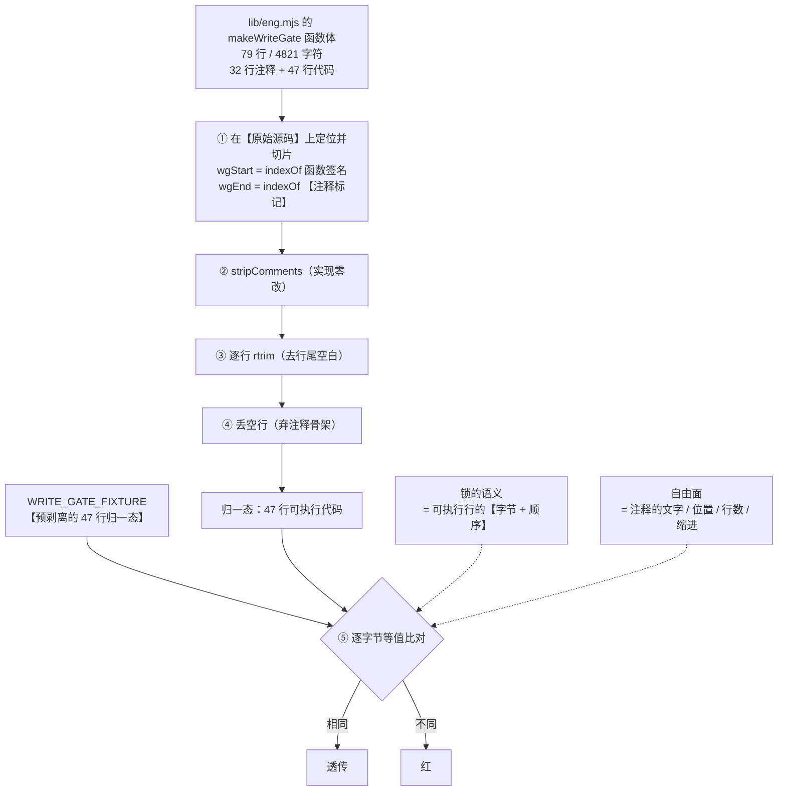
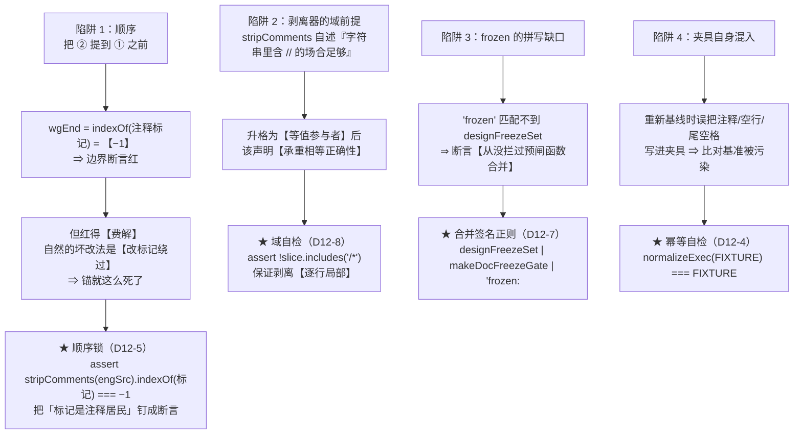

# 设计：`WRITE_GATE_FIXTURE` 锁面收窄 —— 批 12

- 日期：2026-09-15
- 需求档：[`2026-09-15-lock-narrowing-requirements.md`](./2026-09-15-lock-narrowing-requirements.md)（12 用户故事 / 8 非功能标准）
- 会诊纪要：[`2026-09-15-lock-narrowing-consult-minutes.md`](./2026-09-15-lock-narrowing-consult-minutes.md)（会诊 id 1，**4/4 交付**；含 **§1.1 分歧实证表**）
- 章节：九节（§1 背景 · §2 问题 · §3 目标 · §4 决策与理由 · §5 方案 · §6 机制伪代码 · §7 状态与 schema · §8 防偏离 · §9 边界）+ §10 前置订正（已完成）· §11 受影响文件与验收 · §12 变更记录 · §13 评审落档
- 图示：**图 1（锁面收窄的语义边界）** / **图 2（两个机制陷阱与其守卫）**
- 状态：**设计待评审**

> ## ⚠️ 读前必读
>
> **1. 本批不受「无法重启」约束。** 目标全在**测试面**，且**不改 `lib/**` 一个字节** ⇒ `node --test` 进程内即真验。
>
> **2. 只动一个档的逻辑 + 若干处措辞。** 核心编辑面 = `test/guard-e.test.mjs`；连带仅**措辞订正**（3 档 + docs）。
>
> **3. 行号引用口径**（沿用既有纪律）：定位按**符号名**，行号**仅作 as-of 参考**——**行号是提示，不是身份**（**本批的前置订正 §10 正是四处陈旧行号的代价**）。
>
> | 要找什么 | 检索符号 |
> |---|---|
> | 被收窄的锁 | `test/guard-e.test.mjs` 的 `const WRITE_GATE_FIXTURE` 与 `A2:` 断言组 |
> | 唯一剥离器（**零改**） | `test/guard-e.test.mjs` 的 `const stripComments` |
> | 顺序陷阱的标记 | `lib/eng.mjs` 的 `"\n\n/**\n * 守卫 E 预闸"`（**本身是注释**） |
> | sole-carrier 契约 | `test/eng-token-fallback.test.mjs` 的「不在此处复制第二份」 |
> | 共用同标记的另一把锁 | `test/path-kind.test.mjs` 的 `锚 B4` |
> | T-LC2 的计数谓词 | `test/test-lifecycle.test.mjs` 的 `COUNT_RE` |

---

## §1 背景

`test/guard-e.test.mjs` 的 `WRITE_GATE_FIXTURE` 是一把**元锁**：它逐字节保存 `lib/eng.mjs` 里 `makeWriteGate` 的**整个函数体**（**79 行 / 4821 字符**），并在每次跑测试时比对。它保护的是**写门禁**——「什么能写、什么不能写」的判定链。

**它有效，而且为真**（今天逐字节相同、T-E17 绿）。代价是：**这个函数体里 32 行是注释（40.5%）**，而注释**也在锁内** ⇒ **改一个字的注释，就要把 79 行重新基线一遍**。

批 11 **被迫做了三次**（代码 → 注释 → 代码）。批 10 的边界-12 当时就登记了这条代价，并把「缩小锁面（只锁可执行行、注释不入锁）」列为将来方向，同时如实标注了它的副作用：「**它会同时削弱『注释与代码同步』这条副产物**」。

**本批就是来兑现它的**——但要兑现得**比原来更严**，而不是更松。

---

## §2 问题

| # | 问题 | 根因 | 证据 |
|---|---|---|---|
| **P1** | 改一行注释 ⇒ 重新基线 79 行 | 逐字节比较含注释 | 批 11 三次 |
| **P2** | 重新基线靠手工复制粘贴 | 无生成器（`release-check` 明令不 import 插件模块、不写文档；仓内无 `scripts/`） | 摸底实测 |
| **P3** | **夹具本身改不得** | 受锚 B 保护 + 口径锁不收 `.txt` | 纪要 §1-3 |
| **P4** | **顺序陷阱无人守** | `wgEnd` 标记是注释 ⇒ 先剥后切会锚死 | 纪要 §1-2 |
| **P5** | **`frozen` 断言有拼写缺口** | `"frozen"` 匹配不到 `designFreezeSet`（**无 n**） | 纪要 §1-6 |
| **P6** | 四处陈旧指针（含一处**结论错误**） | 行号漂移 + 假前提 | **已修** `bb88fc7` |

**靶心 = P1**；**P4/P5 是本次才发现的两个真缺口**（**两者都修**）。

---

## §3 目标

| # | 目标 | 验收面 |
|---|---|---|
| G1 | **注释层完全自由**（改/挪/增/删/缩进） | AC-1 · AC-2 |
| G2 | **可执行行的字节与顺序仍逐字节锁** | AC-3 · AC-4 · AC-5 |
| G3 | **顺序陷阱有守卫** | AC-6 |
| G4 | **剥离器的域前提被机械守住** | AC-7 |
| G5 | **`frozen` 断言真的能拦合并** | AC-8 |
| G6 | **夹具自检**（混入注释/空行/尾空格即红） | AC-9 |
| G7 | **零联动**（台账/清单/夹具/基线档/lib 全不动） | AC-10…AC-13 |
| G8 | **代价被明写**（不是靠猜） | AC-14 |

**非目标**：不动夹具文件 · 不归一 token 间空白或 EOL · 不补支点注释句锁 · 不改 `stripComments` 实现 · 不改 `lib/**` · 不改历史记录里的「逐字节」 · 不新增测试档 · 不换右界标记。逐条理由见 §4 与需求档 §5.1。

---

## §4 决策与理由（含否决备选）

| # | 决策 | 理由 / 否决备选 |
|---|---|---|
| **D12-1** | **归一管道 = `stripComments` → 逐行 `rtrim` → 丢空行** | **父侧实证**：只去注释时，剥离会留下**注释骨架**（**32 个仅缩进的伪空行 + 1 个尾空格**）⇒ 删/改/挪/增注释**四种改动全部仍红** ⇒ **不丢空行，本批目标根本不成立**。**★ 这条裁定否决了 kimi 与 v4-pro 的反对意见**——它们担心丢空行会削弱「注释/代码位置互换」的检测，但代码位置互换是**代码行顺序**变，**丢空行不影响** |
| **D12-2** | **不归一 token 间空白** | 空白在 JS 里**承重**：`a+ +b` ≠ `a++b`（剥空白会把两者坍成同一串 = **假绿**）；`return\nx` 有 ASI 语义。**朴素空白归一 = 制造逃逸面，不是消除它** |
| **D12-3** | **不归一 EOL** | 逐字节锁**今天**就 EOL 敏感，本批既不增也不减；加 EOL 归一 = 第二个归一规则 + 域外扩权 |
| **D12-4** | **夹具存预剥离归一态**（47 行）+ **幂等自检** | v4-pro 的**机理**（「对称剥离有假绿逃逸面」）经父侧实证**不成立**，但其**结论**采纳：预剥离让比对**只有一侧做剥离**（语义单一），且**幂等自检才有意义**（能抓「夹具里混进注释/尾空格/空行」） |
| **D12-5** | **顺序锁：加，一条，只加右界** | **四家全部要求**。起点 `export function makeWriteGate(` 是**代码**，剥离后仍可定位 ⇒ 判别力**全在右界**。**它堵的退化路径真实且近**：T-E18 的 `:943` 已在算 `stripComments(engSrc)`，一次「先剥再切」是最自然的坏改法——没有本条时只会看到一句费解的「边界不可定位」，然后**改标记绕过，锚就这么死了**。**不过锁**：它钉的是**测试自身机制**，而标记文本早已被边界断言+夹具钉死 ⇒ 零新增钉死面 |
| **D12-6** | **`frozen` 移到归一化体** | **这是补课不是放松**：本档**已有明文惯例**——负向代码属性断言一律跑在剥离产物上（`:889`「负向断言只看**代码**（注释不是调用）」· `:942`「注释里引述前缀字面不算实现」）。`:907` 是全档**唯一**跑在原始文本上的负向断言，是字节锁时代的遗物；其消息「守卫 E 未被并进写门禁（D-E1）」本身是**代码语义** |
| **D12-7** | **修 `frozen` 的拼写缺口**（换合并签名正则） | **父侧实测为真缺口**：`"frozen".includes("designFreezeSet")` = **false**（freeze 无 n）⇒ **今天的断言只拦 `frozen: ` 文案，从没拦过「把预闸函数拖进写门禁」这类合并**——而那正是 D-E1 要防的**最重一类**。**一行、零新增锁面、修一个今天就存在的缺口** |
| **D12-8** | **域前提自检**：切片内 `!includes("/*")` | 它是**D12-1 全部推理的支点**（保证剥离是**逐行局部**的）；**实测切片内 `/*` = 0 次** ⇒ 立锁零成本；并顺手灭绝 `fro/*x*/zen` 这类拼接绕过 |
| **D12-9** | **接受注释脱节，不补支点注释句**（用户裁定） | 否决 kimi 的「钉 3 句」。理由：① **那就是本批要消灭的锁本身**——批 10 三次重基线里**两次的税**就是它；② **切片内每条承重不变式都有可执行行承载**（depth 门 · sole-carrier 的 `if (!state.designToken)` · 内层 fail-closed · 三态路由三元式 · 外层 fail-open catch · deny 两串）⇒ **没有「只有注释承载」的判据**；③ 残余风险**登记为新边界**（G8） |
| **D12-10** | **`stripComments` 实现逐字节不动** | 它**同时承重**：`:943-944` 对全 `eng.mjs` 做 `"denied: / frozen: ` 计数（T-E18）、`:889` 用于 A8 负向断言 ⇒ **改它 = 动别人的锚 + 重推计数**。只改其 **doc 注释**（其自述「本仓 lib 无该形态」须收窄为「**本切片无该形态**」——该声明现在**承重等值正确性**） |
| **D12-11** | **历史记录禁改** | CHANGELOG / METHODOLOGY / 台账行 / portability 设计档里的「逐字节」是**当批约束句**——**改历史 = 新漂移**。只订正**活在世的**描述面 |
| **D12-12** | **不改 `lib/**`** | 本批是**测试面**单边改动 ⇒ 也意味着**不受「无法重启」约束** |

---

## §5 方案

### §5.1 锁面收窄的语义边界（图 1）



**读图要点**：**唯一重要的一步是「① 在原始源码上定位」**——因为 `wgEnd` 的标记**本身是注释**，若把 ① 挪到 ② 之后，`wgEnd` 会变成 `−1`，整个锚当场死掉。**这个顺序是本设计的承重结构**，且**今天没有任何断言守着它**（⇒ D12-5 的顺序锁）。

### §5.2 两个机制陷阱与其守卫（图 2）



**读图要点**：**四个陷阱里有三个是「静默」型的**——陷阱 1 会红但**红得费解**（诱人绕过标记）、陷阱 2 与 3 是**今天就已经存在**的缺口（不是本批引入的）、陷阱 4 是本批**新引入**的可能性（因为夹具形态变了）。**四条守卫全部是「一行断言」**，没有一条需要新机制。

---

## §6 机制伪代码

### §6.1 新增 helper（放在 `stripComments` 旁，模块级）

```js
/** 归一化到「可执行行」：剥离器（实现零改）→ 逐行 rtrim → 丢空行。
 *  ★ 语义边界（批 12）：锁的是**可执行行的字节与顺序**；注释层（文字/位置/行数/缩进）完全自由。
 *  ★ 顺序承重：调用方**必须**先在原始源码上切片，再交给本函数（见 A2 的顺序锁）。
 *  ★ 域前提：切片内不得含 '/*'（本函数按行局部剥离，块注释跨行吞并会使前提失效）。
 *  ★ 不归一 token 间空白（空白在 JS 里承重，归一 = 制造假绿逃逸面）；不归一 EOL。 */
const normalizeExec = (src) => stripComments(src)
  .split("\n").map((l) => l.replace(/\s+$/, "")).filter((l) => l !== "").join("\n")
```

### §6.2 A2 断言组的收窄（编辑面）

```js
const WG_END = "\n\n/**\n * 守卫 E 预闸"                     // 提为具名常量
const wgStart = engSrc.indexOf("export function makeWriteGate(")
const wgEnd = engSrc.indexOf(WG_END)
assert.ok(wgStart >= 0 && wgEnd > wgStart, "A2: 函数体切片边界可定位")

// ★ 顺序锁（D12-5）：右界标记是注释居民 ⇒ 必须先切片、后剥离
assert.ok(stripComments(engSrc).indexOf(WG_END) === -1,
  "A2 顺序锁：右界标记本身是注释 ⇒ 必须【先切片、后剥离】；全档剥离后该标记必失")

const rawSlice = engSrc.slice(wgStart, wgEnd)

// ★ 域自检（D12-8）
assert.ok(!rawSlice.includes("/*"),
  "A2 域自检：剥离器在切片上必须逐行局部（块注释跨行吞并 = 前提失效）")

const norm = normalizeExec(rawSlice)

// ★ 等值比对：收窄后（只锁可执行行）
assert.equal(norm, WRITE_GATE_FIXTURE,
  "A2: makeWriteGate 的**可执行行**（字节与顺序）等于夹具；注释层不入锁")

// ★ 夹具幂等自检（D12-4）：夹具必须是已归一态
assert.equal(normalizeExec(WRITE_GATE_FIXTURE), WRITE_GATE_FIXTURE,
  "A2 夹具自检：夹具必须是归一态（混入注释/空行/尾空格即红）")

// ★ 合并签名正则（D12-6/D12-7）：注释不参与；三选一出现即红
assert.ok(!/(designFreezeSet|makeDocFreezeGate|"frozen: )/.test(norm),
  "A2: 守卫 E 未被并进写门禁（D-E1；注释不参与；合并签名三选一出现即红）")

const mkCount = (engSrc.match(/export function makeWriteGate\s*\(/g) ?? []).length
assert.equal(mkCount, 1, "A2: 唯一实现点")
```

**编辑纪律**：全部新断言**并入既有 `test(` 块**（不开新顶层 `test(`）⇒ `guard-e` 的顶层计数**恒 24** ⇒ **T-LC2 / 台账 §三零改**。
**编辑区远离** `existing` 数组与 `deepEqual` 字面（`:723-753`/`:754`）⇒ **T-E19 / T-LC4 的解析正则不受影响**。

### §6.3 夹具的重推导（**机械推导，禁止手抄**）

```js
// 交付报告须附此行输出，并以机器比对确认
node -e "const{readFileSync}=require('fs');const e=readFileSync('lib/eng.mjs','utf8');\
const sc=(s)=>s.replace(/\/\*[\s\S]*?\*\//g,'').replace(/(^|[^:])\/\/[^\n]*/g,'$1');\
const a=e.indexOf('export function makeWriteGate('),b=e.indexOf('\n\n/**\n * 守卫 E 预闸');\
const n=sc(e.slice(a,b)).split('\n').map(l=>l.replace(/\s+$/,'')).filter(l=>l!=='').join('\n');\
console.log(JSON.stringify(n.split('\n').length),JSON.stringify(n.length))"
```

⇒ **预期 47 行**；**字符数以该行实际输出为准**。
> **★ 设计期自检实测（父侧，2026-09-15）**：该命令输出 **`47` 行 / `2677` 字符**。**初稿此处猜的「2905」是错的**——它由「2906 − 1 个尾空格」推出，但**未计入 32 行纯注释整行消失后带走的其余字节**（缩进 + 注释文字）。⇒ 保留此更正记录，并**再次强调本档的数字不得被抄**：`2677` 也只是**今天**的值，实施时以 stage 0 的机械推导为准。

---

## §7 状态与 schema

| 面 | 变更 | 说明 |
|---|---|---|
| `test/guard-e.test.mjs` | **修改（核心）** | 新增 `normalizeExec`；`WRITE_GATE_FIXTURE` 换成 47 行归一态；A2 断言组按 §6.2 改造；夹具头注释重写；`stripComments` **仅 doc 注释** |
| `test/eng-token-fallback.test.mjs` | 修改（**措辞**） | 「逐字节夹具」的表述要订正为「可执行行逐字节」；**sole-carrier 句子与「不复制第二份」句原样保留** |
| `test/path-kind.test.mjs` | 修改（**措辞**，可选） | 同窗口的「逐字节」口径同步（**共用标记 ⇒ 标记一动两处同红**，须在注释里写明） |
| `docs/2026-09-13-ledger-discipline-design.md` | 修改 | 边界-12 加**supersession 注**（「批 12 已处置」）——**历史落档不改写** |
| `docs/2026-09-13-doc-discipline-design.md` | 修改 | §6.2 与 §14.6.6 里「留待批 12 处置」两处**前向指针订正**为已处置 |
| `docs/2026-09-13-doc-discipline-requirements.md` | 修改 | 同步 R-25 附近的前向指针（如涉） |
| **零字节** | `lib/**` · `test/fixtures/**` · 基线 10 档 · `test/test-lifecycle.test.mjs` | N-1…N-3 · N-5 |

---

## §8 防偏离

### §8.1 零改面（验收拒收项）

| # | 面 | 判据 |
|---|---|---|
| 1 | **`lib/**`** | `git diff -- lib` **为空** |
| 2 | **`test/fixtures/**`** | `git diff -- test/fixtures` 为空 |
| 3 | **基线 10 档** | `git ls-tree -r --name-only 2e6ca8b -- test` 的输出里本批**零编辑** |
| 4 | **`stripComments` 实现** | 仅 doc 注释改动（`:203-205` 两条正则**逐字节不变**） |
| 5 | **顶层 `test(` 数** | `guard-e` 恒 **24** ⇒ 台账 §三零改 |
| 6 | **`existing` 数组与 `deepEqual` 字面** | 零触碰 |
| 7 | **历史记录** | CHANGELOG / METHODOLOGY / 台账行 / portability 档里的「逐字节」**不改** |
| 8 | **不新增测试档** | `readdirSync(test)` 的 `.test.mjs` 数不变 |

### §8.2 机验锚

| # | 锚 | 谓词 |
|---|---|---|
| **V1** | 归一管道 | `normalizeExec` 定义在位且三分量齐（strip → rtrim → 丢空行） |
| **V2** | 夹具形态 | `WRITE_GATE_FIXTURE` 的行数 == **机械推导值**；`normalizeExec(FIXTURE) === FIXTURE`（幂等） |
| **V3** | 顺序锁 | `stripComments(engSrc).indexOf(WG_END) === -1` 断言在位 |
| **V4** | 域自检 | `!rawSlice.includes("/*")` 断言在位 |
| **V5** | 合并签名正则 | 断言含 `designFreezeSet` / `makeDocFreezeGate` / `"frozen: ` 三选一 |
| **V6** | 边界与唯一实现点 | `wgStart/wgEnd` 可定位断言 + `mkCount === 1` **原样保留** |
| **V7** | 计数器不受扰 | `stripComments` 的两条正则逐字节不变 ⇒ T-E18 绿 |
| **V8** | 零联动 | §8.1 八项逐条成立 |

---

## §9 边界

| # | 边界 | 行为 | 理由 |
|---|---|---|---|
| 1 | **注释层自由** | 文字 / 位置 / 行数 / 缩进**全部不入锁** | D12-1（用户裁定） |
| 2 | **注释脱节无锚** | **接受**；权威 = 设计档 + 评审 | D12-9（用户裁定）；**残余风险明写，不靠猜** |
| 3 | **字符串内 `//`** | **红（方向安全）**：剥离导致 mangling ⇒ 与夹具失配 | 域前提由 V4 钉死；**该弱点在 A 下只可能误红、不可能假绿** |
| 4 | **token 间空白 / 缩进** | **在锁内**（登记为**预期严格面**） | D12-2；空白承重 |
| 5 | **右界标记改名** | 会**同时**红两处（A2 + T-PK8 共用） | 纪要 §1-8；须在注释里写明 |
| 6 | **将来切片含 `/*` 或行内 `://`** | V4 会红 ⇒ **强制先修归一化再继续** | 域前提是**承重**的，不是装饰 |
| 7 | **将来把剥离提到切片之前** | V3 会红 ⇒ **红得精准**（而非费解的边界失配） | D12-5 |
| 8 | **重新基线** | 仍靠**人眼复制**，但比对**只有一侧做剥离**且**幂等自检**兜底 | D12-4；**本批不建生成器**（`release-check` 明令不写文档、不 import 插件模块） |

---

## §10 前置订正（**已完成并推送**：`bb88fc7`）

摸底发现**四处陈旧指针**，性质不同：

| 处 | 原引 | 实测真值 | 性质 |
|---|---|---|---|
| `test-lifecycle-consult-minutes.md` | `guard-e.test.mjs:719` | **`:768`** | 行号漂移 |
| `ledger-discipline-consult-minutes.md` | `death-provenance:928/:960-971` | **`:944` / `:973-988`** | 行号漂移 |
| `defect-registry.md`（D-37 行） | T-G9 `:767-776`/`:763-766`；T-AP9 `:920-924`/`:927` | **`:767`/`:770`**；**`:924`/`:928`** | 行号漂移 |
| `prompt-common-consult-minutes.md:98` | 「扩 `AP_TEST_AUTHORIZED` 会**自锁死**」 | **该档不在基线集**（`git ls-tree 2e6ca8b` **0 命中**；由 `a5f9551` 批 6 引入）⇒ **改它不触发锚 B** | **结论错误** |

**真正的阻塞要窄得多**：口径锁要求每条命中 `.test.mjs` ⇒ **`.txt` 夹具结构上登不进去**（这才是本批必须**收窄比较**而不能**改夹具**的原因）。

---

## §11 受影响文件全清单与验收

### §11.1 实施域

| 文件 | 改动 | 类型 |
|---|---|---|
| `test/guard-e.test.mjs` | 新增 `normalizeExec` + 夹具换归一态 + A2 断言组改造 + 头注释重写 + `stripComments` doc | **修改（核心）** |
| `test/eng-token-fallback.test.mjs` | 措辞订正（sole-carrier 句保留） | 修改 |
| `test/path-kind.test.mjs` | 措辞订正（可选） | 修改 |
| `docs/2026-09-13-ledger-discipline-design.md` | 边界-12 supersession 注 | 修改 |
| `docs/2026-09-13-doc-discipline-design.md` | 两处前向指针订正 | 修改 |

### §11.2 验收标准

| # | 验收标准 | 形态 |
|---|---|---|
| **AC-1** | 四种**纯注释**改动（删/改/挪/增）⇒ T-E17 **保持绿** | **核心（本批的目的）** |
| **AC-2** | 改注释**缩进** ⇒ **绿** | 核心 |
| **AC-3** | 改一个代码 token ⇒ **红** | **核心** |
| **AC-4** | 把一行代码注释掉 ⇒ **红**（**「挪进注释」逃不掉**） | **核心** |
| **AC-5** | 删一行代码 / 改一行代码 ⇒ **红** | 核心 |
| **AC-6** | 顺序锁在位；**变异：先剥后切 ⇒ 该断言红** | **核心** |
| **AC-7** | 域自检在位；**变异：切片内注入 `/*` ⇒ 红** | 核心 |
| **AC-8** | 合并签名正则在位；**变异：注入 `designFreezeSet(` ⇒ 红** | **核心（修今天即存的缺口）** |
| **AC-9** | 幂等自检在位；**变异：夹具里塞一行注释/空行/尾空格 ⇒ 红** | 核心 |
| **AC-10** | `lib/**` **零字节改动** | **零回归** |
| **AC-11** | `.txt` 夹具 + 基线 10 档**零触碰** | **零回归** |
| **AC-12** | `guard-e` 顶层 `test(` 数恒 **24**；台账 §三零改 | **零回归** |
| **AC-13** | T-PK8 / T-E18 / `eng-token-fallback` / `stage-gate` 全绿（**N-6**） | **零回归** |
| **AC-14** | 「注释层自由 + 无锚捕获」这条代价**在设计档边界 + 夹具头注释两处明写** | 核心 |
| **AC-15** | 活在世的「逐字节」措辞**已订正**；**历史记录零改动** | 核心 |
| **AC-16** | **sole-carrier 不孤儿**：变异 `if (!state.designToken)` → `if (true)` ⇒ T-E17 **红** | **核心** |
| **AC-17** | 全量 `node --test` **453/453**（顶层用例零新增） | 收口 |

### §11.3 建议 stages

| stage | goal | 检查 |
|---|---|---|
| **0** | **只读勘察**：机械推导归一态（行数/字符数）；复核 `/*` = 0、反引号位置；复核 `stripComments` 的两条正则逐字节现状；复核 `existing` 数组与 `deepEqual` 字面位置（编辑区须远离） | 报告五项事实（**不写文件**） |
| 1 | 新增 `normalizeExec`（含 doc：语义边界 / 顺序承重 / 域前提 / 不归一什么） | `node --check` + 读档核对 |
| 2 | 夹具换 47 行归一态（**机械推导，禁手抄**）+ 幂等自检 | 读档 + 机械比对 |
| 3 | A2 断言组改造（顺序锁 / 域自检 / 等值比对 / 幂等 / 合并签名正则） | `node --test test/guard-e.test.mjs` |
| 4 | **变异矩阵**（AC-1…AC-9 · AC-16 逐条；每次逐字节还原 + SHA-256） | 逐条记录 |
| 5 | 措辞订正（`eng-token-fallback` / `path-kind` / 两处设计档前向指针 / 边界-12 supersession） | 读档 + grep 活在世的「逐字节」 |
| 6 | 收口：全量 + 锚 V1–V8 + 零改面八项 + 交付报告 | `node --test` |

---

## §12 变更记录

| 日期 | 变更 |
|---|---|
| 2026-09-15 | 首版（设计待评审）：会诊 id 1 **4/4 交付** → 九节 + §10 前置订正 + 图 1/图 2；**J12-1…J12-11**；**D12-1…D12-12**；US-1…US-12；N-1…N-8；**AC-1…AC-17**；锚 V1–V8；§11.3 **七 stage（含 stage 0 只读勘察与 stage 4 变异矩阵）**。四项用户裁定已落（方向 A · 指针订正 · **完整注释自由** · **只修拼写缺口**）。 |

---

## §13 评审落档

### §13.1 设计评审轮次 1 落点（预留）

### §13.2 分歧审计与交付代码评审落点（预留）
