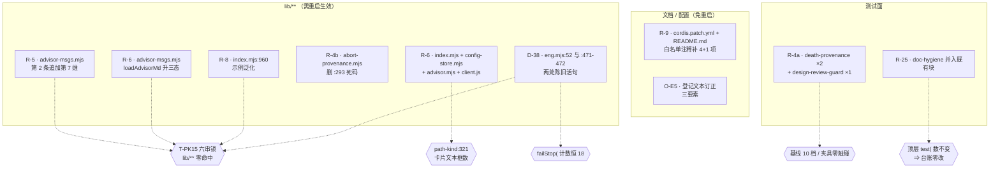
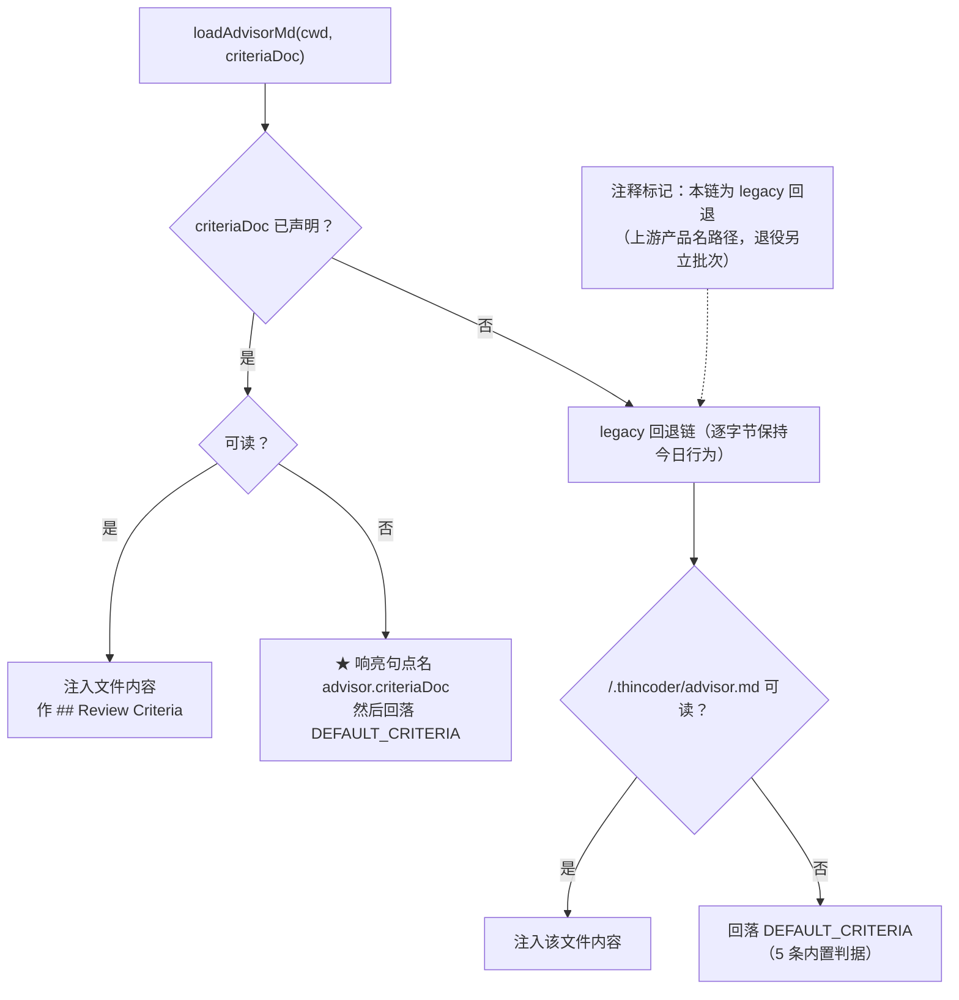

# 设计：登记面与判据面余项 —— 批 13

- 日期：2026-09-15
- 需求档：[`2026-09-15-registry-criteria-requirements.md`](./2026-09-15-registry-criteria-requirements.md)（12 用户故事 / 8 非功能标准）
- 会诊纪要：[`2026-09-15-registry-criteria-consult-minutes.md`](./2026-09-15-registry-criteria-consult-minutes.md)（会诊 id 2，**4/4 交付**；§1 实测 13 条 · §2 四问裁定 · §3 D12-13…D12-16）
- 章节：九节（§1 背景 · §2 问题 · §3 目标 · §4 决策与理由 · §5 方案 · §6 机制伪代码 · §7 状态与 schema · §8 防偏离 · §9 边界）+ §10 前置订正 · §11 受影响文件与验收 · §12 变更记录 · §13 评审落档
- 图示：**图 1（七项的落点与锁关系）** / **图 2（`criteriaDoc` 的三态与遗留链）**
- 状态：**设计待评审**

> ## ⚠️ 读前必读
>
> **1. 本批需要重启 DSH 才生效**（触碰 `lib/**`）⇒ 凡「真机行为」不可验（§5.5 列三条）。
>
> **2. 本批的核心不是代码量，而是「三条登记描述是错的」。** 交付物分两类：**代码修订**（R-4b/R-5/R-6/R-8/R-9/D-38）与**登记文本订正**（O-E5/R-5 父侧简报/R-9 的范围/R-4a 的处数）。**后者与前者同级**（需求档 §1）。
>
> **3. 行号引用口径**：定位按**符号名**，行号**仅作 as-of 参考**——**行号是提示，不是身份**。
>
> | 要找什么 | 检索符号 |
> |---|---|
> | 被补维度的用户消息句 | `lib/advisor-msgs.mjs` 的 `"2. Review against:"` |
> | 三态判据加载器 | 同档 `function loadAdvisorMd` |
> | 声明键家族 | `lib/index.mjs` 的 `topAllowed` 与 PUT 校验循环 |
> | 客户端键数组 | `lib/client.js` 的 `PROJECT_DOC_KEYS` |
> | 三处 git 容忍点 | `test/death-provenance.test.mjs` 的两处 `ENOENT` + `test/design-review-guard.test.mjs` 的一处 |
> | 容忍形态的范本 | `test/death-provenance.test.mjs` 的锚 B `console.warn` 分支 |
> | 登记机检 | `test/doc-hygiene.test.mjs` 的常设档 canary 块 |
> | D-38 两处活句 | `lib/eng.mjs` 的 `WRITE_GATE_FIXTURE` 与「守卫 E 预闸」两个字面 |

---

## §1 背景

交接页 §4 有七条**登记了好几个批次**的余项（R-9 来自批 7 · R-8/R-6/R-5 来自批 7 · R-4 来自批 6 · O-E5 来自批 6b · R-25 来自批 11），加上一条**触发条件刚成立**的欠账（D-38，批 12 登记）。

**本批的第一件事不是写代码，是把这八条逐条回盘核**——因为登记表是**快照**，而它的家只有人眼闸（G7）。**结果是：三条的登记描述是错的，两条的范围比登记大得多，一条比登记「更便宜」。**

---

## §2 问题

| # | 问题 | 根因 | 实测 |
|---|---|---|---|
| **P1** | 白名单注释落后三个版本（**4 项 / 2 文件**） | 批 5 与批 7 都把 `cordis.patch.yml` 划出写域 | 而注释正是**用户配那两个键时的唯一指引** |
| **P2** | 一条判据在用户消息里缺列 | 系统提示 7 维、用户消息 6 维 | 两条清单**都不被任何锁覆盖** |
| **P3** | 没有 `.git` 的副本里**部分套件转红** | `code = undefined`（`status = 128`）挡不住 `ENOENT` 判据 | **3 处**同类，不是 1 处 |
| **P4** | provenance 模块里有**不可达死代码** | `\|\| dLen === 0` 使循环末轮必返 | 死代码留在 provenance 里**比删除更危险** |
| **P5** | **登记把 O-E5 说反了** | 描述「形态错配」，真实是「**基分叉下的错根锚定**」 | **冻结侧 fail-open = 保护性损伤**，比登记的「miss」更坏 |
| **P6** | 两条陈旧活句指向已变/不存在的锁 | 批 12 收窄锁面后未回头改 `lib/**` | 受 N-1 冻结；**本批触发条件成立** |
| **P7** | 「新建文档必须登记」**无机检** | 纯人眼闸 | 地图**当前 42/43 完整** ⇒ **规则无契约**，不是已漂移 |
| **P8** | 示范路径带本仓形状 | 无 | 与「提示词不得指涉本仓」同族 |

**靶心 = P1/P7**（用户直接受影响的摩擦 + 规则缺契约）；**P5 是本批唯一的「发现比登记更坏」**。

---

## §3 目标

| # | 目标 | 验收面 |
|---|---|---|
| G1 | **白名单注释与判据一致**（两文件） | AC-1 · AC-2 |
| G2 | **design 评审的两份清单维度一致**，且 code 面**不受影响** | AC-3 · AC-4 |
| G3 | **无 `.git` 的副本里套件不转红**（三处） | AC-5 · AC-6 |
| G4 | **provenance 里无死代码**，行为逐字节不变 | AC-7 |
| G5 | **O-E5 的登记说对**，且修法方向被预授权 | AC-8 |
| G6 | **`criteriaDoc` 键三态生效**，存量行为零变更 | AC-9 … AC-13 |
| G7 | **新建文档漏登记被机器抓住**，且该机检**可证明会失败** | AC-14 · AC-15 |
| G8 | **`lib/**` 陈旧活句指向真实存在的东西** | AC-16 · AC-17 |
| G9 | **本批不引入新的 doc-code 漂移** | AC-18 … AC-21 |

**非目标**：修 O-E5 · 退役遗留探测链 · 把 `criteriaDoc` 接进 design · 改 `DEFAULT_CRITERIA` 内容 · 判据注入预算 · R-25 反向腿 · 落发布门 · 卡片结构性重构 · 会话级覆盖。逐条理由见 §4 与需求档 §5.1。

---

## §4 决策与理由（含否决备选）

| # | 决策 | 理由 / 否决备选 |
|---|---|---|
| **D13-1** | **R-9 与 R-6 的注释修正同一次编辑** | 否则**修完 R-9 原地再造一个 R-9**（R-6 正好新增第 5 项）。glm 提出，采纳 |
| **D13-2** | **R-5：原地追加第 7 维，无条件** | **前提已被源码证伪**：`:328` 在 `:308` 的 design-only 块内（`:349` 收口），code 走 `:352`、判据来自 `:376` 的 5 条内置 ⇒ **「污染 code 评审」不存在**。⇒ **否决「条件化」**（在 design 分支内再加条件是死代码式的防御）· **否决「从系统提示收掉」**（`ADVISOR_DESIGN` 只在 design round-1 被选中 ⇒ 收掉 = 该判据**全链路消失**，而 `documentMapDoc` 整套已交付机制存在的唯一目的就是喂养它） |
| **D13-3** | **第 7 维保留 when-present 对冲** | `injectDocumentMap` 是三态（未声明时 `:260` 明说「judge ownership from the documents list」）⇒ 对冲措辞让该维度**在地图缺席时依然可判**，且**不引用不存在的段**——与 `:329-330` 既有纪律**同律** |
| **D13-4** | **R-5 加两条回归锚**（正向 + **负向**） | 负向锚把「**design-only**」这个边界**本身**锁死，防未来重构把句子挪出分支。kimi 提，采纳 |
| **D13-5** | **O-E5：不修，只订正登记** | **闸侧拿不到会话身份**（`makeDocFreezeGate` 全局钩子、闭包只吃 `getFreezeSet`）⇒ 签名分叉方向**要么不可行、要么恰恰造出「两侧基不同」的劈裂**——**正是禁令针对的那类**。属**守卫 E 机制变更**，另立批次 |
| **D13-6** | **O-E5 的订正 = 三要素**（已证事实 / 残余风险 / **修法方向预授权**） | 「不修」≠「判非缺陷」，而是**带触发条件的已登记后续项**。修法方向按 kimi 的形状预授权：**入口边界按会话 cwd 预解析**（`resolve(sessionCwd, p)` 在进入 `computeDocHash`/闸判定**之前**钉成绝对路径，`normalizeDocPath` **仍是唯一归一点**）；**明文注明不属于**守卫 E 会诊 `:26` 的禁令射程（禁令禁的是**第二份实现**）。**前置条件 = DSH `pre-execute` 载荷的会话身份核验** |
| **D13-7** | **订正父侧自己的表述** | 「机制内部自洽 ⇒ 无缺陷」**是错的**——**`自洽 ≠ 保护`**。一致地锚在**同一个可能错的根**上是自洽的，但**冻结侧因此 fail-open** |
| **D13-8** | **R-6 新增独立键 `advisor.criteriaDoc`**，**严禁并入** `standardsDoc` 家族 | 语义不同域：`criteriaDoc` 是 **code 评审的判据正文**（替换 `:376` 处 `## Review Criteria` 段的**内容**，仅一处消费）；`standardsDoc` 是**独立追加段**（两面都注入、位于判据段**之后**）⇒ **并键 = 让「声明了标准档的仓」的 code 判据被静默替换**。复用**管道模式**（三态声明键机制）才是最小可交付 |
| **D13-9** | **R-6 的遗留探测链保留 + 注释标 legacy**（**用户裁定**） | 未声明时**逐字节保持今日行为** ⇒ **对存量用户零行为变更**；`DEFAULT_CRITERIA` 兜底在。退役是**破坏性**的（存量部署**静默失去判据**），值得独立决策 |
| **D13-10** | **R-25 落 `doc-hygiene` 且并入既有块** | **否决「新增顶层 `test(`」**：仓内有**明文先例**（`docs/test-lifecycle.md:158` 末段——批 9 收尾轮的「并入既有用例」形态**已被父侧裁定接受**），并入 ⇒ **台账 §三零改、T-LC2 零触发**。**否决 `release-check.mjs`**：它是**发布门**（登记完备是**提交级**卫生），且 G5 被机锁保留、加闸连带「七闸」口径三处 ⇒ **反而制造本批要治的漂移**。**否决 `ledger-parity`**：它管缺陷登记表，不同域 |
| **D13-11** | **R-25 匹配口径 = README 全文链接**（不是只解析两张表） | `handoff.md` 走「## 交接」bullet，**不在两表内** ⇒ 只解析两表会**误报** |
| **D13-12** | **R-25 域 = `docs/` 顶层非递归** | 与 T-E19 非递归先例同律；今日无子目录，且 `viz/` 及未来子目录**天然在域外**（规则写明即可，**无需例外条目**） |
| **D13-13** | **R-4a 三处同类一并治**，修法**镜像锚 B 的容忍形态** | 登记只说 1 处，实测 **3 处**；只治一处会让「无 `.git` 副本」的问题**留一半** |
| **D13-14** | **R-4b 直接删 `:293`** | 死代码在 **provenance 关键模块**里比删除更危险；删后行为**逐字节不变**（`:291` 已保证全输入返回） |
| **D13-15** | **D-38 两处订正点到真实约束** | `:52` →「**可执行行**逐字节」（批 12 语义）；`:471-472` → 点名 **`doc-hygiene.test.mjs:325-330`**（那才是真正约束 helper 位置的活断言）并写明「**区间不重叠**」 |
| **D13-16** | **R-8 泛化示例** | 去掉本仓形状，与「提示词不得指涉本仓」同族 |

---

## §5 方案

### §5.1 七项的落点与锁关系（图 1）



**读图要点**：**本批最贵的不是改代码，而是不撞锁**。五把锁里 **`path-kind:321`（卡片恰两个文本框）是本批唯一必须「同步改口径」的**——因为 R-6 加第三个键；其余四把都是**不得违反**的约束。

### §5.2 `criteriaDoc` 的三态与遗留链（图 2）



**读图要点**：**四条出口里三条与今日行为完全一致**——只有「声明且可读」与「声明但不可读」是本批新增。⇒ **对存量用户（未声明）逐字节零变更**，这正是 **US-7** 的验收面。

### §5.3 R-25 的谓词

```
域     = docs/ 顶层 *.md（非递归）           —— 今日 43 档
例外   = { "README.md" }                     —— 恰一条（登记簿自身）
断言   = ∀ f ∈ 域 \ 例外 :  README 全文中存在 "](f)"
现状   = 43 − 1（例外）− 42（已登记） = ∅     —— 落地即绿、零追加豁免
```

### §5.4 D-38 两处的订正文本

| 处 | 现状（错） | 订正为 |
|---|---|---|
| `lib/eng.mjs:52-53` | 「…因为 `guard-e.test.mjs` 的 `WRITE_GATE_FIXTURE` **逐字节**锁着 `makeWriteGate` 函数体内 `isProductCode(target)` 那一行…」 | 「…因为 `WRITE_GATE_FIXTURE` **锁着 `makeWriteGate` 函数体的可执行行**（**批 12 起注释层不入锁**）…」 |
| `lib/eng.mjs:471-472` | 「…`test/stage-gate.test.mjs` **逐字节锁该切片**。」 | 「…该切片受 **`test/stage-gate.test.mjs` 的四标识符禁用检查**覆盖；**逐字节锁的区间是 `[makeWriteGate, WG_END)`，从该切片结束处才开始——两者不重叠**。真正约束 helper 位置的活断言在 **`test/doc-hygiene.test.mjs`**。」 |

### §5.5 本批**不可真机验证**清单

| # | 主张 | 为何不可验 | 何时可验 |
|---|---|---|---|
| 1 | **进程 cwd 与会话 cwd 是否真会分叉** | 需活会话观测 | 不可验（且这是 O-E5 不修的站得住理由**之一**） |
| 2 | R-6 键化后的**设置页交互**（第三个输入框） | 需重启才有新 `lib/client.js` | 重启后 |
| 3 | R-5 补第 7 维后的**评审员实际行为** | 需一次真机评审 | 重启后 |

> **其余全部可在 `node --test` 进程内验证。**

---

## §6 机制伪代码

### §6.1 R-5 的追加（`lib/advisor-msgs.mjs`，design 分支内）

```js
    parts.push("2. Review against: completeness (all requirements covered?), feasibility (can this be built?), standards compliance (does it follow the project standards provided in this review context?), clarity (specific enough?), acceptance criteria (verifiable?), scope (appropriate?), document ownership (does it amend the document that already owns its topic — per the document map when present, otherwise judged from the documents list — rather than fragment into a new file?).")
```

**要点**：① **原地追加，不加条件**（分支本身就是条件）；② 保留 **when-present 对冲**，镜像 `advisor-design.md` 的第 7 维；③ **不得**引入 T-PK15 六串。

### §6.2 R-6 的三态加载器（`lib/advisor-msgs.mjs`）

```js
/** code 评审的判据清单。
 *  三态（零静默，对齐 injectProjectStandards / injectDocumentMap 的形态）：
 *    ① criteriaDoc 已声明且可读 → 注入其内容
 *    ② criteriaDoc 已声明但不可读 → 【响亮句点名配置键】，再回落 DEFAULT_CRITERIA
 *    ③ criteriaDoc 未声明 → ★ legacy 回退链（逐字节保持今日行为）：
 *         <cwd>/.thincoder/advisor.md 可读则注入，否则 DEFAULT_CRITERIA
 *      ★ 该链的 `.thincoder/advisor.md` 是【上游产品名路径】——批 13 保留为 legacy 回退
 *        （退役是破坏性的，另立批次；见设计档 §9 边界 3）。 */
function loadAdvisorMd(cwd, criteriaDoc) { … }
```

### §6.3 R-4a 的容忍形态（镜像锚 B）

```js
} catch (e) {
  if (e?.code === "ENOENT") break                   // 无 git 的机器：跳过交叉核验
  if (e?.status === 128) {                          // ★ 有 git 但不在仓库内（实测 code=undefined）
    console.warn("[thincoder-suite] T-AP7 交叉核验跳过：不在 git 仓库内（" + … + "）")
    break
  }
  throw e
}
```

**三处同改**；**保住 `:888` 的「全跑或全跳」不变式**（`headChecked` 归零）。

### §6.4 R-25 的谓词（`test/doc-hygiene.test.mjs`，并入既有块）

```js
/** 登记完备性（批 13）：docs/ 顶层 *.md（非递归、例外仅 README 自身）必须全部在
 *  README **全文**的 `](name)` 链接里出现。★ 口径注意：handoff.md 走「## 交接」bullet，
 *  只解析两张表会误报 ⇒ 必须扫全文。 */
const unregisteredDocs = (readme, onDisk) =>
  onDisk.filter((f) => f !== "README.md" && !readme.includes("](" + f + ")"))
```

---

## §7 状态与 schema

| 面 | 变更 | 说明 |
|---|---|---|
| `lib/advisor-msgs.mjs` | **修改（核心）** | `:328` 追加第 7 维；`loadAdvisorMd` 升三态 + legacy 标记 |
| `lib/index.mjs` | 修改 | `topAllowed` 子键集 + 错误散文（**追加在尾部**）；PUT 校验循环加一键；`:960` 示例泛化 |
| `lib/config-store.mjs` | 修改 | merge 白名单加一键 |
| `lib/advisor.mjs` | 修改 | 生效配置下探加一行 |
| `lib/client.js` | 修改 | `PROJECT_DOC_KEYS` 加一键（三面自动跟上）+ 卡片第三输入框 + 种子 + eff 变量 |
| `lib/abort-provenance.mjs` | 修改 | 删 `:293` 死码 |
| `lib/eng.mjs` | 修改（**注释 only**） | D-38 两处订正 |
| `cordis.patch.yml` + `README.md` | 修改 | 白名单注释补 **4 + 1** 项（R-9 与 R-6 **同一次编辑**） |
| `test/death-provenance.test.mjs` | 修改 | R-4a 两处容忍 + 既有块内加 R-5 的两条回归锚 |
| `test/design-review-guard.test.mjs` | 修改 | R-4a 第三处容忍（**该档已在 `AP_TEST_AUTHORIZED`**） |
| `test/doc-hygiene.test.mjs` | 修改 | R-25 谓词并入既有块 |
| `test/path-kind.test.mjs` | 修改 | **`PK_KEYS` 加一键** ⇒ T-PK14 家族四面自动扩；**`:321` 卡片文本框数 2→3 必须同改**；`:475` 散文串同改 |
| `docs/2026-09-13-portability-design.md` | 修改 | `:292` 逐字引用的 6 维文加 as-of 括注 |
| `docs/2026-09-13-guard-e-consult-minutes.md` | 修改 | O-E5 行订正 + §6 历史行 |
| 本批三档 + `docs/README.md` + `docs/test-lifecycle.md` + `docs/2026-09-05-defect-registry.md` + 交接页 + `CHANGELOG.md` + `package.json` | 收口面 | R-33…R-36 登记；D-38 状态改「已修」 |
| **零字节** | `test/fixtures/**` · 基线 10 档（除授权面）· `stripComments` 两条正则 · `existing` 数组 | N-3 · N-4 · N-7 |

**读写方声明**：**写入方 = 本批 eng_coder**（一次性）；**读取方 = `node --test`**（每次跑读 `docs/README.md` 与 `lib/**`）；**`docs/` 是只读源**（R-25 的域），**`lib/eng.mjs` 本批只写注释、不写代码**。

---

## §8 防偏离

### §8.1 零改面（验收拒收项）

| # | 面 | 判据 |
|---|---|---|
| 1 | **`test/fixtures/**`** | `git diff` 为空 |
| 2 | **基线 10 档** | 只有 `design-review-guard.test.mjs` 被改，且**已在 `AP_TEST_AUTHORIZED`** |
| 3 | **`stripComments` 两条正则** | 逐字节不变 |
| 4 | **不新增测试档** | `readdirSync(test).filter(.test.mjs)` 数不变 |
| 5 | **不新增顶层 `test(`** | 全部并入既有块 ⇒ 台账 §三**零改** |
| 6 | **`lib/**` 六串零命中** | T-PK15 + doc-hygiene T3 |
| 7 | **`failStop(` 计数恒 18** | `doc-hygiene` 既有断言 |

### §8.2 机验锚

| # | 锚 | 谓词 |
|---|---|---|
| **V1** | 注释与判据一致 | `cordis.patch.yml` + `README.md` 列出的键集 == `index.mjs` 的 `topAllowed` + advisor 子键集 + 组字段集 |
| **V2** | design 含第 7 维 | design round-1 用户消息**含** `document ownership` |
| **V3** | **code 不含第 7 维** | code round-1 用户消息**不含**该子句（**负向锚**） |
| **V4** | 三处容忍 | 三处 catch 在 `code === undefined && status === 128` 时 warn+skip；ENOENT 仍 skip |
| **V5** | 死码已删 | `abort-provenance.mjs` 无循环后的不可达 `return`；既有断言全绿 |
| **V6** | 三态齐 | `loadAdvisorMd` 四条出口齐（声明可读 / 声明不可读响亮句 / legacy 可读 / legacy 回落） |
| **V7** | 声明键五面 | `topAllowed` 子键集 · PUT 校验循环 · merge 白名单 · `advisor.mjs` 下探 · `PROJECT_DOC_KEYS` 五处均含 `criteriaDoc` |
| **V8** | 登记完备 | `unregisteredDocs(README, docs/*.md) === []`；且谓词**自证会失败** |
| **V9** | D-38 | `lib/eng.mjs` 不再含「逐字节锁该切片」与「逐字节锁着」（改为可执行行语义 + 点名真断言） |
| **V10** | 台账零改 | `docs/test-lifecycle.md` §三 的逐档计数与 fs **逐档相等**且**本批未改** |

---

## §9 边界

| # | 边界 | 行为 | 理由 |
|---|---|---|---|
| 1 | **O-E5 不修** | 登记为**带触发条件的已登记后续项**（触发 = 首次在活会话观测到 cwd 分叉）；**修法方向已预授权** | 闸侧拿不到会话身份 ⇒ 属守卫 E 机制变更 |
| 2 | **R-25 只锁前向** | 反向（已登记链接悬空 = 链接腐烂）**不锁**，登记为后续项 | 另一缺陷物种 |
| 3 | **遗留探测链保留** | `.thincoder/advisor.md` 仍在代码里，**注释标 legacy**；退役另立批次 | 破坏性变更（存量部署**静默失去判据**） |
| 4 | **`criteriaDoc` 不接进 design** | design 判据住系统提示，另一条链 | 改它 = 改 design 判据来源，非本批范围 |
| 5 | **判据注入无预算** | 遗留链今日无预算 ⇒ **登记为后续项**，不顺手加 | 加它 = 扩大批面 |
| 6 | **卡片文本框数 2→3** | `path-kind:321` 的口径**同批订正** | 那是**锁面变更**，须在设计阶段声明显式 |
| 7 | **不改 `cordis.patch.yml` 的 base 专属段语义** | 只订正注释文本 | 语义变更另议 |
| 8 | **将来的 R-6 键化不再叫 `criteriaDoc` 之外的别名** | 命名随家族（短、`Doc` 后缀） | 一致 |

---

## §10 前置订正（**已完成并推送**）

本批的摸底阶段**先做了一次「登记回盘」**，结果（详见纪要 §1）：

| # | 登记说 | 实测 | 性质 |
|---|---|---|---|
| 1 | R-9「缺 1 键」 | **缺 4 项 + 2 个文件**（加 `runner` 与 `README.md:169-172`） | **范围扩** |
| 2 | R-4a「1 处」 | **3 处同类** | **范围扩** |
| 3 | O-E5「形态错配 ⇒ miss」 | **基分叉下的错根锚定；冻结侧 fail-open** | **描述错** |
| 4 | 父侧简报「6 维句 design 与 code 都发」 | **只在 design** | **父侧错** |
| 5 | R-5 行号 `:278` | 现 `:328` | 行号漂移 |
| 6 | D-38「被冻结不可修」 | **触发条件已成立，且修它无需重基线夹具** | 比登记**更便宜** |

⇒ **「登记文本订正」是本批与代码修订同级的交付物**（需求档 §1）。已推送的**前提订正**：无（本批的前置订正**全部在文档层，随本批一次交付**）。

---

## §11 受影响文件全清单与验收

### §11.1 实施域

| 文件 | 改动 | 类型 |
|---|---|---|
| `lib/advisor-msgs.mjs` | R-5 追加 + R-6 三态 | **修改（核心）** |
| `lib/index.mjs` | R-6 白名单/校验 + R-8 示例 | 修改 |
| `lib/config-store.mjs` | R-6 merge | 修改 |
| `lib/advisor.mjs` | R-6 下探 | 修改 |
| `lib/client.js` | R-6 客户端 | 修改 |
| `lib/abort-provenance.mjs` | R-4b 删死码 | 修改 |
| `lib/eng.mjs` | **D-38 注释 only** | 修改 |
| `cordis.patch.yml` · `README.md` | R-9 + R-6 注释（**同一次编辑**） | 修改 |
| `test/death-provenance.test.mjs` | R-4a ×2 + R-5 两条锚 | 修改 |
| `test/design-review-guard.test.mjs` | R-4a ×1（**已授权**） | 修改 |
| `test/doc-hygiene.test.mjs` | R-25 谓词（**并入既有块**） | 修改 |
| `test/path-kind.test.mjs` | `PK_KEYS` + **`:321` 口径 2→3** + `:475` 散文 | 修改 |
| `docs/2026-09-13-portability-design.md` | `:292` 引文加 as-of 括注 | 修改 |
| `docs/2026-09-13-guard-e-consult-minutes.md` | O-E5 订正 + §6 历史行 | 修改 |
| **★ 明确排除（禁改）** | `test/fixtures/**` · `test/stages.test.mjs` · `test/stage-gate.test.mjs` · `test/guard-e.test.mjs`（批 12 的锁面基线）· 一切历史记录（除上列两处**订正**） | 零改动 |

### §11.2 验收标准

| # | 验收标准 | 形态 |
|---|---|---|
| **AC-1** | 注释列出的键集 == 判据键集（**两文件**） | **核心** |
| **AC-2** | 缺项已补：`contextTokens` · `standardsDoc` · `documentMapDoc` · `runner` · `criteriaDoc` | 核心 |
| **AC-3** | design round-1 用户消息**含** `document ownership` | 核心 |
| **AC-4** | code round-1 用户消息**不含**（**负向锚**） | **核心** |
| **AC-5** | 三处 catch 在 `status === 128` 时 **warn + skip** | 核心 |
| **AC-6** | ENOENT 仍 skip；其他错误仍 throw | 核心 |
| **AC-7** | `deathLine` 死码已删且**既有断言全绿** | 核心 |
| **AC-8** | O-E5 登记文本三要素齐（已证事实 / 残余风险 / 修法方向 + 前置条件） | 核心 |
| **AC-9** | `criteriaDoc` **已声明且可读** ⇒ 注入其内容 | 核心 |
| **AC-10** | **已声明但不可读** ⇒ **响亮句点名该键** + 回落 | **核心** |
| **AC-11** | **未声明** ⇒ **逐字节**保持今日链（探 `.thincoder/advisor.md` → `DEFAULT_CRITERIA`） | **核心（US-7）** |
| **AC-12** | PUT：`isDocPath` 拒绝非文档路径；`""`/`null` = 撤销；未知键仍 400 | 核心 |
| **AC-13** | merge 白名单含该键；空串不合并 | 核心 |
| **AC-14** | `unregisteredDocs(README, docs/*.md) === []`（**落地即绿**） | 核心 |
| **AC-15** | 谓词**自证会失败**：注入合成未登记名 ⇒ 必红；空登记簿 ⇒ 必红 | **核心（律 3）** |
| **AC-16** | `lib/eng.mjs` 无「逐字节锁该切片」；改为可执行行语义 + 点名真断言 | 核心 |
| **AC-17** | `lib/index.mjs:960` 示例不含 `lib/x.mjs` | 核心 |
| **AC-18** | **台账 §三零改**；T-LC1/T-LC2/T-LC4/T-E19 全绿 | **零回归** |
| **AC-19** | 六串零命中（T-PK15 + doc-hygiene T3） | 零回归 |
| **AC-20** | `failStop(` 计数恒 18；`stripComments` 两条正则逐字节不变 | 零回归 |
| **AC-21** | 全量 `node --test` **453/453**（**零新增用例数**） | 收口 |
| **AC-22** | `path-kind.test.mjs:321` 的卡片文本框数口径**已同步为 3**（锁面变更显式） | 核心 |

### §11.3 建议 stages

| stage | goal | 检查 |
|---|---|---|
| **0** | **只读勘察**：机械枚举「注释 vs 判据」的键集差（V1 的谓词先在只读态跑一次）；复核 `path-kind:321` 与 `:475` 现状；复核三处 catch 的当前文本；复核 `docs/` 顶层档数与登记数；**逐字确认 O-E5、R-5 的订正落点** | 报告六项事实（**不写文件**） |
| 1 | **R-5**：追加第 7 维 + 两条回归锚（正向 + **负向**）+ `portability-design.md:292` 的 as-of 括注 | `node --test`（design/code 两向锚绿） |
| 2 | **R-4a**：三处容忍形态 | `node --test test/death-provenance.test.mjs test/design-review-guard.test.mjs` |
| 3 | **R-4b**：删死码 | `node --test test/abort-provenance*.test.mjs` 或全量 |
| 4 | **R-6 服务端**：`index.mjs` 白名单/校验 + `config-store.mjs` merge + `advisor.mjs` 下探 + `advisor-msgs.mjs` 三态 | `node --test test/config-api.test.mjs test/path-kind.test.mjs` |
| 5 | **R-6 客户端**：`PROJECT_DOC_KEYS` + 卡片第三框 + 种子 + eff；**同步 `path-kind:321` 口径与 `:475` 散文** | `node --test test/path-kind.test.mjs` |
| 6 | **R-9 + R-6 注释**（**同一次编辑**，两文件）+ **R-8** + **D-38** | 全量 + V1/V9/V10 |
| 7 | **R-25**：谓词并入既有块 + 自证 | `node --test test/doc-hygiene.test.mjs` |
| 8 | **收口**：全量 + 锚 V1–V10 + 零改面七项 + **登记文本订正**（O-E5/R-5 父侧/R-9 范围/R-4a 处数）+ 交付报告 | `node --test` |

---

## §12 变更记录

| 日期 | 变更 |
|---|---|
| 2026-09-15 | 首版（设计待评审）：会诊 id 2 **4/4 交付** → 九节 + §10 前置订正 + 图 1/图 2；**J13-1…J13-10**；**D13-1…D13-16**；US-1…US-12；N-1…N-8；**AC-1…AC-22**；锚 V1–V10；§11.3 **九 stage（含 stage 0 只读勘察）**。用户对 R-6 遗留链的裁定已落（**保留 + 标 legacy**）。 |

---

## §13 评审落档

### §13.1 设计评审轮次 1 落点（预留）

### §13.2 交付核验与两款评审落档（预留）
