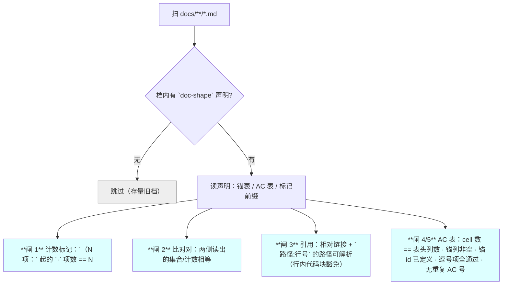
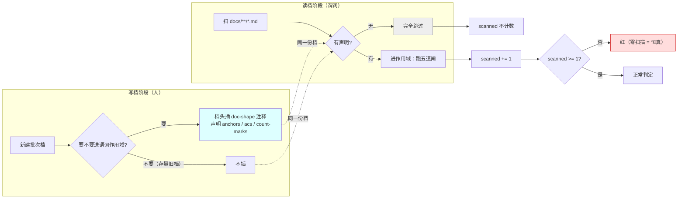
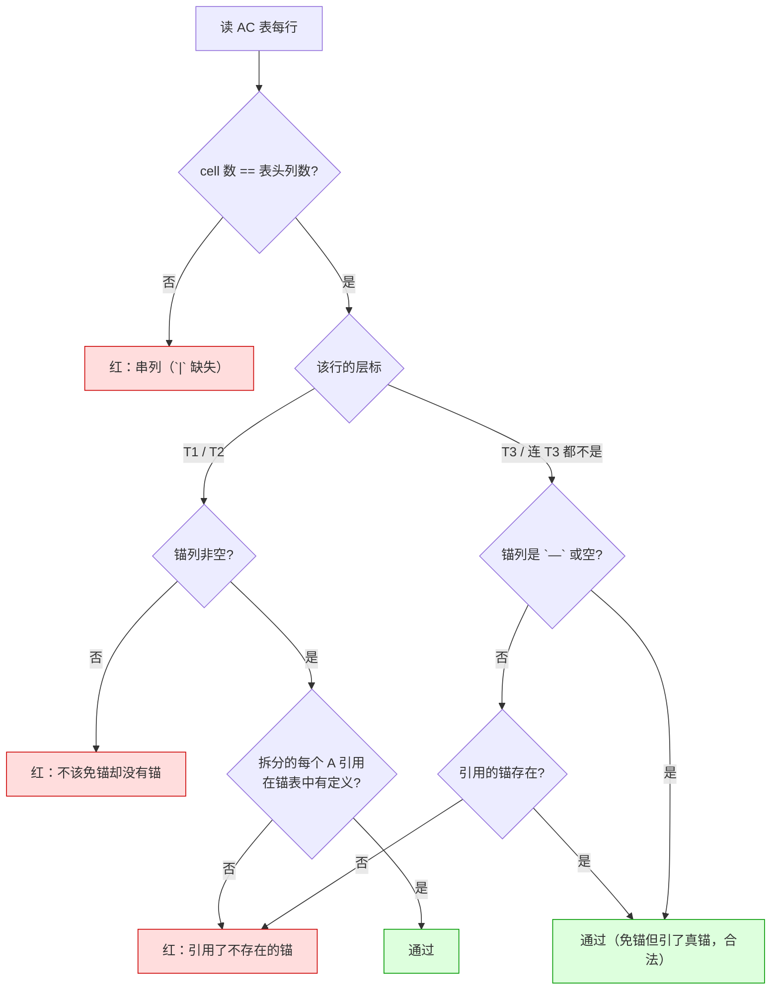
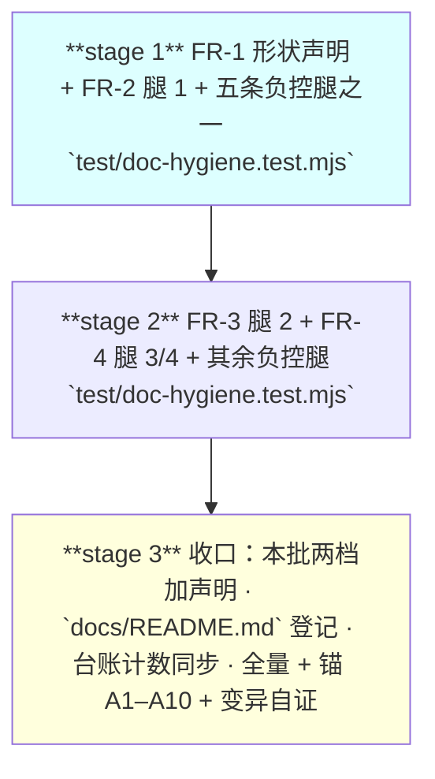

# 设计：文档形状谓词 —— 批 16

- 日期：2026-09-16
- 需求档：[`2026-09-16-doc-shape-requirements.md`](./2026-09-16-doc-shape-requirements.md)（**US-1…US-6** · **N-1…N-7** · §5.1 六项不做 · §5.2 **R-52…R-53**）
- 章节：按 [`METHODOLOGY.md`](../METHODOLOGY.md)：§设计文档的成文流程与必备章节 **九节**（§1 背景 · §2 问题 · §3 目标 · §4 决策与理由 · §5 方案 · §6 机制伪代码 · §7 状态与 schema · §8 防偏离 · §9 边界）+ **§10 受影响文件与验收** + **§11 变更记录** + **§12 评审落档**
- 图示：**图 1**（谓词总览与五道闸）· **图 2**（形状声明的生命周期）· **图 3**（AC ↔ 锚互引的判定路径）
- 状态：**设计待评审**

> ## ⚠️ 读前必读
>
> **1. 本批是纯测试面改动**——`lib/**` 零改动，**不需要重启 DSH**。
>
> **2. 本批的形态由两条实测否证决定**（需求档 §2.3）：**只认显式标记**（不猜中文）· **前向生效**（不追溯存量）。**这不是保守，是 62% 误报与 213 条历史红逼出来的唯一可行形态。**
>
> **3. ★ 谓词只报不改**：它红了就是红了，**改档是主代理/eng_coder 的事**（D1 写权矩阵）。
>
> **4. 定位口径**：本档行号仅 as-of；**一切改动按符号/字面锚定**。

---

## §1 背景

本仓已有文档类谓词的**基础设施**（`test/doc-hygiene.test.mjs` 的 `read(rel)` 能读任意仓内档、`PLUGIN_DIR` 解析齐全），**缺口不是「没地方放」，是「缺这四条腿」**。

**立项动力是本会话的缺陷分布**（需求档 §2.1）：**父侧文档 45 条 vs 实施者代码 2 条**，而**45 条里唯一可靠的发现手段是用户的质问**。**⇒ 本批把这个闸机械化。**

---

## §2 问题（**带 `file:line` 或实测出处**）

逐条见需求档 §2.2 的 **P-1…P-8**（八条，每条带出处）。**本节只补它们的共性**：

| 共性 | 说明 |
|---|---|
| **全是「形状」问题，无一是「内容对不对」** | P-1…P-5 是计数/枚举；P-6/P-7 是引用；P-8 是覆盖 ⇒ **四类形状覆盖了全部八条** |
| **全部逃过了当时的评审** | 它们是**后来**被审计/复审/用户抓到的 ⇒ **当时没有机械核对** |

---

## §3 目标

| # | 目标 | 验收面 |
|---|---|---|
| G1 | 「声明 N 项而列表不是 N 项」**当场红** | AC-1 · AC-2 |
| G2 | **同一事实在两处取不同值**会被抓 | AC-3 |
| G3 | **引用不存在的落点**当场红 | AC-4 · AC-5 |
| G4 | **该有锚的 AC 有锚、锚被引用** | AC-6 · AC-7 · AC-8 |
| G5 | **不因存量旧写法误红** | AC-9 · AC-10 |
| G6 | **谓词自身被证明会红** | AC-11 · AC-12 |

### §3.1 非目标

逐条见需求档 §5.1 的**六项**。**最要紧的一条**：**不做「描述面 vs 实现」类谓词**——它需要读代码 + 语义判断，属测试/代码锁范畴（用户问过，裁定不进本批）。

---

## §4 决策与理由

| # | 决策 | 为什么 | 被否决的备选与理由 |
|---|---|---|---|
| **D16-1** | **腿 1 只认显式标记** `（N 项：` / `（N 处：` …，**不做正则猜** | 对 53 档真语料实跑：**猜的形态误报 62%**（24 处判不等 15 处）；根因是**中文量词无词边界** | **否决「按正则找 `N 项` + 行内 `·` 列表」**（实测误报 62%）· **否决「按中文数字量词」**（更松，误报更多） |
| **D16-2** | **前向生效**：谓词**只处理自带形状声明的档** | 追溯会造 **213 条历史红**（13 份设计档里 11 份会被判不合规）⇒ **新规则管旧账**与本仓 D-7 先例相悖 | **否决「全量追溯 + 白名单豁免」**：白名单会长到失去意义，且**每加一份旧档就要改测试** |
| **D16-3** | **形状声明住档内**（HTML 注释 + 键值），**不住测试里** | ① D2 单一权威源：**档自己声明自己怎么验**；② 搬家/改名不会与测试脱节；③ 写档的人看得见自己的义务 | **否决「在测试里维护一个档名→格式的映射表」**：那会让**测试成为第二份真相源**，且**新档建档时容易忘登记**（本会话 R-25 那次就是这么红的） |
| **D16-4** | **腿 4 的不变量分层**：**T1/T2 必须有锚；T3 与「连 T3 都不是」免锚** | 批 14 我把不变量写成「满射」⇒ **当场为假**（5 条 AC 无锚）——**而其中 3 条本就不该有锚**（T3 人眼 / 重启后 / 仓外 owner） | **否决「一律必须有锚」**：**给 T3 编锚才是超卖**——那正是层标制度要防的 |
| **D16-5** | **腿 3 的豁免靠显式标记**（示例/外部引用写在**行内代码块**里即豁免） | 实测 11 个「不存在」里 **7 个是示例**（`lib/a.mjs` · `docs/x.md` · `docs/TODO.md` …）· 剩下含**上游引用**（`docs/core/design/CONSULTATION.md` 在 `D:\workspace\thincoder`，不在本仓） | **否决「豁免白名单」**：同样会长到失去意义；**行内代码块是天然的语义标记**（"这是举例"） |
| **D16-6** | **每条腿必须有负控腿**，且**区分真红/假红** | 批 14 的分歧审计点名：设计承诺「空集 ⇒ 必红」**而从没有腿证过** ⇒ **声明 ≠ 已验证** | **否决「只写正例」**：正例绿**证明不了谓词会红**（恒真的谓词也全绿） |
| **D16-7** | **扫描集为空 ⇒ 红**（断言 `scanned >= 1`） | 防「零扫描 ⇒ 恒真」——**P-9 的教训是谓词会押上作者前提**，而「没扫到任何档」是最隐蔽的恒真 | **否决「无声明就静默跳过」**：那会让**谓词悄悄失效而套件全绿** |

---

## §5 方案（分交付单元 FR-1…FR-4）

### §5.0 图 1：谓词总览与五道闸



**读图要点**：**唯一的分叉点是 B**（有无声明）——**那是「前向生效」的实现**。而**五道闸全部挂在「有声明」的那些档上**，**零触碰存量**。

### §5.1 FR-1 形状声明（**本批的语法基础**）

**做什么**：定义**档内的形状声明**——一份 HTML 注释块，键值对，插入到档头。

```
<!-- doc-shape
anchors: 机验锚
acs: 验收标准
count-marks: 项|处|条|档|值|步|腿
-->
```

| 键 | 含义 | 缺省 |
|---|---|---|
| `anchors` | 锚表的**节标题关键字**（用于定位锚表、抽取锚 id） | **必填**（无它则腿 4 无从跑） |
| `acs` | AC 表的**节标题关键字** | **必填** |
| `count-marks` | 腿 1 认的量词集合 | `项\|处\|条\|档\|值\|步\|腿` |
| `compare` | 腿 2 的可选比对对声明（形如 `§11.2:§11.3`） | 空 ⇒ 腿 2 不跑 |

**前置**：无。
**后置**：档内出现该注释 ⇒ 该档**进入谓词作用域**；不出现 ⇒ **完全跳过**。

### §5.1b 图 2：形状声明的生命周期（**谁写、谓词怎么用、为什么不追溯**）



**读图要点**：**`scanned` 只数「进了作用域的档」，不数「扫到的档」**——**那个区别就是「零扫描 ⇒ 恒真」的堵口**。**而虚线表明：写的人与读的谓词看的是同一份档，没有第二份真相源**（D16-3）。

### §5.2 FR-2 腿 1：计数 ↔ 列表（`US-1`）

**做什么**：在**声明过的档**内，找 `（N 项：` 形态的标记，**从其后数 `·` 分隔项**，**项数必须 == N**。

**前置**：档有 `doc-shape` 声明。
**后置**：不等 ⇒ **该档红**，报 `文件:行: 声明 N 项 · 实际 M 项`。

**★ 为什么是这个形态**（D16-1）：它**在自然阅读顺序里就有意义**（`（2 项：a · b）` 是普通中文），**而机器可以无歧义地数它**。

### §5.3 FR-3 腿 2：同一事实多处一致（`US-2`）

**做什么**：按 `compare` 声明取出**两节的集合/计数**，**逐项比对**。

**前置**：声明里给了 `compare`。
**后置**：两侧不等 ⇒ **红**，报两侧各自的集合差。

**★ 本批只实现「集合型」比对**（如 §11.2 的 AC 清单 ↔ §11.3 定义的 AC 号集）；**计数型**（两侧各报一个 N）留给后续（它需要「哪个 N 权威」的定义）。

### §5.4b 图 3：AC ↔ 锚互引的判定路径（**分层不变量**）

**（本图与 §5.4 的腿 4 对应；先看图，再看 §5.4 的实现说明。）**



**读图要点**：**分叉点是「层标」**——**T1/T2 必须锚列非空，T3 与「连 T3 都不是」允许空**。**这一条正是我批 14 写坏的那个不变量**（当时写「满射」，而这棵树表明**免锚是合法的**，所以「满射」当场为假）。**⇒ 图 3 就是那次事故的纠正形态。**

### §5.4 FR-4 腿 3 + 腿 4（`US-3` / `US-4`）


**腿 3（引用可解析）**：
- 扫 `](相对路径.md)` 与 `` `路径:行号` ``；
- **路径必须存在**（相对仓根）；
- **豁免**：出现在**行内代码块**（`` ` `` 包裹）里的路径**不检查**——实测 7/11 的「不存在」是示例；
- **行号不解析**（它会漂 —— 见需求档 P 类的「行号只作 as-of」；本仓 D4：行号只作 as-of 括注）。

**腿 4（AC ↔ 锚互引）**：
- 读 AC 表：**cell 数 == 表头列数**（防 `|` 缺失导致串列）；
- **锚列非空**；其值**拆分后每个 A 引用都必须在锚表中有定义**；
- **T1/T2 的 AC 必须有锚**；**T3 与「连 T3 都不是」免锚**（D16-4）；
- **AC 号不重复**。

**前置**：档有声明且声明含 `anchors` / `acs`。
**后置**：任一违规 ⇒ **红**，逐条报出。

---

## §6 机制伪代码（含前置/后置条件）

```js
/**
 * 形状声明的解析。
 * @pre   `src` 是整档文本
 * @post  无声明 ⇒ 返回 null（该档**完全跳过**）；有声明 ⇒ 返回键值对象
 *        **绝不**在解析失败时静默返回「空声明」（那会让谓词空转 ⇒ 恒真）
 */
function parseDocShape(src) { /* 匹配 <!-- doc-shape ... --> 并解析 k: v */ }

/**
 * 腿 1：计数标记。
 *
 * @pre   只在**已声明**的档上调用
 * @post  每个 `（N 项：` 标记的 `·` 项数都 == N
 *        ★ 项数按**标记之后、同一行内**数——跨行不算（跨行会让「N 项」失去肉眼可核性）
 *        ★ 报错文本含 文件:行:声明值:实际值（**缺一即无法定位**）
 */
function checkCountMarks(text, marks) { /* ... */ }

/**
 * 腿 2：比对对。
 *
 * @pre   `pair` 形如 `{ a: "§11.2", b: "§11.3" }`，两节都必须存在
 * @post  两侧读出的**集合**相等
 *        ★ 本节**只做集合型**；计数型留给后续（需先定义「哪个 N 权威」）
 *        ★ 某侧读不到任何条目 ⇒ **红**（不能当作「空集 == 空集」而通过 —— 那是恒真的入口）
 */
function checkComparePair(text, pair) { /* ... */ }

/**
 * 腿 3：引用可解析。
 *
 * @pre   无
 * @post  每个相对 md 链接与每个 `路径:行号` 的**路径**都存在于仓根下
 *        ★ **行内代码块内的路径豁免**——实测 7/11 的「不存在」是示例（`lib/a.mjs` 这类）
 *        ★ **行号不解析**（D4：行号只作 as-of）
 */
function checkRefs(text, rootDir) { /* ... */ }

/**
 * 腿 4/5：AC ↔ 锚互引。
 *
 * @pre   `anchorsSection` 与 `acsSection` 都能定位（否则**红**，不是跳过）
 * @post  ① 每行 cell 数 == 表头列数
 *         ② 锚列非空；拆分后每个 A 引用都在锚表中有定义
 *         ③ T1/T2 必须有锚；T3 与「连 T3 都不是」免锚
 *         ④ AC 号不重复
 *        ★ ②「锚列非空」的例外只有两种写法：`—` 与「连 T3 都不是」——**其余空值一律红**
 */
function checkAnchorsAndACs(text, decl) { /* ... */ }
```

---

## §7 状态与 schema（**谁写谁读**）

**本批不新增任何持久化状态、不改任何运行时 schema**——它是**测试面的静态谓词**。

| 面 | 本批的动作 | 谁写 | 谁读 |
|---|---|---|---|
| **档内的 `doc-shape` 声明** | **新增**（新档头；存量档**不补**） | **写档的人**（主代理 / eng_coder 按任务书） | **谓词**（`parseDocShape`） |
| **`test/doc-hygiene.test.mjs`** | 追加腿 1–5 | eng_coder（凭 design token） | `node --test` |
| **`docs/test-lifecycle.md`** §三 | 计数同步（`T-LC2` 等值锁） | 主代理（登记面，D1） | `test-lifecycle.test.mjs` |
| **新增持久化** | **无** | — | — |
| **新增配置键** | **无** | — | — |

> **★ 一处「谁读」的关键变化**：**`docs/*.md` 从「只有人读」变成「也有谓词读」**——**但仅限自带声明的档**。

---

## §8 防偏离

### §8.1 零改面

| # | 面 | 判据 |
|---|---|---|
| 1 | **`lib/**` 零改动** | `git diff --stat -- lib/` 空（本批是纯测试面） |
| 2 | **不新增测试档** | `test/*.test.mjs` 数不变 |
| 3 | **存量 `docs/**` 零改动** | 除本批自己的两档与 `docs/README.md`（登记）外零 diff |
| 4 | `test/fixtures/**` | 零 diff |
| 5 | 六串零命中（`lib/**`）· `failStop(` 恒 18 | 既有锁 |
| 6 | **`docs/test-lifecycle.md` 的计数** | 与 fs 实测相等（`T-LC2`） |

### §8.2 机验锚（**三要素写全：检索目标 / 谓词 / 期望**）

| 锚 | 检索目标 | 谓词 | 期望 |
|---|---|---|---|
| **A1** | `test/doc-hygiene.test.mjs` | `grep 'parseDocShape'` 且断言其**无声明时返 `null`** | 定义**恰 1 处**；`null` 分支在位 |
| **A2** | 同上 | 「扫描集非空」断言 | 存在 `assert.ok(scanned >= 1, …)` —— **防零扫描恒真** |
| **A3** | 同上 | 腿 1 的报错文本含 `声明` 与 `实际` | 两词都在（缺一即无法定位） |
| **A4** | 同上 | 腿 3 的行内代码块豁免 | 存在对 `` ` `` 内路径的跳过分支 |
| **A5** | 同上 | 腿 4 的「免锚例外」 | 文中出现 `—` 与 `连 T3 都不是` 两种例外的判定 |
| **A6** | 同上 | 腿 4 的 cell 数校验 | 存在「cell 数 != 表头列数 ⇒ 红」的断言 |
| **A7** | 同上 | **每条腿的负控腿** | **5 条腿各有 ≥1 条负控**（构造违规输入 ⇒ 必红） |
| **A8** | 本批自己的两档 | `grep 'doc-shape'` | **两档都带声明**（**否则谓词对自己都不生效**——那是最讽刺的失败） |
| **A9** | 全仓 | 既有锁（台账 §三 · 六串 · `failStop(` · T-AP9 · R-25） | 全绿 |
| **A10** | 全量 | `node --test` | 零新增用例数（相对基线）且全绿 |

> **★ 自证腿（每条腿的负控）**——**这是本批的核心，不是附属**：
> | 腿 | 负控构造 | 必须红在哪 |
> |---|---|---|
> | 1 | 把某档的 `（2 项：a · b）` 改成 `（3 项：a · b）` | 腿 1 的「声明/实际」断言 |
> | 2 | 把 §11.2 的某个 AC 号从清单里删掉 | 腿 2 的集合不等断言 |
> | 3 | 在档里加一个 `](不存在的档.md)` | 腿 3 的路径存在性断言 |
> | 4 | 把某条 T2 的 AC 的锚列清空 | 腿 4 的「必填」断言 |
> | 5 | 把 AC 表某行的末列删掉（cell 数少 1） | 腿 4 的 cell 数断言 |
>
> **且必须区分真红/假红**：断言级红 = 真红；`ReferenceError` / 整档崩溃 = 假红。

---

## §9 边界（六类 + 失败方向）

| 类 | 本批必须定义的行为 | 方向 |
|---|---|---|
| **空集** | **扫描集为空**（一份带声明的档都没有）⇒ **红**（`scanned >= 1`）。**某档的锚表/AC 表定位不到** ⇒ **红**（不是跳过）。**腿 2 某侧读到零条目** ⇒ **红**（不能当「空集 == 空集」通过） | **fail-closed** |
| **畸形输入** | `doc-shape` 注释**格式非法**（缺冒号 / 键名未知）⇒ **红**（不许静默降级为空声明）。**表头缺 `\|`** ⇒ cell 数校验自然红。**CRLF/LF 混用** ⇒ 归一后处理 | **fail-closed** |
| **并发** | **不适用**（测试期静态读文件，无并发面） | — |
| **重启** | **不适用**（本批不改 `lib/**` ⇒ **无需重启**） | — |
| **升级** | **无 schema/持久化变更**。**唯一演化面**：`doc-shape` 的键**新增**（读方须忽略未知键——**前向兼容**）；**键语义变更**须走设计档 | 未知键 **忽略不报** |
| **失败方向** | **① 谓词面全 fail-closed**（空集/畸形/定位失败都红）· **② 存量档 fail-open**（无声明即跳过，**不影响任何既有档**）· **③ 谓词自身 bug ⇒ 红**（最坏情形是误报，**不是漏报**——**误报会被看见，漏报不会**） | 见左 |

---

## §10 受影响文件与验收

### §10.1 实施域

| 文件 | 改动 | 类型 |
|---|---|---|
| `test/doc-hygiene.test.mjs` | **追加腿 1–5**（`parseDocShape` + 四个 check + 五条负控腿） | **修改（核心）** |
| `docs/2026-09-16-doc-shape-requirements.md` · `docs/2026-09-16-doc-shape-design.md` | **加 `doc-shape` 声明**（A8） | 修改（本批自产） |
| `docs/README.md` | 登记两个新档 | 修改（D1：建档者随建随登） |
| `docs/test-lifecycle.md` | §三计数同步（`T-LC2`） | 修改 |
| `CHANGELOG.md` | 本批条目（**仅新增**） | 修改 |
| **明确排除（禁改）** | `lib/**`（**本批零改动**）· `test/fixtures/**` · `test/stage-gate.test.mjs` · `test/stages.test.mjs` · `test/guard-e.test.mjs` · **平台包** · **`docs/` 顶层的既有纪要档** · **历史记录的既有内容** · **存量 `docs/**`（除本批两档与 `docs/README.md`）** | 零改动 |

### §10.2 可验性分层登记

| 标 | 含义 | 本批 AC |
|---|---|---|
| **T1** | 进程内 `node --test` 可证 | **AC-11 · AC-12**（负控腿本身是 T1——它们**跑起来就必须红**，由 `assert.throws` 捕获） |
| **T2** | 静态谓词可证 | AC-1 · AC-2 · AC-3 · AC-4 · AC-5 · AC-6 · AC-7 · AC-8 · AC-9 · AC-10 |
| **T3** | 仅重启后人工核验 | **（本批无）**——纯测试面，无需重启 |

### §10.3 验收标准（AC-x → 锚 → US-y → 层）

| # | 验收标准 | 层 | 锚 | US |
|---|---|---|---|---|
| **AC-1** | 带声明的档里，`（N 项：` 标记的 `·` 项数 == N | T2 | A1 · A3 | US-1 |
| **AC-2** | 报错文本含**档:行 + 声明值 + 实际值**（三者缺一即不可定位） | T2 | A3 | US-1 |
| **AC-3** | 腿 2：两侧读出的集合相等；任一侧读到零条目 ⇒ 红 | T2 | A1 | US-2 |
| **AC-4** | 腿 3：相对 md 链接与 `路径:行号` 的**路径**可解析 | T2 | A4 | US-3 |
| **AC-5** | 腿 3：**行内代码块内的路径豁免**；**行号不解析** | T2 | A4 | US-3 |
| **AC-6** | 腿 4：AC 表的**每行 cell 数 == 表头列数** | T2 | A6 | US-4 |
| **AC-7** | 腿 4：**T1/T2 的 AC 锚列非空**，且所引锚 id 在锚表中有定义 | T2 | A5 | US-4 |
| **AC-8** | 腿 4：**T3 与「连 T3 都不是」免锚**；**AC 号不重复** | T2 | A5 | US-4 |
| **AC-9** | **无声明的档完全跳过**；**扫描集为空的断言在位** | T2 | A2 | US-5 |
| **AC-10** | **存量 `docs/**` 零改动**；既有锁全绿 | T2 | A9 | US-5 |
| **AC-11** | **五条腿各有负控腿**，且各**必须红** | T1 | A7 | US-6 |
| **AC-12** | **本批两档自带 `doc-shape` 声明**（谓词对自己生效） | T2 | A8 | US-6 |

### §10.4 建议 stages（**三段串行**）



| stage | goal | 文件 | 检查 |
|---|---|---|---|
| **1** | `parseDocShape` + 腿 1 + 负控腿 | `test/doc-hygiene.test.mjs` | `node --test test/doc-hygiene.test.mjs` |
| **2** | 腿 2 + 腿 3 + 腿 4 + 其余负控腿 | `test/doc-hygiene.test.mjs` | `node --test test/doc-hygiene.test.mjs` |
| **3** | 两档加声明 + 登记 + 台账 + 全量 + 逐锚 + 变异 | 全部 | `node --test` |

---

## §11 变更记录

| 日期 | 变更 |
|---|---|
| 2026-09-16 | 首版（设计待评审）：九节 + §10 验收；**D16-1…D16-7**；**US-1…US-6**；**AC-1…AC-12**（逐条打层标）；**锚 A1…A10 写全三要素** + **五条自证腿**；**图 1/2/3**；§10.4 **三段串行**。**两条实测否证**（62% 误报 / 213 条历史红）决定的形态约束已折入 D16-1 与 D16-2。 |

---

## §12 评审落档

### §12.1 设计评审轮次 1 落点（预留）

### §12.2 交付核验落档（预留）
