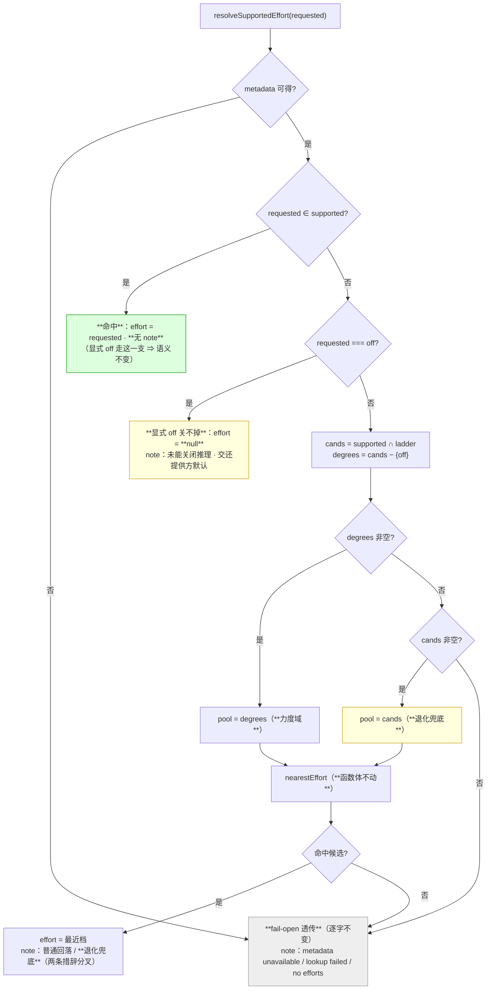
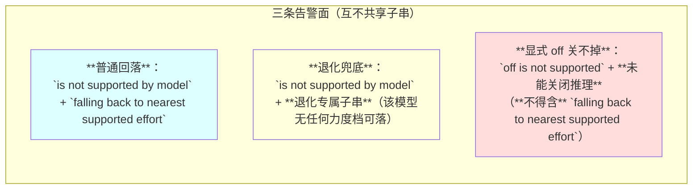
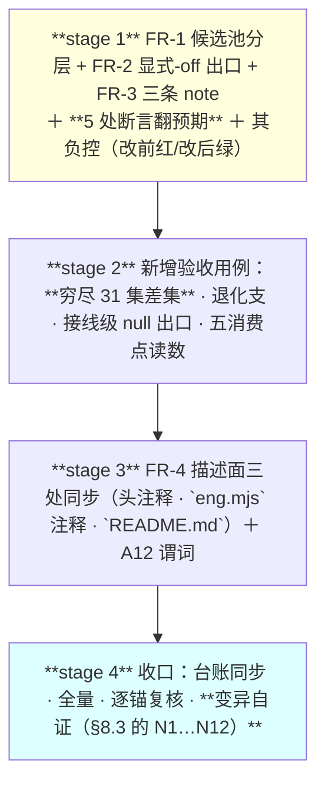

# 设计：effort 回落的开关语义 —— 批 19

- 日期：2026-09-17
- 需求档：[`2026-09-17-effort-off-fallback-requirements.md`](./2026-09-17-effort-off-fallback-requirements.md)（**US-1…US-7** · **N-1…N-8** · §5.1 八项不做 · §5.2 **R-57…R-59**）
- 会诊纪要：[`consult-minutes/2026-09-17-consult-16-minutes.md`](./consult-minutes/2026-09-17-consult-16-minutes.md)（**3/4 交付** · **§3 裁定 D-1…D-6** · **§4 父侧六项回盘核**）
- 章节：按 [`METHODOLOGY.md`](../METHODOLOGY.md)：§设计文档的成文流程与必备章节 **九节**（§1 背景 · §2 问题 · §3 目标 · §4 决策与理由 · §5 方案 · §6 机制伪代码 · §7 状态与 schema · §8 防偏离 · §9 边界）+ **§10 受影响文件与验收** + **§11 变更记录** + **§12 评审落档**
- 图示：**图 1**（候选池分层与三条出口）· **图 2**（三种 note 的分叉点）
- 状态：**设计待评审**

<!-- doc-shape
anchors: 机验锚
acs: 验收标准
-->

> ## ⚠️ 读前必读
>
> **1. ★ 本批改 `lib/**` ⇒ 实施后必须重启 DSH 才生效**（**写进交接页，不擅自重启**——需求档 §5.1 第 8 项）。
>
> **2. ★ 改动差集恒等于 3 组**（父侧穷尽 31 个非空支持集实测算得）：只有 `{off,high}` · `{off,max}` · `{off,high,max}` 三组在 `requested=low` 时改变（`off` → 力度档）；**其余 28 个支持集的 `effort` 值逐字不变**。**★ 读数口径 = `effort` 值面**——`note` 面的变化**单列**（退化集 `{off}` 的**值不变而措辞变**，见 AC-3 / A6）。**这是本批的核心可证性质**（US-4 / N-2）。
>
> **3. ★ 本批抓不到什么，写在前面**（防「宣言写得比机制大」）：**`{off, xhigh}` 这类「开关＋本插件梯子不认识的档」在真实语料上零观测**（R-57）⇒ 退化支的取值**只能由夹具证明**。**逐条见 §9.4 的十一条诚实残差。**
>
> **4. 定位口径**：本档行号仅 as-of；**一切改动按符号 / 字面锚定**。
>
> **5. 自应用陷阱**（批 16 评审 #18 的教训）：**本档里的标记示例全部住行内代码 span 或围栏内**，否则谓词吃自己的示例；**负控必须在仓外临时副本上裸写**。

---

## §1 背景

`lib/effort-resolve.mjs` 的 L1 收口层诞生于 **2026-09-04 的一次生产事故**：`engCoderEffort: low` 对 `glm-5.3-flash`（`reasoningEfforts` 仅 `off/high/max`）不受支持，pi-ai 的 `resolveReasoningLevel` 抛 `UNSUPPORTED_REASONING_EFFORT` ⇒ **子代理首次 LLM 调用即死**。收口层的判据是 **D-裁决-2「最近支持档」**（等距向上取），指导原则是用户原话「**最重要的就是保证真正能用**——绝不因档位校验砖化」。

**而实现把一个类别错误带了进来**：档位梯子是 `off` < `low` < `medium` < `high` < `max`，**`off` 是关闭开关，不是力度档**，而 `nearestEffort` 让它在**同一把距离尺**上参与竞争。后果是**语义级的**：用户要的是「低推理」，拿到的是「**推理全关**」。

批 14（`v0.23.0`）只做了**默认值层面的规避**（`low` → `medium`），并在 **D14-2** 把根修另立批次；批 15 与批 14 的会诊**独立同结论**。本批即那一批。

---

## §2 问题（**带出处与实测量**）

**靶心**：`nearestEffort`（`lib/effort-resolve.mjs:35`）**不区分开关与力度档**。

| # | 问题 | 父侧实测（as-of 2026-09-17） |
|---|---|---|
| **P-1** | **回落落到 `off`**：`off` 在梯子下标 0，等距向上取 ⇒ **它只在严格更近时胜出** ⇒ 触发条件是 `requested = low` ∧ `medium ∉ supported` ∧ `off ∈ supported` | 穷尽 31 个非空支持集：`requested=low` 落 `off` **恰 4 组**（退化集 + `{off,high}` / `{off,max}` / `{off,high,max}`）；`medium` / `high` / `max` 各**仅退化集** 1 组 |
| **P-2** | **显式 `off` 被忽略**（**会诊 [2] 独家发现**）：显式请求 `off` 而模型没有 `off` 时，代码把它**改到力度档** ⇒ **用户要求关推理，却被打开** | `{low,high}` ⇒ `low` · `{medium,high}` ⇒ `medium` · `{max}` ⇒ `max`（均带 note）。`test/codex-runner.test.mjs:921` 的现役断言**逐字钉死了它** |
| **P-3** | **锁面被父侧低估**：交会诊的简报写「3 处」，**实测 5 处** | 仓外副本实施拟议修法 ⇒ `node --test` = **472 pass / 5 fail**，失败**恰为** `:915` · `:921` · `:1002` · `:1119` · `:1175`，**零其他失败** |

**本部署形状**（`profile/settings.yaml`）：20 个模型条目里 **8 个是 `{off,high,max}`**；`profile/profiles/web/cordis.patch.yml` 的 convergence 组是 `glm-5.3-flash` 配 `low`、`engCoderEffort` 也是 `low` ⇒ **恰是中招组合**，今天未中招只因 user 层覆盖成了 `max`/`high`。

---

## §3 目标

| # | 目标 | 验收面 |
|---|---|---|
| **G1** | **回落只在力度域内进行**：`off` 不再参与距离竞争 | AC-1 · AC-2 |
| **G2** | **退化兜底**：支持集里根本没有力度档时，用唯一可执行值并**响亮告知** | AC-3 · AC-4 |
| **G3** | **显式 `off` 的语义如实**：关得掉就关，**关不掉就明说**，不悄悄换档 | AC-5 · AC-6 · AC-7 |
| **G4** | **四机制接线点各自被钉** | AC-8 |
| **G5** | **codex 侧结构性零变化** | AC-9 · AC-10 |
| **G6** | **描述面与实现一致** | AC-11 |
| **G7** | 每条新判据配**负控**与**阴性对照**；台账同批同步 | AC-12 · AC-13 · AC-14 |

### §3.1 非目标（**不做什么**）

| # | 不做 | 理由 |
|---|---|---|
| **1** | **不把 `nearestEffort` 改成带开关语义的函数** | 会诊三家一致：分层做在 **dsh 调用点** ⇒ codex 的零连带是**结构性**的（需求档 §5.1 第 1 项） |
| **2** | **不改 `engCoderEffort` 默认值** | 产品决策，另议（需求档 §5.1 第 3 项） |
| **3** | **不解钉 codex 侧 `off ⇒ null` 的沉默** | 它是无条件改名，不是条件性回落（R-58） |
| **4** | **不做「最小受支持档」备选** | 会诊 [4]-10 的反向论据**登记而不采纳**——理由见 §4 的 **D19-5** |
| **5** | **不修设置面目录不对称** | 批 14 勘察已登记；本批只交叉引用 |
| **6** | **其余不做项见指针**（**设计评审轮 1 #10 的处置**） | 需求档 §5.1 的第 2 项（禁按梯子下标）· 第 6 项（不为 `off` 开 fail-open 特例）· 第 7 项（不动历史批次档）· 第 8 项（不重启 DSH）**各有落点**：**D19-7** / **§9.3 第四行** / **§10.1 的两处例外行** / **AC-14** |

---

## §4 决策与理由

| # | 决策 | 为什么 | 被否决的备选与理由 |
|---|---|---|---|
| **D19-1** | **候选池分层**：`cands = supported ∩ ladder` · `degrees = cands \ {off}` · `pool = degrees` 非空则 `degrees`，否则 `cands` | **把开关逐出距离尺**，而不是给 `off` 加惩罚项（惩罚项是「猜一个权重」，分层是**类别分离**） | **否决「给 `off` 加距离惩罚」**：权重无出处、且对退化集仍要特判；**否决「`off` 不进梯子」**：那样命中检查与 codex 的对照面都没了 |
| **D19-2** | **退化触发条件 = `degrees` 为空且 `cands` 非空** | **唯一的零越界定义**：`{off}` 与 `{off, xhigh}` 都落退化支，**行为与改前逐字相同**（改前它们也落 `off`） | **否决「`nearest` 返回 `null` 即退化」**（会诊 [3] 的诊断）：它会把 `{off, xhigh}` 判成非退化 ⇒ **透传一个已知不被支持的值** ⇒ **引入秒死路径**，且**把差集从 3 组扩大**（**纪要 §3 D-1 的三条理由**） |
| **D19-3** | **显式 `off` 而模型不支持 ⇒ 返回 `effort: null` + 专属 note** | **用户裁定 ②**；与 codex 侧既有 `off ⇒ null` 对称（**值对称**） | **否决「静默 `null`」**（会诊 [2]-3 / [4]-2 坚持项）：本模块自己的公约是「**回落与透传都带 note**」⇒ **对称性只转移值，不转移沉默** |
| **D19-4** | **三种 note 措辞分叉**（普通回落 / 退化兜底 / 显式-`off` 关不掉） | 退化支的**值**与改前相同 ⇒ **只有措辞能证明它被改过**（否则那条断言对新旧实现都绿 = 恒真）。且运维要能一眼区分 | **否决「共用一句 note + 后缀」**：会诊 [2]-3 指出**两侧断言会交叉误绿**（`falling back to` 子串被复用） |
| **D19-5** | **不采纳「最小受支持档」备选**（显式 `off` 关不掉时改落最低力度档） | 用户裁定 ② 已定 `null`；且 `null` 的统一性（两侧规则同形）是裁定的一部分 | **否决理由必须写明（会诊 [4]-10 的坚持项）**：该备选**确有优点**——它用**已验证可用**的值保住成本意图，而 `null` 是**未验证的提供方默认**（对推理强制型模型可能**比 `low` 更贵**）。**不采纳的理由**：① 用户已裁定；② `off ⇒ 省略` 两侧同形，**不为「关不掉」再造第三条规则**；③ 它会把「用户拒绝的推理」变成「按提供方默认买单」。**⇒ 代价如实登记进 §9.4 残差 #5** |
| **D19-6** | **`nearestEffort` 函数体零改动；codex 调用点零改动** | codex 的零连带从「论证出来的零」变成「**结构性的零**」（codex 路径执行的代码一行未变） | **否决「在 `nearestEffort` 内加第 4 个参数 `offRung`」**：能work，但把开关语义**下沉进共享函数**，未来 codex 侧若出现开关类档位会被静默吞掉 |
| **D19-7** | **禁止按梯子下标排除**（如「排除 `ladder[0]`」） | codex 梯子 `[0]` 是 `low` ⇒ 按下标会把 `medium` 对 `{low,xhigh}` 从 `low` 翻成 `xhigh`，**真打穿 codex**（会诊 [2]-4） | 不适用（这是**禁止项**，不是备选） |
| **D19-8** | **描述面同批改写**（`lib/effort-resolve.mjs` 头注释 · `lib/eng.mjs` 常量注释 · `README.md` 的功能表与 `engCoderEffort` 段） | 修复后「`low` 是唯一会被静默落到 `off` 的程度档」**成为假陈述**——**这正是批 14 自己立、而它没做完的那条契约**（**描述面与实现一致**） | **否决「只改代码不改散文」**：那会把一条**假的现状断言**留在用户面前 |

---

## §5 方案（分交付单元 FR-1…FR-4）

### §5.0 图 1：候选池分层与三条出口



**读图要点**：**分层只发生在「未命中」这条干线上**——命中检查（含**显式 `off` 受支持**）**逐字不动**，这是「防顺序陷阱」的结构保证（AC-5 / 阴性对照 M4）。**三种 note 是三条不同的出口**（`HIT` 无 note · `FB` 两条分叉 · `OFFN` 一条专属），**退化与普通回落共用 `nearestEffort` 但告警分叉**。

### §5.0b 图 2：三种 note 的分叉点



**读图要点**：**N2 与 N1 的值相同**（都是最近档，退化集下就是 `off`）⇒ **只有措辞能把它与改前区分开**；**N3 必须与 N1 分叉**，否则两侧断言交叉误绿。

### §5.1 FR-1 候选池分层（**dsh 调用点**）

**做什么**：在 `resolveSupportedEffort` 内、**命中检查与显式-`off` 分支之后**，构造分层后的候选池再交给 `nearestEffort`：

| 量 | 定义 | 说明 |
|---|---|---|
| `cands` | `efforts` 中**在本插件梯子上**的成员 | 不在梯子上的 id（如 `xhigh`）**不参与距离**（既有行为） |
| `degrees` | `cands` 去掉 `DSH_EFFORT_OFF` | **力度域** |
| `pool` | `degrees` 非空 ⇒ `degrees`；否则 ⇒ `cands` | **退化兜底**：`cands` 非空而 `degrees` 空 ⇒ 唯一可执行值是 `off` |
| `degenerate` | `degrees.length === 0 && cands.length > 0` | 只用于**选 note 措辞**，不改返回值 |

**前置**：`requested` 未命中且不等于 `off`。**后置**：`pool ⊆ cands`；`pool` 为空 ⇒ `nearestEffort` 返回 `null` ⇒ 走既有透传。

### §5.2 FR-2 显式 `off` 关不掉 ⇒ 省略 effort

**触发**：`requested === "off"` ∧ `off ∉ efforts`（**元数据可得**）。
**动作**：`console.warn` + 返回 `{ effort: null, note: <专属文案> }`。
**前置**：命中检查**先跑**（`off ∈ efforts` ⇒ 直接返回 `off`，**无 note**）。
**★ 语义（必读）**：`null` **不代表「无推理」**，它代表「**交还提供方默认**」——用户要的是关，实际拿到的是**未验证的默认档**（[3]-5 · §9.4 残差 #5）。

### §5.3 FR-3 三条告警的分叉

| 出口 | 必须含 | 必须**不**含 |
|---|---|---|
| 普通回落 | `is not supported by model` + `falling back to nearest supported effort` | 退化专属子串 |
| 退化兜底 | `is not supported by model` + **退化专属子串** | —— |
| 显式 `off` 关不掉 | `off` + **未能关闭推理** | `falling back to nearest supported effort` |

**退化专属子串**（逐字冻结，供 §8.3 的负控与检测复用）：`退化兜底`

**★ 语言口径（**设计评审轮 1 #8 的处置**：据实声明，防后来者以「统一语言」为名删掉判别子串）**：本模块的 note 判别串**刻意混排**——`is not supported by model` 与 `falling back to nearest supported effort` 是**既有英文**（有现役断言依赖），而**退化专属子串取中文**（`退化兜底`）。**两者都不得被改写**，否则 §8.3 的 **N3** 负控与 **AC-4** 会**同时失去判别力**（退化支的值与改前相同 ⇒ 判别力**全部**在措辞上）。

### §5.4 FR-4 描述面同步（**三处**）

| # | 位置 | 动作 |
|---|---|---|
| **1** | `lib/effort-resolve.mjs` 头注释（回落语义段） | 写清「`off` 不参与距离竞争 · 退化兜底 · 显式 `off` 关不掉 ⇒ 省略」 |
| **2** | `lib/eng.mjs` 的 `ENG_CODER_EFFORT_DEFAULT` 注释 | 「`low` 是唯一会被静默落到 `off` 的程度档」**改归为历史记述 + 指向本批**（**改后该陈述为假**） |
| **3** | `README.md` 的功能表与 `engCoderEffort` 段 | 同上；并把「回落不落 `off`（仅退化兜底）」写进用户可见的契约句 |

---

## §6 机制伪代码（含前置 / 后置条件）

```js
/**
 * FR-1/FR-2：dsh 侧的分层与显式-off 出口（**全部住在调用点**）。
 * @pre   `efforts` 是目标模型的档位集（已映射为 id 字符串并去空）
 * @post  命中检查**先于一切分层**（含显式 off 受支持 ⇒ 原样返回、无 note）
 *        显式 off 而不受支持 ⇒ { effort: null, note: <关不掉专属文案> }（**带 warn**）
 *        其余 ⇒ 分层后的 pool 交给 nearestEffort（后者**函数体零改动**）
 *        ★ 禁按梯子下标排除（codex 梯子 [0] 是 low）——**按名**（DSH_EFFORT_OFF）
 */
function resolveDshPool(requested, efforts) { /* HIT → OFF_UNSUPPORTED → cands/degrees/pool */ }

/**
 * FR-2：退化判定。
 * @pre   仅当 degrees 为空时询问
 * @post  true ⟺ cands 非空 —— `{off}` 与 `{off, xhigh}` **都**为 true
 *        ★ 判据是「**在插件梯子上，除 off 外无候选**」，**不是**「nearest 返回 null」
 *          （后者会把 `{off, xhigh}` 判成非退化 ⇒ 透传一个已知不被支持的值 ⇒ 秒死路径）
 */
function isDegenerate(cands, degrees) { /* degrees.length === 0 && cands.length > 0 */ }

/**
 * FR-3：note 的分叉合成（**三条出口互不共享判别子串**）。
 * @pre   kind ∈ { "fallback", "degenerate", "off-unsupported" }
 * @post  三条文案互不共享判别子串；退化支**不得**复用 `falling back to nearest supported effort`
 */
function effortNote(kind, requested, model, efforts, chosen) { /* ... */ }

/**
 * nearestEffort(requested, ladder, supported) —— **签名与函数体逐字不变**（D19-6 / AC-9）。
 * 它仍是纯距离函数；**开关语义不进它**。
 */
```

---

## §7 状态与 schema（**谁写谁读**）

**本批不新增任何持久化状态、不改任何运行时 schema、不加任何配置键。**

| 面 | 本批的动作 | 谁写 | 谁读 |
|---|---|---|---|
| `resolveSupportedEffort` 的**返回值** | `effort` 的取值域**不变**（字符串或 `null`）；`note` 的**措辞族**由两种增为三种 | 本函数 | 五个 dsh 消费点（`advisor` 主路径 / `advisor` 回落轮 / `consult` dsh 行 / `escalate` dsh 行 / `eng_coder` dsh 分支） |
| **配置键** | **无新增**（`EFFORT_LEVELS` 含 `off`，**显式 `off` 仍是合法配置入口**） | 用户 | 配置校验链 |
| `test/codex-runner.test.mjs` | 5 处断言翻预期 + 新增用例 | eng_coder（任务书指名） | `node --test` |
| `docs/test-lifecycle.md` §三/§七 | 用例数同步（`T-LC2`） | **主代理定内容、eng_coder 落笔**（D1 任务书指名例外） | `test-lifecycle.test.mjs` |

> **★ 一处「谁读」的关键变化**：**`note` 从「一条判别子串」变成「三条互斥措辞」** ⇒ 任何 `includes("falling back to nearest supported effort")` 的既有断言**只在普通回落支成立**；**退化支与显式-`off` 支不得命中它**（这既是 D19-4 的要求，也是两侧断言不交叉误绿的前提）。

---

## §8 防偏离

### §8.1 零改面

| # | 面 | 判据 |
|---|---|---|
| 1 | `release-check.mjs` | `git diff --numstat` 为空 |
| 2 | `test/release-check.test.mjs` | 同上 |
| 3 | `test/fixtures/**` | 同上 |
| 4 | **基线 10 档** | 除本批写域外零 diff |
| 5 | **不新增测试档** | `test/*.test.mjs` 档数不变（**20**，**as-of 批 19**；该数的权威自报点在台账 §三，由 **A13** 的等值锁钉住） |
| 6 | 零 `test.skip` / `test.only` | 既有 `G-常驻1` 锁 |
| 7 | `failStop(` 恒 18（`lib/**`）· 六串零命中（`lib/**`） | 既有锁 |
| 8 | 零新依赖 | `package.json` 依赖键集合不变 |
| 9 | **`nearestEffort` 函数体与 codex 调用点零 diff** | `git diff --numstat -- lib/effort-resolve.mjs` 的删改行**不得落在**这两处 |
| 10 | **`test/codex-runner.test.mjs` 的 diff 只落 5 处翻预期 + 新增用例** | 逐 hunk 复核（`git diff -U0`） |

### §8.2 机验锚（**三要素写全：检索目标 / 谓词 / 期望**）

| 锚 | 检索目标 | 谓词 | 期望 |
|---|---|---|---|
| **A1** | `lib/effort-resolve.mjs` | `DSH_EFFORT_OFF` 的定义与用法 | **定义恰 1 处**；候选池过滤**按名**（`!== DSH_EFFORT_OFF`）；**无按下标的形式**（`ladder[0]` / `indexOf(…) === 0` 零命中） |
| **A2** | 同上 | `nearestEffort` 的函数签名与函数体 | **与改前逐字相同**（无第 4 参）；**函数体内 `off` 字面零出现**。**★ 口径订正（父侧自审 F1 · 交付代码评审轮 1 复核）**：**本批未加常设源码级锁** ⇒ 该条实为**一次性逐字节核验**（父侧：函数体 464 字节 · sha256 `c14714a9d601d0e839e98515343224763c42235d6ce7cb12e1e849271fe57f64`）**＋ 行为面兜底**（负控 N7：把 `off` 塞进共享函数 ⇒ codex 断言族红），**不是「机验锚」** |
| **A3** | 同上 | codex 调用点 | `nearestEffort(requested, CODEX_EFFORT_LADDER, efforts)` **逐字不变**——**同上口径订正**：一次性核验 ＋ 行为面兜底，**无常设锁** |
| **A4** | 同上 | 显式 `off` 分支 | 存在早退分支：`requested === DSH_EFFORT_OFF` ⇒ 返回 `effort: null` + **非空 note** + `WARN` |
| **A5** | `test/codex-runner.test.mjs` | 穷尽差集 | 存在断言：**31 个非空支持集**跑完 ⇒ **`effort` 值**与改前**只在 3 组上不同**，且**逐组点名**；**`note` 面另计**（退化集的值不变、措辞变 ⇒ 由 A6 单独钉） |
| **A6** | 同上 | 退化兜底 | 存在断言：`{off}` 下**五种请求全落 `off`**，且 note 命中**退化专属子串** |
| **A7** | 同上 | 措辞分叉 | 存在断言：退化支的 note **不含** `falling back to nearest supported effort` |
| **A8** | 同上 | 显式 `off` 关不掉 | 存在断言：`{low,high}` 配 `off` ⇒ `effort === null` 且 note 非空且**不含** `falling back to nearest supported effort` |
| **A9** | 同上 | 接线级 `null` 出口 | 存在断言：`!("reasoningEffort" in agentOptions)` **且** `provider` / `model` 仍在 |
| **A10** | 同上 | **五个 dsh 消费点** | `advisor` 主路径 / `advisor` 智能回落轮 / `consult` dsh 行 / `escalate` dsh 行 / `eng` dsh 分支 —— **各有一条**读数断言 |
| **A11** | 同上 | 负控与阴性对照 | 存在 §8.3 **负控 12 条**与**阴性对照 8 条**的构造；负控**全部在仓外临时副本 / 内存夹具**上做 |
| **A12** | `README.md` · `lib/eng.mjs` | 陈旧现状陈述 | 「`low` 是唯一……静默落到 `off` 的程度档」**零命中**（作为**现状断言**；作为**历史记述**须带 as-of） |
| **A13** | `docs/test-lifecycle.md` | `T-LC2` 等值锁 | §三 `codex-runner.test.mjs` 的用例数 **== fs 实测的顶层 `test(` 数** |
| **A14** | `test/codex-runner.test.mjs` | **fail-open 透传族** | **★ 口径订正（交付代码评审轮 1 #1 ＋ 父侧自审 F2——原写「四种形态各有一条断言」与实况不符）**：实测**独立可定位的只有 2 个形态**——`resolveModelInfo` **非函数**（`test/codex-runner.test.mjs:930`）与**查表抛错**（`:934-938`）；**「llm 缺失」与「非函数」共用同一 `effort metadata unavailable` 前缀**（断言在 `:933`，**两者不可区分**）；**「`efforts` 为空」（源码分支 `lib/effort-resolve.mjs:100`，note `no reasoning-effort metadata`）零命中**；**「与梯子无交集」（`:134`，note `cannot be mapped`）零命中**（后者即 **M8**）。**fail-open 代码路径本身逐字未动（`passthrough` 分支结构完好）⇒ 无行为风险，是举证声明超出实况** |

### §8.3 负控与阴性对照（**每条新判据与每条保守约束各一条**）

> **做法**：负控**全部在仓外临时副本 / 内存夹具上构造**（D5：仓内零残留），做完即弃；**且必须区分真红与假红**——断言级红 = 真红，`ReferenceError` / 整档崩溃 = 假红。
> **★ 父侧已先做两条**：仓外副本上「撤掉分层 ⇒ 差集从 3 组变回 4 组」（**负控 N1 的形态**）与「整仓跑全量 ⇒ 恰 5 条断言红」（**§2 的 P-3**）。

| # | 判据 / 约束 | 负控构造 | 必须红在哪 |
|---|---|---|---|
| **N1** | 差集恒等于 3 组 | 撤掉候选池分层（`pool = efforts`） | **差集断言**（实测回 4 组） |
| **N2** | 退化兜底落 `off` | 把退化支改成返回 `null` | **退化断言的值面** |
| **N3** | 退化 note 与普通回落分叉 | 让退化支**复用**普通回落文案 | **措辞分叉断言**（**值同、只有措辞能红**） |
| **N4** | 显式 `off` 关不掉 ⇒ `null` | 删掉该早退分支 | **A8 断言**（值红：落回力度档） |
| **N5** | 接线级 `null` 出口 | 把消费点的 `effort ?? undefined` 改成**无条件展开** | **键存在性断言**（`reasoningEffort` 键出现） |
| **N6** | 显式 `off` **受支持** ⇒ 保持 `off` 且无 note | 把分层**提到命中检查之前** | **该断言**（顺序陷阱） |
| **N7** | codex 侧结构性零 | 把 `off` **硬编码进** `nearestEffort` 并按下标排除 | **codex 既有断言**（`medium` 对 `{low,xhigh}` 翻档） |
| **N8** | fail-open 透传逐字不变 | 把 passthrough 改成返回 `null` | **既有透传断言** |
| **N9** | DP-2 等距向上（力度域内） | 把 tie-break 改成**向下取** | **`medium` 对 `{low,high}` 断言** |
| **N10** | 描述面陈旧陈述零命中 | 把 README 那句原文放回（临时副本） | **A12 谓词** |
| **N11** | 台账等值锁 | 把台账 §三 该行的用例数改一个数 | **`T-LC2`**（既有闸，不需新造） |
| **N12** | 零改面 | 临时改 `release-check.mjs` 一个字节 | **§8.1 第 1 行的 numstat 判据** |

| # | 阴性对照（**零编辑必须仍绿**） | 它证明什么 |
|---|---|---|
| **M1** | `medium` 对 `{low,high}` ⇒ `high`（DP-2 等距向上） | **距离语义未被改动** |
| **M2** | `high` 对 `{off,low}` ⇒ `low`（非等距最近） | **只排除了 `off`，没动别的候选** |
| **M3** | `high` 对 `{off,high,max}` ⇒ `high` 且 note 为空 | **命中快路径不受影响** |
| **M4** | `off` 对 `{off,high}` ⇒ `off` 且 note 为空 | **顺序陷阱的守卫**（分层必须在命中检查之后） |
| **M5** | 元数据不可得（四种形态）⇒ 透传 + 告警 | **fail-open 族零回归** |
| **M6** | codex 全家族（resolver + consult / escalate / eng / advisor 四接线）**零编辑仍绿** | **结构性零连带** |
| **M7** | `medium` 对 `{off,high}` ⇒ `high` | **`off` 本来就输的局面，排除后同值** |
| **M8** | 与梯子无交集（如 `{xhigh}`）⇒ 既有透传 | **非退化路径未被改道**（**★ 口径订正（评审 #1）：该形态在 `test/**` 内零命中 ⇒ 本行「无既有断言可引用，仅设计意图」**） |

---

## §9 边界（**逐条登记，不留给评审去发现**）

### §9.1 六类边界

| 类 | 本批必须定义的行为 | 方向 |
|---|---|---|
| **空集** | `cands` 为空（与梯子无交集）⇒ **既有透传**；`efforts` 为空数组 / 无 `reasoning.efforts` ⇒ **既有透传**；`degrees` 空而 `cands` 非空 ⇒ **退化只兜。三者的返回值各有断言** | **fail-open**（既有原则）· 退化支**带响亮告警** |
| **畸形输入** | `requested` 为空串 / `undefined` ⇒ **早退**（`:66`，逐字不变）；`requested` 不在梯子上 ⇒ `nearestEffort` 返回 `null` ⇒ **透传**；`efforts` 含非字符串项 ⇒ 既有映射已滤 | **fail-open** |
| **并发** | 不适用（本函数是纯解析，无共享状态） | —— |
| **重启** | **★ 适用**：本批改 `lib/**` ⇒ **未重启不生效**（US-6 / AC-14） | —— |
| **升级** | **零配置键变更**：`off` 仍是合法显式值；旧配置（含 `low`）**语义变更的只有那 3 组形状** | 旧值不失效 |
| **失败方向** | **回落面 fail-open（绝不砖化）**；**退化面 fail-loud（必带专属告警）**；**显式 `off` 面 fail-visible（关不掉必须说）** | 见左 |

### §9.2 ★ 会诊提出的六个精度点（**逐条登记处置**）

| # | 点 | 处置 |
|---|---|---|
| **1** | **锁面 5 处不是 3 处**（[2]-2 / [3]-1 / [4]-1） | **已采纳**：§2 的 P-3 与 AC 面按 **5 处**计；**父侧简报的旧值是错的**（纪要 §4-1） |
| **2** | **`{off, xhigh}` 的归宿**（[3]-10 vs [4]-3 正面分歧） | **父侧裁定取 `off`**（**D19-2**），三条可测理由见纪要 §3 D-1 |
| **3** | **`null` 出口缺接线级钉**（[3]-3） | **已采纳**：AC-7 / A9 / 负控 N5 |
| **4** | **`off⇒null` 必须带 note**（[2]-3 / [4]-2） | **已采纳**：D19-3 / FR-3 / AC-6 |
| **5** | **退化分支必须是「cands 非空而 degrees 空」**（[3]-2 / [4]-3） | **已采纳**：D19-2 / FR-1 / 伪代码 |
| **6** | **设置面目录不对称被新 note 放大**（[4]-8） | **只交叉引用**（需求档 §5.1 第 5 项）；登记进残差 #4 |

### §9.3 ★ 归一化 / 语义的失败形态（**哪类真缺陷会被放过**）

| 面 | 放过的真缺陷 | 定性 |
|---|---|---|
| **D19-1 分层** | **`{off, xhigh}` 这类「开关 + 不可映射档」上的「本该落到那个不可映射档」** —— 本批明说：那种档**本插件无法表达**，落 `off` 是**保守**而非正确 | **显式选择**（R-57） |
| **D19-3 `null`** | **提供方默认可能比用户预期更贵**（对推理强制型模型） | **用户裁定 ② 的代价**，登记为残差 #5 |
| **D19-4 措辞分叉** | **退化支与普通回落支若将来被人合并文案**，则退化支的断言**退化为恒真** | **靠 A6 / A7 两条反向锁兜**（§8.3 N3） |
| **既有 fail-open** | **元数据不可得时显式 `off` 仍原样透传** ⇒ 若模型实际不支持则秒死 | **既有原则的推论**（需求档 §5.1 第 6 项） |

### §9.4 ★ 诚实残差清单（**本批抓不到什么——不许把宣言写得比机制大**）

| # | 抓不到 / 不修 | 理由 |
|---|---|---|
| **1** | **`{off, xhigh}` 形状的真实取值** | 本部署 20 个模型条目**零观测**（R-57）⇒ 只能由夹具证明 |
| **2** | **codex 侧 `off ⇒ null` 的沉默** | 无条件改名，不是条件性回落（R-58） |
| **3** | **元数据不可得时显式 `off` 的透传** | 无法判定支持与否 ⇒ 与所有档一视同仁（既有原则） |
| **4** | **设置页目录不显示 `off`** | `lib/index.mjs` 的 `effortsOf` 滤 null 值（批 14 勘察已登记）；本批只交叉引用 |
| **5** | **显式 `off` 关不掉时给出的是未验证的提供方默认** | 用户裁定 ② 的代价；**「最小受支持档」备选已被否决，理由见 D19-5** |
| **6** | **`eng.mjs` 的 `!== null` 与其余三处 truthiness 不同源** | 今天等价；契约一变即铺 `reasoningEffort: undefined`（R-59） |
| **7** | **历史批次档保留旧陈述** | `docs/2026-09-15-*` 与 `METHODOLOGY.md` 的批 14 行是 **as-of 记述**（W3）；**唯一例外**见纪要 §3 D-5 |
| **8** | **未来的新 dsh 调用点若忘记分层，会退回旧行为** | `nearestEffort` 仍是**纯距离函数**（D19-6）⇒ 开关语义住在**调用点**。本批没有「新增调用点必须分层」的机械闸，**只有 A1 / A3 两条谓词与逐字锁兜** |
| **9** | **`console.warn` 在 DSH 宿主日志里的可见性** | 需求档 §5.3 第 3 项（**设计评审轮 1 #10 ① 的处置**）；宿主日志面**不可在本仓内生验证**（批 14 §5.1 同款先例） |
| **10** | **A2/A3 无常设源码级锁**（父侧自审 **F1**） | 「`nearestEffort` 函数体与 codex 调用点逐字不变」本批只由**一次性逐字节核验**（父侧）+ **行为面兜底**（负控 N7）保证；**将来有人给该函数加参数或把 `off` 写进去，套件不会红**（只有行为真被改变时才会）⇒ **补一条源码级静态锁**（先例形态：`test/config-api.test.mjs:331`）**登记为后续候选** |
| **11** | **fail-open 面的机检缺口**（评审 #1 ＋ 父侧自审 **F2**） | `A14` 的四形态**只有 2 个可独立定位**；「llm 缺失」与「非函数」共用一个前缀断言（不可区分）·**「`efforts` 为空」与「与梯子无交集」（M8）在 `test/**` 内零命中** ⇒ **fail-open 面比设计声明的薄**。**代码路径逐字未动、无行为风险**；缺口在**举证面**。补两条用例登记为后续候选 |

### §9.5 威胁模型

**★ 漂移，不是对抗。** 对抗者可以改测试、可以改谓词。**⇒ 本批的全部机制针对「无意漏改」**；**「新调用点忘记分层」这条结构性边界已登记为残差 #8**，不假装防住。

---

## §10 受影响文件与验收

### §10.1 实施域

| 文件 | 改动 | 类型 |
|---|---|---|
| `lib/effort-resolve.mjs` | **FR-1 / FR-2 / FR-3** + 头注释（FR-4 第 1 处） | **修改（核心）** |
| `lib/eng.mjs` | **仅常量注释**（FR-4 第 2 处，`ENG_CODER_EFFORT_DEFAULT` 上方） | 修改（注释级） |
| `test/codex-runner.test.mjs` | **5 处断言翻预期** + **新增用例**（差集 · 退化 · 显式-off · 接线级 null · 五消费点读数） | **修改（任务书指名）** |
| `README.md` | **仅功能表那一行 + `engCoderEffort` 段**（FR-4 第 3 处） | 修改（散文级） |
| `docs/test-lifecycle.md` | §三 / §七 计数同步（`T-LC2`） | 修改（**主代理定内容**） |
| `CHANGELOG.md` | 本批条目（**仅新增**） | 修改（**主代理**） |
| `docs/2026-09-15-config-surface-design.md` | **仅 §10 偏离表的 `nearestEffort` 行「证据」格**（add-only · 纪要 §3 D-5） | 修改（**主代理**） |
| `docs/2026-09-17-scope-alignment-design.md` | **仅 §11 批 17 实施行的两处对等值**（`b17-全量用例数` / `b17-用例增量`）——**凡新计数行落地必撞这两处**（批 18 实施期实测） | 修改（**主代理 · 与改 CHANGELOG 计数行同一次编辑**） |
| `docs/2026-09-13-handoff.md` | **仅追加「需重启」一句**（AC-14 / US-6） | 修改（**主代理**） |
| `docs/README.md` | **本批两档的登记行**（**已在建档时办**，收口仅核验——**不在 eng_coder 写域**） | 修改（**主代理**） |

> **★ 写域与需求档的一致性（设计评审轮 1 #3 的处置）**：**两处历史档例外**（`2026-09-15-config-surface-design.md` §10 的证据格 · `2026-09-17-scope-alignment-design.md` §11 的两处对等值）**都已在需求档 §5.1 第 7 项登记**，理由与批 18 的实测出处同处可见 ⇒ **本批写域不超出需求授权面**。

**★ EOL 逐档实测表（as-of 2026-09-17，父侧逐档字节读；`core.autocrlf = false`）**——**改前必须按本表，不得按目录假设**：

| 文件 | EOL | 后果（若按错） |
|---|---|---|
| `lib/effort-resolve.mjs` | **LF** | — |
| `lib/eng.mjs` | **LF** | — |
| `README.md` | **CRLF** | 用 LF 写会重写整档 |
| `test/codex-runner.test.mjs` | **CRLF** | **本批改动最多的一档** ⇒ 用 LF 写 = 整档 4697 行 diff |
| `docs/test-lifecycle.md` | **LF** | — |
| `docs/2026-09-13-handoff.md` | **CRLF** | 仅追加一句 ⇒ 用 LF 写会重写整档 |
| `docs/2026-09-15-config-surface-design.md` | **LF** | — |
| `docs/2026-09-17-scope-alignment-design.md` | **LF** | — |
| `CHANGELOG.md` | **CRLF** | 新增条目 ⇒ 用 LF 写会重写整档 |

> **★ 全仓 EOL 分布（同一时点）**：`docs/*.md` **60 LF / 2 CRLF**（CRLF 的是 `2026-09-05-defect-registry.md` 与 `2026-09-13-handoff.md`）· `test/**` **19 LF / 4 CRLF**（CRLF 的是 `codex-runner` · `consult` · `death-provenance` · `preset-static`）· `lib/**` **11 LF / 19 CRLF**。**⇒ 夜班计划 §3 陷阱 12 的「docs/** 与 test/**、lib/** 各自同 EOL」两半都过宽，已带日期订正**。
| **明确排除（禁改）** | `release-check.mjs` · `test/release-check.test.mjs` · `test/fixtures/**` · **基线 10 档** · 平台包 · `docs/consult-minutes/**` · **`nearestEffort` 函数体** · **codex 调用点** · 存量 `docs/**`（例外仅上表） | 零改动 |

### §10.2 可验性分层登记

| 标 | 含义 | 本批 AC |
|---|---|---|
| **T1** | 进程内 `node --test` 可证 | AC-1…AC-8 · AC-10 · AC-13 |
| **T2** | 静态谓词 / 逐字可查 | AC-9 · AC-11 · AC-12 |
| **T3** | 仅重启后人工核验 | AC-14 |

### §10.3 验收标准

| # | 验收标准 | 层 | 锚 | US |
|---|---|---|---|---|
| **AC-1** | `low` 对 `{off,high,max}` ⇒ **`high`**（真实中招形状）；且分层**按名**、`nearestEffort` 为零改动路径 | T1 | A1 · A5 | US-1 |
| **AC-2** | **穷尽 31 集** ⇒ **`effort` 值**与改前**只在 3 组上不同**，且**逐组点名**（**读数口径 = 值面**；`note` 面的变化按 AC-3 / AC-4 单列） | T1 | A5 | US-4 |
| **AC-3** | 退化集 `{off}` 下**五种请求全落 `off`**（**★ 评审 #2 订正：除 `requested=off` 命中快路径、其 note 为空外**——M4 顺序陷阱守卫的必然推论；测试 `:984-989` 已按此分支断言），且其余四请求的 note 命中**退化专属子串** | T1 | A6 | US-3 |
| **AC-4** | 三条 note **措辞分叉**：退化支**不含**普通回落句；显式-`off` 支**不含**普回落句 | T1 | A7 | US-3 |
| **AC-5** | 显式 `off` **受支持** ⇒ `off`、note 为**空**（**顺序陷阱的守卫**） | T1 | A8 | US-2 |
| **AC-6** | 显式 `off` **不被支持** ⇒ `effort === null` + **非空专属 note** + `WARN` | T1 | A4 · A8 | US-2 |
| **AC-7** | **接线级**：`null` ⇒ `reasoningEffort` **键缺席**，且 `provider` / `model` 仍在 | T1 | A9 | US-2 |
| **AC-8** | **五个 dsh 消费点**（advisor 主路径 / advisor 智能回落轮 / consult / escalate / eng）**各有一条**读数断言 | T1 | A10 | US-7 |
| **AC-9** | **codex 侧结构性零**：`nearestEffort` 签名与函数体**逐字不变**、codex 调用点**逐字不变** | T2 | A2 · A3 | US-4 |
| **AC-10** | 元数据不可得 ⇒ **fail-open 透传逐字不变**（**★ 评审 #1 / F2 订正：本批机检只覆盖 2 个形态——非函数 · 查表抛错；另 2 个（llm 缺失 · `efforts` 为空）与「无交集透传」未覆盖**，见 A14） | T1 | A14 | US-4 |
| **AC-11** | 描述面：陈旧**现状陈述**零命中（历史记述须带 as-of） | T2 | A12 | US-5 |
| **AC-12** | 台账 §三 / §七 同批同步（`T-LC2` 等值锁成立） | T2 | A13 | US-4 |
| **AC-13** | 每条新判据配**负控**与**阴性对照**（**负控 12 条 / 阴性对照 8 条**）；负控**全部在仓外**做、仓内零残留 | T1 | A11 | US-4 |
| **AC-14** | **重启事项写进交接页**（本批改 `lib/**` ⇒ 需重启才生效） | T3 | — | US-6 |

### §10.4 建议 stages（**四段串行**）



| stage | goal | 文件 | 检查 |
|---|---|---|---|
| **1** | FR-1 + FR-2 + FR-3 + 5 处翻预期 + 两条负控（改前红 / 改后绿） | `lib/effort-resolve.mjs` · `test/codex-runner.test.mjs` | `node --test test/codex-runner.test.mjs` |
| **2** | 新增用例（差集 · 退化 · 显式-off · 接线级 null · 五个消费点） | `test/codex-runner.test.mjs` | 同上 |
| **3** | FR-4 描述面三处 + A12 谓词自证 | `README.md` · `lib/eng.mjs` | `node --test` |
| **4** | 台账同步 · 全量 · 逐锚复核 · 变异自证 | 全部 | `node --test` |

---

## §11 变更记录

| 日期 | 变更 |
|---|---|
| 2026-09-17 | 首版（设计待评审）：九节 + §10 验收；**D19-1…D19-8**；**US-1…US-7**；**AC-1…AC-14**（逐条打层标）；**锚 A1…A14 写全三要素**；**负控 12 条 + 阴性对照 8 条**；**图 1 / 图 2**；§10.4 **四段串行**。**★ 语义底座 = 用户两条裁定**（需求档 §1.1）· **会诊 [3]-10 与 [4]-3 的正面分歧由父侧裁定为 D19-2**（取 `off`，三条可测理由）· **§9 逐条登记**：六类边界 + **会诊六个精度点** + 四条语义失败形态 + **九条诚实残差** + 威胁模型。**★ 交付代码评审轮 1（`advisor-dsh-2`，`VERDICT: PASS`，🔴0 · 🟡2 · 🔵1）3 条全 Fixed；父侧自审 F1/F2/F3 同批折入** ⇒ **残差 九 → 十一**（新增 #10 A2/A3 无常设锁 · #11 fail-open 面机检缺口）、**A14/M8/AC-3/AC-10 四处口径按实况收窄**、`§12.2–§12.4` 落档。 |
| 2026-09-17 | **★ 设计评审轮次 1 落档（`advisor type='design'`，`VERDICT: PASS`，🔴0 · 🟡5 · 🔵5）——10 条全 Fixed**（**无 🔴 ⇒ 不阻塞批准**，落档见 **§12.1**）：**#1 读数口径未定义**（「其余 28 集逐字不变」按全信封读为假，按值面读为真）⇒ 档头 / A5 / AC-2 三处显式声明 **口径 = `effort` 值面**，`note` 面单列；**#2 `D19-x` 双命名空间**（本档 §4 的 `D19-1…D19-8` 与会诊纪要 §3 的六条**同前缀异内容**）⇒ **按时序惯例把纪要侧的六条改名为 `D-1…D-6`**（**批 14 先例：纪要 `D-n` / 设计 `D<批次>-n`**），两档的纪要指针同步 9 处；**#3 写域超需求** ⇒ 需求档 §5.1 第 7 项补登**第二处历史档例外**（含批 18 实测出处）；**#4 五个 dsh 消费点只钉四个**（漏 advisor 智能回落轮）⇒ A10 / AC-8 改为**五个消费点逐一**；**#5 AC-14 在 §10.1 无落点** ⇒ 补 `docs/2026-09-13-handoff.md` 一行（**主代理**，仅追加一句）；**#6 裸计数无 as-of** ⇒ §8.1 第 5 行补 **as-of 批 19** + 指向台账权威自报点；**#7 AC-10 的锚指向 A11 与真实证据面不符** ⇒ **新增锚 A14**（fail-open 透传族四形态）并把 AC-10 改指它；**#8 note 语言混排** ⇒ FR-3 补**语言口径声明**（判别子串不得被「统一语言」删掉）；**#9 两档登记** ⇒ 建档时已办，§10.1 记为**主代理**动作；**#10 两处映射缺口** ⇒ §9.4 补残差第 9 条（`console.warn` 可见性）、§3.1 补**不做项指针行**。**★ 计数同批同改**：锚 **13 → 14**、残差 **8 → 9**（本行与 §8.2 / §9.4 / `docs/README.md` 四处同一次编辑）。 |

---

## §12 评审落档

### §12.1 设计评审落档（**轮 1 = PASS**）

| 轮 | 结论 | 处置 |
|---|---|---|
| **1** | **`VERDICT: PASS`**（🔴0 · 🟡5 · 🔵5） | **10 条全 Fixed**（逐条处置见 §11 的第 2 行；**无 🔴 ⇒ 不阻塞批准**）。**评审正评**：「九章节齐备、两张 mermaid 图齐备、**US-1…US-7 与 N-1…N-8 逐条有落点**、计数自洽、**两条用户裁定被 FR-1/FR-2 忠实承载且未自行扩大**、穷举口径（31 个非空集）与差集在**独立复算下内部自洽**」 |

- **design token**：`e5e81eff-100f-4c58-af47-6d0627eac06d` : `1790235497070`（**签发于 2026-09-17** · 有效至 **2026-09-24**；**逐字经 `designToken` 参数传给 `eng_coder`，不写进任务书文本**）
- **★ 折入与 token 的时序（如实登记）**：上表 10 条 Fixed **发生在 token 签发之后** ⇒ **受审内容与实施内容存在一轮差量**。**这不是隐瞒**：本仓惯例（批 10「九条全修」· 批 12「轮 1 即 PASS」）是 **PASS + advisory ⇒ 折入 ⇒ 实施**；而 `docHash` 的用途是**续期门控**（D-30：文档变了即拒绝续期），**不进写门禁判据**（D10-14）。**⇒ 本批按该惯例实施，差量逐条可核（§11 第 2 行）。**
- **交付核验 / 分歧审计 / 交付代码评审**：见 **§12.2 / §12.4 / §12.3**（均已落档）。

### §12.2 交付核验落档（**从盘上逐点测量，不采信任何报告**）

**交付方式**：**`eng_coder` 在 `dshBackgroundTimeoutMs=1800s` 兜底被硬中断、零报告**（**本仓第二次**；批 14 同形）⇒ **父侧不重派实施，改为「审计即验证」**（批 14 先例）。

| # | 核验项 | 实测（as-of 2026-09-17） |
|---|---|---|
| **1** | 全量 `node --test` | **485 / 485 · 0 fail · 0 skipped**（基线 477 + 本批 8） |
| **2** | 顶层 `test(` 数 | `test/codex-runner.test.mjs` **177 → 185**（fs 实测；台账 §三 **同值** ⇒ `T-LC2` 成立） |
| **3** | ★ **负控复现**（仓外副本，`lib/effort-resolve.mjs` 退回 HEAD） | **472 pass / 13 fail**，失败**恰为 5 处翻预期 + 8 条新用例**，**零其他失败** ⇒ 每条新断言都「**在旧实现下必红**」 |
| **4** | ★ **`nearestEffort` 函数体**（HEAD vs 工作树） | **逐字节相同**（464 字节 · sha256 `c14714a9d601d0e839e98515343224763c42235d6ce7cb12e1e849271fe57f64`）；**codex 调用点逐字未动** |
| **5** | 零改面 | `release-check.mjs` · `test/release-check.test.mjs` · `test/fixtures/**` 逐档 `--numstat` **空**；`lib/**` 六串零命中 · `failStop(` 恒 18 |
| **6** | 实质 diff（**`--ignore-cr-at-eol`**） | `lib/effort-resolve.mjs` **41** · `lib/eng.mjs` **11**（仅注释） · `test/codex-runner.test.mjs` **240** · `docs/test-lifecycle.md` **3** · `README.md` **4** |
| **7** | AC-11 逐字核验 | `README.md` 功能表段已改 as-of 形态 · `lib/eng.mjs` 改「**曾是**唯一…」 · `lib/effort-resolve.mjs` **零命中**；余下两处是**版本历史表**与**历史记述**（W1/W3 允许） |
| **8** | 写域 | `git status --porcelain` 的档全部在 §10.1 表内 ＋ **父侧文档动作**（`docs/NIGHT-SHIFT-PLAN.md` 的两处订正 · `docs/README.md` 的登记行 · `docs/consult-minutes/2026-09-17-consult-17-minutes.md`） |
| **9** | EOL | **无整档翻转**：`test/codex-runner.test.mjs` 与 `README.md` 的工作树 CRLF 是**本机 checkout 的既有状态**（与**未触碰的对照档** `lib/index.mjs` / `test/consult.test.mjs` **同形** `i/lf w/crlf`）⇒ **不是本次引入**（父侧先误判为「实施者翻转 EOL」，由 `git ls-files --eol` 与对照档当场推翻） |

**★ 两处发布前必查（都由仓外干跑逮到、未进仓）**：**①** 本机 `core.autocrlf` **全局 true / 仓内 false** 而 blob 是 LF ⇒ **直接 `git add` 会带 6400+ 行 CR 幻影**，并把 `README.md` 与 `test/codex-runner.test.mjs` 的 blob **永久翻成 CRLF**；**解法 = `git -c core.autocrlf=true`**（实测 **9618 → 240** 与 **782 → 4**，提交后 blob **仍为 LF**）——**已在仓外副本端到端干跑：收口三处 → 全量 485/485 → 提交 → 发布门 G0–G6 6/6 绿**。**②** 提交消息文件写在**仓内**会被一起提交 ⇒ 必须放**仓外**。

### §12.3 交付代码评审落档（**`advisor type='code'` · 轮 1 = PASS**）

**送审面**：`lib/effort-resolve.mjs` · `lib/eng.mjs` · `test/codex-runner.test.mjs` · `README.md` · `docs/test-lifecycle.md`；文档面 = 本档 + 需求档 + `consult #16` 纪要。**job = `advisor-dsh-2`**。

**★ 会话级配置动作（如实登记）**：派发前把 `round1.timeoutMs` 由 **900000 提到 2400000**（**仅本会话覆盖，未动用户全局配置**）——依据是批 10 的先例（首次 900s 超时、上调至 2400s 后通过）。

**★ 时序如实登记**：**本评审与分歧审计并行在飞**（审计子代理先被中断，见 §12.4）⇒ **评审看到的是同一份字节**（审计只读、不改仓）⇒ 不构成「被审对象在途变更」。

**裁定**：**`VERDICT: PASS`（🔴0 · 🟡2 · 🔵1）**。评审正评：两条用户裁定被 FR-1/FR-2 **忠实承载且未自行扩大或收紧**；差集恒等于 3 组有穷尽机证；codex 侧为**结构性零**；五消费点接线各有**键缺席级**断言；三条措辞**互斥分叉且有反向锁**；台账计数同批同步。

| # | Action | Detail |
|---|---|---|
| **1** | **Fixed** | **A14/M8 的举证声明超出实况**（评审独家扩大：实测**独立可定位的只有 2 形态**——`resolveModelInfo` 非函数（`:930`）与查表抛错（`:934-938`）；**「llm 缺失」与「非函数」共用同一 `effort metadata unavailable` 前缀**（`:933`，不可区分）；**「`efforts` 为空」（`:100`）与「与梯子无交集」（`:134`）在 `test/**` 内零命中**）⇒ **§8.2 的 A14 行按实况改写**、**§8.3 的 M8 行标注「无既有断言可引用，仅设计意图」**、**§10.3 的 AC-10 同步收窄**、**§9.4 新增残差 #11**。**代码路径逐字未动、无行为风险**——缺口在举证面。**父侧自审 F2 独立命中同一处（只覆盖到「`efforts` 为空」一例），评审把它扩大了一例（M8）** |
| **2** | **Fixed** | **AC-3 字面与测试的正确分支略劈叉**：AC-3 原写「五种请求全落 `off`，且 note 命中退化专属子串」，而 `requested=off` 时走**命中快路径**、note 必为 null（M4 顺序陷阱守卫的**必然推论**；测试 `:984-989` 按正确语义分支断言）⇒ **§10.3 的 AC-3 补限定语**「除 `requested=off` 命中快路径、其 note 为空外」 |
| **3** | **Fixed** | **收口侧待办（父侧职责，非缺陷）**：§12.2–§12.4 落档 · **交接页重启句**（AC-14）· CHANGELOG 计数行 + 版本 bump · 台账与批 17 对等值同批同步 ⇒ **全部在本轮收口落实**（见 §12.2 与 `docs/NIGHT-SHIFT-PLAN.md` 的批 19 行） |

**⇒ 无 🔴；3 条处置全为 `Fixed`；无 `Dispatched`、无 `Deferred`。**

### §12.4 分歧审计落档（**审计子代理被中断 ⇒ 父侧自审替代，如实登记**）

**★ 事实（不含混）**：**只读子代理 `c9b32e8d` 在跨 6 个目标轮后由父侧 `interrupt_agent` 停止，未产出任何报告**（收尾消息为空）⇒ **本批的分歧审计不是「通过」，而是「未完成并被替代」**（批 11 先例：实现者零报告 ⇒ 父侧完全独立复核，如实登记）。

| 面 | 由谁承担 | 读数 |
|---|---|---|
| 函数体 / codex 调用点逐字节不变 | 父侧 | 464 字节 · sha256 前缀两侧相同 `c14714a9d601d0e8` |
| 全量 + 台账等值锁 | 父侧 | **485/485**；`test(` **185** == 台账 §三 **185** |
| 零改面（`release-check` / `release-check.test` / `fixtures` / 基线档） | 父侧 | 逐档 `--numstat` 空 |
| **负控复现**（旧实现下必红） | 父侧 | `lib` 退回 HEAD ⇒ **472 pass / 13 fail**（恰 5 翻预期 + 8 新用例，零其他失败） |
| **定向变异**（N1 / N3 / N5 / N6） | 父侧 | **4/4 真红且命中指定断言**（N1 挂 5 条含 A5 · N3 只挂措辞分叉那条 · N5 只挂 eng 的**键缺席**断言 · N6 挂显式-off-保持 + A6/A7）；**4/4 逐字节还原** |
| **独立 LLM 复核** | **`advisor-dsh-2`（另一模型、独立上下文）** | 见 §12.3（并**独家扩大了 A14/M8 一处**） |
| AC-11 逐字核验 | 父侧 | 见 §12.2 第 7 行 |

**★ 未完成面（不许掩饰）**：**①** **无独立的 AC 逐条覆盖复核**（那是父侧自己做的，非独立）；**②** **N2 / N4 / N7…N12 八条变异未施加**（stage 4 的变异矩阵随实施者硬中断丢失）；**③** 审计子代理的「复算父侧用过的关键测量」这一职能**只由评审部分承担**。

**⇒ 一句话**：**本批的独立验证面比批 14/16/17 薄**（那些批次的审计都产出了完整报告）——**这是实施者硬中断的次生代价**，已在 §9.4 与交接页登记为**流程残差**。
