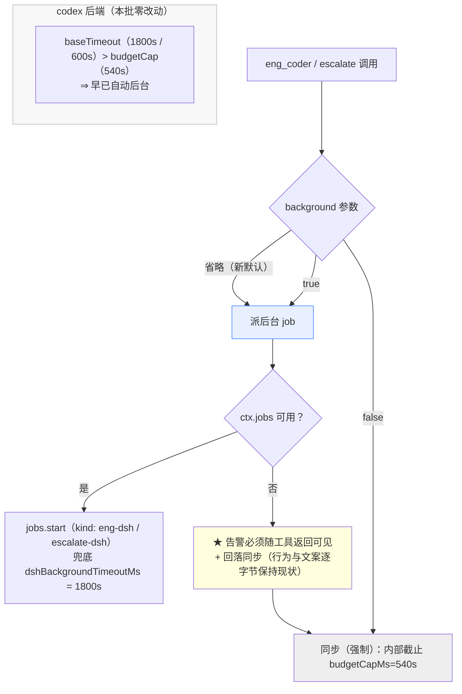
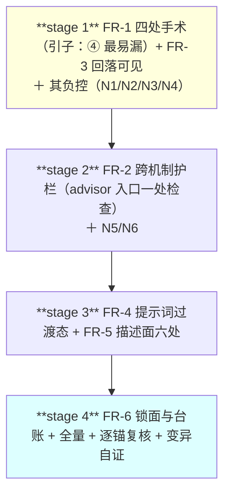

# 设计：长任务默认走后台 —— 批 21

- 日期：2026-09-17
- 需求档：[`2026-09-17-jobs-default-requirements.md`](./2026-09-17-jobs-default-requirements.md)（**US-1…US-8** · **N-1…N-12** · §5.1 七条不做 · §5.3 四项不可真机验证）
- 会诊纪要：[`consult-minutes/2026-09-17-consult-32-minutes.md`](./consult-minutes/2026-09-17-consult-32-minutes.md)（**2/4 交付** · **D-32-1…D-32-8** · **R-66…R-68**）
- 章节：按 [`METHODOLOGY.md`](../METHODOLOGY.md)：**九节**（§1 背景 · §2 问题 · §3 目标 · §4 决策与理由 · §5 方案 · §6 机制伪代码 · §7 状态与 schema · §8 防偏离 · §9 边界）+ **§10 受影响文件与验收** + **§11 变更记录** + **§12 评审落档**
- 图示：**图 1**（三态语义与四条路径）· **图 2**（错序评审窗口与护栏）· **图 3**（派发后的流程形状）
- 状态：**设计待评审**

<!-- doc-shape
anchors: 机验锚
acs: 验收标准
-->

> ## ⚠️ 读前必读
>
> **1. ★ 本批改 `lib/**` ⇒ 实施后必须重启 DSH 才生效**（**写进交接页，不擅自重启**）。
>
> **2. ★ 本批的立项前提是被会诊纠正过的现状，不是文档里的现状**：**只有 dsh 子代理路径默认同步**；eng/escalate 的 **codex 后端早就按预算默认后台**（缺省预算 1800s / 600s，都 > 540s 阈值），advisor 是**按预算自动**、consult 是**无条件后台**。⇒ **本批只动 dsh 路径，codex 路径零改动**（纪要 **V12** 的纠正 + 父侧读源码复核）。
>
> **3. ★ 会诊独立抓到两处父侧漏看的面，本批必须处理**：**①（时序风险）** 默认后台后父代理不再阻塞 ⇒ 它可能在交付落地前跑 code 评审，看到陈旧状态（§4 **D21-2** 的护栏）· **②（静默失效陷阱）** `lib/index.mjs:1011` 把三态压成二态 ⇒ 不改它，`escalate` 的翻转**完全不起作用**（§5.1 **FR-1④**）。
>
> **4. ★ 「回落同步」是本批的硬约束，不是偏好**：它让 `session-state.test.mjs` / `stages.test.mjs` 两个**未授权**基线档免于授权仪式（纪要 **D-32-5**）。**任何改选 fail-closed 的提议都必须同时申报授权面扩张。**
>
> **5. 定位口径**：本档行号仅 as-of；**一切改动按符号 / 字面锚定**。
>
> **6. 自应用陷阱**（批 16 评审 #18 的教训）：**本档里的标记示例全部住行内代码 span 或围栏内**；**负控必须在仓外临时副本上裸写**。

---

## §1 背景

`eng_coder` 与 `escalate` 各有两条后端：**codex-cli**（按预算阈值自动派后台）与 **dsh 子代理**（`ctx.subagents.start`）。**后者默认同步**：父代理阻塞等待，同步路径的内部截止取 `codexCli.budgetCapMs`（缺省 **540s**）——而平台的 `run_code` 有 **600s 硬墙钟**。540 < 600 是**刻意**留的 60s 余量（`lib/advisor.mjs:1686-1688`），它的用途是「**回落/强制同步时也拿得到诊断报告**」。

问题在于：**dsh 路径没有任何预算输入**（子代理时长不可预估，唯一 deadline 是 `dshBackgroundTimeoutMs` 的 1800s 兜底）。⇒ 只要任务真的长，它就会落进两种死法之一：**540s 被插件自己掐掉**（失败交付）或**撞 600s 平台墙钟**（连报告一起丢）。

本批把 dsh 路径的**默认**改成后台，与同插件的其它路径拉齐；并处理这次翻转带来的时序风险与一处静默失效陷阱。

---

## §2 问题（**全文在需求档 §2**）

**七条**：**P-1** dsh 路径默认同步（`lib/eng.mjs:936`）· **P-2** codex/advisor/consult 早就不这样（一致性成本为零）· **P-3** 同步的两种死法 · **P-4** jobs 缺失的告警只在 console（= 静默失败）· **P-5** ★ 错序评审窗口（会诊两家独立发现）· **P-6** ★ 三态压扁（会诊抓到、父侧漏看）· **P-7** 描述面不准确（六处）。**D2 单一权威源：本节不重述，只给指针。**

---

## §3 目标

| # | 目标 | 验收面 |
|---|---|---|
| **G1** | dsh 路径**默认后台**（省略即后台） | AC-1 · AC-2 |
| **G2** | `background: false` **强制同步**（逃生口不丢） | AC-3 |
| **G3** | `background: true` 与省略**等价** | AC-4 |
| **G4** | jobs 缺失/派发失败 ⇒ **回落同步且告警可见**（不静默） | AC-5 |
| **G5** | **codex 路径零漂移** | AC-6 |
| **G6** | ★ **错序评审被机制封死** | AC-7 · AC-8 |
| **G7** | 提示词有过渡态与隔离期纪律；三处机械面全绿 | AC-9 |
| **G8** | 描述面六处与实现一致 | AC-10 |
| **G9** | 零改面 + 授权注释与台账同批 | AC-11 · AC-12 |

### §3.1 非目标（**不做**，逐条见需求档 §5.1）

不引入新配置键 · 不动 codex 判定 · 不动 `budgetCapMs` 缺省 · 不选 fail-closed 拒发 · 不修在飞槽位的重启失忆（R-66）· 不动 `preset-static` 锁的那句 persona 文案 · 不擅自重启。

---

## §4 决策与理由

| # | 决策 | 为什么 | 被否决的备选与理由 |
|---|---|---|---|
| **D21-1** | **默认翻转靠三态语义，零新配置键** | 省略 ⇒ 后台（新默认）· `false` ⇒ 强制同步 · `true` ⇒ 后台。宿主事实已回盘：schema 的 `default` 是**非校验注解**（`@deepseek-ai/dsh-tools` 的 `schema.d.ts:14` 字面「Non-validating default annotation」）⇒ **省略的参数不会被注入 `false`** | **否决「加 `backend_mode` 键」**：多一个要解释、要迁移、要写文档的旋钮，而三态已足够表达 |
| **D21-2** | ★★ **在 `advisor` 入口加跨机制护栏**（**会诊两家独立同结论**） | 默认后台后「eng 交付 ⇒ 簿记已发生 ⇒ 评审看到 fresh 状态」这条**由阻塞天然保证**的链条断掉。护栏 = code 型评审发起时检查 **eng/escalate 槽位**，在飞则**拒绝并指向 job id** | **否决「只靠提示词」**（glm 原话「太弱」）：提示词拦不住模型，而白跑一轮评审是**真花钱**的 |
| **D21-3** | **并在提示词侧加过渡态 + 隔离期纪律** | v4-pro 指出：否则父代理可能在 `Implementation` 态直接跑去跑评审——**这是流程正确性**，不是措辞 | **部分否决 glm 的「提示词本轮不动」**：他不动是为省仪式，而省下的仪式换不来流程正确（不动的是**另一句** persona 文案，见 D21-6） |
| **D21-4** | **jobs 缺失/派发失败的告警升级为「随工具返回可见」** | 翻转后默认走后台 ⇒ 只 console.warn 会变成「**父代理傻等一个不会来的通知**」= 静默失败 | **否决「维持 console-only」**：那是本仓明令最忌讳的物种 |
| **D21-5** | **`budgetCapMs` 缺省（540s）不动** | 翻转后职责收窄但更纯；**60s 余量是「回落了也拿得到诊断」的保证** | **否决「抬高到 600s」**：消灭余量，回落时连报告一起丢 |
| **D21-6** | **`preset-static` 锁的那句 persona 文案一字不动** | 它在翻转后**仍为真**（自动节点还在，只是发生在通知回合）⇒ 动它 = 无谓的授权面扩张 | **否决「顺手改写」**：零收益、有仪式成本 |
| **D21-7** | **回落语义逐字节保持现状**（告警 + 回落同步） | 它是 **`session-state` / `stages` 免于授权仪式的唯一前提**（会诊 **V11** 的推论） | **否决 fail-closed 拒发**（consult 先例）：会扩授权面（需求档 §5.1 第 4 项） |
| **D21-8** | ★ **stages 纪律与墙钟解耦（取舍条目 · 兑现纪要 D-32-7）** | **阶段自检/可续跑的价值与执行形态正交**：阶段表解析、UNDECLARED 门、漂移探测**全在 output 文本流上**，与「同步还是后台」无关。**同步截止曾是「逼人拆 stages」的压力源，不是设计意图** ⇒ 翻转后**纪律强度只取决于一条描述面纪律**：「父代理必须 `job_output` 读全文（横幅在 job 输出里）」（**FR-4 已落**）。⇒ **代价如实登记**：这句话是**软约束**，硬约束靠 **FR-2 的护栏** | **否决「翻转后同步截止仍留作逼拆 stages 的手段」**：那是把**墙钟压力**当纪律用 |

---

## §5 方案（分交付单元 FR-1…FR-6）

### §5.0 图 1：三态语义与四条路径



### §5.0b 图 2：错序评审窗口与护栏（**本批的核心风险**）

```mermaid
sequenceDiagram
  participant P as 父代理
  participant E as eng_coder（后台 job）
  participant J as 簿记（deliverBookkeeping）
  participant A as advisor（code 评审）
  P->>E: 派发，立即拿句柄
  Note over J: 簿记在 job settle 的回调里发生<br/>（advisorRound=0 + prior=null + touchedFiles 合并）
  P--x A: ✗ 若在通知前发起评审 ⇒ 护栏拒绝（指向 job id）
  E-->>J: settle
  J->>P: 完成通知
  P->>A: ✅ 通知回合里发起（状态已 fresh）
  style A fill:#fdd,stroke:#c00
```

**读图要点**：**护栏拦的是「通知前的评审」**；通知回合里的评审照常（AC-7 正控 + AC-8 阴性对照）。

### §5.0c 图 3：派发后的流程形状


### §5.1 FR-1 **三态语义 + 四处手术**（★ ④ 是静默失效陷阱）

| # | 位置 | 改法 | 不改会怎样 |
|---|---|---|---|
| **①** | `lib/eng.mjs:936` | `args?.background === true` → **`args?.background !== false`** | eng_coder 的 dsh 仍默认同步 |
| **②** | `lib/escalate.mjs:425` | 同上 | escalate 的 dsh 仍默认同步 |
| **③** | `lib/index.mjs:957` · `:1002` | **删掉 schema 的 `default: false` 注解** + 描述串改「默认后台，传 `false` 强制同步」 | 注解不改变行为（非校验注解），但**会让给模型看的 schema 撒谎** |
| **④** | `lib/index.mjs:1011` | `args?.background === true` → **`args?.background`（三态透传）** | ★ **`undefined` 被压成 `false` ⇒ `escalate` 的翻转完全不起作用**（会诊 G5④） |

**codex 路径的判定（`lib/eng.mjs:828` 与 `lib/escalate.mjs` 同处）保持 `=== true` 不动** ⇒ 行为零漂移（N-5 / AC-6）。

### §5.2 FR-2 **跨机制护栏**（`advisor` 入口）

code 型评审发起时，检查 **eng / escalate** 槽位是否在飞：**在飞 ⇒ 拒绝**，错误文本**点名 job id**并指引「等完成通知后重发」。**与既有 `checkInFlightJob` 同构**（同复合键、同清理点），**只加一处检查、不改槽位机制**。非 code 型评审（design）**不受影响**。

### §5.3 FR-3 **回落可见**

`lib/eng.mjs:1025/:1028` 与 `lib/escalate.mjs:554`：把 `console.warn` **同时并入工具返回文本**（与 `warnPrefix()` 既有先例同形）。**行为仍是回落同步、文案逐字节保持现状**（N-3 + N-4）。

### §5.4 FR-4 **提示词过渡态与隔离期纪律**

`lib/prompts/engineering.md` 的 **Work Loop** 增补：**过渡态**（派发后台 ⇒ 停下等通知 ⇒ `job_output` 读全文 ⇒ 审计 ⇒ 评审）+ **隔离期纪律**（eng job 在飞期间不跑 advisor 评审）。**不动 `preset-static.test.mjs:55` 锁的那句 persona 文案。**

### §5.5 FR-5 **描述面六处**（清单见纪要 D-32-8）

> **★ 权威落点声明（评审 #6 的处置）**：**本档是本清单的实施权威落点**（实施者照本节的六条执行）；**纪要 D-32-8 只存裁定**。⇒ 避免「同一清单两处各自漂移」；**若两处出现不一致，以本档为准并回订纪要**。

README 那节「长任务必须显式传 `background: true`」整节 · schema 描述（`:957/:1002`）· `lib/eng.mjs:19-23` 头注释 · `lib/escalate.mjs:4-7/:285/:562` · `lib/index.mjs:950` · `docs/2026-09-11-token-lifecycle-design.md:326`。
**★ 但 `doc-hygiene.test.mjs:317` 的第二字面与 `advisor-config:527-529` 的孪生断言不许改写——新指引另起句。**

### §5.6 FR-6 **锁面与台账**

需改的基线档 `test/advisor-config.test.mjs`（T18d）与 `test/codex-runner.test.mjs` **均已在 `AP_TEST_AUTHORIZED` 面内** ⇒ **不扩数组**，但按批 14 先例**在注释块追加授权理由**；用例数有增减则 `docs/test-lifecycle.md` §三/§七 **同批同步**（`T-LC2` 等值锁）。

---

## §6 机制伪代码（含前置 / 后置条件）

```js
/**
 * FR-1：dsh 子代理路径的三态判定（**替换 `args?.background === true`**）。
 * @pre  args 是工具收到的原始参数（宿主不注入 schema 的 default——已回盘）
 * @post args?.background === false ⇒ 同步（内部截止 budgetCapMs）
 *       args?.background === true 或 undefined ⇒ 派后台 job
 */
function wantsBackground(args) { return args?.background !== false }

/**
 * FR-2：code 型评审前的跨机制在飞检查（**与 checkInFlightJob 同构**）。
 * @pre  会话 id 可取（`agent.session.id`）；评审类型**已解析**（本检查只在 code 型路径上调用）；
 *       在飞槽位 Map 可达（模块内存态——**它不落盘，重启即空**，见 §9.1 重启行与 R-66）
 * @post 任一 eng/escalate 槽位在飞 ⇒ 返回拒绝文本（含 job id）；否则 null（**放行**）
 */
function crossMechanismInFlight(sid) { /* ... */ }

/**
 * FR-3：回落告警双通道。
 * @pre  已判定要回落同步（`ctx.jobs` 缺失 或 `jobs.start` 抛错）；回落文案是**既有字面**（不许改）
 * @post **两条通道都在**：`console.warn`（既有）+ **工具返回文本**（本批新增）；
 *       行为仍是**回落同步**、文案**逐字节不变**（N-3 + N-4）
 */
function jobsFallbackNotice(...) { /* ... */ }
```

---

## §7 状态与 schema（**谁写谁读**）

**本批不新增任何持久化格式、不改任何配置键。**

| 面 | 动作 | 谁写 | 谁读 |
|---|---|---|---|
| `background` 参数语义 | **三态**（省略 ⇒ 后台） | 调用方（模型/用户） | `lib/eng.mjs` · `lib/escalate.mjs` |
| schema 的 `default` 注解 | **删**（防 schema 撒谎） | — | 渲染给模型的工具描述 |
| 在飞槽位（`inFlightJobs`） | **不落盘**（R-66） | 运行时内存 | **FR-2 的护栏**（新读者） |
| `docs/test-lifecycle.md` | §三计数 + §七历史行 | **主代理定内容、eng_coder 落笔** | `test-lifecycle.test.mjs` |

---

## §8 防偏离

### §8.1 零改面

| # | 面 | 判据 |
|---|---|---|
| 1 | **codex 路径的判定**（`eng.mjs:828` · `escalate.mjs` 同处） | 逐字未改 |
| 2 | **`test/session-state.test.mjs` 零改动**（回落保绿） | `--numstat` 空 |
| 3 | **`test/stages.test.mjs` 零改动**（同上） | 同上 |
| 4 | **`test/preset-static.test.mjs` 零改动**（那句 persona 不动） | 同上 |
| 5 | `release-check.mjs` · `test/release-check.test.mjs` · `test/fixtures/**` | 同上 |
| 6 | **`doc-hygiene.test.mjs:317` 的第二字面** | 逐字未改（**新指引另起句**） |
| 7 | 零 `test.skip` / `test.only` · `failStop(` 恒 **18** · 六串零命中 | 既有锁 |
| 8 | 零新依赖 · 零新配置键 | `package.json` 键集不变 |
| 9 | **`budgetCapMs` 与 `dshBackgroundTimeoutMs` 的缺省值** | 逐字未改 |
| **10** | **`test/stage-gate.test.mjs` 零改动**（★ 评审 #1 补：**stages 纪律的机械见证者**） | `--numstat` 空；**T-SG4 的四接线 needle 原样全绿**（簿记点 × 门 × 四路接线） |
| **11** | **`test/path-kind.test.mjs` 零改动**（★ 评审 #3 补：N-8 声明的**三处机械面**之一） | `--numstat` 空 |

### §8.2 机验锚（**三要素写全：检索目标 / 谓词 / 期望**）

| 锚 | 检索目标 | 谓词 | 期望 |
|---|---|---|---|
| **A1** | `lib/eng.mjs` | dsh 分支的判定表达式 | **`!== false` 三态形态在位**，且**原 `=== true` 形态在该分支内零命中** |
| **A2** | `lib/escalate.mjs` | 同 | 同上 |
| **A3** | `lib/index.mjs` | **三态透传** | 调用点**不再是** `background === true`；且 schema 的 `default: false` **已删** |
| **A4** | `lib/eng.mjs:828` 与 `lib/escalate.mjs` 的 codex 判定 | **零漂移** | 两处**仍是 `=== true`** |
| **A5** | `test/*.test.mjs` | 缺省 ⇒ 后台（eng） | 省略 `background` 且 jobs 可用 ⇒ **派 job**（正控） |
| **A6** | 同上 | 缺省 ⇒ 后台（escalate） | **同上**（★ 这条是 ④ 的直接见证：不修 ④ 必红） |
| **A7** | 同上 | `false` ⇒ 强制同步 | 传 `false` ⇒ **走同步路径**（不被 jobs 接走） |
| **A8** | 同上 | jobs 缺失 ⇒ 回落 + **告警随返回可见** | 返回文本含告警；行为仍同步（**回归锁**：文案逐字节） |
| **A9** | 同上 | **护栏正控** | eng 槽位在飞时发起 code 评审 ⇒ **拒绝**且文本含 job id |
| **A10** | 同上 | **护栏阴性对照** | 槽位不在飞 ⇒ **放行**；**design 型评审不受影响** |
| **A11** | `lib/prompts/engineering.md` | 过渡态与隔离期纪律 | 两个新段落在位；且 `preset-static` 锁的那句 persona **逐字未改** |
| **A12** | 全仓 | 描述面六处 + 零改面 | 六处与实现一致；§8.1 各项 `--numstat` 空 |
| **A13** | `test/stage-gate.test.mjs` · `lib/index.mjs` | **stages 纪律零削弱**（★ 评审 #1 补） | ① 该档**零改动**且 **T-SG4 的四接线 needle 原样**（簿记点与门结构配对）；② 描述面**写明「stage 门横幅随 job 输出可见」**（`job_output` 读全文） |
| **A14** | `lib/eng.mjs` · `lib/escalate.mjs` · `lib/index.mjs` | **畸形输入的 fail-safe**（★ 评审 #5 补） | 非布尔的 `background`（如字符串）⇒ **非 `false` ⇒ 仍走后台**；**不是**严格布尔判等 |
| **A15** | `docs/2026-09-13-handoff.md` | **重启事项已写进交接页**（★ 评审 #7 的层标订正后必须配锚：T2 不可免锚） | 该档含**批 21 的重启行**（本批改 `lib/**` ⇒ 重启后生效），且**列出可感变化**（默认后台 / 逃生口 / 回落告警可见） |

### §8.3 负控与阴性对照

> **做法**：负控**全部在仓外临时副本 / 内存夹具上构造**（仓内零残留）；**必须区分真红与假红**。

| # | 判据 | 负控构造 | 必须红在哪 |
|---|---|---|---|
| **N1** | 缺省 ⇒ 后台 | 把 ① 改回 `=== true` | **A5**（eng 缺省变同步） |
| **N2** | **三态透传（★ 最重要）** | 把 ④ 改回 `=== true` | **A6**（escalate 缺省变同步——**只有这条能证明 ④ 是必需的**） |
| **N3** | `false` ⇒ 同步 | 把判定改成 `true`（恒后台） | **A7**（逃生口失效） |
| **N4** | 回落可见 | 把返回文本里的告警删掉（只留 console） | **A8** |
| **N5** | 护栏 | 把跨机制检查拆掉 | **A9**（错序评审不再被拦） |
| **N6** | 护栏不误伤 | 把检查改成「任何在飞都拒」 | **A10**（design 型/无在飞被误拒） |
| **N7** | codex 零漂移 | 把 `:828` 也改成 `!== false` | **A4** |
| **N8** | persona 未动 | 改 `preset-static` 锁的那句 | 该档当场红（**证明它是锁、不是建议**） |
| **N9** | **畸形输入 fail-safe**（★ 评审 #5 补） | 把判定改成「严格布尔」（`typeof v === "boolean" && v === false` 之类的**等价改写**） | **AC-15 / A14**（字符串被误判成「同步」——**方向与 N1 相反**） |

| # | 阴性对照（**零编辑必须仍绿**） | 它证明什么 |
|---|---|---|
| **M1** | `test/session-state.test.mjs` · `test/stages.test.mjs` **零编辑仍绿** | 回落语义逐字节保持（**N-3 的兑现**） |
| **M2** | `test/preset-static.test.mjs` 零编辑仍绿 | persona 句未动 |
| **M3** | 显式 `background: true` 的既有断言全绿 | 旧用法零回归 |
| **M4** | codex 路径既有断言全绿 | 零漂移 |
| **M5** | **`test/stage-gate.test.mjs` 零编辑仍绿**（★ 评审 #1 补） | **stages 纪律的机械见证者未被削弱**（与 A13 配对） |

---

## §9 边界（**逐条登记，不留给评审去发现**）

### §9.1 六类边界

| 类 | 本批必须定义的行为 | 方向 |
|---|---|---|
| **空集** | `args` 为 `null`/非对象 ⇒ **视作省略**（走后台）；空 `background: ""` ⇒ 非 `false` ⇒ 后台 | 见左 |
| **畸形输入** | 非布尔的 `background`（如字符串） ⇒ **非 `false` ⇒ 后台**（fail-safe 到新默认，不静默同步） | **fail-safe** |
| **并发** | **护栏只覆盖 code 型评审 × eng/escalate 槽位**；别的交错组合 ⇒ **登记 R-68** | 见左 |
| **重启** | **★ 适用**：本批改 `lib/**` ⇒ 未重启不生效（US-7）；且在飞槽位不落盘 ⇒ 重启后护栏失忆（**R-66**） | — |
| **升级** | **零配置键变更** ⇒ 无迁移；**但「默认行为」变了** ⇒ 依赖「默认同步」的**用户流程**（而非测试）会发生行为变化——**这必须写进交接页与 README** | 显式声明 |
| **失败方向** | **默认面 fail-safe**（缺省走后台）· **回落面 fail-visible**（告警随返回）· **护栏面 fail-closed**（拦不住的代价 > 白跑一轮） | 见左 |

### §9.2 语义的失败形态（**哪类真缺陷会被放过**）

| 面 | 放过的真缺陷 | 定性 |
|---|---|---|
| **护栏的范围** | 只拦 code 型 × eng/escalate；**别的机制交错不拦** | **显式选择**（**R-68**） |
| **重启失忆** | 重启后在飞槽位丢失 ⇒ 护栏放行一次 | **显式选择**（**R-66**，登记不修） |
| **非布尔的 `background`** | 被当成「后台」 | fail-safe 方向（**显式选择**） |

### §9.3 诚实残差清单

| # | 抓不到 / 不修 | 理由 |
|---|---|---|
| **1** | **在飞槽位重启失忆的实际发生率** | 需重启 + 真长任务；**R-66** |
| **2** | **「stage 失败后重派」后移一个回合** | 流程形态变化，非缺陷；**R-67** |
| **3** | **别的机制交错组合** | **R-68** |
| **4** | **默认行为变化对用户既有习惯的影响** | 不可在本仓内生验证；写进交接页与 README |
| **5** | **真机长任务端到端** | 重启后人工（**T3**） |
| **6** | **提示词的效果**（模型是否真的按过渡态走） | 提示词是**软约束**；硬约束靠 FR-2 的护栏——**这正是两者都做的理由** |

### §9.4 威胁模型

**★ 漂移，不是对抗。** 对抗者可以去掉护栏、改回判定。**⇒ 本批的机制针对「无意漏改 / 时序错配」**；对抗面登记为已知边界。

---

## §10 受影响文件与验收

### §10.1 实施域

| 文件 | 改动 | 类型 |
|---|---|---|
| `lib/eng.mjs` | **FR-1①** + **FR-3** + **FR-5（头注）** | 修改（核心） |
| `lib/escalate.mjs` | **FR-1②** + **FR-3** + **FR-5（头注）** | 修改（核心） |
| `lib/index.mjs` | **FR-1③④** + **FR-5（schema 描述 / `:950`）** | 修改（★ ③④ 是陷阱位） |
| `lib/advisor.mjs` | **FR-2 的跨机制护栏（一处检查）** | 修改（一处级） |
| `lib/prompts/engineering.md` | **FR-4** | 修改 |
| `test/advisor-config.test.mjs` · `test/codex-runner.test.mjs` | **FR-6**：授权注释追加 + 新腿 | 修改（**均已在授权面** ✓） |
| `docs/test-lifecycle.md` | **FR-6**：§三计数 + §七历史行 | 修改 |
| `README.md` · `docs/2026-09-11-token-lifecycle-design.md` | **FR-5** | 修改 |
| **明确排除（禁改）** | `test/session-state.test.mjs` · `test/stages.test.mjs` · **`test/stage-gate.test.mjs`** · **`test/path-kind.test.mjs`** · `test/preset-static.test.mjs` · `release-check.mjs` · `test/release-check.test.mjs` · `test/fixtures/**` · `docs/consult-minutes/**` · 平台包 | **零改动** |

**★ EOL 逐档实测表（as-of 2026-09-17；**改前必须逐档实测**）**：`lib/**` **19 CRLF / 11 LF**（`eng.mjs`/`escalate.mjs` 实测为 **LF**；`index.mjs`/`advisor.mjs` 为 **CRLF**）· `lib/prompts/*.md` 与 `docs/*.md` 多数 **LF**，**`README.md` 是 CRLF** · `test/**` **4 档 CRLF**（`codex-runner` / `consult` / `death-provenance` / `preset-static`）。**⇒ 每档改前实测、改后复核 `git diff --stat` 无整档重写**；**`git diff` 必须配 `--ignore-cr-at-eol` 读**（本机有逐档全档的 CR 幻影）。

### §10.2 可验性分层登记

| 标 | 含义 | 本批 AC |
|---|---|---|
| **T1** | 进程内 `node --test` 可证 | AC-1…AC-8 · **AC-15** |
| **T2** | 静态谓词 / 逐字可查 | AC-9…AC-14 |
| **T3** | **仅重启后人工核验**（**指「重启后生效」这件事本身**；**不含**写档动作） | （本批无：AC-13 已按评审 #7 订正为 T2） |

### §10.3 验收标准

| # | 验收标准 | 层 | 锚 | US |
|---|---|---|---|---|
| **AC-1** | **eng_coder dsh 省略 `background`** ⇒ **派后台 job**（jobs 可用时） | T1 | A1 · A5 | US-1 · US-2 |
| **AC-2** | **escalate dsh 省略 `background`** ⇒ **派后台 job**（★ 依赖三态透传 ④） | T1 | A2 · A3 · A6 | US-1 · US-2 |
| **AC-3** | 显式 **`background: false`** ⇒ 走**同步**（内部截止 540s） | T1 | A7 | US-3 |
| **AC-4** | 显式 **`background: true`** ⇒ 后台（与省略等价） | T1 | A5 | US-1 |
| **AC-5** | **jobs 缺失/派发失败** ⇒ **告警随工具返回可见** + 回落同步（**文案逐字节**） | T1 | A8 | US-4 |
| **AC-6** | **codex 路径零漂移**：`eng.mjs:828` 与 escalate 同处**仍 `=== true`** | T2 | A4 | US-6 |
| **AC-7** | **护栏正控**：eng/escalate 槽位在飞 ⇒ code 评审**被拒**且文本含 job id | T1 | A9 | US-5 |
| **AC-8** | **护栏阴性对照**：槽位不在飞 ⇒ **放行**；**design 型评审不受影响** | T1 | A10 | US-5 |
| **AC-9** | **提示词**：过渡态 + 隔离期纪律在位；**`preset-static` 锁的那句 persona 逐字未改** | T2 | A11 | US-1 |
| **AC-10** | **描述面六处**与实现一致（含 README 那节） | T2 | A12 | US-1 |
| **AC-11** | **零改面**：§8.1 各项 `--numstat` 空（含三个未授权基线档） | T2 | A12 | US-6 |
| **AC-12** | **台账与授权注释同批**：§三计数 == fs 实测；§七有新行；授权注释含本次理由 | T2 | A12 | US-6 |
| **AC-13** | **重启事项写进交接页**（`docs/2026-09-13-handoff.md`，**主代理写**） | **T2** | A15 | US-7 |
| **AC-14** | ★ **stages 纪律零削弱**（评审 #1 补）：`test/stage-gate.test.mjs` **零改动**且 **T-SG4 的四接线 needle 原样全绿**；**且描述面写明「stage 门横幅随 job 输出可见」** | T2 | A13 | US-8 |
| **AC-15** | ★ **畸形输入的 fail-safe**（评审 #5 补）：非布尔的 `background`（如字符串）⇒ **非 `false` ⇒ 仍走后台**（不静默同步） | T1 | A14 | US-1 |

> **★ 层标订正（评审 #7）**：**AC-13 原标 T3 有误**——「写进交接页」是**文档编辑、静态可查** ⇒ **T2**；**T3 指的是「重启后生效」这件事本身**（那是 **US-7 的另一半**，只能人工验，不可在本仓内生证明）。

### §10.4 建议 stages（**四段串行**）



| stage | goal | 文件 | 检查 |
|---|---|---|---|
| **1** | FR-1 + FR-3 + 负控 N1…N4 | `lib/eng.mjs` · `lib/escalate.mjs` · `lib/index.mjs` | `node --test test/codex-runner.test.mjs test/advisor-config.test.mjs` |
| **2** | FR-2 + N5/N6 | `lib/advisor.mjs` | `node --test test/advisor-config.test.mjs test/codex-runner.test.mjs test/design-review-guard.test.mjs` |
| **3** | FR-4 + FR-5 | `lib/prompts/engineering.md` · `README.md` · 头注与描述面 | `node --test test/preset-static.test.mjs test/doc-hygiene.test.mjs **test/path-kind.test.mjs**` |
| **4** | FR-6 + 全量 + 逐锚 + 变异 | `test/*.test.mjs` · `docs/test-lifecycle.md` | `node --test` |

---

## §11 变更记录

| 日期 | 变更 |
|---|---|
| 2026-09-17 | 首版（**设计待评审**）：九节 + §10 验收；**D21-1…D21-8**；**US-1…US-8**；**AC-1…AC-15**；**锚 A1…A15**；**负控 9 条 + 阴性对照 5 条**；**图 1/2/3**；§10.4 **四段串行**。**★ 立项前提经会诊纠正**（只有 dsh 路径默认同步；codex 早已后台）· **★ 会诊抓到的两处父侧漏洞已进方案**（**FR-1④ 三态透传** = 静默失效陷阱 · **FR-2 跨机制护栏** = 错序评审窗口）· **★ 「回落同步」升格为硬约束**（保两个未授权基线档免于仪式）。 |
| 2026-09-17 | **★ 设计评审轮 1 落档（`advisor-dsh-5`，`VERDICT: FAIL`，🔴2 · 🟡4 · 🔵4）——10 条全 Fixed**（**未签发 token**；落档见 **§12.1**）：**🔴 #1/#2 同根**（**stages 纪律面整体缺位**）：US-8 在 AC 表里**零映射**（AC-11 的「`stages.test.mjs` 零改动」映射的是 US-6，而**「测试档零改动」≠「纪律不被削弱」**）⇒ **新增 AC-14 + 锚 A13 + 阴性对照 M5**，并把 `test/stage-gate.test.mjs` / `test/path-kind.test.mjs` 补进 §8.1 与 §10.1；**纪要 D-32-7 未兑现**（裁定要求把「stages 与墙钟解耦」记为取舍条目）⇒ **新增 D21-8**（含代价如实登记：描述面纪律是**软约束**、硬约束靠 FR-2）。**🟡 #3** stage 检查命令与写域不对齐（stage 2 检查指向不在写域的档；stage 3 缺路径谓词档）⇒ **两处对准**。**🟡 #4** §6 伪代码前后置不全（FR-2 缺 `@pre`、FR-3 两者皆缺）⇒ **补齐**。**🟡 #5** §9.1 的畸形输入行为**无锚无负控** ⇒ **新增 AC-15 + 锚 A14 + 负控 N9**。**🔵 #6** FR-5 全量复抄清单（W2 边界）⇒ **声明本档为实施权威落点、纪要只存裁定**。**🔵 #7** AC-13 层标 T3 有误（写档是静态可查）⇒ **改 T2** 并写明 T3 指「重启后生效」本身。**🔵 #8** 需求档指针指向 §9.4（实为威胁模型）⇒ **订正为 §9.3**。**🔵 #9** 纪要 R-68 笔误「eslate」⇒ **已订正**。**🔵 #10** 登记状态无法核实（评审读到的是截断地图）⇒ **父侧回盘核实：两档已在 `docs/README.md` 登记**（本行即为回盘记录）。 |

---

## §12 评审落档

### §12.1 设计评审落档（**轮 1 = FAIL**）

| 轮 | 结论 | 处置 |
|---|---|---|
| **1** | **`VERDICT: FAIL`**（🔴2 · 🟡4 · 🔵4）· **未签发 token** | **10 条全 Fixed**（逐条见 §11 第 2 行）。**评审正评**：「九章节齐备、三张图到位、**四处手术（含 ④ 三态透传陷阱）精确到行**、负控 N1–N8 与阴性对照 M1–M4 成对、锁定面/台账仪式显式声明、边界六类全覆盖」；**两条 🔴 同根**——**「用户故事/裁定无 AC 兜底」这个物种**（批 6b / 批 7 / 批 9 都判过死） |

- **design token**：**轮 1 未签发**（存在未决 🔴，按规则不签发）；**轮 2 `PASS` ⇒ 签发** `e5e81eff-100f-4c58-af47-6d0627eac06d` : `1790235497070`（**有效至 2026-09-24**；**逐字经 `designToken` 参数传给 `eng_coder`，不写进任务书文本**）
- **轮 2 复核**：**上轮 10 条全部实证 Fixed** ✓（评审逐条给了「现行条目 + 行号」为证）；**另出 3 条**：**#11 🟡** §10.2 层标表未随 #7 同步（AC-13 已改 T2 而表里仍列 T1/T2/T3 旧映射）⇒ **本档已对齐**；**#10 残余 🔵** 会诊 `#32` 纪要未登记进 `docs/README.md`（同目录 `consult-13` 有先例）⇒ **已补登记**；**#12 🟡 Carried** 批 20 设计档 §12.5 的疗效读数「待回填」——**父侧回盘：本轮评审的送审面不含批 20 设计档，故它看不到；该节已由 `pwsh-43` / `pwsh-44` 的实测填满（全量 ×10 = 9/10、追加 50 轮 0 红、单档 ×20 = 20/20）**，并有 §9.4 残差 #14 佐证 ⇒ **非开放项**。
- **★ 父侧自记（本批的物种）**：**两条 🔴 都出在「同一件事的另一半没写」**——**① `stages` 纪律被我用「测试档零改动」当成了证据**（其实纪律的本体是**横幅随 job 输出可见**这条新链路）· **② 会诊的裁定 D-32-7 我只写进了纪要、没落进设计档**。⇒ **这与本批要治的 `index.mjs:1011`（三态压扁 = 一半没改）是同族**：**「改了一半」在四个不同层级上各犯了一次**（会诊面 / 设计面 / 实现面 / 文档面）。
- **交付核验 / 分歧审计 / 交付代码评审**：见 **§12.2 / §12.4 / §12.3**（**待填**）。
