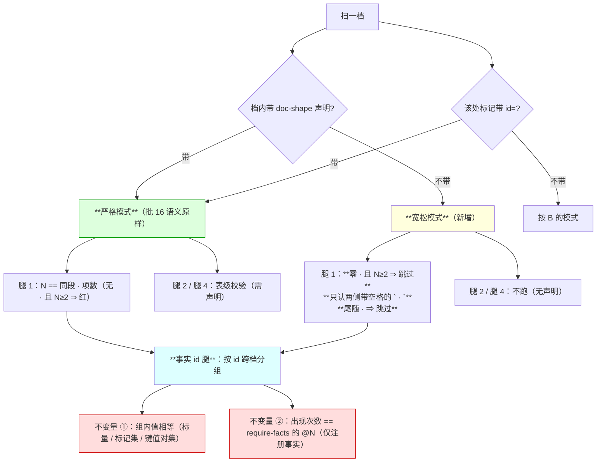
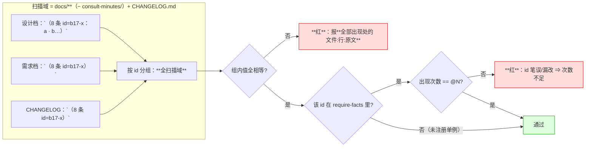
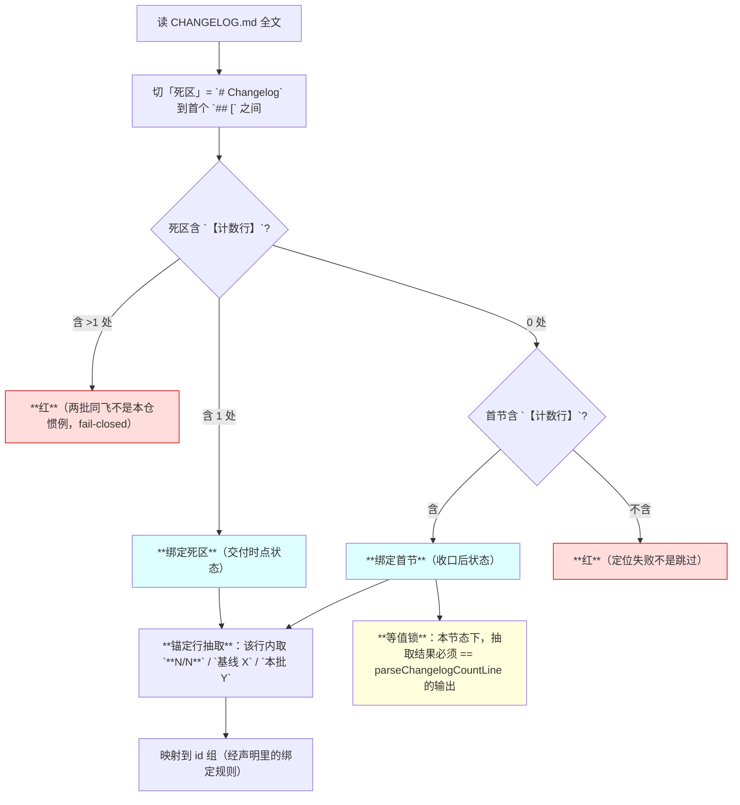
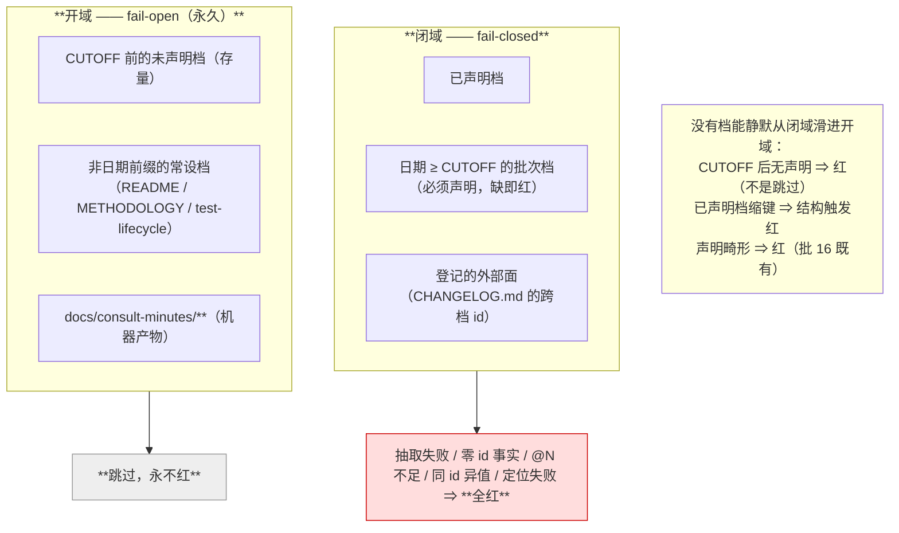
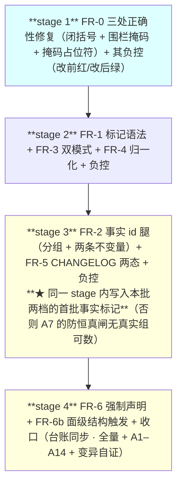

# 设计：谓词作用域与宣言对齐 —— 批 17

- 日期：2026-09-16
- 需求档：[`2026-09-17-scope-alignment-requirements.md`](./2026-09-17-scope-alignment-requirements.md)（**US-1…US-6** · **N-1…N-7** · §5.1 六项不做 · §5.2 **R-54…R-56**）
- 会诊纪要：[`consult-minutes/2026-09-16-consult-4-minutes.md`](./consult-minutes/2026-09-16-consult-4-minutes.md)（**机制选型**）· [`consult-minutes/2026-09-16-consult-5-minutes.md`](./consult-minutes/2026-09-16-consult-5-minutes.md)（**边界与风险 + 父侧干跑实测**）
- 章节：按 [`METHODOLOGY.md`](../METHODOLOGY.md)：§设计文档的成文流程与必备章节 **九节**（§1 背景 · §2 问题 · §3 目标 · §4 决策与理由 · §5 方案 · §6 机制伪代码 · §7 状态与 schema · §8 防偏离 · §9 边界）+ **§10 受影响文件与验收** + **§11 变更记录** + **§12 评审落档**
- 图示：**图 1**（两条腿的双模式真值表）· **图 2**（事实 id 的分组与两条不变量）· **图 3**（CHANGELOG 两态定位器）· **图 4**（域分离：闭域 fail-closed / 开域 fail-open）
- 状态：**设计待评审**

> ## ⚠️ 读前必读
>
> **1. 本批是纯测试面改动**——`lib/**` 零改动，**不需要重启 DSH**。**`release-check.mjs` 也零改动**（CHANGELOG 的既有契约原样保留，本批只读它）。
>
> **2. ★ 本批的头号想法已被实测否掉**：会诊原议「让腿 1/腿 3 全档常开」，**父侧干跑 62 档实测：腿 3 常开会让存量档红 34 处**（裸模块名）⇒ **常开不作本批增量**（详见 §4 的 **D17-0** 与 §9）。**⇒ 本批的增量只剩事实 id 腿。**
>
> **3. ★ 本批抓不到什么，写在前面**（防「宣言写得比机制大」）：**P-1「宣称已改而锚行未动」不抓**——那是「留痕 vs git diff」族，**不是可数事实**。**散文里的计数不抓**（N-1 的既定天花板）。**语义相反不抓**（「新增 8」与「删除 8」数值同即绿）。**逐条见 §3.1 与 §9。**
>
> **4. 定位口径**：本档行号仅 as-of；**一切改动按符号/字面锚定**。
>
> **5. 自应用陷阱**（批 16 评审 #18 的教训）：**本档里的标记示例全部住行内代码 span 内**，否则谓词吃自己的示例；**负控必须在临时档裸写**。

---

## §1 背景

批 16 交付了四条文档形状谓词（`v0.24.0`），**它能工作**——但**只扫两处**：**档内声明的锚表与 AC 表**。

**分歧审计的结论句是本批的立项来源**：

> **「谓词不是错的——是它的作用域与它的宣言不匹配。」**

**⇒ 而批 16 全周期的失败统计坐实了这句话**：**「任何『改了两处之一』都不算修好」这条规矩由批 16 自己立，而它在父侧手里复发了五次**——**六次全部落在谓词作用域之外**（需求档 §2.2 的 P-1…P-6）。

---

## §2 问题（**带出处**）

逐条见需求档 §2.2 的 **P-1…P-6**。**本节只补两条会诊带来的定性**：

| 定性 | 出处 | 含义 |
|---|---|---|
| **六次逃逸不全是「不声明」** | `kimi-k3`（会诊 #5） | 批 16 两档**都声明了**，逃逸发生在「**事实未标记**」（P-6 的散文 9 条）与「**档外**」（P-4 的 CHANGELOG）⇒ **单一招堵不住，要分层** |
| **腿 1/腿 3 本就是全档扫描** | `kimi-k3`（会诊 #5） | `checkCountMarks` 遍历全部行、**从不检查「是否在声明表内」** ⇒ **需求档 US-1 初稿写的「放开表级限制」是个不存在的限制**——**本批的真实增量是「带 id 后参与跨处比对」** |

---

## §3 目标

| # | 目标 | 验收面 |
|---|---|---|
| G1 | **同一可数事实在多处出现时被自动分组比对**，不一致 ⇒ 红且报全部出现处 | AC-1 · AC-2 · AC-3 |
| G2 | **未声明的批次档不再静默逃出作用域** | AC-8 · AC-9 |
| G3 | **批 16 的四条腿与八条负控一条不退化** | AC-11 |
| G4 | **`CHANGELOG.md` 被覆盖（跨档 id）且与既有解析器不打架** | AC-6 · AC-7 |
| G5 | **两处既有正确性缺陷顺带修掉** | AC-4 · AC-5 |
| G6 | **每条新腿与每条保守约束各自被证明会红** | AC-10 · AC-12 |

### §3.1 非目标（**★ 会诊硬要求：不许把宣言写得比机制大**）

| # | 不做 / 抓不到 | 理由 |
|---|---|---|
| 1 | **★ P-1「宣称已改而锚行未动」抓不到** | 那是「**留痕 vs git diff**」族，**不是可数事实**——它没有「值」可比。**本批明示登记，不用机制兜** |
| 2 | **散文里的计数抓不到** | N-1 的既定天花板（**正则猜中文误报 62%**）；**值只从标记载荷取** |
| 3 | **语义相反抓不到** | 「新增（8 条 id=X）」与「删除（8 条 id=X）」**数值同 ⇒ 绿**——**机制只证数值同一，不证语义同一** |
| 4 | **「锚定现实」不作本批** | docs↔fs / docs↔git 严格更强，但**每个现实抽取器都是新代码面 + 自己的负控**（YAGNI）；**登记为后续方向** |
| 5 | **跑遍全档的两条腿** | **★ 已被实测否掉**：腿 3 常开 ⇒ 存量档红 34 处（见 §4 D17-0） |
| 6 | **覆盖 `README.md`** | 沿需求档 §5.1 第 1 项（它与 `docs/` 形态完全不同） |

---

## §4 决策与理由

| # | 决策 | 为什么 | 被否决的备选与理由 |
|---|---|---|---|
| **D17-0** | **★ 两条既有腿不做「全档常开」** | **父侧干跑 62 档实测**：腿 3 常开 ⇒ **不可解析 34 处**（`docs/2026-09-05-defect-registry.md` 的 `advisor.mjs`×9 · `eng.mjs`×2 · `client.js`×2 · …**全是裸模块名，作者本就没打算写成仓内路径**）⇒ **= N-2「不追溯存量」被从后门违反** | **否决「全档常开」**（会诊 #5 原议，论据是「53 档 3 处命中」）——**那个观测只覆盖腿 1 的标记形与一家被训练过的仓，不构成外推**；**实测推翻它**。**⇒ 逃逸口改由 D17-4 的日期切点关闭**（本批增量不需要常开） |
| **D17-1** | **事实 id 为核**（`（N 量词 id=X：…）` / `（N 量词 id=X）`） | **唯一能让机器免猜地分组的手段**——**id 即「同一性」的断言本身**；三家独立同结论 | **否决 `(iii)` 成对枚举作通则**：**它把同一事实的副本数最大化 ⇒ 编辑点最大化 ⇒ 漂移面最大化**（`kimi-k3`：**重复是敌人**）；**维持 `compare` 现状不扩**（它已覆盖它擅长的那一类）。**否决 `(ii)` 单一权威表作机制**：Markdown 无活引用 ⇒ **指针处仍要写值** ⇒ 与 `(i)` 同构（`kimi-k3`）；**降为写作纪律**（与 D2/D3 同源） |
| **D17-2** | **`require-facts: id@N` 锁「注册事实」的出现次数** | **堵 D17-1 自己的 fail-open 缝**：**id 笔误 ⇒ 同一事实裂成两个单例组 ⇒ 组内自洽 ⇒ 静默绿**（`glm-5.3` 给的论证；**那正是 P-1 的变异形态**） | **否决「普适单例必红」**（`glm-5.3` 初版主张）——**「一次事实只出现一次」是常态**，普适会误伤；**⇒ 只锁注册事实**（`kimi-k3` 的不对称，更准） |
| **D17-3** | **全枚举形禁止省略** | **集成事实**（`deepseek-v4-pro`）：**腿 1 判据是「N == 同段 `·` 项数」** ⇒ `（8 项 id=X：a · b…）` **照字面写进真档必红**。**全枚举的唯一一处就是要写全的** ⇒ **复用腿 1 现有判据，零新增代码** | **否决「允许省略 + 部分集合跳过比对」**：其失败形态是**「省略背后的项替换永远不可见」**——**用一个不可见的洞换一个可见的红，不划算** |
| **D17-4** | **日期切点常量 + 批次档强制声明** | **关掉「整档不进作用域」这个口**：`docs/` 顶层、文件名匹配 `^YYYY-MM-DD-` 且日期 ≥ `2026-09-16` ⇒ **必须带声明**。**未带日期前缀的常设档天然不匹配 ⇒ 零清单维护**；**存量档日期全在切点前 ⇒ 零触动** | **否决「按 `docs/README.md` 索引日期」**（`glm-5.3` 的形态）——**多一跳**（要读索引再映射回档），而**档名日期前缀是自带的**（本仓实测一致）。**否决「默认面清单」单独用**（`glm-5.3` 自己指出）：**默认面只能默认自识别腿，配置腿的逃逸口它堵不住** |
| **D17-5** | **双模式真值表**：未声明档宽松 · **声明档保持批 16 严格** · **带 `id=` 一律严格** | **N-3 由此不退化**（声明档的教学功能不丢）；**而未声明档的宽松挡掉七个反例**（§9） | **否决「普适严格」**（会让本仓下一个会话踩 CE-4：**项含代码 span ⇒ 被掩成空格 ⇒ actual=0 ⇒ 必红**）· **否决「普适宽松」**（会让声明档失去约束力） |
| **D17-6** | **`mode: exempt` 取最小机制**：独键 + 必带理由 + **写在非日期档 ⇒ 红** + **`EXEMPT_BUDGET` 预算常数** + **内容证伪**（exempt 档长出受管面 ⇒ 红） | **「白名单长一行」变成「改一个带注释的常量」** ⇒ **滥用必在 diff 里可见**；**内容证伪是四条里唯一对「时间」免疫的**——**「档在 exempt 时是备忘录，三个月后长成了批次档的体型，没人回去摘牌子」** | **否决 `kimi-k3` 的 R1「双向登记锁」**（豁免集枚举在**谓词档**里）——**它与 D16-3（声明住档内、测试不做第二份真相源）正面相撞**（**`kimi-k3` 自己标注为「有界例外」**）⇒ **预算常数用更小的机制面换来同等可见性**。**R1 登记为后续候选** |
| **D17-7** | **CHANGELOG 两态定位器 + 锚定行抽取（非首例匹配）** | **交付时点新条目落在「死区」**（首个版本头之上），而 `parseChangelogCountLine` **永远只读首节** ⇒ **复用它会把本批绑到上一批的数上 ⇒ 交付时点必红**（`kimi-k3` 指出，**父侧漏掉**）。**锚定行抽取免疫「首例匹配」那颗已知雷**（批 16 踩过） | **否决「复制 `parseChangelogCountLine`」**：**单事实单谓词**——`**N/N**` 的内部可推导性**仍归 `G-常驻3` 独占**（**加性而非重复**） |
| **D17-8** | **归一化只许修呈现，永不许修语义**（元原则） | **每一次归一化都是一次 fail-open 决策**（`kimi-k3`）：**归一只许修整数/trim/空白，永不许修同义词/饰词/量词/散文** | **否决「找数再剥修饰词」**（`glm-5.3`）：**词典永不全 ⇒ 假红或漏**，且**它剥掉的正是方向动词**（「新增 8」与「删至 8」被折叠同值） |
| **D17-9** | **两处既有正确性缺陷顺带修**：**深度感知闭括号**（`（§3）` 式引注截断）· **围栏掩码**（CE-6：围栏块裸奔） | **K3 是四条约束里唯一「既降误伤又升查全」的**（`kimi-k3`）；**CE-6 是修缺陷不是加豁免**（`glm-5.3`） | **不否决（两项均无条件采纳）** |
| **D17-10** | **本批扫描域排除 `docs/consult-minutes/**`** | **理由不是白名单而是范畴**：**机器产物无作者契约**（`deepseek-v4-pro`）——**纪要是逐字记录面，内容不可控且按纪律不能润色**；实测该子目录有 **7 处**扩展标记形命中 | **否决 ⓐ「围栏感知 + 全纳入」进本批**：它**动了批 16 既有行为 ⇒ 必须复跑 N-3 全量回归**（只读会诊无法证明声明档内现有绿是否依赖扫围栏内容）⇒ **登记为后续**。（**而围栏掩码本身（D17-9）无论如何都做**——它同时是 CE-6 的修复） |

---

## §5 方案（分交付单元 FR-0…FR-6）

### §5.0 图 1：两条腿的双模式真值表（**本批的核心机制图**）



**读图要点**：**分叉点是「有无声明」与「标记是否带 id」**——**四条路径最终汇入事实 id 腿**（**这就是「带 `id=` 一律严格」的实现：无论档声明与否**）。**严格模式与宽松模式的差别只在腿 1 的宽松三约束与腿 2/腿 4 是否跑**。

### §5.0b 图 2：事实 id 的分组与两条不变量



**读图要点**：**不变量 ② 只对注册事实生效**——**「一次事实只出现一次」是常态，普适单例必红会误伤**（D17-2）。**而 id 笔误必然使注册事实的次数不足 ⇒ 当场被抓**。

### §5.0c 图 3：CHANGELOG 两态定位器（**★ 父侧漏掉、会诊补上的那一段**）



**读图要点**：**没有两态定位器，交付时点必假红**——**死区里的新条目与首节里的上一批计数是两件事**。**`【计数行】` 是批 16 条目里已在用的显式标记 ⇒ 本批把它升格为定位契约，零新造语法**。

### §5.0d 图 4：域分离（**失败方向的机械边界**）



**读图要点**：**边界是机械的**（文件名日期 + 声明存在性）——**「没声明就红」只作用于义务存在之处，而义务本身是一个常数** ⇒ **存量零红，张力消解**。

### §5.1 FR-0 三处既有正确性缺陷（**先做，无条件**）

**FR-0a 深度感知闭括号**（`kimi-k3` 的 K3）：现实现 `rest.indexOf("）")` **取首个**全角闭括号 ⇒ **任何 `（§3）` 式引注都会在引注后截断** ⇒ 项数误判。
**修法**：**按全角括号嵌套深度配闭括号**（`（` 深度 +1、`）` 深度 −1、深度归零处才是本标记的闭括号）。
**前置**：无。**后置**：`（3 项：需求档（§3）· 设计档（§7）· 台账（§三））` ⇒ **3 == 3 ⇒ 绿**（改前：截断在第 1 个 `）` ⇒ 1 ≠ 3 ⇒ 假红）。
**⇒ 它同时降误伤、升查全**（把「截断误判」从假红变成正确计数）。

**FR-0b 围栏掩码**（`glm-5.3` 的 CE-6）：`maskCodeSpans` **只认行内 span，不认 ``` 围栏** ⇒ **围栏内的示例裸奔**。
**修法**：**逐档围栏状态机掩码**（进入 ``` 后整块内容掩掉，直到闭合围栏）。
**前置**：无。**后置**：**围栏内的标记与路径一律不受检**（与行内 span 同待遇）。
**★ 影响面自证**：本批的**语法规格块必然住在围栏里** ⇒ **不修则批 17 自己的设计档当场红**。

**★ FR-0c 掩码改「非空白占位符」**（`glm-5.3` 的 CE-4；**★ 评审 #2 指出它此前无宿主——本节补上**）：

**症状**：`maskCodeSpans` 把 span 内容**替换成同长空白** ⇒ **项若整体住在 span 里**（如 ``（2 档：`docs/a.md` · `docs/b.md`）`` 里的两个项）⇒ **项区被掩成空格 ⇒ 段 trim 后为空 ⇒ actual=0 ⇒ 假红**。**⇒ 而本仓文风必然把文件名写成反引号** ⇒ **本仓下一个会话就会踩**。

**修法**：**掩码字符由「空格」改为「非空白占位符」**（如 `\u0000` 或 `§`），使**「该段非空」的判定不受掩码影响**，而**内容仍不可被匹配器读到**。
**前置**：无。**后置**：``（2 档：`docs/a.md` · `docs/b.md`）`` ⇒ **段非空、`·` 两侧皆有内容 ⇒ 2 == 2 ⇒ 绿**（改前：actual=0 ⇒ 假红）。
**★ 与 FR-0b 的顺序**：**围栏掩码（整行级）先于**行内 span 掩码（行级）——**两者都用非空白占位符**。
**★ 对声明档是承重的**：A12 要求本批两档自证，而**本批两档的标记示例正是这种形态**。

### §5.2 FR-1 事实标记语法

| 形态 | 字面 | 值与语义 |
|---|---|---|
| **全枚举形** | `（8 条 id=b17-x：a · b · c · d · e · f · g · h）` | **值 = (N, 项集)**；**禁省略**（D17-3）；**腿 1 的 `N == 项数` 同时生效** |
| **裸引用形** | `（8 条 id=b17-x）` | **值 = N**（无列表可比） |

**id 字符集**：`[^\s（）：·@|]+`——**`@` 与 `|` 必须排除**，因为它们是 `require-facts: id@N|id@N` 的分隔符（**不排除则解析必与 id 打架**，`glm-5.3` 的语法补丁）。
**id 命名**：**批次前缀**（`b17-…`）防跨批撞名；**id 相同即断言同一**——**不同事实必须起不同 id**（诚实且可执行的口径）。
**★ 加严信号**：**带 `id=` 的标记一律走严格模式**，**未声明档也不例外**（K6）——**事实腿的负控语义不依赖宽松档位**。

### §5.3 FR-2 事实 id 腿（跨档分组 + 两条不变量）

**做什么**：**在扫描域内按 id 分组**，对每组执行：
- **不变量 ①（同值）**：组内**标量全相等**；**标记集全相等**（trim 后精确串等值、顺序无关）；**混合形态**（有枚举形与裸引用形）⇒ **标量 N == |集| 已在腿 1 保证**（每个全枚举处都跑腿 1）⇒ 跨处只比标量。
- **不变量 ②（次数）**：**该 id 若在 `require-facts` 里声明了 `@N`** ⇒ **实际出现次数必须 == N**。

**类型声明**（`require-facts` 里带类型，`kimi-k3` 的 R4）：**标量 / 标记集 / 键值对集**。
**★ 显式 fail-open（写进 §9）**：**标量型事实在多处都用全枚举但成员不同 ⇒ 数值同 ⇒ 绿**——**这是显式选择，不许藏**。

**前置**：无（未声明档也跑，只要标记带 `id=`）。
**后置**：任一不变量破 ⇒ **红**，**报全部出现处的 `文件:行:原文`**（US-2）。

### §5.4 FR-3 腿 1 的双模式（**宽松只作用于未声明档**）

| 档位 | 腿 1 判据 |
|---|---|
| **声明档**（批 16 语义，**原样保留**） | 现三条边界 + **`N == 项数`**；**无 `·` 且 N≥2 ⇒ 红** |
| **未声明档**（新增） | 现三条边界 + **`N == 项数`**，**再加三条宽松约束**：① **段内零 `·` 且 N≥2 ⇒ 跳过**（杀 **CE-1/CE-2/CE-3** 的零段形态）；② **只认两侧带空格的 ` · `**（杀 **CE-1** 的译名 `·`——**★ 评审 #5 订正：初稿此处误写 CE-5，而 CE-5 是省略号形态、由 D17-3 处置**）；③ **尾随 `·`（末段为空）⇒ 跳过**（杀 **CE-7** 的折行形态） |

**★ 判据同源**：两档**共用同一个匹配器**（避免两套正则漂移）。
**★ 名称后缀**：**档内以 `count-marks` 声明的量词**只在声明档生效；未声明档用默认集。

### §5.5 FR-4 归一化（R-1…R-8，**值只从标记载荷取**）

| 规则 | 内容 |
|---|---|
| **R-1** | **标量抽取**：标记取 N 的 `[0-9]+`；**CHANGELOG 取定位器锚定的 `【计数行】` 行内的三个数**（**锚定行抽取，不是正则首例匹配**） |
| **R-2** | **措辞剥离**：「新增 / 基线 / 本批」等**包装词不入等值**——**它们住在标记外的散文里，按构造不进比较面** |
| **R-3** | **集合等值**：元素 **trim 后精确串等值、顺序无关**；**只在 ≥2 处携带枚举时比对** |
| **R-4** | **混合形态**：每个全枚举处**强制 `N == |集|`**（腿 1 既有）；**跨处全部标量相等** |
| **R-5** | **抽取 fail-closed**：注册事实**解析不出值**或**次数 ≠ @N** ⇒ 红；**未注册 / 未命中 ⇒ 不可见**（N-1 天花板，登记） |
| **R-6** | **报错面**：**报全部出现处的 `文件:行:原文`**，**绝不只报归一值**——否则「8 vs 8」对人不可复核 |
| **R-7** | **量词不入等值**：**id 即同一性，量词是呈现**（「8 条」与「8 项」跨档同 id ⇒ 绿） |
| **R-8** | **值域 = 非负整数**；**semver / SHA 类事实不进标记语法**（那是「锚定现实」方向，已登记） |

**★ 元原则（定理性陈述）**：**每一次归一化都是一次 fail-open 决策**——**归一只许修呈现（整数、trim、空白折叠），永不许修语义**（同义词、饰词、量词、散文）。**⇒ 任何更深的文本归一（剥括注、同义词、全半角折叠）都会把真污染洗成绿——禁止。**

### §5.6 FR-5 CHANGELOG 覆盖（两态定位器 + claim 矩阵）

**定位器**（图 3）：**死区含 1 处 `【计数行】` ⇒ 绑死区**（交付时点）· **否则首节含 ⇒ 绑首节**（收口后）· **死区 >1 处或两处都不含 ⇒ 红**。
**抽取器**：在定位到的行上套三条抽取（`**N/N**` / `基线 X` / `本批 Y`）。
**★ 绑定规则语法（评审 #3 补入——此前图 3 / R-1 / 抽取器三处引用它而从未定义）**：
声明键 `require-facts` 的条目扩展为 **`id @N bind=<源>.<槽>`**：
```
require-facts: b17-changelog-count@1 bind=changelog.nsN|b17-changelog-baseline@1 bind=changelog.baseline|b17-changelog-added@1 bind=changelog.added
```
| 源 | 槽 | 抽取 |
|---|---|---|
| **`changelog`** | **`nsN`** | 定位行内的 `**N/N**` 的 **N** |
| **`changelog`** | **`baseline`** | 定位行内的 **`基线 X`** |
| **`changelog`** | **`added`** | 定位行内的 **`本批 Y`** |
**谁声明谁校验**：**绑定语在 `require-facts` 里声明**（**住的档 = draft 设计档**），**谓词按它对该档的 id 组追加一次「CHANGELOG 侧出现」**。
**畸形绑定 ⇒ 红**（fail-closed）：`bind=` 指向**未知源** / **未知槽** / **缺 `@N`** / **同 `bind` 被两个 id 占用** ⇒ **红**。
**★ 为什么是「追加一次出现」而不是「复制 `parseChangelogCountLine`」**：**单事实单谓词**——内部可推导性仍归 `G-常驻3`；**本腿只把 CHANGELOG 的数拉进 id 组做跨档比对**。
**等值锁**：**当条目位于首节时**（收口后状态），**抽取结果必须 == `parseChangelogCountLine` 的输出**（**防两个抽取器漂成两种方言**）。
**★ claim 矩阵**（**单事实单谓词**，评审可据此核对「两两不相交」）：

| 面 | owner | 校什么 | **不校什么** |
|---|---|---|---|
| CHANGELOG **节内形态**（首例可推导） | **`G-常驻3`**（`test/release-check.test.mjs`） | **形态** | **数值**（它故意不校，`:73` 原文「数值不在此断言」） |
| CHANGELOG ↔ docs **跨档数值** | **本批的新腿** | **数值**（**这正是今天没有任何人校的面**） | 节内形态 |
| 台账 §三 ↔ fs 实测 | **`T-LC2`**（既有） | **doc ↔ fs** | doc ↔ doc |
| docs ↔ docs 跨档 | **本批的新腿** | **doc ↔ doc** | doc ↔ fs |

**⇒ 三者 claim 两两不相交，加性而非重复。** **★ 零格式变更**：CHANGELOG 的写法**一个字不用改**，`G-常驻2/常驻3` 的契约**零扰动**。

### §5.7 FR-6 强制声明与 `mode: exempt` 最小机制

**强制声明**（D17-4）：**`docs/` 顶层 · 文件名匹配 `^(\d{4}-\d{2}-\d{2})-` · 日期 ≥ `CUTOFF = "2026-09-16"` · 无 `doc-shape` 声明 ⇒ 红**。

**`mode: exempt`**（D17-6，**四道闸**）：

| # | 闸 | 判据 |
|---|---|---|
| 1 | **独键** | `mode: exempt` 必须是声明的**唯一**键；与 `anchors`/`acs`/`compare`/`count-marks`/`require-facts` 任一并存 ⇒ **红** |
| 2 | **必带理由** | `mode: exempt` 后必须跟非空理由文本；缺 ⇒ **红** |
| 3 | **只许写在日期前缀档上** | 写在非日期档上 ⇒ **红**（exempt 只为「日期 ≥ CUTOFF 而无契约可声明」的档存在） |
| 4 | **内容证伪** | exempt 档内出现任何 `（N 量词` 标记 / 带 `id=` 的标记 / 首列匹配 `AC-\d+` 的表 ⇒ **红**（**「声称无可数事实的档长出了可数事实」**） |

**`EXEMPT_BUDGET` 预算常数**：**全域有效豁免数 > 预算 ⇒ 红**（初值 **2**——**★ 评审 #1 追问依据，见下方 FR-6b 后的「初值出处」**）。

### §5.7b FR-6b 面级结构触发（**★ 评审 #1 补入：会诊 #4 分歧② 采纳的「三层堵口」的第二层此前被静默丢弃**）

**症状（设计自己的图 4 曾宣称它，而 FR/AC/锚/负控里一个都没有）**：**已声明档可以「声明了 doc-shape 但不声明 `anchors`/`acs`」** ⇒ **腿 4（AC ↔ 锚互引）永不跑** ⇒ **档内的 AC 表逃出作用域**。**⇒ 这是「档内缩作用域」那个口的唯一堵法。**

**机制**：**已声明档内，结构可检的面自动成为义务**——
| 档内结构 | 义务 |
|---|---|
| 出现**首列 cell 匹配 `AC-\d+` 的表** | **`acs` 键必填**，缺 ⇒ **红** |
| 出现**首列 cell 匹配 `A\d+` 的表** | **`anchors` 键必填**，缺 ⇒ **红** |

**★ 这是结构检测，不是中文猜测**（与 N-1 兼容）——**判据是表格首列的机械形态**。
**前置**：该档带声明。**后置**：命中结构而缺键 ⇒ **红**，报「档内有 AC 形表而无 `acs` 键」。
**★ 爆炸半径**：**只在已声明档**（今日实测 = 本批两档）——**未声明档不跑**（fail-open，与图 4 的域分离一致）。
**★ 与 exempt 的关系**：**exempt 四闸的第 4 条（内容证伪）用的正是同一个结构检测器**——**「有表 ⇒ 键必填」与「有表 ⇒ exempt 作废」是同一判据的两个方向**。

**★ `EXEMPT_BUDGET` 初值 2 的出处（评审 #1 追问答）**：**它没有实测出处**——**会诊建议 2，我照抄**。**⇒ 据实登记为「未实测的初值」**，并给两条约束：① 它**只是一个防「静默生长」的可见性旋钮**，**其数值本身不承载判据**（超预算红是「被看见」而不是「被判定」）；② **首次 bump 时必须在该次提交里写明理由**（与 `CUTOFF` 同款：**常量的每次变更都是一次显式动作**）。
**⇒ 「白名单长一行」变成「改一个带注释的常量」**——**清单静默生长，常数必须被显式 bump，diff 里一眼可见**。
**★ 威胁模型**：**漂移，不是对抗**——**全文本世界没有「不可能滥用」**（对抗者可改常量本身，与「谎报档名日期可逃逸」同族）。**写清模型比假装防住诚实。**

---

## §6 机制伪代码（含前置/后置条件）

```js
/**
 * FR-0a：深度感知闭括号（kimi-k3 的 K3）。
 * @pre   `rest` 是标记之后的同段文本
 * @post  返回**与本标记配对**的闭括号下标；嵌套 `（§3）` 不被误当结尾
 *        ★ 改前取首个 `）` ⇒ 任何全角嵌套引注都截断列表
 */
function findMatchClose(rest) { /* 全角深度计数：`（`+1 / `）`-1 / 归零即本标记的闭 */ }

/**
 * FR-0b：围栏状态机掩码（CE-6）。
 * @pre   逐档调用，维护跨行状态
 * @post  ``` 围栏内整块内容被掩成同长空白 ⇒ 其内的标记与路径不受检
 *        ★ 与行内 span 同待遇；★ 本批自己的语法规格块靠它才不误红
 */
function maskFenced(line, st) { /* st = { inFence } */ }

/**
 * FR-1/FR-2：事实标记的匹配与分组。
 * @pre   无
 * @post  hits = [{ file, line, id|null, n, items|null }]；**id 为 null = 普通计数标记**
 *        ★ id 字符集排除 `@` 与 `|`（它们是 require-facts 的分隔符）
 *        ★ **全枚举形禁省略**：项集就是全部项，判据复用腿 1 的 `n == items.length`
 */
function parseFacts(text, file) { /* ... */ }

/**
 * FR-2：跨档分组 + 两条不变量。
 * @pre   扫描域 = docs/**（− consult-minutes/）+ CHANGELOG.md
 * @post  不变量①：组内标量/集合全相等 ⇒ 否则红，**报全部出现处的 文件:行:原文**
 *        不变量②：**仅注册事实**：出现次数 == require-facts 的 @N ⇒ 否则红
 *        ★ 未注册的单例 id **不红**（「一次事实只出现一次」是常态）
 *        ★ 全域至少 1 个「≥2 出现处的组」⇒ 否则红（**防恒真**，D16-7 同律）
 */
function checkFactGroups(hits, requireFacts, budget) { /* ... */ }

/**
 * FR-3：腿 1 的双模式。
 * @pre   `declared` 指示该档是否带声明；`hasId` 指示该处是否带 id=
 * @post  严格档位（declared ∨ hasId）⇒ 批 16 语义
 *        宽松档位（!declared ∧ !hasId）⇒ 宽松三约束：零 `·` 且 N≥2 跳过 ·
 *        只认 ` · `（两侧带空格）· 尾随 `·` 跳过
 */
function checkCountMarks(text, marks, file, { declared }) { /* ... */ }

/**
 * FR-5：CHANGELOG 两态定位器。
 * @pre   CHANGELOG 全文
 * @post  死区含 1 处 `【计数行】` ⇒ 绑死区；否则首节含 ⇒ 绑首节；
 *        死区 >1 处 或 两处都不含 ⇒ **红**（fail-closed，定位失败不是跳过）
 *        ★ 只读 `release-check.mjs` 的既有导出，**一个字符都不改它**
 */
function locateCountLine(changelogText) { /* ... */ }

/**
 * FR-6：强制声明 + exempt 四道闸。
 * @pre   docs/ 顶层档名与内容
 * @post  日期 ≥ CUTOFF 且无声明 ⇒ 红；exempt 档违反四闸任一 ⇒ 红；
 *        全域豁免数 > EXEMPT_BUDGET ⇒ 红
 */
function checkDeclarationDuty(files, cutoff, budget) { /* ... */ }
```

---

## §7 状态与 schema（**谁写谁读**）

**本批不新增任何持久化状态、不改任何运行时 schema**——它是**测试面的静态谓词**。

| 面 | 本批的动作 | 谁写 | 谁读 |
|---|---|---|---|
| **档内的 `doc-shape` 声明** | **新增两个键**：`require-facts`（含类型与 `@N`）· `mode`（仅 `exempt`） | **写档的人**（主代理 / eng_coder 按任务书） | **谓词** |
| **档内的事实标记**（`（N 量词 id=X：…）`） | **新增语法** | **写档的人** | **谓词**（`parseFacts`） |
| **`test/doc-hygiene.test.mjs`** | 追加 **FR-0…FR-6** + 负控 | eng_coder（**任务书指名该档**——D1 例外） | `node --test` |
| **`docs/test-lifecycle.md`** §三/§七 | 计数同步（`T-LC2` 等值锁） | **主代理定内容、eng_coder 落笔**（D1 任务书指名例外） | `test-lifecycle.test.mjs` |
| **`release-check.mjs`** | **零改动** | — | 本批**只读**它的导出 |
| **新增持久化 / 配置键** | **无** | — | — |

> **★ 一处「谁读」的关键变化**：**`docs/*.md` 与 `CHANGELOG.md` 从「只有人读」变成「也有谓词读」**——**但前者仅限自带声明的档（及其带 id 的标记），后者仅限 `【计数行】`**。

---

## §8 防偏离

### §8.1 零改面

| # | 面 | 判据 |
|---|---|---|
| 1 | **`lib/**` 零改动** | `git diff --stat -- lib/` 空 |
| 2 | **`release-check.mjs` 零改动** | `git diff --stat -- release-check.mjs` 空 |
| 3 | **`test/release-check.test.mjs` 零改动** | 同上 |
| 4 | **不新增测试档** | `test/*.test.mjs` 数不变（**20**） |
| 5 | **零 `test.skip` / `test.only`** | 既有 `G-常驻1` 锁 |
| 6 | **`docs/consult-minutes/**` 零改动** | 本批**只排除不修改** |
| 7 | **存量 `docs/**` 零改动** | 除本批两档 + `docs/README.md` + `docs/test-lifecycle.md` 外零 diff |
| 8 | 六串零命中（`lib/**`）· `failStop(` 恒 18 | 既有锁 |

### §8.2 机验锚（**三要素写全：检索目标 / 谓词 / 期望**）

| 锚 | 检索目标 | 谓词 | 期望 |
|---|---|---|---|
| **A1** | `test/doc-hygiene.test.mjs` | `grep 'function findMatchClose'` 且**构造 `（3 项：需求档（§3）· 设计档（§7）· 台账（§三））`** | 定义恰 1 处；**该构造判 3 == 3 ⇒ 绿**（改前必红） |
| **A2** | 同上 | `grep 'maskFenced'` 且**构造围栏内的标记与路径** | 定义恰 1 处；**围栏内一律不受检** |
| **A3** | 同上 | `grep 'parseFacts'` 且构造两种形态 | 全枚举形与裸引用形**都能被识别**；**全枚举形的项数 == N** |
| **A4** | 同上 | **id 字符集** | 含 `@` 或 `|` 的 id **不被接受**（与 `require-facts` 解析不打架） |
| **A5** | 同上 | **不变量①**（同 id 异值） | 存在断言；**报错含全部出现处的 `文件:行`** |
| **A6** | 同上 | **不变量②**（`require-facts` 的 `@N`） | 存在断言；**未注册的单例 id 不红**（阴性对照在位） |
| **A7** | 同上 | **防恒真** | 存在「全域 ≥1 个多次出现组」断言（`D16-7` 同律） |
| **A8** | 同上 | **双模式真值表** | 未声明档**三条宽松约束**各有断言；**声明档保持批 16 语义**（N-3） |
| **A9** | 同上 | **`locateCountLine` 两态** | 死区态与首节态**各有断言**；**死区 >1 处 与 都不含 ⇒ 红** |
| **A9b** | 同上 | **绑定规则三槽**（**★ 评审 #3 补入**） | `changelog.nsN` / `.baseline` / `.added` **三槽各有抽取断言**；**畸形绑定三条各有一条负控**；**合法绑定 ⇒ 抽取值 == docs 侧同 id 值** |
| **A10** | 同上 | **`checkDeclarationDuty`** | 日期 ≥ CUTOFF 无声明 ⇒ 红；**CUTOFF 前无声明 ⇒ 绿**（边界不是恒红） |
| **A11** | 同上 | **exempt 四闸 + `EXEMPT_BUDGET`** | 四闸**各有一条负控**；**`EXEMPT_BUDGET` 超预算 ⇒ 红** |
| **A11b** | 同上 | **FR-6b 面级结构触发**（**★ 评审 #1 补入**） | 存在断言：**已声明档内有 AC 形表而无 `acs` 键 ⇒ 红**；**有锚形表而无 `anchors` 键 ⇒ 红**；**阴性对照：普通表（首列非 `AC-\d+`/`A\d+`）⇒ 不红**；**未声明档 ⇒ 不跑**（fail-open） |
| **A12** | 本批两档 | `grep 'doc-shape'` | **两档都带声明**，且**各有 ≥1 条 `require-facts`**（**机制对自己生效**） |
| **A13** | 全仓 | 存量档零新红 | **全量用例数 = 基线 464 + 本批新增**；**存量档不新增任何红** |

> **★ 负控腿（每条新腿 + 每条保守约束各自一条，D16-6）**——**全部在仓外临时档 / 内存夹具上做**（D5），**做完即弃、仓内零残留**：
> | 腿 / 约束 | 负控构造 | 必须红在哪 |
> |---|---|---|
> | 事实腿 · 同值 | 同 id 两处异值 | 不变量①断言 + **报出两处** |
> | 事实腿 · 次数 | 注册 id 只出现 1 次（@2） | 不变量②断言 |
> | 事实腿 · 恒真 | 全域零个多次组 | A7 的防恒真断言 |
> | **FR-0a 闭括号** | `（3 项：a（§1）· b · c）` | **改前红 / 改后绿**（一条腿证两态） |
> | **FR-0b 围栏** | 围栏内裸写 `（3 项：a · b）` 与 `](不存在.md)` | **不受检** |
> | **宽松约束①**（零 `·` 跳过） | 未声明档写 `（3 项：甲、乙、丙）` | **跳过（不红）**；**声明档同构造 ⇒ 红** |
> | **宽松约束②**（只认 ` · `） | 未声明档写 `（2 项：a·b）`（无空格） | **跳过** |
> | **宽松约束③**（尾随 `·`） | 未声明档写 `（2 项：a ·` + 换行 `b）` | **跳过** |
> | 强制声明 | CUTOFF 后无声明档 | 红；**CUTOFF 前无声明档 ⇒ 绿**（阴性） |
> | exempt 四闸 | ①独键 ②理由 ③非日期档 ④内容证伪 各一构型 | 四个断言各自红 |
> | exempt 预算 | 有效豁免数 > `EXEMPT_BUDGET` | 红 |
> | **FR-6b 结构触发**（**评审 #1 补入**） | ① 已声明档内有 AC 形表而**不声明 `acs`** ⇒ 红；② 同上但锚形表 ⇒ 红 | 两条各自红；**阴性对照：普通表 ⇒ 不红 · 未声明档 ⇒ 不跑** |
> | **绑定规则**（**评审 #3 补入**） | ① `bind=` 指向**未知源/槽** ⇒ 红；② **缺 `@N`** ⇒ 红；③ **同 `bind` 被两个 id 占用** ⇒ 红 | 三条各自红；**阴性对照：合法 `bind=` ⇒ 抽取值与 docs 侧同值** |
> | CHANGELOG 两态 | 死区态 / 首节态 / 死区两条计数行 / 都不含 | 前两态各自正确绑定；后两态红 |
> **且必须区分真红/假红**：断言级红 = 真红；`ReferenceError` / 整档崩溃 = 假红。

---

## §9 边界（**★ 会诊硬要求：逐条进本节，不留给评审去发现**）

### §9.1 六类边界

| 类 | 本批必须定义的行为 | 方向 |
|---|---|---|
| **空集** | **全域零个多次出现组 ⇒ 红**（防恒真）· **声明的 `require-facts` id 整档缺失 ⇒ 红** · **`【计数行】` 定位失败 ⇒ 红** · **锚表/AC 表定位不到 ⇒ 红**（批 16 既有） | **fail-closed** |
| **畸形输入** | **声明键未知 / 缺冒号 / 空值 ⇒ 红**（批 16 既有）· **`mode: exempt` 与配置键并存 ⇒ 红** · **id 含 `@` 或 `|` ⇒ 不接受** · **exempt 无理由 ⇒ 红** | **fail-closed** |
| **并发** | **不适用**（测试期静态读文件） | — |
| **重启** | **不适用**（本批不改 `lib/**` ⇒ **无需重启**） | — |
| **升级** | **新增两个声明键**（`require-facts` / `mode`）；**未知键 ⇒ 红**（批 16 D17-fail-closed 沿用）· **新增标记语法**（`id=` 段）；**旧标记（无 id）保持合法** | 旧语法**不退化** |
| **失败方向** | **域分离**（图 4）：**闭域全 fail-closed · 开域永久 fail-open**。**没有档能静默从闭域滑进开域** | 见左 |

### §9.2 ★ 七个反例与五条保守约束（**会诊产出，逐条登记**）

| # | 反例（**构造示例住行内 span**） | 机理 | 本批处置 |
|---|---|---|---|
| **CE-1** | `（3 项：让-保罗·萨特 · 西蒙娜·德·波伏瓦 · 阿尔贝·加缪）` | 译名内 `·` 无空格；实现按**每个** `·` 裂段 ⇒ 3 人裂成 6 段 | **宽松约束②**（只认 ` · `）⇒ 未声明档跳过；**声明档仍按原语义** || **CE-2** | `（3 项：` + 换行 + `甲乙丙）` | 行内无 `）` ⇒ `seg` 取整行余部 ⇒ actual=0 | **宽松约束①**（零 `·` 且 N≥2 ⇒ 跳过） |
| **CE-3** | `（4 步：①…②…③…④…）` / `（3 项：甲、乙、丙）` | **顿号/带圈序号是中文第一枚举习惯**；零 `·` ⇒ actual=1 | **宽松约束①** |
| **CE-4** | `（2 档：``docs/a.md`` · ``docs/b.md``）` | **`maskCodeSpans` 把项掩成空格 ⇒ 段全空 ⇒ actual=0** —— **★ 本仓文风必然这么写文件名** | **宽松约束①**（零段）+ **掩码改占位符语义**（见 §9.3） |
| **CE-5** | `（8 项：a · b …）` | `…` trim 后非空、算一段 ⇒ actual=3 | **D17-3 全枚举禁省略** + **宽松约束①**（省略形在未声明档亦跳过） |
| **CE-6** | 语法示例写进**围栏块** | 掩码器只认行内 span ⇒ **围栏内容裸奔** | **FR-0b 围栏掩码**（修缺陷，非豁免） |
| **CE-7** | `（2 项：a ·` + 换行 + `b）` | 尾随 `·` 的段为空 ⇒ 若宽松处理会被凑成 2 | **宽松约束③**（尾随 `·` ⇒ 跳过） |

**五条保守约束的代价（如实登记）**：**常开档里 CE-2/3/5 形态的真漂移「不可见」（跳过 ≠ 抓到）**——它们**只在声明档严格模式下被抓**。**这是「常开 = 免费扩面」的折扣，防 US-1 超卖。**

### §9.3 ★ 归一化的失败形态（**逐条登记：哪类真漂移会被哪条规则放过**）

| 规则 | 放过的真漂移 | 定性 |
|---|---|---|
| **R-1/R-2** | **零数值漂移**；只放过「**同数字异事实**」的跨接（id 写错使两个不同事实同值共组） | **作者错误类**，靠**报全部出现处** + 评审兜 |
| **R-3** | **★ 单枚举处的项替换**（N 不变、全仓只有一处全枚举 ⇒ 集合无对等侧） | **本机制的天花板**——**「重复是敌人」的直接代价**；键值对集（FR-2 的类型）给表背事实补对等侧 |
| **R-4** | 无（判据两处独立执行互相兜底） | — |
| **R-5** | **未标记的散文计数**（**P-6 的原文形态**） | **N-1 既定天花板** |
| **R-7** | **量词漂移不可见**（条↔项↔档） | 显式选择（R-7 的理由是「id 即同一性」） |
| **R-8** | **全角数字 `（８ 条：…）` 与中文数字 `（八条：…）` 整标记不可见** | **既定天花板**（不猜、不追溯） |
| **FR-5** | **CHANGELOG 条目散文里的计数不受绑**（散文写「新增 8 条」而计数行写 `本批 9` ⇒ 跨档腿只看计数行） | **既定天花板** |
| **FR-6** | **文件名日期前缀游戏**（新档不取日期名 ⇒ 天然豁免） | **★ 这是 D17-4 的固有边界，不是 exempt 引入的**——由 `R-25` 索引登记兜底 + 人眼看索引 diff |

### §9.4 ★ 诚实残差清单（**本批抓不到什么——不许把宣言写得比机制大**）

| # | 抓不到 | 理由 |
|---|---|---|
| **1** | **P-1「宣称已改而锚行未动」** | **「留痕 vs git diff」族，不是可数事实**——没有「值」可比 |
| **2** | **散文里的计数** | N-1 天花板（正则猜中文误报 62%） |
| **3** | **语义相反**（「新增 8」vs「删除 8」） | **机制只证数值同一，不证语义同一** |
| **4** | **引文顶替**（作者删掉一处，而纪要恰好逐字引用了它 ⇒ 计数仍够） | **散文逐字引用堵不住**；机械部分是「**引文必进 span/围栏**」纪律 + 围栏掩码 |
| **5** | **单枚举处的项替换**（R-3） | 「重复是敌人」的代价 |
| **6** | **CHANGELOG 同节两处推导式**（批 16 的 P-5 形态） | **「令牌唯一性」腿被裁定弃入本批**（要改写批 16 条目 ⇒ 超范围）⇒ **登记为后续候选**；**但 `G-常驻3` 在交付时点已抓过它两次** |

### §9.5 威胁模型

**★ 漂移，不是对抗。** **全文本世界没有「不可能滥用」**——对抗者可以改 `EXEMPT_BUDGET` 常量本身、可以给档起一个不带日期前缀的名字。**⇒ 本批的全部机制针对「无意漏改」**；对抗面**登记为已知边界**，不假装防住。

---

## §10 受影响文件与验收

### §10.1 实施域

| 文件 | 改动 | 类型 |
|---|---|---|
| `test/doc-hygiene.test.mjs` | **FR-0…FR-6** + 全部负控腿 | **修改（核心，任务书指名——D1 例外）** |
| `docs/2026-09-17-scope-alignment-requirements.md` · `docs/2026-09-17-scope-alignment-design.md` | **加 `doc-shape` 声明 + `require-facts`**（A12） | 修改（本批自产） |
| `docs/test-lifecycle.md` | §三/§七计数同步（`T-LC2`） | 修改 |
| `docs/README.md` | 登记两个新档（**已在建档时办，收口时仅核验**） | 修改 |
| `CHANGELOG.md` | 本批条目（**仅新增**） | 修改 |
| **明确排除（禁改）** | **`lib/**`** · **`release-check.mjs`** · **`test/release-check.test.mjs`** · `test/fixtures/**` · `test/stage-gate.test.mjs` · `test/stages.test.mjs` · `test/guard-e.test.mjs` · **平台包** · **`docs/consult-minutes/**`** · `docs/` 顶层既有纪要 · **历史记录的既有内容** · **存量 `docs/**`（例外仅本批两档 + `docs/README.md` + `docs/test-lifecycle.md`）** | 零改动 |

### §10.2 可验性分层登记

| 标 | 含义 | 本批 AC |
|---|---|---|
| **T1** | 进程内 `node --test` 可证 | **AC-10 · AC-12**（负控腿本身） |
| **T2** | 静态谓词可证 | AC-1…AC-9 · AC-11 |
| **T3** | 仅重启后人工核验 | **（本批无）**——纯测试面，无需重启 |

### §10.3 验收标准（AC-x → 锚 → US-y → 层）

| # | 验收标准 | 层 | 锚 | US |
|---|---|---|---|---|
| **AC-1** | 同 id 的出现被**跨档分组**，标量/集合全相等 | T2 | A3 | US-1 |
| **AC-2** | 不等 ⇒ **红**，且**报全部出现处的 `文件:行:原文`** | T2 | A5 | US-2 |
| **AC-3** | **`require-facts` 的 `@N`** 锁次数；**id 笔误 ⇒ 次数不足 ⇒ 红** | T2 | A6 | US-1 |
| **AC-4** | **深度感知闭括号**：`（3 项：a（§1）· b · c）` ⇒ **3 == 3** | T2 | A1 | US-4 |
| **AC-5** | **围栏掩码**：围栏内的标记与路径**一律不受检** | T2 | A2 | US-4 |
| **AC-6** | **CHANGELOG 两态定位器**：死区态 / 首节态**各自正确绑定** | T2 | A9 | US-6 |
| **AC-6b** | **绑定规则语法**：`bind=<源>.<槽>` 三槽（`nsN`/`baseline`/`added`）可抽取；**畸形绑定（未知源/槽 · 缺 `@N` · 同 `bind` 双占）⇒ 红**（**★ 评审 #3 补入**） | T2 | A9b | US-6 |
| **AC-7** | **等值锁**：首节态下抽取结果 == `parseChangelogCountLine` 的输出 | T2 | A9 | US-6 |
| **AC-8** | **日期 ≥ CUTOFF 且无声明 ⇒ 红**；**CUTOFF 前无声明 ⇒ 绿** | T2 | A10 | US-3 |
| **AC-9** | **exempt 四闸**各自红；**超 `EXEMPT_BUDGET` ⇒ 红** | T2 | A11 | US-3 |
| **AC-9b** | **面级结构触发**：**已声明档内有 AC 形表而无 `acs` 键 ⇒ 红**（锚形表同理）；**普通表 ⇒ 不红**；**未声明档 ⇒ 不跑**（**★ 评审 #1 补入——会诊 #4 分歧② 采纳的第二层，此前无 FR/AC/锚/负控**） | T2 | A11b | US-3 |
| **AC-10** | **每条新腿 + 每条保守约束各有负控腿**（**共 14 条**——**逐行数得，见 §8.2 的负控表；其中 2 条由评审 #1/#3 补入**），且各**必须红** | T1 | A8 · A11 · A11b · A9b | US-5 |
| **AC-11** | **批 16 的四条腿与八条负控一条不退化**；**声明档保持严格语义** | T2 | A13 | US-4 |
| **AC-12** | **本批两档自带声明 + `require-facts`**（机制对自己生效）；**全域 ≥1 个多次出现组**（防恒真） | T2 | A7 · A12 | US-5 |

### §10.4 建议 stages（**四段串行**）



| stage | goal | 文件 | 检查 |
|---|---|---|---|
| **1** | FR-0a + FR-0b + **FR-0c** + 其负控 | `test/doc-hygiene.test.mjs` | `node --test test/doc-hygiene.test.mjs` |
| **2** | FR-1 + FR-3 + FR-4 + 负控 | `test/doc-hygiene.test.mjs` | 同上 |
| **3** | FR-2 + FR-5 + 负控 **+ ★ 同一 stage 内给本批两档写入首批事实标记与 `require-facts`** | `test/doc-hygiene.test.mjs` · **本批两档** | 同上 |
| **4** | FR-6 + **FR-6b** + 收口（台账同步 · 全量 · 逐锚 + 变异自证） | 全部 | `node --test` |

> **★ 排期修正（评审 #4）**：**A7 的「全域 ≥1 个多次出现组」防恒真闸与 FR-2 同 stage 落地 ⇒ 若两档的标记排在 stage 4，stage 3 会因「零真实组」当场红**。**⇒ 今把「本批两档写入首批事实标记」提前到 stage 3**（与事实腿同段）；**stage 4 只做 FR-6/FR-6b 与收口**。**这与批 16 评审 #13 的教训同形**（声明必须与需要它的断言同 stage 落地）。

---

## §11 变更记录

| 日期 | 变更 |
|---|---|
| 2026-09-16 | 首版（设计待评审）：九节 + §10 验收；**D17-0…D17-10**；**US-1…US-6**；**AC-1…AC-12**（逐条打层标）；**锚 A1…A13 写全三要素** + **12 条负控腿**（**每条新腿与每条保守约束各一条**）；**图 1/2/3/4**；§10.4 **四段串行**。**★ 会诊两轮定形**（纪要 #4 机制选型 · #5 边界与风险）——**本档全部采纳项见纪要 #4 §5 与 #5 §5 的采纳映射**。**★ 头号想法被父侧实测否掉**（D17-0：腿 3 常开 ⇒ 存量档红 34 处）⇒ **本批增量只剩事实 id 腿**。**★ §9 逐条登记**：七个反例 + 五条保守约束 + 八条归一化的失败形态 + 六条诚实残差 + 威胁模型。 |
| 2026-09-16 | **★ 设计评审轮次 1 落档（`advisor-dsh-2`，`VERDICT: FAIL`，🔴1 · 🟡3 · 🔵3）——7 条全 Fixed**：**🔴 #1 = 会诊 #4 分歧② 明文采纳的「三层堵口」的第二层（面级结构触发）被静默丢弃，而图 4 仍宣称它**（「已声明档缩键 ⇒ 结构触发红」）——**这正是本仓已五次命中的「裁定未兑现」类，且伴随设计内自相矛盾**。⇒ **补 FR-6b**（已声明档内有 AC 形表/锚形表 ⇒ 对应键必填，缺即红）+ **锚 A11b** + **AC-9b** + **负控** + **阴性对照（普通表不红 · 未声明档不跑）**；**并借机补 `EXEMPT_BUDGET` 初值 2 的出处**（**它无实测出处——会诊建议 2 我照抄，据实登记为「未实测的初值」并说明它只是可见性旋钮**）。**🟡 #2** CE-4 的「掩码改占位符语义」**无宿主、指针悬空** ⇒ **补 FR-0c** + 与 FR-0b 的顺序 + 锚 + 负控（**对声明档承重：本批两档的标记示例正是这种形态**）。**🟡 #3** CHANGELOG→id 的**绑定规则语法从未定义**（图 3/R-1/抽取器三处引用它）⇒ **补 `bind=<源>.<槽>` 三槽语法** + **A9b** + **AC-6b** + **三条畸形绑定负控**。**🟡 #4** **stage 3 按文必红**（A7 的「全域 ≥1 个多次组」在 stage 3 时真实域尚无 id 组）⇒ **把「本批两档写入首批事实标记」提前到 stage 3**（**与批 16 评审 #13 同形**）。**🔵 #5** §5.4 写「杀 CE-5 的译名 `·`」而**译名是 CE-1** ⇒ 订正。**🔵 #6** 需求档 N-2 首句「只作用于自带声明的档」与双模式相抵触 ⇒ 订正。**🔵 #7** 会诊 #4 [2] 的 **P-6 写作纪律在裁定层无处置行** ⇒ 补（**机械部分 = `require-facts`；纪律部分落 §9.4 残差——两者分开登记**）。**★ 评审正评**：「九章节 + 四图齐备 · 锚 A1–A13 三要素写全 · **12 条负控与 AC-10 计数一致（D3 合规）** · **诚实残差清单与威胁模型兑现了会诊『不许把宣言写得比机制大』的硬要求** · **D17-0 用实测推翻自己头号想法并留痕**」。**★ 父侧自记**：**AC-10 的计数在补入两条负控后出现 13 vs 实测 14 的短暂漂移，由逐行数得并当场订正**——**这正是本批要治的物种，第六次**。 |

---

## §12 评审落档

### §12.1 设计评审落点（预留）

### §12.2 交付核验落档（预留）

### §12.3 交付代码评审判次落档（预留）