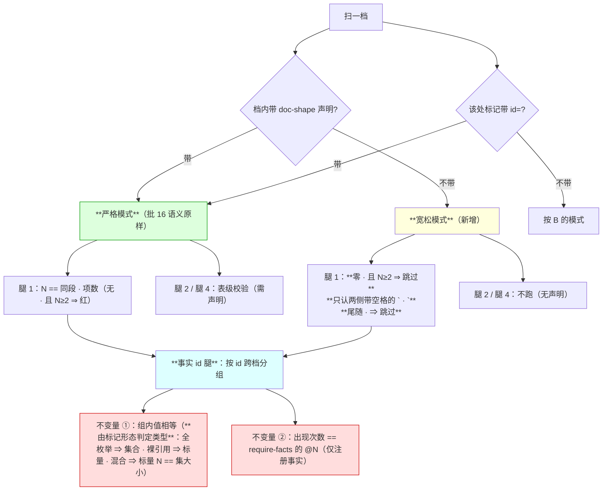
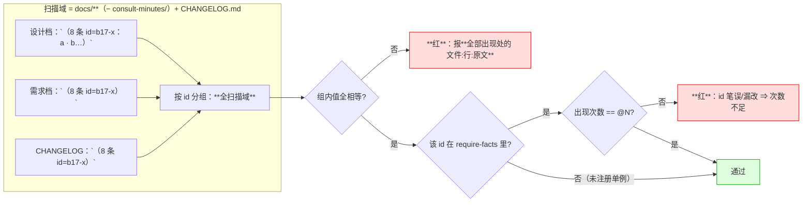
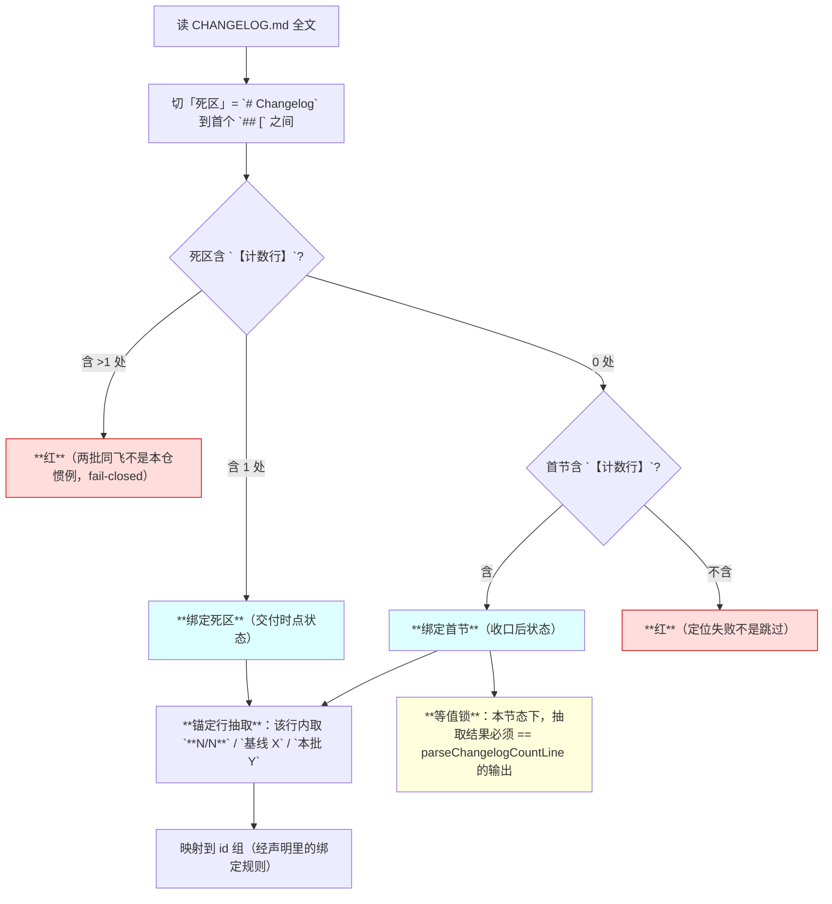
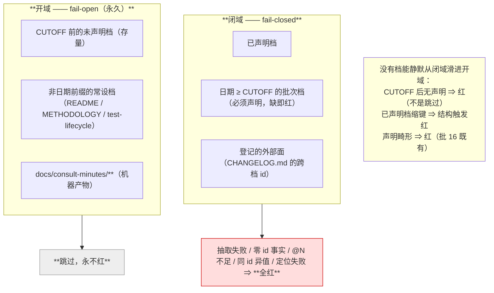
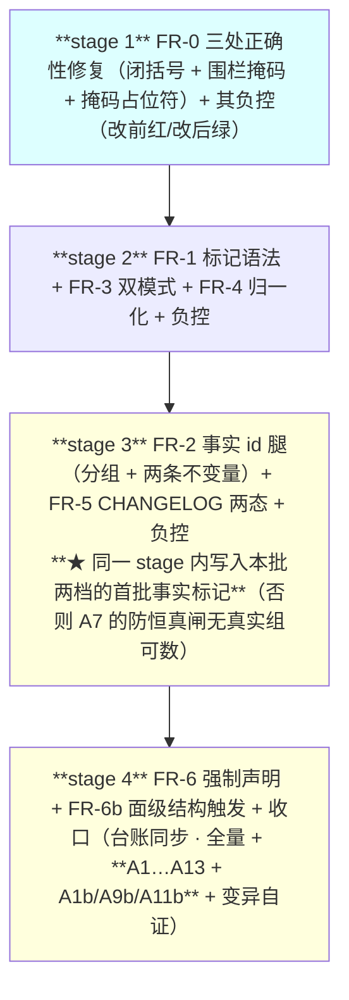

# 设计：谓词作用域与宣言对齐 —— 批 17

- 日期：2026-09-16
- 需求档：[`2026-09-17-scope-alignment-requirements.md`](./2026-09-17-scope-alignment-requirements.md)（**US-1…US-6** · **N-1…N-7** · §5.1 六项不做 · §5.2 **R-54…R-56**）
- 会诊纪要：[`consult-minutes/2026-09-16-consult-4-minutes.md`](./consult-minutes/2026-09-16-consult-4-minutes.md)（**机制选型**）· [`consult-minutes/2026-09-16-consult-5-minutes.md`](./consult-minutes/2026-09-16-consult-5-minutes.md)（**边界与风险 + 父侧干跑实测**）
- 章节：按 [`METHODOLOGY.md`](../METHODOLOGY.md)：§设计文档的成文流程与必备章节 **九节**（§1 背景 · §2 问题 · §3 目标 · §4 决策与理由 · §5 方案 · §6 机制伪代码 · §7 状态与 schema · §8 防偏离 · §9 边界）+ **§10 受影响文件与验收** + **§11 变更记录** + **§12 评审落档**
- 图示：**图 1**（两条腿的双模式真值表）· **图 2**（事实 id 的分组与两条不变量）· **图 3**（CHANGELOG 两态定位器）· **图 4**（域分离：闭域 fail-closed / 开域 fail-open）
- 状态：**设计待评审**

<!-- doc-shape
anchors: 机验锚
acs: 验收标准
require-facts: b17-测试档数@2|b17-全量用例数@1 bind=changelog.nsN|b17-用例增量@1 bind=changelog.added
-->

> ## ⚠️ 读前必读
>
> **1. 本批是纯测试面改动**——`lib/**` 零改动，**不需要重启 DSH**。**`release-check.mjs` 也零改动**（CHANGELOG 的既有契约原样保留，本批只读它）。
>
> **2. ★ 本批的头号想法已被实测否掉**：会诊原议「让腿 1/腿 3 全档常开」，**父侧干跑 62 档实测（as-of 时点）：腿 3 常开会让存量档红 34 处**（裸模块名）⇒ **常开不作本批增量**（详见 §4 的 **D17-0** 与 §9）。**⇒ 本批的增量只剩事实 id 腿。** **★ 该数随语料与掩码漂移：分歧审计复算得 26（见 §12.4）——决策不受影响（26 > 0），但引用它必须带 as-of。**
>
> **3. ★ 本批抓不到什么，写在前面**（防「宣言写得比机制大」）：**P-1「宣称已改而锚行未动」不抓**——那是「留痕 vs git diff」族，**不是可数事实**。**散文里的计数不抓**（N-1 的既定天花板）。**语义相反不抓**（「新增 8」与「删除 8」数值同即绿）。**逐条见 §3.1 与 §9。**
>
> **4. 定位口径**：本档行号仅 as-of；**一切改动按符号/字面锚定**。
>
> **5. 自应用陷阱**（批 16 评审 #18 的教训）：**本档里的标记示例全部住行内代码 span 内**，否则谓词吃自己的示例；**负控必须在临时档裸写**。

---

## §1 背景

批 16 交付了四条文档形状谓词（`v0.24.0`），**它能工作**——但**只扫两处**：**档内声明的锚表与 AC 表**。

**分歧审计的结论句是本批的立项来源**：

> **「谓词不是错的——是它的作用域与它的宣言不匹配。」**

**⇒ 而批 16 全周期的失败统计坐实了这句话**：**「任何『改了两处之一』都不算修好」这条规矩由批 16 自己立，而它在父侧手里复发了五次**——**六次全部落在谓词作用域之外**（需求档 §2.2 的 P-1…P-6）。

---

## §2 问题（**带出处**）

逐条见需求档 §2.2 的 **P-1…P-6**。**本节只补两条会诊带来的定性**：

| 定性 | 出处 | 含义 |
|---|---|---|
| **六次逃逸不全是「不声明」** | `kimi-k3`（会诊 #5） | 批 16 两档**都声明了**，逃逸发生在「**事实未标记**」（P-6 的散文 9 条）与「**档外**」（P-4 的 CHANGELOG）⇒ **单一招堵不住，要分层** |
| **腿 1/腿 3 本就是全档扫描** | `kimi-k3`（会诊 #5） | `checkCountMarks` 遍历全部行、**从不检查「是否在声明表内」** ⇒ **需求档 US-1 初稿写的「放开表级限制」是个不存在的限制**——**本批的真实增量是「带 id 后参与跨处比对」** |

---

## §3 目标

| # | 目标 | 验收面 |
|---|---|---|
| G1 | **同一可数事实在多处出现时被自动分组比对**，不一致 ⇒ 红且报全部出现处 | AC-1 · AC-2 · AC-3 |
| G2 | **未声明的批次档不再静默逃出作用域** | AC-8 · AC-9 |
| G3 | **批 16 的四条腿与八条负控一条不退化** | AC-11 |
| G4 | **`CHANGELOG.md` 被覆盖（跨档 id）且与既有解析器不打架** | AC-6 · AC-7 |
| G5 | **两处既有正确性缺陷顺带修掉** | AC-4 · AC-5 |
| G6 | **每条新腿与每条保守约束各自被证明会红** | AC-10 · AC-12 |

### §3.1 非目标（**★ 会诊硬要求：不许把宣言写得比机制大**）

| # | 不做 / 抓不到 | 理由 |
|---|---|---|
| 1 | **★ P-1「宣称已改而锚行未动」抓不到** | 那是「**留痕 vs git diff**」族，**不是可数事实**——它没有「值」可比。**本批明示登记，不用机制兜** |
| 2 | **散文里的计数抓不到** | N-1 的既定天花板（**正则猜中文误报 62%**）；**值只从标记载荷取** |
| 3 | **语义相反抓不到** | 「新增`（8 条 id=X）`」与「删除`（8 条 id=X）`」**数值同 ⇒ 绿**——**机制只证数值同一，不证语义同一**。**★ 实施期修复：初稿这两处示例裸写（未包代码 span）⇒ 它们自己凑成一个「≥2 出现处的组」，把 A7 的防恒真闸从名义上满足了**——**这正是批 16 评审 #18「自应用陷阱」的同物种**；今包进 span，且收口处补了一条「**注册事实里必须 ≥1 个真的多次出现**」的断言 |
| 4 | **「锚定现实」不作本批** | docs↔fs / docs↔git 严格更强，但**每个现实抽取器都是新代码面 + 自己的负控**（YAGNI）；**登记为后续方向** |
| 5 | **跑遍全档的两条腿** | **★ 已被实测否掉**：腿 3 常开 ⇒ 存量档红 34 处（见 §4 D17-0） |
| 6 | **覆盖 `README.md`** | 沿需求档 §5.1 第 1 项（它与 `docs/` 形态完全不同） |

---

## §4 决策与理由

| # | 决策 | 为什么 | 被否决的备选与理由 |
|---|---|---|---|
| **D17-0** | **★ 两条既有腿不做「全档常开」** | **父侧干跑 62 档实测（as-of 测量时点）：腿 3 常开 ⇒ 不可解析 34 处**（`docs/2026-09-05-defect-registry.md` 的 `advisor.mjs`×9 · `eng.mjs`×2 · `client.js`×2 · …**全是裸模块名，作者本就没打算写成仓内路径**）⇒ **= N-2「不追溯存量」被从后门违反** | **否决「全档常开」**（会诊 #5 原议，论据是「53 档 3 处命中」）——**那个观测只覆盖腿 1 的标记形与一家被训练过的仓，不构成外推**；**实测推翻它**。**⇒ 逃逸口改由 D17-4 的日期切点关闭**（本批增量不需要常开）。**★ 分歧审计 `dc4964dd` 复算（见 §12.4）：该数**现测为 26**，且**它随语料与掩码而变** ⇒ **任何引用它的地方必须带 as-of 限定**；**而「26 > 0」使该决策不变** |
| **D17-1** | **事实 id 为核**（`（N 量词 id=X：…）` / `（N 量词 id=X）`） | **唯一能让机器免猜地分组的手段**——**id 即「同一性」的断言本身**；三家独立同结论 | **否决 `(iii)` 成对枚举作通则**：**它把同一事实的副本数最大化 ⇒ 编辑点最大化 ⇒ 漂移面最大化**（`kimi-k3`：**重复是敌人**）；**维持 `compare` 现状不扩**（它已覆盖它擅长的那一类）。**否决 `(ii)` 单一权威表作机制**：Markdown 无活引用 ⇒ **指针处仍要写值** ⇒ 与 `(i)` 同构（`kimi-k3`）；**降为写作纪律**（与 D2/D3 同源） |
| **D17-2** | **`require-facts: id@N` 锁「注册事实」的出现次数** | **堵 D17-1 自己的 fail-open 缝**：**id 笔误 ⇒ 同一事实裂成两个单例组 ⇒ 组内自洽 ⇒ 静默绿**（`glm-5.3` 给的论证；**那正是 P-1 的变异形态**） | **否决「普适单例必红」**（`glm-5.3` 初版主张）——**「一次事实只出现一次」是常态**，普适会误伤；**⇒ 只锁注册事实**（`kimi-k3` 的不对称，更准） |
| **D17-3** | **全枚举形禁止省略** | **集成事实**（`deepseek-v4-pro`）：**腿 1 判据是「N == 同段 `·` 项数」** ⇒ `（8 项 id=X：a · b…）` **照字面写进真档必红**。**全枚举的唯一一处就是要写全的** ⇒ **复用腿 1 现有判据，零新增代码** | **否决「允许省略 + 部分集合跳过比对」**：其失败形态是**「省略背后的项替换永远不可见」**——**用一个不可见的洞换一个可见的红，不划算** |
| **D17-4** | **日期切点常量 + 批次档强制声明** | **关掉「整档不进作用域」这个口**：`docs/` 顶层、文件名匹配 `^YYYY-MM-DD-` 且日期 ≥ `2026-09-16` ⇒ **必须带声明**。**未带日期前缀的常设档天然不匹配 ⇒ 零清单维护**；**存量档日期全在切点前 ⇒ 零触动** | **否决「按 `docs/README.md` 索引日期」**（`glm-5.3` 的形态）——**多一跳**（要读索引再映射回档），而**档名日期前缀是自带的**（本仓实测一致）。**否决「默认面清单」单独用**（`glm-5.3` 自己指出）：**默认面只能默认自识别腿，配置腿的逃逸口它堵不住** |
| **D17-5** | **双模式真值表**：未声明档宽松 · **声明档保持批 16 严格** · **带 `id=` 一律严格** | **N-3 由此不退化**（声明档的教学功能不丢）；**而未声明档的宽松挡掉七个反例**（§9） | **否决「普适严格」**（会让本仓下一个会话踩 CE-4：**项含代码 span ⇒ 被掩成空格 ⇒ actual=0 ⇒ 必红**）· **否决「普适宽松」**（会让声明档失去约束力） |
| **D17-6** | **`mode: exempt` 取最小机制**：独键 + 必带理由 + **写在非日期档 ⇒ 红** + **`EXEMPT_BUDGET` 预算常数** + **内容证伪**（exempt 档长出受管面 ⇒ 红） | **「白名单长一行」变成「改一个带注释的常量」** ⇒ **滥用必在 diff 里可见**；**内容证伪是四条里唯一对「时间」免疫的**——**「档在 exempt 时是备忘录，三个月后长成了批次档的体型，没人回去摘牌子」** | **否决 `kimi-k3` 的 R1「双向登记锁」**（豁免集枚举在**谓词档**里）——**它与 D16-3（声明住档内、测试不做第二份真相源）正面相撞**（**`kimi-k3` 自己标注为「有界例外」**）⇒ **预算常数用更小的机制面换来同等可见性**。**R1 登记为后续候选** |
| **D17-7** | **CHANGELOG 两态定位器 + 锚定行抽取（非首例匹配）** | **交付时点新条目落在「死区」**（首个版本头之上），而 `parseChangelogCountLine` **永远只读首节** ⇒ **复用它会把本批绑到上一批的数上 ⇒ 交付时点必红**（`kimi-k3` 指出，**父侧漏掉**）。**锚定行抽取免疫「首例匹配」那颗已知雷**（批 16 踩过） | **否决「复制 `parseChangelogCountLine`」**：**单事实单谓词**——`**N/N**` 的内部可推导性**仍归 `G-常驻3` 独占**（**加性而非重复**） |
| **D17-8** | **归一化只许修呈现，永不许修语义**（元原则） | **每一次归一化都是一次 fail-open 决策**（`kimi-k3`）：**归一只许修整数/trim/空白，永不许修同义词/饰词/量词/散文** | **否决「找数再剥修饰词」**（`glm-5.3`）：**词典永不全 ⇒ 假红或漏**，且**它剥掉的正是方向动词**（「新增 8」与「删至 8」被折叠同值） |
| **D17-9** | **两处既有正确性缺陷顺带修**：**深度感知闭括号**（`（§3）` 式引注截断）· **围栏掩码**（CE-6：围栏块裸奔） | **K3 是四条约束里唯一「既降误伤又升查全」的**（`kimi-k3`）；**CE-6 是修缺陷不是加豁免**（`glm-5.3`） | **不否决（两项均无条件采纳）** |
| **D17-10** | **本批扫描域排除 `docs/consult-minutes/**`** | **理由不是白名单而是范畴**：**机器产物无作者契约**（`deepseek-v4-pro`）——**纪要是逐字记录面，内容不可控且按纪律不能润色**；**★ 代码评审 #1 就地订正：初稿此处写「实测该子目录有 7 处扩展标记形命中」，而该数按分歧审计实测不可复现**（审计读数：原始 43 · 带冒号 23 · 带 `id=` 17 · 枚举 9 · **过已交付机器 = 0**）⇒ **今改用可复现口径「过已交付机器为 0」，并注明 as-of 批 17（见 §12.4 的 F4）** | **否决 ⓐ「围栏感知 + 全纳入」进本批**：它**动了批 16 既有行为 ⇒ 必须复跑 N-3 全量回归**（只读会诊无法证明声明档内现有绿是否依赖扫围栏内容）⇒ **登记为后续**。（**而围栏掩码本身（D17-9）无论如何都做**——它同时是 CE-6 的修复） |

---

## §5 方案（分交付单元 FR-0…FR-6）

### §5.0 图 1：两条腿的双模式真值表（**本批的核心机制图**）



**读图要点**：**分叉点是「有无声明」与「标记是否带 id」**——**四条路径最终汇入事实 id 腿**（**这就是「带 `id=` 一律严格」的实现：无论档声明与否**）。**严格模式与宽松模式的差别只在腿 1 的宽松三约束与腿 2/腿 4 是否跑**。

### §5.0b 图 2：事实 id 的分组与两条不变量



**读图要点**：**不变量 ② 只对注册事实生效**——**「一次事实只出现一次」是常态，普适单例必红会误伤**（D17-2）。**而 id 笔误必然使注册事实的次数不足 ⇒ 当场被抓**。

### §5.0c 图 3：CHANGELOG 两态定位器（**★ 父侧漏掉、会诊补上的那一段**）



**读图要点**：**没有两态定位器，交付时点必假红**——**死区里的新条目与首节里的上一批计数是两件事**。**`【计数行】` 是批 16 条目里已在用的显式标记 ⇒ 本批把它升格为定位契约，零新造语法**。

### §5.0d 图 4：域分离（**失败方向的机械边界**）



**读图要点**：**边界是机械的**（文件名日期 + 声明存在性）——**「没声明就红」只作用于义务存在之处，而义务本身是一个常数** ⇒ **存量零红，张力消解**。

### §5.1 FR-0 三处既有正确性缺陷（**先做，无条件**）

**FR-0a 深度感知闭括号**（`kimi-k3` 的 K3）：现实现 `rest.indexOf("）")` **取首个**全角闭括号 ⇒ **任何 `（§3）` 式引注都会在引注后截断** ⇒ 项数误判。
**修法**：**按全角括号嵌套深度配闭括号**（`（` 深度 +1、`）` 深度 −1、深度归零处才是本标记的闭括号）。
**前置**：无。**后置**：`（3 项：需求档（§3）· 设计档（§7）· 台账（§三））` ⇒ **3 == 3 ⇒ 绿**（改前：截断在第 1 个 `）` ⇒ 1 ≠ 3 ⇒ 假红）。
**⇒ 它同时降误伤、升查全**（把「截断误判」从假红变成正确计数）。

**FR-0b 围栏掩码**（`glm-5.3` 的 CE-6）：`maskCodeSpans` **只认行内 span，不认 ``` 围栏** ⇒ **围栏内的示例裸奔**。
**修法**：**逐档围栏状态机掩码**（进入 ``` 后整块内容掩掉，直到闭合围栏）。
**前置**：无。**后置**：**围栏内的标记与路径一律不受检**（与行内 span 同待遇）。
**★ 影响面自证**：本批的**语法规格块必然住在围栏里** ⇒ **不修则批 17 自己的设计档当场红**。

**★ FR-0c 掩码改「非空白占位符」**（`glm-5.3` 的 CE-4；**★ 评审 #2 指出它此前无宿主——本节补上**）：

**症状**：`maskCodeSpans` 把 span 内容**替换成同长空白** ⇒ **项若整体住在 span 里**（如 ``（2 档：`docs/a.md` · `docs/b.md`）`` 里的两个项）⇒ **项区被掩成空格 ⇒ 段 trim 后为空 ⇒ actual=0 ⇒ 假红**。**⇒ 而本仓文风必然把文件名写成反引号** ⇒ **本仓下一个会话就会踩**。

**修法**：**掩码字符由「空格」改为「非空白占位符」**（如 `\u0000` 或 `§`），使**「该段非空」的判定不受掩码影响**，而**内容仍不可被匹配器读到**。
**前置**：无。**后置**：``（2 档：`docs/a.md` · `docs/b.md`）`` ⇒ **段非空、`·` 两侧皆有内容 ⇒ 2 == 2 ⇒ 绿**（改前：actual=0 ⇒ 假红）。
**★ 与 FR-0b 的顺序**：**围栏掩码（整行级）先于**行内 span 掩码（行级）——**两者都用非空白占位符**。
**★ 对声明档是承重的**：A12 要求本批两档自证，而**本批两档的标记示例正是这种形态**。
**★ 验证面（评审 #2 补入——此前 FR-0c 只有机制、没有锚/负控/AC）**：**锚 A1b** · **负控「FR-0c 占位符」** · **AC-4b**（见 §8.2 与 §10.3）。

### §5.2 FR-1 事实标记语法

| 形态 | 字面 | 值与语义 |
|---|---|---|
| **全枚举形** | `（8 条 id=b17-x：a · b · c · d · e · f · g · h）` | **值 = (N, 项集)**；**禁省略**（D17-3）；**腿 1 的 `N == 项数` 同时生效** |
| **裸引用形** | `（8 条 id=b17-x）` | **值 = N**（无列表可比） |

**id 字符集**：`[^\s（）：·@|]+`——**`@` 与 `|` 必须排除**，因为它们是 `require-facts: id@N|id@N` 的分隔符（**不排除则解析必与 id 打架**，`glm-5.3` 的语法补丁）。
**id 命名**：**批次前缀**（`b17-…`）防跨批撞名；**id 相同即断言同一**——**不同事实必须起不同 id**（诚实且可执行的口径）。
**★ 加严信号**：**带 `id=` 的标记一律走严格模式**，**未声明档也不例外**（K6）——**事实腿的负控语义不依赖宽松档位**。

**★ 腿 4 的锚/AC id 抽取须容许「可选小写后缀」**（**★ 实施期补入——设计档初稿未列此条**）：

**症状**：**本批自己命名的 `A1b` / `A9b` / `A11b` 与 `AC-4b` / `AC-6b` / `AC-9b`，用旧口径根本表达不了**——`\bA[0-9]+\b` 在 `**A1b**` 上**匹配不到**（`1` 与 `b` 之间无词边界），`AC-[0-9]+` 在 `**AC-4b**` 上**截成 `AC-4`** ⇒ 与真 `AC-4` 撞成「**AC 号重复**」（**假红**）。**实测效果：8 条红 → 2 条红。**
**修法**：`SHAPE_ANCHOR_ID_RE = /\bA[0-9]+[a-z]?\b/` · `SHAPE_AC_ID_RE = /AC-[0-9]+[a-z]?/`。
**★ 对无后缀 id 的行为逐字不变**（**批 16 的八条负控腿零回归为证**）。
**★ 已知不对称（如实登记，不在本批修）**：**腿 2 的 `checkComparePair` 未同步放宽**（今日 `leg2Runs = 0`，零影响）。

### §5.3 FR-2 事实 id 腿（跨档分组 + 两条不变量）

**做什么**：**在扫描域内按 id 分组**，对每组执行：
- **不变量 ①（同值）**：组内**标量全相等**；**标记集全相等**（trim 后精确串等值、顺序无关）；**混合形态**（有枚举形与裸引用形）⇒ **标量 N == |集| 已在腿 1 保证**（每个全枚举处都跑腿 1）⇒ 跨处只比标量。
- **不变量 ②（次数）**：**该 id 若在 `require-facts` 里声明了 `@N`** ⇒ **实际出现次数必须 == N**。

**类型声明**（`require-facts` 里带类型，`kimi-k3` 的 R4）：**标量 / 标记集 / 键值对集**。
**★ 而本批未实现类型槽（分歧审计 F2 订正——「宣言比机制大」的又一例）**：**实现只接受 `id@N[ bind=<源>.<槽>]`，无类型槽**；**锚 / AC / 负控表里也没有类型用例**。
**⇒ 处置（诚实登记而非补实现）**：**类型在本批的语义下是「由标记形态自动判定」的**——**全枚举形 ⇒ 集合型；裸引用形 ⇒ 标量型；混合 ⇒ 标量 N == |集|**（**腿 1 已在每个全枚举处保证**）。**⇒ 作者不需要显式声明类型，故类型槽是多余的**；**`kimi-k3` 的 R4 关切（「标量型不比成员」的显式 fail-open）由 §9.3 的 R-3 行覆盖**（**「单枚举处的项替换」已登记为本机制的天花板**）。**⇒ 今把三处「类型」措辞改为「由标记形态判定」。**
**★ 而这条本身是教训**：**会诊提了一个面、我在 §5.3 与 §7 写了它、而实现没有它** ⇒ **「采纳」必须落到 FR/AC/锚/负控四件套里才算数**（**与评审轮 1 的 🔴 #1 同形**）。
**★ 显式 fail-open（写进 §9）**：**标量型事实在多处都用全枚举但成员不同 ⇒ 数值同 ⇒ 绿**——**这是显式选择，不许藏**。

**前置**：无（未声明档也跑，只要标记带 `id=`）。
**后置**：任一不变量破 ⇒ **红**，**报全部出现处的 `文件:行:原文`**（US-2）。

### §5.4 FR-3 腿 1 的双模式（**宽松只作用于未声明档**）

| 档位 | 腿 1 判据 |
|---|---|
| **声明档**（批 16 语义，**原样保留**） | 现三条边界 + **`N == 项数`**；**无 `·` 且 N≥2 ⇒ 红** |
| **未声明档**（新增） | 现三条边界 + **`N == 项数`**，**再加三条宽松约束**：① **段内零 `·` 且 N≥2 ⇒ 跳过**（杀 **CE-1/CE-2/CE-3** 的零段形态）；② **只认两侧带空格的 ` · `**（杀 **CE-1** 的译名 `·`——**★ 评审 #5 订正：初稿此处误写 CE-5，而 CE-5 是省略号形态、由 D17-3 处置**）；③ **尾随 `·`（末段为空）⇒ 跳过**（杀 **CE-7** 的折行形态） |

**★ 判据同源**：两档**共用同一个匹配器**（避免两套正则漂移）。
**★ 名称后缀**：**档内以 `count-marks` 声明的量词**只在声明档生效；未声明档用默认集。

### §5.5 FR-4 归一化（R-1…R-8，**值只从标记载荷取**）

| 规则 | 内容 |
|---|---|
| **R-1** | **标量抽取**：标记取 N 的 `[0-9]+`；**CHANGELOG 取定位器锚定的 `【计数行】` 行内的三个数**（**锚定行抽取，不是正则首例匹配**） |
| **R-2** | **措辞剥离**：「新增 / 基线 / 本批」等**包装词不入等值**——**它们住在标记外的散文里，按构造不进比较面** |
| **R-3** | **集合等值**：元素 **trim 后精确串等值、顺序无关**；**只在 ≥2 处携带枚举时比对** |
| **R-4** | **混合形态**：每个全枚举处**强制 `N == |集|`**（腿 1 既有）；**跨处全部标量相等** |
| **R-5** | **抽取 fail-closed**：注册事实**解析不出值**或**次数 ≠ @N** ⇒ 红；**未注册 / 未命中 ⇒ 不可见**（N-1 天花板，登记） |
| **R-6** | **报错面**：**报全部出现处的 `文件:行:原文`**，**绝不只报归一值**——否则「8 vs 8」对人不可复核 |
| **R-7** | **量词不入等值**：**id 即同一性，量词是呈现**（「8 条」与「8 项」跨档同 id ⇒ 绿） |
| **R-8** | **值域 = 非负整数**；**semver / SHA 类事实不进标记语法**（那是「锚定现实」方向，已登记） |

**★ 元原则（定理性陈述）**：**每一次归一化都是一次 fail-open 决策**——**归一只许修呈现（整数、trim、空白折叠），永不许修语义**（同义词、饰词、量词、散文）。**⇒ 任何更深的文本归一（剥括注、同义词、全半角折叠）都会把真污染洗成绿——禁止。**

### §5.6 FR-5 CHANGELOG 覆盖（两态定位器 + claim 矩阵）

**定位器**（图 3）：**死区含 1 处 `【计数行】` ⇒ 绑死区**（交付时点）· **否则首节含 ⇒ 绑首节**（收口后）· **死区 >1 处或两处都不含 ⇒ 红**。
**抽取器**：在定位到的行上套三条抽取（`**N/N**` / `基线 X` / `本批 Y`）。
**★ 绑定规则语法（评审 #3 补入——此前图 3 / R-1 / 抽取器三处引用它而从未定义）**：
声明键 `require-facts` 的条目扩展为 **`id @N bind=<源>.<槽>`**：
```
require-facts: b17-changelog-count@1 bind=changelog.nsN|b17-changelog-baseline@1 bind=changelog.baseline|b17-changelog-added@1 bind=changelog.added
```
| 源 | 槽 | 抽取 |
|---|---|---|
| **`changelog`** | **`nsN`** | 定位行内的 `**N/N**` 的 **N** |
| **`changelog`** | **`baseline`** | 定位行内的 **`基线 X`** |
| **`changelog`** | **`added`** | 定位行内的 **`本批 Y`** |
**谁声明谁校验**：**绑定语在 `require-facts` 里声明**（**住的档 = draft 设计档**），**谓词按它对该档的 id 组追加一次「CHANGELOG 侧出现」**。
**★ 绑定出现的计数语义（评审 #8 补入——上一条与 A9b 曾不能同时成立）**：**`@N` 只数「档内标记的出现次数」，绑定出现不计入 `@N`**。⇒ 于是 `b17-changelog-count@1 bind=…` 与「docs 侧另有一处同名标记」**可以并存**，且 A9b 的「合法绑定 ⇒ 抽取值 == docs 侧同 id 值」**与它不冲突**（**绑定是一次额外的对等侧，不是第二次出现**）。
**⇒ 示例按此改写**（**绑定形的 `@N` 恒为 1——它说的是「这个 id 在档内至少有 1 处标记」，而绑定侧白送一次**）：
```
require-facts: b17-用例数@2|b17-用例数-changelog@1 bind=changelog.nsN
```
**畸形绑定 ⇒ 红**（fail-closed）：`bind=` 指向**未知源** / **未知槽** / **缺 `@N`** / **同 `bind` 被两个 id 占用** ⇒ **红**。
**★ 为什么是「追加一次出现」而不是「复制 `parseChangelogCountLine`」**：**单事实单谓词**——内部可推导性仍归 `G-常驻3`；**本腿只把 CHANGELOG 的数拉进 id 组做跨档比对**。
**等值锁**：**当条目位于首节时**（收口后状态），**抽取结果必须 == `parseChangelogCountLine` 的输出**（**防两个抽取器漂成两种方言**）。
**★ claim 矩阵**（**单事实单谓词**，评审可据此核对「两两不相交」）：

| 面 | owner | 校什么 | **不校什么** |
|---|---|---|---|
| CHANGELOG **节内形态**（首例可推导） | **`G-常驻3`**（`test/release-check.test.mjs`） | **形态** | **数值**（它故意不校，`:73` 原文「数值不在此断言」） |
| CHANGELOG ↔ docs **跨档数值** | **本批的新腿** | **数值**（**这正是今天没有任何人校的面**） | 节内形态 |
| 台账 §三 ↔ fs 实测 | **`T-LC2`**（既有） | **doc ↔ fs** | doc ↔ doc |
| docs ↔ docs 跨档 | **本批的新腿** | **doc ↔ doc** | doc ↔ fs |

**⇒ 三者 claim 两两不相交，加性而非重复。** **★ 零格式变更**：CHANGELOG 的写法**一个字不用改**，`G-常驻2/常驻3` 的契约**零扰动**。

**★ 死区里的定位标记只许出现一次**（**★ 实施期补入——设计档初稿未写明这条纪律**）：**定位器按 fail-closed 实现（死区 >1 处即红），而它不掩码** ⇒ **写档人若在解释性文字里第二次逐字写下该标记，当场红**。**实施期实测：第一稿的说明性 bullet 里第二次写了它 ⇒ 当场红，改为描述性措辞后绿。** **⇒ 这条纪律必须写在设计档里，否则下一个写档人会再踩一次。**

### §5.7 FR-6 强制声明与 `mode: exempt` 最小机制

**强制声明**（D17-4）：**`docs/` 顶层 · 文件名匹配 `^(\d{4}-\d{2}-\d{2})-` · 日期 ≥ `CUTOFF = "2026-09-16"` · 无 `doc-shape` 声明 ⇒ 红**。

**`mode: exempt`**（D17-6，**四道闸**）：

| # | 闸 | 判据 |
|---|---|---|
| 1 | **独键** | `mode: exempt` 必须是声明的**唯一**键；与 `anchors`/`acs`/`compare`/`count-marks`/`require-facts` 任一并存 ⇒ **红** |
| 2 | **必带理由** | `mode: exempt` 后必须跟非空理由文本；缺 ⇒ **红** |
| 3 | **只许写在日期前缀档上** | 写在非日期档上 ⇒ **红**（exempt 只为「日期 ≥ CUTOFF 而无契约可声明」的档存在） |
| 4 | **内容证伪** | exempt 档内出现任何 `（N 量词` 标记 / 带 `id=` 的标记 / **首列匹配 `AC-\d+` 的表** / **首列匹配 `A\d+` 的表** ⇒ **红**（**「声称无可数事实的档长出了可数事实」**）。**★ 评审 #11 订正：初稿只列了 AC 形表、漏了锚形表；★ 代码评审 #3 补入掩码不对称：标记侧在 `shapeMaskDoc(text)`（已掩码）上判、表侧在 `shapeTableShapes(text)`（原始文本）上判** ⇒ **围栏内的标记不报、而围栏内的表形会报**——**今日 exempt = [] ⇒ 零影响，但这条不对称必须写明** |

**`EXEMPT_BUDGET` 预算常数**：**全域有效豁免数 > 预算 ⇒ 红**（初值 **2**——**★ 评审 #1 追问依据，见下方 FR-6b 后的「初值出处」**）。

### §5.7b FR-6b 面级结构触发（**★ 评审 #1 补入：会诊 #4 分歧② 采纳的「三层堵口」的第二层此前被静默丢弃**）

**症状（设计自己的图 4 曾宣称它，而 FR/AC/锚/负控里一个都没有）**：**已声明档可以「声明了 doc-shape 但不声明 `anchors`/`acs`」** ⇒ **腿 4（AC ↔ 锚互引）永不跑** ⇒ **档内的 AC 表逃出作用域**。**⇒ 这是「档内缩作用域」那个口的唯一堵法。**

**机制**：**已声明档内，结构可检的面自动成为义务**——
| 档内结构 | 义务 |
|---|---|
| 出现**首列 cell 匹配 `AC-\d+` 的表** | **`acs` 键必填**，缺 ⇒ **红** |
| 出现**首列 cell 匹配 `A\d+` 的表** | **`anchors` 键必填**，缺 ⇒ **红** |

**★ 这是结构检测，不是中文猜测**（与 N-1 兼容）——**判据是表格首列的机械形态**。
**前置**：该档带声明。**后置**：命中结构而缺键 ⇒ **红**，报「档内有 AC 形表而无 `acs` 键」。
**★ 爆炸半径**：**只在已声明档**（今日实测 = 本批两档）——**未声明档不跑**（fail-open，与图 4 的域分离一致）。
**★ 与 exempt 的关系**：**exempt 四闸的第 4 条（内容证伪）用的正是同一个结构检测器**——**「有表 ⇒ 键必填」与「有表 ⇒ exempt 作废」是同一判据的两个方向**。

**★ `EXEMPT_BUDGET` 初值 2 的出处（评审 #1 追问答）**：**它没有实测出处**——**会诊建议 2，我照抄**。**⇒ 据实登记为「未实测的初值」**，并给两条约束：① 它**只是一个防「静默生长」的可见性旋钮**，**其数值本身不承载判据**（超预算红是「被看见」而不是「被判定」）；② **首次 bump 时必须在该次提交里写明理由**（与 `CUTOFF` 同款：**常量的每次变更都是一次显式动作**）。
**⇒ 「白名单长一行」变成「改一个带注释的常量」**——**清单静默生长，常数必须被显式 bump，diff 里一眼可见**。
**★ 威胁模型**：**漂移，不是对抗**——**全文本世界没有「不可能滥用」**（对抗者可改常量本身，与「谎报档名日期可逃逸」同族）。**写清模型比假装防住诚实。**

---

## §6 机制伪代码（含前置/后置条件）

```js
/**
 * FR-0a：深度感知闭括号（kimi-k3 的 K3）。
 * @pre   `rest` 是标记之后的同段文本
 * @post  返回**与本标记配对**的闭括号下标；嵌套 `（§3）` 不被误当结尾
 *        ★ 改前取首个 `）` ⇒ 任何全角嵌套引注都截断列表
 */
function findMatchClose(rest) { /* 全角深度计数：`（`+1 / `）`-1 / 归零即本标记的闭 */ }

/**
 * FR-0b：围栏状态机掩码（CE-6）。
 * @pre   逐档调用，维护跨行状态
 * @post  围栏内整块内容被掩成**同长非空白占位符** ⇒ 其内的标记与路径不受检
 *        ★ 与行内 span 同待遇；★ 本批自己的语法规格块靠它才不误红
 *        ★ **评审 #10 订正**：初稿此处写「同长空白」，与 FR-0c 的占位符语义相抵触
 */
function maskFenced(line, st) { /* st = { inFence } */ }

/**
 * FR-1/FR-2：事实标记的匹配与分组。
 * @pre   无
 * @post  hits = [{ file, line, id|null, n, items|null }]；**id 为 null = 普通计数标记**
 *        ★ id 字符集排除 `@` 与 `|`（它们是 require-facts 的分隔符）
 *        ★ **全枚举形禁省略**：项集就是全部项，判据复用腿 1 的 `n == items.length`
 */
function parseFacts(text, file) { /* ... */ }

/**
 * FR-2：跨档分组 + 两条不变量。
 * @pre   扫描域 = docs/**（− consult-minutes/）+ CHANGELOG.md
 * @post  不变量①：组内标量/集合全相等 ⇒ 否则红，**报全部出现处的 文件:行:原文**
 *        不变量②：**仅注册事实**：出现次数 == require-facts 的 @N ⇒ 否则红
 *        ★ 未注册的单例 id **不红**（「一次事实只出现一次」是常态）
 *        ★ 全域至少 1 个「≥2 出现处的组」⇒ 否则红（**防恒真**，D16-7 同律）
 */
function checkFactGroups(hits, requireFacts, budget) { /* ... */ }

/**
 * FR-3：腿 1 的双模式。
 * @pre   `declared` 指示该档是否带声明；`hasId` 指示该处是否带 id=
 * @post  严格档位（declared ∨ hasId）⇒ 批 16 语义
 *        宽松档位（!declared ∧ !hasId）⇒ 宽松三约束：零 `·` 且 N≥2 跳过 ·
 *        只认 ` · `（两侧带空格）· 尾随 `·` 跳过
 */
function checkCountMarks(text, marks, file, { declared }) { /* ... */ }

/**
 * FR-5：CHANGELOG 两态定位器。
 * @pre   CHANGELOG 全文
 * @post  死区含 1 处 `【计数行】` ⇒ 绑死区；否则首节含 ⇒ 绑首节；
 *        死区 >1 处 或 两处都不含 ⇒ **红**（fail-closed，定位失败不是跳过）
 *        ★ 只读 `release-check.mjs` 的既有导出，**一个字符都不改它**
 */
function locateCountLine(changelogText) { /* ... */ }

/**
 * FR-6：强制声明 + exempt 四道闸。
 * @pre   docs/ 顶层档名与内容
 * @post  日期 ≥ CUTOFF 且无声明 ⇒ 红；exempt 档违反四闸任一 ⇒ 红；
 *        全域豁免数 > EXEMPT_BUDGET ⇒ 红
 */
function checkDeclarationDuty(files, cutoff, budget) { /* ... */ }
```

---

## §7 状态与 schema（**谁写谁读**）

**本批不新增任何持久化状态、不改任何运行时 schema**——它是**测试面的静态谓词**。

| 面 | 本批的动作 | 谁写 | 谁读 |
|---|---|---|---|
| **档内的 `doc-shape` 声明** | **新增两个键**：`require-facts`（**`id@N[ bind=<源>.<槽>]`**）· `mode`（仅 `exempt`）——**★ 分歧审计 F2 订正：初稿此处写「含类型」，而 `parseRequireFacts` 只接受 `id@N[ bind=…]`、无类型槽**，见下方「类型面」条 | **写档的人**（主代理 / eng_coder 按任务书） | **谓词** |
| **档内的事实标记**（`（N 量词 id=X：…）`） | **新增语法** | **写档的人** | **谓词**（`parseFacts`） |
| **`test/doc-hygiene.test.mjs`** | 追加 **FR-0…FR-6** + 负控 | eng_coder（**任务书指名该档**——D1 例外） | `node --test` |
| **`docs/test-lifecycle.md`** §三/§七 | 计数同步（`T-LC2` 等值锁） | **主代理定内容、eng_coder 落笔**（D1 任务书指名例外） | `test-lifecycle.test.mjs` |
| **`release-check.mjs`** | **零改动** | — | 本批**只读**它的导出 |
| **新增持久化 / 配置键** | **无** | — | — |

> **★ 一处「谁读」的关键变化**：**`docs/*.md` 与 `CHANGELOG.md` 从「只有人读」变成「也有谓词读」**——**但前者仅限自带声明的档（及其带 id 的标记），后者仅限 `【计数行】`**。

---

## §8 防偏离

### §8.1 零改面

| # | 面 | 判据 |
|---|---|---|
| 1 | **`lib/**` 零改动** | `git diff --stat -- lib/` 空 |
| 2 | **`release-check.mjs` 零改动** | `git diff --stat -- release-check.mjs` 空 |
| 3 | **`test/release-check.test.mjs` 零改动** | 同上 |
| 4 | **不新增测试档** | `test/*.test.mjs` 数不变（**20**） |
| 5 | **零 `test.skip` / `test.only`** | 既有 `G-常驻1` 锁 |
| 6 | **`docs/consult-minutes/**` 零改动** | 本批**只排除不修改** |
| 7 | **存量 `docs/**` 零改动** | 除本批两档 + `docs/README.md` + `docs/test-lifecycle.md` 外零 diff |
| 8 | 六串零命中（`lib/**`）· `failStop(` 恒 18 | 既有锁 |

### §8.2 机验锚（**三要素写全：检索目标 / 谓词 / 期望**）

| 锚 | 检索目标 | 谓词 | 期望 |
|---|---|---|---|
| **A1** | `test/doc-hygiene.test.mjs` | `grep 'function findMatchClose'` 且**构造 `（3 项：需求档（§3）· 设计档（§7）· 台账（§三））`** | 定义恰 1 处；**该构造判 3 == 3 ⇒ 绿**（改前必红） |
| **A1b** | 同上 | **FR-0c 占位符掩码**（**★ 评审 #2 补入**） | 存在断言：**项整体住在代码 span 里时，段仍判非空** ⇒ ``（2 档：`a.md` · `b.md`）`` **判 2 == 2 ⇒ 绿**（改前 actual=0 ⇒ 假红） |
| **A2** | 同上 | `grep 'maskFenced'` 且**构造围栏内的标记与路径** | 定义恰 1 处；**围栏内一律不受检** |
| **A3** | 同上 | `grep 'parseFacts'` 且构造两种形态 | 全枚举形与裸引用形**都能被识别**；**全枚举形的项数 == N** |
| **A4** | 同上 | **id 字符集** | 含 `@` 或**竖线**的 id **不被接受**（与 `require-facts` 解析不打架）。**★ 实施期 STOP 修复：初稿此格内有一个未转义的字面竖线 ⇒ 该行多出一列 ⇒ 闸 A 红；且它在任何 Markdown 渲染里都会切列**（**腿 4 的闸 A 按竖线切且不认反斜线转义，故本格内不得出现该字符——含说明文字**） |
| **A5** | 同上 | **不变量①**（同 id 异值） | 存在断言；**报错含全部出现处的 `文件:行`** |
| **A6** | 同上 | **不变量②**（`require-facts` 的 `@N`） | 存在断言；**未注册的单例 id 不红**（阴性对照在位） |
| **A7** | 同上 | **防恒真** | 存在「全域 ≥1 个多次出现组」断言（`D16-7` 同律） |
| **A8** | 同上 | **双模式真值表** | 未声明档**三条宽松约束**各有断言；**声明档保持批 16 语义**（N-3） |
| **A9** | 同上 | **`locateCountLine` 两态** | 死区态与首节态**各有断言**；**死区 >1 处 与 都不含 ⇒ 红** |
| **A9b** | 同上 | **绑定规则三槽**（**★ 评审 #3 补入**） | `changelog.nsN` / `.baseline` / `.added` **三槽各有抽取断言**；**畸形绑定三条各有一条负控**；**合法绑定 ⇒ 抽取值 == docs 侧同 id 值** |
| **A10** | 同上 | **`checkDeclarationDuty`** | 日期 ≥ CUTOFF 无声明 ⇒ 红；**CUTOFF 前无声明 ⇒ 绿**（边界不是恒红） |
| **A11** | 同上 | **exempt 四闸 + `EXEMPT_BUDGET`** | 四闸**各有一条负控**；**`EXEMPT_BUDGET` 超预算 ⇒ 红** |
| **A11b** | 同上 | **FR-6b 面级结构触发**（**★ 评审 #1 补入**） | 存在断言：**已声明档内有 AC 形表而无 `acs` 键 ⇒ 红**；**有锚形表而无 `anchors` 键 ⇒ 红**；**阴性对照：普通表（首列非 `AC-\d+`/`A\d+`）⇒ 不红**；**未声明档 ⇒ 不跑**（fail-open） |
| **A12** | 本批两档 | `grep 'doc-shape'` | **两档都带声明**，且**各有 ≥1 条 `require-facts`**（**机制对自己生效**） |
| **A13** | 全仓 | 存量档零新红 | **全量用例数 = 基线 464 + 本批新增**；**存量档不新增任何红** |

> **★ 负控腿（每条新腿 + 每条保守约束各自一条，D16-6）**——**全部在仓外临时档 / 内存夹具上做**（D5），**做完即弃、仓内零残留**：
> | 腿 / 约束 | 负控构造 | 必须红在哪 |
> |---|---|---|
> | 事实腿 · 同值 | 同 id 两处异值 | 不变量①断言 + **报出两处** |
> | 事实腿 · 次数 | 注册 id 只出现 1 次（@2） | 不变量②断言 |
> | 事实腿 · 恒真 | 全域零个多次组 | A7 的防恒真断言 |
> | **FR-0a 闭括号** | `（3 项：a（§1）· b · c）` | **改前红 / 改后绿**（一条腿证两态） |
> | **FR-0c 占位符**（**评审 #2 补入**） | ``（2 档：`a.md` · `b.md`）``（项**整体**住在 span 里） | **改前红（actual=0）/ 改后绿（2 == 2）** |
> | **FR-0b 围栏** | 围栏内裸写 `（3 项：a · b）` 与 `](不存在.md)` | **不受检** |
> | **宽松约束①**（零 `·` 跳过） | 未声明档写 `（3 项：甲、乙、丙）` | **跳过（不红）**；**声明档同构造 ⇒ 红** |
> | **宽松约束②**（只认 ` · `） | 未声明档写 `（2 项：a·b）`（无空格） | **跳过** |
> | **宽松约束③**（尾随 `·`） | 未声明档写 `（2 项：a ·` + 换行 `b）` | **跳过** |
> | 强制声明 | CUTOFF 后无声明档 | 红；**CUTOFF 前无声明档 ⇒ 绿**（阴性） |
> | exempt 四闸 | ①独键 ②理由 ③非日期档 ④内容证伪 各一构型 | 四个断言各自红 |
> | exempt 预算 | 有效豁免数 > `EXEMPT_BUDGET` | 红 |
> | **FR-6b 结构触发**（**评审 #1 补入**） | ① 已声明档内有 AC 形表而**不声明 `acs`** ⇒ 红；② 同上但锚形表 ⇒ 红 | 两条各自红；**阴性对照：普通表 ⇒ 不红 · 未声明档 ⇒ 不跑** |
> | **绑定规则**（**评审 #3 补入**） | ① `bind=` 指向**未知源/槽** ⇒ 红；② **缺 `@N`** ⇒ 红；③ **同 `bind` 被两个 id 占用** ⇒ 红 | 三条各自红；**阴性对照：合法 `bind=` ⇒ 抽取值与 docs 侧同值** |
> | CHANGELOG 两态 | 死区态 / 首节态 / 死区两条计数行 / 都不含 | 前两态各自正确绑定；后两态红 |
> **且必须区分真红/假红**：断言级红 = 真红；`ReferenceError` / 整档崩溃 = 假红。

---

## §9 边界（**★ 会诊硬要求：逐条进本节，不留给评审去发现**）

### §9.1 六类边界

| 类 | 本批必须定义的行为 | 方向 |
|---|---|---|
| **空集** | **全域零个多次出现组 ⇒ 红**（防恒真）· **声明的 `require-facts` id 整档缺失 ⇒ 红** · **`【计数行】` 定位失败 ⇒ 红** · **锚表/AC 表定位不到 ⇒ 红**（批 16 既有） | **fail-closed** |
| **畸形输入** | **声明键未知 / 缺冒号 / 空值 ⇒ 红**（批 16 既有）· **`mode: exempt` 与配置键并存 ⇒ 红** · **id 含 `@` 或 `|` ⇒ 不接受** · **exempt 无理由 ⇒ 红** | **fail-closed** |
| **并发** | **不适用**（测试期静态读文件） | — |
| **重启** | **不适用**（本批不改 `lib/**` ⇒ **无需重启**） | — |
| **升级** | **新增两个声明键**（`require-facts` / `mode`）；**未知键 ⇒ 红**（批 16 D17-fail-closed 沿用）· **新增标记语法**（`id=` 段）；**旧标记（无 id）保持合法** | 旧语法**不退化** |
| **失败方向** | **域分离**（图 4）：**闭域全 fail-closed · 开域永久 fail-open**。**没有档能静默从闭域滑进开域** | 见左 |

### §9.2 ★ 七个反例与五条保守约束（**会诊产出，逐条登记**）

| # | 反例（**构造示例住行内 span**） | 机理 | 本批处置 |
|---|---|---|---|
| **CE-1** | `（3 项：让-保罗·萨特 · 西蒙娜·德·波伏瓦 · 阿尔贝·加缪）` | 译名内 `·` 无空格；实现按**每个** `·` 裂段 ⇒ 3 人裂成 6 段 | **宽松约束②**（只认 ` · `）⇒ 未声明档跳过；**声明档仍按原语义** |
| **CE-2** | `（3 项：` + 换行 + `甲乙丙）` | 行内无 `）` ⇒ `seg` 取整行余部 ⇒ actual=0 | **宽松约束①**（零 `·` 且 N≥2 ⇒ 跳过） |
| **CE-3** | `（4 步：①…②…③…④…）` / `（3 项：甲、乙、丙）` | **顿号/带圈序号是中文第一枚举习惯**；零 `·` ⇒ actual=1 | **宽松约束①** |
| **CE-4** | `（2 档：``docs/a.md`` · ``docs/b.md``）` | **`maskCodeSpans` 把项掩成空格 ⇒ 段全空 ⇒ actual=0** —— **★ 本仓文风必然这么写文件名** | **FR-0c 占位符掩码**（**★ 评审 #2 订正：初稿此处指针写「见 §9.3」，而 §9.3 是归一化失败形态表、不含此语义**）+ **宽松约束①**（零段） |
| **CE-5** | `（8 项：a · b …）` | `…` trim 后非空、算一段 ⇒ actual=3 | **D17-3 全枚举禁省略** + **宽松约束①**（省略形在未声明档亦跳过） |
| **CE-6** | 语法示例写进**围栏块** | 掩码器只认行内 span ⇒ **围栏内容裸奔** | **FR-0b 围栏掩码**（修缺陷，非豁免） |
| **CE-7** | `（2 项：a ·` + 换行 + `b）` | 尾随 `·` 的段为空 ⇒ 若宽松处理会被凑成 2 | **宽松约束③**（尾随 `·` ⇒ 跳过） |

**五条保守约束的代价（如实登记）**：**常开档里 CE-2/3/5 形态的真漂移「不可见」（跳过 ≠ 抓到）**——它们**只在声明档严格模式下被抓**。**这是「常开 = 免费扩面」的折扣，防 US-1 超卖。**

### §9.3 ★ 归一化的失败形态（**逐条登记：哪类真漂移会被哪条规则放过**）

| 规则 | 放过的真漂移 | 定性 |
|---|---|---|
| **R-1/R-2** | **零数值漂移**；只放过「**同数字异事实**」的跨接（id 写错使两个不同事实同值共组） | **作者错误类**，靠**报全部出现处** + 评审兜 |
| **R-3** | **★ 单枚举处的项替换**（N 不变、全仓只有一处全枚举 ⇒ 集合无对等侧） | **本机制的天花板**——**「重复是敌人」的直接代价**；**键值对集**（**若将来实现类型面，它可给表背事实补对等侧**——**本批未实现，见 §5.3**） |
| **R-4** | 无（判据两处独立执行互相兜底） | — |
| **R-5** | **未标记的散文计数**（**P-6 的原文形态**） | **N-1 既定天花板** |
| **R-7** | **量词漂移不可见**（条↔项↔档） | 显式选择（R-7 的理由是「id 即同一性」） |
| **R-8** | **全角数字 `（８ 条：…）` 与中文数字 `（八条：…）` 整标记不可见** | **既定天花板**（不猜、不追溯） |
| **FR-5** | **CHANGELOG 条目散文里的计数不受绑**（散文写「新增 8 条」而计数行写 `本批 9` ⇒ 跨档腿只看计数行） | **既定天花板** |
| **FR-6** | **文件名日期前缀游戏**（新档不取日期名 ⇒ 天然豁免） | **★ 这是 D17-4 的固有边界，不是 exempt 引入的**——由 `R-25` 索引登记兜底 + 人眼看索引 diff |

### §9.4 ★ 诚实残差清单（**本批抓不到什么——不许把宣言写得比机制大**）

| # | 抓不到 | 理由 |
|---|---|---|
| **1** | **P-1「宣称已改而锚行未动」** | **「留痕 vs git diff」族，不是可数事实**——没有「值」可比 |
| **2a** | **散文里的计数 —— ★ 永久否决（2026-09-17 批 18 订正）** | **本行原写「N-1 天花板（正则猜中文误报 62%）」。批 18 经两轮会诊（三家独立同结论）+ 三条 stage-0 实测，把这条判为「永久不机械化」：① **62%**（批 16 需求档 §2.3 P-9，通用量词正则）· ② **`AC N` 文法 79 处命中 / 1 处真缺陷 ≈ 1.3% 精度** · ③ **版本文法换分母（只在未密封作用域内数）仍是 63 处**。⇒ **「让机器读散文的立场」三次实测判死**；出处见 [`consult-minutes/2026-09-17-consult-12-rulings.md`](./consult-minutes/2026-09-17-consult-12-rulings.md) §3。 |
| **2b** | **同一事实在散文里的两处不等 —— ★ 改归纪律面** | **不服谓词管，改由写作纪律 W1–W3 管**（[`METHODOLOGY.md`](../METHODOLOGY.md)：§写作立场纪律 W1–W3）——**W1「裸写即现状」把「散文里的裸数」从「机器猜」变成「作者声明」；W3 使过期现状陈述在结构上变成一条正确的历史陈述**。**违反 W 系的发现通道 = 评审与人眼**（除批 18 交付的那条窄腿，它只覆盖 CHANGELOG 内的令牌值一致）——**不许写成「已机器化」。** |
| **3** | **语义相反**（「新增 8」vs「删除 8」） | **机制只证数值同一，不证语义同一** |
| **4** | **引文顶替**（作者删掉一处，而纪要恰好逐字引用了它 ⇒ 计数仍够） | **散文逐字引用堵不住**；机械部分是「**引文必进 span/围栏**」纪律 + 围栏掩码 |
| **5** | **单枚举处的项替换**（R-3） | 「重复是敌人」的代价 |
| **6** | **CHANGELOG 同节两处推导式**（批 16 的 P-5 形态） | **★ 状态更新（2026-09-17 批 18）：本条由「登记为后续候选」→「批 18 兑现」**——**但兑现形态与初版措辞不同**：`consult #13` 四家一致指出**「只读首节 · 各恰 1 处」会第三次踩同一颗雷**（**批 17 弃它的理由就写在上一行**：「要改写批 16 条目 ⇒ 超范围」）⇒ **改基为「FR-5 绑定源内令牌值一致 + span 掩码 + 边界不确定则 fail-closed 不回退」**；判据逐字冻结于 [`consult-minutes/2026-09-17-consult-13-rulings.md`](./consult-minutes/2026-09-17-consult-13-rulings.md) §3 |

### §9.5 威胁模型

**★ 漂移，不是对抗。** **全文本世界没有「不可能滥用」**——对抗者可以改 `EXEMPT_BUDGET` 常量本身、可以给档起一个不带日期前缀的名字。**⇒ 本批的全部机制针对「无意漏改」**；对抗面**登记为已知边界**，不假装防住。

---

## §10 受影响文件与验收

### §10.1 实施域

| 文件 | 改动 | 类型 |
|---|---|---|
| `test/doc-hygiene.test.mjs` | **FR-0…FR-6** + 全部负控腿 | **修改（核心，任务书指名——D1 例外）** |
| `docs/2026-09-17-scope-alignment-requirements.md` · `docs/2026-09-17-scope-alignment-design.md` | **★ 写权 = 只许加**（`doc-shape` 声明 · `require-facts` · 事实标记）（A12）——**改既有行属父侧裁定**（**★ 分歧审计补明：初稿只写「加…」，而「只许加」这条约束是本批 stage 4 的 STOP 成立的全部依据，却从未落档**） | **修改（add-only，本批自产，任务书指名——D1 例外）** |
| `docs/test-lifecycle.md` | §三/§七计数同步（`T-LC2`） | 修改 |
| `docs/README.md` | 登记两个新档（**已在建档时办，收口时仅核验**） | 修改 |
| `CHANGELOG.md` | 本批条目（**仅新增**） | 修改 |
| **明确排除（禁改）** | **`lib/**`** · **`release-check.mjs`** · **`test/release-check.test.mjs`** · `test/fixtures/**` · `test/stage-gate.test.mjs` · `test/stages.test.mjs` · `test/guard-e.test.mjs` · **平台包** · **`docs/consult-minutes/**`** · `docs/` 顶层既有纪要 · **历史记录的既有内容** · **存量 `docs/**`（例外仅本批两档 + `docs/README.md` + `docs/test-lifecycle.md`）** | 零改动 |

### §10.2 可验性分层登记

| 标 | 含义 | 本批 AC |
|---|---|---|
| **T1** | 进程内 `node --test` 可证 | **AC-10 · AC-12**（负控腿本身） |
| **T2** | 静态谓词可证 | AC-1…AC-9 · AC-11 |
| **T3** | 仅重启后人工核验 | **（本批无）**——纯测试面，无需重启 |

### §10.3 验收标准（AC-x → 锚 → US-y → 层）

| # | 验收标准 | 层 | 锚 | US |
|---|---|---|---|---|
| **AC-1** | 同 id 的出现被**跨档分组**，标量/集合全相等 | T2 | A3 | US-1 |
| **AC-2** | 不等 ⇒ **红**，且**报全部出现处的 `文件:行:原文`** | T2 | A5 | US-2 |
| **AC-3** | **`require-facts` 的 `@N`** 锁次数；**id 笔误 ⇒ 次数不足 ⇒ 红** | T2 | A6 | US-1 |
| **AC-4** | **深度感知闭括号**：`（3 项：a（§1）· b · c）` ⇒ **3 == 3** | T2 | A1 | US-4 |
| **AC-4b** | **占位符掩码**：项整体住在代码 span 里 ⇒ **段仍判非空**（``（2 档：`a.md` · `b.md`）`` ⇒ 2 == 2）（**★ 评审 #2 补入**） | T2 | A1b | US-4 |
| **AC-4c** | **id 字符集**：含 `@` 或竖线的 id **不被接受**（**与 `require-facts` 解析不打架**）（**★ 实施期补入：`A4` 曾是孤儿锚——§10.3 无一条 AC 引用它，而本批机制的正向腿当场点名了这一点**） | T2 | A4 | US-4 |
| **AC-5** | **围栏掩码**：围栏内的标记与路径**一律不受检** | T2 | A2 | US-4 |
| **AC-6** | **CHANGELOG 两态定位器**：死区态 / 首节态**各自正确绑定** | T2 | A9 | US-6 |
| **AC-6b** | **绑定规则语法**：`bind=<源>.<槽>` 三槽（`nsN`/`baseline`/`added`）可抽取；**畸形绑定（未知源/槽 · 缺 `@N` · 同 `bind` 双占）⇒ 红**（**★ 评审 #3 补入**） | T2 | A9b | US-6 |
| **AC-7** | **等值锁**：首节态下抽取结果 == `parseChangelogCountLine` 的输出 | T2 | A9 | US-6 |
| **AC-8** | **日期 ≥ CUTOFF 且无声明 ⇒ 红**；**CUTOFF 前无声明 ⇒ 绿** | T2 | A10 | US-3 |
| **AC-9** | **exempt 四闸**各自红；**超 `EXEMPT_BUDGET` ⇒ 红** | T2 | A11 | US-3 |
| **AC-9b** | **面级结构触发**：**已声明档内有 AC 形表而无 `acs` 键 ⇒ 红**（锚形表同理）；**普通表 ⇒ 不红**；**未声明档 ⇒ 不跑**（**★ 评审 #1 补入——会诊 #4 分歧② 采纳的第二层，此前无 FR/AC/锚/负控**） | T2 | A11b | US-3 |
| **AC-10** | **每条新腿 + 每条保守约束各有负控腿**（**共 15 条**——**逐行数得，见 §8.2 的负控表**；其中 2 条由评审 #1/#3 补入、1 条由实施期补入），且各**必须红** | T1 | A8 · A11 · A11b · A9b | US-5 |
| **AC-11** | **批 16 的四条腿与八条负控一条不退化**；**声明档保持严格语义** | T2 | A13 | US-4 |
| **AC-12** | **本批两档自带声明 + `require-facts`**（机制对自己生效）；**全域 ≥1 个多次出现组**（防恒真） | T2 | A7 · A12 | US-5 |

### §10.4 建议 stages（**四段串行**）



| stage | goal | 文件 | 检查 |
|---|---|---|---|
| **1** | FR-0a + FR-0b + **FR-0c** + 其负控 | `test/doc-hygiene.test.mjs` | `node --test test/doc-hygiene.test.mjs` |
| **2** | FR-1 + FR-3 + FR-4 + 负控 | `test/doc-hygiene.test.mjs` | 同上 |
| **3** | FR-2 + FR-5 + 负控 **+ ★ 同一 stage 内给本批两档写入首批事实标记与 `require-facts`** | `test/doc-hygiene.test.mjs` · **本批两档** | 同上 |
| **4** | FR-6 + **FR-6b** + 收口（台账同步 · 全量 · 逐锚 + 变异自证） | 全部 | `node --test` |

> **★ 排期修正（评审 #4）**：**A7 的「全域 ≥1 个多次出现组」防恒真闸与 FR-2 同 stage 落地 ⇒ 若两档的标记排在 stage 4，stage 3 会因「零真实组」当场红**。**⇒ 今把「本批两档写入首批事实标记」提前到 stage 3**（与事实腿同段）；**stage 4 只做 FR-6/FR-6b 与收口**。**这与批 16 评审 #13 的教训同形**（声明必须与需要它的断言同 stage 落地）。

---

## §11 变更记录

| 日期 | 变更 |
|---|---|
| 2026-09-16 | 首版（设计待评审）：九节 + §10 验收；**D17-0…D17-10**；**US-1…US-6**；**AC-1…AC-12**（逐条打层标）；**锚 A1…A13 写全三要素** + **12 条负控腿**（**每条新腿与每条保守约束各一条**）；**图 1/2/3/4**；§10.4 **四段串行**。**★ 会诊两轮定形**（纪要 #4 机制选型 · #5 边界与风险）——**本档全部采纳项见纪要 #4 §5 与 #5 §5 的采纳映射**。**★ 头号想法被父侧实测否掉**（D17-0：腿 3 常开 ⇒ 存量档红 34 处）⇒ **本批增量只剩事实 id 腿**。**★ §9 逐条登记**：七个反例 + 五条保守约束 + 八条归一化的失败形态 + 七条诚实残差 + 威胁模型。 |
| 2026-09-16 | **★ 设计评审轮次 1 落档（`advisor-dsh-2`，`VERDICT: FAIL`，🔴1 · 🟡3 · 🔵3）——7 条全 Fixed**：**🔴 #1 = 会诊 #4 分歧② 明文采纳的「三层堵口」的第二层（面级结构触发）被静默丢弃，而图 4 仍宣称它**（「已声明档缩键 ⇒ 结构触发红」）——**这正是本仓已五次命中的「裁定未兑现」类，且伴随设计内自相矛盾**。⇒ **补 FR-6b**（已声明档内有 AC 形表/锚形表 ⇒ 对应键必填，缺即红）+ **锚 A11b** + **AC-9b** + **负控** + **阴性对照（普通表不红 · 未声明档不跑）**；**并借机补 `EXEMPT_BUDGET` 初值 2 的出处**（**它无实测出处——会诊建议 2 我照抄，据实登记为「未实测的初值」并说明它只是可见性旋钮**）。**🟡 #2** CE-4 的「掩码改占位符语义」**无宿主、指针悬空** ⇒ **补 FR-0c** + 与 FR-0b 的顺序 + 锚 + 负控（**对声明档承重：本批两档的标记示例正是这种形态**）。**🟡 #3** CHANGELOG→id 的**绑定规则语法从未定义**（图 3/R-1/抽取器三处引用它）⇒ **补 `bind=<源>.<槽>` 三槽语法** + **A9b** + **AC-6b** + **三条畸形绑定负控**。**🟡 #4** **stage 3 按文必红**（A7 的「全域 ≥1 个多次组」在 stage 3 时真实域尚无 id 组）⇒ **把「本批两档写入首批事实标记」提前到 stage 3**（**与批 16 评审 #13 同形**）。**🔵 #5** §5.4 写「杀 CE-5 的译名 `·`」而**译名是 CE-1** ⇒ 订正。**🔵 #6** 需求档 N-2 首句「只作用于自带声明的档」与双模式相抵触 ⇒ 订正。**🔵 #7** 会诊 #4 [2] 的 **P-6 写作纪律在裁定层无处置行** ⇒ 补（**机械部分 = `require-facts`；纪律部分落 §9.4 残差——两者分开登记**）。**★ 评审正评**：「九章节 + 四图齐备 · 锚 A1–A13 三要素写全 · **12 条负控与 AC-10 计数一致（D3 合规）** · **诚实残差清单与威胁模型兑现了会诊『不许把宣言写得比机制大』的硬要求** · **D17-0 用实测推翻自己头号想法并留痕**」。**★ 父侧自记**：**AC-10 的计数在补入两条负控后出现 13 vs 实测 14 的短暂漂移，由逐行数得并当场订正**——**这正是本批要治的物种，第六次**。 |

---

## §12 评审落档

### §12.1 设计评审落档（**2 轮，终裁 PASS**）

| 轮 | 结论 | 处置 |
|---|---|---|
| **1** | **`VERDICT: FAIL`**（🔴1 · 🟡3 · 🔵3） | **7 条全 Fixed**——**🔴 = 会诊 #4 分歧② 明文采纳的「三层堵口」第二层（面级结构触发）被静默丢弃，而图 4 仍宣称它**（**「裁定未兑现 + 设计内自相矛盾」**）⇒ **补 FR-6b + A11b + AC-9b + 负控 + 阴性对照**；并借机补 `EXEMPT_BUDGET` 初值的出处（**无实测出处，据实登记**） |
| **2** | **`VERDICT: PASS`** | **上轮 7 项全部核实**（🔴#1「已在当前文件中被完整兑现」）· **自报数字逐项复核全对**（**当轮时点**：598 行 · 12 节 · **图 4**（mermaid 围栏 5 = 4 图 + stage 流程）· AC 14 · 锚 15 · **负控 14 与 AC-10 一致**）· **未引入新的阻塞性问题**。**余 4 条 🟡/🔵 亦已收口**（见下）。**★ 时点说明**：上列是**轮 2 时点**的值；**当前值见 §12.2 末的定案表**（**AC 16 · 锚 16 · 负控 15 · 12 节 · 图 4**）——**差量来自实施期补入的 AC-4c 与 A4 行的修复说明**（**两个时点各为一真，不得混用**） |

- **design token**：`13714dd4-0be6-4811-acdf-bba1515ed8b0:1790174079618`（**签发于 2026-09-16** · 有效至 **2026-09-23**）
- **★ 轮 2 的 4 条非阻塞项，亦已全部收口**：
  - **#2 残留**：**FR-0c 的验证面此前只有机制、没有锚/负控/AC** ⇒ 补 **锚 A1b** · **负控「FR-0c 占位符」** · **AC-4b**；**并把 CE-4 行的悬空指针改指 FR-0c**（初稿写「见 §9.3」，而 §9.3 是归一化失败形态表）。
  - **#8（真实语义歧义）**：**绑定出现是否计入 `@N` 未写明** ⇒ **两句曾不能同时成立**（示例的 `@1` 与「实际出现次数必须 == N」、与 A9b 的「抽取值 == docs 侧同 id 值」）⇒ **裁定：`@N` 只数「档内标记的出现次数」，绑定出现不计入**；**示例按此改写**（`b17-用例数@2|b17-用例数-changelog@1 bind=changelog.nsN`）。
  - **#9**：stage 4 写「全量 + A1–A14」而**本批无 A14** ⇒ 改为「**A1…A13 + A1b/A9b/A11b**」。
  - **#10**：§6 伪代码写「掩成同长**空白**」与 FR-0c 的**占位符**语义相抵触 ⇒ 同步订正。
  - **#11**：exempt 闸 4 只列 AC 形表而**漏锚形表**，与 FR-6b「两者用同一个结构检测器」的宣称不同值 ⇒ 补齐。
- **★ 父侧自记（本批的物种，第七次）**：**折入评审 #1/#3 的两条新负控时，AC-10 的计数留在 13 而实测 14**——**由逐行数得并当场订正**。**⇒ 而这次它发生在描述该机制的那份文档里**（我在同档 §12 刚写完「批 16 五次复发」）。
| 2026-09-16 | **批 17 实施（stage 3）**：本批**不新增测试档**（测试档数 （20 档 id=b17-测试档数），与 §8.1 第 4 项同值）——**首批事实标记**就此写入**本批两档**（本档 ＋ 需求档）⇒ **事实 id 腿在真实域上真的有「≥2 处出现」的组可比**（防恒真闸不再被语法示例满足）。**另两组事实把 `CHANGELOG.md` 拉进跨档比对**（**P-4 的机械化**）：全量用例数 （477 条 id=b17-全量用例数）（**绑定侧** `bind=changelog.nsN`）· 本批用例增量 （1 条 id=b17-用例增量）（**绑定侧** `bind=changelog.added`）——**A9b 的「合法绑定 ⇒ 抽取值 == docs 侧同 id 值」由此在真实面上成立**。**★ 批 18 收口订正（本行两值 476→477 · 12→1）**：**交付者实测指出「docs 侧注册值写死于批 17 的交付值 ⇒ 任何下一批的新计数行都会撞」——这是裁定层的真空**（**两轮批 18 会诊都没写「谁在每批更新对等值」**）⇒ **今明确：docs 侧的对等值住在本行的两处事实标记里，更新人是主代理，更新时机 = 每批收口改 CHANGELOG 首节计数行的同一次编辑**（**与 `G-常驻3` 的三处同批纪律同源**）。**若漏更 ⇒ 事实 id 腿的不变量①当场红，报两处出现处**——**这正是它该有的行为**（**红是发现，不是故障**）。**★ 实施期发现两条（据实登记，不藏）**：① **本档 §8.2 的锚表首列含 `A1b`/`A9b`/`A11b`，而腿 4 的锚 id 抽取正则是 `\bA[0-9]+\b`**、§10.3 的 `AC-4b`/`AC-6b`/`AC-9b` 与 `AC-[0-9]+` 同病 ⇒ **两处抽取口径都必须放宽为「可选一个小写后缀」**（否则本批自己命名的锚/AC **根本无法被腿 4 表达**）；② **本档一旦按 A12 带上声明（`anchors`/`acs`），腿 4 会当场红在两处真实缺陷上**——**§8.2 的 A4 行 cell 数 5 ≠ 表头 4（行内有一个未转义的字面竖线）** 与 **A4 是孤儿锚（§10.3 无任何 AC 引用它、且无 `（豁免：…）`）**。**⇒ 这两条要动本档既有行，超出本批写域（本档只许「加声明 / 加 `require-facts` / 加事实标记」）⇒ 已按 STOP 纪律上报父侧裁定**；本 stage 因此**未写本档的声明**（需求档的声明已落地）。 |
| 2026-09-17 | **★ 批 18 订正（带日期追加，不重写既有行）**：**① §9.4 残差第 2 条拆为 2a/2b**——**2a「散文里的计数」判为永久否决**（三条实测：62% · `AC N` 文法 1.3% 精度 · 版本文法换分母仍 63 处），**2b「同一事实在散文里的两处不等」改归纪律面**（METHODOLOGY 的 **W1–W3**）；**残差计数 六 → 七**（本档 §11 与 `docs/README.md` 两处同改）。**② §9.4 残差第 6 条状态由「登记为后续候选」→「批 18 兑现」**——**但兑现形态与初版措辞不同**（`consult #13` 四家指出「只读首节 · 各恰 1 处」会第三次踩同一颗雷，**而批 17 弃它的理由就写在第 6 条自己那一行**）⇒ **改基为「FR-5 绑定源内令牌值一致 + span 掩码 + 边界不确定则 fail-closed 不回退」**。**③ 决策与理由补记（`consult #13` 第⑧项要求）：报告腿（「只盘点不断言」）被砍**——**它构造上零假阳，但 `consult #13` 的 [4] 判它为 55/45 而非 90/10**（首节态的解析器面向半已被等值锁罩住，该腿新增覆盖 = 死区态 + 行下矛盾）⇒ **登记为后续候选**，不进本批。**出处**：[`consult-minutes/2026-09-17-consult-12-rulings.md`](./consult-minutes/2026-09-17-consult-12-rulings.md) · [`consult-minutes/2026-09-17-consult-13-rulings.md`](./consult-minutes/2026-09-17-consult-13-rulings.md) |

### §12.2 交付核验落档（**实施期**）

**交付方式**：**4 段串行** ⇒ **stage 1–3 passed · stage 4 STOP 上报**（**唯一红落在本档两处**：**§8.2 的 A4 行格内竖线** + **§10.3 缺一条引用 A4 的 AC**——**★ 分歧审计订正措辞：初稿写「唯一红 = 本档 §8.2 的 A4 一行」，而缺陷②是 §10.3 的缺漏**）⇒ **父侧一行修完，全量 476/476**。

**★ stage 4 的 STOP 是「本批机制在自己身上生效」的第一个实证**：设计档一旦按 A12 带上 `anchors`/`acs`，**腿 4 当场红在两处真实缺陷上**——
| # | 缺陷 | 性质 |
|---|---|---|
| **①** | **A4 行格内有一个未转义的字面竖线** ⇒ 该行多一列（**闸 A 红**） | **它不只是判据问题：在任何 Markdown 渲染里都会切列** ⇒ **真文档缺陷** |
| **②** | **A4 是孤儿锚**（§10.3 无一条 AC 引用它、也无豁免标记）⇒ **反向腿红** | **真登记缺陷** |

**⇒ 父侧处置**：**①** 把该格内的竖线改写为「竖线」二字（**闸 A 按竖线切且不认反斜线转义 ⇒ 格内不得出现该字符，含说明文字**）；**②** **补 AC-4c**（id 字符集，锚 = A4）⇒ **A4 不再是孤儿**。**⇒ 修完 476/476。**

**★ 实施者自决的两处（我后端补写进设计档）**：**§5.2 的腿 4 id 抽取放宽**（否则 `A1b`/`AC-4b` 这类**本批自己命名的 id 无法表达**，且 `AC-4b` 会截成 `AC-4` 撞成假红）· **§5.6 的死区标记唯一性纪律**。

**★ 实施者抓到的自应用陷阱（与批 16 评审 #18 同物种）**：**§3.1 的两处语法示例裸写** ⇒ **它们自己凑成「≥2 出现处的组」，把 A7 的防恒真闸从名义上满足** ⇒ 父侧已把它们包进代码 span，**且实施者补了一条「注册事实里必须 ≥1 个真的多次出现」的断言**。

**★ 父侧自报计数的时点错误（物种第九次，且是「时点」变体）**：**§12.1 的第 2 行原写「AC 14 · 锚 15 · 负控 14」**——**那是评审轮 2 时点的真值**，而**它被当成现况读**。**⇒ 实施者逐行数得并上报（当时 AC 15 · 锚 16 · 负控 15），父侧订正为带时点标注的写法。**

**★ 而订正本身又出错了（物种第十次——由分歧审计 `dc4964dd` 抓出）**：**父侧把实施者上报的「AC 15」当成订正后的现况写进本档**，**而那时 AC-4c 已被父侧自己补入 ⇒ 真值是 16**。**⇒ 同一段里出现「AC 15」两处、而 §10.3 有 16 行 AC ⇒ 自相矛盾。**

**★★ 定案（三种口径交叉实测，2026-09-17）**：

| 口径 | AC 行 | 说明 |
|---|---|---|
| §10.3 节内的 `\| **AC-…` 行 | **16** | **权威值** |
| 全档 `\| **AC-…` 行 | **16** | 与上一致（AC 只住在 §10.3） |
| 谓词腿 4 在真档上的读数 | **16** | `{anchors:16, acs:16, referenced:16}` |

**id 全列（16 个，逐个数）**：`AC-1 · AC-2 · AC-3 · AC-4 · AC-4b · AC-4c · AC-5 · AC-6 · AC-6b · AC-7 · AC-8 · AC-9 · AC-9b · AC-10 · AC-11 · AC-12`。
**锚 id 全列（16 个）**：`A1 · A1b · A2 · A3 · A4 · A5 · A6 · A7 · A8 · A9 · A9b · A10 · A11 · A11b · A12 · A13`。
**★ 父侧曾用「AC 15」的错误来源**：一个把 `AC-4c` 漏掉的正则口径——**⇒ 计数必须「列 id 出来」，不能只报一个数**（**这正是本批 §8.2 负控表 AC-10 的判据**）。

**★ 关于本档的行数与图数（**所有数字一律带时点，且禁声明会立刻过期的数**）**：

| 量 | 值 | 口径 |
|---|---|---|
| 一级节 | **12** | 逐行数 |
| **图（带编号的）** | **4** | 档头 L7 列 **图 1–图 4** |
| **mermaid 围栏** | **5** | **= 4 张带编号的图 + §10.4 的 stage 流程（未编号）**——**★ 分歧审计指出「4 图 → 5 图」不是真差量：三个提交（`defcfdc`/`464a4b9`/`e58191a`）的 mermaid 围栏都是 5** |
| 行数 | **不声明** | **它在被写下的那一刻就过期**（父侧原写 655，而 `e58191a` 的 blob 实测 **658** 行；审计与父侧各测一次都不同） |

**⇒ 规则**：**本档只声明「结构性计数」（AC 条数 · 锚条数 · 负控条数 · 节数 · 图数），且它们必须与 §8.2 / §10.3 的同一次编辑同改**；**行数一律不声明**。

### §12.3 交付代码评审判次落档（**1 轮，裁定 PASS**）

**送审面**：代码 `test/doc-hygiene.test.mjs`（**2605 行**，本批 +1261）· `docs/test-lifecycle.md` · `CHANGELOG.md`；文档面 = 本档 + 需求档。

**★ 评审的计数四方对账（它自己复算，不采信任何自报）**：**顶层 `test(` = 24** ↔ 台账 §三 `24` ↔ CHANGELOG「12 → 24」↔ 档首 `= 24` ⇒ **四方同值，`T-LC2` 等值锁成立**；事实标记不变量实算（`b17-测试档数` 恰 2 处同值 = `@2` ✓ · `b17-全量用例数` 1 处 =476 ↔ `bind=changelog.nsN` 抽 476 ✓ · `b17-用例增量` =12 ↔ `本批 12` ✓ · **CHANGELOG 死区 `【计数行】` 恰 1 处** ✓）；**AC 行 16 · 锚行 16**（逐 id 点名复算）。

**裁定**：**「交付的谓词与三份登记面彼此同值，全部验收锚有对应实跑或负控腿，未发现逻辑/计数缺陷。」** **无 🔴 · 无 must-fix。**

| # | 严重度 | 条目 | 处置 |
|---|---|---|---|
| **1** | 🟡 | **F4 的「Fixed」未落到主文**：§12.4 处置写「改为可复现口径」，而 D17-10 仍保留「**7 处**」 | **Fixed**（D17-10 就地改为可复现口径 + as-of + 指向 §12.4） |
| **2** | 🟡 | 测试档的扫描域注释残留同一处旧数 | **Fixed** |
| **3** | 🟡 | **F5 的「Fixed」未落到声称位置**：§12.4 说「§5.7 闸 4 补写掩码不对称」，而 §5.7 只有 #11 的订正 | **Fixed**（闸 4 补写不对称句） |
| **4** | 🟡 | **§9.2 的 CE-1 与 CE-2 被挤进同一表行**（格内字面 `\|\|`）——**与刚修掉的 A4 行同物种**，**逃过腿 4 只因 §9.2 不是锚表/AC 表**（作用域豁口，非谓词错） | **Fixed**（拆回两行；**用实现的原式 `split("\|").slice(1,-1)` 复核：4 格 = 4 列 ⇒ 闸 A PASS**） |
| **5** | 🔵 | 需求档 §2.2 标题写「五条」而表有 6 行 | **Fixed** |
| **6** | 🔵 | **缺省量词集的第二份字面副本**（`checkExemptGates` 手抄 `[项处条档值步腿]`，违 D2 单一权威源） | **Fixed**（改由 `shapeUnitsSrc(SHAPE_DEFAULT_MARKS)` 派生） |
| **7** | 🔵 | CHANGELOG 引用 34 未带 as-of（**而本批自订规则要求它带**） | **Fixed** |

> **★ 评审 #1–#4 全是同一个形态**：**「处置表宣称 Fixed，而主文/注释未落地」**——**正是本批要治的物种**。**⇒ 评审说得对：值得在收口提交里顺手清偿**（已清偿）。
> **★ 而 #4 尤其值得记**：**我刚刚在 A4 行修掉「格内字面竖线」，而同一个缺陷就在三节之外的 §9.2**——**发现方式依旧是「按分隔符切一遍」。**

> **★ 父侧事故留痕（第十九次同族）**：**写 §12.4 时，父侧用它替换了 §12.3 的标题整行** ⇒ §12.3 一度消失（**§12.x 一度只剩 3 个**）。**发现方式：数小节数**（应 4 实 3）。**⇒ 今补回。**

### §12.4 分歧审计落档（`dc4964dd` · **交付忠实 · 零阻塞项**）

**审计结论**：「**交付对设计忠实。阻塞项：无。**」· 「**每一条我在真语料上复测的验收标准都成立** · **全部零改面成立** · **新腿在真文档上确实开火**（抓到 CHANGELOG↔docs 漂移与 A4 的两处缺陷）」。

**★ 它做的最有价值的一件事**：**复算了那个 34**（我撤回「全档常开」的依据）——**得 26**。**它同时确认 `26 > 0` 使决策不变**，**并指出「数字需带 as-of，因为本批改了产生它的掩码」**。
**⇒ 父侧复算**（两种掩码各跑一遍）：**旧掩码 26 · 新掩码 26** ⇒ **差量不是掩码造成的**。审计给的分布（34 = defect-registry 23 + defect-remediation 3 + doc-discipline 2 + portability 1 + test-lifecycle 2 + registry-criteria 3；26 = 前两项）**算术自洽**，**但那 4 档里只有 1 处住在围栏内** ⇒ **差量的确切机制父侧未能归因** ⇒ **如实登记为「未归因」，不写成结论**。

| # | 严重度 | 条目 | 处置 |
|---|---|---|---|
| **F1** | 🟡 | **§12.2 两处「AC 15」而 §10.3 有 16 行**；且 655/657/616 行数与 5 图的自报都有误 | **Fixed**：**三种口径交叉实测定案 AC = 16**（**含 `AC-4c`——父侧先前用一个漏掉它的正则口径得出 15**）；**行数一律不再声明**（它在被写下的那刻就过期）；**图数分开写**（带编号 4 · mermaid 围栏 5 = 4 图 + stage 流程）。**★ 这是「时点」变体的第十次，且发生在父侧声明第九次的那一段里** |
| **F2** | 🟡 | **§5.3/§7 承诺 `require-facts` 的「类型」面（标量/标记集/键值对集），而实现无类型槽** | **Fixed（诚实登记而非补实现）**：**类型在本批语义下「由标记形态自动判定」**（全枚举 ⇒ 集合 · 裸引用 ⇒ 标量 · 混合 ⇒ `N == |集|`），**故类型槽多余**；**R4 的关切由 §9.3 的 R-3 行覆盖**。**★ 教训：会诊提了一个面、我在两处写了它、而实现没有它 ⇒ 「采纳」必须落到 FR/AC/锚/负控四件套里才算数**（**与评审轮 1 的 🔴 #1 同形**） |
| **F3** | 🟡 | 「34 处」是旧掩码/旧语料的数 | **Fixed**：**D17-0 与档头加 as-of 限定**，并指向本节 |
| **F4** | 🔵 | `docs/consult-minutes/**` 的「7 处扩展标记形」**不可复现**（审计实测：原始 43 · 带冒号 23 · 带 `id=` 17 · 枚举 9 · **过已交付机器 0**） | **Fixed**：**改为可复现的口径**（「**过已交付机器为 0**」）——**排除该子目录的理由是范畴性的（机器产物无作者契约），不依赖这个数** |
| **F5** | 🔵 | **exempt 闸 4 的两半用不同掩码**（标记侧掩码 · 表侧原始） | **Fixed**：**§5.7 闸 4 补写这条不对称**（今日 exempt = [] ⇒ 零影响，但必须写明） |
| **F6** | 🔵 | 已交付测试档内的陈旧文字（`:16` 写 12 而 `:6` 写 24 · `:512` 写「当前没有任何条目」而有两处活绑定） | **Fixed**：两处均订正并留痕 |
| **F7** | 🟡 | **§10.4 的 stage 4 承诺「变异自证」，而仓库里没有任何记录** | **Fixed**：**台账 §七 补一行**（**M1…M6 六条 + 三条宽松/严格成对 + sha256 前缀佐证**）——**对齐批 16 的精度** |
| **F8** | 🟡 | 报告的事实腿计数（4 组 / 2 多组 / 8 出现）是**修复前**状态；**已交付实测 = 3 / 1 / 6** | **Fixed**：**本档不再引用那三个数**（它们随语料变） |
| — | 🔵 | **审计指出「add-only 写域」从未写进 §10.1**（**而它是 STOP 成立的全部依据**） | **Fixed**：**§10.1 补明**：本批对两档的写权 = **只许加**（声明 / `require-facts` / 事实标记），**改既有行属父侧裁定** |
| — | 🟡 | §12.2 写「唯一红 = 本档 §8.2 的 A4 一行」——**缺陷②（孤儿锚）是 §10.3 的缺漏，不在 §8.2** | **Fixed**：措辞订正 |

**★ 审计自证的「STOP 状态可重建」**：它在 `%TEMP%` 里**重造两处缺陷**后跑套件 ⇒ **恰一条红**（`DOC-HYGIENE T2`，消息同时点名两处）⇒ **与交付报告一致**。**⇒ 它用重建证明了「恰一条红」不是自报而是可复现的事实。**