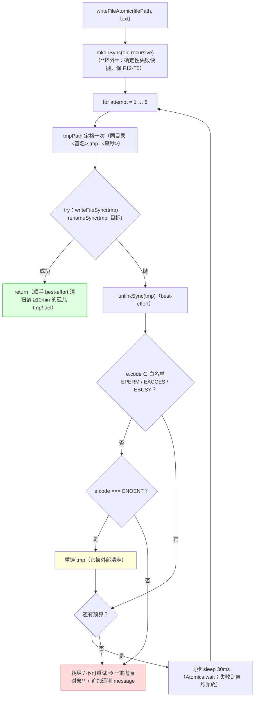
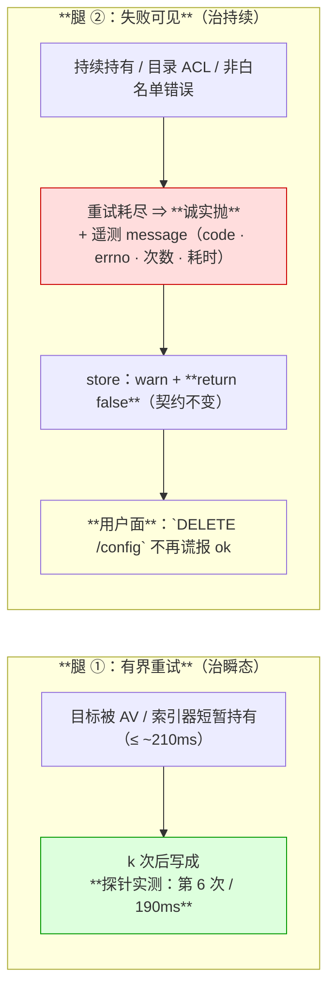
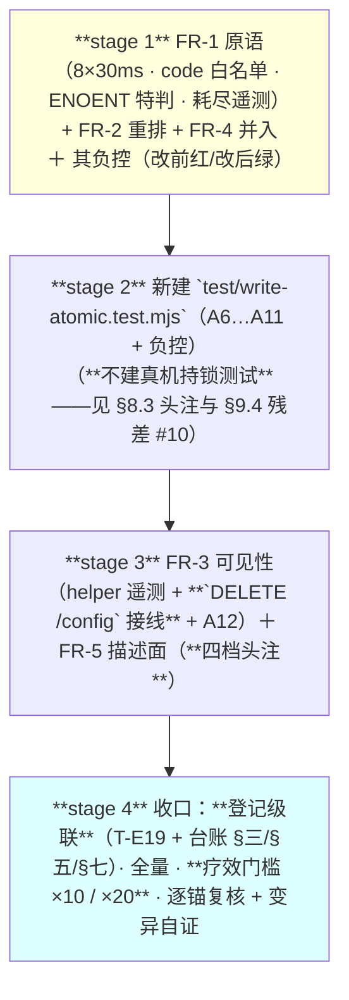

# 设计：原子写的可重试与失败可见 —— 批 20

- 日期：2026-09-17
- 需求档：[`2026-09-17-writefileatomic-requirements.md`](./2026-09-17-writefileatomic-requirements.md)（**US-1…US-9** · **N-1…N-14** · §5.1 九条不做 · §5.2 **R-61…R-65**）
- 摸底记录：[`2026-09-17-writefileatomic-recon.md`](./2026-09-17-writefileatomic-recon.md)（**因果判定 · 机制四条实测 · 调用面订正 · 失败可见性**）
- 会诊纪要：[`consult-minutes/2026-09-17-consult-19-minutes.md`](./consult-minutes/2026-09-17-consult-19-minutes.md)（**3/4 交付** · **§3 八条裁定 D-19-1…D-19-8**）
- 章节：按 [`METHODOLOGY.md`](../METHODOLOGY.md)：**九节**（§1 背景 · §2 问题 · §3 目标 · §4 决策与理由 · §5 方案 · §6 机制伪代码 · §7 状态与 schema · §8 防偏离 · §9 边界）+ **§10 受影响文件与验收** + **§11 变更记录** + **§12 评审落档**
- 图示：**图 1**（`writeFileAtomic` 的新控制流）· **图 2**（两条腿的分工：重试治瞬态 / 可见性治持续）
- 状态：**设计待评审**

<!-- doc-shape
anchors: 机验锚
acs: 验收标准
-->

> ## ⚠️ 读前必读
>
> **1. ★ 本批改 `lib/**` ⇒ 实施后必须重启 DSH 才生效**（**写进交接页，不擅自重启**——需求档 §5.1 第 4 项）。
>
> **2. ★ 姿态是「按机制假设根修」，不是「已确诊 `EPERM`」**：`R-13` 当次的 **errno 从未被捕获**（台账里只有断言 diff，`catch` 里的 warn 文本没留）。**因果链的一半是证死的**（失败原文恰是「写落地前」的文件内容 ⇒ 逻辑必然），**另一半是假设**（本机探针证明 `EPERM` 机制存在，但「那次就是它」不可证）。⇒ **本批必须自带观测面**（§5.3 FR-3），**复发时能判真伪**；**验收口径 = 主导类被大幅压小 + 复发可判真伪**（纪要 **V13** / 父侧 N-14）。
>
> **3. ★ 两条腿缺一不可**（会诊三家一致）：**只做重试就是超卖**——重试治**瞬态**持有者，而**持续**持有者会耗尽重试并走同一条被吞掉的路径。**逐条见 §4 的 D20-1 与 §9.4。**
>
> **4. 定位口径**：本档行号仅 as-of；**一切改动按符号 / 字面锚定**。
>
> **5. 自应用陷阱**（批 16 评审 #18 的教训）：**本档里的标记示例全部住行内代码 span 或围栏内**；**负控必须在仓外临时副本上裸写**。

---

## §1 背景

`lib/dsh-home.mjs:65` 的 `writeFileAtomic` 是**四个消费面共用的原子写**（三个 store 共 **5 处**调用 + 一处同族的独立 `renameSync`）。它的形态是 `mkdirSync` → 同目录 tmp `writeFileSync` → `renameSync`，**失败即抛、无重试**，而**三个 store 的 `save*` 都把它包在 `try/catch` 里**：**只 `console.warn` 一句 + 返回 `false`**。

**两条已登记的缺陷**（批 9 的 `R-13` 与批 14 的 `R-51`）在本批**被判定同源**：`R-51` 的诊断（Windows 上 tmp+rename 被 AV/索引器短暂持有而 `EPERM`）**是机制**，而 `R-13` 的「**时序 flake**」标签**是误诊**——它的失败原文恰是「**那次写没落地**」时的文件内容（摸底档 §2 有逐字判据）。

**批 14 的父侧裁定就是本批的立项书**（`R-51` 原文）：「**硬化 `writeFileAtomic`（加 rename 重试），而不是把它加进 flake 表——因为测试只是暴露了它，加 flake 条目等于把真缺陷记成已知**」。

---

## §2 问题（**带出处与实测量**）

| # | 问题 | 实测（as-of 2026-09-17） |
|---|---|---|
| **P-1** | **瞬态持有者 ⇒ 写必然失败**：`renameSync` 遇目标被另一进程持有句柄时抛 **`EPERM` / errno `-4048`**，而 helper **无重试** | 仓外探针：**锁中途释放 ⇒ 第 6 次成功、190ms**；**锁持续 ⇒ 8 次全败**（摸底档 §3） |
| **P-2** | **失败被静默吞掉**：store 的 `catch` 只 `warn` + `return false`，而**返回值多数没人查** | 摸底档 §4：**token / config 面已接住**，**`saveSessionState` 的 7 处调用全部忽略返回值**（另 1 处 `removeSessionState` 同类） |
| **P-3** | **★ 一处面向用户的谎**：`DELETE /config`（「恢复默认」）调 `clearUserConfig(...)` **丢弃返回值**并无条件 `send({ ok: true })` | **父侧逐字回盘核实**；对照 PUT 路径已正确（`if (!saved) … 500`） |
| **P-4** | **首写失败留半个 tmp 且不清理**：`writeFileSync(tmpPath, …)` 在 `try` **之外** | **父侧回盘核实**（`lib/dsh-home.mjs:69`；会诊 v4-pro 独立指出） |
| **P-5** | **第二处同族面**：`clearUserConfig` 的**独立 `renameSync`**（原子删除路径）不在 helper 内 | 摸底档 §4（`lib/config-store.mjs:226`） |
| **P-6** | **崩溃残留累积**：硬崩在 write→rename 之间 ⇒ `.tmp-*` 永存；clear 崩在 rename→rm 之间 ⇒ `.del-*` 永存 | 现状只有「失败时 best-effort 清」，**无兜底** |

---

## §3 目标

| # | 目标 | 验收面 |
|---|---|---|
| **G1** | **瞬态持有者不再让写必然失败**（有界重试） | AC-1 · AC-3 |
| **G2** | **重试不掩盖真失败**（持续持有 ⇒ 诚实失败） | AC-2 |
| **G3** | **失败可见**：耗尽的错误带遥测；一处用户面的谎被修 | AC-5 · AC-8 |
| **G4** | **原语单一化**：`clearUserConfig` 复用同一重试原语（含 TOCTOU 幂等） | AC-7 |
| **G5** | **失败路径不留垃圾**（首写失败清理 + 孤儿清扫） | AC-4 · AC-6 |
| **G6** | **`R-13` 状态翻转**（**不删行**）且台账同批一致 | AC-10 |
| **G7** | **契约零变更**（三个 store 仍是 `warn + return false`） | AC-9 |
| **G8** | **描述面与实现一致** + 零改面 + 新档登记级联 | AC-11 · AC-12 |

### §3.1 非目标（**不做**）

| # | 不做 | 理由（**都有出处**） |
|---|---|---|
| **1** | **不删 `R-13` 的那一行、不动发布门与其测试档** | 删行会打红 `test/release-check.test.mjs` 的**三条机械断言**（活台账 flake 表**非空** / **`R-13` 在首行** / 拿真台账当 fixture），并牵动 `release-check.mjs` 的硬编码文案与 `docs/README.md`；而该测试档是**基线档** ⇒ 又一次 `AP_TEST_AUTHORIZED` 仪式 ⇒ **登记为 R-64（独立的门改造）** |
| **2** | **不把三个 store 改成异步** | 爆炸半径实测：**7 处调用点 + ~40 处测试断言消费同步布尔**；且异步化会把「同 tick 顺序写」变成竞态（会诊 K3/V-异步论据） |
| **3** | **不改那 7 处 `session-state` 调用点** | 内存态是第一事实源、盘是镜像（三档头注的既定契约）（**R-65**） |
| **4** | **不改基线档 `test/session-state.test.mjs`** | 它的**持续全绿就是疗效见证**；改它要动授权面（会诊 D-19-4） |
| **5** | **不采纳 `EAGAIN`、不采纳「每次新 tmp 名」、不做 `fsync`** | 前两者未实测 / 已被实测证伪（**R-61** / D-19-3）；后者镜像语义下登记 accepted（V11） |
| **6** | **不扩写域**：`lib/**` **仅五档**（§10.1 逐档列出） | 常设约束「不擅自扩大范围」 |

---

## §4 决策与理由

| # | 决策 | 为什么 | 被否决的备选与理由 |
|---|---|---|---|
| **D20-1** | **两条腿落地**：FR-1/FR-2（重试）＋ FR-3（可见性）**同批** | 会诊三家一致：**只做重试就是超卖**——持续持有者必耗尽重试，而它走的是**同一条被吞掉的路径** | **否决「只加重试」**：它把 flake 从「表里」挪到「盲区」（V2/K6 的原文） |
| **D20-2** | **8 次 × 平铺 30ms**（最坏 ~210ms） | **与父侧探针包络对齐**（锁中途释放 ⇒ 第 6 次成功 190ms）；**2:1** | **否决 v4-pro 的爬升曲线（~790ms）**：**没有任何实测支撑**（「不发明未实测的机制」），且同步阻塞代价三倍。**其「长尾持锁」论据如实登记为边界 R-62**（由可见性腿接手） |
| **D20-3** | **可重试集 = `EPERM` / `EACCES` / `EBUSY`（按 `e.code` 字符串）+ `ENOENT` 特判重铸 tmp** | **按 `code` 而非 `errno` 数字**：Windows 的 errno 是负数、POSIX 是正数，只有 `code` 跨平台稳定（V1/K1）；`ENOENT` 只在「tmp 被外部清走」时出现 ⇒ 重铸即自愈 | **否决 `EAGAIN`**（v4-pro 独家、未实测——**白名单是带注释的常量**，加它是一次显式动作，R-61）；**否决把 `ENOENT` 并入主白名单**（它需要**重铸 tmp** 这个额外动作，语义不同） |
| **D20-4** | **只重试 `renameSync`**；`mkdirSync` 留环外 | 保 **F12-T5 契约**（`badHome` 的 `ENOTDIR` 必须**快失败**） | **否决「把 mkdir 也纳入重试」**：确定性失败重试只是拖慢 |
| **D20-5** | **写 + rename 同入环内 `try`（失败即 `unlink`）**；**tmp 名保持单次** | 修 **P-4 的真缺陷**（首写失败既抛又留半个 tmp）；而**「每次新名」解决的是一个已被实测证伪的碰撞面** | **否决「每次生成新 tmp 名」**（v4-pro 的 V3 后半）：跨进程 pid 不同、进程内全同步不可自交错（kimi 的 K9 实测证伪）⇒ **不为不存在的问题加机制** |
| **D20-6** | **耗尽后重抛原对象 + 追加遥测 message**（`code` / `errno` / 已试次数 / 总耗时）+ **可 grep 的失败签名** | 保调用方依赖的 `.code`；把「失败原因」变成**日志里可检索**的东西 ⇒ **复发可判真伪**（这是「机制假设」姿态的观测面，V4/K5；**`errno` 按需求档 N-12 一并入消息**） | **否决「wrap 成新 Error」**：会丢 `.code`，而 store 的 warn 拼的就是 `e?.message` |
| **D20-7** | **契约零变更**（三个 store 仍 `warn + return false`） | 那是写进三档头注的**既定 fail-safe**（内存态兜底）；改 throw 会把「镜像失败」升级成「工具流崩溃」 | **否决「改 throw」**：需要独立批次 + 用户裁定（三家一致） |
| **D20-8** | **只修一处用户面**：`DELETE /config` 接住返回值 ⇒ 失败返回 `ok:false` + 500 | 它是**面向用户的谎**（P-3），且**与 PUT 路径的先例同形** | **否决「把 7 处 session-state 调用点全改」**：横跨四档 lib、收益配不上 churn（R-65） |
| **D20-9** | **`clearUserConfig` 复用同一原语**（抽 `renameSyncWithRetry`）+ **TOCTOU 幂等**（`ENOENT` ⇒ 判「已清空」返回 true） | 同族暴露（P-5）；TOCTOU 下「已清空」语义上应判成功 | **否决「把 clear 的 rename 塞进 `writeFileAtomic`」**：方向相反（活文件→`.del`），塞进去是削足适履 |
| **D20-10** | **孤儿清扫**：同目录 + 同前缀 + **龄 ≥ 10min**，best-effort | 把「OS 最终回收」变成**有界**（P-6）；**10min 阈值把误杀面降到零**（在飞 tmp 的生命是秒级） | **否决「不做」**：与 `session-store` 既有的「写时清扫」哲学**同构**，成本 ~8 行 |
| **D20-11** | **`R-13` 只翻转状态、不删行**（★ 不采纳会诊的一致建议） | 见 §3.1 第 1 项的三条理由 | **否决「删行 + 同批改门」**：超任务边界 + 拉进发布门与其基线档 ⇒ **登记 R-64**；**其代价（G6 豁免空转）登记为 R-63** |

---

## §5 方案（分交付单元 FR-1…FR-6）

### §5.0 图 1：`writeFileAtomic` 的新控制流



**读图要点**：**`mkdirSync` 在环外**（F12-T5 的契约）；**写与 rename 同在一个 `try` 里**（修 P-4）而 **tmp 名只定格一次**（D20-5）；**白名单判 `code`**、`ENOENT` 走**重铸**这条独立支（D20-3）；**耗尽重抛原对象**以保 `.code`（D20-6）。

### §5.0b 图 2：两条腿的分工（**本批的核心判断**）



**读图要点**：**只有两条腿都在，`R-13` 才算「大幅压小 + 复发可判真伪」**——**持续持有者**（>210ms）**本批治不了**，但**它第一次变得可见**（R-62 的边界）。

### §5.1 FR-1 `renameSyncWithRetry(from, to, opts)` 原语

**做什么**：把「有界重试的 rename」抽成**单一事实源**，供 `writeFileAtomic` 与 `clearUserConfig` 共用。

| 量 | 值 | 依据 |
|---|---|---|
| 尝试次数 | **8** | 探针包络（第 6 次成功）+ 余量 |
| 退避 | **平铺 30ms**（`Atomics.wait` 同步 sleep，**feature-detect + 自旋兜底**） | D20-2 · K4 |
| 可重试 | `EPERM` / `EACCES` / `EBUSY`（**按 `e.code`**） | D20-3 |
| 特判 | `ENOENT` ⇒ 调用方**重铸 tmp**（由 `writeFileAtomic` 提供回调） | D20-3 |
| 注入缝 | `opts.delays`（测试传 `[1,1,1]`） | 沿用本仓 `storPathOverride` 惯例 |

### §5.2 FR-2 `writeFileAtomic` 重排 + 孤儿清扫

`mkdirSync` 环外 · **写与 rename 同入环内 `try`、失败即 `unlink`**（D20-5）· 成功后 **best-effort 清扫同目录同前缀、龄 ≥ 10min 的 `.tmp-*` / `.del-*`**（D20-10）。

### §5.3 FR-3 可见性（**腿 ② 的落点**）

| # | 落点 | 动作 |
|---|---|---|
| **1** | helper 的耗尽错误 | message 追加 `code` + **`errno`** + 已试次数 + 总耗时 + **稳定可 grep 的失败签名**（D20-6；字段清单与需求档 N-12 同值） |
| **2** | 三个 store | **零改动**（它们的 warn 拼 `e?.message` ⇒ **遥测自动流入**） |
| **3** | **`lib/index.mjs` 的 `DELETE /config`** | 接住 `clearUserConfig` 的返回值 ⇒ 失败 `send({ ok:false, error:… }, 500)`（**对齐 PUT 先例**）（US-8） |

### §5.4 FR-4 `clearUserConfig` 并入原语 + TOCTOU

`renameSync(filePath, delPath)` ⇒ `renameSyncWithRetry(...)`；且 **`ENOENT` ⇒ 判「已清空」返回 `true`**（幂等，D20-9）。

### §5.5 FR-5 描述面同步（**D2 单一权威源 + 纪律 #5**）

`lib/dsh-home.mjs` 的头注（现写「任何失败向上抛」）⇒ 改为「**白名单 errno 有界重试，耗尽向上抛**」；**`lib/**` 五档头注里引用 `writeFileAtomic` 行为处**同批过一遍（会诊 K11：`lib/session-store.mjs` · `lib/token-store.mjs` 的头注在列；**仅注释、契约零改动**）。

### §5.6 FR-6 台账与验收面

**`R-13` 行：保留、处置列改「已根治（v0.28.0）」**（D20-11）；**新建 `test/write-atomic.test.mjs`**（**不碰 T6**）⇒ **触发登记级联**：T-E19 档清单（`test/guard-e.test.mjs` 的非递归枚举）+ 台账 §三 新行 + `ledger-parity` / `test-lifecycle` 双 parity + CHANGELOG 计数（**D-19-7 的成本已进预算**）。

---

## §6 机制伪代码（含前置 / 后置条件）

```js
/**
 * FR-1：有界重试的 rename（**原语单一事实源**；writeFileAtomic 与 clearUserConfig 共用）。
 * @pre   from 存在且可读；to 的父目录存在
 * @post  成功 ⇒ 返回；白名单错误在预算内重试（8 次 × 30ms，首试零延迟）
 *        非白名单 ⇒ **立即抛**；耗尽 ⇒ **重抛最后一个原对象**（保 .code）+ 追加遥测 message
 *        ★ `code` 而非 `errno`（Windows 为负 / POSIX 为正）
 *        ★ `ENOENT` 不在主白名单：由 onEnoent 回调决定（writeFileAtomic 传「重铸 tmp」）
 */
function renameSyncWithRetry(from, to, opts) { /* ... */ }

/**
 * FR-2：原子写（重排后的形态）。
 * @pre   filePath 的父目录可建
 * @post  **mkdirSync 在环外**（保 F12-T5 的 ENOTDIR 快失败）
 *        写与 rename **同入环内 try**、失败即 best-effort unlink（修「首写失败留半个 tmp」）
 *        **tmp 名只定格一次**（碰撞面已被实测证伪）
 *        成功后 best-effort 清扫同目录同前缀、**龄 ≥ 10min** 的孤儿 tmp/.del
 */
function writeFileAtomic(filePath, text, opts) { /* ... */ }

/**
 * FR-4：清空 user 层（原子删除）。
 * @post  改用 renameSyncWithRetry；**TOCTOU**（existsSync 与 rename 之间被别进程删走）
 *        ⇒ `ENOENT` 判「已清空」⇒ **返回 true**（幂等）
 */
function clearUserConfig(dshHomeOverride, cwdHint) { /* ... */ }
```

---

## §7 状态与 schema（**谁写谁读**）

**本批不新增任何持久化格式、不改任何配置键。**

| 面 | 本批的动作 | 谁写 | 谁读 |
|---|---|---|---|
| `writeFileAtomic` 的**返回值** | **不变**（成功返回 / 失败抛） | — | 5 处调用点 |
| 耗尽错误的 **message** | **新增遥测**（`code` · `errno` · 次数 · 耗时 · 可 grep 签名） | helper | 三个 store 的 warn 行（`e?.message`）+ **宿主日志** |
| **`DELETE /config` 的响应** | **`ok:true` → 失败时 `ok:false` + 500**（US-8） | `lib/index.mjs` | **设置页 UI** |
| `test/write-atomic.test.mjs` | **新增档** | eng_coder（任务书指名） | `node --test` |
| `docs/test-lifecycle.md` §三/§五/§七 | **新档行 + `R-13` 状态翻转 + 历史行** | **主代理定内容、eng_coder 落笔** | `test-lifecycle.test.mjs` |

---

## §8 防偏离

### §8.1 零改面

| # | 面 | 判据 |
|---|---|---|
| 1 | **`test/session-state.test.mjs` 零改动** | `git diff --numstat` 空（**它是疗效见证者**） |
| 2 | **`test/release-check.test.mjs` 零改动** | 同上（**D20-11 的直接后果**） |
| 3 | **`release-check.mjs` 零改动** | 同上 |
| 4 | **`test/fixtures/**` 零改动** | 同上 |
| 5 | **其余基线档零改动** | 除 `AP_TEST_AUTHORIZED` 那三项；**本批不新增授权项** |
| 6 | **`lib/advisor.mjs` · `lib/state.mjs` 零改动** | 那 7 处调用点是 R-65 |
| 7 | 零 `test.skip` / `test.only` | 既有 `G-常驻1` 锁 |
| 8 | `failStop(` 恒 18 · 六串零命中（`lib/**`） | 既有锁 |
| 9 | 零新依赖 | `package.json` 依赖键集合不变 |
| 10 | **三个 store 的 `save*` 契约零改动** | `warn + return false` 逐字保留（AC-9） |

### §8.2 机验锚（**三要素写全：检索目标 / 谓词 / 期望**）

| 锚 | 检索目标 | 谓词 | 期望 |
|---|---|---|---|
| **A1** | `lib/dsh-home.mjs` | 常量 `RENAME_MAX_ATTEMPTS` / `RENAME_BACKOFF_MS` | **导出且值 = 8 / 30**；白名单常量**按 `code` 字符串**（含 `EPERM`/`EACCES`/`EBUSY`，**不含** `EAGAIN`） |
| **A2** | 同上 | `renameSyncWithRetry` | 定义**恰 1 处**且**被两个消费者调用**（`writeFileAtomic` + `clearUserConfig`） |
| **A3** | 同上 | `writeFileAtomic` 的结构 | **`mkdirSync` 在循环外**；**写与 rename 同在一个 `try`**；**tmp 名在循环外定格一次** |
| **A4** | 同上 | 耗尽路径 | **重抛原对象**（非 wrap）+ message 含 **`code`**、**`errno`**、**已试次数**与**可 grep 签名**（四处齐备，与 N-12 同值） |
| **A5** | 同上 | 孤儿清扫 | 存在「同目录 + 同前缀 + **龄 ≥ 10min**」的清扫分支（`.tmp-` 与 `.del-` 两形） |
| **A6** | `test/write-atomic.test.mjs` | **重试生效** | 注入 `{delays:[1,1,1]}` + 前 k 次 `EPERM` ⇒ **内容落地 + 零 tmp 残留** |
| **A7** | 同上 | **不假成功** | 持续 `EPERM` ⇒ **抛** + store 返回 `false` |
| **A8** | 同上 | **只重试白名单** | `ENOTDIR` / `ENOSPC` ⇒ **单次快失败**（断言无环内 sleep） |
| **A9** | 同上 | **首写失败清理** | 注入写失败 ⇒ **零 tmp 残留** + 抛（**改前必留半个 tmp** ⇒ 该锚是「改前红/改后绿」） |
| **A10** | 同上 | **孤儿清扫** | 龄 > 10min 的旧 tmp **被扫**；刚建的 tmp **幸存**（阴性对照） |
| **A11** | 同上 | **TOCTOU 幂等** | `clearUserConfig` 在目标已被删时 ⇒ **返回 true**（判「已清空」） |
| **A12** | **`test/config-api.test.mjs`**（**落点已定死**——该档已在 `AP_TEST_AUTHORIZED` 授权面内，§10.1 不再有「视落点而定」） | **`DELETE /config` 的失败面** | clear 失败 ⇒ 响应 **`ok:false` + 500**（**改前必红** ⇒ 改前无条件 `ok:true`） |
| **A13** | `docs/test-lifecycle.md` | **`R-13` 的状态翻转** | §五 那行的处置列含 **「已根治」**，且**该行仍在**（**不删行**）；§三 有 `write-atomic` 新行；§七 有新行 |
| **A14** | 全仓 | **零改面** | §8.1 第 1/2/3/4/6 项逐档 `--numstat` 空 |
| **A15** | 三个 store（`config-store` / `session-store` / `token-store`） | **契约不变** | 三个 `save*` 的 `catch` **仍为 `console.warn` + `return false`**（**不含 `throw`**） |
| **A16** | 本档 §12 | **疗效门槛的实测记录** | 存在「全量 `node --test` ×10 + `session-state` / `codex-runner` 单档 ×20 **全绿**」的记录（**达标才准在台账 §七写「已根治」**） |

### §8.3 负控与阴性对照（**每条新判据与每条保守约束各一条**）

> **做法**：负控**全部在仓外临时副本 / 内存夹具上构造**（D5：仓内零残留）；**且必须区分真红与假红**（断言级红 = 真红；`ReferenceError` / 整档崩溃 = 假红）。
> **★ 「真机持锁」测试本批不建（评审 #6 的处置）**：本批的重试逻辑由**注入式** A6–A11 覆盖；**真实的「另一进程持有句柄」面登记为不可真机验证的残差**（§9.4 第 10 条）——理由：它 **Windows-only**，而与 `G-常驻1` 的**「零 `test.skip`」锁**冲突（平台分支要写也只能写成**两边都断言**的形态，得不偿失）。**若将来要建**：必须用**另一进程**（会诊 K10 实测：Node 的 `fs.open` 默认 share-delete ⇒ **同进程锁不住 `rename`**）。

| # | 判据 / 约束 | 负控构造 | 必须红在哪 |
|---|---|---|---|
| **N1** | 重试生效 | 把次数改成 1 | **A6**（k>1 的注入不再恢复） |
| **N2** | 不假成功 | 把「耗尽即抛」改成「返回」 | **A7**（值红） |
| **N3** | 白名单 | 把 `ENOSPC` 加进白名单 | **A8**（快失败变成慢失败） |
| **N4** | 首写失败清理 | 把写移回环外 | **A9**（残留半个 tmp） |
| **N5** | 遥测 | 把 message 的追加删掉 | **A4**（签名/次数缺失） |
| **N6** | 孤儿清扫阈值 | 把 10min 改成 0 | **A10 的阴性对照**（新 tmp 被误杀） |
| **N7** | TOCTOU 幂等 | 把 `ENOENT ⇒ true` 删掉 | **A11** |
| **N8** | 用户面的谎 | 把 `DELETE /config` 的返回值接线拆掉 | **A12**（无条件 ok） |
| **N9** | 契约不变 | 把某个 store 的 `catch` 改成 `throw` | **既有 fail-safe 断言** |
| **N10** | `R-13` 不删行 | 把 §五 那行删掉 | **`release-check.test.mjs` 当场红**（★ **这正是 D20-11 要避免的级联**，以负控形式**证明它真实存在**） |

| # | 阴性对照（**零编辑必须仍绿**） | 它证明什么 |
|---|---|---|
| **M1** | 无占用的常态写 ⇒ 一次成功、**零 sleep** | 重试不改常态路径的代价 |
| **M2** | `badHome`（`ENOTDIR`）⇒ **快失败 + warn + false** | **F12-T5 契约零退化** |
| **M3** | `T6` **一字未改**且全绿 | 疗效见证者（D-19-8） |
| **M4** | `release-check.test.mjs` **零编辑仍绿** | **D20-11 的直接后果**（表非空/首行断言未被触发） |
| **M5** | 三个 store 的既有 fail-safe 断言全绿 | 契约不变（AC-9） |
| **M6** | `config-store` 的 PUT 路径既有断言全绿 | 可见性改动只加在 `DELETE` 面 |

---

## §9 边界（**逐条登记，不留给评审去发现**）

### §9.1 六类边界

| 类 | 本批必须定义的行为 | 方向 |
|---|---|---|
| **空集** | `renameSyncWithRetry` 的**预算为 0 次**（注入缝）⇒ 立即抛；**清扫面零命中** ⇒ 静默通过（非错误） | 见左 |
| **畸形输入** | `e.code` **缺失**（非 fs 错误）⇒ **不在白名单 ⇒ 立即抛**（fail-closed）；`opts.delays` 为空 ⇒ 用默认 | **fail-closed** |
| **并发** | **多进程 LWW 的丢更新重试治不了**（逻辑竞态非 fs 竞态）；而**重试把读-改-写窗口加宽了 ~210ms** ⇒ 补进既有登记（V10） | **登记不修** |
| **重启** | **★ 适用**：本批改 `lib/**` ⇒ 未重启不生效（US-6 / AC-12） | — |
| **升级** | **零配置键 / 零持久化格式变更**；耗尽错误的 message 变了 ⇒ **依赖 message 逐字的既有断言**须核对（负控 N5 与 §8.1 第 10 项） | 旧行为不退化 |
| **失败方向** | **fs 面 fail-closed**（非白名单立抛）· **store 面 fail-safe**（warn + false，不抛出）· **用户面 fail-visible**（`ok:false` + 500） | 见左 |

### §9.2 会诊的八条裁定（**已由纪要 §3 落档，此处只给指针**）

D-19-1…D-19-8 的全文在 [`consult-minutes/2026-09-17-consult-19-minutes.md`](./consult-minutes/2026-09-17-consult-19-minutes.md) **§3**；本档 §4 的 **D20-2 / D20-3 / D20-5 / D20-6 / D20-8 / D20-11** 分别是它们的**设计侧兑现**。**D2 单一权威源：本档不重述裁定全文。**

### §9.3 语义的失败形态（**哪类真缺陷会被放过**）

| 面 | 放过的真缺陷 | 定性 |
|---|---|---|
| **白名单** | **非白名单但同为瞬态的错误**（例如某环境的 `EAGAIN`）⇒ **不重试、直接失败** | **显式选择**（R-61；白名单是可显式 bump 的常量） |
| **210ms 预算** | **持锁 > 210ms 的类**（企业备份 / 同步盘 / 挂死的持有者） | **显式边界**（R-62）——**由可见性腿接手** |
| **孤儿清扫阈值** | 生命周期 > 10min 的**合法在飞 tmp**（理论上不存在：写是同步的） | **显式选择**（阈值可 bump） |
| **LWW** | **多进程并发写的丢更新** | **重试治不了**，登记不修（V10） |
| **`fsync`** | 断电下 `rename` 持久而数据可能不持久 | **登记 accepted**（V11） |

### §9.4 诚实残差清单（**本批抓不到什么——不许把宣言写得比机制大**）

| # | 抓不到 / 不修 | 理由 |
|---|---|---|
| **1** | **`R-13` 的原发 errno** | **无现场记录**（warn 文本没被捕获）⇒ 姿态只能是「**按机制假设根修**」（V13）；**复发时由 FR-3 的遥测判真伪** |
| **2** | **真实杀软 / 索引器的持有形态与时长** | 生产环境不可在仓内复现；探针只构造了「另一进程持有句柄」一个形态 |
| **3** | **>`210ms` 的持续持有者** | R-62；重试必耗尽 ⇒ **只能靠可见性**，不能靠重试 |
| **4** | **多进程 LWW 丢更新** | 逻辑竞态；且**重试把窗口加宽了 ~210ms**（V10） |
| **5** | **断电数据持久性** | 无 `fsync`（V11，accepted） |
| **6** | **那 7 处 `session-state` 调用点的失败可见性** | R-65（横跨四档 lib，另立批次） |
| **7** | **`G6` 对已根治档的复跑豁免空转** | R-63——**「不删行」的已知代价**（D20-11） |
| **8** | **「删行 + 门内三处谓词改造」** | R-64——**独立门改造，另立批次** |
| **9** | **宿主日志面的 `console.warn` 可见性** | 与批 19 同款；不可在本仓内生验证 |
| **10** | **真实的「另一进程持有句柄 ⇒ `EPERM`」面**（评审 #6） | 它 **Windows-only**，且与 `G-常驻1` 的**「零 `test.skip`」锁**冲突；**本批只用注入式覆盖重试逻辑**（A6–A11），真机面**不可在仓内稳定复现**（★ 探针是在**仓外**用 holder 子进程复现的，不进套件） |

### §9.5 威胁模型

**★ 漂移，不是对抗。** 对抗者可以改白名单常量、可以改清扫阈值。**⇒ 本批的全部机制针对「无意漏改 / 环境瞬时状态」**；**对抗面登记为已知边界**，不假装防住。

---

## §10 受影响文件与验收

### §10.1 实施域

| 文件 | 改动 | 类型 |
|---|---|---|
| `lib/dsh-home.mjs` | **FR-1 + FR-2 + FR-5（头注）** | **修改（核心）** |
| `lib/config-store.mjs` | **FR-4（`clearUserConfig` 复用原语 + TOCTOU）** + 头注 | 修改 |
| `lib/session-store.mjs` | **仅头注同步**（引用 `writeFileAtomic` 行为处；**契约零改动**） | 修改（注释级） |
| `lib/token-store.mjs` | **仅头注同步**（同上；**契约零改动**） | 修改（注释级） |
| `lib/index.mjs` | **仅 `DELETE /config` 的返回值接线**（US-8） | 修改（一行级） |
| `test/write-atomic.test.mjs` | **新增档**（A6…A11 + 负控） | **新增（触发登记级联）** |
| `test/config-api.test.mjs` | **`DELETE /config` 的失败面断言（A12）**——**落点定死在此档**（已在授权面 ✓） | 修改 |
| `test/guard-e.test.mjs` · `docs/test-lifecycle.md` | **登记级联**：T-E19 清单 + 台账 §三/§五/§七 | 修改 |
| `CHANGELOG.md` · `package.json` | 本批条目 + 版本 bump | 修改（**收口时**） |
| **明确排除（禁改）** | **`test/session-state.test.mjs`** · **`test/release-check.test.mjs`** · **`release-check.mjs`** · `test/fixtures/**` · `lib/advisor.mjs` · `lib/state.mjs` · `docs/consult-minutes/**` · 平台包 | **零改动**（**注意**：`lib/token-store.mjs` 与 `lib/session-store.mjs` **不在禁止面**——它们只允许**头注同步**，**契约与行为零改动**） |

**★ EOL 逐档实测表（as-of 2026-09-17，`core.autocrlf=false`；**改前必须按本表**）**：`lib/dsh-home.mjs` · `lib/config-store.mjs` · `lib/index.mjs` = **CRLF**（`lib/**` 实测 19 CRLF / 11 LF）· `test/*.test.mjs` 与 `docs/*.md` = **多数 LF**，而 `test/codex-runner.test.mjs` 等 **4 档是 CRLF** ⇒ **每档改前逐档实测**（夜班计划 trap 12 的订正口径）· **`git diff` 必须配 `--ignore-cr-at-eol` 读**（本机有 CR 幻影）。

### §10.2 可验性分层登记

| 标 | 含义 | 本批 AC |
|---|---|---|
| **T1** | 进程内 `node --test` 可证 | AC-1…AC-9 · AC-11 |
| **T2** | 静态谓词 / 逐字可查 | AC-10 · AC-12 |
| **T3** | 仅重启后人工核验 | AC-13 |

### §10.3 验收标准

| # | 验收标准 | 层 | 锚 | US |
|---|---|---|---|---|
| **AC-1** | 注入前 k 次 `EPERM` 后释放 ⇒ **写成、零 tmp 残留** | T1 | A1 · A6 | US-1 · US-5 |
| **AC-2** | 持续 `EPERM` ⇒ **抛** 且 store 返回 `false`（**不假成功**） | T1 | A7 | US-7 |
| **AC-3** | **非白名单**（`ENOTDIR` / `ENOSPC`）⇒ **单次快失败、无环内 sleep** | T1 | A1 · A8 | US-1 |
| **AC-4** | **首写失败** ⇒ **零 tmp 残留** + 抛（**改前必留半个 tmp**） | T1 | A3 · A9 | US-1 |
| **AC-5** | 耗尽 message 含 **`code` + `errno` + 已试次数 + 可 grep 签名**（四处齐备，与 N-12 / A4 同值） | T1 | A4 | US-2 |
| **AC-6** | 孤儿清扫：**龄 > 10min 的旧 tmp 被扫、新 tmp 幸存** | T1 | A5 · A10 | US-1 |
| **AC-7** | `clearUserConfig` **复用原语**；**TOCTOU**（目标已被删）⇒ 返回 `true` | T1 | A2 · A11 | US-4 |
| **AC-8** | **`DELETE /config` 失败 ⇒ `ok:false` + 500**（**改前无条件 `ok:true`**） | T1 | A12 | US-8 |
| **AC-9** | **契约零变更**：三个 store 仍 `warn + return false`（既有断言全绿） | T1 | A15 | US-2 |
| **AC-10** | **`R-13` 行状态翻转且不删行**；台账 §三/§五/§七 同批；**`release-check.test.mjs` 零改动** | T2 | A13 | US-3 |
| **AC-11** | **疗效门槛**：全量 ×10 + 单档 ×20 **全绿**（记录进 §12） | T1 | A16 | US-3 |
| **AC-12** | **零改面** + **新档登记级联**（T-E19 / 台账 / 双 parity）+ 描述面同步（**五档实施域、四档头注**——`lib/index.mjs` 对 `writeFileAtomic` 零命中，只做接线） | T2 | A14 | US-9 |
| **AC-13** | **重启事项写进交接页**（`docs/2026-09-13-handoff.md`，**主代理写**；本批改 `lib/**`） | T3 | — | US-6 |

### §10.4 建议 stages（**四段串行**）



| stage | goal | 文件 | 检查 |
|---|---|---|---|
| **1** | FR-1 + FR-2 + FR-4 + 负控（N1…N5） | `lib/dsh-home.mjs` · `lib/config-store.mjs` | `node --test test/session-state.test.mjs test/config-api.test.mjs` |
| **2** | 新档 + A6…A11 + 负控（N2/N3/N6/N7） | `test/write-atomic.test.mjs` | `node --test test/write-atomic.test.mjs` |
| **3** | FR-3 + FR-5（**四档头注**） + A12 | `lib/index.mjs` · `lib/dsh-home.mjs` · `lib/config-store.mjs` · `lib/session-store.mjs` · `lib/token-store.mjs` · `test/config-api.test.mjs` | `node --test` |
| **4** | 登记级联 + 全量 + **疗效门槛** + 逐锚 + 变异 | 全部 | `node --test`（×10） |

---

## §11 变更记录

| 日期 | 变更 |
|---|---|
| 2026-09-17 | 首版（设计待评审）：九节 + §10 验收；**D20-1…D20-11**；**US-1…US-8**；**AC-1…AC-13**；**锚 A1…A16 写全三要素**；**负控 10 条 + 阴性对照 6 条**；**图 1 / 图 2**；§10.4 **四段串行**。**★ 会诊 `#19`（3/4）定形**：**两条腿缺一不可**（「只做重试就是超卖」）· 平铺 30ms（否决爬升）· 按 `code` 判白名单 · `ENOENT` 特判重铸 · 保住「写进环内 try」但**不为已证伪的碰撞面加机制** · 耗尽遥测 · **`R-13` 只翻转状态不删行**（**不采纳会诊的一致建议**，理由三条见 §3.1）。**★ 姿态如实声明**：**「按机制假设根修」，不是「已确诊 EPERM」**。 |
| 2026-09-17 | **★ 设计评审轮次 1 落档（`advisor-dsh-3`，`VERDICT: FAIL`，🔴2 · 🟡5 · 🔵2）——9 条全 Fixed**（**未签发 token**；落档见 **§12.1**）：**🔴 #1 同一机制两处相反指令**——需求档 **N-7 仍是会诊前首版的「移出 flake 表」**，而 US-3 / §5.2 / 本档 AC-10 / A13 / FR-6 / D20-11 全部裁定「**不删行**」（**父侧折入会诊时改了 US-3 与 §5.2 却漏改 N-7**——**正是本仓「改了引用点却没改被引用的副本」这个物种，第十三次**）⇒ **N-7 改写为「状态翻转、不删行」** + 需求档 §6 补记该订正；**🔴 #2 写域自相矛盾**——§3.1 第 6 项写「`lib/**` 仅**四档**」而 §10.1 只列 **3** 个 lib 档，且 **FR-5 要求三个 store 头注同步**而 §10.1 把 `lib/token-store.mjs` 列进**禁改**、`lib/session-store.mjs` 两张清单都没有 ⇒ **对齐为五档**（`dsh-home` · `config-store` · `session-store`〔仅头注〕 · `token-store`〔仅头注〕 · `index`）并把 token-store 移出禁改行；**🟡 #3 消息字段缺 `errno`**（N-12 要求四处，D20-6/FR-3/A4 只三处）⇒ 三处补齐；**🟡 #4「8 处」与摸底档 §4 权威枚举「7 处」矛盾** ⇒ 订正为 7 处（另 1 处 `removeSessionState` 同类）；**🟡 #5 AC-12 挂 US-5 而 US-5 无 AC 覆盖** ⇒ 新增 **US-9** 并改挂，AC-1 同挂 US-5；**🟡 #6「持句柄夹具用另一进程」无 AC 覆盖且与「零 `test.skip`」锁冲突** ⇒ **裁定本批不建真机持锁测试**（注入式 A6–A11 覆盖重试逻辑），真机面进 §9.4 残差 #10 + §8.3 头注改写；**🟡 #7 摸底档状态行陈旧** ⇒ 改为「会诊 #19 已折入」；**🔵 #8 A12 落点「或」不定** ⇒ **定死 `test/config-api.test.mjs`**（已在授权面）· §10.1 同步；**🔵 #9 AC-13 未指名交接页路径与写者** ⇒ 补 `docs/2026-09-13-handoff.md` + **主代理**。 |

---

## §12 评审落档

### §12.1 设计评审落档（**轮 1 = FAIL**）

| 轮 | 结论 | 处置 |
|---|---|---|
| **1** | **`VERDICT: FAIL`**（🔴2 · 🟡5 · 🔵2）· **未签发 token** | **9 条全 Fixed**（逐条见 §11 第 2 行）。**评审正评**：「设计整体质量高：九章节齐备、双图、**锚三要素写全**、**负控与阴性对照成对**、**诚实残差清单完整**、**两条腿的裁定贯穿三档一致**」；**两条 🔴 都是「同一事物两处相反描述」** ⇒ 照字面实施会触发本批明令规避的发布门级联（#1）或使 FR-5 与 §10.1 互斥（#2） |

| **2** | **`VERDICT: PASS`**（🔴0）· **签发 token** | **轮 1 的 9 条全部逐条核实为 Fixed**（评审以本轮现行内容为准）· 另出 **4 条非阻塞新项（1 🟡 + 3 🔵）**，**父侧已同批折入**：**#10** 档头「US-1…US-8」未随 US-9 同改 ⇒ 订正（§11 首版历史行按纪律不动）· **#11** `errno` 摘要在 AC-5 / 图 2 注 / §7 表三处残留 ⇒ 三处补齐（与 N-12 / A4 四处齐备）· **#12** 摸底档 §5 节标题仍写「已发，未回」 ⇒ 订正 · **#13** 描述面计数措辞不一致（AC-12 写「五档头注」而实际是**五档实施域、四档头注**）⇒ AC-12 与 stage 3 统一为「**四档头注**」。**评审正评**：「轮 1 的两条 🔴 均已**实证修复**，未发现新的 🔴 或崩溃/数据丢失/逻辑错误级问题」。**★ 评审员还独立复核了两条依据**：`lib/session-store.mjs` 与 `lib/token-store.mjs` **确引用 helper**（K11 的依据成立）· 纪要的 K10/K11/D-19-6 抽查与设计档引用一致 |

- **design token**：**轮 1 未签发**（存在未决 🔴，按规则不签发）；**轮 2 `PASS` ⇒ 签发** `e5e81eff-100f-4c58-af47-6d0627eac06d` : `1790235497070`（**有效至 2026-09-24**；**逐字经 `designToken` 参数传给 `eng_coder`，不写进任务书文本**）
  - **★ 实测事实（与计划的一句话不符，如实登记）**：**本 token 与批 19 的 token 逐字相同**——而夜班计划 §2 步 8 写「**token 由「会话 + 文档集」定长派生 ⇒ 换文档集 ⇒ 换 token**」。**实测不支持该说法**（两批的文档集不同而 token 同值）⇒ **据实登记，不按计划假设行事**（token 仍按返回的逐字值使用；**且这是一种弱绑定，登记为已知边界**）。
- **★ 父侧自记（本批的物种，第 2 次）**：**🔴 #1 是我折入会诊时「改了 US-3 与 §5.2 却漏改 N-7」**——**与本批要治的 `R-13`（「写没落地」被静默吞掉）无关，却与批 16 那条自订规矩「任何『改了两处之一』都不算修好」直接同族**。**⇒ 可执行对策**：**折入「翻转某条既有要求」的裁定后，必须全档检索该要求的**所有**副本**（本批已用 `grep` 逐条复核 US/N/不做项三处，并**在轮 1 折入时补跑了这一步**）。
- **交付核验 / 分歧审计 / 交付代码评审**：见 **§12.2 / §12.4 / §12.3**（**待填**）。
