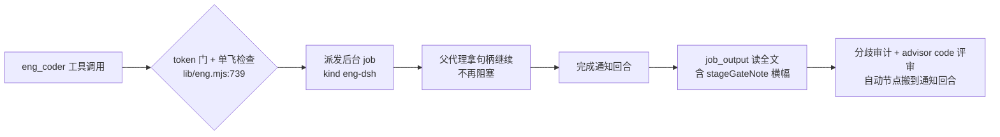

# 会诊纪要 —— consult #32（原始层，机制落盘）

- 日期：2026-09-17
- 会诊 id：32
- 模型：deepseek-official:deepseek-v4-pro, zai-coding-cn:glm-5.3, codex-cli:gpt-6-astra, kimi-api:kimi-k3
- 平台 job：consult-19
- 结果：2/4 交付（其中 2 条有内容 —— **交付数 ≠ 有效数**，R-43）
- requiresReport：true
- 写者：`lib/consult.mjs` 的 `settleAndDeliver`（**只写 §0 汇总与 §1 原始层**；裁定层由主代理写）

## §0 汇总

[consult #32 finished — 2 of 4 replied (2 failed)]

## §1 原始层（机制写——digest 全文，逐字）

```text
[consult #32 finished — 2 of 4 replied (2 failed)]
effective: 2 of 4 (2 failed · 0 without content)
models: deepseek-official:deepseek-v4-pro, zai-coding-cn:glm-5.3, codex-cli:gpt-6-astra, kimi-api:kimi-k3
job: consult-19
minutes: docs/consult-minutes/2026-09-17-consult-32-minutes.md
requiresReport: true

--- replies (raw, unjudged — verify with your own tools) ---

[1] codex-cli:gpt-6-astra — failed
(consultation failed: codex-cli PROCESS_ERROR: codex 进程失败（非零退出且无有效输出）)

[2] zai-coding-cn:glm-5.3 — ok
查证完毕(全部结论基于本轮实读代码:`lib/eng.mjs`、`lib/escalate.mjs`、`lib/advisor.mjs`、`lib/config-store.mjs`、`lib/index.mjs`、六个测试档、`test-lifecycle` 基线集)。以下按五问作答,机械锚一律「档:行」。

## 总判断先行

**默认后台方向正确,支持实施**——但有一个必须写进设计的**机制护栏缺口**(①-1)和一个**调用点陷阱**(③)会在实施时静默废掉半个需求。

---

## ① 流程形状改变的隐藏耦合(逐项核过代码)

**不会被坏的(已有机制兜住)**——簿记早就活在 done 回调里,后台化只是让流量走已验证路径:

| 耦合点 | 实测结论 |
|---|---|
| `deliverBookkeeping`(eng.mjs:148) | dsh 后台成功分支 :982 / codex 后台 :855 / 同步 :1123 **同一实现恰好一次**;advisorRound 清零 + generation bump + touchedFiles 合并 + F12 落盘全在回调内 ⇒ **不因默认翻转而丢** |
| escalate 簿记 | done 成功分支 :499 自查落盘(:500-502 注释明说「后台完成晚于工具返回,必须自查落盘」)⇒ 已兜 |
| per-session single-flight | 入口检查(eng.mjs:739 / escalate.mjs:302)+ 派发点二次检查(:940/:432)已覆盖后台形态;默认后台只是把「在飞占位」从偶发变常态 ⇒ **语义正确但行为变化**:以前「同步失败后立刻 re-spawn 修 stage」合法,现在失败也要等通知回合才知道 ⇒ stage 修复循环整体后移一个回合(工具描述 :948 的授权条款不变,时点变) |
| stage 门(`stageGateNote`) | 在 done 回调 output 里(:984/:1126),随 job_output 全文可见 ⇒ 不丢 |
| 兜底/cancel/超时信封 | `dshBackgroundTimeoutMs` 兜底(:943-961 / escalate :444-460)、cancel→abort 链、reject-race 分支全是 R5 §7.2 已测路径(codex-runner.test.mjs:3934-4300 十余条用例) |
| designToken | 校验/续期在调用时;新令牌串已并入派发返回(:1023,批 2 评审 #1 修的正是这个)⇒ 不丢 |

**会坏的(真隐藏耦合,当前无机制护栏)**:

1. **交付评审错序窗口——本次最大风险**。同步时「eng_coder 返回 ⇒ 簿记已发生 ⇒ advisor(type='code') 看到 fresh 状态」是**由父代理阻塞天然保证的**;默认后台后这条因果链断掉。实测:advisor 入口的 single-flight 只查 **advisor 自己的槽位**(advisor.mjs:1858),**不查 eng/escalate 槽位** ⇒ 父代理在完成通知前跑 code 评审**不会被拦**,然后:scope 兜底看不到新改动(`resolveScopeFiles` 吃 `state.touchedFiles`,advisor-msgs.mjs:427——而 touched 还没并)、advisorRound/lastAdvisorOutput 还是上一交付链残留(prior 污染或直接撞 5 轮 cap)、交错时 generation bump 会把在飞评审结果作废(状态不被污染——D-10 兜住了——但那轮评审白跑)。
   **建议机制护栏**:advisor 入口对 code 型评审加跨机制检查(eng/escalate 槽位在飞 ⇒ 拒绝并指向 job id),与 `checkInFlightJob` 同构。纯提示词方案(工具描述加「等完成通知再评审」)太弱,两者都做才稳。
2. **重启失忆面变大**:在飞槽位是模块内存态(advisor.mjs:1736 `inFlightJobs = new Map()`),不落盘(session-store 白名单七字段不含它)。以前后台罕见,现在**每次交付都后台** ⇒ 「DSH 重启 ⇒ 槽位丢 ⇒ single-flight 失忆」的暴露面常态量化。如实登记即可(显式 background=true 时代已存在,非本次引入)。
3. **描述面时点错位**:index.mjs:950「On return, run the delivery review」——翻转后 return 时交付还没发生;README:127-137 整节、schema 描述(:957/:1002)同理。

## ② budgetCapMs(540s)还有意义吗——**有,且不要换缺省**

翻转后它的职责**收窄但更纯**:只剩三处——jobs 缺失回落同步时的内部截止(eng.mjs:1050 / escalate.mjs:570)、codex 路径的预算阈值(:828/:151)、显式 `background:false` 强制同步时的截止。540<600 的 60s 余量正是「回落了也拿得到诊断报告」的保证——**抬高它 = 消灭余量 = 回落时连报告丢,降低无意义**。dsh 后台路径本来就不读它(读 `dshBackgroundTimeoutMs`,config-store.mjs:102-104)⇒ 语义反而更干净。**要改的只有文案**:「长任务请传 background=true」类指引(eng.mjs:1041/:1090、escalate.mjs:562/:593/:616、README:137)全部失效,应改「装 dsh-jobs-local + dsh-tool-jobs」。

## ③ 不加新配置键的翻转手术(精确改法)

```dsh-ui
{"title":"判定翻转的四处手术(零新配置键)","items":[{"type":"callout","tone":"warning","title":"★ 最大的陷阱:index.mjs:1011 的三态压扁","content":"escalate 调用点现在传 args?.background === true——undefined 被压成 false。不改这里,escalate 的 dsh 翻转完全失效。必须改成三态透传 args?.background。"},{"type":"table","columns":["#","位置","改法"],"rows":[["1","lib/eng.mjs:936","args?.background === true → args?.background !== false"],["2","lib/escalate.mjs:425","background === true → background !== false"],["3","lib/index.mjs:957 + :1002","删 default: false(boolean optional ⇒ 缺省 undefined)。保留 default 则平台注入 false ⇒ !== false 判同步 ⇒ 翻转静默失效"],["4","lib/index.mjs:1011","args?.background === true → args?.background(三态透传)"]],"types":["str","str","str"]},{"type":"callout","tone":"info","title":"codex 行为零漂移的保法(不改判定)","content":"eng codex 判定(:828)与 escalate codex 判定(:122)保持 === true 不动:undefined ⇒ false ⇒ 预算判定照旧(eng codex baseTimeout 缺省 1800s>540s 本来就自动后台;escalate codex 缺省 600000>540000 同)。dsh 与 codex 两行之分全靠『schema 无 default + 调用点透传』这一对配合。"}]}
```

**stages 纪律不受削弱**:阶段表解析/UNDECLARED 门/漂移探测全在 output 文本流上,与执行形态正交;同步截止曾是「逼你拆 stages」的压力源之一,但 stages 的本位价值(阶段自检/可续跑)与墙钟无关——建议在设计档偏离表里明记这一条取舍。

## ④ 锁面实测 + 授权仪式

基线十档(test-lifecycle.test.mjs:48-52)= advisor-config / codex-runner / config-api / consult / context-budget / design-review-guard / preset-static / session-state / stages / truncation;授权面现 5 名(death-provenance.test.mjs:1024)。

**好消息:多数「默认同步」断言靠回落语义活下来,不红**——实测 advisor-config T18d 的 `makeEngDeps`(:446-464)ctx **无 jobs**、codex-runner DP-1 两条(:2301/:2327)ctx 无 `get` ⇒ 翻转后走「jobs 缺失 ⇒ 告警回落同步」⇒ 同步文案断言仍成立。R5 §7.2 系列与 death-provenance:431、design-review-guard 全是显式 true(advisor 判定不动)⇒ 绿。

| 档 | 预期 | 仪式 |
|---|---|---|
| `test/advisor-config.test.mjs`(基线·**已在授权面**) | T18d 大概率绿;但需**新增**「缺省+jobs ⇒ 后台」正控断言 ⇒ 必改 | **不重写数组行**(仍 5 名)+ 注释块**追加第⑥条**授权理由(批 14 先例形态);台账 §三该行用例数同步 +T-LC2 |
| `test/codex-runner.test.mjs`(基线·已在授权面) | 既有全绿;建议补「缺省派发 / 缺省回落」两条腿 ⇒ 改 | 同上(授权面内,注释追加) |
| `test/preset-static.test.mjs`(:55 锁 ENGINEERING 提示「…run the delivery review automatically」) | **只有动提示词才红** | **建议本轮不动提示词**(时序纪律写工具描述 + 派发句柄文案,`lib/index.mjs` 不在任何锁里,零仪式)⇒ **避开唯一一处授权面扩张**;残留风险(老提示诱导错序)登记并由 ① 的机制护栏兜 |
| `test/doc-hygiene.test.mjs`(:317 第二字面 2 次、:362 failStop 恒 18) | 若改写「)到点,子代理已 abort——…请走 codex runner 或拆分 stages。」字面 ⇒ 红 | **非基线档**(不在十档内)⇒ 零授权;但更省的手术是**第二字面一字不动、新指引另起句**——advisor-config:527-529 锁着同一字面的孪生断言,一并绕开 |

## ⑤ 更好的方案?——查过,没有;但给两条如实记录

- **「按预算自动决定」在 dsh 路径不可行**:codex 行有真预算信号(timeoutMs)且**已实现** >cap 自动派;**dsh 子代理路径没有预算参数**(子代理时长不可预估,唯一 deadline 是 1800s backstop)——「按预算」要先发明「预计时长」输入,等于把猜测推回父代理,比一刀切差。stages 数量可做弱信号,但只配进建议文案,不配进判定分支。
- **真正的替代候选**:「dsh 保持缺省同步 + 工程模式默认切 codex runner」——**否决**:escalate 的 dsh 行没有 codex 替代、codex runner 依赖用户配置,dsh 墙钟问题依旧无解。
- **方向本身的裁断**:600s 墙钟是「静默丢交付报告」的硬墙、540s 掐断是失败交付,**两种丢失都不可消解,而后台的代价(多 1-2 回合 + 纪律要求)可被护栏消解**;advisor/consult 已默认后台,一致性成本为零。**默认后台是对的,前提 = ① 的跨机制护栏一起做。**

---

**建议随需求档定稿的三个决策点**:① advisor 入口跨机制护栏(做/不做——我强烈建议做,这是唯一用机制封死错序评审的机会);② ENGINEERING 提示词本轮动不动(建议不动,零仪式成本);③ 回落 warn 文案的措辞翻转(「background=true 请求后台」⇒「缺省后台」)是否连带改第二字面(建议不连带)。

[3] deepseek-official:deepseek-v4-pro — ok
读盘摸底完成。以下按 5 问逐条作答，全部锚定到仓内实测行号（as-of 当前工作树）。

## ① 默认后台后的隐藏耦合（改流程形状 = 改这条链）



**在飞单飞（per-session single-flight）**：默认后台后，`eng`/`escalate` 槽位从派发到 settle 全程占用（`checkInFlightJob` 入口检查在 `lib/eng.mjs:739`、`lib/escalate.mjs:307`）。影响：① 同回合第二次 `eng_coder`（含「stage 失败后重派」模式）会被拒——机械上是**对的**（槽位 settle 才释放，重派发生在失败报告的完成通知之后，时序天然串行）；② 但流程形态变了：现在同步路径下父代理「交付→审计→评审」一气呵成，后台后父代理必须在**派发后停下等通知**，这要求 `engineering.md` 的状态机（§Work Loop，`:103-136`）加一个过渡态，否则父代理可能在「Implementation」态直接跑去跑评审。

**advisorRound 推进 / 评审预算重置**——这是最隐蔽的一条：`deliverBookkeeping`（`lib/eng.mjs:148-159`）在 **job settle 的 done 回调**里执行 `advisorRound=0 + lastAdvisorOutput=null + bumpAdvisorGeneration`。同步路径下这是工具调用内的事，eng 交付与下一轮 advisor 评审天然串行；默认后台后，**eng job 在飞窗口内父代理跑的任何 advisor 评审都会被 settle 时的重置抹掉**（在飞的 advisor 结果靠 D-10 代际校验丢弃——`lib/advisor.mjs:1795-1810` 的机制本来就有，但它现在从「显式 background=true 时的例外」变成常态）。结论：**必须写进 engineering.md 一条「评审隔离期」纪律——eng job 在飞期间不要跑 advisor 评审**（或明确接受被丢弃）。这条是现有机制已经防住的（不会腐坏状态），但「付费跑了一次评审结果被丢」的用户成本是新的。

**touchedFiles 合并**：后台路径的合并已在 done 回调接线（接线点 1/4、3/4，`lib/eng.mjs:855/:982`），且自查落盘（F12）。翻转默认后这两点变成主路径，同步接线点 2/4、4/4 退化为「显式 background:false / jobs 缺失回落」专用——**但 T-SG4 的逐字节 needle（`test/stage-gate.test.mjs:106-114`）锁着四个接线点一字不动**，实现必须保留同步路径原样。

**stage 门与簿记点**：`stageGateNote` 横幅从「工具返回文本」搬到「job 完成输出」——父代理必须 `job_output` 读全文才看得见。**不削弱的前提**是描述面把「横幅与交付报告在 job 输出里」写清楚（consult 的「先读全文 digest」先例已在 `lib/prompts/main.md:22`）。阶段自检纪律本身在任务书里，与同步/后台无关，零改动。

**自动节点（交付评审 / 分歧审计）与「交付后重置评审预算」**：`deliveryText` 的「Next (automatic flow nodes)」指令（`lib/eng.mjs:819-820`）随 job 输出走，通知回合读得到——指令传递没断，断的是**触发时序**：现在「eng_coder 返回 → 同一回合自动触发」变成「完成通知 → 读输出 → 通知回合触发」。`test/preset-static.test.mjs:55` 锁着 persona 那句「After each eng_coder delivery you run the delivery review automatically」——**这句在翻转后仍然为真**（自动节点还在，只是发生在通知回合），不用碰这个基线档。

**其余已就位的耦合**（翻转后变常态、无需新机制）：令牌续期回执随派发返回走 warnPrefix（`lib/eng.mjs:1019-1023`，D-30 评审 #1 已修）；`dshBackgroundTimeoutMs` 兜底 + 超时信封 + cancel 链（`:954-990`）；失败不簿记（D-20）。

## ② budgetCapMs（540s）还有意义吗

**有意义，不用改缺省。** 翻转后它还剩四个承重点：

| 用途 | 证据 |
|---|---|
| 强制同步（`background:false`）的内部截止 | `lib/eng.mjs:1043-1050`、`lib/escalate.mjs:563-570` |
| jobs 缺失/派发失败回落的同步截止 | 同一段代码 |
| codex 后台派发判定阈值（`baseTimeout > budgetCap`） | `lib/eng.mjs:828`、`lib/escalate.mjs:151` |
| advisor 自身三机制的预算派发/钳制 | `lib/advisor.mjs:2314/:2485/:2224` |

540s「刻意低于 600s 墙钟留 envelope 余量」的理由（`lib/advisor.mjs:1686-1688`）对同步路径依然成立。**值得注意的事实**：codex 后端其实**已经默认后台**了——eng codex 缺省 baseTimeout=1800s（`lib/eng.mjs:812`）、escalate codex 缺省 600s（`lib/escalate.mjs:134`），都 > 540s 阈值 ⇒ 本次翻转**只真正改变 dsh 子代理路径**。

## ③ 默认翻转不需要新配置键——机制与一个必须验证的平台事实

三态语义：`background: true` 强制后台 · `background: false` 强制同步 · **省略 ⇒ `undefined` ⇒ 新默认后台**。已实测宿主事实：`@deepseek-ai/dsh-tools` 的 `validateArgs` 是纯校验、`execute(args)` 收到**原始 args**，schema 的 `default` 是**非校验注解**（`lib/types/schema.d.ts:14`「Non-validating default annotation」）——省略的参数不会变成 `false` 注入。且本插件是**手工构造 ToolDefinition**（`lib/index.mjs:56-60` 的 `textTool` wrapper），连宿主注解链都不经过。⇒ 三态判 `undefined` 可靠。

要改的是：`lib/index.mjs:957/:1002` 两处 schema 的 `default: false` 注解**必须删/改**（否则渲染给模型的 schema 在说谎）+ 描述串改「默认后台，传 false 强制同步」；`lib/index.mjs:1011` 的 `args?.background === true` 透传要改成三态透传。

**stages 纪律不削弱**：门在所有 4 个交付点（含两个后台点）照常接线，横幅随 job 输出可见；纪律强度只取决于「父代理读 job_output」这一条描述面纪律——补齐它即可。

## ④ 锁面清单与 AP_TEST_AUTHORIZED 仪式

基线档（`9282882`，`test/test-lifecycle.test.mjs:48-52` 的 10 档）里断言「默认同步」的：

| 档 | 锁定内容 | 授权面状态 | 翻转后 |
|---|---|---|---|
| `test/advisor-config.test.mjs` T18d（`:520-598`） | 「前置告警仅 dsh 同步路径（默认 background=false）」+ 静态锁 FIRST×3 / SECOND×2 / failStop×18 | **已在** `AP_TEST_AUTHORIZED` 第 ⑤ 名 | 断言行为经回落路径仍绿，但注释「默认 background=false」过期 ⇒ **需改** |
| `test/codex-runner.test.mjs`（`:2301/:2327/:3184` 同步截止用例等） | dsh 同步截止文案；deps 无 jobs | **已在** 授权面 | 走「jobs 缺失 ⇒ 回落同步」保绿，**零改动** |
| `test/session-state.test.mjs`（`:497/:677`）、`test/stages.test.mjs`（`:210-271`） | 经无 jobs deps 走同步路径（`ctx: { subagents }`，`:53/:67`） | **不在**授权面 | 回落保绿，**零改动** |

**关键推论**：「jobs 缺失 ⇒ 回落同步、语义逐字节保持现状」不只是用户偏好，它是**让两个未授权基线档免于授权仪式的前提**——若改选 fail-closed 拒发（consult 先例），`session-state`/`stages` 必须走授权，范围显著变大。

非基线但机械锁死的：`test/stage-gate.test.mjs` T-SG4（4 接线 needle + 簿记/门配对 + N5 子进程字面恒 1）、`test/doc-hygiene.test.mjs`（SITES 逐行 needle + `failStop(`==18 + 第二字面×2）、`test/death-provenance.test.mjs` T-AP9 锚 A/B、`test/test-lifecycle.test.mjs` T-LC2（逐档用例数 == 台账）。

**仪式步骤**（仓内先例 = 批 10/14/15）：① 需改的基线档 = 只有 `advisor-config`（已在授权面 ⇒ **无需扩数组**，但设计档必须显式声明锁面变更 N-3）；② 若测试用例数增减 ⇒ `docs/test-lifecycle.md` §三台账计数同步（T-LC2 等值锁）；③ 凡扩数组必做**反证实验**（摘除登记 ⇒ T-AP9 红（唯一）⇒ 还原）。另有一批**文档面**「默认同步」声明要同改：`lib/eng.mjs:19-23` 头注释、`lib/escalate.mjs:4-7/:285/:562`、`docs/2026-09-11-token-lifecycle-design.md:326`、README 那句「长任务必须显式传 background: true」。

## ⑤ 方向评估——「默认后台」是对的方向，但要修一处描述错误

先纠一个事实：**「与已默认后台的 advisor 对齐」不准确**。advisor 是**按预算自动决定**的（`route.timeoutMs > budgetCap` 才派后台，`lib/advisor.mjs:2314/:2485`），只有 consult 是无条件后台（且 fail-closed）。真正的事实是：**eng/escalate 的 codex 后端已经靠预算判定默认后台了**（缺省预算 1800s/600s > 540s 阈值），本次翻转只是把 dsh 路径拉到同一条现实里。

「按预算自动决定」对 dsh 路径**做不了**：dsh 路径根本没有任务预算输入（它的同步截止就是 budgetCap 本身），预算判定需要一个新参数（工具参数而非配置键，但要求模型估计时长——不可靠）。而 dsh 同步路径的失败模式是**最坏的一种**（540s 掐掉 / 撞墙钟连报告一起丢）。**结论：默认后台是对的**，但落地必须带三个伴侣，缺一不可：

1. **jobs 缺失/派发失败的告警必须从 console-only 升级到随工具返回可见**（现状 `lib/eng.mjs:1025/:1028`、`lib/escalate.mjs:554` 只 console.warn）——否则翻转后父代理以为派了后台、傻等一个永远不会来的通知；
2. `engineering.md` 状态机加「派发后台 ⇒ 等通知 ⇒ job_output 读全文 ⇒ 审计 ⇒ 评审」过渡态 + 「eng job 在飞期间不跑 advisor 评审」的隔离期纪律（对应 ① 的代际丢弃）；
3. 回落语义逐字节保持现状（保 ④ 里两个未授权基线档全绿，锁面最小化）。

[4] kimi-api:kimi-k3 — failed
(consultation failed: consultation timed out after 20min (consultTimeoutMs))
```

## §2 逐条处置（**主代理写** · 每条回复**恰一条**处置）

| 回复 | 处置 | 计数 |
|---|---|---|
| **[1] `codex-cli:gpt-6-astra`** | **无输出可处置**（`PROCESS_ERROR`——**该席在本会话第七次**；不重试、不补位、不臆称结论） | — |
| **[2] `zai-coding-cn:glm-5.3`** | **采纳 12 · 部分采纳 1**（共 13 条，见 §2.1） | 13 |
| **[3] `deepseek-official:deepseek-v4-pro`** | **采纳 12 · 部分采纳 2**（共 14 条，见 §2.2） | 14 |
| **[4] `kimi-api:kimi-k3`** | **无输出可处置**（`consultTimeoutMs` = 20min 到点；**该席本会话第二次超时**） | — |

### §2.1 [2] glm-5.3 的 13 条

| # | 它主张（附它的档:行实测） | 处置 |
|---|---|---|
| **G1** | ★ **机制护栏缺口**：`advisor` 入口的 single-flight **只查自己的槽位**（`advisor.mjs:1858`），**不查 eng/escalate 槽位** ⇒ 默认后台后父代理可在交付 settle 前跑 code 评审，而 `deliverBookkeeping` 在 settle 回调里才重置 `advisorRound`/prior、才合并 `touchedFiles` ⇒ **scope 看不到新改动 + prior 污染/撞 cap + 代际 bump 让那轮评审白跑**（D-10 保住了状态、但浪费一轮）。**建议加跨机制护栏（机制 + 提示词两者都做）** | **采纳**（见 §3 **D-32-1**） |
| **G2** | 在飞槽位是**模块内存态、不落盘**（`advisor.mjs:1736`），翻转后「重启失忆」从罕见变常态 | **采纳为登记**（不修；见 §5） |
| **G3** | **描述面时点错位**：`index.mjs:950`「On return, run the delivery review」+ `README:127-137` + schema 描述（`:957/:1002`）在翻转后**说的是假话** | **采纳**（同批改描述面，见 **D-32-8**） |
| **G4** | `budgetCapMs`（540s）**保留、不换缺省**：翻转后职责**收窄但更纯**（只剩强制同步 / 回落同步 / codex 判定阈值 / advisor 派发阈值四处）；**540 < 600 的 60s 余量正是「回落了也拿得到诊断报告」的保证** | **采纳**（见 **D-32-4**） |
| **G5** | ★ **翻转手术四处**：① `eng.mjs:936` `=== true` → `!== false` ② `escalate.mjs:425` 同 ③ `index.mjs:957/:1002` schema 的 `default: false` 要删（否则平台注入 `false`）④ **`index.mjs:1011` 的 `args?.background === true` 必须改成三态透传**——**不改这里，escalate 的翻转完全失效** | **采纳 ①②④**；③ 见 **D-32-3**（两家对「是否注入」冲突，父侧须回盘） |
| **G6** | **codex 判定保持 `=== true` 不动** ⇒ 行为零漂移（eng codex 缺省 1800s、escalate codex 缺省 600s，都 > 540s ⇒ **本来就自动后台**） | **采纳** |
| **G7** | **stages 纪律不受削弱**：阶段表解析 / UNDECLARED 门 / 漂移探测全在**output 文本流**上，与执行形态正交 | **采纳**（写进设计档的取舍条目） |
| **G8** | 锁面实测：多数「默认同步」断言**靠回落语义活下来**（`advisor-config` T18d 探针 ctx 无 jobs；`codex-runner` DP-1 两条 ctx 无 `get`）⇒ 不红 | **采纳**（但**父侧必须自己回盘复核**，不采信） |
| **G9** | `preset-static.test.mjs:55` 锁着 ENGINEERING 提示里那句「…run the delivery review automatically」⇒ **只有动提示词才红** ⇒ **建议本轮不动提示词**（避开唯一一处授权面扩张） | **部分采纳**（见 **D-32-2**：不动**那一句**，但**要动同一档的 Work Loop 过渡态**） |
| **G10** | `doc-hygiene.test.mjs:317` 的**第二字面**与 `advisor-config:527-529` 的孪生断言：**别改写该字面，新指引另起句** | **采纳**（见 **D-32-8**） |
| **G11** | **「按预算自动决定」在 dsh 路径不可行**：dsh 子代理**没有预算输入**（唯一 deadline 是 1800s backstop）⇒ 要按预算得先发明「预计时长」，等于把猜测推回父代理 | **采纳**（作为**否决该备选**的理由） |
| **G12** | 替代候选「dsh 保持同步 + 工程模式默认切 codex」**否决**：escalate 的 dsh 行没有 codex 替代、codex 依赖用户配置 | **采纳** |
| **G13** | 方向裁断：**默认后台是对的**，**前提 = ① 的机制护栏一起做** | **采纳** |

### §2.2 [3] v4-pro 的 14 条

| # | 它主张（附它的档:行实测） | 处置 |
|---|---|---|
| **V1** | 单飞影响：默认后台后槽位**从派发占到 settle**；同回合第二次会被拒（机械上对），但**「stage 失败后重派」整体后移一个回合** | **采纳**（登记为流程形态变化） |
| **V2** | ★ **最隐蔽的一条**：`deliverBookkeeping`（`eng.mjs:148-159`）在 settle 回调里做 `advisorRound=0 + prior=null + generation bump` ⇒ eng job 在飞窗口内跑的评审会被抹掉 | **采纳**（与 **G1** 合并处置 ⇒ **D-32-1**） |
| **V3** | `touchedFiles` 合并已在 done 回调接线（`:855/:982`），且自查落盘 | **采纳** |
| **V4** | `stageGateNote` 横幅**从工具返回搬到 job 输出** ⇒ 描述面必须写清「横幅在 job 输出里」 | **采纳**（**D-32-8**） |
| **V5** | `deliveryText` 的「Next (automatic flow nodes)」指令**随 job 输出走 ⇒ 指令没断，断的是触发时序** | **采纳** |
| **V6** | `preset-static.test.mjs:55` 那句**翻转后仍为真** ⇒ **不用碰该基线档** | **采纳** |
| **V7** | `budgetCapMs` 的**四个承重点**（强制同步 · 回落同步 · codex 阈值 · advisor 派发） | **采纳**（与 **G4** 合并） |
| **V8** | ★ **平台事实**：`@deepseek-ai/dsh-tools` 的 `validateArgs` 是纯校验、`execute(args)` 收到**原始 args**，schema 的 `default` 是**非校验注解** ⇒ **省略参数不会变成 `false`**，三态判 `undefined` 可靠 | **部分采纳**（**结论采纳、依据须父侧回盘**——它与 **G5③** 冲突，见 **D-32-3**） |
| **V9** | 要改 `index.mjs:957/:1002` 的 `default` 注解 + 描述串 + `:1011` 三态透传 | **采纳**（**G5** 同处） |
| **V10** | stages 不削弱（同 **G7**） | **采纳** |
| **V11** | ★ **锁面结论**：`session-state` / `stages` **不在**授权面，靠「jobs 缺失 ⇒ 回落同步」**逐字节保绿** ⇒ **回落到同步这个选择，正是「两个未授权基线档免于授权仪式」的前提** | **采纳**（**升格为设计约束**，见 **D-32-5**） |
| **V12** | ★ **纠正父侧框架**：「与已默认后台的 advisor 对齐」**不准确**——advisor 是**按预算自动决定**，只有 consult 是无条件后台；**真正的事实是 eng/escalate 的 codex 后端早已靠预算默认后台，本批只改 dsh 路径** | **采纳**（**父侧的错误描述已订正**，见 §4 教训 3） |
| **V13** | ★ **三个缺一不可的伴侣**：(a) **jobs 缺失/派发失败的告警必须从 console-only 升级到「随工具返回可见」**——否则父代理以为派了后台、**傻等一个永远不会来的通知**；(b) `engineering.md` 状态机加**过渡态** + **隔离期纪律**；(c) 回落语义**逐字节保持现状** | **(a) 采纳**（**D-32-6**）· **(b) 采纳**（**D-32-2**）· **(c) 采纳**（与 **V11** 同 ⇒ **D-32-5**） |
| **V14** | 「按预算自动决定」对 dsh 不可行（同 **G11**） | **采纳** |

---

## §3 分歧与父侧裁定（**主代理写**）

### D-32-1 ★★ **采纳跨机制护栏**（本次最大风险，两家**独立**指向同一处）

**风险**：默认后台后，「eng 交付 ⇒ 簿记已发生 ⇒ 评审看到 fresh 状态」这条**由父代理阻塞天然保证**的因果链断掉。而 `advisor` 入口只查自己的槽位 ⇒ **父代理能在完成通知前跑 code 评审**，后果三重：**scope 看不到新改动**（`touchedFiles` 还没并）· **prior/轮次是上一交付链的残留**（污染或撞 cap）· **交错时代际 bump 让那轮评审白跑**（D-10 保住了状态、没保住那轮的钱）。
**裁定：做机制护栏**（不只是提示词）——`advisor` 入口对 **code 型**评审加**跨机制**在飞检查（eng/escalate 槽位在飞 ⇒ **拒绝并指向 job id**），与 `checkInFlightJob` 同构。理由：① **两家独立同结论**；② 这是**唯一能用机制封死错序评审的机会**；③ glm 原话「纯提示词方案太弱」。
**⇒ 并同批做提示词侧的过渡态**（见 **D-32-2**）：两者都做才稳。

### D-32-2 **提示词本轮「部分动」**（父侧裁决：打破 glm「不动」与 v4-pro「要动」的分歧）

- **不动**：`preset-static.test.mjs:55` 锁的那句 persona 文案——它在翻转后**仍为真**（自动节点还在，只是发生在通知回合）⇒ **零授权面扩张** ✓
- **要动**：`engineering.md` 的 **Work Loop** 处加**过渡态**（「已派后台 ⇒ **停下等完成通知** ⇒ `job_output` 读全文 ⇒ 审计 ⇒ 评审」）+ **隔离期纪律**（eng job 在飞期间不跑 advisor 评审）。
- **理由**：v4-pro 指出「否则父代理可能在 `Implementation` 态直接跑去跑评审」——**这是流程正确性问题，不是措辞问题**。**⇒ 采纳 v4-pro 在此处更严的判断**（glm 的「不动」是为省仪式，而省下的那点仪式换不来流程正确）。
- **★ 父侧必须先回盘**：`engineering.md` 的实际路径、它是否被 `preset-static` 或别的锁覆盖（**核完再定设计档的写域**）。

### D-32-3 ★ **schema `default: false`：两家冲突，父侧必须回盘核实平台事实**

| 谁 | 说法 |
|---|---|
| **glm（G5③）** | **保留 `default` 则平台注入 `false` ⇒ `!== false` 判同步 ⇒ 翻转静默失效** ⇒ 必须删 |
| **v4-pro（V8）** | 宿主 `validateArgs` 是**纯校验**、`execute(args)` 收到**原始 args**，schema 的 `default` 是**非校验注解** ⇒ **不会注入**；且本插件**手工构造 ToolDefinition**（不过宿主注解链） |

**★ 父侧回盘结论（已实测，冲突已消解）**：宿主源码**字面**写着——`@deepseek-ai/dsh-tools` 的 `lib/types/**/schema.d.ts:14`：**「Non-validating default annotation; it must be lossless JSON data.」** ⇒ **`default` 是非校验注解、不会注入 `false`** ⇒ **v4-pro 的读法正确、glm 的「必须删否则静默失效」被否证**。
**⇒ 但**：**仍然无条件删该注解**——它虽不改变行为，却会让**渲染给模型的 schema 说谎**（写着 `default: false` 而真实语义是「缺省后台」）。⇒ 定性从「**防静默失效的必须项**」改为「**防描述面撒谎的应当项**」；**并且翻转的正确性不依赖它**（本插件手工构造 ToolDefinition ⇒ 连宿主注解链都不经过）。
**⇒ 教训（§4 补 4′）**：**这就是「冲突必须回盘、不能投票」的价值**——两家都主张删，但**只有回盘才知道它是「必须」还是「应当」**，而这两者的回归测试不同。

### D-32-4 **`budgetCapMs` 缺省（540s）不动**

两家一致，且 glm 的论证更完整：翻转后它的职责**收窄但更纯**（强制同步截止 · 回落同步截止 · codex 派发阈值 · advisor 派发阈值）；**540 < 600 的 60s 余量正是「回落了也拿得到诊断报告」的保证** ⇒ 抬高 = 消灭余量、降低 = 无意义。

### D-32-5 ★ **「回落同步」升格为设计约束**（v4-pro 的推论，父侧采纳）

用户选的「`ctx.jobs` 缺失 ⇒ **告警 + 回落同步**」不只是偏好：**它是让 `session-state.test.mjs` / `stages.test.mjs` 两个未授权基线档免于授权仪式的前提**（它们用无 jobs 的 deps 走同步路径）。**⇒ 设计档把它写成硬约束**：回落路径的**行为与文案逐字节保持现状**；任何「改选 fail-closed 拒发」的提议都必须**同时**申报授权面扩张。

### D-32-6 ★ **jobs 缺失的告警必须「随工具返回可见」**（v4-pro 的伴侣 (a)，父侧采纳）

现状：`eng.mjs:1025/:1028` 与 `escalate.mjs:554` **只 `console.warn`**。翻转后默认走后台 ⇒ **父代理会以为派了后台、傻等一个永远不会来的通知**——这正是本仓最忌讳的「**静默失败**」物种。**⇒ 升级为随工具返回文本可见**（与 `warnPrefix()` 的既有先例同形）。

### D-32-7 **stages 纪律与墙钟解耦 ⇒ 写进取舍表**

阶段自检/可续跑的价值与执行形态正交；「同步截止曾逼人拆 stages」是**压力源**而非设计意图。**⇒ 记入设计档的取舍条目**。

### D-32-8 **描述面同批清单**（两家合并）

① `index.mjs:950`「On return, run the delivery review」· ② schema 描述（`:957/:1002`）· ③ `lib/eng.mjs:19-23` 头注释 · ④ `lib/escalate.mjs:4-7/:285/:562` · ⑤ **README 那句「长任务必须显式传 `background: true`」整节** · ⑥ `docs/2026-09-11-token-lifecycle-design.md:326`。
**★ 但 `doc-hygiene.test.mjs:317` 的第二字面与 `advisor-config:527-529` 的孪生断言不许改写**——**新指引另起句**。

---

## §4 教训（**主代理写**）

| # | 教训 | 证据 |
|---|---|---|
| **1** | ★ **会诊抓到我漏看的「最强陷阱」**：`index.mjs:1011` 把 `args?.background === true` **三态压扁成二态** ⇒ **不改它，escalate 的翻转会完全静默失效**。这是「**看着要改两处、其实要改四处**」的物种 | **G5④** |
| **2** | **两家独立指向同一处最大风险**（错序评审窗口）⇒ 交叉印证的价值；两家的补法也一致（机制护栏 + 提示词） | **G1 ≡ V2** |
| **3** | ★ **v4-pro 纠正了父侧的框架**：我对会诊说「与已默认后台的 advisor 对齐」——**而 advisor 是按预算自动、不是无条件后台**；**真正的现状是 codex 后端早已默认后台、本批只改 dsh 路径**。**根因：我给会诊的现状描述里有一句来自文档（README），而那句本身不准确** ⇒ **教训：给会诊的现状描述必须逐句来自源码** | **V12** |
| **4** | **两家在一处冲突（G5③ vs V8）本身就是收获**：它标出了一个**必须回盘验证的平台事实**，而不是一个可以投票决定的问题 | **D-32-3** |
| **5** | **`codex-cli` 第七次 `PROCESS_ERROR` · `kimi` 第二次超时**（2/4 已是本会话常态）⇒ 会诊结论的**有效数**必须按 digest 首行读，不能按「4 模型」估 | §2 |

---

## §5 不可验清单（**主代理写**）

| # | 项 | 为什么 |
|---|---|---|
| **1** | ~~宿主究竟会不会注入 schema 的 `default`~~ **✅ 已回盘解决（见 D-32-3）** | 宿主源码字面：**「Non-validating default annotation」** ⇒ **不注入**；删注解是「防描述面撒谎」而非「防静默失效」 |
| **2** | **重启失忆面的实际发生率**（在飞槽位是内存态） | 需重启 + 真长任务才能观测；**登记不修**（**G2**） |
| **3** | **默认后台后真机长任务的端到端行为** | 本批改 `lib/**` ⇒ **重启后**才能验（人工项） |
| **4** | **`engineering.md` 的锁面归属** | 父侧待回盘（**D-32-2** 的前置） |

**登记**：**R-66**（在飞槽位内存态 ⇒ 重启失忆，翻转后成常态，登记不修）· **R-67**（「stage 失败后重派」整体后移一个回合——流程形态变化）· **R-68**（错序评审的**残余**面：护栏只拦 code 型评审与 eng/eslate 槽位；**别的交错组合不在此列**）。

**★ 父侧补记（回盘 B 完成后）**：**D-32-3 已定论**（宿主 `schema.d.ts:14` 字面「Non-validating default annotation」）⇒ **§5 第 1 项结清**；**D-32-2 的前置回盘已完成**：`lib/prompts/engineering.md` **存在**，且被**三处机械面**覆盖——`doc-hygiene.test.mjs` 的 `TEXT_FILES`/V11② 政策句三类关键串/逐档扫描 · `path-kind.test.mjs:656` · `preset-static.test.mjs:394` 的 `VOCAB_PLACES` ⇒ **改该档必须逐个核这三面**（**这是设计档的写域前置**，已在 §5 记为待办）。

## §6 历史行

| 日期 | 变更 |
|---|---|
| 2026-09-17 | 机制落盘（§0 汇总 + §1 原始层） |
| 2026-09-17 | **裁定层补写（主代理）**：§2 **逐条处置**（[1] `PROCESS_ERROR` 无输出（该席**第七次**）· [2] 采纳 12/部分 1 · [3] 采纳 12/部分 2 · [4] kimi 超时无输出）· §3 **八条裁定 D-32-1…D-32-8**（★★ **D-32-1 采纳跨机制护栏**——两家独立指向同一处最大风险「错序评审窗口」；**D-32-2** 提示词「部分动」打破两家分歧；**★ D-32-3** schema `default` 两家冲突 ⇒ 列为父侧回盘项；**D-32-5** 「回落同步」升格为设计约束**因为它让两个未授权基线档免于授权仪式**；**D-32-6** jobs 缺失告警升级为「随工具返回可见」）· §4 教训五条（含 **会诊抓到父侧漏看的三态压扁陷阱** 与 **v4-pro 纠正父侧框架**）· §5 四项不可验 + **R-66…R-68** |
